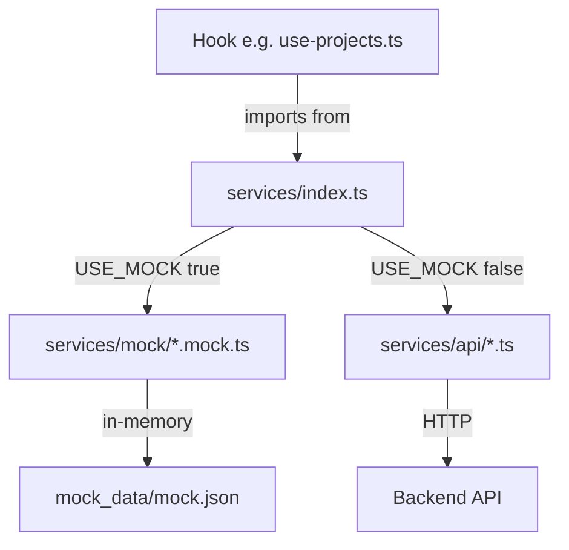
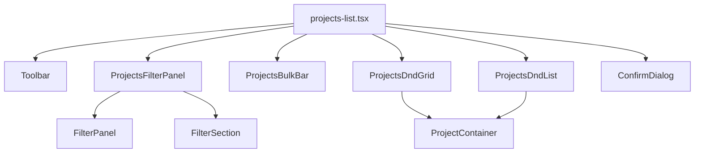
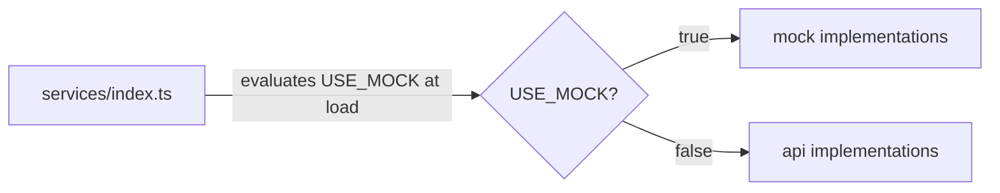

# Design Document: projects-shared-components

## Overview

This is a pure internal refactoring of `src/modules/projects/`. No user-visible behaviour changes.
The rendered output must be byte-for-byte identical before and after. The work covers three areas:

1. **Shared UI Components** — eight reusable primitives extracted into `components/shared/`
2. **File Splitting** — three god-files broken into focused single-export files
3. **Service Facade** — mock/API logic separated behind `services/index.ts`

All changes are confined to `src/modules/projects/`. No other module is touched.

---

## Architecture

### Current Structure (before)

```
src/modules/projects/
├── components/
│   ├── projects-list.tsx              # 563 lines — god file
│   ├── project.tsx
│   ├── project-status-tabs.tsx
│   ├── project-upload-sheet.tsx
│   └── project-detail/
│       ├── members/
│       │   ├── project-members.tsx    # 458 lines — god file
│       │   └── user-search-combobox.tsx
│       ├── project-task/
│       │   ├── project-task-details-sheet.tsx  # 407 lines — god file
│       │   ├── project-task-item.tsx
│       │   ├── project-task-upload.tsx
│       │   ├── project-tasks-kanban-board.tsx
│       │   ├── project-tasks-kanban-card.tsx
│       │   ├── project-tasks-list.tsx
│       │   ├── project-tasks-toolbar.tsx
│       │   ├── project-tasks.tsx
│       │   ├── attachments.tsx
│       │   └── attachement-preview.tsx
│       ├── settings/
│       │   └── project-settings.tsx
│       └── sprints/
│           ├── project-sprints.tsx
│           ├── sprint-card.tsx
│           └── sprint-upload-sheet.tsx
├── hooks/  (unchanged)
├── services/
│   ├── extraction/                    # mixed API + mock
│   │   ├── projects.ts
│   │   ├── project.ts
│   │   ├── project-tasks.ts
│   │   ├── project-creators.ts
│   │   └── project-sprints.ts
│   ├── mutations/                     # mixed API + mock
│   │   ├── project-upload.ts
│   │   ├── project-task-upload.ts
│   │   ├── project-task-deletion.ts
│   │   ├── project-task-comment.ts
│   │   ├── project-lifecycle.ts
│   │   ├── project-members.ts
│   │   ├── sprint-upload.ts
│   │   └── sprint-deletion.ts
│   └── mock/                          # unchanged
│       ├── projects.mock.ts
│       ├── project.mock.ts
│       ├── project-tasks.mock.ts
│       ├── project-sprints.mock.ts
│       └── mutations.mock.ts
```

### Target Structure (after)

```
src/modules/projects/
├── components/
│   ├── shared/                        # NEW — eight shared primitives
│   │   ├── toolbar.tsx
│   │   ├── filter-panel.tsx
│   │   ├── filter-section.tsx
│   │   ├── empty-state.tsx
│   │   ├── confirm-dialog.tsx
│   │   ├── dot-badge-option.tsx
│   │   ├── section-header.tsx
│   │   └── list-card.tsx
│   ├── projects-list.tsx              # ≤120 lines — orchestration only
│   ├── projects-filter-panel.tsx      # NEW — extracted filter content
│   ├── projects-bulk-bar.tsx          # NEW — extracted bulk-action bar
│   ├── projects-dnd-grid.tsx          # NEW — extracted DnD grid
│   ├── projects-dnd-list.tsx          # NEW — extracted DnD list
│   ├── project.tsx
│   ├── project-status-tabs.tsx
│   ├── project-upload-sheet.tsx
│   └── project-detail/
│       ├── members/
│       │   ├── project-members.tsx    # ≤80 lines — orchestration only
│       │   ├── members-list-card.tsx  # NEW
│       │   ├── invitations-list-card.tsx # NEW
│       │   ├── add-member-dialog.tsx  # NEW
│       │   ├── invite-by-email-dialog.tsx # NEW
│       │   └── user-search-combobox.tsx
│       ├── project-task/
│       │   ├── project-task-details-sheet.tsx  # ≤80 lines — orchestration only
│       │   ├── task-subtasks-section.tsx  # NEW
│       │   ├── task-attachments-section.tsx # NEW
│       │   ├── task-comments-section.tsx  # NEW
│       │   └── (all other files unchanged)
│       ├── settings/
│       └── sprints/
├── hooks/  (import paths updated to services/index.ts)
└── services/
    ├── api/                           # NEW — pure API, zero mock code
    │   ├── projects.ts
    │   ├── project.ts
    │   ├── project-tasks.ts
    │   ├── project-creators.ts
    │   ├── project-sprints.ts
    │   ├── project-upload.ts
    │   ├── project-task-upload.ts
    │   ├── project-task-deletion.ts
    │   ├── project-task-comment.ts
    │   ├── project-lifecycle.ts
    │   ├── project-members.ts
    │   ├── sprint-upload.ts
    │   └── sprint-deletion.ts
    ├── index.ts                       # NEW — Service Facade
    └── mock/                          # UNCHANGED
        ├── projects.mock.ts
        ├── project.mock.ts
        ├── project-tasks.mock.ts
        ├── project-sprints.mock.ts
        └── mutations.mock.ts
    # extraction/ and mutations/ DELETED after migration
```

---

## Components and Interfaces

### Area 1: Shared UI Components (`components/shared/`)

#### `toolbar.tsx` — Toolbar

```tsx
interface ToolbarProps {
  // Left slot — status/type tabs
  tabs?: React.ReactNode;

  // Search
  search: string;
  onSearchChange: (value: string) => void;
  searchPlaceholder?: string;

  // Filter dropdown
  filterContent?: React.ReactNode;
  activeFilterCount?: number;        // shows numeric Badge when > 0

  // View mode toggle
  viewMode?: "list" | "grid";
  onViewModeChange?: (mode: "list" | "grid") => void;

  // Right-side extra actions (e.g. FAB tooltip, settings dropdown)
  actions?: React.ReactNode;
}
```

Layout: `flex flex-col items-start justify-between gap-4 lg:flex-row lg:items-center`
Left side renders `tabs`. Right side renders search input, filter button (with Badge when
`activeFilterCount > 0`), view-mode ToggleGroup, and `actions`.

Consumers after refactor: `projects-list.tsx`, `project-sprints.tsx`, `project-tasks-toolbar.tsx`

---

#### `filter-panel.tsx` — FilterPanel

```tsx
interface FilterPanelProps {
  children: React.ReactNode;
  hasActiveFilters?: boolean;
  onClear?: () => void;
}
```

Renders `<div className="space-y-6 p-4">`. When `hasActiveFilters` is true, appends a
`Button variant="link"` with an `X` icon and "Clear Filters" label at the bottom.

---

#### `filter-section.tsx` — FilterSection

```tsx
interface FilterSectionProps {
  label: string;
  children: React.ReactNode;
}
```

Renders `<div className="space-y-3"><h4 className="text-sm font-medium">{label}</h4>{children}</div>`.

---

#### `empty-state.tsx` — EmptyState

```tsx
interface EmptyStateProps {
  message: string;
  description?: string;
}
```

Renders a `div` with `flex h-[calc(100vh-12rem)] flex-col items-center justify-center py-12 text-center`.
`message` is an `<h3 className="text-xl font-medium">`. Optional `description` is a `<p className="text-sm text-muted-foreground mt-2">`.

---

#### `confirm-dialog.tsx` — ConfirmDialog

```tsx
interface ConfirmDialogProps {
  open: boolean;
  onOpenChange: (open: boolean) => void;
  title: string;
  description: string;
  onConfirm: () => void;
  onCancel: () => void;
  confirmLabel?: string;   // default: "Confirm"
  cancelLabel?: string;    // default: "Cancel"
}
```

Wraps `AlertDialog`. The confirm `AlertDialogAction` always carries
`className="bg-destructive text-destructive-foreground hover:bg-destructive/90"`.

---

#### `dot-badge-option.tsx` — DotBadgeSelectItem + DotBadgeToggle

```tsx
interface DotBadgeSelectItemProps {
  value: string;
  dotColorClass: string;   // e.g. "bg-blue-500"
  label: string;
}

interface DotBadgeToggleProps {
  value: string;
  dotColorClass: string;
  label: string;
  pressed: boolean;
  onPressedChange: (pressed: boolean) => void;
}
```

`DotBadgeSelectItem` renders a `SelectItem` with `<span className={cn("size-2 rounded-full", dotColorClass)} />` and the label.
`DotBadgeToggle` renders a `Toggle variant="outline"` with the same dot + label pattern.

---

#### `section-header.tsx` — SectionHeader

```tsx
interface SectionHeaderProps {
  title: string;
  description?: string;
  actions?: React.ReactNode;
}
```

Renders:
```tsx
<div className="flex justify-between items-center">
  <div>
    <h2 className="text-xl font-semibold tracking-tight">{title}</h2>
    {description && <p className="text-sm text-muted-foreground">{description}</p>}
  </div>
  {actions && <div className="flex gap-2">{actions}</div>}
</div>
```

---

#### `list-card.tsx` — ListCard

```tsx
interface ListCardProps {
  avatar: React.ReactNode;
  primary: string;
  secondary: React.ReactNode;
  badge: React.ReactNode;
  actions: React.ReactNode;
}
```

Renders `<div className="flex items-center justify-between p-3 border rounded-lg hover:bg-muted/30 transition-colors">`.
Left side: avatar + `<div className="flex flex-col"><span>{primary}</span>{secondary}</div>`.
Right side: badge + actions.

---

### Area 2: Component File Splitting

#### `projects-list.tsx` splits

| New file | Extracted from | Props interface |
|---|---|---|
| `projects-filter-panel.tsx` | `renderFilterContent()` inline function | `{ sortBy, setSortBy, projectType, setProjectType, businessUnit, setBusinessUnit, isArchived, setIsArchived, paid, setPaid, createdById, setCreatedById, currentUserId, creators, onClear }` |
| `projects-bulk-bar.tsx` | Selection checkbox + bulk-action Select bar | `{ projects, selectedIds, onToggleSelectAll, onClearSelection, onBulkStatusChange, onBulkArchive, onBulkRestore, onBulkDelete }` |
| `projects-dnd-grid.tsx` | DnD grid with `SortableContext` + `rectSortingStrategy` | `{ projects, sensors, activeId, selectedIds, selectionActive, onSelect, onEdit, onDelete, onArchive, onStatusChange, onDragStart, onDragEnd, onDragCancel }` |
| `projects-dnd-list.tsx` | DnD list with `SortableContext` + `restrictToVerticalAxis` | Same as `projects-dnd-grid.tsx` |

After extraction `projects-list.tsx` becomes a ≤120-line orchestrator that:
1. Calls `useProjects()` and `useProjectActions()`
2. Manages `selectedIds`, `editProject`, `projectToDelete` state
3. Renders `<Toolbar>`, `<ProjectsBulkBar>`, `<ProjectsDndGrid>` or `<ProjectsDndList>`, pagination, `<ProjectUploadSheet>`, `<ConfirmDialog>`

---

#### `project-members.tsx` splits

| New file | Extracted from | Props interface |
|---|---|---|
| `members-list-card.tsx` | Active members `<Card>` with rows | `{ members, onUpdateRole, onRemoveMember, isPending }` |
| `invitations-list-card.tsx` | Pending invitations `<Card>` with rows | `{ invitations, onResend, onRevoke, isPending }` |
| `add-member-dialog.tsx` | Add Member `<Dialog>` + `addMemberSchema` + form | `{ open, onOpenChange, projectId, isPending }` |
| `invite-by-email-dialog.tsx` | Invite by Email `<Dialog>` + `inviteSchema` + form | `{ open, onOpenChange, projectId, isPending }` |

After extraction `project-members.tsx` becomes a ≤80-line orchestrator that:
1. Calls `useProjectMembers()` and `useProjectInvitations()`
2. Manages dialog open state and confirm state
3. Renders `<SectionHeader>`, `<MembersListCard>`, `<InvitationsListCard>`, `<AddMemberDialog>`, `<InviteByEmailDialog>`, two `<ConfirmDialog>` instances

---

#### `project-task-details-sheet.tsx` splits

| New file | Extracted from | Props interface |
|---|---|---|
| `task-subtasks-section.tsx` | Subtasks list + inline add form | `{ projectId, task, onSubTaskDeleted }` |
| `task-attachments-section.tsx` | Attachments list + preview trigger | `{ attachments, onViewAttachment }` |
| `task-comments-section.tsx` | Comments list + comment form | `{ projectId, taskId, comments }` |

After extraction `project-task-details-sheet.tsx` becomes a ≤80-line orchestrator that:
1. Manages `isDeleteTaskOpen`, `previewUrl`, `isPreviewOpen` state
2. Renders `<Sheet>` with header badges, description, metadata grid
3. Renders `<TaskSubtasksSection>`, `<TaskAttachmentsSection>`, `<TaskCommentsSection>`
4. Renders `<DeletionConfirmationDialog>` for the task itself

---

### Area 3: Service Facade Pattern

#### `services/api/` — Pure API files

Each file in `services/api/` is a direct copy of the corresponding `extraction/` or `mutations/` file
with all mock-related lines removed:

- No `import { USE_MOCK }` statement
- No `if (USE_MOCK()) return ...` conditional
- No `import ... from "../mock/..."` statement
- No `// REMOVE THIS LINE FOR PROD` comments

Example — `services/api/projects.ts`:

```ts
import { GET } from "@/lib/http-methods";
import extractJWTokens from "@/modules/auth/utils/jwt/extract-tokens";
import { refreshToken } from "@/modules/auth/services/refresh-token";
import { ProjectType, ProjectInResponseType } from "@/modules/projects/types/projects";
import { castProjectToFrontend } from "@/modules/projects/types/cast-project";
import { PaginationType } from "@/types/pagination";

interface Params { page: number; limit?: number; name?: string; status?: string;
  businessUnit?: string; paid?: boolean; sortBy?: string; }

export default async function retrieveProjects(
  params: Params
): Promise<{ data: ProjectType[]; pagination: PaginationType } | null> {
  const { access } = extractJWTokens();
  const headers = { Authorization: `Bearer ${access}` };
  const query = new URLSearchParams();
  query.append("page", String(params.page));
  if (params.limit)        query.append("limit", String(params.limit));
  if (params.name)         query.append("name", params.name);
  if (params.status)       query.append("status", params.status);
  if (params.businessUnit) query.append("businessUnit", params.businessUnit);
  if (params.paid !== undefined) query.append("paid", String(params.paid));
  if (params.sortBy)       query.append("sortBy", params.sortBy);
  try {
    const res = await GET(`/projects?${query.toString()}`, headers);
    return {
      data: (res.data.data as ProjectInResponseType[]).map(castProjectToFrontend),
      pagination: res.data.pagination as PaginationType,
    };
  } catch (error: any) {
    if (error?.response?.status === 401)
      return await refreshToken(() => retrieveProjects(params)) ?? null;
    return null;
  }
}
```

#### `services/index.ts` — Service Facade

The facade is the single file that imports from both `api/` and `mock/` and re-exports the correct
implementation per function based on `USE_MOCK()`.

```ts
// services/index.ts
import { USE_MOCK } from "@/lib/mock-config";

// ── Extraction ──────────────────────────────────────────────────────────────
import retrieveProjectsApi       from "./api/projects";
import retrieveProjectByIdApi    from "./api/project";
import retrieveProjectTasksApi   from "./api/project-tasks";
import retrieveProjectCreatorsApi from "./api/project-creators";
import retrieveProjectSprintsApi from "./api/project-sprints";

import { mockRetrieveProjects }       from "./mock/projects.mock";
import { mockRetrieveProjectById }    from "./mock/project.mock";
import { mockRetrieveProjectTasks }   from "./mock/project-tasks.mock";
import { mockRetrieveProjectSprints } from "./mock/project-sprints.mock";

export const retrieveProjects        = USE_MOCK() ? mockRetrieveProjects       : retrieveProjectsApi;
export const retrieveProjectById     = USE_MOCK() ? mockRetrieveProjectById    : retrieveProjectByIdApi;
export const retrieveProjectTasks    = USE_MOCK() ? mockRetrieveProjectTasks   : retrieveProjectTasksApi;
export const retrieveProjectCreators = USE_MOCK() ? () => Promise.resolve([])  : retrieveProjectCreatorsApi;
export const retrieveProjectSprints  = USE_MOCK() ? mockRetrieveProjectSprints : retrieveProjectSprintsApi;

// ── Mutations ───────────────────────────────────────────────────────────────
import { uploadProject as uploadProjectApi }               from "./api/project-upload";
import uploadProjectTaskApi                                from "./api/project-task-upload";
import { deleteProjectTask as deleteProjectTaskApi }       from "./api/project-task-deletion";
import { addProjectTaskComment as addCommentApi,
         deleteProjectTaskComment as deleteCommentApi }    from "./api/project-task-comment";
import { archiveProject as archiveApi,
         restoreProject as restoreApi,
         deleteProject as deleteProjectApi }               from "./api/project-lifecycle";
import { addProjectMember as addMemberApi,
         updateProjectMemberRole as updateRoleApi,
         removeProjectMember as removeMemberApi,
         createProjectInvitation as createInviteApi,
         deleteProjectInvitation as deleteInviteApi,
         resendProjectInvitation as resendInviteApi }      from "./api/project-members";
import { uploadSprint as uploadSprintApi }                 from "./api/sprint-upload";
import { deleteSprint as deleteSprintApi }                 from "./api/sprint-deletion";

import { mockUploadProject, mockUploadProjectTask,
         mockDeleteProjectTask, mockAddProjectTaskComment,
         mockDeleteProjectTaskComment, mockUploadSprint }  from "./mock/mutations.mock";

export const uploadProject            = USE_MOCK() ? mockUploadProject            : uploadProjectApi;
export const uploadProjectTask        = USE_MOCK() ? mockUploadProjectTask        : uploadProjectTaskApi;
export const deleteProjectTask        = USE_MOCK() ? mockDeleteProjectTask        : deleteProjectTaskApi;
export const addProjectTaskComment    = USE_MOCK() ? mockAddProjectTaskComment    : addCommentApi;
export const deleteProjectTaskComment = USE_MOCK() ? mockDeleteProjectTaskComment : deleteCommentApi;
export const archiveProject           = USE_MOCK() ? () => Promise.resolve({} as any) : archiveApi;
export const restoreProject           = USE_MOCK() ? () => Promise.resolve({} as any) : restoreApi;
export const deleteProject            = USE_MOCK() ? () => Promise.resolve()      : deleteProjectApi;
export const addProjectMember         = USE_MOCK() ? () => Promise.resolve({} as any) : addMemberApi;
export const updateProjectMemberRole  = USE_MOCK() ? () => Promise.resolve({} as any) : updateRoleApi;
export const removeProjectMember      = USE_MOCK() ? () => Promise.resolve()      : removeMemberApi;
export const createProjectInvitation  = USE_MOCK() ? () => Promise.resolve({} as any) : createInviteApi;
export const deleteProjectInvitation  = USE_MOCK() ? () => Promise.resolve()      : deleteInviteApi;
export const resendProjectInvitation  = USE_MOCK() ? () => Promise.resolve({} as any) : resendInviteApi;
export const uploadSprint             = USE_MOCK() ? mockUploadSprint             : uploadSprintApi;
export const deleteSprint             = USE_MOCK() ? () => Promise.resolve()      : deleteSprintApi;
```

> Note: `USE_MOCK()` is evaluated once at module load time. This is intentional — the selection is
> static per process, matching the existing pattern in the codebase.

---

## Data Models

No new data models are introduced. All types remain in `src/modules/projects/types/`. The shared
components accept the existing `ProjectType`, `ProjectTaskType`, `SprintType`, and member/invitation
types as props where needed.

The only structural change is that extracted sub-components receive slices of the parent's state as
props rather than reading from hooks directly, keeping hooks at the orchestrator level.

---

## Data Flow

### Hooks → Facade → API/Mock



### Component Composition (projects-list example)



### Service Facade Selection



---

## Migration Notes

### Hook import updates

Every hook that currently imports from `extraction/` or `mutations/` must be updated to import from
`services/index.ts`. The function signatures are identical — only the import path changes.

| Hook file | Old import | New import |
|---|---|---|
| `hooks/projects/use-projects.ts` | `../../services/extraction/projects` | `../../services` |
| `hooks/projects/use-projects.ts` | `../../services/extraction/project-creators` | `../../services` |
| `hooks/projects/use-project.ts` | `../../services/extraction/project` | `../../services` |
| `hooks/projects/use-project-upload.ts` | `../../services/mutations/project-upload` | `../../services` |
| `hooks/projects/use-project-actions.ts` | `../../services/mutations/project-lifecycle` | `../../services` |
| `hooks/tasks/use-project-tasks.ts` | `../../services/extraction/project-tasks` | `../../services` |
| `hooks/tasks/use-project-task-upload.ts` | `../../services/mutations/project-task-upload` | `../../services` |
| `hooks/tasks/use-project-task-comment.ts` | `../../services/mutations/project-task-comment` | `../../services` |
| `hooks/members/use-project-members.ts` | `../../services/mutations/project-members` | `../../services` |
| `hooks/members/use-project-invitations.ts` | `../../services/mutations/project-members` | `../../services` |
| `hooks/sprints/use-project-sprints.ts` | `../../services/extraction/project-sprints` | `../../services` |
| `hooks/sprints/use-sprint-upload.ts` | `../../services/mutations/sprint-upload` | `../../services` |

### Direct service imports in components

Two component files currently import service functions directly (bypassing hooks). These must also
be updated:

| Component | Old import | New import |
|---|---|---|
| `project-task-details-sheet.tsx` | `../../services/mutations/project-task-deletion` | `../../../services` |
| `project-detail/sprints/project-sprints.tsx` | `../../services/mutations/sprint-deletion` | `../../../services` |

After all hooks and components are migrated, `services/extraction/` and `services/mutations/` are
deleted.

### Removing mock support (future)

To strip mock support entirely from a production build:
1. Delete `services/mock/`
2. Remove the mock branch from `services/index.ts` (delete all `USE_MOCK() ?` ternaries, keep the API side)
3. Delete `src/lib/mock-config.ts`

No other file requires modification.

---

## Correctness Properties

*A property is a characteristic or behavior that should hold true across all valid executions of a
system — essentially, a formal statement about what the system should do. Properties serve as the
bridge between human-readable specifications and machine-verifiable correctness guarantees.*

### Property 1: Toolbar renders all provided props

*For any* combination of `search` string, `filterContent` ReactNode, `activeFilterCount` integer,
`viewMode` string, and `actions` ReactNode passed to `Toolbar`, the rendered output should contain:
the search input with the given value, the filter button when `filterContent` is provided, a Badge
showing `activeFilterCount` when it is greater than zero, the view-mode ToggleGroup when `viewMode`
is provided, and the `actions` content when provided.

**Validates: Requirements 1.2, 1.3, 1.4, 1.5, 1.6**

---

### Property 2: FilterPanel renders children and conditional clear button

*For any* `children` ReactNode and `hasActiveFilters` boolean passed to `FilterPanel`, the rendered
output should always contain the children, and should contain the "Clear Filters" button if and only
if `hasActiveFilters` is `true`.

**Validates: Requirements 2.2, 2.3**

---

### Property 3: FilterSection renders label above children

*For any* `label` string and `children` ReactNode passed to `FilterSection`, the rendered output
should contain an `h4` element with the exact label text, and the children should appear below it.

**Validates: Requirements 2.4**

---

### Property 4: EmptyState renders message and optional description

*For any* `message` string and optional `description` string passed to `EmptyState`, the rendered
output should always contain the message text, and should contain the description text if and only
if `description` is provided.

**Validates: Requirements 3.2, 3.3**

---

### Property 5: ConfirmDialog renders destructive action with correct labels

*For any* `title`, `description`, `confirmLabel`, and `cancelLabel` strings passed to `ConfirmDialog`
with `open=true`, the rendered output should contain the title, description, a confirm button with
the destructive CSS classes, and the correct labels (defaulting to "Confirm" and "Cancel" when not
provided).

**Validates: Requirements 4.3, 4.5, 4.6**

---

### Property 6: DotBadge components render dot and label

*For any* `dotColorClass` and `label` strings passed to `DotBadgeSelectItem` or `DotBadgeToggle`,
the rendered output should contain a `span` element with the given color class and the label text.

**Validates: Requirements 5.2, 5.3**

---

### Property 7: SectionHeader renders title and conditional slots

*For any* `title` string, optional `description` string, and optional `actions` ReactNode passed to
`SectionHeader`, the rendered output should always contain the title in an `h2`, and should contain
the description paragraph and actions slot if and only if they are provided.

**Validates: Requirements 6.2, 6.3, 6.4**

---

### Property 8: ListCard renders primary text

*For any* `primary` string passed to `ListCard`, the rendered output should contain that string.

**Validates: Requirements 7.2**

---

### Property 9: API service files contain no mock code

*For any* file in `services/api/`, the file's source text should not contain the strings
`USE_MOCK`, `mock`, or `REMOVE THIS LINE FOR PROD`.

**Validates: Requirements 10.2**

---

### Property 10: Service facade selects correct implementation

*For any* service function exported from `services/index.ts`, when `USE_MOCK()` returns `true` the
exported function should be the mock implementation, and when `USE_MOCK()` returns `false` the
exported function should be the API implementation. These two cases are mutually exclusive and
exhaustive.

**Validates: Requirements 10.5, 10.6**

---

### Property 11: Hooks import services only from the facade

*For any* hook file in `hooks/`, its import statements should not reference `services/api/` or
`services/mock/` or `services/extraction/` or `services/mutations/` directly — only
`services/index.ts` (or the barrel `services`).

**Validates: Requirements 10.7**

---

### Property 12: No file imports from both api and mock simultaneously

*For any* file outside `services/index.ts`, its import statements should not reference both
`services/api/` and `services/mock/` in the same file.

**Validates: Requirements 10.8**

---

## Error Handling

Since this is a pure refactoring, error handling behaviour is preserved exactly as-is:

- All API service functions retain their existing `try/catch` with `401 → refreshToken` retry logic.
- Mock functions retain their existing no-op or in-memory behaviour.
- Component error states (`projectsError`, `sprintsError`) continue to render `<Error500 />`.
- Toast notifications for mutations remain in the same hooks/components that currently own them.

No new error paths are introduced. The `ConfirmDialog` component does not own error handling — that
remains the responsibility of the caller's `onConfirm` handler.

---

## Testing Strategy

### Dual Testing Approach

Both unit tests and property-based tests are required. They are complementary:

- **Unit tests** verify specific examples, integration points, and edge cases.
- **Property tests** verify universal properties across randomly generated inputs.

### Unit Tests

Focus areas:

- Smoke-render each shared component with minimal required props (confirms no crash, correct DOM structure)
- `ConfirmDialog` with and without `confirmLabel`/`cancelLabel` (default label edge cases)
- `services/index.ts` — verify the correct branch is selected based on a mocked `USE_MOCK()` return value
- Integration: `ProjectsFilterPanel` renders inside a `FilterPanel` + `FilterSection` structure

### Property-Based Tests

Use **fast-check** (already available in the JS ecosystem and compatible with Vitest/Jest).
Each property test runs a minimum of **100 iterations**.

Tag format: `// Feature: projects-shared-components, Property {N}: {property_text}`

| Property | Test description | Generator inputs |
|---|---|---|
| P1 | Toolbar renders all provided props | `fc.string()`, `fc.integer({min:0,max:20})`, `fc.constantFrom("list","grid")` |
| P2 | FilterPanel clear button conditional | `fc.boolean()`, arbitrary ReactNode children |
| P3 | FilterSection label in h4 | `fc.string({minLength:1})` |
| P4 | EmptyState message + optional description | `fc.string()`, `fc.option(fc.string())` |
| P5 | ConfirmDialog labels and destructive class | `fc.string()`, `fc.option(fc.string())` |
| P6 | DotBadge dot and label | `fc.string()`, `fc.string()` |
| P7 | SectionHeader title + conditional slots | `fc.string()`, `fc.option(fc.string())` |
| P8 | ListCard primary text | `fc.string({minLength:1})` |
| P9 | API files contain no mock code | Static analysis over file contents (read files, assert no forbidden strings) |
| P10 | Facade selects correct implementation | Mock `USE_MOCK` return value, assert exported function identity |
| P11 | Hooks import only from facade | Static analysis over hook file import statements |
| P12 | No dual api+mock imports | Static analysis over all non-facade files |

Each property-based test must include a comment referencing its design property:

```ts
// Feature: projects-shared-components, Property 1: Toolbar renders all provided props
it("toolbar renders search input with given value", () => {
  fc.assert(fc.property(fc.string(), (search) => {
    const { getByDisplayValue } = render(<Toolbar search={search} onSearchChange={() => {}} />);
    expect(getByDisplayValue(search)).toBeInTheDocument();
  }), { numRuns: 100 });
});
```
