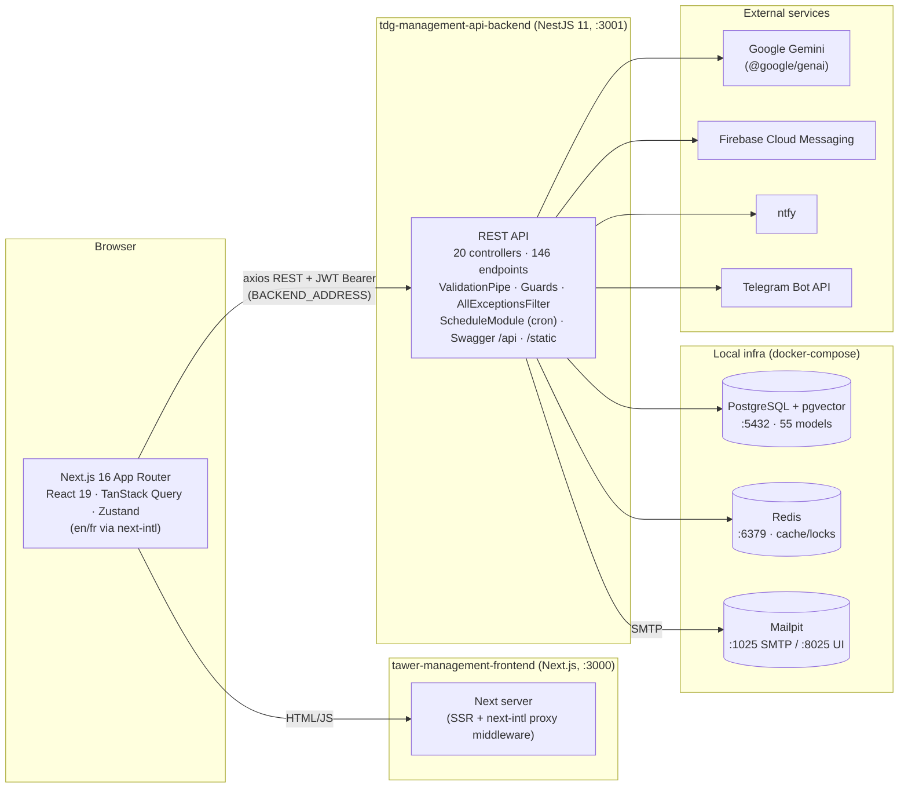
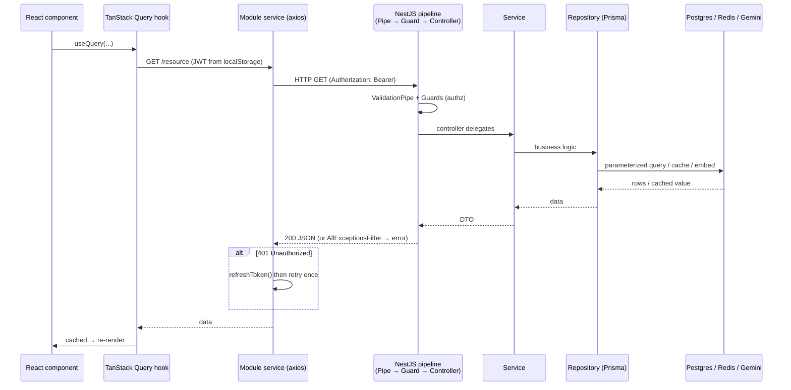

# Dossier 00 — System Overview & Architecture

> Whole-system map, high level only. Per-module depth is deferred to dossiers 01–16.
> Every claim below is cited to a file it was read from. Counts were produced by
> grepping the source, not estimated.

## 1. Identity

- **One-line purpose.** A full-stack internal management platform ("Tawer MNG") combining
  project/agile task management, personal to-dos, time & attendance, calendar/events,
  reminders, multi-channel notifications, infrastructure monitoring, and an AI (RAG) copilot
  with size-aware estimation.
- **Two-app monorepo** (one git repo, two independent Node projects):
  - Backend: `tdg-management-api-backend/` — NestJS 11 REST API.
  - Frontend: `tawer-management-frontend/` — Next.js 16 (App Router) web client.
- **Backend source root:** `tdg-management-api-backend/src/` (20 feature module folders +
  `common/`), schema in `tdg-management-api-backend/prisma/schema/`.
- **Frontend source root:** `tawer-management-frontend/src/` (`app/` router + 10 `modules/`).
- **Owned DB tables/models:** 55 Prisma models across 15 schema files (this dossier only
  inventories them; the authoritative ERD is Dossier 02).

## 2. Purpose & business problem

The system is the internal operations platform for a digital agency/team. It serves several
real workflows in one app: managing client **projects** and their **agile backlog**
(epics → sprints → tasks, milestones), tracking **personal to-dos**, recording **work
sessions** (check-in/out attendance), scheduling **events/meetings** on a calendar, sending
**reminders** and **notifications** across channels (in-app, push, ntfy, telegram, email),
**monitoring servers/services** health, and — the project's differentiator — an **AI copilot**
that answers questions grounded in project content (RAG) and estimates task effort.

The two-app split is deliberate: a stateless JSON API (NestJS) usable by any client, and a
separate Next.js UI. The API is documented via Swagger at `/api`
([main.ts:28-37](tdg-management-api-backend/src/main.ts:28)).

## 3. Domain model & database (inventory only)

The schema is split into **15 `*.prisma` files** by domain under
[prisma/schema/](tdg-management-api-backend/prisma/schema). Datasource is **PostgreSQL**
([main.schema.prisma:5-7](tdg-management-api-backend/prisma/schema/main.schema.prisma:5)) with
the **pgvector** extension provided by the Postgres image
([docker-compose.yml:19](docker-compose.yml:19)) for the AI embedding tables. The Prisma client
uses the **`@prisma/adapter-pg`** driver adapter
([package.json:48](tdg-management-api-backend/package.json:48)).

**Verified totals:** 55 `model` blocks and 25 `enum` blocks across the schema files (grep of
`prisma/schema`). Grouping by schema file (model count / enum count):

| Schema file | Models | Enums | Domain (owning dossier) |
|---|---|---|---|
| `agile.schema.prisma` | 16 | 4 | Sprints, Tasks (+comments/likes/mentions/labels/deps/time), Epics, Milestones, ProjectTaskStatus → D06/D07 |
| `user.schema.prisma` | 7 | 1 | User, UserManager, UserTeam, Team, Role, UserTelegramBot, UserNtfyIntegration → D04 |
| `servers.schema.prisma` | 5 | 1 | Server, Service, Server/ServiceNotification, UserServerManagement → D13 |
| `notification.schema.prisma` | 5 | 1 | Notification, NotificationContent, NotificationToken, UserNotification, UserNotificationSettings → D12 |
| `projects.schema.prisma` | 4 | 4 | Project, ProjectContent, ProjectMember, ProjectInvitation → D05 |
| `user-tasks.schema.prisma` | 4 | 2 | UserTask (+content/comment/attachment) → D08 |
| `events.schema.prisma` | 3 | 2 | Event, EventContent, EventParticipant → D10 |
| `ai.schema.prisma` | 3 | 3 | DocumentEmbedding, IndexOutbox, CopilotQueryLog → D14 |
| `auth.schema.prisma` | 2 | 0 | RefreshToken, ResetPasswordCode → D03 |
| `work-sessions.schema.prisma` | 2 | 2 | WorkDay, WorkSession → D09 |
| `reminders.schema.prisma` | 2 | 3 | Reminder, ReminderChannel → D11 |
| `locking.schema.prisma` | 1 | 0 | Locking → D01 |
| `errors.schema.prisma` | 1 | 1 | ErrorLog → D01 |
| `language.schema.prisma` | 0 | 1 | `Language` enum (shared) |
| `main.schema.prisma` | 0 | 0 | generator + datasource only |

A recurring design pattern is the **content-table split** (`ProjectContent`, `TaskContent`,
`SprintContent`, `EventContent`, `NotificationContent`, `UserTaskContent`) — the mutable/
translatable text is separated from the parent row. The *why* (i18n vs versioning) is verified
in Dossier 02, not asserted here.

## 4. Backend architecture (conventions)

NestJS 11 with a **layered, per-feature module** convention documented in the backend README
([README.md:59-136](tdg-management-api-backend/README.md:59)): each feature folder has
`controllers/` → `services/` → `repositories/` (Prisma access) + `dto/` + `types/`. All feature
modules are wired into the root [app.module.ts:35-81](tdg-management-api-backend/src/app.module.ts:35).

Cross-cutting concerns visible from the root module (detail deferred to D01/D03):
- **Global validation:** `ValidationPipe({ transform: true })` with a custom exception factory
  emitting `INVALID_DATA` ([main.ts:12-25](tdg-management-api-backend/src/main.ts:12)).
- **Global exception filter:** `AllExceptionsFilter` registered as `APP_FILTER`
  ([app.module.ts:74-79](tdg-management-api-backend/src/app.module.ts:74)).
- **Scheduling:** `ScheduleModule.forRoot()` ([app.module.ts:37](tdg-management-api-backend/src/app.module.ts:37))
  for cron jobs (reminders, AI index sweeper, health checks).
- **Config:** global `ConfigModule` from `.env` ([app.module.ts:38-41](tdg-management-api-backend/src/app.module.ts:38)).
- **Static files:** `ServeStaticModule` serves `static/` at `/static`
  ([app.module.ts:48-54](tdg-management-api-backend/src/app.module.ts:48)).
- **CORS** enabled app-wide ([main.ts:9](tdg-management-api-backend/src/main.ts:9)).
- **`common/`** holds shared providers: `prisma`, `redis`, `bcrypt`, `gemini`, `mail`, `ntfy`,
  `telegram`, `firebase`, `slugify`, `time`, `logger`, `filters`, `pipes`, `upload`
  (dir listing of `src/common/`).

Server listens on `process.env.PORT ?? 3000`
([main.ts:39](tdg-management-api-backend/src/main.ts:39)); the dev launch config runs it on
**3001** ([.claude/launch.json](.claude/launch.json)), which is what the frontend targets.

## 5. API surface (inventory, not per-endpoint)

**Verified:** 146 route handlers (`@Get/@Post/@Put/@Patch/@Delete`) across **20 controllers**
(grep of `src/**/*.controller.ts`). Per-endpoint tables (DTOs, guards, side effects) belong to
the domain dossiers; here is the controller → endpoint-count map:

| Backend module | Controller(s) | Endpoints | Frontend module | Dossier |
|---|---|---|---|---|
| `auths` | `auths.controller` | 6 | `modules/auth` | D03 |
| `tokens` | `tokens.controller` | 2 | (shared) | D03 |
| `users` | `users.controller` | 10 | `modules/users` | D04 |
| `teams` | `teams.controller` | 4 | `modules/users` | D04 |
| `projects` | `projects.controller` | 17 | `modules/projects` | D05 |
| `epics` | `epics.controller` | 5 | `modules/projects` | D06 |
| `sprints` | `sprints.controller` | 7 | `modules/projects` | D06 |
| `milestones` | `milestones.controller` | 7 | `modules/projects` | D06 |
| `tasks` | `tasks.controller` (33) + `user-tasks.controller` (2) | 35 | `modules/tasks` | D07 |
| `personal-tasks` | `personal-tasks.controller` | 7 | `todo-list` pages | D08 |
| `work-days` | `work-days.controller` | 11 | `modules/tracking` | D09 |
| `events` | `events.controller` | 4 | `modules/events` | D10 |
| `reminders` | `reminders.controller` (5) + `user-reminders.controller` (2) | 7 | `modules/reminders` | D11 |
| `notifications` | `notifications.controller` | 6 | `modules/notifications` | D12 |
| `servers` | `servers.controller` | 10 | `modules/infrastructure` | D13 |
| `health` | `health.controller` | 1 | — | D16 |
| `ai` | `ai.controller` | 4 | `modules/ai` | D14 |
| `logs` | `logs.controller` | 3 | — | D01 |
| **Total** | **20 controllers** | **146** | | |

The one endpoint read in full is the health check: `GET /health` returning `{status, timestamp}`
([health.controller.ts:7-23](tdg-management-api-backend/src/health/controller/health.controller.ts:7)).

## 6. Frontend (organization)

Next.js 16 App Router ([package.json:97](tawer-management-frontend/package.json:97)), React 19
([package.json:101](tawer-management-frontend/package.json:101)). Structure under `src/`:

- **`app/[locale]/`** — locale-prefixed routing with two route groups:
  `(guest)/` (login, register, forgot-password) and `dashboard/(auth)/` (all authenticated
  pages: projects, kanban, calendar, todo-list, users/teams, infrastructure, notifications,
  ai-chat-v2, account-settings, …) (dir tree of `src/app`).
- **`modules/`** — 10 feature modules (`ai`, `auth`, `events`, `infrastructure`,
  `notifications`, `projects`, `reminders`, `tasks`, `tracking`, `users`), each with
  `components/ hooks/ services/` (dir listing).
- **`i18n/`** — next-intl ([package.json:98](tawer-management-frontend/package.json:98)) with
  locales **`en` / `fr`**, default `en`, prefix always
  ([routing.ts:4-9](tawer-management-frontend/src/i18n/routing.ts:4)).
- **`lib/`** — `http-methods.ts` (axios wrapper), `firebase.ts`, `parse-backend-date.ts`,
  `localstorage.ts`, `logger.ts`, `themes.ts`.

Key libraries (from `package.json`): **TanStack Query** for server state
([:55](tawer-management-frontend/package.json:55)), **Zustand** for client state
([:122](tawer-management-frontend/package.json:122)), **react-hook-form + Zod** for forms
([:106](tawer-management-frontend/package.json:106), [:121](tawer-management-frontend/package.json:121)),
Radix UI + Tailwind v4 for UI, FullCalendar (calendar), dnd-kit / @hello-pangea/dnd (kanban),
Tiptap (rich text), Firebase (web push).

**Data path:** the frontend calls the backend **directly from the browser** via an axios client
whose `baseURL` is `process.env.BACKEND_ADDRESS` (`http://localhost:3001`, inlined at build via
`next.config.ts` `env`) — [http-methods.ts:3-9](tawer-management-frontend/src/lib/http-methods.ts:3),
[next.config.ts:9](tawer-management-frontend/src/next.config.ts:9). There are **no Next.js
`app/api` route handlers** (none found); Next's `proxy.ts` middleware only runs next-intl
locale handling ([proxy.ts:8-49](tawer-management-frontend/src/proxy.ts:8)). Auth is a JWT
pulled from local storage and sent as `Authorization: Bearer …`, with a single refresh-token
retry on HTTP 401 (canonical example: [copilot.ts:48-68](tawer-management-frontend/src/modules/ai/services/api/copilot.ts:48)).

## 7. Data flow & key scenario (end-to-end request lifecycle)

A typical authenticated read, e.g. loading a project's tasks:

1. A dashboard page renders a component that calls a **TanStack Query** hook.
2. The hook invokes a module **service** (`modules/*/services/api/*.ts`) which calls
   `GET/POST/...` from [lib/http-methods.ts](tawer-management-frontend/src/lib/http-methods.ts),
   attaching the JWT from local storage.
3. Axios sends an HTTP request from the browser to the NestJS API at
   `BACKEND_ADDRESS` (`:3001`).
4. NestJS runs the **global `ValidationPipe`**, then the route's **guards** (auth / permission),
   reaches the **controller**, which delegates to a **service**, which calls a **repository**
   using **`PrismaService`**.
5. Prisma issues parameterized SQL to **Postgres**; **Redis** may serve/populate cache; the AI
   path additionally calls **Gemini** and pgvector.
6. Errors anywhere are normalized by the **`AllExceptionsFilter`**; the JSON response flows back
   up to the axios client, TanStack Query caches it, and React re-renders.
7. On a 401, the service transparently calls `refreshToken(...)` and retries once.

## 8. Diagrams (Mermaid)

### 8.1 System component / deployment diagram

### 8.2 Request lifecycle (authenticated read)

## 9. Security (system-level touchpoints only)

- **AuthN:** JWT (`@nestjs/jwt` [package.json:42](tdg-management-api-backend/package.json:42));
  `RefreshToken` / `ResetPasswordCode` models; passwords hashed with **bcrypt**
  ([package.json:51](tdg-management-api-backend/package.json:51)). Detail → D03.
- **AuthZ:** guard/decorator based (per-controller `@UseGuards`), enforced in the NestJS
  pipeline before controllers. Detail → D03.
- **Input validation:** global `ValidationPipe` with `transform: true` and DTO whitelisting via
  `class-validator` ([main.ts:12-25](tdg-management-api-backend/src/main.ts:12)).
- **Injection protection:** all DB access is through Prisma (parameterized) — no raw string SQL
  seen at the app layer (verified per-module in domain dossiers).
- **Transport / gaps (system level):** CORS is `enableCors()` with no allow-list
  ([main.ts:9](tdg-management-api-backend/src/main.ts:9)); Firebase web keys and a very long
  token expiry example (`1200d`, README) appear in committed config — flagged here, assessed in
  D03/D16. Frontend stores JWT in local storage ([copilot.ts:52](tawer-management-frontend/src/modules/ai/services/api/copilot.ts:52)).

## 10. Cross-module dependencies (system level)

- The backend root module imports every feature module plus shared providers
  ([app.module.ts:35-73](tdg-management-api-backend/src/app.module.ts:35)); features depend on
  `common/*` (Prisma, Redis, Gemini, Mail, Bcrypt, Telegram, Lock-management) via NestJS DI.
- The `User` model is the central hub referenced by nearly every domain (tasks, projects,
  work-sessions, notifications, reminders, servers) — high fan-in, expected for this app class.
- Frontend↔backend coupling is purely HTTP/JSON over `BACKEND_ADDRESS`; no shared code between
  the two apps (separate `package.json`, no workspace linking).

## 11. Tests (system level)

- **Backend:** Jest configured (`test`, `test:cov`, `test:e2e`
  [package.json:27-31](tdg-management-api-backend/package.json:27)); `.spec.ts` conventions
  described in README. Plus a dedicated **AI eval harness** (`ai:eval:*` scripts
  [package.json:21-25](tdg-management-api-backend/package.json:21)) — retrieval / QA / estimation /
  faithfulness. Coverage per module → domain dossiers; AI harness → D14.
- **Frontend:** Vitest (`test`, `test:watch` [package.json:10-11](tawer-management-frontend/package.json:10))
  with `fast-check` (property tests) and `@playwright/test` present in devDependencies.
- Actual test count/coverage **Not verified** here (see §16).

## 12. Code quality (system level)

- **Consistent modular convention** across all 20 backend features
  (controller→service→repository→dto) — a strength, documented and followed
  ([README.md:115-136](tdg-management-api-backend/README.md:115)).
- **Strong typing / validation discipline:** DTO validation is global, and the AI service files
  are heavily documented (e.g. [copilot.ts](tawer-management-frontend/src/modules/ai/services/api/copilot.ts)
  has thorough JSDoc) — indicates recent, careful work.
- **Rough edge:** the backend `package.json` name is `laporta-di-roma-api` and the README is the
  generic NestJS/"La Porta di Roma" boilerplate ([README.md:143-186](tdg-management-api-backend/README.md:143)) —
  stale/borrowed scaffolding, not reflecting this project.

## 13. Verified technical debt (system level, cited)

1. **Backend identity is stale boilerplate.** `package.json` name `laporta-di-roma-api` and a
   self-referential dependency `"laporta-di-roma-api": "file:"`
   ([package.json:2,62](tdg-management-api-backend/package.json:2)); README env sample references
   La Porta di Roma / PayPal / Facebook OAuth unrelated to this platform
   ([README.md:143-186](tdg-management-api-backend/README.md:143)).
2. **Port confusion in docs.** README says the app runs on `:3000`
   ([README.md:148,217](tdg-management-api-backend/README.md:148)) but the actual dev port is
   `:3001` (launch.json + `main.ts` default `3000` overridden by env) — a reader following the
   README would mis-target the API.
3. **Dead middleware.** `proxy.ts` has the entire private-access / external-auth middleware
   commented out ([proxy.ts:4-6,22-32](tawer-management-frontend/src/proxy.ts:4)); route
   protection is not enforced at the Next middleware layer (only client-side/API guards).
4. **Committed secrets in `next.config.ts`.** Firebase web config values are hard-coded in the
   `env` block ([next.config.ts:15-21](tawer-management-frontend/src/next.config.ts:15)).
   (Firebase web keys are semi-public, but hard-coding them in source is still debt.)
5. **`pgdata` volume pinned to an external hash-named volume**
   ([docker-compose.yml:55-57](docker-compose.yml:55)) — not reproducible on a fresh machine
   without editing compose; noted for D16.

## 14. Strengths / Weaknesses / Improvements

**Strengths**
- Clean two-app separation with a documented, uniformly applied modular backend convention
  (impact: any module is readable once you know the pattern) — [README.md:115-136](tdg-management-api-backend/README.md:115).
- Modern, current stack (NestJS 11, Prisma 7, Next 16, React 19) with type-safe end-to-end
  tooling (Prisma + Zod + class-validator).
- A genuine RAG/AI subsystem with its own eval harness — rare in a PFE-scale project and the
  clear differentiator ([package.json:21-25](tdg-management-api-backend/package.json:21)).
- Global cross-cutting hygiene: one validation pipe, one exception filter, scheduled jobs, Swagger.

**Weaknesses**
- Stale project identity/README (item 13.1–13.2): docs actively mislead a new reader.
- Route protection not enforced at the edge (13.3); relies on client guards + API auth only.
- Local-only, non-reproducible infra (external volume, no CI config seen) — impact on onboarding
  and deployment (D16).

**Improvements**
- Rename backend package, drop the `file:` self-dependency, rewrite README for this platform.
- Reconcile the port (`3000` vs `3001`) across README/`.env`/launch.json.
- Move Firebase/config values to real env vars; document required `.env` keys.
- Either re-enable or delete the commented middleware in `proxy.ts` to make auth enforcement explicit.

## 15. Verification Checklist

| Area | Verified? | Evidence / reason |
|---|---|---|
| Tech stack + versions | Yes | both `package.json`, `main.schema.prisma`, `docker-compose.yml` (cited §1,§3,§6) |
| Two-app architecture | Yes | dir layout + `next.config.ts`/`http-methods.ts`/`proxy.ts` (§6,§7) |
| Backend module inventory | Yes | `app.module.ts:35-81` + `src/` dir listing |
| Endpoint count (146/20 ctrls) | Yes | grep of `*.controller.ts` (§5) |
| DB model/enum counts (55/25/15 files) | Yes | grep of `prisma/schema` (§3) |
| Domain→schema grouping | Partial | grouped by model names + file; per-model detail deferred to D02 |
| Frontend routing / modules | Yes | `src/app` tree, `modules/` listing, `routing.ts` (§6) |
| Request lifecycle | Yes | `http-methods.ts`, `copilot.ts`, pipeline in `main.ts`/`app.module.ts` (§7) |
| Security touchpoints | Partial | system-level only; guards/tokens/bcrypt confirmed by deps + models, enforcement detail → D03 |
| Health endpoint | Yes | `health.controller.ts:7-23` |
| System-level tech debt | Yes | each item cited (§13) |
| Tests coverage | No | harnesses present; actual counts/coverage not measured (→ §16) |

## 16. Not verified / Open questions

- **Actual `.env` contents** (JWT secret, DB URL, Gemini key, mail/redis creds) — `.env` is
  gitignored; the README sample is boilerplate. Real config values not read.
- **Whether auth is truly enforced on every endpoint** — guards exist per-controller but the
  full `@UseGuards` map is D03's job; not swept here.
- **Test suite reality** — Jest/Vitest/Playwright are configured, but the number of specs, what
  they cover, and pass/coverage status were not run or counted.
- **Prisma migration history / how many migrations, seed contents** — not read (→ D02/D16).
- **Production deployment topology** — only local `docker-compose.yml` (postgres/redis/mailpit)
  and Dockerfiles exist; no CI/CD or prod compose confirmed (→ D16).
- **Exact backend `PORT`** — inferred `3001` from `.claude/launch.json`; the value actually comes
  from `.env` `PORT`, which was not read.
- **Redis usage specifics** (cache vs lock-management vs pub/sub) — providers are wired in
  `common/` but concrete usage is D01's scope.

---

*Dossier 00 complete. Downstream dossiers (01–16) own the depth; this file is the map only.*
