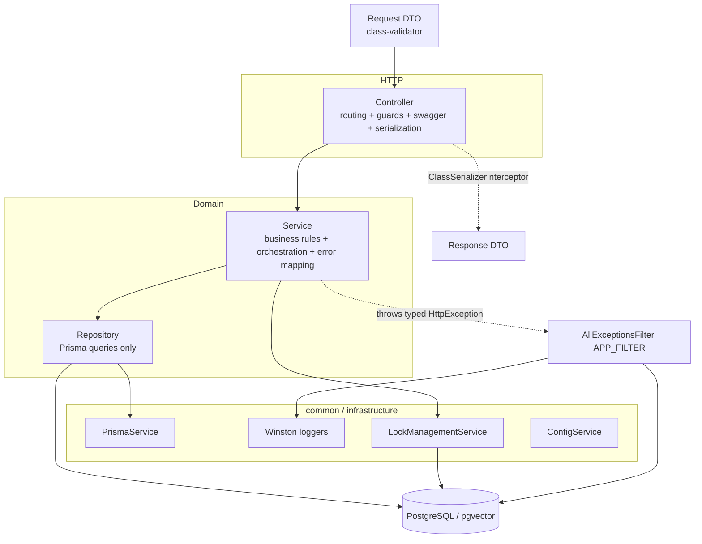
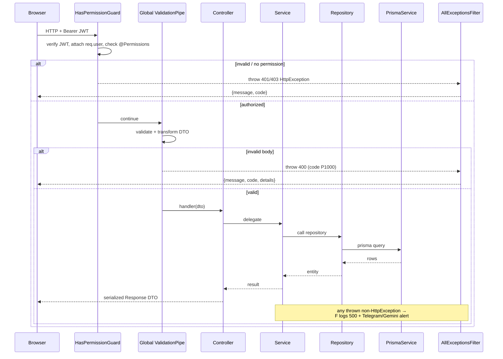
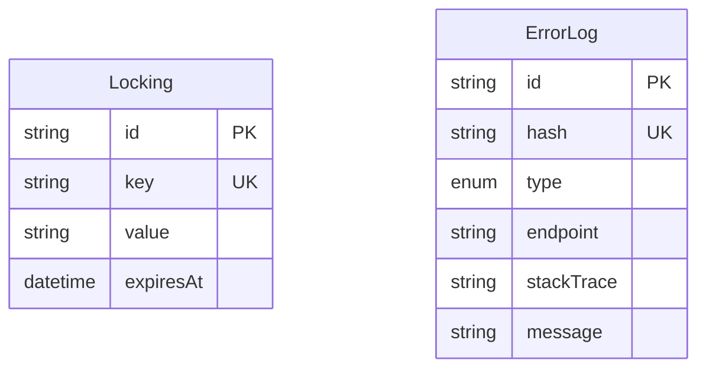

# Dossier 01 — Backend architecture & conventions

## 1. Identity
- **One-line purpose.** Establish the layered NestJS architecture, dependency-injection wiring, and
  cross-cutting concerns (global exception filter, Winston logging, Prisma, Postgres-based locking,
  file-based log reader) that every domain module in `tdg-management-api-backend` is built on.
- **Backend source root(s):**
  - `tdg-management-api-backend/src/main.ts`, `tdg-management-api-backend/src/app.module.ts`
  - `tdg-management-api-backend/src/common/**` (shared infrastructure)
  - `tdg-management-api-backend/src/logs/**` (log-file reader API)
  - `tdg-management-api-backend/src/lock-management/**` (distributed lock)
  - Pattern illustrated with `src/projects/**` and `src/tasks/**` (NOT fully documented here — see
    dossiers 05 and 07).
- **Frontend source root(s):** None. This is a backend-only cross-cutting dossier.
- **Owned DB tables/models:** This dossier owns no domain tables. It touches two infrastructure
  models used by cross-cutting concerns: `Locking` (lock-management) and `ErrorLog` (global filter).
  Full schema is documented in dossier 02.

## 2. Purpose & business problem
The module does not serve an end-user workflow; it serves the *engineering* need for a uniform,
predictable structure so that ~20 domain modules can be read and extended the same way. Concretely it
provides: (a) a single request-validation + error-response contract, (b) centralized structured
logging with admin alerting, (c) a shared Prisma connection, (d) a mutual-exclusion primitive so
scheduled jobs don't double-run, and (e) an operator-facing log-inspection API.

- Global validation contract lives in `src/main.ts:12` (global `ValidationPipe`).
- Global error contract lives in `src/common/filters/all-exceptions.filter.ts:18` (registered as
  `APP_FILTER` in `src/app.module.ts:74`).

## 3. Domain model & database
This dossier does not define domain models. Two infrastructure models are consumed:

- **`Locking`** — key/value/expiry row backing the distributed lock. Accessed via raw SQL
  `SELECT ... FOR UPDATE SKIP LOCKED` in `src/lock-management/repositories/update.repository.ts:18`
  and `.../fetch.repository.ts:17`, and via Prisma `upsert`/`delete` in
  `.../create.repository.ts:9` and `.../delete.repository.ts:9`. **Why raw SQL:** row-level
  `FOR UPDATE SKIP LOCKED` gives non-blocking mutual exclusion — a second worker that finds the row
  already locked skips instead of waiting, which is exactly the semantics wanted for cron dedup.
- **`ErrorLog`** — `hash`/`type`/`endpoint`/`stackTrace`/`message` row written by the global filter to
  deduplicate 500s (`all-exceptions.filter.ts:127`). The `hash` is a deterministic bcrypt hash of
  `endpoint|method|normalizedStack` (`all-exceptions.filter.ts:85`,`:112`), so an identical error is
  stored once and enriched with an AI resolution message (`:147`).

Full field/enum/index definitions for both are in dossier 02 (schema is the single source of truth
there). `ErrorType.Api` enum value is referenced at `all-exceptions.filter.ts:130`.

## 4. Backend architecture

### 4.1 Layering — controller → service → repository → DTO
Every domain module follows the same four-layer split. Verified against `projects` and `tasks`:

- **Controller** — HTTP surface only: routing, guards, Swagger, serialization, param parsing. It holds
  no business logic and delegates every handler to the service. Example: every method of
  `src/projects/controller/projects.controller.ts` is a one-line delegation, e.g.
  `createProject` at `projects.controller.ts:89` → `this.projectsService.createProject(req, data)`.
- **Service** — business rules, authorization decisions beyond the guard, input normalization,
  orchestration of multiple repositories, and Prisma-error translation. Example:
  `ProjectsService.createProject` (`src/projects/services/projects.service.ts:68`) checks role
  permissions (`:75`), enforces business-unit access (`:82`), normalizes input (`:84`), then calls the
  repository (`:100`) and maps `Prisma P2002` → `ConflictCustomException` (`:102`–`:108`).
- **Repository** — the only layer that talks to `PrismaService`. One repository class per operation
  family (create/fetch/update/delete + feature-specific ones). Example:
  `CreateProjectRepository.createProject` (`src/projects/repositories/create-project.repository.ts:11`)
  issues `prismaService.project.create(...)` with an explicit `select`. Repositories are plain
  `@Injectable()` classes; they do not extend one another (verified: no `extends *Repository` in
  `src/`).
- **DTO** — request/response shapes with `class-validator` + `@nestjs/swagger` decorators. Example:
  `CreateProjectDto` (`src/projects/dto/request/post/create-project.dto.ts:24`) uses `@IsEnum`,
  `@IsISO8601`, `@ValidateNested`, and `@ApiHideProperty` for the server-set `createdById` (`:155`).

Folder convention (verified in both modules): `controller/`, `services/`, `repositories/`,
`dto/{request,response}/{post,update,fetch}/`, `types/`, `swagger-documentation/`. A module may expose
**more than one controller** — `tasks` ships both `TasksController` and `UserTasksController`
(`src/tasks/tasks.module.ts:33`).

### 4.2 NestJS module & DI wiring
- Each module declares its `controllers` and `providers` (service + repositories) and `imports` the
  shared modules it needs, then `exports` its service so other modules can inject it. Verified:
  `src/projects/projects.module.ts:20`–`42` and `src/tasks/tasks.module.ts:22`–`45`.
- Shared infrastructure modules are imported *per-module*, not globally: `PrismaModule`, `LoggerModule`,
  `AuthsModule`, `TokensModule`, plus feature deps (`MailModule`, `NotificationsModule`, `UploadModule`,
  `RemindersModule`, `AiModule`). There is **no global barrel `CommonModule` in the app graph** —
  `src/common/common.module.ts:12` exists and re-exports a subset, but it is **not imported by
  `AppModule`** (verified: `AppModule` imports the individual modules directly,
  `src/app.module.ts:36`–`73`). So `CommonModule` is effectively dead wiring; modules import the
  granular modules instead.
- `AppModule` (`src/app.module.ts`) is the composition root: it wires `ScheduleModule.forRoot()`
  (`:37`), global `ConfigModule.forRoot({ isGlobal: true })` (`:38`), `ServeStaticModule` for
  `/static` (`:48`), all domain modules, and registers `AllExceptionsFilter` as `APP_FILTER` (`:74`).

### 4.3 Bootstrap (`main.ts`)
- `NestFactory.create(AppModule)`, `app.enableCors()` (open CORS, no allowlist) — `main.ts:8`–`9`.
- **Global `ValidationPipe`** with `transform: true` and a custom `exceptionFactory` that wraps
  validation errors in `{ message, code: ErrorCode.INVALID_DATA, details }` @ 400 — `main.ts:12`–`25`.
  Note: `whitelist`/`forbidNonWhitelisted` are **not** set (see §9).
- Swagger served at `/api` — `main.ts:28`–`37`.
- Listens on `process.env.PORT ?? 3000` — `main.ts:39` (compose maps this; dev port is 3001 per
  dossier 00).

### 4.4 Global exception filter (`AllExceptionsFilter`)
`@Catch()` with no argument catches everything (`all-exceptions.filter.ts:17`). Flow (`catch`, `:42`):
1. Status = `exception.getStatus()` for `HttpException`, else `500` (`:48`).
2. Body = the HttpException response as-is, else a generic `{code: INTERNAL_SERVER_ERROR}` (`:51`).
3. **Only for 500s**: write to the error Winston log (`:61`) and fire
   `notifyAdminInTelegramAboutError` (`:67`).
4. Send `response.status(statusCode).json(responseData)` (`:75`).

`notifyAdminInTelegramAboutError` (`:78`) builds a Gemini prompt, deterministically hashes the error,
stores it once in `ErrorLog` (dedup — returns early if already stored, `:93`), asks Gemini for a
resolution message, persists it back (`:97`), and pushes it to a Telegram admin chat (`:100`). If
Gemini returns nothing it falls back to the raw error text (`:105`). Config (`PROJECT_NAME`,
`TELGRAM_ADMIN_BOT_TOKEN` [sic — typo in env key], `TELEGRAM_ADMIN_CHAT_ID`,
`GEMINI_PROMPOT_ERROR_RESOLUTION` [sic]) is read in the constructor (`:33`–`:39`).

**Why this design:** it turns unhandled 500s into deduplicated, AI-annotated alerts without spamming
the operator. **Cost/risk:** the catch path performs a bcrypt hash + DB round-trip + external Gemini
call + Telegram call synchronously inside the request's error path (awaited before nothing — it is
fire-and-forget from `catch`, which does not await `notifyAdminInTelegramAboutError`, so the response
is not blocked; verified `:67` has no `await`).

### 4.5 Custom exceptions & error codes
Domain code throws typed `HttpException` subclasses instead of raw Nest exceptions:
`NotFoundCustomException` (`src/common/exceptions/custom-exceptions/not-found.exception.ts:3`) and the
sibling `BadRequest/Conflict/Forbidden/Unauthorized/InternalServerError` classes, each taking
`(message, code)` and setting the matching HTTP status. Codes are a central enum
`ErrorCode` (`src/common/exceptions/error-codes/error.code.ts:1`) namespaced by app
(`P1xxx` general, `P2xxx` auth, `P3xxx` tokens, `P4xxx` users, …). This gives the frontend a stable,
language-independent error contract.

### 4.6 Logging (Winston, file-based)
`LoggerModule` (`src/common/logger/logger.module.ts`) provides three Winston services, each writing a
daily-rotated JSON file under `logs/`:
- `AppLoggerService` → `logs/app/%DATE%.json`, `maxFiles: '1d'` (`app-logger.service.ts:18`).
- `ErrorLoggerService` → `logs/errors/%DATE%.json`, `maxFiles: '2d'` (`error-logger.service.ts:18`).
- `BackgroundActivitiesLoggerService` → `logs/background-activities/%DATE%.json`, `maxFiles: '5d'`
  (`background-activities-logger.service.ts:18`).

`LoggerMiddleware` (`src/common/logger/middlewares/logger.middleware.ts:7`) is written to log every
request on `res 'finish'` with duration, masked sensitive fields (`:10`), and masked Authorization
header. **It is never registered** — no module implements `NestModule`/`configure()` anywhere in
`src/` (verified: zero matches for `NestModule|configure(|apply(`). So per-request access logging is
**not active**; only the global filter (500s) and background jobs write logs. This is verified tech
debt (§13).

### 4.7 Locking (`lock-management`) — Postgres-backed distributed lock
`LockManagementService` (`src/lock-management/services/lock-management.service.ts:9`) exposes
`lock`, `createOrUpdateLock`, `deleteLock`, each wrapping a repository and swallowing errors into the
background log. Semantics (verified in the repositories):
- `createOrUpdateLock` → `prismaService.locking.upsert` (`create.repository.ts:9`). Used at boot to
  seed the row in an "Unlocked" state.
- `lock` → a transaction that `SELECT ... FOR UPDATE SKIP LOCKED` the row, returns `null` if the lock
  is still valid (`expiresAt` in the future, `update.repository.ts:20`), otherwise `update`s
  `expiresAt` and returns the row (`:25`). **Important behavioural detail:** if the row does *not*
  exist, `lock` returns `null` (`:39`) — it never inserts. A caller must first `createOrUpdateLock`
  to seed the key, which is exactly what jobs do in `onModuleInit`.

**Consumers (verified):** `IndexSweeperJob`, `ReminderSchedulerService`, `ServersService`,
`PersonalTasksService`, `EventsService`. Canonical usage — `src/ai/jobs/index-sweeper.job.ts`:
seeds locks in `onModuleInit` (`:46`), then each `@Cron` acquires with a 55 s TTL just under the
1-minute cadence and bails if not acquired (`:57`–`:62`). **Why Postgres and not Redis:** it reuses the
one datastore already present and gives crash-safe expiry; see §13 for the unused `RedisModule`.

### 4.8 Prisma & config
- `PrismaService` extends `PrismaClient`, uses the `@prisma/adapter-pg` driver adapter with
  `DATABASE_URL`, and connects on `onModuleInit` (`src/common/prisma/service/prisma.service.ts:7`–`18`).
  Exported by `PrismaModule` and imported by every data module.
- `ConfigModule` is global (`app.module.ts:38`), so `ConfigService` is injectable everywhere without
  re-importing.

## 5. API surface
This cross-cutting dossier owns only the operator/infra endpoints. Domain endpoints belong to their
own dossiers.

| Method | Path | Auth/Perm | Request DTO | Response DTO | Validation | Business logic (1 line) | Side effects |
|--------|------|-----------|-------------|--------------|------------|-------------------------|--------------|
| GET | `/logs` | `HasPermissionGuard` + `LOGS.LOG_FOLDERS_READ` | — | `Record<folder, LogFileInfo[]>` | — | List log folders & files with size/date (`logs.controller.ts:23`) | reads `logs/` dir |
| GET | `/logs/:folder/:file` | `HasPermissionGuard` + `LOGS.LOG_FILE_READ` | `FilterLogsParameters` (query) | paginated `StructuredLog[]` | query parsed in service (limit capped 100) | Parse+filter+paginate a JSON log file (`logs.controller.ts:30`, service `logs.service.ts:32`) | reads file from disk |
| GET | `/logs/:folder/:file/download` | `HasPermissionGuard` + `LOGS.LOG_FILE_DOWNLOAD` | — | file stream | existence check | Stream the raw log file as attachment (`logs.controller.ts:41`) | reads file from disk |
| GET | `/health` | none | — | `{status, timestamp}` | — | Liveness probe (`health.controller.ts:18`) | none |

`LogsController` and `HealthController` are registered directly on `AppModule`
(`app.module.ts:80`), not inside a feature module graph for `Health` (Health has no module).

## 6. Frontend
Not applicable — backend-only dossier. The frontend architecture (React Query, Zustand, axios layer,
auth guard) is dossier 15. Where a frontend consumes an infra contract it is the `ErrorCode`
enum/`{message,code}` error body defined here (§4.5).

## 7. Data flow & key scenarios

### Scenario A — a normal authenticated write (create project), happy path
1. Browser → `POST /projects/register` with `Authorization: Bearer <jwt>` and body.
2. `HasPermissionGuard.canActivate` reads the header (`has-permission.guard.ts:22`), verifies the JWT
   via `TokensService` (`:42`), attaches `request.user`, and checks the route's `@Permissions` against
   `PERMISSIONS_FOR_ROLE[role]` (`:48`); throws 401/403 otherwise.
3. Global `ValidationPipe` validates/transforms `CreateProjectDto`; on failure the custom
   `exceptionFactory` produces `{code: P1000, ...}` @ 400 (`main.ts:15`).
4. `ProjectsController.createProject` delegates to `ProjectsService` (`projects.controller.ts:89`).
5. Service applies business rules and calls `CreateProjectRepository` → `PrismaService`
   (`projects.service.ts:100`).
6. Response is shaped by `ClassSerializerInterceptor` + `@SerializeOptions({type: CreatedProjectDto})`
   (`projects.controller.ts:77`) and returned.

### Scenario B — an unhandled 500
1. Any layer throws a non-`HttpException`.
2. `AllExceptionsFilter.catch` sets status 500, logs to `logs/errors/*.json`
   (`all-exceptions.filter.ts:61`), fires (non-awaited) Telegram/Gemini alert with DB dedup (`:67`),
   and returns `{code: P1001, message: 'Server Error!'}` (`:55`).

### Scenario C — a scheduled job that must not double-run
1. `@Cron` fires (e.g. `IndexSweeperJob.sweep`, every minute).
2. `lockManagementService.lock(key, 'locked', 55)` runs `SELECT … FOR UPDATE SKIP LOCKED`; if another
   worker holds a live lock it returns `null` and the tick is skipped (`index-sweeper.job.ts:57`).
3. Otherwise the worker does its batch and the lock naturally expires after the TTL.

## 8. Diagrams (Mermaid)

### 8.1 Layered architecture

### 8.2 Generic request sequence (guarded write + error path)

### 8.3 Distributed-lock ERD slice

## 9. Security
- **Authentication touchpoint.** Bearer JWT verified in `HasPermissionGuard`
  (`has-permission.guard.ts:42`) and `IsAuthenticatedGuard` (`is-authenticated.guard.ts:19`) via
  `TokensService.verifyAuthenticationTokenAndReturnPayload`. Details of token issue/refresh are
  dossier 03.
- **Authorization / RBAC.** `@Permissions([...])` (custom `Reflector` decorator,
  `permissions.decorator.ts:3`) + `HasPermissionGuard`. The guard requires the user's roles to include
  at least one permission via `PERMISSIONS_FOR_ROLE[role]` (`has-permission.guard.ts:48`). Guards are
  attached **per route** with `@UseGuards`; there is **no global guard**, so any handler without
  `@UseGuards` is unauthenticated by default (e.g. `/health`, and the project archive/restore routes
  rely on their explicit `@UseGuards`). Full RBAC model is dossier 03.
- **Input validation.** Global `ValidationPipe` (`main.ts:12`) with per-DTO `class-validator`
  decorators. **Gap:** `whitelist`/`forbidNonWhitelisted` are not enabled, so unknown properties in a
  request body are not stripped or rejected — only decorated fields are validated (verified
  `main.ts:12`–`25`). Server-only fields are hidden from Swagger via `@ApiHideProperty` but are still
  assignable from the body unless the service overwrites them (it does for `createdById`,
  `projects.service.ts:90`).
- **Injection protection.** Prisma parameterizes all queries. The two raw queries in lock-management
  use tagged-template parameterization (`WHERE "key" = ${key}`,
  `update.repository.ts:18`) — not string concatenation — so they are parameterized.
- **CORS.** `app.enableCors()` with no options = permissive (`main.ts:9`). Gap for production.
- **Secret handling in logs.** `LoggerMiddleware.maskSensitiveData` masks password/token fields
  (`logger.middleware.ts:10`) and the Authorization header — but the middleware is not wired (§4.6),
  so this protection is currently inert.
- **cookie-parser gap.** `IsAuthenticatedGuard` reads `request.cookies?.accessToken`
  (`is-authenticated.guard.ts:13`), but `cookie-parser` middleware is **never registered** in
  `main.ts` (verified: no `cookieParser`/`app.use` anywhere in `src/`). `req.cookies` is therefore
  `undefined` at runtime and the guard always falls back to the `Authorization` header. Not a
  vulnerability, but the cookie branch is dead.

## 10. Cross-module dependencies
- **Depended on by (almost) everything.** `PrismaModule`, `LoggerModule`, and the custom
  exception/error-code utilities are imported by every domain module (verified in `projects` and
  `tasks` modules). `AuthsModule`/`TokensModule` are imported wherever guards are used.
- **`LockManagementModule`** is imported by the scheduled-job owners (AI, reminders, servers,
  personal-tasks, events).
- **`AllExceptionsFilter`** depends on `PrismaService`, `BcryptService`, `GeminiService`,
  `TelegramService`, `ConfigService` (`all-exceptions.filter.ts:25`–`31`) — a relatively heavy
  cross-cutting coupling for an error filter (it reaches into AI + messaging).
- **Coupling note.** The layered convention keeps controllers thin and pushes all Prisma access into
  repositories, which is good cohesion. The main smell is the filter's fan-out to Gemini/Telegram
  (§13) and the unused `CommonModule`/`RedisModule` (§13).

## 11. Tests
- Spec files exist for the shared services: `bcrypt.service.spec.ts`, `prisma.service.spec.ts`,
  `redis.service.spec.ts`, `time.service.spec.ts`, `mail/…spec.ts`, `slugify…spec.ts`,
  `firebase…spec.ts`, `gemini…spec.ts`, `logger/*.spec.ts`, plus
  `lock-management.service.spec.ts`, `logs.controller.spec.ts`, `logs.service.spec.ts`,
  `permissions.spec.ts` (verified by file listing).
- **Not verified:** whether these specs contain real assertions or are Nest CLI stubs — the contents
  were not read in this session (see §16). No coverage numbers were produced. There is a `test:e2e`
  script (`package.json:31`) but the e2e suite was not inspected here.

## 12. Code quality
- **Separation of concerns — strong.** Controller/service/repository/DTO boundaries are consistently
  respected; controllers are pure delegation (e.g. all of `projects.controller.ts`) and only
  repositories import `PrismaService`.
- **Consistent error handling.** Typed custom exceptions + central `ErrorCode` enum give a uniform
  client contract (`not-found.exception.ts:3`, `error.code.ts:1`); services translate Prisma error
  codes at the boundary (`projects.service.ts:102`).
- **Explicit Prisma `select`s.** Repositories select exact fields rather than returning whole rows
  (`create-project.repository.ts:54`), limiting over-fetching and accidental leakage.
- **Weak spot — the global filter does too much.** `AllExceptionsFilter` mixes response shaping,
  persistence, AI generation, and messaging in one class (`all-exceptions.filter.ts:78`–`159`); a
  failure in Gemini/Telegram is only caught loosely and env-key typos (`TELGRAM_…`,
  `GEMINI_PROMPOT_…`) will silently disable alerting.
- **Instantiated-not-injected logger.** The filter does `new ErrorLoggerService()`
  (`all-exceptions.filter.ts:32`) instead of DI, bypassing Nest's provider graph — works, but
  inconsistent with the rest of the codebase.

## 13. Verified technical debt
1. **`LoggerMiddleware` is dead code.** Defined (`logger.middleware.ts:7`) but never registered — no
   `NestModule.configure` exists in `src/`. Per-request access logging + sensitive-field masking are
   inert.
2. **`RedisModule`/`RedisService` are unused.** Referenced only inside their own folder (verified:
   no import of `RedisModule` or `RedisService` outside `src/common/redis/`). Locking uses the
   Postgres `Locking` table instead, so Redis is dead at runtime despite `ioredis`/`redis` deps.
3. **`CommonModule` barrel is not wired.** `src/common/common.module.ts` re-exports several modules but
   is not imported by `AppModule`; modules import the granular modules directly. Dead wiring.
4. **`TransformLanguagePipe` ignores its input.** It unconditionally returns `Language.English`
   regardless of the `language` query value (`transform-language.pipe.ts:5`). Any endpoint relying on
   it for i18n filtering (e.g. `GET /projects` `language` param, `projects.controller.ts:210`) is
   effectively hard-coded to English. High-impact latent bug for a multilingual system.
5. **Global `ValidationPipe` has no `whitelist`.** Unknown body fields are neither stripped nor
   rejected (`main.ts:12`). Mass-assignment risk mitigated only by services overwriting server fields.
6. **Permissive CORS** — `app.enableCors()` with no allowlist (`main.ts:9`).
7. **Env-key typos** in the filter: `TELGRAM_ADMIN_BOT_TOKEN` and `GEMINI_PROMPOT_ERROR_RESOLUTION`
   (`all-exceptions.filter.ts:35`,`:39`). If the actual `.env` matches the typo it works; if not,
   alerting is silently off (not verified against `.env`).
8. **Stale package identity.** `package.json:2` name is `laporta-di-roma-api` and it self-references
   `"laporta-di-roma-api": "file:"` (`:62`) — leftover from a template (matches dossier 00's finding).

## 14. Strengths / Weaknesses / Improvements
**Strengths**
- Uniform four-layer architecture makes any of the ~20 modules readable the same way — low onboarding
  cost. (Impact: maintainability.) Evidence: `projects` and `tasks` module/controller/service/repo.
- Centralized, typed error contract (`ErrorCode` + custom exceptions) — stable client integration.
- Crash-safe, single-datastore distributed lock via `FOR UPDATE SKIP LOCKED` — correct cron dedup
  without extra infra (`update.repository.ts:18`).
- Structured, rotated JSON logs + auto-deduplicated AI-annotated 500 alerts (`all-exceptions.filter.ts`).

**Weaknesses**
- Several dead subsystems (LoggerMiddleware, RedisModule, CommonModule) inflate the surface and mislead
  readers into thinking access-logging/Redis are active. (Impact: confusion, false sense of coverage.)
- `TransformLanguagePipe` silently defeats i18n filtering. (Impact: wrong data for non-English.)
- No `whitelist` on validation + open CORS. (Impact: security hardening gap.)
- Error filter over-coupled to AI/messaging. (Impact: a filter bug can swallow error reporting.)

**Improvements (concrete, feasible)**
- Register `LoggerMiddleware` via a root `NestModule.configure` (or delete it), enabling masked access
  logs.
- Fix `TransformLanguagePipe` to actually parse `ar|fr|en` → `Language`, or remove it and validate the
  query param with `@IsEnum`.
- Add `whitelist: true` (and consider `forbidNonWhitelisted`) to the global `ValidationPipe`.
- Restrict CORS to known origins from config.
- Extract the alerting side of `AllExceptionsFilter` into an injected `ErrorReportingService` and use
  DI for the logger; correct the env-key typos.
- Remove unused `RedisModule`/`CommonModule` and the redundant Redis deps, or wire Redis if it's the
  intended lock backend.

## 15. Verification Checklist
| Area | Verified? | Evidence or reason if not |
|------|-----------|---------------------------|
| Layered pattern (controller→service→repo→dto) | Yes | `projects`/`tasks` module, controller, service, repo files cited in §4.1 |
| DI / module wiring | Yes | `app.module.ts`, `projects.module.ts:20`, `tasks.module.ts:22`; `CommonModule` not imported |
| Bootstrap & global validation | Yes | `main.ts:8`–`39` |
| Global exception filter | Yes | `all-exceptions.filter.ts` (registered `app.module.ts:74`) |
| Custom exceptions & error codes | Yes | `not-found.exception.ts:3`, `error.code.ts:1` |
| Winston logging | Yes | three `*-logger.service.ts` transports; middleware unwired |
| Lock-management (Postgres lock) | Yes | 4 repositories + `index-sweeper.job.ts` consumer |
| Prisma service / config | Yes | `prisma.service.ts:7`; `app.module.ts:38` |
| Logs & health endpoints | Yes | `logs.controller.ts`, `logs.service.ts`, `health.controller.ts` |
| Security (guards, validation, injection, CORS) | Yes | `has-permission.guard.ts`, `is-authenticated.guard.ts`, `main.ts` |
| Cross-module dependencies | Yes | module `imports`/`exports` cited |
| Tests | Partial | spec files exist (listed) but their assertions/coverage not read this session |
| Tech debt | Yes | each item cited in §13 |

## 16. Not verified / Open questions
- **Spec contents / coverage.** Which `*.spec.ts` are real tests vs Nest stubs, and overall coverage —
  spec bodies were not read. Would need to open the spec files and run `test:cov`.
- **`.env` reality.** Whether the env keys `TELGRAM_ADMIN_BOT_TOKEN` / `GEMINI_PROMPOT_ERROR_RESOLUTION`
  (as spelled in the filter) match the deployed `.env`. `.env` was not read (secrets). Would need the
  actual env file / compose config (dossier 16).
- **`TokensService.verifyAuthenticationTokenAndReturnPayload` internals** (algorithm, expiry, error
  behaviour) — deferred to dossier 03; only its call sites were verified here.
- **`PERMISSIONS_FOR_ROLE` completeness.** `has-permission.guard.ts:52` indexes
  `PERMISSIONS_FOR_ROLE[role]` without a guard for an unmapped role; whether every `UserType` is a key
  was not exhaustively verified — deferred to dossier 03.
- **Does any code path actually call `deleteLock`/`FetchLockRepository`?** `FetchLockRepository` is
  provided but its call sites were not traced this session.
