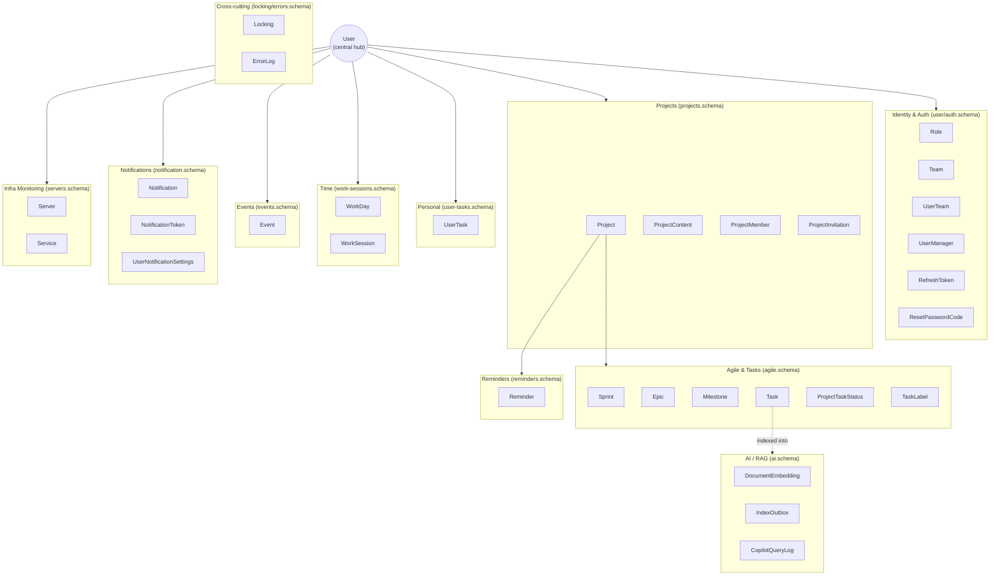
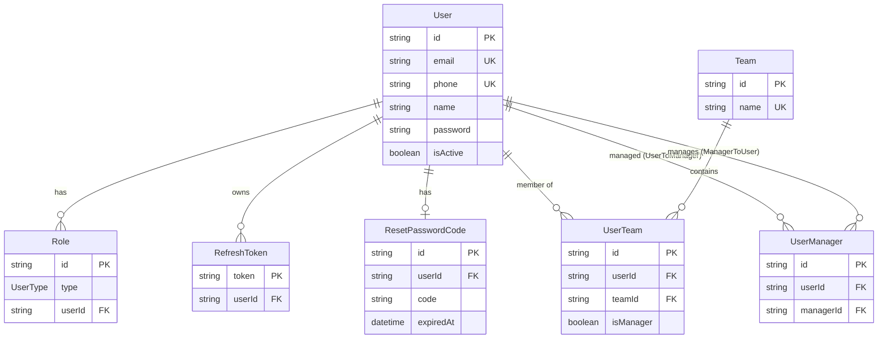
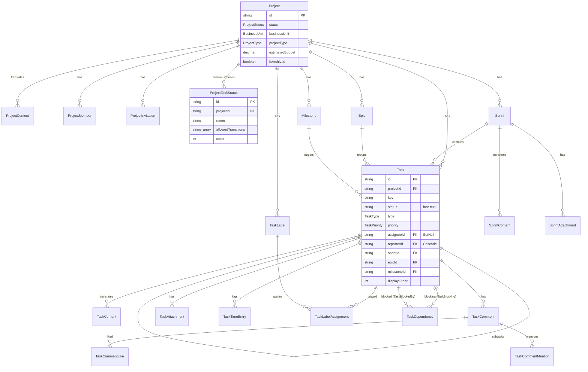
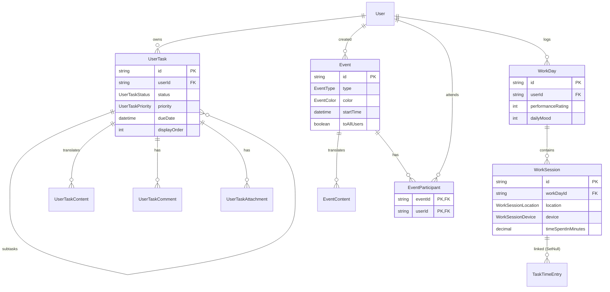
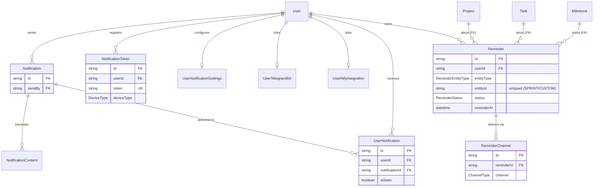
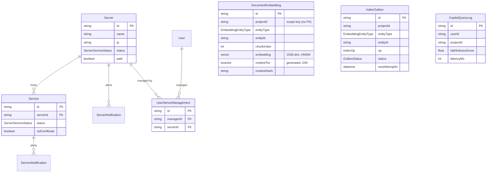

# Dossier 02 — Database Architecture

## 1. Identity
- **One-line purpose:** The complete persistence layer — the single source of truth for all 55 Prisma
  models, 25 enums, their relationships, constraints, indexes, cascade rules, and the pgvector
  RAG store — for the `tdg-management-api-backend` NestJS/Prisma/PostgreSQL application.
- **Backend source root(s):** `tdg-management-api-backend/prisma/`
  - Schema (split into 13 domain files): `prisma/schema/*.prisma`
  - Migrations (26 applied SQL migrations + 1 empty superseded + baseline): `prisma/schema/migrations/`
  - Seed: `prisma/seed.ts`; AI backfill helper: `prisma/ai-backfill.ts`
  - Prisma config: `prisma.config.ts`
- **Frontend source root(s):** None. This dossier is backend-only.
- **Owned DB tables/models:** All 55 models (this dossier is the schema authority; per-domain dossiers
  reference it rather than re-documenting schema).

**Engine facts (verified):**
- Datasource provider `postgresql`, client generator `prisma-client-js`
  (`prisma/schema/main.schema.prisma:1-8`).
- Multi-file schema mode: `prisma.config.ts:5` points `schema` at the `prisma/schema` **directory**;
  migrations path is `prisma/schema/migrations` (`prisma.config.ts:6-7`). Datasource URL comes from
  `env('DATABASE_URL')` (`prisma.config.ts:10`).
- Migration provider locked to `postgresql` (`prisma/schema/migrations/migration_lock.toml:3`).
- Seed runs on the `@prisma/adapter-pg` driver adapter (`prisma/seed.ts:39,45-46`) and wipes+recreates
  a deterministic demo dataset (`prisma/seed.ts:8-17,54-55`).

---

## 2. Purpose & business problem
The database backs a full-stack project-management platform for **Tawer**, a digital agency with two
business units — *Tawer Dev* (AGILE software projects) and *Tawer Creative* (FREESTYLE
design/marketing projects) (`prisma/seed.ts:4-13`; enum `BusinessUnit`
`prisma/schema/projects.schema.prisma:104-107`; enum `ProjectType`
`prisma/schema/projects.schema.prisma:109-112`).

The schema encodes, in one PostgreSQL instance, every domain of that platform: identity/RBAC, projects
and membership, an agile backlog (epics/sprints/milestones/tasks), personal to-dos, time & attendance,
events/calendar, reminders, multi-channel notifications, infrastructure monitoring, and — the project's
differentiator — a **pgvector-backed RAG store** for the AI copilot and estimation features
(`prisma/schema/ai.schema.prisma`). Two cross-cutting operational tables (`Locking`, `ErrorLog`) support
distributed cron locking and deduplicated error logging.

---

## 3. Domain model & database

### 3.1 Model inventory by domain (55 models across 13 schema files)

| # | Domain / schema file | Models |
|---|---|---|
| A | **Identity & Auth** — `user.schema.prisma`, `auth.schema.prisma` | User, Role, Team, UserTeam, UserManager, RefreshToken, ResetPasswordCode (7) |
| B | **Projects & Membership** — `projects.schema.prisma` | Project, ProjectContent, ProjectMember, ProjectInvitation (4) |
| C | **Agile & Tasks** — `agile.schema.prisma` | Sprint, SprintContent, SprintAttachment, Epic, Milestone, Task, TaskContent, TaskComment, TaskCommentLike, TaskCommentMention, TaskAttachment, TaskTimeEntry, TaskLabel, TaskLabelAssignment, TaskDependency, ProjectTaskStatus (16) |
| D | **Personal Tasks** — `user-tasks.schema.prisma` | UserTask, UserTaskContent, UserTaskComment, UserTaskAttachment (4) |
| E | **Time & Attendance** — `work-sessions.schema.prisma` | WorkDay, WorkSession (2) |
| F | **Events & Calendar** — `events.schema.prisma` | Event, EventContent, EventParticipant (3) |
| G | **Reminders** — `reminders.schema.prisma` | Reminder, ReminderChannel (2) |
| H | **Notifications** — `notification.schema.prisma` (+ 2 in `user.schema.prisma`) | Notification, NotificationContent, UserNotification, NotificationToken, UserNotificationSettings, UserTelegramBot, UserNtfyIntegration (7) |
| I | **Infrastructure Monitoring** — `servers.schema.prisma` | Server, Service, ServerNotification, ServiceNotification, UserServerManagement (5) |
| J | **AI / RAG** — `ai.schema.prisma` | DocumentEmbedding, IndexOutbox, CopilotQueryLog (3) |
| K | **Cross-cutting infra** — `locking.schema.prisma`, `errors.schema.prisma` | Locking, ErrorLog (2) |

Total **55 models** (`UserTelegramBot` and `UserNtfyIntegration` live physically in `user.schema.prisma:44-61`
but belong functionally to Notifications).

### 3.2 Enum inventory (25 enums)

| Enum | Values | Where | file:line |
|---|---|---|---|
| `UserType` | 31 (CEO…HRManager, PendingApproval, two intern types) | Identity | `user.schema.prisma:108-140` |
| `ProjectStatus` | Pending, Running, Stopped, Completed | Projects | `projects.schema.prisma:97-102` |
| `BusinessUnit` | TawerDev, TawerCreative | Projects | `projects.schema.prisma:104-107` |
| `ProjectType` | AGILE, FREESTYLE | Projects | `projects.schema.prisma:109-112` |
| `InvitationStatus` | PENDING, ACCEPTED, EXPIRED, CANCELLED | Projects | `projects.schema.prisma:114-119` |
| `SprintStatus` | Pending, Running, Stopped, Completed | Agile | `agile.schema.prisma:300-305` |
| `TaskType` | EPIC, STORY, TASK, BUG, SPIKE | Agile | `agile.schema.prisma:308-314` |
| `TaskPriority` | URGENT, HIGH, MEDIUM, LOW | Agile | `agile.schema.prisma:317-322` |
| `TaskStatusType` | ENUM, CUSTOM | Agile | `agile.schema.prisma:325-328` |
| `Language` | English (single value) | Shared | `language.schema.prisma:1-3` |
| `EventType` | Meeting, Event, PersonalEvent | Events | `events.schema.prisma:41-45` |
| `EventColor` | Sky, Amber, Violet, Rose, Emerald, Orange | Events | `events.schema.prisma:47-54` |
| `DeviceType` | Ios, Android, Computer | Notifications | `notification.schema.prisma:62-66` |
| `ReminderEntityType` | TASK, SPRINT, MILESTONE, PROJECT, CUSTOM | Reminders | `reminders.schema.prisma:43-49` |
| `ReminderStatus` | PENDING, SENT, DISMISSED, FAILED, CANCELLED | Reminders | `reminders.schema.prisma:52-58` |
| `ChannelType` | EMAIL, TELEGRAM, PUSH, NTFY | Reminders | `reminders.schema.prisma:61-66` |
| `ServerServiceStatus` | Running, Stopped, Maintenance | Infra | `servers.schema.prisma:83-87` |
| `UserTaskStatus` | Pending, InProgress, Completed | Personal | `user-tasks.schema.prisma:57-61` |
| `UserTaskPriority` | Low, Medium, High | Personal | `user-tasks.schema.prisma:63-67` |
| `WorkSessionLocation` | REMOTE, ONSITE | Time | `work-sessions.schema.prisma:28-31` |
| `WorkSessionDevice` | DESKTOP, MOBILE, TABLET, OTHER | Time | `work-sessions.schema.prisma:33-38` |
| `EmbeddingEntityType` | TASK, TASK_COMMENT, EPIC, MILESTONE, SPRINT | AI | `ai.schema.prisma:62-68` |
| `IndexOp` | UPSERT, DELETE | AI | `ai.schema.prisma:70-73` |
| `OutboxStatus` | PENDING, DONE, FAILED | AI | `ai.schema.prisma:75-79` |
| `ErrorType` | CronJob, Api | Infra | `errors.schema.prisma:12-15` |

**Enum naming is inconsistent** (verified): some are PascalCase members (`ProjectStatus`, `EventType`,
`UserType`, `ServerServiceStatus`, `UserTaskStatus/Priority`, `DeviceType`) and others UPPER_SNAKE
(`TaskType`, `TaskPriority`, `ProjectType`, `InvitationStatus`, `Reminder*`, `ChannelType`,
`WorkSession*`, all AI enums, `ErrorType`). This reflects models authored in different project phases
rather than a single convention.

### 3.3 Model catalog — keys, uniques, indexes, cascades

Referential-action note (Prisma defaults, since most FKs omit an explicit `onDelete`): an **optional**
relation with no explicit action defaults to `SetNull`; a **required** relation defaults to `NoAction`
(≈`Restrict`). Explicit `onDelete: Cascade` is used almost everywhere below.

**A — Identity & Auth**

| Model | PK | Unique | Indexes | Cascade on parent delete | file:line |
|---|---|---|---|---|---|
| `User` | `id` uuid | `email`, `phone` | (none declared) | hub; ~30 back-relations | `user.schema.prisma:1-42` |
| `Role` | `id` uuid | `@@unique([type,userId])` | — | `Cascade` from User | `user.schema.prisma:97-106` |
| `Team` | `id` uuid | `name` | — | — | `user.schema.prisma:88-95` |
| `UserTeam` | `id` uuid | `@@unique([userId,teamId])` | — | `Cascade` from User & Team | `user.schema.prisma:75-86` |
| `UserManager` | `id` uuid | `@@unique([userId,managerId])` | — | `Cascade` both self-relations | `user.schema.prisma:63-73` |
| `RefreshToken` | `token` (string) | `@@unique([token,userId])` | — | `Cascade` from User | `auth.schema.prisma:1-9` |
| `ResetPasswordCode` | `id` uuid | `userId`, `@@unique([userId,code])` | — | `Cascade` from User | `auth.schema.prisma:11-21` |

**B — Projects & Membership**

| Model | PK | Unique | Indexes | Cascade | file:line |
|---|---|---|---|---|---|
| `Project` | `id` uuid | — | 8: businessUnit, status, projectType, createdById, displayOrder, estimatedStartDate, estimatedEndDate, isArchived | `Cascade` from `createdBy` User | `projects.schema.prisma:1-40` |
| `ProjectContent` | `id` uuid | `@@unique([language,name])` | projectId, language, name | `Cascade` from Project | `projects.schema.prisma:42-58` |
| `ProjectMember` | `id` uuid | `@@unique([projectId,userId])` | projectId, userId | `Cascade` from Project & User | `projects.schema.prisma:60-74` |
| `ProjectInvitation` | `id` (db `gen_random_uuid()`) | `token`, `@@unique([projectId,email])` | projectId, token | `Cascade` (+`onUpdate:NoAction`) from Project & invitedBy | `projects.schema.prisma:76-95` |

**C — Agile & Tasks**

| Model | PK | Unique | Indexes | Cascade | file:line |
|---|---|---|---|---|---|
| `Sprint` | `id` (db text uuid) | — | `[projectId,status]`, `[projectId,createdAt]` | `Cascade` from Project & createdBy | `agile.schema.prisma:2-22` |
| `SprintContent` | id | `@@unique([language,name])` | sprintId | `Cascade` from Sprint | `agile.schema.prisma:25-39` |
| `SprintAttachment` | id | — | sprintId | `Cascade` from Sprint | `agile.schema.prisma:42-51` |
| `Epic` | id | `@@unique([projectId,name])` | projectId | `Cascade` from Project | `agile.schema.prisma:227-242` |
| `Milestone` | id | `@@unique([projectId,name])` | projectId, dueDate | `Cascade` from Project | `agile.schema.prisma:245-261` |
| `Task` | id | `@@unique([projectId,key])` | 8: `[projectId,status]`, assigneeId, sprintId, epicId, milestoneId, isFavorite, archived, `[projectId,displayOrder]` | `Cascade` from Project, reporter, parentTask; **SetNull** from assignee/epic/milestone/sprint | `agile.schema.prisma:54-107` |
| `TaskContent` | id | `@@unique([taskId,language])` | taskId | `Cascade` from Task | `agile.schema.prisma:182-195` |
| `TaskComment` | id | — | taskId | `Cascade` from Task & author | `agile.schema.prisma:128-141` |
| `TaskCommentLike` | id | `@@unique([commentId,userId])` | userId | `Cascade` from comment & user | `agile.schema.prisma:144-154` |
| `TaskCommentMention` | id | `@@unique([commentId,userId])` | userId | `Cascade` from comment & user | `agile.schema.prisma:157-167` |
| `TaskAttachment` | id | — | taskId | `Cascade` from Task | `agile.schema.prisma:170-179` |
| `TaskTimeEntry` | id | — | taskId, userId | `Cascade` from Task & User; **SetNull** from WorkSession | `agile.schema.prisma:110-125` |
| `TaskLabel` | id | `@@unique([projectId,name])` | projectId | `Cascade` from Project | `agile.schema.prisma:198-210` |
| `TaskLabelAssignment` | id | `@@unique([taskId,labelId])` | taskId, labelId | `Cascade` from Task & Label | `agile.schema.prisma:213-224` |
| `TaskDependency` | id | `@@unique([blockingTaskId,blockedTaskId])` (`TaskDependency_blocking_blocked_key`) | blockingTaskId, blockedTaskId | `Cascade` both edges | `agile.schema.prisma:264-277` |
| `ProjectTaskStatus` | id | `@@unique([projectId,name])` | `[projectId,isArchived]`, `[projectId,order]` | `Cascade` from Project | `agile.schema.prisma:280-297` |

**D — Personal Tasks**

| Model | PK | Unique | Cascade | file:line |
|---|---|---|---|---|
| `UserTask` | `id` uuid | — | `Cascade` from User & parentTask (self) | `user-tasks.schema.prisma:1-21` |
| `UserTaskContent` | `id` uuid | `@@unique([taskId,language])` | `Cascade` from UserTask | `user-tasks.schema.prisma:23-35` |
| `UserTaskComment` | `id` uuid | — | `Cascade` from UserTask & User | `user-tasks.schema.prisma:37-46` |
| `UserTaskAttachment` | `id` uuid | — | `Cascade` from UserTask | `user-tasks.schema.prisma:48-55` |

**E — Time & Attendance**

| Model | PK | Notes | Cascade | file:line |
|---|---|---|---|---|
| `WorkDay` | `id` uuid | performanceRating/dailyMood Int?, worker/managerNotes | `Cascade` from User | `work-sessions.schema.prisma:1-12` |
| `WorkSession` | `id` uuid | `timeSpentInMinutes Decimal(10,2)`; `location`+`device` enums | `Cascade` from WorkDay | `work-sessions.schema.prisma:14-26` |

**F — Events & Calendar**

| Model | PK | Unique | Cascade | file:line |
|---|---|---|---|---|
| `Event` | `id` uuid | — | `Cascade` from createdBy | `events.schema.prisma:1-17` |
| `EventParticipant` | **composite** `@@id([eventId,userId])` | (PK is the unique) | `Cascade` from Event & User | `events.schema.prisma:19-28` |
| `EventContent` | `id` uuid | — | `Cascade` from Event | `events.schema.prisma:30-39` |

**G — Reminders**

| Model | PK | Unique | Indexes | Cascade | file:line |
|---|---|---|---|---|---|
| `Reminder` | id | — | `[status,reminderAt]`, `[userId,status]`, projectId | `Cascade` from user, createdBy, project?, task?, milestone? | `reminders.schema.prisma:2-30` |
| `ReminderChannel` | id | `@@unique([reminderId,channel])` | — | `Cascade` from Reminder | `reminders.schema.prisma:33-40` |

**H — Notifications**

| Model | PK | Unique | Cascade | file:line |
|---|---|---|---|---|
| `Notification` | `id` uuid | — | `Cascade` from sender User? | `notification.schema.prisma:14-23` |
| `NotificationContent` | `id` uuid | — | `Cascade` from Notification | `notification.schema.prisma:38-48` |
| `UserNotification` | `id` uuid | `@@unique([notificationId,userId])` | `Cascade` from Notification? & User | `notification.schema.prisma:1-12` |
| `NotificationToken` | `id` uuid | `token` | `Cascade` from User? | `notification.schema.prisma:25-36` |
| `UserNotificationSettings` | `id` uuid | `userId` | `Cascade` from User | `notification.schema.prisma:50-60` |
| `UserTelegramBot` | `id` uuid | `userId` | `Cascade` from User | `user.schema.prisma:44-51` |
| `UserNtfyIntegration` | `id` uuid | `userId` | `Cascade` from User | `user.schema.prisma:53-61` |

**I — Infrastructure Monitoring**

| Model | PK | Unique | Indexes | Cascade | file:line |
|---|---|---|---|---|---|
| `Server` | `id` uuid | — | `@@index([id])` (redundant — see §13) | — | `servers.schema.prisma:1-24` |
| `Service` | `id` uuid | — | serverId | `Cascade` from Server | `servers.schema.prisma:36-57` |
| `ServerNotification` | `id` uuid | — | — | `Cascade` from Server | `servers.schema.prisma:26-34` |
| `ServiceNotification` | `id` uuid | — | — | `Cascade` from Service | `servers.schema.prisma:59-67` |
| `UserServerManagement` | `id` uuid | `@@unique([managerId,serverId])` | managerId, serverId | `Cascade` from manager & Server | `servers.schema.prisma:69-81` |

**J — AI / RAG**

| Model | PK | Unique | Indexes | Special columns | file:line |
|---|---|---|---|---|---|
| `DocumentEmbedding` | id | `@@unique([entityType,entityId,chunkIndex])` | `[projectId,entityType]`; **HNSW** on `embedding`; **GIN** on `contentTsv` (raw SQL) | `embedding vector(1536)`, `contentTsv tsvector` (generated), `contentHash` | `ai.schema.prisma:2-22` |
| `IndexOutbox` | id | `@@unique([entityType,entityId])` | `[status,nextAttemptAt]` | `op`, `status`, `attempts`, `nextAttemptAt`, `lastError` (backoff) | `ai.schema.prisma:25-42` |
| `CopilotQueryLog` | id | — | `[userId,createdAt]` | `retrievedIds String[]`, `topScore`, `faithfulnessScore`, `promptTokens`, `latencyMs` | `ai.schema.prisma:45-60` |

**K — Cross-cutting infra**

| Model | PK | Unique | Purpose | file:line |
|---|---|---|---|---|
| `Locking` | `id` uuid | `key` | Postgres-based distributed lock (cron mutex) | `locking.schema.prisma:1-8` |
| `ErrorLog` | `id` uuid | `hash` | Deduplicated error store (`hash` = fingerprint) | `errors.schema.prisma:1-10` |

### 3.4 Key design decisions & the *why*

1. **Content-table (i18n) split — present but currently degenerate.** Six entities separate their
   translatable text into a child `*Content` table keyed by `language`: `ProjectContent`
   (`projects.schema.prisma:42-58`), `SprintContent` (`agile.schema.prisma:25-39`), `TaskContent`
   (`agile.schema.prisma:182-195`), `UserTaskContent` (`user-tasks.schema.prisma:23-35`),
   `EventContent` (`events.schema.prisma:30-39`), and `NotificationContent`
   (`notification.schema.prisma:38-48`). The intent is per-language rows (one Task, many translations).
   **However the `Language` enum contains a single value, `English`** (`language.schema.prisma:1-3`),
   so at most one content row per parent can exist today. The multilingual structure is real but the
   feature is dormant — this is directly consistent with the Session-01 finding that
   `TransformLanguagePipe` always resolves to English (**verified here at the schema level:** the enum
   physically cannot represent another language). *See also cross-reference in §16.*

2. **Two different uniqueness strategies on content tables — one is a latent bug.**
   `TaskContent`/`UserTaskContent`/`EventContent` scope uniqueness **per parent**
   (`@@unique([taskId, language])`, `agile.schema.prisma:193`, `user-tasks.schema.prisma:34`), which is
   correct. But `ProjectContent` and `SprintContent` use `@@unique([language, name])`
   (`projects.schema.prisma:54`, `agile.schema.prisma:37`) — a **global** name-per-language constraint.
   Consequence: two different projects (or sprints) cannot share the same name in the same language.
   With only `English` available, all project/sprint names are effectively globally unique. This is a
   verified design smell (§13).

3. **UUID PKs with three inconsistent generation styles.** (a) Prisma-side `@default(uuid())` — User,
   Events, Notifications, Servers, WorkSessions, UserTasks, Locking, ErrorLog. (b) DB-side
   `@default(dbgenerated("gen_random_uuid()"))` — most Task-family tables (e.g.
   `agile.schema.prisma:145,171,199`). (c) DB-side text-cast
   `@default(dbgenerated("(gen_random_uuid())::text"))` — Sprint, Task, Epic, Milestone, Reminder
   (e.g. `agile.schema.prisma:3,55,228`). All produce string UUIDs but the mix reflects models added in
   different phases (early Prisma models vs. later hand-tuned agile/AI models). `RefreshToken` is the
   exception: its PK **is the token string** (`auth.schema.prisma:2`).

4. **Aggressive vs. protective cascades on `Task`.** Deleting a User cascades to every task they
   **reported** (`reporter … onDelete: Cascade`, `agile.schema.prisma:88`) but only **nulls** tasks
   they were **assigned** (`assignee` optional, no action → SetNull, `agile.schema.prisma:82`).
   Similarly `epic`/`milestone`/`sprint` are SetNull on parent delete (`agile.schema.prisma:83-84,89`),
   so a task survives its sprint/epic being deleted. This asymmetry is intentional and sensible
   (unassign, don't destroy; but a task cannot outlive its reporter or project).

5. **Reminder is a hybrid polymorphic model.** It carries a discriminator `entityType`
   (`ReminderEntityType`) plus a generic `entityId String?` **and** three concrete nullable FKs
   `projectId`/`taskId`/`milestoneId` with cascade (`reminders.schema.prisma:6-9,21-24`). PROJECT/TASK/
   MILESTONE reminders get referential integrity + cascade; SPRINT and CUSTOM reminders only use the
   untyped `entityId` (**no FK, no cascade**) — deleting a sprint leaves its reminders dangling. See §13.

6. **`Task.status` migrated from enum → free TEXT to support custom statuses.** Originally a `TaskStatus`
   enum; migration `20260703000000_task_status_to_string` converts the column to `TEXT` and drops the
   enum type (`…/20260703000000_task_status_to_string/migration.sql:8-18`) so per-project statuses from
   `ProjectTaskStatus.name` can be persisted. `Task.statusType` (`agile.schema.prisma:80`) tags a row as
   `'ENUM'` vs `'CUSTOM'`, and `ProjectTaskStatus.allowedTransitions String[]`
   (`agile.schema.prisma:289`) encodes the per-project state machine. Note `Task.status`/`statusType` are
   **String columns, not enums** — the `TaskStatusType` enum is declared but unused (§13).

7. **pgvector RAG store with hand-built ANN + FTS indexes.** `DocumentEmbedding.embedding` is a native
   `vector(1536)` modelled as Prisma `Unsupported("vector(1536)")` (`ai.schema.prisma:11`,
   `…/20260705000000_add_pgvector_ai_tables/migration.sql:9,29`). Because Prisma cannot emit vector
   indexes, the **HNSW** cosine index (`m=16, ef_construction=64`) is created in raw SQL at the end of
   that migration (`…/20260705000000…/migration.sql:85-89`). Hybrid lexical search adds a **generated
   STORED `tsvector` column** `contentTsv` + **GIN** index in migration
   `20260707000000_add_fts_tsvector` (`…/migration.sql:16-23`); being `GENERATED ALWAYS … STORED` it
   self-populates with no backfill. `contentHash` (sha256 of content) lets the indexer skip re-embedding
   unchanged text (`ai.schema.prisma:15`).

8. **Transactional outbox for embedding freshness.** `IndexOutbox` is a work queue: app writes enqueue
   `(entityType, entityId)` and a cron sweeper drains it. `@@unique([entityType, entityId])` collapses
   repeated edits into a single pending job (`ai.schema.prisma:40`). Migration
   `20260706000000_index_outbox_backoff` adds `nextAttemptAt`/`lastError` and swaps the covering index
   from `(status, createdAt)` to `(status, nextAttemptAt)` to power exponential-backoff retries
   (`…/20260706000000…/migration.sql:9-18`).

9. **Distributed locking via a table, not Redis.** `Locking(key unique, value, expiresAt)`
   (`locking.schema.prisma`) is the mutex primitive for cron jobs (added in
   `20260113122812_adding_locking_table`), consistent with the Session-01 finding that RedisModule is
   dead and locking uses Postgres `FOR UPDATE SKIP LOCKED`.

10. **Soft-delete/archive is selective, not global.** Only `Project` (`isArchived`+`archivedAt`,
    `projects.schema.prisma:17-18`), `Task` (`archived`, `agile.schema.prisma:79`), `UserTask`
    (`archived`, `user-tasks.schema.prisma:3`) and `ProjectTaskStatus` (`isArchived`,
    `agile.schema.prisma:288`) support archiving; every other model hard-deletes through cascades.

11. **Manual ordering columns with inconsistent defaults.** `Project.displayOrder` default `1000`
    (`projects.schema.prisma:10`), `Task.displayOrder` default `0` (`agile.schema.prisma:73`),
    `UserTask.displayOrder` default `10000` (`user-tasks.schema.prisma:14`). Same purpose
    (drag-and-drop ordering), three different seed values.

12. **Numeric-type inconsistency.** Money/rates use `Decimal(10,2)` (`Project.estimatedBudget/hourlyRate`
    `projects.schema.prisma:15-16`; `ProjectMember.hourlyRate:67`), work time uses `Decimal(10,2)`
    (`WorkSession.timeSpentInMinutes`), device dimensions use `Decimal(30,3)`
    (`NotificationToken:31-32`), but task hours use **`Float`** (`Task.estimatedHours/actualHours`
    `agile.schema.prisma:69-70`). Float for hours is acceptable but breaks the otherwise-Decimal pattern.

13. **Timestamp precision is mixed.** Most datetimes are explicitly `@db.Timestamp(6)` (microsecond,
    **no timezone**), but several (`RefreshToken.createdAt`, `ResetPasswordCode.createdAt`,
    all Notification/Server timestamps) use bare `@default(now())` (`auth.schema.prisma:3`,
    `notification.schema.prisma:5`). None use `Timestamptz`, so all instants are stored without zone —
    relevant to the timezone/check-in concern in Dossier 09.

---

## 4. Backend architecture (schema-layer conventions)
This dossier is schema-only; controller/service/repository layering is Dossier 01. The schema-level
conventions a reader must know:

- **Multi-file schema** — 13 `.prisma` files under `prisma/schema/`, merged by Prisma via the directory
  pointer in `prisma.config.ts:5`. `main.schema.prisma` holds only `generator` + `datasource`
  (`main.schema.prisma:1-8`); one enum lives alone in `language.schema.prisma`.
- **Every model** carries `createdAt` (`@default(now())`) and `updatedAt` (`@updatedAt`), the only truly
  universal convention.
- **Referential actions** rely heavily on Prisma defaults; explicit `onDelete: Cascade` dominates, with
  a handful of `onUpdate: NoAction` on later Task-family tables (e.g. `agile.schema.prisma:149,176,191`).
- **Driver adapter** — the app and seed use `@prisma/adapter-pg` (`PrismaPg`) rather than Prisma's
  built-in connection pool (`prisma/seed.ts:39,45`).

---

## 5. API surface
Out of scope for a database dossier — endpoints are documented per-module (Dossiers 03–14). The
DB-relevant mapping (which table each endpoint reads/writes) is deferred to those dossiers. **Not
documented here by design.**

---

## 6. Frontend
Not applicable — backend persistence layer only. Frontend data shapes are covered in Dossier 15 and the
per-module dossiers.

---

## 7. Data flow & key scenarios (at the persistence layer)

**Scenario 1 — Cascade delete of a Project (fan-out).** Deleting a `Project` row cascades to (all with
`onDelete: Cascade` from Project): `ProjectContent`, `ProjectMember`, `ProjectInvitation`, `Epic`,
`Milestone`, `Sprint` (→`SprintContent`, `SprintAttachment`), `Task` (→`TaskContent`, `TaskComment`
→`TaskCommentLike`/`TaskCommentMention`, `TaskAttachment`, `TaskTimeEntry`, `TaskLabelAssignment`,
`TaskDependency`, `Reminder`), `TaskLabel`, `ProjectTaskStatus`, and project-scoped `Reminder`s. One
delete tears down the entire project subtree in a single DB-driven cascade (FKs at
`projects.schema.prisma:22-30`, `agile.schema.prisma:87,119,136,149,162,176,191,205,219,237,254,271,292`).
`DocumentEmbedding`/`IndexOutbox` rows are **not** FK-linked to Project (they store `projectId` as a
plain string, `ai.schema.prisma:4,27`) and are cleaned by the AI indexer, not by cascade.

**Scenario 2 — Embedding outbox drain (indexing).** An app write enqueues a row in `IndexOutbox`
(`status=PENDING, op=UPSERT`, `ai.schema.prisma:29-30`); repeated edits to the same entity are collapsed
by `@@unique([entityType,entityId])` (`ai.schema.prisma:40`). The cron sweeper claims due rows via the
`[status, nextAttemptAt]` index (`ai.schema.prisma:41`), embeds the content, upserts into
`DocumentEmbedding` keyed by `@@unique([entityType,entityId,chunkIndex])` (`ai.schema.prisma:20`), and on
failure sets `lastError`/increments `attempts`/pushes `nextAttemptAt` forward (backoff columns from
migration `20260706000000`). Full pipeline behaviour is Dossier 14.

**Scenario 3 — Copilot query telemetry.** Each copilot answer inserts a `CopilotQueryLog` row capturing
`retrievedIds`, `topScore`, `faithfulnessScore`, `promptTokens`, `latencyMs` (`ai.schema.prisma:45-60`),
indexed `[userId, createdAt]` for the eval dashboard.

---

## 8. Diagrams (Mermaid)

### 8.1 Domain-cluster overview (schema files → model groups → User hub)

### 8.2 ERD — Identity & Access

### 8.3 ERD — Projects, Agile & Tasks (core)

### 8.4 ERD — Personal Tasks, Events, Time & Attendance

### 8.5 ERD — Notifications & Reminders

### 8.6 ERD — Infrastructure Monitoring & AI/RAG

> Note: AI tables (`DocumentEmbedding`, `IndexOutbox`, `CopilotQueryLog`) store `projectId`/`userId` as
> **plain strings with no foreign keys** (`ai.schema.prisma:4,27,49`), so they are drawn standalone —
> they are decoupled from the transactional graph on purpose (permission scoping + async lifecycle).

---

## 9. Security (schema-layer)
- **Password storage:** `User.password` is a plain `String` column (`user.schema.prisma:8`); it holds a
  bcrypt hash — hashing is enforced in application code (`prisma/seed.ts:50-52` uses `bcrypt.hash(pw,10)`),
  **not** at the DB layer. The DB cannot guarantee it is hashed.
- **Injection protection:** all access is via Prisma Client (parameterized). The only raw SQL is in
  migrations and (per Dossier 14) the vector/FTS queries; those must use parameter binding — verify in
  the AI dossier, not here.
- **Token/secret columns:** `RefreshToken.token` (PK, `auth.schema.prisma:2`), `ResetPasswordCode.code`
  + `expiredAt` (`auth.schema.prisma:13,15`), `ProjectInvitation.token` (unique, `projects.schema.prisma:79`),
  `UserTelegramBot.chatId`, `UserNtfyIntegration.token/topic` — all stored in plaintext columns; expiry
  is enforced in app logic via `expiredAt`/`expiresAt`, not by the DB.
- **Multi-device sessions:** the unique constraint tying a refresh token to a single user was removed by
  migration `20260209071722_removing_unique_constraint_on_refresh_token_with_user`, allowing multiple live
  refresh tokens per user (multi-device login).
- **Permission scoping for RAG:** `DocumentEmbedding.projectId` is documented in-schema as the
  "hard permission-scope key" (`ai.schema.prisma:4`) — access control is a retrieval-query filter, not a
  DB constraint. Enforcement is verified in Dossier 14, not here.
- **Gaps:** no row-level security, no DB-level `CHECK` constraints, no column encryption; all invariants
  beyond FK/unique are application-enforced. Full auth/RBAC analysis is Dossier 03.

---

## 10. Cross-module dependencies
- **`User` is the hub:** ~30 back-relations (`user.schema.prisma:12-41`) — virtually every domain FKs to
  User with `Cascade`, so a user delete fans out across projects (as creator), tasks (as reporter),
  comments, time entries, notifications, reminders, work days, server management, etc. High coupling to
  User is inherent to the domain.
- **`Project` is the second hub** for the whole agile/task/reminder subtree (§7 Scenario 1).
- **Cross-file relations** (Prisma resolves across the 13 files): agile Tasks/Reminders reference
  `User` (`user.schema`) and `WorkSession` (`work-sessions.schema`) — e.g. `TaskTimeEntry.workSession`
  (`agile.schema.prisma:121`). Reminders reference Project/Task/Milestone across files.
- **AI tables are deliberately decoupled** — no FK into the transactional graph (`ai.schema.prisma`),
  linked only by string `projectId`/`entityId`, so the RAG store can be rebuilt/wiped independently.
- **`Locking` and `ErrorLog` are standalone** (no relations) — pure infrastructure.

---

## 11. Tests
No database-layer tests exist in `prisma/`. There is no schema/migration test suite and no
seed-verification test; `prisma/seed.ts` and `prisma/ai-backfill.ts` are operational scripts, not tests.
Any model behaviour is exercised only indirectly through module e2e/unit tests (covered per-module
dossier). **Schema-level test coverage: none (verified by absence).**

---

## 12. Code quality (schema)
- **Good — documentation comments on newer models.** `agile.schema.prisma` and `ai.schema.prisma` use
  `///` doc comments explaining each model's role (e.g. `agile.schema.prisma:1,53,109`;
  `ai.schema.prisma:1,24,44`) and inline rationale for the vector/tsvector columns
  (`ai.schema.prisma:10-14`). Older files (`user`, `events`, `notification`, `servers`) have none.
- **Good — thoughtful indexing on hot paths.** `Project` (8 indexes), `Task` (8 indexes, all composite
  where queried, e.g. `[projectId,status]`, `[projectId,displayOrder]`), `Reminder`
  (`[status,reminderAt]` for the cron scan) — indexes match real query shapes.
- **Inconsistent — UUID defaults, timestamp precision, enum casing, numeric types, `displayOrder`
  defaults** (all detailed in §3.4). None break correctness but they signal multi-phase authorship.
- **Missing FK indexes** on some child tables (e.g. `EventContent.eventId`, `NotificationContent.notificationId`,
  `UserTaskContent`/`Comment`/`Attachment.taskId` beyond the unique) — Postgres does not auto-index FK
  columns, so joins/cascades on these do sequential scans. Low impact at demo scale.

---

## 13. Verified technical debt
1. **`Language` enum has a single value `English`** (`language.schema.prisma:1-3`), rendering the entire
   6-table content/i18n split (§3.4-1) structurally unusable for multilingual data. Consistent with the
   Session-01 `TransformLanguagePipe` finding.
2. **`TaskStatusType` enum is declared but unused** (`agile.schema.prisma:325-328`) — `Task.statusType`
   is a `String` (`agile.schema.prisma:80`), not the enum. Dead enum type.
3. **Global name-uniqueness on `ProjectContent`/`SprintContent`** (`@@unique([language,name])`,
   `projects.schema.prisma:54`, `agile.schema.prisma:37`) — two different projects/sprints cannot share
   a name in the same language. Latent bug once >1 project needs the same name.
4. **`Reminder` SPRINT/CUSTOM targets have no FK/cascade** (`reminders.schema.prisma:5,10-11`) — a
   sprint reminder references the sprint only via untyped `entityId`; deleting the sprint orphans the
   reminder (no cascade cleanup).
5. **Redundant index `@@index([id])` on `Server`** (`servers.schema.prisma:23`) — the PK is already
   indexed; this is a no-op duplicate.
6. **Redundant unique on `RefreshToken`** — `@@unique([token,userId])` (`auth.schema.prisma:8`) is
   subsumed by `token` already being the `@id` PK (`auth.schema.prisma:2`).
7. **Migration history drift.** `20260621000000_add_missing_schema_fields` reconciles ~9 tables that
   existed in the Prisma schema but had **no CreateTable migration** — `ProjectInvitation`, `TaskLabel`,
   `TaskLabelAssignment`, `TaskContent`, `TaskDependency`, `TaskCommentLike`, `TaskCommentMention`,
   `TaskAttachment`, `ProjectTaskStatus` — using `CREATE TABLE IF NOT EXISTS` /
   `ADD COLUMN IF NOT EXISTS` guards (`…/20260621000000…/migration.sql:64-204`). The `language` columns
   were even created as `TEXT` here (lines 28,137) and converted to the `Language` enum in the very next
   migration `20260621000001_fix_language_column_types`. This indicates prior `prisma db push`-style
   development that desynced schema and migration history; the reconcile migrations restore consistency
   but the pattern is fragile.
8. **Empty superseded migration** `20260219120000_agile_management` contains only `SELECT 1;`
   (`…/20260219120000…/migration.sql:1-3`) — history-preservation placeholder; harmless but a smell.
9. **Non-standard migration folder name** `20260220_phase5_agile_reminders` lacks Prisma's usual
   6-digit time suffix — hand-authored, sorts correctly but breaks the naming convention.
10. **`Task.estimatedHours/actualHours` are `Float`** (`agile.schema.prisma:69-70`) while every other
    quantitative field is `Decimal` — floating-point drift possible in time roll-ups.

---

## 14. Strengths / Weaknesses / Improvements

**Strengths**
- **Production-grade RAG persistence.** Native pgvector `vector(1536)` + hand-built HNSW, plus a
  generated `tsvector` + GIN for hybrid lexical/vector search, plus an outbox with backoff — a genuinely
  advanced schema design and the project's differentiator (`ai.schema.prisma`, migrations
  `20260705…`/`20260706…`/`20260707…`). *Impact:* enables fast, fresh, permission-scoped retrieval.
- **Query-shaped composite indexing** on `Project`, `Task`, `Reminder` matches real access patterns.
- **Coherent cascade graph** — one project delete cleanly removes its whole subtree; protective SetNull
  on assignee/sprint/epic/milestone avoids destroying tasks. *Impact:* referential integrity without
  orphan sprawl.
- **Clean domain partitioning** into 13 schema files makes the model navigable.

**Weaknesses**
- **Dormant i18n** (single-language enum) leaves six content tables as pure overhead today (§13-1).
- **Multi-phase inconsistency** in UUID generation, timestamp precision, enum casing, numeric types,
  and ordering defaults (§3.4-3,11,12,13) raises cognitive load.
- **Migration/schema drift** required reconcile migrations (§13-7) — a maintainability risk.
- **Orphan risk** for sprint/custom reminders (§13-4).

**Improvements (concrete & feasible)**
- Add languages to the `Language` enum (or drop the content-table split) to make the i18n design either
  functional or honest.
- Change `ProjectContent`/`SprintContent` unique to `@@unique([projectId/sprintId, language, name])` to
  remove the global-name bug (§13-3).
- Add a typed nullable `sprintId` FK (cascade) to `Reminder`, or a cleanup job for orphaned reminders.
- Standardize UUID generation (`@default(uuid())` everywhere), timestamps to `Timestamptz`, and remove
  the redundant `Server` index and `RefreshToken` unique.
- Convert `Task.estimatedHours/actualHours` to `Decimal(10,2)` for consistency with other quantities.
- Drop the unused `TaskStatusType` enum or bind `Task.statusType` to it.

---

## 15. Verification Checklist

| Area | Verified? | Evidence / reason |
|---|---|---|
| Model count (55) | Yes | 13 schema files read in full; enumerated in §3.1 (the 56th grep hit is a field named `model` in `DocumentEmbedding`) |
| Enum count (25) | Yes | Enumerated in §3.2 with file:line |
| All relationships & cardinality | Yes | Every FK/`@relation` read; ERDs §8.2–8.6 derived from source |
| Unique constraints | Yes | Per-model in §3.3 catalog |
| Indexes | Yes | Per-model in §3.3; hot-path composite indexes noted §12 |
| Cascade / referential actions | Yes | §3.3 + §3.4-4; Prisma-default actions stated where implicit |
| Content-table (i18n) pattern | Yes | §3.4-1/2; confirmed `Language` single-value at `language.schema.prisma:1-3` |
| pgvector / FTS tables | Yes | `ai.schema.prisma` + migrations `20260705…`, `20260707…` read in full |
| Outbox / backoff | Yes | `ai.schema.prisma:25-42` + migration `20260706…` |
| Migration history highlights | Yes | Baseline (476 lines) + 26 migrations enumerated; key ones (status→string, pgvector, fts, backoff, drift-reconcile) read |
| Tech debt items | Yes | All 10 items in §13 cite file:line |
| DB-layer tests | Yes (as absent) | No test files under `prisma/`; §11 |
| Runtime DB contents / actual query plans | No | Static analysis only; no live DB — see §16 |
| Raw AI/vector query safety (param binding) | No | Queries live in `src/ai/**` — deferred to Dossier 14 |

---

## 16. Not verified / Open questions
1. **Baseline migration internals not line-audited.** `20251225111110_deploying_all_the_database`
   (476 lines) was confirmed by size/purpose but not read line-by-line; the §3.3 catalog is derived from
   the current Prisma schema (the authoritative post-migration state), not from replaying every migration.
   To fully confirm the applied DB shape, replay migrations against a scratch Postgres and diff with
   `prisma migrate diff`.
2. **Live database state** (row counts, real vs. estimated hours distribution, actual HNSW/GIN presence)
   not observed — no database was connected. Would need `psql \d+` against a running instance.
3. **Whether the reconcile migration (`20260621000000`) leaves any residual drift** on an
   already-`db push`ed database is unverified without running `prisma migrate status`.
4. **Actual enforcement of `DocumentEmbedding.projectId` as a permission boundary** happens in
   application retrieval code, not the schema — confirm in **Dossier 14**.
5. **Bcrypt hashing of `User.password` in the live login/register path** (not just the seed) — confirm in
   **Dossier 03**.
6. **Cross-reference (per prior-session handoff):** the handoff flagged the `TransformLanguagePipe`
   (always-English) finding for the domain dossier (05) and the RBAC `PERMISSIONS_FOR_ROLE[role]` lookup
   for the security dossier (03). At the **schema level**, this dossier independently confirms the root
   enabler of the language issue — `Language` is a single-value enum (`language.schema.prisma:1-3`), so
   no data-layer path exists for a second language regardless of pipe behaviour. The RBAC lookup is
   application-layer and out of scope here (no permission tables exist in the schema; RBAC is enum-driven
   via `Role.type`/`UserType`, `user.schema.prisma:97-140`).
