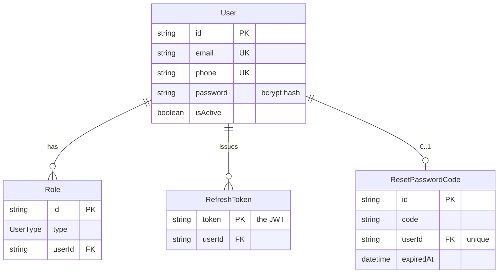
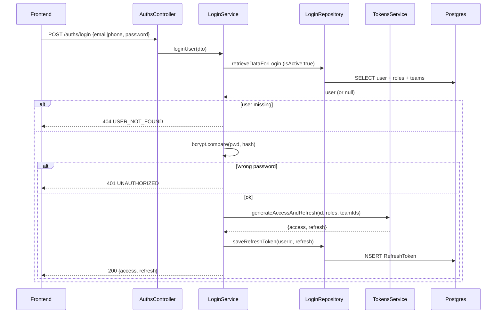
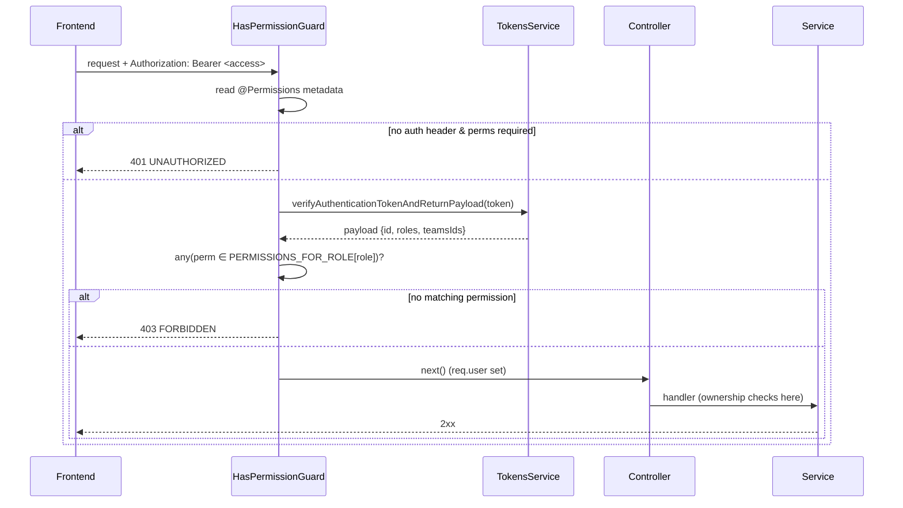
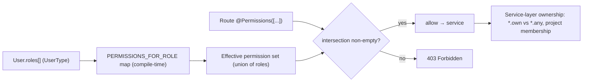

# Dossier 03 — Security, Authentication & RBAC

## 1. Identity
- **One-line purpose.** Cross-cutting security layer: account registration, credential login, JWT issuance/refresh/logout, password reset, and a role→permission RBAC model enforced by NestJS guards on every protected route.
- **Backend source root(s):**
  - `tdg-management-api-backend/src/auths/**` (controller, services, repositories, guards, decorators, DTOs)
  - `tdg-management-api-backend/src/tokens/**` (JWT service, refresh-token controller/repo)
  - `tdg-management-api-backend/src/common/bcrypt/**` (hashing/crypto)
  - `tdg-management-api-backend/src/common/constants/permissions.ts` (permission catalogue + role→permission map)
  - `tdg-management-api-backend/src/main.ts` (global ValidationPipe, CORS)
- **Frontend source root(s):**
  - `tawer-management-frontend/src/modules/auth/**` (sign-in/up, reset, refresh, middlewares)
  - `tawer-management-frontend/src/lib/{http-methods,localstorage}.ts`
- **Owned DB tables/models:** `RefreshToken`, `ResetPasswordCode` (auth.schema.prisma); `Role` + `UserType` enum (user.schema.prisma). Reads/writes `User.password` / `User.isActive`.

---

## 2. Purpose & business problem
The platform is a multi-tenant internal management tool with ~31 organizational roles (executives, project managers, agile team members, interns, HR). Two problems the module solves:
1. **Identity** — prove who is calling. Users authenticate with email **or** phone + password; the server returns a JWT access/refresh pair (`src/auths/services/login/login.service.ts:19`).
2. **Authorization** — a designer must not delete projects, an intern must not read manager statistics. A fixed catalogue of ~120 fine-grained permissions is mapped to roles at compile time, and a guard checks the caller's roles carry the permission the route requires (`src/common/constants/permissions.ts:376`; `src/auths/guards/has-permission.guard.ts:47`).

New accounts self-register but land in `PendingApproval` (almost no permissions) until an executive assigns a real role (`src/auths/repositories/registration.repository.ts:37`; `src/common/constants/permissions.ts:832`).

---

## 3. Domain model & database
Source: `prisma/schema/auth.schema.prisma`, `prisma/schema/user.schema.prisma`.

### RefreshToken (`auth.schema.prisma:1`)
```
userId    String
token     String   @id            // the JWT string itself is the primary key
createdAt DateTime @default(now())
updatedAt DateTime @updatedAt
user      User     @relation(..., onDelete: Cascade)
@@unique([token, userId])
```
- **Why:** refresh tokens are the *only* server-side auth state. Storing the token string lets `refresh` reject tokens that were never issued / already logged out (`src/tokens/service/tokens.service.ts:68`), and lets logout revoke a session (`src/auths/repositories/logout.repository.ts:8`). Access tokens are **not** stored → stateless, non-revocable.
- **Verified debt:** `token` is already `@id` (unique), so the extra `@@unique([token, userId])` composite is redundant (also flagged in dossier 02). Logout deletes via that composite key `token_userId` (`logout.repository.ts:11`).

### ResetPasswordCode (`auth.schema.prisma:11`)
```
code      String
userId    String   @unique        // exactly one live code per user
expiredAt DateTime @db.Timestamp(6)
@@unique([userId, code])
```
- **Why `userId @unique`:** the repository `upsert`s on `userId`, so requesting a new code overwrites the previous one (`src/auths/repositories/reset-password.repository.ts:14`). There is **no attempt counter** column → no lockout after N wrong guesses.

### Role + UserType (`user.schema.prisma:97`, `:108`)
```
model Role { type UserType; userId String; @@unique([type, userId]) }
enum UserType { CEO CTO CMO TawerCreativeProjectManager ... PendingApproval TawerCreativeIntern TawerDevIntern }  // 31 values
```
- **Why a separate `Role` table (N-1 to User) instead of an enum column:** a user can hold **multiple** roles simultaneously; `@@unique([type,userId])` prevents duplicate role rows. Login flattens roles into the JWT (`login.service.ts:41`).

### User (auth-relevant fields, `user.schema.prisma:1`)
- `password String` (bcrypt hash), `isActive Boolean @default(false)`, `email`/`phone` both `@unique`. Login only matches `isActive: true` rows (`src/auths/repositories/login.repository.ts:10`). Note: registration overrides the default and writes `isActive: true` immediately (`registration.repository.ts:19`), so the `@default(false)` is never exercised by the normal flow.



---

## 4. Backend architecture
Layering follows the project convention (controller → service → repository → dto; see dossier 01). Auth-specific pieces:

**Controllers**
- `AuthsController` (`src/auths/controller/auths.controller.ts:53`) — 6 endpoints: register, login, logout, request/verify/reset password. Only `logout` is guarded; the rest are public by design.
- `TokensController` (`src/tokens/controllers/tokens.controller.ts:13`) — `verify`, `refresh` (both public).

**Services**
- `LoginService` (`login.service.ts:19`) — fetch by email/phone, `bcrypt.compare`, mint tokens, persist refresh. Throws `NotFoundCustomException(USER_NOT_FOUND)` when the user is absent and `UnauthorizedCustomException` when the password is wrong — two distinguishable responses (enumeration, see §9).
- `AccountRegistrationService` (`account-registration.service.ts:24`) — requires an uploaded image, hashes the password, slugifies name, creates the user with `PendingApproval` + notification sub-records, sends welcome email, maps Prisma `P2002` → `USER_ALREADY_EXIST`, and rolls back the uploaded image on failure (`:55`).
- `LogoutService` (`logout.service.ts:18`) — **decodes** (not verifies) the refresh token and deletes the matching `RefreshToken` row; `P2025` → "user not logged".
- `ResetPasswordService` (`reset-password.service.ts:26`) — 3-step flow: generate a 5-digit code (`generateCode`, `Math.random`, `:115`), email it, verify it, then re-hash the new password.
- `TokensService` (`tokens.service.ts:19`) — signs `{ id, roles, teamsIds, type }` (`:33`); `refreshAccessToken` verifies the JWT **and** confirms it exists in `RefreshToken` before minting a new access token (`:62`). `verifyAuthenticationTokenAndReturnPayload` (`:95`) is the single verify entrypoint used by all guards.
- `PermissionsService` (`permissions.service.ts:12`) — higher-order authorization for user/team management (`canUserManageUsers`, `canUserManageTeams`) built on `EXECUTIVE_MANAGER_ROLES`, `ROLE_MANAGE_ROLES`, and manager↔team membership (`manage-permissions.repository.ts`). Exported for the users/teams modules.

**Repositories** — thin Prisma wrappers; all queries are parameterized `findUnique/create/upsert/delete/count` (no raw SQL in this module).

**Guards & decorators** — see §9. **Module wiring** — `AuthsModule` (`auths.module.ts`) imports `TokensModule`, `BcryptModule`, `MailModule`, `PrismaModule`; exports `LoginService` + `PermissionsService`. `TokensModule` (`tokens.module.ts:13`) registers `JwtModule` with `secret: SECRET_KEY` and exports `TokensService` (consumed by every guard).

---

## 5. API surface

| Method | Path | Auth/Perm | Request DTO | Response | Validation | Business logic | Side effects |
|---|---|---|---|---|---|---|---|
| POST | `/auths/register` | **Public** | `CreateUserAccountDto` (multipart, image) | `CreatedUserDto` | email/phone/name/password(min7) | hash pwd, create user w/ `PendingApproval`, `isActive:true` | image stored; welcome email; sub-records (telegram/ntfy/settings) created (`auths.controller.ts:62`) |
| POST | `/auths/login` | **Public** | `LoginUserDto` (email XOR phone + pwd) | `LoginResponseDto` `{access,refresh}` | `@ValidateIf` email/phone; pwd min7 | verify pwd, mint pair | refresh row inserted (`:88`) |
| POST | `/auths/logout` | `HasPermissionGuard` + `AUTH_LOGOUT` | `LogoutDto {token}` | 204 | token non-empty | decode refresh, delete row | refresh revoked (`:99`) |
| POST | `/auths/request-reset-code` | **Public** | `RequestResetPasswordDto {email}` | 204 | IsEmail | upsert 5-digit code, 15 min | email sent; `USER_NOT_FOUND` if absent (`:112`) |
| POST | `/auths/verify-reset-code` | **Public** | `VerificationResetPasswordDto {email,code}` | 204 | code len 5 | compare code + expiry | none (`:129`) |
| POST | `/auths/reset-password` | **Public** | `ResetPasswordDto {email,code,pwd}` | 204 | code len 5, pwd min7 | re-check code, hash + update pwd | password changed (`:146`) |
| POST | `/tokens/verify` | **Public** | `TokenDto {token}` | 204 | token non-empty | `jwt.verify` | none (`tokens.controller.ts:17`) |
| POST | `/tokens/refresh` | **Public** | `TokenDto {token}` | `AccessTokenDto {access}` | token non-empty | verify + DB-exists → new access | none (`tokens.controller.ts:25`) |

Across the rest of the API, **139 route-level `@UseGuards` declarations span 18 controllers**, effectively all `HasPermissionGuard` (grep: `*.controller.ts`), each paired with a `@Permissions([...])` list. Representative usage: `tasks.controller.ts` (33 guarded routes), `projects.controller.ts` (17), `users.controller.ts` (10), `work-days.controller.ts` (11).

---

## 6. Frontend
- **Login** (`src/modules/auth/services/sign-in.ts:16`) — `POST /auths/login`, then stores **both tokens in `localStorage`** (`access`, `refresh`, `:19`).
- **Token attachment** — every authenticated service manually builds `Authorization: Bearer ${access}` from `localStorage` via `extractJWTokens()` (`src/modules/auth/utils/jwt/extract-tokens.ts:2`); 30+ call sites (e.g. `modules/tasks/services/extraction/tasks.ts:21`, `modules/users/services/extraction/users.ts:29`). There is **no axios interceptor** — the shared client (`src/lib/http-methods.ts:3`) adds no auth header automatically.
- **Refresh** (`src/modules/auth/services/refresh-token.ts:5`) — manual `POST /tokens/refresh` with the stored refresh token, overwrites `localStorage.access`. No automatic 401-triggered refresh.
- **Reset password** — 3-component wizard (`components/reset-password/{email,code,password}-step.tsx`) calling the three public endpoints.
- **Route protection** — the Next.js `middleware.ts` (`:5`) only handles activation/OAuth redirects; the `privateAccessMiddleware` call and the redirect-to-not-found are **commented out** (`middleware.ts:13`, `:31`). So there is **no server-side/SSR route gating** — access control is entirely client-side + backend guards.

---

## 7. Data flow & key scenarios

**Scenario A — Login**
1. UI `POST /auths/login {email|phone, password}`.
2. `LoginService` → `LoginRepository.retrieveDataForLoginByEmail/Phone` (only `isActive:true`).
3. `bcrypt.compare(plaintext, user.password)`; mismatch → 401.
4. `TokensService.generateAccessAndRefresh(id, roles[], teamIds[])` signs two JWTs (same payload, differ by `type` + expiry).
5. `LoginRepository.saveRefreshToken` inserts the refresh row.
6. Response `{access, refresh}` → frontend `localStorage`.

**Scenario B — Protected request (RBAC)**
1. UI sends `Authorization: Bearer <access>`.
2. `HasPermissionGuard` reads `@Permissions` metadata, verifies the JWT (`TokensService.verify…`), attaches `req.user`.
3. Guard passes if **any** of the required permissions is in `PERMISSIONS_FOR_ROLE[role]` for **any** of the user's roles; else 403.
4. Controller → service. Fine-grained ownership (`*.own` vs `*.any`) is resolved **in the service** (e.g. `tasks.service.ts:697` allows the assignee, project managers, PO/SM, or executives).

**Scenario C — Refresh**
1. `POST /tokens/refresh {token: <refresh>}`.
2. `verifyAuthenticationTokenAndReturnPayload` (signature + expiry).
3. `RefreshTokenRepository.countRefreshToken(token)`; `0` → `INVALID_JWT` 400.
4. New access token minted from the payload.

---

## 8. Diagrams (Mermaid)

**Login sequence**


**Protected request via HasPermissionGuard**


**RBAC resolution model**


---

## 9. Security

**Authentication touchpoints.** Password login only (`login.service.ts:32`); JWTs signed HS256 with a single symmetric `SECRET_KEY` (`tokens.module.ts:16`). Bcrypt hashing at `genSalt()` default cost 10 (`bcrypt.service.ts:8`); seed accounts share `password123` (`prisma/seed.ts:196`, dev only).

**Authorization / RBAC.** Enforced by `HasPermissionGuard` (`has-permission.guard.ts:17`) reading the `@Permissions` decorator (`permissions.decorator.ts`). Permissions are a **static compile-time map** (`PERMISSIONS_FOR_ROLE`, `permissions.ts:376`) — not persisted — so changing a role's rights requires a redeploy. Semantics are **OR across permissions and OR across a user's roles** (`has-permission.guard.ts:47-55`). Fine-grained `*.own`/`*.any` distinctions are enforced later in services (e.g. `tasks.service.ts:680-698`), not by the guard.

Supporting guards/decorators:
- `AgileOnlyGuard` (`agile-only.guard.ts:41`) — restricts sprint/epic/task routes to `projectType === 'AGILE'`, resolving the project via project→sprint→task→epic→milestone param lookups; used in tasks/sprints/epics only. If the entity isn't found it returns `true` and defers the 404 to the controller (`:137`).
- `IsAuthenticatedGuard` (`is-authenticated.guard.ts:6`) — authentication without permission checks; used on **exactly one** route (`projects.controller.ts:600`). It first reads `request.cookies?.accessToken`, but `cookie-parser` is **never registered** (dossier 01), so `req.cookies` is undefined and it falls back to the bearer header.
- `RolesGuard` + `@Roles` (`roles.guard.ts`, `roles.decorator.ts`) — **dead code**: no controller or module references them (grep across `src` finds only the definitions and tests).

**Injection protection.** All persistence goes through Prisma's parameterized query builder (repositories in scope use `findUnique/create/upsert/delete/count`); no raw SQL, no string interpolation into queries → SQL injection is structurally prevented for this module.

**Input validation / DTO whitelisting.** Global `ValidationPipe` with `transform: true` (`main.ts:12`) and per-field `class-validator` decorators (`IsEmail`, `IsPhoneNumber`, `MinLength(7)`, etc.). **Gap:** no `whitelist`/`forbidNonWhitelisted` → unknown properties in a body are not stripped (mass-assignment surface; also flagged in dossier 01). The `exceptionFactory` returns the full `details: errors` array to the client (`main.ts:19`), leaking validation internals.

**Token storage.** Backend: refresh tokens persisted in `RefreshToken`; access tokens stateless. Frontend: **both** tokens in `localStorage` (`sign-in.ts:19`) → readable by any injected script (XSS-exposed); not `HttpOnly` cookies.

**Verified gaps (evidence-cited):**
1. **Absurd token lifetimes.** `.env:42-43` sets `ACCESS_TOKEN_EXPIRATION="1200d"` and `REFRESH_TOKEN_EXPIRATION="1200d"` — access tokens valid ~3.3 years and non-revocable (logout only deletes the refresh row, `logout.service.ts:26`). A leaked access token is usable for years.
2. **`type` claim never enforced.** Access and refresh tokens are signed with the same secret and payload, differing only by `type` (`tokens.service.ts:36-59`); guards call `jwt.verify` without checking `payload.type === 'access'` (`has-permission.guard.ts:42`, `tokens.service.ts:95`). A **refresh token is therefore accepted as an access token** on every protected route.
3. **No rate limiting / lockout.** No `ThrottlerModule`, no login attempt counter, no reset-code attempt counter (grep: no `Throttler`/`helmet`). Login and `verify-reset-code` are brute-forceable.
4. **Weak reset code.** 5-digit numeric (100 000 combinations) generated with non-cryptographic `Math.random` (`reset-password.service.ts:115`), 15-minute window, single live code — brute-forceable given (3).
5. **User enumeration.** Both login (`USER_NOT_FOUND` vs `UNAUTHORIZED`, `login.service.ts:25/36`) and the reset flow (`USER_NOT_FOUND`, `reset-password.service.ts:34`) reveal whether an email/phone exists.
6. **Open CORS.** `app.enableCors()` with no config reflects all origins (`main.ts:9`).
7. **Weak dev secret.** `SECRET_KEY="secret-key-used"` (`.env:9`). Mitigation: `.env` is git-ignored (`.gitignore:46`) and **not tracked** — the secret is not committed, but the running default is trivially guessable.
8. **No security headers** (helmet absent) and **no global guard** (`APP_GUARD` never registered) — a controller/handler that simply forgets `@UseGuards` is fully public with no safety net.

---

## 10. Cross-module dependencies
- **Depends on:** `TokensModule` (verify JWTs — every guard), `BcryptModule`, `MailModule` (welcome + reset emails), `PrismaModule`, `UploadModule` (registration image), `LoggerModule`.
- **Depended on by:** effectively the whole API. `HasPermissionGuard` + `@Permissions` + `PERMISSIONS` are imported by all 18 route controllers. `AuthsModule` exports `PermissionsService` (consumed by users/teams for management authorization) and `LoginService`. `TokensService` is the single JWT verifier shared by all three guards.
- **Coupling note:** the permission catalogue (`permissions.ts`) is a project-wide shared constant — high fan-in but low churn; a single source of truth for RBAC (good cohesion), at the cost of redeploy-to-change (see §9).

---

## 11. Tests
- **Unit specs are empty scaffolds.** `login.service.spec.ts` (and siblings `logout/reset-password/permissions/account-registration/bcrypt/tokens.service.spec.ts`) instantiate with `providers: []` and assert only `toBeDefined()` (`src/auths/services/login/login.service.spec.ts:7-17`) — no behavioural coverage of hashing, token issuance, or guard logic.
- **Real coverage is the e2e RBAC suite.** `test/agile-permissions.e2e-spec.ts` drives the full permission matrix over supertest for CEO/PM/PO/SM/engineer roles; auth is minted directly by `test/genererToken.ts` (`getOrCreateTestUser`, `createUserWithRoles`) signing with `SECRET_KEY`.
- **Test-fidelity gap:** `genererToken.ts` signs `{ sub, email, roles, name }` (`:46`), omitting `id` and `teamsIds`. Guards read `roles` (present) so RBAC tests pass, but service-layer ownership checks that read `req.user.id` receive `undefined` under these tokens — those paths are effectively untested.
- **No test** exercises token expiry, refresh-token revocation on logout, reset-code brute force, or the `type`-claim confusion in §9.

---

## 12. Code quality
- **Consistent layering & error taxonomy** (good): custom exceptions carry a stable `ErrorCode` (`error.code.ts`) and are thrown uniformly (`UnauthorizedCustomException`, `ForbiddenCustomException`) — e.g. `has-permission.guard.ts:55`.
- **Guard duplication** (smell): `HasPermissionGuard`, `RolesGuard`, and `AgileOnlyGuard` each re-implement `authorization?.split('Bearer ')[1]` + verify (`has-permission.guard.ts:35`, `roles.guard.ts:23`, `agile-only.guard.ts:63`). Token extraction should be one helper.
- **Dead code** (`roles.guard.ts`, `roles.decorator.ts`) — unreferenced (§9).
- **Weak randomness** for security material (`Math.random` in `generateCode`, `reset-password.service.ts:118`).
- **Unused `req` params** threaded through services (`loginUser(req, dto)` never uses `req`, `login.service.ts:19`) — harmless but noise.
- **Frontend bug:** `src/lib/localstorage.ts:6` `getItem` never `return`s the value; low impact because call sites use `localStorage.getItem` directly instead.
- **Bcrypt service scope creep:** `encryptData/decryptData` use AES-256-CBC with a **fixed zero IV and static `'salt'`** (`bcrypt.service.ts:22-38`) — insecure deterministic encryption. Verified **not used for auth** (only `hashDataDeterministic` is used, for error-log deduplication in `all-exceptions.filter.ts:113`), so it is latent risk rather than an active vulnerability.

---

## 13. Verified technical debt
| # | Item | Evidence |
|---|---|---|
| 1 | Access + refresh TTL both `1200d`; access non-revocable | `.env:42-43`; `logout.service.ts:26` |
| 2 | `type` claim never validated → refresh usable as access | `tokens.service.ts:36-59,95`; `has-permission.guard.ts:42` |
| 3 | No rate limiting / lockout (login, reset verify) | no `Throttler`/`helmet` in `src` |
| 4 | 5-digit `Math.random` reset code | `reset-password.service.ts:115-120` |
| 5 | User enumeration on login + reset | `login.service.ts:25/36`; `reset-password.service.ts:34` |
| 6 | `ValidationPipe` without whitelist (mass assignment) | `main.ts:12-25` |
| 7 | Open CORS | `main.ts:9` |
| 8 | Dead `RolesGuard` + `@Roles` | grep: definitions only |
| 9 | Redundant `@@unique([token,userId])` on RefreshToken | `auth.schema.prisma:8` |
| 10 | Frontend tokens in `localStorage` (XSS); SSR route guard disabled | `sign-in.ts:19`; `middleware.ts:13,31` |
| 11 | Insecure AES fixed-IV crypto in `BcryptService` (latent, unused for secrets) | `bcrypt.service.ts:22-38` |
| 12 | Empty unit-test scaffolds for all auth services | `login.service.spec.ts:7-17` |

---

## 14. Strengths / Weaknesses / Improvements

**Strengths**
- **Centralized, declarative RBAC** — one permission catalogue + one guard applied on 139 routes gives a single, auditable authorization surface (`permissions.ts`, `has-permission.guard.ts`). *Impact:* consistent enforcement, easy to review.
- **Refresh tokens are server-side state** — enables real logout/revocation and rejects never-issued tokens (`tokens.service.ts:68`). *Impact:* sessions are revocable (for refresh, not access).
- **SQL-injection-safe by construction** — Prisma-only data access. *Impact:* removes an entire vulnerability class for this module.
- **Least-privilege default** — self-registered users get `PendingApproval` (`registration.repository.ts:39`). *Impact:* new accounts cannot act until promoted.

**Weaknesses** (why + impact)
- **3.3-year, non-revocable access tokens** (`.env:42`) — a single leaked token is a long-lived skeleton key; logout doesn't help. *Highest-severity issue.*
- **Type-claim confusion** (`tokens.service.ts`) — collapses the access/refresh distinction; a refresh token authenticates any request.
- **No throttling + weak reset code** — password-reset takeover is feasible offline within the 15-min window.
- **Enumeration + verbose validation errors** — aids reconnaissance.
- **Client-side-only route gating** (`middleware.ts:13`) — no defense in depth on the frontend.

**Improvements** (concrete, feasible)
- Set `ACCESS_TOKEN_EXPIRATION` to ~15m and `REFRESH_TOKEN_EXPIRATION` to ~7–30d; add an access-token TTL that makes non-revocability acceptable.
- In `verifyAuthenticationTokenAndReturnPayload`, assert `payload.type === 'access'` for guards and `=== 'refresh'` in `refreshAccessToken`; consider separate secrets.
- Add `@nestjs/throttler` on `/auths/login` and `/auths/verify-reset-code`; add an attempt counter/expiry to `ResetPasswordCode`.
- Generate the reset code with `crypto.randomInt` and widen to ≥6 digits (or a signed link).
- Enable `whitelist: true, forbidNonWhitelisted: true` on `ValidationPipe`; strip `details` from client responses.
- Configure CORS to an allowlist; add `helmet`. Register `HasPermissionGuard` behaviourally as `APP_GUARD` with a public-route decorator to fail closed. Delete `RolesGuard`/`@Roles` or wire them in.
- Move frontend tokens to `HttpOnly` cookies + an axios interceptor for transparent refresh; re-enable SSR route protection.

---

## 15. Verification Checklist
| Area | Verified? | Evidence / reason |
|---|---|---|
| Domain model (RefreshToken, ResetPasswordCode, Role, UserType) | **Yes** | `auth.schema.prisma:1-21`, `user.schema.prisma:97-140` |
| Auth flows (register/login/logout/reset) | **Yes** | controllers + services read in full (`auths.controller.ts`, `*.service.ts`) |
| JWT issue/refresh/verify | **Yes** | `tokens.service.ts:26-115`, `tokens.module.ts:13` |
| Password hashing (bcrypt) | **Yes** | `bcrypt.service.ts:7-19`, `seed.ts:50` |
| RBAC guard logic + decorators | **Yes** | `has-permission.guard.ts`, `roles.guard.ts`, `agile-only.guard.ts`, `is-authenticated.guard.ts` |
| Permission→role map | **Yes** | `permissions.ts:194-928` read in full |
| Guard application across controllers | **Yes** | grep: 139 `@UseGuards` in 18 controllers |
| Every endpoint in scope (8 auth/token routes) | **Yes** | §5 table cites controller lines |
| Global validation / CORS config | **Yes** | `main.ts:9-25` |
| Injection protection | **Yes** | repositories are Prisma-only (no raw SQL) |
| Frontend auth (storage, headers, refresh, gating) | **Yes** | `sign-in.ts`, `extract-tokens.ts`, `refresh-token.ts`, `middleware.ts` |
| Tests | **Partial** | unit specs empty; e2e RBAC present (`agile-permissions.e2e-spec.ts`) but not run here |
| Tech debt / gaps | **Yes** | each row in §13 cited |
| Runtime/pentest confirmation of §9 gaps | **No** | static reading only; no live token-replay/brute-force test executed |

---

## 16. Not verified / Open questions
1. **Runtime confirmation** that a `refresh`-type token is actually accepted on a protected route (§9.2) — reasoned from code; a live request would confirm. *Would need:* a running instance + a crafted request.
2. **Effective JWT algorithm** — `JwtModule` sets only `secret`, so it defaults to HS256; not explicitly pinned (`tokens.module.ts:16`). *Would need:* decode a real token header.
3. **Is `IMAGES` / upload path traversal possible** on the registration image? Out of scope here (see dossier for uploads/DevOps).
4. **Google/Facebook OAuth** — env keys exist (`.env:20-32`) and `BcryptService.hashDataForFacebook` hints at a social flow, but no OAuth controller was found in `src/auths`. Appears **not implemented / dead config**; not verified beyond the missing code.
5. **2FA** — frontend has `hooks/use-2fa-login.ts` and `services/2fa/*`, and `ErrorCode` reserves `INVALID_TWO_FACTOR_AUTH_CODE`, but no backend 2FA endpoint exists in scope. Appears **frontend-only stub**; not verified.
6. **Whether any protected route accidentally omits `@UseGuards`** — spot-checked, not exhaustively audited across all 146 endpoints. *Would need:* a per-route guard-coverage script.
