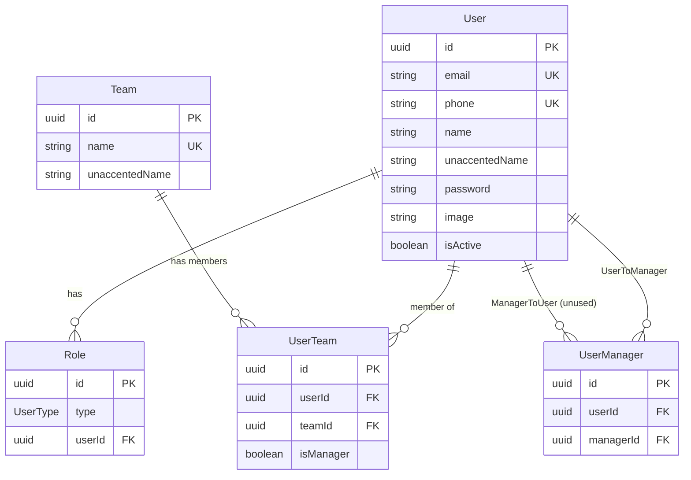
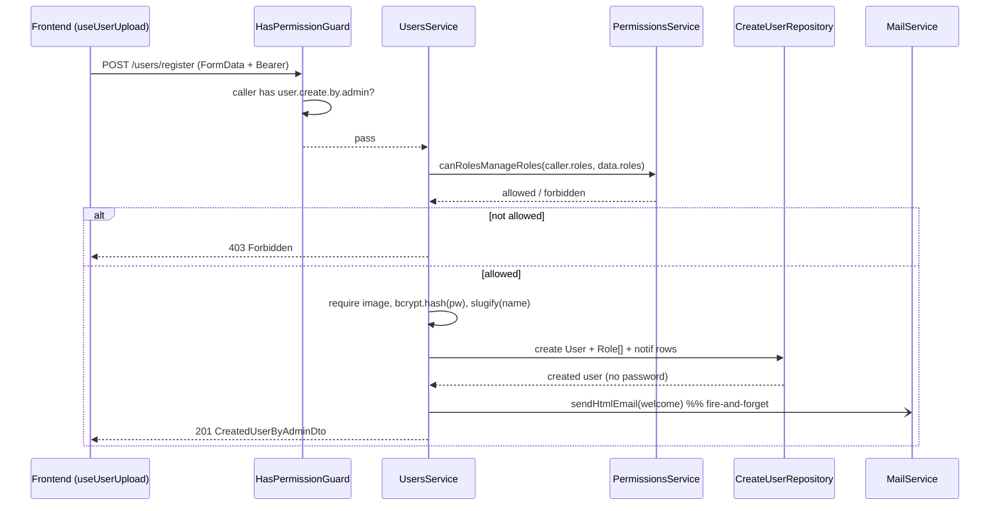
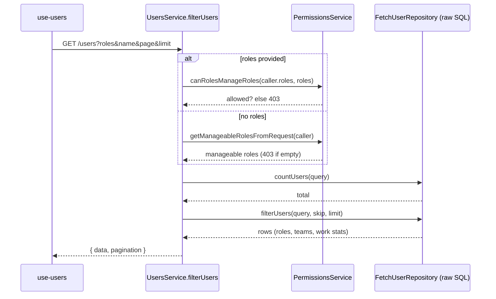

# Dossier 04 — Users & Teams

> Scope: backend `src/users/**`, `src/teams/**` (+ models `User`, `UserManager`, `Team`, `UserTeam`,
> `Role`, enum `UserType`); frontend `tawer-management-frontend/src/modules/users/**` and the
> `dashboard/(auth)/users/**` pages. RBAC enforcement mechanics (guards, permission map) belong to
> [[03-security-auth-rbac]] and are only cited here. Schema-wide concerns belong to
> [[02-database-architecture]].

## 1. Identity
- **Purpose:** Administrative user lifecycle (create/read/update/soft-delete, profile self-service,
  password change, bulk email) plus team grouping of users.
- **Backend source roots:** `tdg-management-api-backend/src/users/`, `tdg-management-api-backend/src/teams/`
- **Frontend source roots:** `tawer-management-frontend/src/modules/users/` (teams live inside the same
  module — there is no separate `modules/teams`), pages under
  `tawer-management-frontend/src/app/[locale]/dashboard/(auth)/users/`
- **Owned DB tables/models:** `User`, `Role`, `Team`, `UserTeam`, `UserManager`
  (`prisma/schema/user.schema.prisma:1-140`). Satellite tables `UserTelegramBot`, `UserNtfyIntegration`,
  `UserNotificationSettings` are written here but owned by [[12-notifications]].

## 2. Purpose & business problem
The platform is an internal company tool; there is no public self-registration. Users are provisioned
by privileged roles via `POST /users/register` (`users.controller.ts:68-91`) — the method is literally
named `createUserAccountByAdmin`. Every account carries one or more `UserType` roles
(`user.schema.prisma:97-140`) that drive RBAC. Teams (`Team` + `UserTeam` join) group users and, via
`UserTeam.isManager`, encode who manages whom for authorization purposes
(`manage-permissions.repository.ts:19-33`). The module therefore serves two real workflows: **HR/exec
administration** (create users, assign roles/teams, disable accounts, email staff, export CSV) and
**employee self-service** (`GET /users/me`, `PATCH /users/me`, `PATCH /users/password/me`).

## 3. Domain model & database
Source: `prisma/schema/user.schema.prisma`.

| Model | Key fields | Notable constraints |
|-------|-----------|---------------------|
| `User` | `id` uuid PK, `email @unique`, `phone @unique`, `name`, `unaccentedName`, `password`, `image?`, `isActive @default(false)`, `createdAt/updatedAt` | Two unique business keys (email + phone); `unaccentedName` is a denormalized accent-stripped copy of `name` used for search (`user.schema.prisma:1-11`) |
| `Role` | `id`, `type UserType`, `userId` FK | `@@unique([type, userId])` — a user cannot hold the same role twice; roles modeled as **rows**, not an array, so one user = N `Role` rows (`user.schema.prisma:97-106`) |
| `Team` | `id`, `name @unique`, `unaccentedName` | Global unique name (`user.schema.prisma:88-95`) |
| `UserTeam` | `id`, `userId` FK, `teamId` FK, `isManager @default(false)` | `@@unique([userId, teamId])`; both FKs `onDelete: Cascade`; `isManager` is the **only** manager signal actually used at runtime (`user.schema.prisma:75-86`) |
| `UserManager` | `id`, `userId`, `managerId`, self-relations `ManagerToUser`/`UserToManager` | `@@unique([userId, managerId])`, both `onDelete: Cascade` (`user.schema.prisma:63-73`) |

**Design rationale (verified):**
- *Roles as rows with `@@unique([type,userId])`* — allows a user to hold several roles (e.g. `CEO` +
  something) while preventing duplicates; the whole RBAC map keys off `UserType`
  (`permissions.ts:867-928`).
- *`unaccentedName` denormalization* — search is accent-insensitive: writes slugify the name
  (`users.service.ts:64`, `teams.service.ts:37`) and reads filter on `unaccentedName`
  (`fetch-user.repository.ts:251`, `fetch-team.repository.ts:39-46`).
- *`isActive` default `false`* — but `createUserByAdmin` explicitly sets `isActive: true`
  (`create-user-repository.ts:20`), and "deletion" flips it back to `false` (soft delete, §7).
- *Cascade on `UserTeam`/`Role`/`UserManager`* — deleting a `User` or `Team` cleans up membership rows
  automatically.

**Not verified / cross-module:** the `UserManager` self-relation is declared but **no code in the repo
reads or writes it** (see §13); the actual manager check goes through `UserTeam.isManager`. There is no
`BusinessUnit` enum in the schema despite the session brief mentioning one — only `UserType` exists
(`user.schema.prisma:108-140`, grep for `BusinessUnit` returns no enum definition).

## 4. Backend architecture
Both modules follow the project's 4-layer pattern (see [[01-backend-architecture]]):
`controller → service → repository (create/fetch/update/delete) → Prisma`.

**Users** (`users.module.ts:16-36`): `UsersController` → `UsersService` →
`{Create,Fetch,Update,Delete}UserRepository`. The service also injects `MailService`, `UploadService`,
`BcryptService`, `ErrorLoggerService`, and — crucially for authorization — `PermissionsService`
(`users.service.ts:32-42`).

**Teams** (`teams.module.ts`): `TeamsController` → `TeamsService` →
`{Create,Fetch,Update,Delete}TeamRepository` + `PermissionsService` (`teams.service.ts:20-27`).

Key mechanics:
- **Authorization is two-tiered.** A coarse guard `@Permissions([...]) @UseGuards(HasPermissionGuard)`
  gates each route (e.g. `users.controller.ts:70-71`), and a fine-grained *data-scoped* check runs
  inside the service via `PermissionsService.canRolesManageRoles` / `canUserManageUsers` /
  `canUserManageTeams` (`permissions.service.ts:17-98`). Example: create-user verifies the caller may
  assign the requested roles (`users.service.ts:50-54`); create/update-team verify the caller may manage
  the target member users (`teams.service.ts:31-35, 80-84`).
- **File uploads** use `FileInterceptor('image', UploadStorage.UserImageConfig())`
  (`users.controller.ts:80-83`); on any downstream error the just-uploaded file is deleted
  (`users.service.ts:80`), and when replacing an image the old one is removed after a successful update
  (`users.service.ts:263-266`).
- **Error handling** maps Prisma error codes to domain exceptions: `P2002` → "already exists"
  (`users.service.ts:82-88`), `P2025` → "not found" (`users.service.ts:277-284`), consistently across
  both services (`teams.service.ts:42-53, 92-111`).
- **Serialization** — every read/write route uses `ClassSerializerInterceptor` + `@SerializeOptions`
  with a response DTO (e.g. `users.controller.ts:105-106`), so `password` is never projected (the fetch
  queries also never select it, `fetch-user.repository.ts:125-184`).
- **Raw SQL** — user listing/count use `$queryRawUnsafe` with string interpolation
  (`fetch-user.repository.ts:126, 194, 276`) rather than Prisma query-builder; teams use the safe
  builder (`fetch-team.repository.ts`). See §9 for the injection analysis.

## 5. API surface

### `/users` — `users.controller.ts`
| Method | Path | Perm | Request DTO | Response DTO | Validation | Business logic | Side effects |
|--------|------|------|-------------|--------------|-----------|----------------|--------------|
| POST | `/users/register` | `user.create.by.admin` | `CreateUserByAdminDto` + `image` file | `CreatedUserByAdminDto` | class-validator; image required (`users.service.ts:56-60`) | Verify caller can assign `roles`; hash pw; create user+roles+notif rows | Sends welcome email (`users.service.ts:69-76`); deletes file on error |
| GET | `/users/me` | `user.read.own` | — | `UserDetailsForManagerDto` | — | Raw-SQL aggregate of self (online status, teams, roles, work stats) | none |
| GET | `/users/roles` | `role.read` | — | `RolesDto` | — | Returns roles the caller may manage (`permissions.service.ts:88-94`) | none |
| GET | `/users` | `user.read.many.by.manager` | `FilterUsersDto` (query) | `PaginateUsersDto` | regex + quote-escape + UUID/enum (§9) | Paginated, role-scoped filtered list | none |
| GET | `/users/csv` | `user.read.many.by.manager` | `FilterUsersDto` (query) | CSV stream | same as above | Same filter → CSV via `json2csv` | Sets `Content-Type: text/csv` (`users.service.ts:224-226`) |
| PATCH | `/users/password/me` | `user.update.password.self` | `UpdatePasswordDto` | `UpdatedUserDto` | min 7 chars | Verify old pw (bcrypt), hash+store new | none |
| PATCH | `/users/me` | `user.update.self` | `UpdateOwnDetailsDto` + `image?` | `UpdatedUserDto` | class-validator | Update own profile/notif settings | Replaces image; deletes old |
| PATCH | `/users/:id` | `user.update.by.manager` | `UpdateUserDetailsByAdminDto` + `image?` | `UpdatedUserDto` | class-validator | Verify caller may assign `roles`; update user, roles, teams, notif | Replaces image |
| POST | `/users/emails` | `email.send` | `SendEmailsDto` + `attachments[]` | `EmailSentDto` | — | Send bulk email to all users or a subset | Sends email w/ ≤50 attachments (`users.controller.ts:419-424`) |
| DELETE | `/users/:id` | `user.delete` | — | 204 | — | **Soft delete** (`isActive:false`); permission check is buggy (§9/§13) | none |

### `/teams` — `teams.controller.ts`
| Method | Path | Perm | Request DTO | Response DTO | Validation | Business logic | Side effects |
|--------|------|------|-------------|--------------|-----------|----------------|--------------|
| POST | `/teams/register` | `team.create` | `CreateTeamDto` | `CreatedTeamDto` | name required; members `@ValidateNested` (weak, §13) | Verify caller may manage member users; create team + members | none |
| GET | `/teams` | `team.read.many` | `FilterTeamsParametersDto` (query) | `PaginateTeamsDto` | page/limit numbers, `search` string | Paginated team list (Prisma builder) | none |
| PATCH | `/teams/:id` | `team.update` | `UpdateTeamDto` | `UpdatedTeamDto` | optional name; members nested | Verify caller may manage members; upsert/prune members | none |
| DELETE | `/teams/:id` | `team.delete` | — | 204 | — | Verify caller may manage the team (by member roles); **hard delete** | Cascades `UserTeam` rows |

## 6. Frontend
- **Pages** (`app/[locale]/dashboard/(auth)/users/`): `page.tsx` → `render.tsx` (user table),
  `users/teams/` (team management), `users/profile/me/` (own profile), `users/profile/[id]/`
  (other user's profile). Each render gates on `hasPermissions(user.roles, "usersManagement", "view")`
  and shows `<AccessDenied/>` otherwise (`users/render.tsx:16`).
- **Module** `src/modules/users/`:
  - *Services* — `services/extraction/users.ts` builds the `/users` query string and attaches the Bearer
    token from `extractJWTokens()` (`users.ts:26-63`); `services/extraction/teams.ts` for `/teams`;
    `services/user-upload/index.ts` POSTs `/users/register` or PATCHes `/users/:id` with `FormData`
    (`user-upload/index.ts:20-24`); `services/team-upload/index.ts` analogous. Deletion is centralized in
    `src/services/element-deletion.ts` (`DELETE /users/:id` or `/teams/:id`, `element-deletion.ts:24-29`).
    Every service catches `401` and retries once through `refreshToken(...)`.
  - *Hooks* — `hooks/extraction/use-users.ts` wraps TanStack Query (`queryKey ["users", user, page, …]`,
    `enabled` only when the user has view permission, `use-users.ts:52-61`), owns filter/search/sort/
    pagination state; `hooks/user-upload.ts` wires `react-hook-form` + `zodResolver`
    (`user-upload.ts:41-54`); deletion state via shared `hooks/use-elements-deletion.ts`
    (bulk-select then `Promise.all` deletes, invalidates `["users"]`/`["teams"]`,
    `use-elements-deletion.ts:35-54`).
  - *Validation* — `validation/schemas/user.schema.ts` (Zod: email, phone via `libphonenumber`, password
    min 8, ≥1 role, image mime whitelist, telegram-chat-id conditional) and `team.schema.ts`.
  - *State* — no Zustand store here; server state is TanStack Query, form state is react-hook-form
    (module contains no `store/` directory).
- **UX flow (admin):** open Users page → table with search-by (name/email/phone), role filter, sort,
  pagination → "Add" opens `UploadUserDialog` (create) → row actions edit (`UploadUserDialog` prefilled)
  or select rows → `DeletionConfirmationDialog` → soft delete. All action affordances are themselves
  permission-gated (`users-list.tsx:687, 700`).

## 7. Data flow & key scenarios

**A. Create user by admin** (`POST /users/register`)
1. FE: `useUserUpload.onSubmit` validates with Zod, `cleanUserDataToUpload` builds `FormData`, calls
   `uploadUserOnServerSide` (`user-upload.ts:62-75`).
2. `HasPermissionGuard` checks the caller holds `user.create.by.admin` ([[03-security-auth-rbac]]).
3. `UsersService.createUserAccountByAdmin`: `canRolesManageRoles(caller.roles, data.roles)` →
   `Forbidden` if the caller may not grant those roles (`users.service.ts:50-54`); require image
   (`:56-60`); `bcrypt.hash(password)` (`:62`); slugify name (`:64`).
4. `CreateUserRepository.createUserByAdmin` inserts `User` + nested `Role[]`, a default
   `NotificationToken`, `notificationSettings`, `ntfyIntegration`, `telegramBot`
   (`create-user-repository.ts:11-50`).
5. Fire-and-forget welcome email (`users.service.ts:69-76`); on `P2002` → 400 "already exists" and the
   uploaded image is deleted (`:80-88`).
6. FE invalidates `["users"]`, toasts success.

**B. Filter/list users** (`GET /users`)
1. FE `use-users` assembles params; service serializes them (`users.ts:31-58`).
2. Service resolves the effective role scope: if the caller passes `roles`, verify manageability; else
   default to the caller's manageable roles, and 403 if that set is empty
   (`users.service.ts:144-153`).
3. `countUsers` then `filterUsers` run interpolated raw SQL with `LEFT JOIN`s across roles, teams,
   work-sessions/days and notification satellites, aggregating online status and work stats
   (`fetch-user.repository.ts:271-430`).
4. Pagination computed (`setPaginationParametersInResponse`, `users.service.ts:450-466`), response
   serialized to `PaginateUsersDto`.

**C. "Delete" user** (`DELETE /users/:id`) — soft delete, with a bug
1. Guard checks `user.delete`.
2. Service fetches details for **`req.user.id` (the caller!)**, not `userId`
   (`users.service.ts:418`), then `canRolesManageRoles(caller.roles, caller.roles)`
   (`:427-431`) — i.e. it checks whether the caller can manage *their own* roles, never the target's.
3. `UpdateUserRepository.updateUserDetailsByAdmin(userId, {isActive:false})` flips the target inactive
   (`users.service.ts:433-435`). The injected `DeleteUserRepository.deleteUserById` hard-delete is
   **never called** (§13).

## 8. Diagrams (Mermaid)

### 8.1 ERD slice (this module's tables)

### 8.2 Sequence — create user by admin

### 8.3 Sequence — filter users (role-scoped)

## 9. Security
- **AuthN/AuthZ:** all 14 endpoints require a valid JWT and a specific permission via
  `HasPermissionGuard` (`users.controller.ts`, `teams.controller.ts`); mechanics in
  [[03-security-auth-rbac]]. Data-scoped checks (`canRolesManageRoles`, `canUserManageUsers`,
  `canUserManageTeams`) add per-target authorization (`permissions.service.ts:17-98`).
- **Password handling:** stored bcrypt-hashed (`users.service.ts:62, 399`); never selected or returned
  (`fetch-user.repository.ts`, response DTOs). Self password change re-verifies the old password
  (`users.service.ts:387-396`).
- **SQL injection surface (mitigated but fragile):** `filterUsers`/`countUsers` interpolate request
  values directly into raw SQL (`fetch-user.repository.ts:194-268, 276-429`). Mitigations live in
  `FilterUsersDto`: a keyword blacklist regex (`@Matches(GlobalRegex.SQL_INJECTION_REGEX)`,
  `filter-users-parameters.dto.ts:22-59`; regex at `regex-sql-constant.ts:2-3`), single-quote escaping
  `value.replace(/'/g,"''")` on `email`/`name`/`phone` (`:37,47,57`), `@IsUUID('4')` on `teamsIds`/
  `usersIds` (`:76,85`), `@IsEnum(UserType)` on `roles` (`:67`), and `TimeService.isUTC` gating on date
  bounds (`fetch-user.repository.ts:258,263`). Net: not trivially injectable, but the pattern is a
  standing risk — the blacklist regex is incomplete (allows e.g. `OR 1=1`) and the only thing stopping
  it is the quote-escape. **Recommend parameterized `$queryRaw` / Prisma builder.**
- **Mass assignment:** the global `ValidationPipe` sets `transform:true` but **no `whitelist`/
  `forbidNonWhitelisted`** (`main.ts:12-25`). DTO fields with no validation decorators
  (`image`, `unaccentedName`) are accepted from the body. In `updateOwnDetails`, when no file is sent the
  client-supplied `data.image` is written straight to the DB (`users.service.ts:352-355`) — a user can
  set their own `image` to an arbitrary string. (`hashedPassword`/`unaccentedName` are re-derived server
  side, so those are inert.)
- **Privilege-escalation via delete (verified):** `deleteUserByAdmin` never authorizes against the
  target — it checks the caller against the caller (`users.service.ts:418, 427-431`). Any holder of
  `user.delete` (per `permissions.ts`: CEO/CTO/CMO/HRManager) can soft-delete **any** account,
  including higher-privileged ones, because the target's roles are never consulted. E.g. `HRManager`
  (whose manageable set excludes CEO/CTO/CMO, `permissions.ts:899-902`) can still disable a `CEO`.
- **User enumeration / errors:** duplicate email/phone surface as a distinct `P2002` "already exists"
  message (`users.service.ts:85-88`), consistent with the global enumeration weakness noted in
  [[03-security-auth-rbac]].
- **Team delete authorization:** `canUserManageTeams` scopes non-CEO callers to teams whose members'
  roles are within the caller's manageable set (`permissions.service.ts:53-71`,
  `manage-permissions.repository.ts:35-52`) — reasonable, though an **empty team** (0 members) makes
  `countTeamByIdsAndMembersRoles` return 0 ≠ 1, so a non-CEO cannot delete an empty team (minor UX edge).

## 10. Cross-module dependencies
- **Depends on:** `AuthsModule`/`PermissionsService` + permission constants (RBAC),
  `BcryptModule`, `MailModule`, `UploadModule`, `LoggerModule`, `PrismaModule`, `TokensModule`
  (`users.module.ts:16-25`). `SlugifyService`, `TimeService` (common).
- **Depended on by:** `UsersService` is exported (`users.module.ts:34`) and consumed by
  [[12-notifications]] (the `getUsersWithNotificationsSettings*` / `getAllEmails` helpers,
  `users.service.ts:298-317`) and [[10-events-calendar]] (`getAllUsersForEvent`, `:412-414`). `Role`/
  `UserType` are the backbone of every module's authorization. `UserTeam.isManager` feeds
  server-management scoping in [[13-infrastructure-monitoring]] and project/agile manager checks.
- **Coupling note:** `FetchUserRepository` reaches across many domains in one query (WorkDay/WorkSession
  from [[09-time-attendance]], notification satellites from [[12-notifications]]) —
  high read-coupling concentrated in the raw-SQL list query (`fetch-user.repository.ts:271-430`).

## 11. Tests
Only NestJS scaffold specs exist: `users.controller.spec.ts`, `users.service.spec.ts`,
`teams.controller.spec.ts`, `teams.service.spec.ts` — each 18 lines, a single `should be defined`
(`users.service.spec.ts:1-18`). They instantiate the class with **no providers supplied**, so they
would fail to resolve dependencies if actually run; there is **zero behavioural coverage** of role
scoping, the delete authorization path, the raw-SQL filters, or team membership diffing. No e2e tests
for these modules were found.

## 12. Code quality
- **Good:** clear 4-layer separation; consistent Prisma-error→domain-exception mapping
  (`users.service.ts:277-292`); response DTOs + serialization keep `password` out of every response;
  image-cleanup-on-failure is disciplined (`users.service.ts:80, 276`).
- **Mixed:** `filterUsers` and `countUsers` duplicate a large interpolated WHERE/JOIN block almost
  verbatim (`fetch-user.repository.ts:194-268` vs `276-429`) — any filter change must be edited twice.
- **Bad — control flow:** `updateUserPassword` wraps everything in `try { … } catch (error) { if (error
  instanceof HttpException) throw error; throw error; }` — both branches rethrow, so the `catch` is dead
  (`users.service.ts:406-409`).
- **Bad — validation gaps:** `email` is `@IsEmail` on create (`create-user-by-admin.ts:19`) but only
  `@IsString` on admin update (`update-user-details-by-admin.dto.ts:102`); `teamsIds` are `@IsString`,
  not `@IsUUID`, on create/update DTOs.

## 13. Verified technical debt
- **`deleteUserByAdmin` authorizes the wrong subject** — fetches `req.user.id` and checks the caller
  against themselves instead of the target `userId` (`users.service.ts:418, 427-431`). Privilege-
  escalation + logic bug (see §9).
- **`DeleteUserRepository.deleteUserById` is dead code** — injected (`users.module.ts:31`,
  `users.service.ts:36`) and defined (`delete-user.repository.ts:8-12`) but never invoked; the delete
  route soft-deletes via the update repo instead (`users.service.ts:433`).
- **`UserManager` model is dormant** — declared with self-relations (`user.schema.prisma:63-73`) but no
  code reads/writes it (grep for `userManager`/`managedUsers` finds only the unrelated
  `UserServerManagement.managers` in `servers/`). Manager semantics are actually carried by
  `UserTeam.isManager`.
- **Aggregation bug in user list** — `SUM(DISTINCT WorkSessions."timeSpentInMinutes")` and
  `AVG(DISTINCT …)` (`fetch-user.repository.ts:163-165, 313-316`): using `DISTINCT` inside `SUM/AVG`
  collapses equal-valued sessions, undercounting `timeWorkedInMinutes`/averages.
- **Role filter leaks role-less users** — `AND (Role."type" IN (…) OR Role."type" IS NULL)`
  (`fetch-user.repository.ts:244, 372`): via the `LEFT JOIN`, users with no roles match every role
  filter, so they appear in every manager's scoped list.
- **Weak nested validation on teams** — `@ValidateNested({each:true})` without a `@Type(() =>
  CreateTeamMemberDto)` decorator (`create-team.dto.ts:32`, same in `update-team.dto.ts:29`) means
  class-transformer won't instantiate members, so `CreateTeamMemberDto`'s constraints effectively don't
  run; `userId` is only `@IsString` (not UUID) and `isManager` has no `@IsBoolean`
  (`create-team-member.dto.ts:4-20`).
- **Team search not accent-normalized** — `filterTeams` matches `unaccentedName` against the raw
  `data.search` (`fetch-team.repository.ts:39-46`) without slugifying it, unlike the user filter, so
  accented queries won't match stored unaccented names.
- **FE/BE password-length mismatch** — Zod requires min 8 (`user.schema.ts:29`) while
  `CreateUserByAdminDto`/`UpdatePasswordDto` require min 7 (`create-user-by-admin.ts:76`,
  `update-password.dto.ts:6,12`).
- **CSV export UI is dead** — `/users/csv` endpoint exists (`users.controller.ts:228-320`) but the FE
  `exportDataIntoCSV` handler and its wiring are fully commented out (`use-users.ts:81-105`); the returned
  `exportIsPending` is always `false`.

## 14. Strengths / Weaknesses / Improvements
**Strengths**
- Layered, consistent structure makes the modules easy to read; RBAC is applied at every route.
- Sensitive data hygiene: `password` never leaves the server; image lifecycle handled on failure.
- Two-tier authorization (guard + service-level role scoping) is a genuinely good pattern where wired
  correctly (create/update/team paths).

**Weaknesses**
- The delete-authorization bug is a real security defect (privilege escalation), and the absence of any
  behavioural tests means it went uncaught.
- Raw interpolated SQL for the core listing is fragile and duplicated; safety depends entirely on DTO
  quote-escaping rather than parameterization.
- No `whitelist` on the global pipe → mass-assignment (`image`) reaches the DB.
- Dormant `UserManager` and unused hard-delete repo indicate an unfinished/abandoned design that misleads
  readers about how "managers" work.

**Improvements (concrete)**
1. Fix `deleteUserByAdmin` to fetch and authorize against the **target** `userId`
   (`users.service.ts:416-431`); add a service unit test for the escalation case.
2. Replace `$queryRawUnsafe` with `Prisma.sql`/`$queryRaw` tagged parameters, or move the filter to the
   query-builder like teams do; deduplicate the count/list WHERE block.
3. Enable `whitelist:true` (and ideally `forbidNonWhitelisted:true`) on the global `ValidationPipe`
   (`main.ts:12-25`); stop trusting `data.image` from the body.
4. Add `@Type(() => …MemberDto)` to the team `members` arrays and tighten `userId`→`@IsUUID`,
   `isManager`→`@IsBoolean`.
5. Drop the `DISTINCT` from `SUM/AVG` and reconsider the `OR Role."type" IS NULL` role filter.
6. Either remove `UserManager` + `DeleteUserRepository.deleteUserById` or wire them; align FE/BE password
   minimums.

## 15. Verification Checklist
| Area | Verified? | Evidence / reason |
|------|-----------|-------------------|
| Domain model | Yes | `user.schema.prisma:1-140` read in full |
| Backend logic (services/repos) | Yes | all users/teams services + 8 repositories read |
| Every endpoint | Yes | both controllers read line-by-line (`users.controller.ts`, `teams.controller.ts`) |
| RBAC / permission mapping | Yes | `permissions.service.ts`, `manage-permissions.repository.ts`, `permissions.ts:848-928` |
| Frontend pages/hooks/services | Yes | pages, `use-users`, upload/deletion hooks & services read |
| Security (injection, mass-assign, delete bug) | Yes | traced DTOs, raw SQL, `main.ts`, delete path |
| Tests | Yes | all 4 spec files read — scaffold only |
| Tech debt | Yes | each item cited to file:line |
| Live DB behaviour / query plans | No | static analysis only; no running DB |
| Runtime pentest of injection mitigations | No | not executed; regex+escape reasoned about, not fuzzed |

## 16. Not verified / Open questions
- **Runtime confirmation of the delete escalation** — the code path is unambiguous, but I did not run
  the server to confirm `HRManager`→disable-`CEO` end-to-end (would need a seeded DB + tokens).
- **Whether the interpolated filters are exploitable in practice** — the quote-escape + regex likely
  block classic payloads, but this was reasoned, not fuzzed.
- **`averagePerformanceRating`** appears in the list query select (`fetch-user.repository.ts:315`) but not
  in the `/users/me` query (`:125-184`); whether that asymmetry is intentional is unconfirmed.
- **`UserManager` intent** — is it planned future functionality or truly abandoned? Not determinable from
  code alone.
- **Frontend teams/profile components** (`teams/list.tsx`, `user-profile/*`) were only spot-read for the
  deletion/permission wiring; their full UX was not exhaustively documented (out of scope depth here).
- **`send-emails` DTO** (`SendEmailsDto`) contents were not opened in detail; the email fan-out belongs to
  [[12-notifications]].
