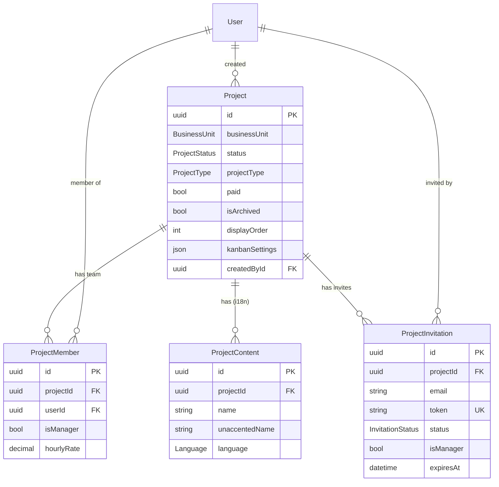
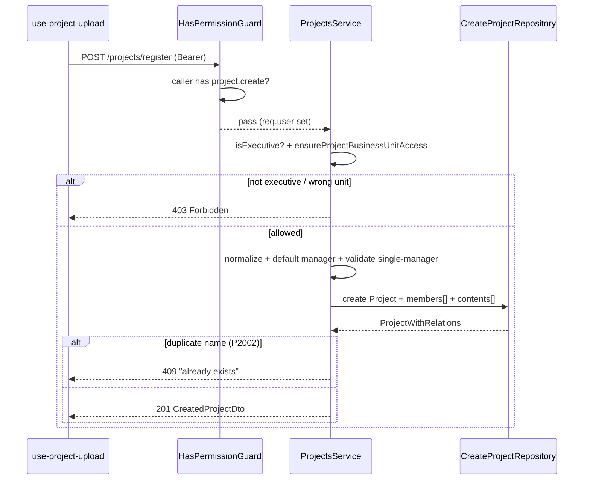

# Dossier 05 — Projects & Membership

> Scope: backend `src/projects/**` (+ models `Project`, `ProjectContent`, `ProjectMember`,
> `ProjectInvitation`, enums `ProjectStatus`, `ProjectType`, `BusinessUnit`, `InvitationStatus`);
> frontend `src/modules/projects/**` (project CRUD, membership, invitations only) and the
> `dashboard/(auth)/projects/**` pages. The `ProjectTaskStatus` model and per-project kanban board
> belong to [[07-tasks]] and are only referenced here (the WIP-limit *settings* stored on `Project`
> are in scope). Epics/Sprints/Milestones nested under a project belong to [[06-agile-backlog]].
> RBAC guard/permission mechanics belong to [[03-security-auth-rbac]]; schema-wide concerns to
> [[02-database-architecture]].

## 1. Identity
- **Purpose:** Project lifecycle (create/read/update/archive/delete), per-project team membership
  (managers + members), and an email/token-based invitation flow for onboarding people onto a project.
- **Backend source root:** `tdg-management-api-backend/src/projects/`
- **Frontend source roots:** `tawer-management-frontend/src/modules/projects/` (this module also houses
  tasks/sprints/epics/milestones/labels/reminders UI owned by other dossiers), pages under
  `tawer-management-frontend/src/app/[locale]/dashboard/(auth)/projects/`
- **Owned DB tables/models:** `Project`, `ProjectContent`, `ProjectMember`, `ProjectInvitation`
  (`prisma/schema/projects.schema.prisma:1-95`); enums `ProjectStatus`, `BusinessUnit`, `ProjectType`,
  `InvitationStatus` (`projects.schema.prisma:97-119`). `ProjectTaskStatus` is FK-related but owned by
  [[07-tasks]].

## 2. Purpose & business problem
The platform organizes work into **projects** owned by one of two business units — `TawerDev`
(software) or `TawerCreative` (creative) (`projects.schema.prisma:104-107`). A project is created by an
executive, carries scheduling/budget metadata, and gathers a team through `ProjectMember` rows where
exactly one member is the **project manager** (`isManager`). Two onboarding paths exist: executives can
attach an existing user directly, while managers can **invite by email** — a tokenized
`ProjectInvitation` that the recipient accepts to become a member (`projects.service.ts:296-424`,
`733-825`). The module therefore serves: **executive administration** (create projects, scope by
business unit, delete), **project-manager self-service** (manage own team, invite, set kanban WIP
limits), and **capacity planning** (`GET /:id/capacity`, `projects.service.ts:1306-1396`).

## 3. Domain model & database
Source: `prisma/schema/projects.schema.prisma`.

| Model | Key fields | Notable constraints |
|-------|-----------|---------------------|
| `Project` | `id` uuid PK, `paid`, `status ProjectStatus`, `businessUnit BusinessUnit`, `startDate/endDate`, `estimatedStartDate/estimatedEndDate`, `displayOrder @default(1000)`, `createdById`, `projectType @default(AGILE)`, `estimatedBudget/hourlyRate Decimal(10,2)?`, `isArchived @default(false)`, `archivedAt?`, `kanbanSettings Json?` | `createdBy` FK `onDelete: Cascade`; **8 single-column indexes** (`businessUnit,status,projectType,createdById,displayOrder,estimatedStartDate,estimatedEndDate,isArchived`); one project fans out to epics, sprints, tasks, labels, reminders, milestones, members, contents, invitations, taskStatuses (`projects.schema.prisma:1-40`) |
| `ProjectContent` | `id`, `projectId`, `name @default("")`, `unaccentedName @default("")`, `description?`, `details?`, `language Language @default(English)` | **`@@unique([language, name])`** — combined with the single-value `Language` enum this makes project names **globally unique across all projects** (`projects.schema.prisma:42-58`; enum at `language.schema.prisma`); `onDelete: Cascade` |
| `ProjectMember` | `id`, `isManager @default(false)`, `projectId`, `userId`, `hourlyRate Decimal(10,2)?` | `@@unique([projectId, userId])` (a user joins a project once); both FKs `onDelete: Cascade` (`projects.schema.prisma:60-74`) |
| `ProjectInvitation` | `id` `dbgenerated(gen_random_uuid())`, `email`, `token @unique`, `status InvitationStatus @default(PENDING)`, `isManager`, `expiresAt`, `acceptedAt?`, `invitedUserId?`, `projectId`, `invitedById` | `@@unique([projectId, email])` (one live invite per email per project); `invitedBy`/`project` FKs `onDelete: Cascade, onUpdate: NoAction` (`projects.schema.prisma:76-95`) |

Enums: `ProjectStatus{Pending,Running,Stopped,Completed}`, `BusinessUnit{TawerDev,TawerCreative}`,
`ProjectType{AGILE,FREESTYLE}`, `InvitationStatus{PENDING,ACCEPTED,EXPIRED,CANCELLED}`
(`projects.schema.prisma:97-119`).

**Design rationale (verified):**
- *Content-table split (`ProjectContent`)* — the translatable fields (`name/description/details`) live in
  a child table keyed by `language`, mirroring the app-wide i18n content pattern (see
  [[02-database-architecture]]). Because `Language` currently has one value (`English`), the split is
  dormant and the `@@unique([language,name])` degenerates into a global name-unique constraint (a latent
  bug: two projects can never share a name; surfaces as `P2002` → "already exists",
  `projects.service.ts:103-107`).
- *`BusinessUnit` on the project* — drives the executive scoping model (§9): a `CTO`/`CMO` may only see
  and manage projects of their unit (`projects.service.ts:843-856`).
- *Soft archive (`isArchived`/`archivedAt`) separate from hard delete* — archiving flags a project
  (`update-project.repository.ts:209-227`) while delete is a real cascade delete
  (`delete-project.repository.ts:13-45`). **Note (§13):** the list query does not actually filter archived
  rows out.
- *`kanbanSettings Json?` on `Project`* — WIP limits per status column stored as a JSON map keyed by
  status name (`projects.service.ts:1020-1054`).

> Correction to [[04-users-teams]]: that dossier states "No `BusinessUnit` enum exists". It does — it is
> defined here (`projects.schema.prisma:104-107`) and consumed only by the projects domain, not by users.

## 4. Backend architecture
Standard 4-layer pattern (see [[01-backend-architecture]]):
`ProjectsController → ProjectsService → {Create,Fetch,Update,Delete}ProjectRepository +
{Create,Fetch,Delete}InvitationRepository → Prisma` (`projects.module.ts:20-41`). The service also
injects `MailService` and `NotificationsService` for the invitation flow (`projects.service.ts:56-66`).
`ProjectsService` is exported for reuse (`projects.module.ts:40`).

Key mechanics:
- **Authorization is two-tiered and pushed into the DB `where`.** A coarse guard
  `@Permissions([...]) @UseGuards(HasPermissionGuard)` gates each route; the fine-grained scoping is
  applied as extra `where` predicates inside the repository query, so the permission check and the fetch
  are atomic. `getProjectByIdWithPermission` adds `members.some({userId})` for non-executives and
  `businessUnit` for unit executives (`fetch-project.repository.ts:282-303`); `updateProjectWithPermission`
  additionally requires `isManager: true` (`update-project.repository.ts:56-67`); a missing row surfaces as
  Prisma `P2025` → `ForbiddenCustomException` (`projects.service.ts:183-192, 244-260`).
- **Role helpers** classify the caller: `isExecutive` (CEO/CTO/CMO), `isGlobalExecutive` (CEO only),
  `getExecutiveBusinessUnitScope` (CEO→null, CTO→TawerDev, CMO→TawerCreative)
  (`projects.service.ts:831-856`). Non-executive management is gated by project membership +
  `isManager` via `verifyProjectManagerAccess` (`projects.service.ts:968-1009`).
- **All queries use the Prisma query-builder** — no raw SQL anywhere in this module (contrast the
  `$queryRawUnsafe` listing in [[04-users-teams]]); the injection surface is therefore just the DTO layer.
- **Transactions:** project update wraps field-update + full member replacement + full content
  replacement in one `$transaction` (`update-project.repository.ts:73-177`).
- **Error mapping** is consistent: `P2002` → `ConflictCustomException` ("already exists"), `P2025` →
  `Forbidden`/`NotFound` depending on context (`projects.service.ts:101-111, 244-260, 476-486`).
- **Serialization** — every read/write route uses `ClassSerializerInterceptor` + `@SerializeOptions`
  with a response DTO (`projects.controller.ts:77-78, 100-101, 222-223`).

## 5. API surface
`ProjectsController` — `projects.controller.ts`. `HasPermissionGuard` uses **OR** semantics: the caller
needs *any one* of the listed permissions (`has-permission.guard.ts:47-55`). Read permissions
(`project.read.many/by.id/summary`) are in `DEFAULT_PERMISSIONS_FOR_ALL_ROLES`, i.e. **every role** can
*call* the read endpoints (`permissions.ts:238-240`); write/manage permissions belong to CEO, CTO, CMO,
`TawerDevProjectManager`, `TawerCreativeProjectManager` only (`permissions.ts:401-410, 494-503, 565-574,
632-640, 712-720`). Data scoping (below) is what actually limits what each caller sees.

| Method | Path | Perm (OR) | Request DTO | Response DTO | Business logic (1 line) | Side effects |
|--------|------|-----------|-------------|--------------|--------------------------|--------------|
| POST | `/projects/register` | `project.create` | `CreateProjectDto` | `CreatedProjectDto` | Executive-only; normalize + default manager→creator; enforce single-manager; create Project+members+contents | none |
| GET | `/projects` | `project.read.many` / `.summary` | `ProjectQueryDto` (query) | `ProjectListDto` | Role-scoped, paginated, filtered/sorted list | none |
| GET | `/projects/:id` | `project.read.by.id` / `.details` | — | `ProjectDto` | Fetch one, scoped by membership/business-unit | none |
| GET | `/projects/:id/capacity` | `project.read.by.id` / `.details` | — | `ProjectCapacityDto` | Compute story-point capacity over active sprints (§13) | none |
| PATCH | `/projects/:id` | `project.update` | `UpdateProjectDto` | `UpdatedProjectDto` | Update fields/members/contents in a tx; `businessUnit` immutable; `isArchived` delegates to archive/restore | none |
| DELETE | `/projects/:id` | `project.delete` | — | 204 | Manager/executive check; **hard** cascade delete | Cascades epics/sprints/tasks/members/etc. |
| POST | `/projects/:projectId/archive` | `project.update` | — | `ProjectDto` | Set `isArchived=true, archivedAt=now` | none |
| POST | `/projects/:projectId/restore` | `project.update` | — | `ProjectDto` | Clear archive flags | none |
| POST | `/projects/:projectId/members` | `project.add.member` | `AddMemberDto` | `CreatedProjectMemberDto` **or** `CreatedInvitationDto` | "Smart" add: `userId`→executives add directly; `email`→invite (execs+managers) | Invite path: email + in-app notification |
| PATCH | `/projects/:projectId/members/:memberId` | `project.update.member` | `UpdateProjectMemberDto` | `UpdatedProjectMemberDto` | Toggle `isManager`; block demoting the last manager | none |
| DELETE | `/projects/:projectId/members/:memberId` | `project.remove.member` | — | 204 | Remove member; block removing last manager unless executive | none |
| POST | `/projects/:projectId/invitations` | `project.add.member` | `CreateInvitationDto` | `CreatedInvitationDto` | Manager/exec invite-by-email; eligibility checks; upsert invite | email + notification |
| DELETE | `/projects/:projectId/invitations/:invitationId` | `project.remove.member` | — | 204 | **Soft**-cancel a PENDING invite (status→CANCELLED) | none |
| POST | `/projects/:projectId/invitations/:invitationId/resend` | `project.add.member` | — | `CreatedInvitationDto` | New token+expiry for a PENDING invite | email + notification |
| POST | `/projects/invitations/accept` | *(auth only)* `IsAuthenticatedGuard` | `AcceptInvitationDto` | `CreatedProjectMemberDto` | Validate token+email+expiry; create membership; mark ACCEPTED | notifies inviter |
| GET | `/projects/:projectId/kanban/settings` | `project.read.by.id` | — | `ProjectKanbanSettingsDto` | Return `kanbanSettings` (access-scoped) | none |
| PATCH | `/projects/:projectId/kanban/settings` | `project.update` | `UpdateKanbanSettingsDto` | `ProjectKanbanSettingsDto` | Validate keys against project task-status names; store JSON | none |

Cited rows: `projects.controller.ts:73-91` (create), `93-213` (list), `215-243` (byId), `245-273`
(capacity), `275-304` (update), `306-328` (delete), `330-384` (archive/restore), `386-423` (addMember),
`425-464` (updateMember), `466-495` (removeMember), `497-523` (createInvitation), `525-558`
(deleteInvitation), `560-597` (resend), `599-622` (accept), `624-677` (kanban).

**DTO validation highlights:** `CreateProjectDto` uses `@IsISO8601` dates, `@IsEnum` for
unit/type/status, `@ValidateNested + @Type` on `contents`/`members` (correctly wired, unlike the teams
DTOs in [[04-users-teams]]), and a custom `@ValidateIf` making `manager` an optional UUID
(`create-project.dto.ts:24-157`). `kanbanSettings` is checked by a custom `IsValidKanbanSettings`
decorator (object of `{ statusName: positiveInteger }`, key ≤50 chars,
`is-valid-kanban-settings.decorator.ts:7-50`). `ProjectQueryDto` coerces `own`/`paid` booleans and
`page`/`limit` numbers, capping `limit` at 100 (`project-query.dto.ts:15-179`).

## 6. Frontend
- **Pages** (`app/[locale]/dashboard/(auth)/projects/`): `page.tsx → render.tsx` gates on
  `hasPermissions(user.roles,"projectsManagement","view")` else `<AccessDenied/>`
  (`projects/render.tsx:15`), then renders `<ProjectsList/>`; `[slug]/render.tsx → <ProjectDetail/>`
  hosts the tabbed detail (members tab in scope; tasks/sprints/epics/milestones tabs belong to other
  dossiers).
- **Services** (`modules/projects/services/api/`): `projects.ts` builds the `GET /projects` query string;
  `project.ts` fetches one; `project-upload.ts` POST `/register` or PATCH `/:id`; `project-lifecycle.ts`
  archive/restore/delete; `project-members.ts` the six member/invitation calls
  (`project-members.ts:13-100`). Every service attaches the Bearer token from `extractJWTokens()` and
  retries once via `refreshToken()` on 401.
- **Hooks:** `use-projects.ts` is an accumulating pager — it fetches backend pages of 12 into a `pool`,
  then applies **client-side** filters for `projectType`, `isArchived` (default `false`) and
  `createdById` (`use-projects.ts:20-31, 88-172`); `use-project-upload.ts` wires react-hook-form + Zod,
  and on submit sends archive/restore via the dedicated endpoints while stripping `isArchived` from the
  PATCH body (`use-project-upload.ts:57-127`); `use-project-members.ts` / `use-project-invitations.ts`
  wrap the mutations and invalidate `["project", projectId]` (`use-project-members.ts:15-60`,
  `use-project-invitations.ts:15-60`).
- **State:** Zustand `useProjectStore` holds only UI state (selected id, active status tab, dialog flags,
  grid/list view) — server state is TanStack Query (`store/projects.ts:6-52`).
- **Validation:** `project.schema.ts` (Zod) — `name` required, `businessUnit`/`projectType`/`status`
  enums, dates required, `manager` optional string (`project.schema.ts:7-29`). The add-member dialog uses
  a Zod **discriminated union** on `mode` (`userId` vs `email`), the latter validating an email + optional
  `expiresInDays` 1–30 (`add-member-dialog.tsx:14-29`).
- **UX flow:** Projects page → status tabs + search + filter panel + grid/list (with drag-reorder) →
  "Add" opens `project-upload-sheet` (create sends exactly one member = the chosen manager,
  `use-project-upload.ts:91-111`) → open a project → **Members tab** (`project-members.tsx`) lists members
  and pending invitations with "Add Member" (direct/by-email dialog) and "Invite" actions, role toggle,
  remove, resend/revoke.

**Notable FE gap (verified):** the create form only ever submits `members:[{userId:manager,isManager:true}]`
(`use-project-upload.ts:103`) and the update path never sends `members`/`manager`
(`use-project-upload.ts:72-88`) — so the backend's multi-member create and the whole
`updateProjectWithPermission` member-replacement branch are **not exercised by the UI**; all team edits go
through the dedicated `/members` endpoints.

## 7. Data flow & key scenarios

**A. Create project** (`POST /projects/register`)
1. FE `use-project-upload.onSubmit` builds a `CreateProjectPayload` with one member (the manager) and
   nested `contents` (`use-project-upload.ts:91-111`).
2. Guard checks `project.create`; service `createProject` re-checks `isExecutive`
   (`projects.service.ts:75-80`) and `ensureProjectBusinessUnitAccess` (a unit executive may only create
   in their unit, `:82, 858-874`).
3. `normalizeCreateProjectInput` (default estimated dates, trim manager, drop blank members),
   `applyDefaultManagerForCreateProject` (if no manager → creator becomes sole manager),
   `validateCreateProjectMembers` (≥1 member, exactly one `isManager`, manager ∈ members)
   (`projects.service.ts:84-88, 1563-1725`).
4. `contents` get an `unaccentedName` (NFD strip) (`:92-97, 913-915`).
5. `CreateProjectRepository.createProject` inserts Project + nested `members` + `contents`
   (`create-project.repository.ts:11-101`); `P2002` on a duplicate name → 409 (`projects.service.ts:103-107`).

**B. Add member / invite** (`POST /:projectId/members`, `addMemberSmart`)
1. `ensureProjectExists`; classify caller (`isExecutive`, `checkIsProjectManager`)
   (`projects.service.ts:308-314`).
2. XOR guard on `userId`/`email` (`:316-328`).
3. **`userId` branch** — executives only; `verifyProjectAccess`; reject if already a member; create
   `ProjectMember` directly (`:330-363`).
4. **`email` branch** — executives *or* the project manager; if the email maps to an existing user *and*
   caller is executive, add directly; otherwise `ensureInvitationEligibility` (not already member/invited)
   then `createAndNotifyInvitation` (`:365-423`).
5. `createAndNotifyInvitation` generates a `randomUUID` token + expiry (default 7 days), **upserts** the
   invitation, sends a branded email with a `/projects/join?token=…` link, and creates an in-app
   notification if the invitee already has an account (`:1128-1183, 1450-1532`).

**C. Accept invitation** (`POST /projects/invitations/accept`)
1. Look up invitation by token; must be `PENDING` and not past `expiresAt` (else mark `EXPIRED` + 400)
   (`projects.service.ts:740-768`).
2. The authenticated user's email must equal the invited email (`:770-782`).
3. If already a member → just mark `ACCEPTED`; else create the `ProjectMember` (honoring
   `invitation.isManager`) then mark `ACCEPTED` and notify the inviter (`:784-824`).

## 8. Diagrams (Mermaid)

### 8.1 ERD slice (this module's tables)


### 8.2 Sequence — create project


### 8.3 Sequence — smart add member / invite
```mermaid
sequenceDiagram
    participant FE as AddMemberDialog
    participant S as ProjectsService.addMemberSmart
    participant F as FetchProjectRepository
    participant I as CreateInvitationRepository
    participant M as MailService
    participant N as NotificationsService
    FE->>S: POST /:projectId/members {userId|email,isManager}
    S->>S: ensureProjectExists; isExecutive / isProjectManager
    alt userId provided (executives only)
        S->>F: findMember(projectId,userId)
        F-->>S: existing?
        alt already member
            S-->>FE: 409 member exists
        else
            S->>F: addMember -> ProjectMember
            S-->>FE: 201 CreatedProjectMemberDto
        end
    else email provided (exec or manager)
        S->>S: ensureInvitationEligibility
        S->>I: upsert invitation (token,expiry)
        S->>M: sendHtmlEmail(join link)
        S-)N: createNotification (if invitee has account)
        S-->>FE: 201 CreatedInvitationDto
    end
```

## 9. Security
- **AuthN/AuthZ:** every route except `accept` requires a JWT + a project permission via
  `HasPermissionGuard` (OR semantics, `has-permission.guard.ts:47-55`); `accept` requires only a valid
  token (`IsAuthenticatedGuard`, `projects.controller.ts:600`). All IDs are `ParseUUIDPipe`-validated
  (`projects.controller.ts:240, 353, 412`).
- **Business-unit + membership scoping (the real access control):** because read permissions are granted
  to *all* roles, isolation is enforced in the query `where`, not the guard. Non-executives are pinned to
  projects they belong to (`listProjects` sets `requestUserId = user.id`, `projects.service.ts:126-134`;
  `getProjectById` adds `members.some({userId})`, `:172-176`); unit executives (CTO/CMO) are pinned to
  their `businessUnit` (`:843-856`). Verified end-to-end in [[diagnostic-report-v2]] ("intern gets a
  graceful 403 on a CEO project and sees 0 projects").
- **Manager-scoped mutations:** update/delete/member/invitation operations require the caller to be an
  executive or the project's manager (`verifyProjectManagerAccess`, `projects.service.ts:968-1009`;
  `updateProjectWithPermission` `where.members.some({userId, isManager:true})`,
  `update-project.repository.ts:60-67`). Consequently a **project-manager role can hard-delete an entire
  project they manage** (cascading all epics/sprints/tasks) — an intentional but high-blast-radius grant
  (`deleteProject`, `projects.service.ts:263-294`; cascade at `projects.schema.prisma:22-30`).
- **No raw SQL:** all access uses the Prisma builder, so there is no string-interpolation injection
  surface in this module (contrast [[04-users-teams]]).
- **Mass assignment:** the global `ValidationPipe` has no `whitelist` (see [[01-backend-architecture]]),
  but the create/update repositories **explicitly enumerate** the columns they write
  (`create-project.repository.ts:30-52`, `update-project.repository.ts:22-54`), so extra body fields are
  ignored rather than persisted. `ProjectQueryDto.requestUserId` is `@ApiHideProperty` and unvalidated, but
  the service overwrites it on every request before use (`projects.service.ts:126-134`), so it is not
  client-controllable.
- **Invitation security:** tokens are `randomUUID`, single-use (status flips to `ACCEPTED`), expiry-checked
  with server time, and bound to the invited email — acceptance re-verifies
  `currentUser.email === invitation.email` (`projects.service.ts:770-782`), preventing an authenticated
  user from claiming someone else's invite. `@@unique([projectId,email])` + the eligibility checks prevent
  duplicate live invites.
- **Gap — capacity/kanban read scope:** `GET /:id/capacity` and `GET /:id/kanban/settings` use
  `verifyProjectAccess` (member OR unit-exec), which is appropriate; no gap found there.

## 10. Cross-module dependencies
- **Depends on:** `PrismaModule`, `AuthsModule` (+`HasPermissionGuard`/permission constants),
  `TokensModule`, `MailModule`, `NotificationsModule`, `LoggerModule` (`projects.module.ts:20-28`). Reads
  `User`/`Role` from [[04-users-teams]] (member/creator/invitee lookups,
  `fetch-project.repository.ts:355-376`), `Sprint`/`Task` from [[06-agile-backlog]]/[[07-tasks]] for
  capacity (`fetch-project.repository.ts:393-431`), and `ProjectTaskStatus` from [[07-tasks]] for kanban
  key validation (`:378-391`).
- **Depended on by:** `Project` is the aggregate root for the whole agile domain — `Epic`, `Sprint`,
  `Task`, `TaskLabel`, `Milestone`, `Reminder`, `ProjectTaskStatus` all FK to it
  (`projects.schema.prisma:20-30`); those modules read project membership for their own authorization.
  `ProjectsService` is exported (`projects.module.ts:40`).
- **Coupling note:** the invitation flow reaches into `MailService` + `NotificationsService`, and capacity
  reaches into sprints/tasks — reasonable read-coupling concentrated in `FetchProjectRepository`, which is
  the module's widest surface (`fetch-project.repository.ts:355-431`).

## 11. Tests
Unlike [[04-users-teams]], this module has **real behavioural unit tests** (mocked repositories):
`projects.service.spec.ts` (854 lines) covers create (forbidden/success/`P2002`), list (executive vs
non-executive scoping), getById (member/executive/`P2025`), capacity, update (businessUnit-immutable,
`P2025`, success, `P2002`), delete (incl. CTO business-unit filter), archive/restore (incl.
already-archived), addMember (success/conflict/forbidden), updateMember and removeMember
(`projects.service.spec.ts:244-853`). `projects.controller.spec.ts` (215 lines) exists too. **Gaps:** no
tests for `createInvitation`, `acceptInvitation`, `deleteInvitation`, `resendInvitation`, the
single-manager consistency validators, or kanban-settings validation; no e2e tests; the archived-listing
bug (§13) is untested. Frontend has extensive `__tests__/` but they cover tasks/kanban/backlog/analytics
(other dossiers), not project CRUD/membership.

## 12. Code quality
- **Good:** consistent 4-layer separation; DB-level authorization keeps checks atomic; Prisma-error→domain
  exception mapping is uniform; correct `@ValidateNested + @Type` wiring on nested arrays
  (`create-project.dto.ts:114-117, 129-133`); the update transaction keeps fields/members/contents
  consistent (`update-project.repository.ts:73-177`); genuine unit-test coverage of the service.
- **Mixed:** `applyDefaultManagerForCreateProject` re-maps `isManager` twice in a row
  (`projects.service.ts:1612-1628`) — the first map is immediately overwritten by the second.
- **Bad — duplication:** `getUpdatePermissionBusinessUnit` (`:889-899`) and
  `getDeletePermissionBusinessUnit` (`:901-911`) are byte-identical; both partially duplicate
  `getExecutiveBusinessUnitScope`.
- **Bad — placeholder logic:** the email builder guards on the literal string `'user.name'`
  (`inviterName !== 'user.name'`, `projects.service.ts:1467, 1496`) — a leftover template placeholder that
  should never appear at runtime; dead defensive code.

## 13. Verified technical debt
- **Archived projects are not excluded from the list.** `buildWhereClause` has no `isArchived` predicate
  (`fetch-project.repository.ts:62-154`), yet the controller advertises archive as "hidden from active
  project lists" (`projects.controller.ts:333-334`). Hiding is done **client-side** with the default
  `isArchived=false` filter (`use-projects.ts:28, 48, 161`), and because that default is *not* counted as
  an "active" client filter (`use-projects.ts:54`), archived rows silently consume backend page slots and
  can skew the lazy pager's page counts.
- **Per-member capacity is circular / non-informative.** `capacityPoints` is derived from a member's
  *share of committed* points (`committed/totalCommitted * totalCapacity`, `projects.service.ts:1356-1364`),
  so every member's `utilizationPercent` algebraically collapses to the same `totalCommitted/totalCapacity`
  and `remainingPoints` is proportional to commitment — the per-member breakdown conveys no independent
  capacity signal.
- **Project update replaces members destructively.** The tx does `deleteMany` then `createMany`
  (`update-project.repository.ts:86-102`), discarding each `ProjectMember.hourlyRate` and resetting
  `createdAt`. Currently latent because the UI never sends `members` on update (§6), but any API client
  using this path loses per-member rate data.
- **"Delete invitation" is a soft cancel.** `DeleteInvitationRepository.deleteInvitation` sets
  `status=CANCELLED` rather than deleting (`delete-invitation.repository.ts:9-18`); the endpoint is named
  "Delete (revoke)". Harmless (re-invite works via the `upsert`, `create-invitation.repository.ts:17-42`)
  but the name/behaviour disagree, and cancelled rows linger under the `@@unique([projectId,email])` slot.
- **Invitation acceptance has no frontend.** Emails/notifications link to `/projects/join?token=…`
  (`projects.service.ts:1447, 1524`) but no such route exists (only `projects/` and `projects/[slug]/`),
  and no FE service calls `POST /projects/invitations/accept`. Invited users cannot accept through the app
  UI — a functional gap in an otherwise complete backend flow.
- **Duplicated permission helpers** — `getUpdatePermissionBusinessUnit` ≡ `getDeletePermissionBusinessUnit`
  (`projects.service.ts:889-911`).
- **Global project-name uniqueness** — `@@unique([language,name])` over a single-value `Language` enum
  (`projects.schema.prisma:54`) means no two projects can share a name; cross-cite [[02-database-architecture]].
- **`updateProject` order-of-checks** — when `isArchived` is present it archives/restores and returns
  *before* the `businessUnit`-immutable guard (`projects.service.ts:203-214`), so a
  `{isArchived, businessUnit}` body silently ignores the illegal `businessUnit` change instead of 400-ing.

## 14. Strengths / Weaknesses / Improvements
**Strengths**
- Authorization is pushed into the Prisma `where`, making permission-check + fetch atomic and free of the
  raw-SQL injection risk seen elsewhere; business-unit scoping (CEO/CTO/CMO) is a clean, well-factored model.
- The membership/invitation design is thorough: single-manager invariant, last-manager guards, expiry,
  email-bound single-use tokens, upsert-based re-invite.
- Real unit-test coverage of the service — a marked improvement over the users/teams scaffold tests.

**Weaknesses**
- The archived-listing gap means "archive" is only cosmetically enforced (client-side), interacting badly
  with the pager.
- Capacity analytics are mathematically circular and will mislead planners.
- The invitation flow is backend-complete but has no acceptance UI — the feature is effectively unusable
  end-to-end from the app.
- Duplicated/placeholder helpers and a destructive member-replacement path indicate rough edges.

**Improvements (concrete)**
1. Add `isArchived: false` (or an explicit `includeArchived` flag) to `buildWhereClause`
   (`fetch-project.repository.ts:95-153`) so archiving is enforced server-side; stop relying on the FE
   default filter.
2. Redesign capacity so `capacityPoints` comes from an independent per-member/sprint capacity input, not
   from committed share (`projects.service.ts:1353-1383`).
3. Build the `/projects/join` acceptance page + an `acceptInvitation` FE service, or change the email link
   to a real route; add service tests for the four untested invitation methods.
4. Make member updates non-destructive (upsert by `projectId_userId`, preserving `hourlyRate`) instead of
   `deleteMany+createMany` (`update-project.repository.ts:86-102`).
5. De-duplicate `getUpdate/DeletePermissionBusinessUnit`; remove the `'user.name'` placeholder guard; move
   the `businessUnit`-immutable check ahead of the `isArchived` branch in `updateProject`.

## 15. Verification Checklist
| Area | Verified? | Evidence / reason |
|------|-----------|-------------------|
| Domain model | Yes | `projects.schema.prisma:1-119` read in full |
| Backend logic (service + 7 repositories) | Yes | `projects.service.ts` + all repositories read line-by-line |
| Every endpoint | Yes | `projects.controller.ts:1-678` read; 17 routes tabulated |
| RBAC / permission mapping | Yes | `has-permission.guard.ts`, `permissions.ts:194-241, 401-720` |
| Business-unit / membership scoping | Yes | traced through service helpers + repository `where` clauses |
| Frontend pages/hooks/services | Yes | pages, `use-projects`, `use-project-upload`, member/invite hooks + services read |
| Security (scoping, injection, invites) | Yes | Prisma-only queries, token/email binding, cascade delete verified |
| Tests | Yes | both spec files read (`projects.service.spec.ts` describe/it enumerated) |
| Tech debt | Yes | each item cited to file:line |
| Live DB behaviour / query plans | No | static analysis only; no running DB |
| Runtime confirmation of archived-listing bug | Partial | code path unambiguous; corroborated by [[diagnostic-report-v2]] permission observations, not re-run here |

## 16. Not verified / Open questions
- **Runtime confirmation** that archived projects appear in the raw `GET /projects` response — inferred
  from the absent `where` predicate, not executed against a live DB.
- **`estimatedBudget` / `hourlyRate` (project) and `ProjectMember.hourlyRate`** exist in the schema
  (`projects.schema.prisma:15-16, 67`) but are **never written or read** by any code in this module
  (no reference in the create/update repositories or DTOs) — appears to be a dormant costing feature; not
  confirmable as intentional vs abandoned from code alone.
- **`ProjectContent.details` vs `description`** — both are stored and returned but the FE form only surfaces
  `description` (+ `details` textarea in some paths); full FE content UX not exhaustively traced.
- **`resendInvitation` / `acceptInvitation` notification side-effects** were read but not executed; whether
  the inviter notification actually delivers depends on [[12-notifications]] runtime config.
- **`ProjectDetail` non-member tabs** (tasks/sprints/epics/milestones/settings) were intentionally left to
  [[06-agile-backlog]] / [[07-tasks]] and only spot-checked for the members tab wiring.
- **Whether any non-UI API client relies on the multi-member create / member-replacement update paths** —
  unknowable from this repo; flagged as latent.
