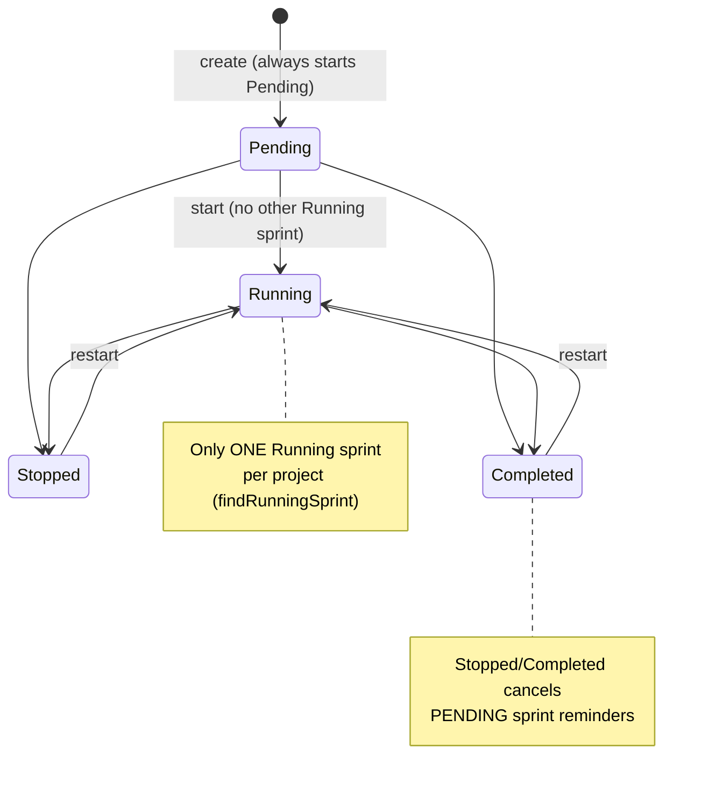
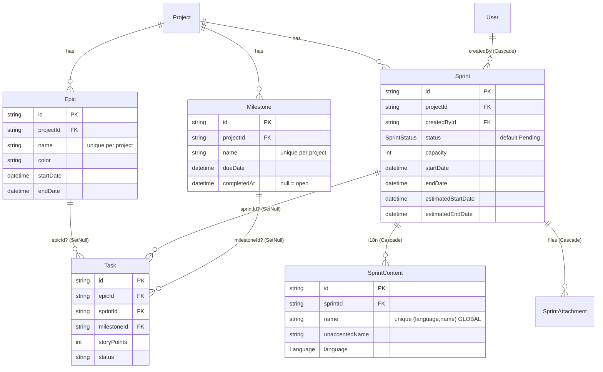
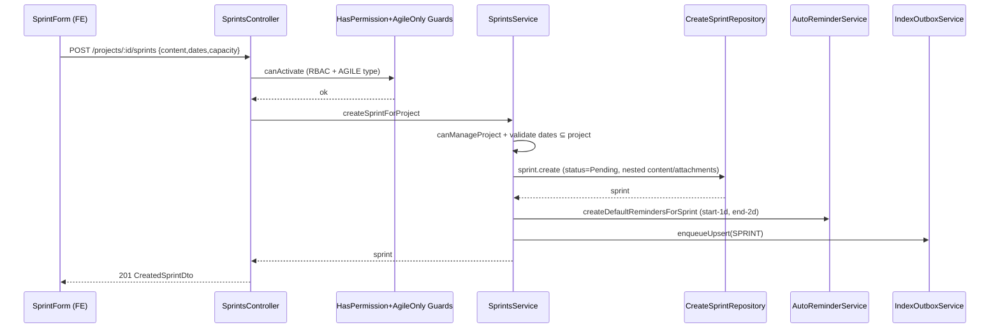
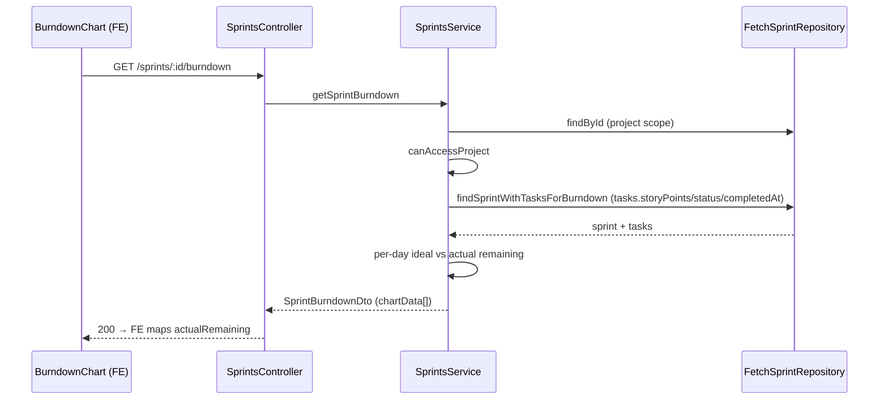

# Dossier 06 — Agile Backlog (Epics, Sprints, Milestones)

## 1. Identity
- **One-line purpose:** The agile planning layer of a project — large features (**Epics**), time-boxed
  iterations (**Sprints**), and target dates (**Milestones**) — plus the derived analytics (burndown,
  velocity, Gantt) that visualise progress.
- **Backend source roots:**
  - `tdg-management-api-backend/src/epics/**`
  - `tdg-management-api-backend/src/sprints/**`
  - `tdg-management-api-backend/src/milestones/**`
- **Frontend source roots:** All under `tawer-management-frontend/src/modules/projects/`:
  - `components/project-detail/{epics,sprints,milestones}/**`, `components/analytics/{burndown-chart,velocity-chart}.tsx`
  - `hooks/{epics,sprints,milestones,analytics,backlog}/**`, `services/api/project-{epics,sprints,milestones,backlog,analytics}.ts`
  - `types/{project-epics,project-sprints,project-milestones,cast-*}.ts`, `validation/{epic,sprint,milestone}.schema.ts`
- **Owned DB tables/models** (all in `prisma/schema/agile.schema.prisma`): `Epic`, `Sprint`,
  `SprintContent`, `SprintAttachment`, `Milestone`, and the `SprintStatus` enum. `Task` is co-located in
  the same schema file but is **owned by Dossier 07** — this module only reads its `epicId` / `sprintId` /
  `milestoneId` / `storyPoints` / `status` foreign keys.

---

## 2. Purpose & business problem
The platform supports two project types (`ProjectType` enum: `AGILE` / `FREESTYLE`). This module implements
the Scrum/Kanban planning artefacts that only make sense for structured delivery:

- **Epic** — a "large feature that can be broken into stories" (schema comment, `agile.schema.prisma:226`).
  Groups tasks under a named, colour-coded, optionally date-bounded umbrella so progress can be rolled up.
- **Sprint** — a "time-boxed iteration for a project" (`agile.schema.prisma:1`) with a lifecycle
  (`Pending → Running → Stopped/Completed`), planned vs. actual dates, a story-point `capacity`, multilingual
  content, and file attachments. Drives **burndown** (intra-sprint progress) and **velocity** (cross-sprint
  throughput) analytics.
- **Milestone** — a "target date for a set of tasks" that "works for both AGILE and FREESTYLE"
  (`agile.schema.prisma:244`). This is the one artefact deliberately **not** gated to AGILE projects.

Epics and Sprints are hard-gated to `AGILE` projects by `AgileOnlyGuard`
(`epics.controller.ts:62`, `sprints.controller.ts:70`); Milestones are not
(`milestones.controller.ts:67` uses only `HasPermissionGuard`), matching the schema's design comment.

---

## 3. Domain model & database
Source: `prisma/schema/agile.schema.prisma` (verified by reading lines cited).

### 3.1 Models & fields

**Epic** (`agile.schema.prisma:227-242`)
| Field | Type | Notes |
|---|---|---|
| id | String PK | `gen_random_uuid()::text` |
| projectId | String FK → Project | `onDelete: Cascade` (`:237`) |
| name | String | required |
| description | String? | |
| color | String? | hex colour for UI |
| startDate / endDate | DateTime? | both optional |
| createdAt / updatedAt | DateTime | |
| tasks | Task[] | reverse relation |

Constraints: `@@unique([projectId, name])` (`:240`), `@@index([projectId])` (`:241`). Name is unique
**per project** — correct multi-tenant scoping.

**Sprint** (`agile.schema.prisma:2-22`)
| Field | Type | Notes |
|---|---|---|
| id | String PK | |
| projectId | String FK → Project | `onDelete: Cascade` (`:15`) |
| createdById | String FK → User | relation `"CreatedSprints"`, `onDelete: Cascade` (`:14`) |
| startDate / endDate | DateTime (required) | actual/planned window (`:6-7`) |
| estimatedStartDate / estimatedEndDate | DateTime (required) | separate estimate window (`:8-9`) |
| status | SprintStatus | `@default(Pending)` (`:10`) |
| capacity | Int? | story-point capacity (`:13`) |
| contents | SprintContent[] | multilingual content |
| attachments | SprintAttachment[] | files |
| tasks | Task[] | reverse relation |

Constraints: `@@index([projectId, status])` (`:20`), `@@index([projectId, createdAt])` (`:21`). **No
`@@unique` on the Sprint model itself** — sprint identity/uniqueness lives entirely in `SprintContent`.

**SprintContent** (`agile.schema.prisma:25-39`) — content-table split for i18n (same pattern as
`ProjectContent`/`TaskContent`, see Dossier 02).
| Field | Type | Notes |
|---|---|---|
| id | String PK | |
| sprintId | String FK → Sprint | `onDelete: Cascade` (`:35`) |
| name | String | |
| unaccentedName | String | accent-stripped copy for search |
| description / details | String? | |
| language | Language | `@default(English)` (`:32`) |

Constraints: `@@unique([language, name])` (`:37`), `@@index([sprintId])` (`:38`).
⚠️ **The unique key is `(language, name)` — global, NOT scoped by `sprintId` or `projectId`.** See §13.

**SprintAttachment** (`agile.schema.prisma:42-51`): `id`, `sprintId` FK (`onDelete: Cascade`, `:48`),
`attachment` (stored path string), timestamps. `@@index([sprintId])` (`:50`).

**Milestone** (`agile.schema.prisma:245-261`)
| Field | Type | Notes |
|---|---|---|
| id | String PK | |
| projectId | String FK → Project | `onDelete: Cascade` (`:254`) |
| name | String | |
| description | String? | |
| dueDate | DateTime? | target date |
| completedAt | DateTime? | set by the "complete" action; null = open |
| reminders | Reminder[] | |
| tasks | Task[] | |

Constraints: `@@unique([projectId, name])` (`:258`), `@@index([projectId])` (`:259`),
`@@index([dueDate])` (`:260`). Completion is modelled as a nullable timestamp, not a status enum.

### 3.2 Task ↔ agile foreign keys (owned by Dossier 07, read here)
`Task` carries three **optional** FKs into this module (`agile.schema.prisma:63-66, 83-84, 89`):
`sprintId → Sprint?`, `epicId → Epic?`, `milestoneId → Milestone?`. None declare `onDelete`, so Prisma's
default for optional relations (`SetNull`) applies — the DB would null the FK if the parent were deleted.
In practice the services **block** deletion while linked tasks exist (see §4), so `SetNull` is a
belt-and-braces fallback rather than the primary behaviour. `Task.storyPoints Int?` (`:65`) is the unit for
burndown/velocity; `Task.status String` (`:60`, free-form string default `"TODO"`) is compared against the
literal `"DONE"` throughout this module.

### 3.3 SprintStatus enum (`agile.schema.prisma:300-305`)
`Pending`, `Running`, `Stopped`, `Completed`. Milestones have **no** status enum (completion = `completedAt`
timestamp). Epics have **no** status at all (progress is computed from task counts).

---

## 4. Backend architecture
All three sub-modules follow the project-wide 4-layer pattern (**controller → service → repository → DTO**;
see Dossier 01), each with four thin repositories (`create-`, `fetch-`, `update-`, `delete-`).

### 4.1 Modules & DI
- `EpicsModule` (`epics/epics.module.ts`): imports `PrismaModule, LoggerModule, AuthsModule, TokensModule,
  AiModule`; exports `EpicsService`.
- `SprintsModule` (`sprints/sprints.module.ts`): additionally imports `RemindersModule, UploadModule,
  NotificationsModule` (sprints send member notifications, auto-reminders, and handle file uploads).
- `MilestonesModule` (`milestones/milestones.module.ts`): additionally imports `RemindersModule`.

`AiModule` is imported by all three because every write path enqueues an embedding-index job (see §10).

### 4.2 Access control — a hand-rolled second layer *inside* the service
Beyond the route-level `HasPermissionGuard` (RBAC) and `AgileOnlyGuard`, each service re-implements an
identical project-scoped access helper set. Example in `EpicsService` (`epics.service.ts:36-107`),
duplicated almost verbatim in `SprintsService` (`sprints.service.ts:517-597`) and `MilestonesService`
(`milestones.service.ts:38-109`):

- `isExecutive(roles)` → CEO/CTO/CMO (`epics.service.ts:36-42`).
- `getExecutiveBusinessUnitScope` → CEO = global (`null`), CTO = `TawerDev`, CMO = `TawerCreative`
  (`:48-55`).
- `hasExecutiveProjectAccess` → CEO always true; CTO/CMO only if the project's `businessUnit` matches their
  scope (`:57-70`).
- `canAccessProject` (read) → executive-scoped OR any `ProjectMember` row (`:72-87`).
- `canManageProject` (write) → executive-scoped OR `membership.isManager === true` OR a role fallback.

**The write-role fallback diverges per module** — a real, verified inconsistency:
| Module | `canManageProject` non-manager fallback role | Evidence |
|---|---|---|
| Epics | `UserType.ProductOwner` | `epics.service.ts:103-106` |
| Milestones | `UserType.ProductOwner` | `milestones.service.ts:105-108` |
| Sprints | `UserType.ScrumMaster` | `sprints.service.ts:594-596` |

So a `ScrumMaster` who is not a project manager can manage sprints but **cannot** create an epic or milestone
in the same project, and vice-versa for a `ProductOwner`. Both are additionally gated by the static
`HasPermissionGuard` permission map (see §9), so this is a *tightening* layer, but the asymmetry looks
accidental rather than designed.

### 4.3 Business rules by write path

**Epics** (`epics.service.ts`)
- `createEpic` (`:149-195`): `canManageProject` → parse dates → `validateEpicDateRange` (end > start,
  `:109-119`) → `validateEpicDatesWithinProject` (epic window must sit inside the project window,
  `:121-143`) → create → enqueue AI upsert. Prisma `P2025` → `EPIC_NOT_FOUND`, `P2002` →
  `EPIC_ALREADY_EXISTS`.
- `getEpics` (`:201-244`): access check → paginated fetch → **progress rollup**: a single `groupBy` counts
  `DONE` tasks per epic (`countDoneTasksByEpics`, `fetch-epic.repository.ts:198-215`), then
  `progress = round(done/total*100)`.
- `updateEpic` (`:297-364`): loads current epic, merges dates (respecting `undefined` vs `null`), re-runs
  both date validations, updates, re-enqueues AI upsert.
- `deleteEpic` (`:370-412`): **guard rail** — `countLinkedTasks > 0` throws `EPIC_HAS_LINKED_TASKS`
  ("reassign or delete the tasks first"); otherwise delete + enqueue AI delete.

**Sprints** (`sprints.service.ts`)
- `createSprintForProject` (`:49-158`): `canManageProject` → require ≥1 content entry (`:61-66`) → stamp
  `unaccentedName` via NFD normalisation (`:68-71`, `toUnaccented` at `:599-601`) → validate `end > start`,
  `estimatedEnd > estimatedStart`, and sprint window ⊆ project window (`:78-101`) → move uploaded files into
  place via `UploadService` (`:104-112`) → `create` with `status = Pending` → **create default reminders**
  (`:121-128`) → enqueue AI upsert. On any error, uploaded files are deleted from disk (`:143-145`);
  `P2002` → `SPRINT_ALREADY_EXISTS`.
- `updateSprint` (`:247-451`): loads sprint, `canManageProject`, then a rich sequence:
  - **status transition** validated by `validateStatusTransition` (`:616-645`, state machine below);
  - starting a sprint (`→ Running`) checks there is **no other running sprint** in the project
    (`findRunningSprint`, `:269-281`) → else `SPRINT_ALREADY_STARTED`;
  - date-window re-validation for actual and estimated windows (`:284-325`);
  - content replaced wholesale (`updateContent` = deleteMany + createMany, `update-sprint.repository.ts:58-89`);
  - attachments replaced wholesale (`:91-112`);
  - on `Running`/`Completed`, **fan-out notifications** to all project members except the actor
    (`:361-389`);
  - on `Stopped`/`Completed`, **cancel pending sprint reminders** (`Reminder.updateMany … PENDING →
    CANCELLED`, `:392-404`);
  - re-enqueue AI upsert.
- `deleteSprint` (`:453-515`): `canManageProject` → **guard rail** `hasTasks` → `SPRINT_HAS_ACTIVE_TASKS`
  → cancel pending reminders → delete → enqueue AI delete.

**Milestones** (`milestones.service.ts`)
- `createMilestone` (`:115-171`): `canManageProject` → create (**no date-range validation** — unlike epics) →
  if `dueDate`, create default reminders (`:137-145`) → enqueue AI upsert.
- `getMilestones` (`:177-224`): same progress-rollup pattern as epics (`countDoneTasksByMilestones`).
- `updateMilestone` (`:268-314`) / `deleteMilestone` (`:320-370`, blocks on linked tasks via
  `MILESTONE_HAS_LINKED_TASKS`).
- `completeMilestone` (`:376-408`): sets `completedAt = new Date()` (`update-milestone.repository.ts:49-69`).
  ⚠️ Idempotency not enforced — calling it again silently overwrites `completedAt`.
- `getGantt` (`:414-485`): fan-in of four parallel queries (milestones, epics, sprints, tasks) into one
  Gantt payload; milestone status is **derived on the fly** (`COMPLETED` if `completedAt`, else `OVERDUE` if
  past due, else `PENDING`; `IN_PROGRESS` is declared but never assigned — dead branch, `:437`).

### 4.4 Error handling & transactions
Consistent `try/catch` mapping Prisma `P2025`→NotFound, `P2002`→Conflict into the project's custom exception
hierarchy + `ErrorCode` (Dossier 01). **No `$transaction` is used anywhere in this module.** Multi-step
writes (sprint create → reminders → index; sprint update → content → attachments → notifications → reminders
→ index) are therefore **not atomic** — see §13 for the resulting partial-failure exposure.

---

## 5. API surface
19 endpoints across three controllers. Auth column: **HP** = `HasPermissionGuard` + listed permission;
**AG** = `AgileOnlyGuard`.

### Epics — `epics.controller.ts`
| Method | Path | Auth/Perm | Request DTO | Response DTO | Validation | Business logic | Side effects |
|---|---|---|---|---|---|---|---|
| POST | `/projects/:projectId/epics` | HP `epic.manage` + AG | CreateEpicDto | CreatedEpicDto | ParseUUID, class-validator | create epic, date-in-project check | AI upsert enqueue (`:172`) |
| GET | `/projects/:projectId/epics` | HP `epic.read` + AG | EpicQueryDto (date filters, sort, page) | EpicListDto | ParseUUID | list + progress rollup | — |
| GET | `/projects/:projectId/epics/:epicId` | HP `epic.read` + AG | — | EpicSummaryDto | ParseUUID | epic + tasks + progress | — |
| PATCH | `/projects/:projectId/epics/:epicId` | HP `epic.manage` + AG | UpdateEpicDto | UpdatedEpicDto | ParseUUID | update, re-validate dates | AI upsert (`:341`) |
| DELETE | `/projects/:projectId/epics/:epicId` | HP `epic.manage` + AG | — | 204 | ParseUUID | blocks if linked tasks | AI delete (`:396`) |

### Sprints — `sprints.controller.ts`
| Method | Path | Auth/Perm | Request DTO | Response DTO | Validation | Business logic | Side effects |
|---|---|---|---|---|---|---|---|
| POST | `/projects/:projectId/sprints` | HP `sprint.manage` + AG | CreateSprintDto (multipart) | CreatedSprintDto | ParseUUID, `FileFieldsInterceptor` (≤50 files) | create sprint (Pending) | files stored, **default reminders**, AI upsert |
| GET | `/projects/:projectId/sprints` | HP `sprint.read` + AG | SprintQueryDto (status/name/date/sort/lang) | SprintListDto | ParseUUID, `TransformLanguagePipe` | member-scoped list | — |
| GET | `/sprints/:id` | HP `sprint.read` + AG(`id`) | — | SprintDto | ParseUUID | full detail (contents, attachments, tasks) | — |
| PATCH | `/projects/sprints/:id` | HP `sprint.manage` + AG(`id`) | UpdateSprintDto (multipart) | UpdatedSprintDto | ParseUUID | status machine, single-running rule, re-validate | notifications, reminder cancel, AI upsert |
| DELETE | `/projects/sprints/:id` | HP `sprint.manage` + AG(`id`) | — | 204 | ParseUUID | blocks if has tasks | reminder cancel, AI delete |
| GET | `/sprints/:sprintId/burndown` | HP `sprint.read` + AG | — | SprintBurndownDto | ParseUUID | day-by-day burndown from storyPoints | — |
| GET | `/projects/:projectId/velocity` | HP `sprint.read` + AG | — | VelocityResponseDto | ParseUUID | completed-sprint points + avg | — |

### Milestones — `milestones.controller.ts`
| Method | Path | Auth/Perm | Request DTO | Response DTO | Validation | Business logic | Side effects |
|---|---|---|---|---|---|---|---|
| POST | `/projects/:projectId/milestones` | HP `milestone.manage` | CreateMilestoneDto | CreatedMilestoneDto | ParseUUID | create (no date-in-project check) | default reminders (if dueDate), AI upsert |
| GET | `/projects/:projectId/milestones` | HP `milestone.read` | MilestoneQueryDto | MilestoneListDto | ParseUUID | list + progress rollup | — |
| GET | `/projects/:projectId/milestones/:milestoneId` | HP `milestone.read` | — | MilestoneSummaryDto | ParseUUID | fetch one | — |
| PATCH | `/projects/:projectId/milestones/:milestoneId` | HP `milestone.manage` | UpdateMilestoneDto | UpdatedMilestoneDto | ParseUUID | update | AI upsert |
| DELETE | `/projects/:projectId/milestones/:milestoneId` | HP `milestone.manage` | — | 204 | ParseUUID | blocks if linked tasks | AI delete |
| PATCH | `/projects/:projectId/milestones/:milestoneId/complete` | HP `milestone.manage` | — | UpdatedMilestoneDto | ParseUUID | set `completedAt = now` | — |
| GET | `/projects/:projectId/gantt` | HP `milestone.read` | — | GanttChartDto | ParseUUID | fan-in milestones+epics+sprints+tasks | — |

Note: **Milestones endpoints carry no `AgileOnlyGuard`** (verified: not in any `@UseGuards` on
`milestones.controller.ts`), by design (milestones serve FREESTYLE projects too).

---

## 6. Frontend
All agile UI lives inside the **projects** module (`tawer-management-frontend/src/modules/projects`); there
is no standalone sprints/epics module. It is consumed by the project-detail page tabs.

### 6.1 Services (API layer)
- **Epics** `services/api/project-epics.ts`: `retrieveEpics` (GET `?limit=100`, `:17`), `createEpic`,
  `updateEpic`, `deleteEpic` — all JSON, all wrapped with a 401 → `refreshToken()` retry.
- **Sprints** `services/api/project-sprints.ts` (`retrieveProjectSprints`, GET `?limit=100` + optional
  `status`), `services/api/sprint-upload.ts` (`uploadSprint` — POST create / PATCH `projects/sprints/:id`),
  `services/api/sprint-deletion.ts`.
- **Milestones** `services/api/project-milestones.ts`: CRUD + `completeMilestone` (PATCH
  `.../complete`) + `retrieveGanttData` (GET `.../gantt`). Handles both array and `{data,pagination}`
  response shapes via `extractPaginatedList` (`:20-43`).
- **Analytics** `services/api/project-analytics.ts`: `retrieveBurndown` (GET `/sprints/:id/burndown`, maps
  `chartData[].actualRemaining → remainingPoints`, `:53-71`), `retrieveVelocity` (GET
  `/projects/:id/velocity`, `:73-92`), plus `retrieveProjectCapacity` (GET `/projects/:id/capacity` — an
  endpoint **outside this dossier's controllers**, likely owned by projects/tasks).
- **Backlog** `services/api/project-backlog.ts`: `retrieveBacklog`, `reorderBacklog`, `moveTaskToSprint`
  (POST `.../backlog/:taskId/move-to-sprint`), `retrieveSprintTasks`, `bulkUpdateTaskStatus`. These call
  `/backlog/**` and `/tasks/**` endpoints owned by **Dossier 07**, but are the glue that ties tasks into
  sprints from the UI.

### 6.2 Hooks (TanStack Query)
| Hook | Query key | Notes |
|---|---|---|
| `use-project-sprints.ts` | `["project-sprints", projectId, status]` | search + sortBy are **client-side** (`:20-30`); no server pagination |
| `use-epics.ts` | epics keys | — |
| `use-milestones.ts` / `use-gantt.ts` | milestone / gantt keys | — |
| `use-sprint-burndown.ts` | `["sprint-burndown", sprintId]` | `:9` |
| `use-project-velocity.ts` | `["project-velocity", projectId]` | `:9` |
| `use-sprint-upload.ts` | invalidates `["project-sprints", projectId]` on success (`:80`) | react-hook-form + zod |

### 6.3 Forms & validation (Zod)
`validation/sprint.schema.ts` (`getSprintSchema`) requires `name`, `status` (enum
`Pending/Running/Stopped/Completed`), all four dates, optional `capacity ≥ 0`, `language` ∈
`Arabic/French/English`. `validation/epic.schema.ts` and `validation/milestone.schema.ts` mirror this for
their fields. The sprint form (`use-sprint-upload.ts:52-77`) sends **only `content[0]`** (single-language)
and only includes `status` in the PATCH payload when it actually changed (`:72`) — this avoids tripping the
backend's status-transition validator on unrelated edits.

### 6.4 UX flow
- Sprint list (`components/project-detail/sprints/project-sprints.tsx`) renders `SprintCard`s. The card's
  **status action buttons exactly mirror the backend state machine** (`sprint-card.tsx:29-86`): Pending →
  ▶ Start; Running → ■ Stop / ✓✓ Complete; Stopped/Completed → ↻ Restart. This is the clearest evidence the
  FSM is a shared contract between FE and BE.
- Analytics tab renders `burndown-chart.tsx` (per selected sprint) and `velocity-chart.tsx` (per project).
- Milestones tab includes a Gantt view driven by `retrieveGanttData`.

### 6.5 Multipart mismatch (verified)
The backend create/update sprint endpoints declare `multipart/form-data` + `FileFieldsInterceptor`
(`sprints.controller.ts:73-84, 259-269`), but the FE `uploadSprint` (`sprint-upload.ts:14-17`) sends a
**plain JSON body** and never constructs `FormData`. Multer only intercepts multipart requests, so JSON
create/update still works for the **no-attachment** path — but there is **no working FE code path that
uploads sprint attachments** despite full backend support for them. (See §16.)

---

## 7. Data flow & key scenarios

### 7.1 Create a sprint
1. User submits the sprint form → `use-sprint-upload.onSubmit` builds a JSON payload (`content:[…]`, dates,
   optional capacity) → `uploadSprint` → `POST /projects/:projectId/sprints`.
2. `SprintsController.createSprint` runs `HasPermissionGuard` (`sprint.manage`) then `AgileOnlyGuard`
   (resolves `projectId`, asserts `projectType === 'AGILE'`).
3. `SprintsService.createSprintForProject`: `canManageProject` → validates content present + all date
   windows + sprint ⊆ project window → (files, if any) → `CreateSprintRepository.createSprint` persists the
   Sprint (`Pending`) with nested `SprintContent` and `SprintAttachment`.
4. `AutoReminderService.createDefaultRemindersForSprint` inserts up to two reminders (1 day before start,
   2 days before end — `auto-reminder.service.ts:77-113`).
5. `IndexOutboxService.enqueueUpsert(projectId, SPRINT, id)` queues the sprint for AI embedding.
6. Response → FE invalidates `["project-sprints", projectId]` → list refetches.

### 7.2 Start a sprint (status transition)
FE Start button → PATCH `/projects/sprints/:id` with `{status:"Running"}` → service validates
`Pending→Running` is legal, asserts no other `Running` sprint exists in the project, updates, notifies every
other project member ("Sprint Started"), re-indexes.

### 7.3 Sprint burndown
GET `/sprints/:sprintId/burndown` → `getSprintBurndown` (`sprints.service.ts:676-810`): access check →
`findSprintWithTasksForBurndown` loads tasks' `storyPoints/status/completedAt/createdAt` →
`totalPoints`/`completedPoints` summed over tasks with non-null points → for each day in
`[startDate, endDate]` it computes an **ideal** line (`totalPoints − pointsPerDay·i`) and an **actual**
remaining (total minus points of tasks `DONE` with `completedAt ≤ day`), plus per-day `completed`/`added`.
FE keeps only `actualRemaining` (`project-analytics.ts:61-64`).

---

## 8. Diagrams (Mermaid)

### 8.1 Sprint status state machine
Source of truth: `sprints.service.ts:620-629` (validator) confirmed against `sprint-card.tsx:29-86` (UI).



### 8.2 Agile ERD slice


### 8.3 Create-sprint sequence


### 8.4 Sprint burndown sequence


---

## 9. Security
- **Authentication:** all routes require a bearer JWT (`@ApiBearerAuth`); `HasPermissionGuard` verifies the
  token and attaches `req.user` (Dossier 03). `AgileOnlyGuard` independently re-verifies the token if
  `req.user` is missing (`agile-only.guard.ts:62-69`).
- **Authorization (two layers):**
  1. **Static RBAC** — `HasPermissionGuard` checks the route's `@Permissions` against the role→permission
     map. Agile permissions are coarse: `sprint.read`/`sprint.manage`, `epic.read`/`epic.manage`,
     `milestone.read`/`milestone.manage` (`permissions.ts:125-128, 175-184`). There is **no separate
     create/update/delete permission** — any `*.manage` holder can do all three writes.
  2. **Project-scoped ownership** — the service-level `canAccessProject`/`canManageProject` (see §4.2)
     restrict to project members / managers / executives, so a user with the global `sprint.manage`
     permission still cannot touch a project they are not a member (or in-scope executive) of.
- **Business-unit scoping** for executives is enforced by DB lookup of `Project.businessUnit`
  (`fetch-*.repository.ts findProjectBusinessUnit`), so CTO/CMO cannot cross into the other unit's projects.
- **AGILE gating:** `AgileOnlyGuard` (`agile-only.guard.ts`) resolves the project from a `projectId`,
  `sprintId`, `taskId`, `epicId`, or `milestoneId` param (cascading `findUnique` lookups, `:72-135`) and
  rejects non-AGILE projects with `PROJECT_NOT_AGILE`. **Fail-open note:** if no entity resolves, the guard
  returns `true` (`:137-141`) and defers to the controller/service to 404 — intentional but worth flagging.
- **Injection:** all queries go through Prisma parameterisation; no raw SQL in this module. `unaccentedName`
  is server-generated (`toUnaccented`), so a client-supplied `SprintContentDto.unaccentedName` (which has no
  validation decorator, `sprint-content.dto.ts:39`) is overwritten before persistence.
- **Input validation:** class-validator DTOs + `ParseUUIDPipe` on every id param. **Gap (project-wide,**
  **Dossier 01/03):** the global `ValidationPipe` has no `whitelist:true`, so unknown body properties are not
  stripped — but the repositories select explicit fields, limiting mass-assignment impact here.
- **File uploads:** sprint attachments accept up to 50 files via `FileFieldsInterceptor` +
  `UploadStorage.SprintAttachments()`; on any downstream error the service deletes the just-written files
  (`sprints.service.ts:143-145, 419-425`). No MIME/size allow-list is visible in this module (validation, if
  any, lives in `UploadStorage` — out of scope; **Not verified**).

---

## 10. Cross-module dependencies
**This module depends on:**
- **Projects (Dossier 05):** reads `Project.startDate/endDate` (date-window validation), `Project.members`
  (`ProjectMember.isManager`), `Project.businessUnit`, `Project.projectType`. Hard coupling via shared
  Prisma models; no service injection.
- **Tasks (Dossier 07):** reads `Task` FKs and `storyPoints`/`status`/`completedAt` for progress, burndown,
  velocity, and delete guard-rails. The FE backlog service drives Task↔Sprint assignment.
- **AI Copilot (Dossier 14):** injects `IndexOutboxService`; **every** create/update/delete enqueues an
  `EmbeddingEntityType.EPIC/SPRINT/MILESTONE` upsert or delete (10 call-sites verified across the three
  services). Agile entities are first-class RAG documents.
- **Reminders (Dossier 11):** `SprintsService`/`MilestonesService` inject `AutoReminderService`; sprint
  updates also directly `prisma.reminder.updateMany` to cancel `PENDING` reminders on stop/complete/delete.
- **Notifications (Dossier 12):** `SprintsService` injects `NotificationsService` for sprint start/complete
  fan-out.
- **Upload (common):** `SprintsService` injects `UploadService`.
- **Auth/Tokens (Dossier 03):** guards & decorators.

**What depends on this module:** `EpicsModule`/`SprintsModule`/`MilestonesModule` each `export` their
service, but a repo-wide check shows the exports are currently unused by other modules — the agile services
are consumed only via their own controllers. `AgileOnlyGuard` (in `auths`) reads `Sprint`/`Epic`/`Milestone`
directly, an inbound coupling from the auth layer.

Cohesion is high within each sub-module; the main coupling smell is the **triplicated executive-RBAC helper
block** copy-pasted across all three services (see §12/§13).

---

## 11. Tests
- **Only one test file exists in the whole module:** `sprints/controller/sprints.controller.spec.ts` — a
  shallow controller test that mocks `SprintsService` and both guards and asserts each handler delegates to
  the service. No service, repository, validation, or e2e tests for epics, sprints, or milestones.
- ⚠️ **The spec is stale / out of sync with the controller.** `getSprintBurndown` is called as
  `controller.getSprintBurndown('sprint-1')` and `('sprint-1', Language.English)`
  (`sprints.controller.spec.ts:190, 202`), but the real handler signature is
  `getSprintBurndown(req, sprintId, language)` (`sprints.controller.ts:349-355`). The test passes the sprint
  id where `req` is expected and asserts the service was called with 2 args while the handler always calls it
  with 3 — this describe block cannot be passing as written. (Verified by direct comparison; not executed.)
- No coverage of: the sprint state machine, single-running-sprint rule, date-window validation, burndown/
  velocity maths, progress rollups, Gantt status derivation, or the delete guard-rails — i.e. all the actual
  business logic is untested.

---

## 12. Code quality
- **Separation of concerns (good):** clean controller→service→repository split; repositories contain no
  business logic, only Prisma calls; services own validation and orchestration. E.g.
  `epics.service.ts:149-195` reads as a readable pipeline.
- **DRY violation (bad):** the ~70-line executive-RBAC helper set (`isExecutive`, `isGlobalExecutive`,
  `getExecutiveBusinessUnitScope`, `hasExecutiveProjectAccess`, `canAccessProject`, `canManageProject`) is
  duplicated near-verbatim in `epics.service.ts:36-107`, `sprints.service.ts:517-597`, and
  `milestones.service.ts:38-109`. A shared `ProjectAccessService` would remove the triplication and the
  risk of the three copies drifting (they already differ in the manage-fallback role — §4.2).
- **Readability (good):** the burndown algorithm (`sprints.service.ts:725-780`) is dense but commented and
  linear; magic number `86400000` (ms/day) appears repeatedly without a named constant.
- **Consistency (mixed):** epics validate dates within the project window but milestones do **not**; the
  status-transition validator lives only in sprints (epics/milestones have no lifecycle). The `IN_PROGRESS`
  Gantt status is declared in the union type but never assigned (`milestones.service.ts:437-446`).
- **Error mapping (good & uniform):** every service maps `P2025`/`P2002` to typed exceptions with an
  `ErrorCode`.

---

## 13. Verified technical debt
1. **`SprintContent @@unique([language, name])` is global, not project-scoped** (`agile.schema.prisma:37`).
   Two different projects cannot both have a sprint named e.g. "Sprint 1" in English — the second create hits
   `P2002 → SPRINT_ALREADY_EXISTS` even though the projects are unrelated. Epics and Milestones correctly use
   `@@unique([projectId, name])`. This is the same class of latent bug recorded for `ProjectContent` in
   Dossier 02, and it is a genuine multi-tenant collision waiting to happen. **Verified.**
2. **Gantt sprint rows have no name** (`milestones.service.ts:464-469`, repo `findAllSprints`
   `fetch-milestone.repository.ts:187-198`): the sprint slice returns only `{id,status,startDate,endDate}` —
   `SprintContent` is never joined, so sprints are unidentifiable in the Gantt view. Epics/milestones include
   `name`. Confirms diagnostic-report-v2 **P1-3** (`docs/diagnostic-report-v2.md:72-87`). **Verified.**
3. **Non-atomic multi-step writes → orphaned files/rows on partial failure.** `createSprintForProject` persists
   the Sprint + attachment rows *before* creating reminders/index jobs, all outside a transaction
   (`sprints.service.ts:114-135`). If reminder creation throws, the catch block deletes the uploaded files
   from disk (`:143-145`) but leaves the Sprint **and** its `SprintAttachment` rows in the DB — pointing at
   files that no longer exist. **Verified by reading the control flow.**
4. **Dead repository methods in the sprint module** (repo-wide grep found no callers):
   `findSprintWithDetailsWithPermission` (`fetch-sprint.repository.ts:186-250`), `hasProjectAccess`
   (`:525-546`), `findSprintProject` (`:335-342`). `findProjectType` (`:548-555`) is also unused by the
   sprint service (a same-named method in the tasks module is the one actually used). **Verified.**
5. **Stale/failing controller spec** — `sprints.controller.spec.ts:190,202` calls `getSprintBurndown` with a
   signature that no longer matches the controller (§11). **Verified by comparison.**
6. **`completeMilestone` is not idempotent** (`update-milestone.repository.ts:49-56`): re-invoking overwrites
   `completedAt` with a fresh `now()` and performs no already-complete check. **Verified.**
7. **Milestone create skips project-window date validation** while epic create enforces it
   (`milestones.service.ts:115-171` vs `epics.service.ts:161-165`). A milestone `dueDate` can fall outside
   the project's own dates. **Verified inconsistency.**
8. **Manage-role fallback diverges** (`ScrumMaster` for sprints vs `ProductOwner` for epics/milestones) with
   no apparent rationale (§4.2). **Verified.**
9. **`AgileOnlyGuard` performs up to 6 sequential `findUnique` queries** per request to resolve the project
   from an ambiguous param (`agile-only.guard.ts:72-135`) — an N+1-style latency cost on every agile route.
   **Verified.** (Performance, not correctness.)

---

## 14. Strengths / Weaknesses / Improvements

**Strengths**
- Clean, uniform 4-layer architecture with thin, testable repositories — a new engineer can read any of the
  three sub-modules by learning one.
- The **sprint state machine is a genuine shared contract**: the backend validator (`:620-629`) and the FE
  card actions (`sprint-card.tsx:29-86`) agree exactly, reducing invalid-transition bugs. Impact: predictable
  lifecycle.
- **Defensive delete guard-rails** everywhere (epic/milestone linked-task counts, sprint has-tasks) prevent
  silent orphaning of work items beyond the DB's `SetNull` fallback.
- **First-class analytics** (burndown day-series, cross-sprint velocity, project Gantt fan-in) computed
  server-side from real task data, not stubbed.
- **Consistent AI indexing**: every mutation feeds the RAG outbox, so agile artefacts are searchable by the
  copilot with zero per-call-site special-casing.

**Weaknesses**
- Triplicated executive-RBAC logic (already drifting) — the module's biggest maintainability risk.
- No transactions around multi-write flows → the partial-failure orphaning in §13-3.
- Test coverage is effectively zero for business logic, and the one existing test is stale.
- The global `SprintContent` unique key is a real multi-tenant defect.
- Sprint attachments are fully supported server-side but have **no working FE upload path** (§6.5).

**Improvements (concrete & feasible)**
1. Change `SprintContent` unique to `@@unique([sprintId, language])` (or add `projectId`) + a migration;
   removes the cross-project name collision. *(coordinate with Dossier 02.)*
2. Extract a shared `ProjectAccessService` (access/manage/executive-scope) injected into all three services;
   delete the three copies and pin the manage-fallback role decision in one place.
3. Wrap sprint create/update in `prisma.$transaction`, and only move uploaded files after the DB commit
   succeeds (or delete DB rows too in the catch).
4. Join `SprintContent.name` in `findAllSprints` and add `name` to the Gantt sprint DTO + FE type (fixes
   P1-3).
5. Delete the four dead repository methods; fix or delete the stale burndown test and add service-level unit
   tests for the FSM, single-running rule, and burndown maths.
6. Add project-window date validation to milestone create (mirror epics) and an already-complete guard to
   `completeMilestone`.

---

## 15. Verification Checklist
| Area | Verified? | Evidence / reason |
|---|---|---|
| Domain model (Epic/Sprint/SprintContent/SprintAttachment/Milestone) | Yes | `agile.schema.prisma:2-51, 227-261, 300-305` read in full |
| SprintStatus enum & state machine | Yes | schema `:300-305`; validator `sprints.service.ts:616-645`; FE `sprint-card.tsx:29-86` |
| Backend logic — epics | Yes | `epics.service.ts` + 4 repos read in full |
| Backend logic — sprints | Yes | `sprints.service.ts` + 4 repos read in full |
| Backend logic — milestones | Yes | `milestones.service.ts` + 4 repos read in full |
| Every endpoint (19) | Yes | three controllers read in full; table in §5 |
| Access control / RBAC | Yes | service helpers + `permissions.ts:125-184` + `agile-only.guard.ts` |
| Burndown / velocity maths | Yes | `sprints.service.ts:676-839` |
| Gantt assembly | Yes | `milestones.service.ts:414-485` + repo `:150-221` |
| Frontend pages/services/hooks/validation | Yes | services, hooks, `sprint-card.tsx`, zod schemas read; components list-view not read line-by-line |
| Tests | Yes | only `sprints.controller.spec.ts` exists; stale (§11) |
| Tech debt items 1-9 | Yes | each cited to file:line; grep used to confirm dead code |
| AI/reminder/notification side effects | Yes | call-sites cited; `auto-reminder.service.ts:66-195` read |
| Upload MIME/size validation | No | lives in `UploadStorage.SprintAttachments()` (out of scope) |
| Live DB constraint behaviour / query plans | No | static reading only; no DB run |

## 16. Not verified / Open questions
- **`UploadStorage.SprintAttachments()`** — actual disk path, filename strategy, and any MIME/size limits
  were not opened (common/upload; Dossier 01/16). Needed to confirm attachment security.
- **FE sprint-attachment upload** — no `FormData` path found in `sprint-upload.ts`; whether another
  component builds multipart (e.g. `sprint-upload-sheet.tsx`, not read line-by-line) is unconfirmed. The
  backend clearly supports it; the FE wiring is the open question.
- **`/projects/:id/capacity`** consumed by `retrieveProjectCapacity` (`project-analytics.ts:94-113`) is
  **not** defined by any controller in this dossier — presumably owned by projects/tasks; ownership
  unconfirmed.
- **Whether the stale burndown spec actually fails in CI** — asserted from signature comparison, not from a
  test run (hard rule: read-only).
- **Runtime behaviour of `AgileOnlyGuard` fail-open** (`:137-141`) for a genuinely non-existent id vs. a
  cross-type id collision — reasoned from code, not exercised.
- **Milestone `IN_PROGRESS` status** — declared in the Gantt union but never produced; whether the FE Gantt
  expects it is unconfirmed (component not read in depth).
```