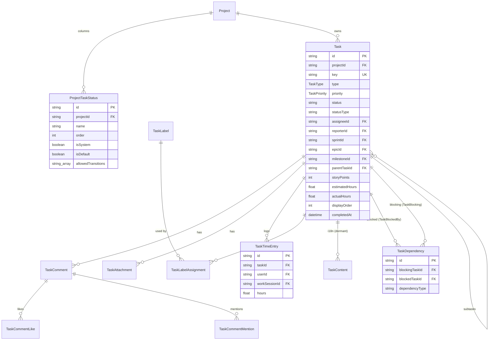
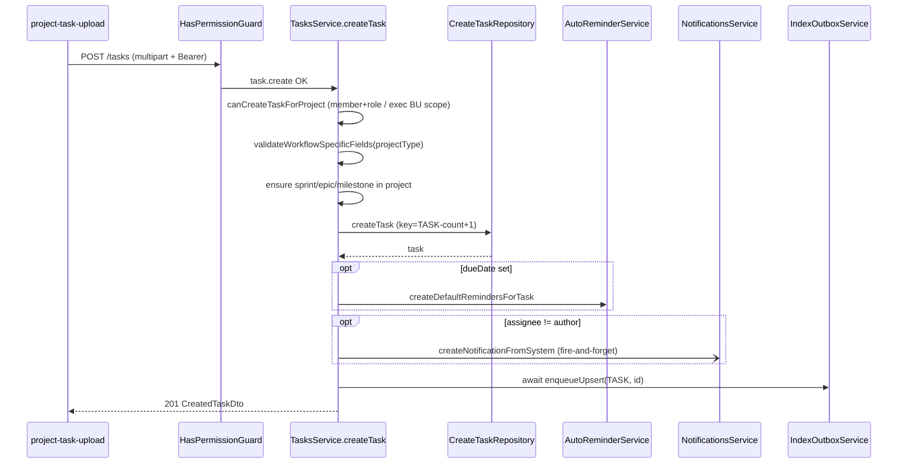
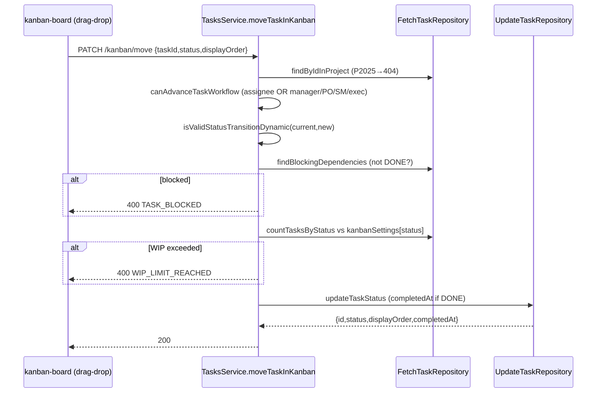

# Dossier 07 — Tasks (core)

> Scope: backend `src/tasks/**` (both controllers, `TasksService`, 6 repositories, all DTOs) and the
> models `Task`, `TaskContent`, `TaskComment`, `TaskCommentLike`, `TaskCommentMention`, `TaskLabel`,
> `TaskLabelAssignment`, `TaskDependency`, `TaskTimeEntry`, `TaskAttachment`, `ProjectTaskStatus` +
> enums `TaskType`, `TaskPriority`, `TaskStatusType`. Frontend: the task UI under
> `modules/projects/components/project-detail/project-task/**`, `modules/projects/hooks|services`
> (kanban, tasks, statuses, dependencies, time-entries, comments) and the standalone
> `modules/tasks/**` (assigned/todo view). RBAC guard mechanics belong to [[03-security-auth-rbac]];
> schema-wide concerns to [[02-database-architecture]]; the agile hierarchy (Sprint/Epic/Milestone) to
> [[06-agile-backlog]]; AI indexing to [[14-ai-copilot]]; projects/membership to [[05-projects]].

## 1. Identity
- **Purpose:** The project work-item system — task CRUD, a per-project customizable Kanban with status
  transitions and WIP limits, backlog & sprint assignment, dependencies, time logging, labels, and
  threaded comments with mentions/likes. This is the richest domain module in the codebase.
- **Backend source root:** `tdg-management-api-backend/src/tasks/`
  (`controller/{tasks,user-tasks}.controller.ts`, `services/tasks.service.ts` — 2735 lines,
  `repositories/{create,fetch,update,delete}-task.repository.ts`, `repositories/task-labels.repository.ts`,
  `repositories/task-statuses.repository.ts`).
- **Frontend source roots:**
  `tawer-management-frontend/src/modules/projects/components/project-detail/project-task/`,
  `.../modules/projects/{hooks,services,store,validation}` (task/kanban/status/dependency/time-entry code),
  and `tawer-management-frontend/src/modules/tasks/` (the assigned-tasks / todo detail sheet). The real
  UI lives inside the **project detail** page `app/[locale]/dashboard/(auth)/projects/[slug]/`; the
  `app/.../apps/tasks` and `app/.../kanban` routes are unrelated admin-template demos (§13).
- **Owned DB tables/models:** `Task`, `TaskContent`, `TaskComment`, `TaskCommentLike`,
  `TaskCommentMention`, `TaskLabel`, `TaskLabelAssignment`, `TaskDependency`, `TaskTimeEntry`,
  `TaskAttachment`, `ProjectTaskStatus` (all in `prisma/schema/agile.schema.prisma:53-297`).
  `Sprint`/`Epic`/`Milestone` are referenced but owned by [[06-agile-backlog]].

## 2. Purpose & business problem
The platform manages software delivery, so tasks are its core unit of work. A project is either
`AGILE` or `FREESTYLE` (`ProjectType`), and the task module adapts to both: AGILE projects get the full
6-column workflow (BACKLOG→…→DONE), sprints, epics and story points; FREESTYLE projects get a 3-column
board (TODO/IN_PROGRESS/DONE) with a `progressPercent` field and **no** sprint/epic/story-point features.
This split is enforced server-side (`tasks.service.ts:779-867`). Beyond CRUD, the module encodes real
agile ceremonies: backlog grooming/reorder, moving items into sprints, dependency-blocking (a task
cannot leave its column while blocked by an unfinished task, `:2154-2163`), per-column WIP limits, and
time tracking that rolls up into `Task.actualHours`. It is also an **AI indexing producer**: every task
create/update/delete and every new comment is enqueued into the RAG outbox ([[14-ai-copilot]]).

## 3. Domain model & database
Source: `prisma/schema/agile.schema.prisma`.

| Model | Key fields | Notable constraints / design |
|-------|-----------|------------------------------|
| `Task` | `id`, `projectId`, `key`, `type TaskType`, `priority TaskPriority`, `status String @default("TODO")`, `statusType String @default("ENUM")`, `assigneeId?`, `reporterId`, `sprintId?`, `epicId?`, `milestoneId?`, `parentTaskId?`, `storyPoints Int?`, `title`, `description?`, `estimatedHours Float?`, `actualHours Float @default(0)`, `dueDate?`, `completedAt?`, `displayOrder Int @default(0)`, `progressPercent Int? @default(0)`, `isFavorite`, `archived` | `@@unique([projectId, key])`; **8 indexes** incl. `[projectId,status]`, `[projectId,displayOrder]`, `assigneeId`, `sprintId`, `epicId`, `milestoneId`, `isFavorite`, `archived` (`:98-106`). `status` is a **free String, not an enum** — it holds either a system enum name or a custom `ProjectTaskStatus.name`. Self-relation `parentTask`/`subtasks` (`onDelete: Cascade`) gives 1-level subtasks (`:85-86`) |
| `ProjectTaskStatus` | `projectId`, `name`, `color @default("#6B7280")`, `order`, `isSystem`, `isDefault`, `isArchived`, `allowedTransitions String[]` | `@@unique([projectId,name])`; the **source of truth** for a project's board columns and legal transitions (`:280-297`). Seeded lazily (§4.1) |
| `TaskContent` | `taskId`, `title @default("")`, `description?`, `details?`, `language Language` | `@@unique([taskId, language])` — the i18n content-split table (like `SprintContent`). **Dormant:** no task code reads or writes `TaskContent` (§13); task text lives on `Task.title/description` directly |
| `TaskComment` | `taskId`, `authorId`, `content` | `author`/`task` `onDelete: Cascade`; has `likes` + `mentions` children (`:128-141`) |
| `TaskCommentLike` | `commentId`, `userId` | `@@unique([commentId,userId])` → one like per user (toggle) (`:144-154`) |
| `TaskCommentMention` | `commentId`, `userId` | `@@unique([commentId,userId])` (`:157-167`) |
| `TaskLabel` | `projectId`, `name`, `color @default("#6B7280")` | `@@unique([projectId,name])` — project-scoped reusable labels (`:198-210`) |
| `TaskLabelAssignment` | `taskId`, `labelId` | `@@unique([taskId,labelId])` — M-N junction Task↔TaskLabel (`:213-224`) |
| `TaskDependency` | `blockingTaskId`, `blockedTaskId`, `dependencyType @default("blocks")` | `@@unique([blockingTaskId,blockedTaskId])`; both FKs `onDelete: Cascade` (`:264-277`) |
| `TaskTimeEntry` | `taskId`, `userId`, `workSessionId?`, `hours Float`, `description?` | links time to a task and optionally a `WorkSession` ([[09-time-attendance]]) (`:110-125`) |
| `TaskAttachment` | `taskId`, `file` | `onDelete: Cascade` (`:170-179`) |

**Design rationale & verified oddities:**
- *`status` as free String + `statusType` discriminator (`ENUM`/`CUSTOM`)* — lets each project define
  arbitrary columns without schema changes; the price is that referential integrity between `Task.status`
  and `ProjectTaskStatus.name` is **application-enforced only** (no FK). The `TaskStatusType` enum exists
  (`:325-328`) but `Task.statusType` is a plain `String @default("ENUM")` and **no code ever reads or
  writes it** (grep: not referenced in `src/tasks/**`) — dead field + unused enum (§13).
- *Cascade asymmetry on Task FKs (verified, cross-refs diagnostic P2-6)* — `reporter` is
  `onDelete: Cascade` (`:88`) so deleting a user **deletes every task they reported**; `assignee`,
  `sprint`, `epic`, `milestone` have no `onDelete` and Prisma defaults optional relations to `SetNull`,
  so those cleanly null out. Deleting an active reporter is therefore destructive and asymmetric with
  assignee.
- *`estimatedHours`/`actualHours` are `Float`* — see [[02-database-architecture]] on float money/hours;
  `actualHours` is a **derived cache** recomputed from `TaskTimeEntry` sums (`update-task.repository.ts:273-285`).
- *`displayOrder Int`* — manual ordering for Kanban/backlog; primary sort key everywhere
  (`fetch-task.repository.ts:339`).

## 4. Backend architecture
Standard 4-layer pattern (see [[01-backend-architecture]]): two controllers → one `TasksService` →
six repositories → Prisma. `TasksModule` (`tasks.module.ts`) imports `Prisma`, `Logger`, `Auths`,
`Tokens`, `Reminders`, `Upload`, `Notifications`, and **`Ai`** modules, and exports `TasksService`
(consumed by [[06-agile-backlog]] and [[08-personal-tasks]]/todo views). Notable: it registers
`UserTasksController` **before** `TasksController` in the `controllers` array (`:33`) so that the literal
route `GET projects/:projectId/tasks/me` is matched before the param route
`GET projects/:projectId/tasks/:taskId` — an intentional ordering to avoid `me` being captured as a
`taskId`.

**4.1 Dynamic status system.** A project's board is data-driven via `ProjectTaskStatus`.
Project creation does **not** seed statuses; instead the read paths seed lazily via
`loadProjectStatusesEnsured` (`tasks.service.ts:79-93`) which, on an empty set, calls
`TaskStatusesRepository.seedDefaultsForProject` (`task-statuses.repository.ts:154-235`) with the 6 AGILE
or 3 FREESTYLE system rows (each carrying `allowedTransitions`). Transition validation
(`isValidStatusTransitionDynamic`, `:380-420`) prefers the DB rows: a move to a **custom** (non-system)
status is allowed from any status; a move to a **system** status must appear in the current status's
`allowedTransitions`; if the project has **no** statuses yet it falls back to hard-coded
`freestyleTransitions`/`validTransitions` maps (`:427-453`). Because seeding only happens on read paths
(status list / kanban), the same enum maps are duplicated in three places (seed defaults, the fallback,
and the frontend badges) — the documented drift risk (diagnostic P2-4, verified below §13).

**4.2 Authorization — two tiers, project-scoped.** Every route carries a coarse `@Permissions([...])`
gate via `HasPermissionGuard` (global RBAC, [[03-security-auth-rbac]]). Inside the service a **second,
project-scoped** check runs against `ProjectMember.isManager` and the caller's roles. Executives bypass
membership through **business-unit scoping**: `isExecutive` = CEO/CTO/CMO (`:330-336`); CEO sees all
(`isGlobalExecutive`, `:338-340`), while CTO is scoped to `BusinessUnit.TawerDev` and CMO to
`BusinessUnit.TawerCreative` (`getExecutiveBusinessUnitScope`, `:342-355`), checked against
`Project.businessUnit` (`hasExecutiveProjectAccess`, `:357-374`). The graduated capability helpers:

| Helper | Grants to (besides executives) | Used by |
|--------|-------------------------------|---------|
| `canAccessProject` (`:455-472`) | any `ProjectMember` | reads, comments, time-entries, bulk-status |
| `canCreateTaskForProject` (`:517-538`) | manager, ProductOwner, BusinessAnalyst | create task |
| `canManageTaskStructure` (`:540-555`) | manager, ProductOwner | delete task, statuses, labels, dependencies |
| `canManageBacklog` (`:557-575`) | manager, ProductOwner, ScrumMaster | reorder backlog |
| `canManageSprintAssignment` (`:655-673`) | manager, ProductOwner, ScrumMaster | move-to-sprint |
| `canUpdateTask` (`:577-613`) | manager/PO, ScrumMaster, or any of 8 engineer roles (member) | update task |
| `canAdvanceTaskWorkflow` (`:675-698`) | manager/PO/ScrumMaster, **or the assignee** | kanban move |

Membership is resolved via `ProjectMember` (`findMembership` throws `P2025` → caught as "no access",
`fetch-task.repository.ts:728-738`).

**4.3 Repositories.** `FetchTaskRepository` (804 lines) centralizes read shapes: `buildSelectForDetails`
(full sheet incl. comments+likes+mentions, dependencies both directions, attachments, labels, subtasks,
`_count`), `buildSelectForList` (lean), `buildWhereClause` (typed Prisma filters — **no raw SQL**), and
`buildOrderBy` (always `displayOrder asc` primary, then the `sortBy` key, then `createdAt desc, id asc`
deterministic tiebreak, `:335-382`). `CreateTaskRepository.generateTaskKey` derives `TASK-<count+1>`
(`:9-18`). `UpdateTaskRepository` builds partial `UncheckedUpdateInput` maps, wraps attachment
add/remove + task update in one `$transaction` (`:84-137`), and owns `recalculateActualHours`,
`toggleCommentLike`, `reorderBacklog` (a `$transaction` of per-task updates, `:196-211`).

**4.4 Error handling.** Consistent Prisma-code → domain-exception mapping: `P2025` → `NotFound`
(TASK_NOT_FOUND), `P2002` → `Conflict` (TASK_ALREADY_EXISTS / label variants). `findByIdInProject` uses
`findFirstOrThrow` so a wrong `projectId` yields `P2025` and a clean 404 (`fetch-task.repository.ts:398-403`).

**4.5 Side effects.** Create/update fire **fire-and-forget** notifications on assignment/status-change
(`notificationsService.createNotificationFromSystem`, not awaited); create also spawns due-date reminders
(`autoReminderService.createDefaultRemindersForTask`, `:933-941`). Create/update/delete task and add-comment
each `await indexOutboxService.enqueue{Upsert,Delete}` for AI retrieval ([[14-ai-copilot]], `:951-956, 1162-1167, 1210-1216, 1408-1413`).

## 5. API surface
All routes require a valid JWT + the listed permission via `HasPermissionGuard`; `AgileOnlyGuard` +
`@AgileProject('projectId')` additionally gate backlog/sprint routes to AGILE projects. `projectId` and
all ids are `ParseUUIDPipe`-validated. Cite: `tasks.controller.ts`, `user-tasks.controller.ts`.

### `TasksController` — `tasks.controller.ts`
| Method | Path | Permission(s) | Request DTO | Response DTO | Service business logic (1 line) | Side effects |
|--------|------|---------------|-------------|--------------|--------------------------------|--------------|
| POST | `projects/:projectId/task-statuses` | `task.status.manage` | `CreateTaskStatusDto` | `TaskStatusDto` | manage-structure check; dup-name check; append at max order+1 (`:101-157`) | — |
| GET | `projects/:projectId/task-statuses` | `task.read.many` | — | `TaskStatusDto[]` | access check; **lazily seed** defaults then list (`:159-196`) | seeds ProjectTaskStatus |
| PATCH | `projects/:projectId/task-statuses/:statusId` | `task.status.manage` | `UpdateTaskStatusDto` | `TaskStatusDto` | system rows: only `order` editable; dup-name guard (`:198-274`) | — |
| DELETE | `projects/:projectId/task-statuses/:statusId` | `task.status.manage` | — | 204 | block if system, or if ≥1 task uses it (`:276-328`) | — |
| POST | `projects/:projectId/tasks` | `task.create` | `CreateTaskDto` + `attachments[≤50]` | `CreatedTaskDto` | create-check; project-type field validation; FK checks; create + key gen (`:869-976`) | reminders, assignee notif, AI upsert |
| GET | `projects/:projectId/tasks` | `task.read.many` | `TaskQueryDto` (query) | `TaskListDto` | access; filter+paginate (Prisma builder) (`:978-1031`) | — |
| GET | `projects/:projectId/tasks/:taskId` | `task.read.by.id` | — | `TaskResponseDto` | access; full-detail select (`:1033-1063`) | — |
| PATCH | `projects/:projectId/tasks/bulk-status` | `task.status.manage` | `BulkUpdateTaskStatusDto` | `TaskBulkUpdateStatusResponseDto` | per-item transition-validate; partial-success results (`:2604-2672`) | — |
| PATCH | `projects/:projectId/tasks/:taskId` | `task.update.any` \| `task.update.own` | `UpdateTaskDto` + `attachments[≤10]` | `UpdatedTaskDto` | update-check; type-field + transition validation; FK checks (`:1065-1190`) | reassign/status notif, AI upsert |
| DELETE | `projects/:projectId/tasks/:taskId` | `task.delete` | — | 204 | manage-structure check; hard delete (`:1192-1228`) | AI delete enqueue |
| GET | `projects/:projectId/kanban` | `task.read.many` | `sprintId?`, `epicId?`, `groupBy=assignee?` (query) | grouped columns + `wipLimits` | access; group by status (dynamic) or assignee swimlanes (`:1932-1996`) | seeds statuses |
| PATCH | `projects/:projectId/kanban/move` | `task.update.status.any` \| `.own` | `MoveTaskInKanbanDto` | status/order result | advance-workflow check; transition + blocked-deps + WIP-limit checks (`:2115-2218`) | assignee notif |
| POST | `projects/:projectId/tasks/:taskId/comments` | `task.create.comment` | `CreateTaskCommentDto` | `TaskCommentResponseDto` | access; create comment + mentions (tx) (`:1339-1416`) | assignee+mention notifs, AI upsert |
| GET | `projects/:projectId/backlog` | `backlog.read` (AGILE) | `isFavorite?`, `archived?` | `TaskSummaryDto[]` | access; tasks with `sprintId=null, parentTaskId=null` (`:1874-1899`) | — |
| GET | `projects/:projectId/sprints/:sprintId/tasks` | `task.read.many` (AGILE) | `isFavorite?`, `archived?` | `TaskSummaryDto[]` | access; sprint scoping (`:1901-1930`) | — |
| PATCH | `projects/:projectId/backlog/reorder` | `backlog.manage` (AGILE) | `ReorderBacklogDto` | `TaskDisplayOrderDto[]` | manage-backlog; bulk-verify tasks; tx reorder (`:1791-1827`) | — |
| POST | `projects/:projectId/backlog/:taskId/move-to-sprint` | `backlog.manage` (AGILE) | `MoveToSprintDto` | `TaskMoveToSprintResponseDto` | manage-sprint-assign; sets `sprintId` + `status='TODO'` (`:1829-1872`) | — |
| POST | `projects/:projectId/tasks/:taskId/dependencies` | `task.add.dependency` | `AddDependencyDto` | `TaskDependencyResponseDto` | manage-structure; **circular-dep DFS** guard (`:1230-1283`) | — |
| DELETE | `.../dependencies/:dependencyId` | `task.remove.dependency` | — | 204 | manage-structure; delete dep (`:1285-1337`) | — |
| PATCH | `.../comments/:commentId` | `task.update.comment` \| `.own.comment` | `UpdateTaskCommentDto` | `TaskCommentResponseDto` | author-or-manager check (`:1479-1542`) | — |
| DELETE | `.../comments/:commentId` | `task.delete.comment` \| `.own.comment` | — | 204 | author-or-manager check (`:1418-1477`) | — |
| POST | `.../comments/:commentId/like` | `task.like.comment` | — | `{liked}` | access; toggle like (`:1544-1582`) | — |
| POST | `.../time-entries` | `task.log.time` | `LogTimeEntryDto` | `TaskTimeEntryDto` | access; create entry; recompute `actualHours` (`:1584-1630`) | — |
| GET | `.../time-entries` | `task.read.time.entries` | — | `TaskTimeEntryDto[]` | access; list entries (`:1632-1662`) | — |
| PATCH | `.../time-entries/:timeEntryId` | `task.update.time.entry` \| `.own` | `UpdateTimeEntryDto` | `TaskTimeEntryDto` | owner-or-manager; recompute hours (`:1664-1729`) | — |
| DELETE | `.../time-entries/:timeEntryId` | `task.delete.time.entry` \| `.own` | — | 204 | owner-or-manager; recompute hours (`:1731-1789`) | — |
| GET | `projects/:projectId/labels` | `task.read.many` | — | `TaskLabelDto[]` | access; list labels (`:2366-2380`) | — |
| GET | `projects/:projectId/labels/:labelId` | `task.read.many` | — | `TaskLabelDto` | access; get label (`:2382-2410`) | — |
| POST | `projects/:projectId/labels` | `task.create.label` | `CreateTaskLabelDto` | `TaskLabelDto` | manage-structure; create (`:2412-2446`) | — |
| PATCH | `projects/:projectId/labels/:labelId` | `task.update.label` | `UpdateTaskLabelDto` | `TaskLabelDto` | manage-structure; update (`:2448-2501`) | — |
| DELETE | `projects/:projectId/labels/:labelId` | `task.delete.label` | — | 204 | manage-structure; delete (`:2503-2518`) | — |
| POST | `.../tasks/:taskId/labels/:labelId` | `task.create.label` | — | `TaskLabelAssignmentResponseDto` | manage-structure; assign (dup→409) (`:2520-2561`) | — |
| DELETE | `.../tasks/:taskId/labels/:labelId` | `task.delete.label` | — | 204 | manage-structure; unassign (`:2563-2600`) | — |

### `UserTasksController` — `user-tasks.controller.ts`
| Method | Path | Permission | Request | Response | Logic |
|--------|------|-----------|---------|----------|-------|
| GET | `projects/:projectId/tasks/me` | `task.read.many` | `TaskQueryDto` | `TaskListDto` | access; **`assigneeId` forced to JWT id**; paginate (`tasks.service.ts:2674-2710`) |
| GET | `project-tasks/assigned` | `task.read.many` | `TaskQueryDto` | `TaskListDto` | cross-project tasks where `assigneeId = JWT id` (`:2712-2734`) |

## 6. Frontend
The task UI is embedded in the **project-detail** page, not a standalone route.
- **Components** (`modules/projects/components/project-detail/project-task/`): `project-tasks.tsx`
  (tab shell), `project-tasks-list.tsx` + `project-task-item.tsx` (list), `project-tasks-kanban-board.tsx`
  + `project-tasks-kanban-card.tsx` (drag-drop board), `project-task-details-sheet.tsx` (side sheet)
  composed of `task-{comments,attachments,dependencies,labels,subtasks,time-entries}-section.tsx` and
  `task-status-stepper.tsx`, `bulk-action-bar.tsx`, `project-task-upload.tsx` (create/edit form),
  `project-tasks-toolbar.tsx` (search/filter). Project settings host `project-task-statuses.tsx`.
- **Hooks** (`modules/projects/hooks/`): `tasks/use-project-tasks.ts` (TanStack Query, key
  `["project-tasks", projectId, search, status, priority, type, assigneeId, milestoneId, epicId]`,
  server-side filters, `use-project-tasks.ts:16-31`), `kanban/use-kanban-board.ts` (key
  `["kanban", projectId, sprintId, epicId, groupBy]`), `task-statuses/use-task-statuses.ts`,
  `tasks/use-project-task-comment.ts`, `tasks/use-project-task-upload.ts`,
  `tasks/use-assigned-project-tasks.ts`.
- **Services** (`modules/projects/services/api/`): `project-tasks.ts` (`retrieveProjectTasks` /
  `retrieveProjectTask`), `project-kanban.ts` (`retrieveKanbanBoard` — normalizes the backend's
  `{STATUS: task[]}` map into `{columns:[…]}`; `moveTaskInKanban` PATCH), `project-task-upload.ts`,
  `project-task-comment(s).ts`, `project-task-dependencies.ts`, `project-task-statuses.ts`,
  `project-task-deletion.ts`. All catch `401` and retry once via `refreshToken(...)`.
- **State/validation:** Zustand `store/project-tasks.ts`; Zod `validation/project-task.schema.ts` +
  `task-status.schema.ts`; badge/colour maps `utils/badges/project-task-badges.ts`.
- **Standalone module** `modules/tasks/**` powers the assigned/todo detail sheet
  (`components/task-details-sheet.tsx`, `hooks/tasks/extraction/use-task(s).ts`,
  `services/extraction/task(s).ts`) used by the `todo-list/project` view via the
  `project-tasks/assigned` endpoint.
- **UX flow:** open a project → Tasks/Kanban/Backlog tabs → list or drag-drop board → click a card to
  open the detail sheet (edit fields, step status, comment/@mention/like, log time, add dependency,
  assign labels, upload attachments). Create via the toolbar "＋" opening `project-task-upload.tsx`.

## 7. Data flow & key scenarios

**A. Create task** (`POST projects/:projectId/tasks`)
1. FE `project-task-upload.tsx` (Zod-validated) → `project-task-upload.ts` POSTs `multipart/form-data`
   (fields + `attachments[]`).
2. `HasPermissionGuard` checks `task.create`; `FileFieldsInterceptor` stores files.
3. Service `createTask` (`:869`): `canCreateTaskForProject` (manager/PO/BA/exec); map uploaded files to
   `dto.attachments`; resolve `projectType` + default status; `validateWorkflowSpecificFields`
   (rejects sprint/epic/story-points/progress that don't match the project type); verify sprint/epic/
   milestone belong to the project.
4. `CreateTaskRepository.createTask`: `generateTaskKey` → `TASK-<count+1>`; insert `Task` (+ nested
   attachments); returns lean select.
5. If `dueDate` → auto-reminders; if new assignee ≠ author → fire-and-forget notification; **await**
   `indexOutbox.enqueueUpsert(TASK)`. `P2025`→400 invalid-ref, `P2002`→409.

**B. Move task in Kanban** (`PATCH projects/:projectId/kanban/move`)
1. FE drag-drop in `project-tasks-kanban-board.tsx` → `moveTaskInKanban(projectId,{taskId,status,displayOrder})`.
2. Service `moveTaskInKanban` (`:2115`): load task (P2025→404); `canAdvanceTaskWorkflow` (assignee or
   manager/PO/SM/exec); `isValidStatusTransitionDynamic`; `checkTaskBlocked` (reject if any blocking dep
   not `DONE`); WIP-limit check (`kanbanSettings[status]` vs live count); fire-and-forget assignee notif;
   `updateTaskStatus` (sets `completedAt` when `status==='DONE'`, applies `displayOrder`).

**C. Log time** (`POST projects/:projectId/tasks/:taskId/time-entries`)
1. Service `logTime` (`:1584`): `canAccessProject`; ensure task in project; `addTimeEntry`
   (optionally links a `WorkSession`); `recalculateActualHours` re-aggregates `SUM(hours)` into
   `Task.actualHours`.

## 8. Diagrams (Mermaid)

### 8.1 ERD slice (this module)


### 8.2 Sequence — create task


### 8.3 Sequence — move task in kanban


### 8.4 Status transition state machine (seeded system defaults)
```mermaid
stateDiagram-v2
    note left of TODO_f : FREESTYLE (3 cols)
    [*] --> TODO_f
    TODO_f --> IN_PROGRESS_f
    IN_PROGRESS_f --> TODO_f
    IN_PROGRESS_f --> DONE_f
    DONE_f --> IN_PROGRESS_f

    note left of BACKLOG : AGILE (6 cols)
    [*] --> BACKLOG
    BACKLOG --> TODO
    TODO --> BACKLOG
    TODO --> IN_PROGRESS
    IN_PROGRESS --> TODO
    IN_PROGRESS --> IN_REVIEW
    IN_REVIEW --> IN_PROGRESS
    IN_REVIEW --> TESTING
    TESTING --> IN_REVIEW
    TESTING --> DONE
    DONE --> TESTING
```

## 9. Security
- **AuthN/AuthZ:** all 35 endpoints require a JWT + specific permission (`HasPermissionGuard`), then a
  **second project-scoped** authorization in the service (§4.2). This is the module's strongest security
  property: the guard cannot be satisfied by simply being logged in, and cross-project access is blocked
  because every mutation resolves `ProjectMember` for `(userId, projectId)` before acting.
- **Injection:** no raw SQL anywhere in tasks — all reads/writes go through the Prisma query-builder with
  typed `where`/`select` (`fetch-task.repository.ts`), so parameterization is automatic. Contrast with
  the raw-SQL surface in [[04-users-teams]].
- **Input validation:** DTOs use class-validator (`@IsUUID`, `@IsEnum`, `@IsInt/@Min/@Max`,
  `@IsDateString`); `storyPoints`/`estimatedHours`/`progressPercent` are range-bounded
  (`create-task.dto.ts:121-168`). `status` is intentionally a free `@IsString` (custom statuses), so the
  authoritative check is `isValidStatusTransitionDynamic`, not the DTO.
- **Mass-assignment:** the global `ValidationPipe` has **no `whitelist`** (see [[01-backend-architecture]]/
  [[03-security-auth-rbac]]). In tasks the blast radius is small because repositories **explicitly map
  each field** (`create-task.repository.ts:27-58`, `update-task.repository.ts:11-82`) rather than
  spreading the DTO — unknown body keys are silently dropped. So the missing whitelist is a latent
  platform issue, not exploitable here.
- **Ownership checks:** comment and time-entry mutations enforce author/owner-or-manager
  (`ensureCommentMutationAccess :700-734`, `ensureTimeEntryMutationAccess :736-773`). Kanban moves allow
  the assignee (`canAdvanceTaskWorkflow`).
- **Gaps / weaker spots:**
  - **`bulkUpdateStatus` authorizes only `canAccessProject`** (any member) at the service level
    (`:2610-2620`), while the single kanban move requires `canAdvanceTaskWorkflow` and re-checks
    blocked-deps + WIP. The guard permission (`task.status.manage`) is what actually restricts bulk to
    managers in practice, but the service-layer check is inconsistent with the per-move path and skips
    the blocked/WIP business rules — a member holding `task.status.manage` could bypass WIP/dependency
    gating in bulk. Verify against the RBAC map in [[03-security-auth-rbac]].
  - **`moveToSprint` unconditionally sets `status='TODO'`** (`update-task.repository.ts:213-229`),
    bypassing transition validation — a `DONE` task moved to a sprint silently resets to TODO.
  - No rate limiting on comment creation / likes (platform-wide, [[03-security-auth-rbac]]).

## 10. Cross-module dependencies
- **Depends on:** `AuthsModule`/`TokensModule` (guards, JWT), `PrismaModule`, `UploadModule`
  (attachment storage), `NotificationsModule` ([[12-notifications]]), `RemindersModule`
  ([[11-reminders]], due-date reminders), and **`AiModule`** ([[14-ai-copilot]],
  `IndexOutboxService`). It reads `ProjectMember`/`Project.businessUnit`/`Project.kanbanSettings` from
  [[05-projects]] and `Sprint`/`Epic`/`Milestone` from [[06-agile-backlog]].
- **Depended on by:** exports `TasksService` (`tasks.module.ts:43`), consumed by agile/todo surfaces.
  `TaskTimeEntry.workSessionId` couples to [[09-time-attendance]].
- **Coupling note:** the module is a hub — high **efferent** coupling (7 imported modules) reflecting
  that tasks sit at the centre of the workflow. Cohesion is high within `TasksService`, though the
  service is a 2735-line "god service" mixing authorization, validation, grouping, and orchestration
  (§12).

## 11. Tests
- **Backend:** **zero** — there are no `*.spec.ts` files under `src/tasks/**` (not even the NestJS
  scaffold specs that other modules carry). None of the authorization matrix, transition validation,
  circular-dependency DFS, WIP/blocked gating, or key generation is covered by a backend test.
- **Frontend:** property-based (`fast-check` + `vitest`) tests in `modules/projects/__tests__/` exercise
  **client-side** transforms/invariants only: `project-kanban.test.ts` (no-task-loss + swimlane
  membership), `project-backlog.test.ts`, `bulk-status.test.ts`, `project-time-entries.test.ts`,
  `project-task-dependencies.test.ts`, `project-task-comments-enhanced.test.ts`,
  `project-task-statuses.test.ts`, `project-analytics.test.ts`, and `cast-project-{epic,label,milestone}.test.ts`.
  They validate FE normalization/casting, **not** backend behaviour.
- **Gap:** the highest-risk backend logic (transition validation, executive BU scoping, bulk-status
  authorization, `generateTaskKey` collisions) is entirely untested.

## 12. Code quality
- **Good:** clean 4-layer separation; centralized read shapes (`buildSelectFor*`); typed Prisma filters
  (no raw SQL); deterministic ordering with an `id` tiebreak (`fetch-task.repository.ts:379`); explicit
  field-by-field update maps that neutralize mass-assignment; consistent Prisma-error mapping.
- **Bad — god service:** `tasks.service.ts` is **2735 lines** in one class, mixing seven concerns
  (statuses, tasks, comments, time, labels, backlog, kanban) plus its own authorization DSL. The label
  and status logic could each be their own service.
- **Bad — dead try/catch:** `getTaskStatuses` wraps a block in `try { … } catch (error) { if (error
  instanceof ForbiddenCustomException) throw error; throw error; }` — both branches rethrow, so the catch
  is inert (`:176-181`), the same anti-pattern flagged in [[04-users-teams]].
- **Mixed — duplicated transition knowledge:** the AGILE/FREESTYLE transitions exist in three places —
  seed defaults (`task-statuses.repository.ts:158-224`), the enum fallback
  (`tasks.service.ts:432-450`), and the FE badge/step maps — with no single source (diagnostic P2-4).
- **Repetition:** the `findByIdInProject` + `P2025→NotFound` guard block is copy-pasted in ~10 service
  methods (`ensureTaskExistsInProject` exists but most call sites inline the try/catch anyway).

## 13. Verified technical debt
- **`generateTaskKey` is collision-prone** — `TASK-<count+1>` derives from a live `count()` in a
  transaction that does **not** include the subsequent `task.create` (`create-task.repository.ts:9-18`
  vs `:20-27`). Two concurrent creates compute the same count → one fails `@@unique([projectId,key])`
  (P2002, surfaced as 409); and after deleting any non-last task the count-based key **reuses an existing
  key** on the next create, forcing a spurious conflict. Keys are also not monotonic/stable.
- **`TaskContent` model + `Task.statusType` field + `TaskStatusType` enum are dormant** — `TaskContent`
  (i18n split, `agile.schema.prisma:181-195`) is never read/written by task code (title/description live
  on `Task`); `Task.statusType` (`:80`) and the `TaskStatusType` enum (`:325-328`) are never referenced
  in `src/tasks/**`. Latent/abandoned design that misleads readers (cross-ref [[02-database-architecture]]).
- **`completedAt` only tracks the literal `'DONE'`** — set when `status==='DONE'`
  (`update-task.repository.ts:31-33, 148-150`) but **never cleared** when moving out of DONE, and never
  set for a custom terminal status not named `DONE`. Reopened tasks keep a stale `completedAt`.
- **Attachment files are orphaned on disk** — `deleteTask` and `updateTask` (via `deletedAttachments`)
  delete only DB rows (`delete-task.repository.ts:8-12`, `update-task.repository.ts:89-95`); unlike the
  user-image lifecycle in [[04-users-teams]], the physical files under the upload dir are never removed.
- **`bulkUpdateStatus` skips WIP/blocked checks and uses a weaker service-level auth** than the per-task
  kanban move (§9) — inconsistent enforcement of the same status-change rule.
- **`moveToSprint` resets status to `'TODO'`** regardless of current status, bypassing transition
  validation (`update-task.repository.ts:213-229`).
- **Frontend hard-caps the project task list & kanban at 100** — `retrieveProjectTasks` always sends
  `limit=100` with no pagination control (`project-tasks.ts:54`); tasks past the 100th silently vanish
  from both the list and (via the same fetch) column counts (diagnostic P1-4, verified).
- **Frontend list/kanban services swallow errors to `[]`** — `retrieveProjectTasks` returns `[]` on any
  non-401 error (`project-tasks.ts:60-65`), so failures render as "No tasks found" with no error state
  (diagnostic P2-1, verified).
- **FE↔BE status colour duplication** — the authoritative `ProjectTaskStatus.color` is fetched but the UI
  paints from a hard-coded map keyed to the six system names (`utils/badges/project-task-badges.ts`),
  dropping custom-status colours (diagnostic P2-3, verified in FE files list).
- **`app/.../apps/tasks` and `app/.../kanban` are dead template pages** — `apps/tasks/page.tsx` reads a
  static `data/tasks.json` from disk; unrelated to the real feature and shippable dead weight.

## 14. Strengths / Weaknesses / Improvements
**Strengths**
- Two-tier, project-scoped authorization with executive business-unit scoping — genuinely defensive and
  applied uniformly across mutations.
- Fully parameterized data access (no raw SQL), typed filters, deterministic ordering.
- Data-driven Kanban (custom statuses + `allowedTransitions` + WIP limits + dependency blocking) is a
  real, non-trivial workflow engine.
- Clean AI-outbox integration makes tasks searchable without coupling retrieval into the write path.

**Weaknesses**
- A 2735-line god service with copy-pasted guard blocks and one dead try/catch.
- Count-based task keys are racy and collide after deletes.
- Transition knowledge is triplicated (seed / fallback / FE) with no single source → drift.
- Zero backend tests over the riskiest logic; FE cap-at-100 and error-to-`[]` degrade the real UX.
- Dormant `TaskContent`/`statusType`/`TaskStatusType` mislead about i18n & status modeling.

**Improvements (concrete)**
1. Replace `generateTaskKey` with a per-project monotonic counter (e.g. a `Project.taskSeq` incremented
   in the same `$transaction` as the insert, or a DB sequence), eliminating races and post-delete reuse.
2. Extract `TaskLabelsService` and `TaskStatusesService` from `TasksService`; factor the repeated
   `findByIdInProject → P2025→NotFound` into a single guard used everywhere.
3. Make transitions single-source: drive both validation and the FE stepper from `ProjectTaskStatus`
   rows (seed on project creation, delete the fallback maps and FE colour map).
4. Clear `completedAt` when leaving a terminal status; treat "terminal" as `isDefault`/a flag, not the
   literal `'DONE'`.
5. Delete attachment files from disk on task/attachment delete (reuse `UploadService`).
6. Align `bulkUpdateStatus` with the per-move path (same auth + blocked/WIP checks); stop resetting
   status in `moveToSprint`.
7. FE: paginate/infinite-scroll the task list & kanban; surface fetch errors instead of returning `[]`;
   consume `ProjectTaskStatus.color`; remove the `apps/tasks`/`kanban` template routes.

## 15. Verification Checklist
| Area | Verified? | Evidence / reason |
|------|-----------|-------------------|
| Domain model | Yes | `agile.schema.prisma:53-328` read in full |
| Backend logic (service) | Yes | entire `tasks.service.ts` (2735 lines) read |
| Backend logic (repositories) | Yes | all 6 repositories read in full |
| Every endpoint | Yes | both controllers read line-by-line; permissions cross-checked in `permissions.ts:131-171` |
| Authorization model | Yes | all `can*` helpers + BU scoping read; RBAC map deferred to [[03-security-auth-rbac]] |
| DTO validation | Yes | create/update/query/move/comment/time/bulk DTOs read |
| Frontend pages/hooks/services | Partial | key hooks/services (tasks, kanban) read; individual sheet subsections spot-read from file list, not exhaustively |
| Security (injection, mass-assign, ownership) | Yes | traced repos (no raw SQL), field-mapping, ownership guards |
| Tests | Yes | confirmed no backend specs; listed 11 FE property tests |
| Tech debt | Yes | each item cited to file:line |
| Live DB behaviour / query plans | No | static analysis only; no running DB |
| Runtime confirmation of key-collision / WIP races | No | reasoned from code, not executed |

## 16. Not verified / Open questions
- **Cross-dossier contradiction (needs reconciliation in assembly):** dossier [[04-users-teams]] states
  "No `BusinessUnit` enum exists." It **does** exist (`projects.schema.prisma:104`, `enum BusinessUnit`)
  and `Project.businessUnit` is a required field (`:5`), used here for executive scoping
  (`tasks.service.ts:342-374`, `fetch-task.repository.ts:606-614`). Dossier 04's claim was scoped to the
  *user* schema, but the flat statement is misleading — flag for [[02-database-architecture]] to arbitrate.
- **`generateTaskKey` collision** — the count-based race and post-delete reuse are unambiguous from the
  code but not reproduced against a live DB.
- **Custom-status transition reachability** — when a custom status is created without
  `allowedTransitions`, tasks in it may be unable to move to any *system* status (only to other custom
  ones). The code path is clear (`:401-415`) but the practical UX impact wasn't exercised.
- **`kanbanSettings` shape** — read as `Record<string, number>` (`fetch-task.repository.ts:43`) but its
  authoring UI and full schema live in [[05-projects]]; not verified here.
- **Whether lazy status seeding ever races** — two simultaneous first-reads could both see 0 statuses and
  both `createMany` (no unique guard on the seed batch beyond `@@unique([projectId,name])`, which would
  make the second fail). Not reproduced.
- **Frontend detail-sheet stale-status cache** (diagnostic P1-2) — noted in the diagnostic against
  `task-status-stepper.tsx`; the query-key mismatch is plausible from the hooks read but the exact
  invalidation call sites were not opened in this session.
