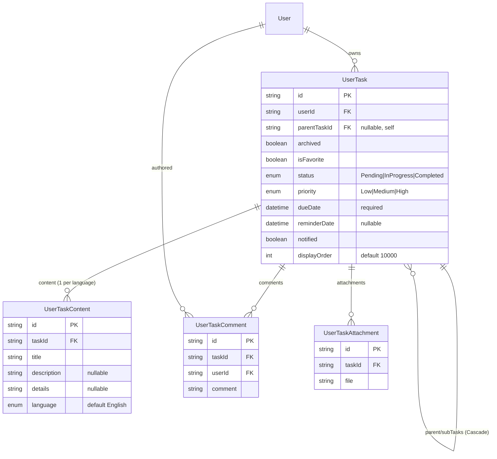
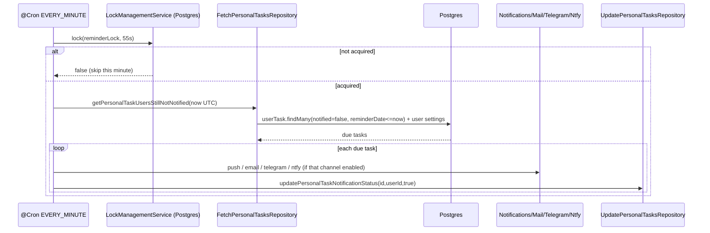

# Dossier 08 — Personal Tasks / To-do

## 1. Identity
- **One-line purpose:** A private per-user to-do list (personal tasks with sub-tasks, attachments,
  comments, priorities, statuses, due/reminder dates and manual ordering), fully separate from
  project/agile tasks.
- **Backend source root:** `tdg-management-api-backend/src/personal-tasks/**`
  (module: `personal-tasks.module.ts:19`).
- **Frontend source roots:**
  - Pages: `tawer-management-frontend/src/app/[locale]/dashboard/(auth)/todo-list/**`
  - Module code (reused from the "tasks" module): `tawer-management-frontend/src/modules/tasks/**`
- **Owned DB tables/models:** `UserTask`, `UserTaskContent`, `UserTaskComment`, `UserTaskAttachment`
  (all in `prisma/schema/user-tasks.schema.prisma:1-55`); enums `UserTaskStatus`, `UserTaskPriority`
  (`user-tasks.schema.prisma:57-67`).

## 2. Purpose & business problem
The platform separates *work assigned inside projects* (Dossier 07 — Tasks) from a user's *own private
checklist*. Personal tasks are owned by exactly one user (`UserTask.userId`, `user-tasks.schema.prisma:8`)
and every backend query is scoped by that `userId`, so one user's to-do list is never visible to another
(e.g. fetch scoping in `fetch-personal-tasks.repository.ts:18`, `:86-87`). The module also drives a
per-minute reminder engine that pushes multi-channel notifications when a task's `reminderDate` arrives
(`personal-tasks.service.ts:235-332`). In the UI the feature is presented as a "To-do list" with two tabs:
**Personal** (this module) and **Project** (assigned project tasks), see
`todo-list/render.tsx:16-29`.

## 3. Domain model & database
Source: `prisma/schema/user-tasks.schema.prisma`.

**`UserTask`** (`:1-21`) — the root entity.
- Scalars: `id` (uuid PK), `archived` (bool, default false, `:3`), `isFavorite` (bool, default false,
  `:5`), `status` (`UserTaskStatus`, default `Pending`, `:6`), `priority` (`UserTaskPriority`, default
  `Medium`, `:7`), `dueDate` (`Timestamp(6)`, **required**, `:9`), `reminderDate` (`Timestamp(6)`,
  nullable, `:10`), `notified` (bool, default false, `:11`), `displayOrder` (`Int?`, default `10000`,
  `:14`), `createdAt`/`updatedAt` (`:12-13`).
- Self-relation for sub-tasks: `parentTaskId String?` (`:4`) → `parentTask`/`subTasks` via relation
  `"TaskSubtasks"` with **`onDelete: Cascade`** (`:15-16`). Deleting a parent deletes all descendant
  sub-task rows.
- Owner: `user User @relation(... onDelete: Cascade)` (`:17`) — deleting a user erases their whole
  to-do list.
- Children: `attachments`, `comments`, `content` (`:18-20`).

**`UserTaskContent`** (`:23-35`) — the content-table split (same i18n pattern as the rest of the app):
`title` (required), `description?`, `details?`, `language` (`Language`, default `English`, `:29`),
FK `taskId` with `onDelete: Cascade` (`:32`), and **`@@unique([taskId, language])`** (`:34`). This is
why every read filters `where: { language: Language.English }` (e.g. `create-personal-tasks.repository.ts:46`)
and every write upserts on `taskId_language` (`update-personal-tasks.repository.ts:37`).
**WHY the split:** it lets one task hold one content row per language. As with the rest of the platform,
the second language is dormant — `Language` is effectively single-valued and everything is hard-coded to
`English` (see Dossier 02 on the `Language` enum / `TransformLanguagePipe`). So today the split adds a
join and an upsert with no functional payoff.

**`UserTaskComment`** (`:37-46`) — `comment` text, FK `taskId` (cascade, `:44`) and FK `userId` (cascade,
`:45`). Note: a comment carries its own `userId`, distinct from the task's owner (relevant to the
security gap in §9).

**`UserTaskAttachment`** (`:48-55`) — `file` (stored path string), FK `taskId` (cascade, `:54`). No
size/mime column; files live on disk (see §7).

**Enums:** `UserTaskStatus = {Pending, InProgress, Completed}` (`:57-61`);
`UserTaskPriority = {Low, Medium, High}` (`:63-67`). These are **distinct** from the project-task enums
(`TaskStatusType`/`TaskPriority`, Dossier 07) — a deliberate separation so personal and project tasks
evolve independently.

**Design notes / WHY:**
- **Separate tables from project `Task`** — personal tasks need no project, epic, sprint, assignee,
  labels, dependencies or time-entries, so a dedicated slimmer model avoids nullable-heavy reuse.
- **`displayOrder` default `10000`** (`:14`) — new tasks land at the bottom; the client rewrites the
  order to `1..N` on drag-reorder (§7).
- **No unique constraint on title** — unlike `ProjectContent`/`SprintContent` (Dossier 02), personal
  task titles are free to duplicate, which is correct for a personal checklist.

### Indexes / constraints — Not verified for extra indexes
Only the PK, the FKs and `@@unique([taskId, language])` are declared in the schema. No explicit
`@@index` on `userId`, `status`, `dueDate` or `reminderDate` is present in
`user-tasks.schema.prisma`, even though the reminder cron scans `WHERE notified = false AND reminderDate <= now`
across all users (`fetch-personal-tasks.repository.ts:156-158`) and every list query filters on `userId`.
Whether Postgres has implicit indexes beyond these was **not verified against the live DB**.

## 4. Backend architecture
Standard 4-layer pattern (controller → service → repository → dto), consistent with Dossier 01.

- **Module** `PersonalTasksModule` (`personal-tasks.module.ts`) wires one controller, one service and
  **four** repositories split by operation: `CreatePersonalTasksRepository`,
  `UpdatePersonalTasksRepository`, `FetchPersonalTasksRepository`, `DeletePersonalTasksRepository`
  (`:33-39`). It imports a heavy set of cross-cutting modules to power the reminder cron:
  `NotificationsModule`, `NtfyModule`, `MailModule`, `TelegramModule`, `LockManagementModule`,
  `UploadModule`, plus `AuthsModule`/`TokensModule` for guards (`:20-31`). The service is exported
  (`:40`) but no other module consumes it (see §10).

- **Controller** `PersonalTasksController` (`controllers/personal-tasks.controller.ts`) — 7 routes, each
  guarded by `HasPermissionGuard` + a `@Permissions([...])` decorator (`:57-58`, `:105-106`, …).
  Create/update use `FileFieldsInterceptor('attachments', maxCount 50)` with
  `UploadStorage.UserPersonalTasksAttachments()` for multipart upload (`:67-71`, `:116-122`).
  Responses go through `ClassSerializerInterceptor` + `@SerializeOptions({ type })` to project Prisma
  rows into DTOs.

- **Service** `PersonalTasksService` (`services/personal-tasks.service.ts`) — thin orchestration:
  - Injects `req.user.id` as the owner on create/update/delete (`:58`, `:88`, `:126`), so ownership can
    never be spoofed from the body (`userId` is `@ApiHideProperty`, `create-personal-task.dto.ts:102-105`).
  - On create/update it maps uploaded files to stored paths via
    `uploadService.setAttachmentPathForPersonalTask` (`:64-66`), and on failure **compensates** by
    deleting the just-written files from disk (`:70-78`, `:129-137`) — a manual rollback since the
    upload is outside the DB transaction.
  - Translates Prisma error codes into domain exceptions: `P2003` → task-not-found on comment create
    (`:95-101`), `P2025` → not-found on update/delete/get (`:138-145`, `:171-179`, `:221-229`).
  - Implements `OnModuleInit` to register a distributed lock (`:44-50`) used by the cron.

- **Repositories** — plain Prisma calls, no business logic. Notable: writes select an explicit field
  list (never returns `userId`/`notified`), and `content` is always read
  `where: { language: English }`.

- **Cron / background work** — `@Cron(CronExpression.EVERY_MINUTE) notifyUserAboutPersonalTaskReminder`
  (`:235`). Acquires a Postgres-backed lock (`lockManagementService.lock`, TTL 55s, `:238-243`) so only
  one instance runs it per minute; fetches due-but-unnotified tasks, fans out to enabled channels, then
  marks `notified = true`. Errors are swallowed into `BackgroundActivitiesLoggerService` (`:323-331`).

## 5. API surface
Base path `/personal-tasks`. All routes require a valid bearer token + the listed permission
(`HasPermissionGuard`). No pagination on the list endpoint.

| Method | Path | Auth/Perm | Request DTO | Response DTO | Validation | Business logic (1 line) | Side effects |
|---|---|---|---|---|---|---|---|
| POST | `/personal-tasks/register` | `personal.task.create.own` | `CreatePersonalTaskDto` (multipart) | `CreatedPersonalTaskDto` | class-validator; `content` parsed from JSON string; `displayOrder ≥ 1`; `dueDate` required ISO8601 | Create task + English content (+ attachments) for `req.user` | Writes attachment files to disk; rolls them back on error (`controller:75-81`, `service:52-81`) |
| POST | `/personal-tasks/comments/register` | `personal.task.create.comment.own` | `CreatePersonalTaskCommentDto` | `CreatedPersonalTaskCommentDto` | `taskId` `@IsUUID`, `comment` non-empty | Insert a comment authored by `req.user` on `taskId` | **No task-ownership check** (§9) (`controller:97-102`, `service:83-105`) |
| PATCH | `/personal-tasks/:id` | `personal.task.update.own` | `UpdatePersonalTaskDto` (multipart) | `UpdatedPersonalTaskDto` | all fields optional; content upsert; `deletedAttachments` CSV→array | Update own task; upsert content; add/remove attachments; reset `notified` if `reminderDate` set | Adds/removes attachment files; `notified=false` on new reminder (`controller:124-136`, `update-repo:10-81`) |
| DELETE | `/personal-tasks/:id` | `personal.task.delete.own` | — | 204 | — | Delete own task (cascades content/comments/attachments/sub-tasks) | Deletes the task's own attachment files; **returns 204 even if id missing/not-owned** (§13) (`controller:147-149`, `service:151-183`) |
| DELETE | `/personal-tasks/comments/:id` | `personal.task.delete.comment.own` | — | 204 | — | Delete a comment the caller authored (`id AND userId`) | **Returns 204 even if id missing/not-owned** (§13) (`controller:160-165`, `delete-repo:14-18`) |
| GET | `/personal-tasks` | `personal.task.read.many.own` | `FilterPersonalTasksParametersDto` (query) | `PersonalTaskSummaryDto[]` | `archived`/`isFavorite` bool, `statuses`/`priorities`/`sortBy` CSV enums | List own tasks, filtered + multi-sorted | none (`controller:218-223`, `fetch-repo:11-80`) |
| GET | `/personal-tasks/:id` | `personal.task.read.by.id.own` | — | `PersonalTaskDetailsDto` | — | Fetch one own task with sub-tasks + comments + attachments | none; throws 404 if not owned (`findUniqueOrThrow`) (`controller:237-239`, `fetch-repo:82-145`) |

All 7 permissions are `*.own`-scoped strings (`common/constants/permissions.ts:60-67`) and are granted to
the base user permission set (`:217-223`).

## 6. Frontend
**Routing.** `todo-list/page.tsx` redirects to `todo-list/personal` (`:4`). The `personal` page renders
`<PersonalTasks/>` (`todo-list/personal/page.tsx:16`); the `project` page renders assigned project tasks
from a different module (`todo-list/project/page.tsx`). `render.tsx` (a `"use client"` two-tab wrapper)
also exists but the page components import the sub-components directly. **There is no `modules/personal-tasks`
folder** — the entire personal-task UI lives inside `src/modules/tasks/**` and talks to the
`/personal-tasks` API.

**Key components** (`src/modules/tasks/components/`):
- `index.tsx` `PersonalTasks` — top-level; owns the "selected task" + "edit task" React state and wires
  the list, the add/edit form and the detail sheet (`:10-43`).
- `tasks-list.tsx` `TaskList` — the list/grid with search box, priority/sort filter popover, view toggle,
  and **drag-and-drop reordering** via `@dnd-kit` (`:80-89`). It filters to top-level tasks only
  (`!t.parentTaskId`, `:144`).
- `task-item.tsx`, `task-details-sheet.tsx` (sheet with comments, sub-tasks, attachment preview via
  `reactjs-file-preview`, HTML sanitized with `DOMPurify` — `task-details-sheet.tsx:6`), `status-tabs.tsx`,
  `attachement-preview.tsx`.

**Services** (`src/modules/tasks/services/`):
- `extraction/tasks.ts retrieveTasks` — `GET /personal-tasks?…` builds the query string and maps rows via
  `castToTaskType` (`:32-36`).
- `task-upload/index.ts uploadTaskOnServerSide` — `POST /personal-tasks/register` or
  `PATCH /personal-tasks/:id` with `FormData` (`:26-29`).
- `comment/comment.ts uploadCommentOnServerSide` — `POST /personal-tasks/comments/register` (`:21`).
- All three implement the same 401→`refreshToken` retry pattern (Dossier 15).

**Hooks:** `usePersonalTasks` (`hooks/tasks/extraction/use-tasks.ts`) — TanStack Query, key
`["personal-tasks", filterApplication, archived, status, priority, sortBy, search]` (`:19-27`), keeps a
local `displayedTasks` copy for optimistic reorder (`:39-41`). `useTasksOrdersUpdates` — fires one PATCH
per reordered task via `Promise.all` then invalidates `["personal-tasks"]` (`:24-29`).

**State:** `store/tasks.ts` — a Zustand `useTodoStore` for UI-only flags (`activeTab`, dialog/sheet open,
`viewMode`). Server data is React Query, not Zustand.

**Forms + Zod:** `validation/task.shema.ts getTaskFormSchema` — title required, status/priority enums,
`dueTime`/`reminderTime`, image-only attachments, and a cross-field refine that `reminderTime < dueTime`
(`:39-52`). `cleanTaskDataToUpload` (`utils/cleaning/task.ts`) serializes the form into `FormData`,
packing `title/description/details` into a JSON `content` field (`:37-44`) — matching the backend's
`content`-as-JSON-string transform (`create-personal-task.dto.ts:112-128`).

## 7. Data flow & key scenarios

**Scenario A — Create a personal task with attachments.**
1. User fills the add-form; Zod validates (`task.shema.ts`).
2. `cleanTaskDataToUpload` builds `FormData`: `content` = `JSON.stringify({title,description,details})`,
   plus files under `attachments`, dates formatted to backend format (`utils/cleaning/task.ts:28-52`).
3. `POST /personal-tasks/register` with bearer token (`task-upload/index.ts:28`).
4. `FileFieldsInterceptor` stores files; controller passes `req`, files, body to the service
   (`controller:75-81`).
5. Service sets `data.userId = req.user.id`, maps file names to stored paths (`service:58-67`).
6. `CreatePersonalTasksRepository.createPersonalTask` does one `userTask.create` with a nested
   `content.createMany` (English) and `attachments.createMany` (`create-repo:11-70`).
7. If anything throws, service deletes the uploaded files from disk (`service:70-78`).
8. Response is serialized to `CreatedPersonalTaskDto` (content flattened to `title/description/details`).

**Scenario B — Reorder tasks (displayOrder).**
1. Drag ends; `handleDragEnd` computes the new array and calls
   `updateTasksOrders(newItems.map((t,idx)=>({id, displayOrder: idx+1})))`, then optimistically
   `setDisplayedTasks(newItems)` (`tasks-list.tsx:80-89`).
2. `useTasksOrdersUpdates` cleans each into `FormData` (only `displayOrder` field survives —
   `utils/cleaning/task.ts:65-84`) and issues **one PATCH per task** via `Promise.all`
   (`use-tasks-orders-updates.ts:24-27`).
3. Each `PATCH /personal-tasks/:id` runs `userTask.update` on `{id, userId}` setting `displayOrder`
   (`update-repo:10-18`).
4. On success the `["personal-tasks"]` query is invalidated (`:29`); on any non-401 error the failure is
   **swallowed and the optimistic order is not reverted** (`:32-40`).

**Scenario C — Reminder fires.** See §8 sequence diagram. Cron scans due tasks, fans out to the user's
enabled channels, marks `notified=true`.

## 8. Diagrams (Mermaid)

### 8.1 ERD slice (this module)


### 8.2 Sequence — create personal task
```mermaid
sequenceDiagram
    actor U as User (browser)
    participant FE as tasks module (FE)
    participant C as PersonalTasksController
    participant S as PersonalTasksService
    participant R as CreatePersonalTasksRepository
    participant DB as Postgres
    participant FS as Disk (uploads)

    U->>FE: submit add-task form
    FE->>FE: Zod validate + cleanTaskDataToUpload (FormData)
    FE->>C: POST /personal-tasks/register (multipart, Bearer)
    C->>C: HasPermissionGuard (personal.task.create.own)
    C->>FS: FileFieldsInterceptor stores attachments
    C->>S: createPersonalTask(req, files, dto)
    S->>S: dto.userId = req.user.id; map file paths
    S->>R: createPersonalTask(dto)
    R->>DB: userTask.create { content.createMany, attachments.createMany }
    alt success
        DB-->>R: row
        R-->>S: row
        S-->>C: CreatedPersonalTaskDto
        C-->>FE: 201
    else error
        S->>FS: deleteImageByPath(each file)  %% compensating rollback
        S-->>C: throw
    end
```

### 8.3 Sequence — reminder cron fan-out


## 9. Security
- **Authentication:** every route is behind `HasPermissionGuard` (`controller.ts:57`, `:85`, `:105`,
  `:139`, `:152`, `:168`, `:226`), which validates the bearer token and the role→permission map
  (Dossier 03). No route is public.
- **Authorization / ownership:** the `.own` scope is enforced *in the data layer*, not by the guard —
  create/update/delete/fetch all constrain by `userId = req.user.id`
  (`fetch-repo:18`, `:86-87`; `update-repo:11`; `delete-repo:9-11,15-17`). `getPersonalTaskById` uses
  `findUniqueOrThrow({ where: { id, userId } })` so a user cannot read another user's task (404).
- **Input validation:** global `ValidationPipe` + per-DTO class-validator. `content` and
  `deletedAttachments` are parsed from strings inside `@Transform`, with malformed JSON mapped to a
  `BadRequestCustomException` (`create-personal-task.dto.ts:112-124`). Attachment count capped at 50 by
  the interceptor.
- **Injection:** all DB access is via Prisma (parameterized). No raw SQL in this module.
- **Ownership check MISSING on comment create (verified gap).** `createPersonalTaskComment`
  (`service:83-105`) sets `userId = req.user.id` and inserts on `data.taskId` **without checking the task
  belongs to the caller**. The only guard is the FK: a non-existent `taskId` yields `P2003` → 404
  (`:95-101`). Therefore **any authenticated user who knows (or guesses) another user's task UUID can post
  comments onto that user's private task** (`create-personal-tasks.repository.ts:72-86` has no `where`
  ownership filter). Comment *deletion* is safe (`{id, userId}`, `delete-repo:14-18`), and the victim can
  read the injected comment via their own detail endpoint. Impact is bounded by UUID unpredictability but
  it is still a broken-access-control (IDOR) write. **Fix:** verify `task.userId === req.user.id` (or a
  nested `where: { task: { userId } }`) before inserting.
- **`parentTaskId` not ownership-validated (verified gap, lower severity).** Create/update copy
  `parentTaskId` straight into the row (`create-repo:16`, `update-repo:14`) with no check that the parent
  is the caller's own task and no self/loop check. A crafted request could attach a task under an
  arbitrary parent UUID; the `@@relation` only enforces the FK exists. Cross-user linkage is possible but
  the parent's owner still can't see the child (all reads are `userId`-scoped), so the practical blast
  radius is small.
- **No DTO whitelisting** (consistent with the platform-wide finding in Dossier 01/03): the global
  `ValidationPipe` runs without `whitelist:true`, so unexpected body keys are ignored by Prisma's explicit
  `data:{…}` mapping rather than rejected — here it happens to be safe because repositories never
  spread the DTO.

## 10. Cross-module dependencies
**This module imports:** `PrismaModule`, `AuthsModule`, `TokensModule` (guards), `LoggerModule`
(`BackgroundActivitiesLoggerService`), `UploadModule` (`UploadService`, `UploadStorage`),
`LockManagementModule`, and four notification channels — `NotificationsModule`, `MailModule`,
`TelegramModule`, `NtfyModule` (`personal-tasks.module.ts:20-31`). It also uses `TimeService`
(`common/time`) in the cron. The heavy notification coupling exists **only** to serve the reminder cron;
the CRUD path needs none of it.

**Depends on this module:** nothing. `PersonalTasksModule` exports `PersonalTasksService`
(`:40`) but a repo-wide search shows no other module injects it — the export is currently unused.

**Shared models:** `UserTask*` tables reference `User` and `Language` but are otherwise self-contained;
no other module reads/writes them. Cohesion is high; the only questionable coupling is the four
channel modules pulled in for a single cron method.

## 11. Tests
- `controllers/personal-tasks.controller.spec.ts` and `services/personal-tasks.service.spec.ts` are the
  default Nest scaffolds — each only asserts the provider "should be defined" (18 lines each).
- **The controller spec is broken/stale:** it imports and references `TeamsController` from
  `./personal-tasks.controller` (`spec:2`, `:9-12`), a copy-paste leftover from the teams module; that
  symbol does not exist in this file, so the test does not exercise the real controller.
- **No coverage** of: create/update/delete flows, the attachment rollback, the filter/sort logic, the
  comment IDOR path, the delete-returns-204 behaviour, or the reminder cron. No e2e tests found for
  `/personal-tasks`.

## 12. Code quality
- **Good separation:** controller → service → 4 operation-scoped repositories; DTOs strictly typed;
  responses projected via serializer (`create-repo.ts` explicit `select` never leaks `userId`/`notified`).
- **Good defensive rollback:** disk-file cleanup on create/update failure
  (`service:70-78`, `:129-137`) — a genuine attempt to keep storage consistent with the DB.
- **Repetition:** the four response DTOs (`CreatedPersonalTaskDto`, `UpdatedPersonalTaskDto`,
  `PersonalTaskSummaryDto`, `PersonalTaskDetailsDto`) are near-identical, each re-declaring the same
  `title/description/details` `@Transform` from `content[0]` and the same attachment `@Transform`
  (compare `personal-task-summary.dto.ts:24-60` vs `created-personal-task.dto.ts:24-60`). A shared base
  class would remove ~4× duplication.
- **Casing inconsistency:** the injected service field is `private readonly PersonalTasksService`
  (capitalized, `controller.ts:53`) — shadows the class name and breaks the project's camelCase field
  convention.
- **Fragile sort builder:** `filterPersonalTasks` pushes empty objects `{}` into `orderBy` for every
  non-selected option (`fetch-repo:20-52`) instead of building a filtered array — it works (Prisma
  ignores `{}`) but is noisy and always appends a final `{ displayOrder: 'asc' }` tiebreaker.
- **Error-handling drift:** update/get correctly rely on Prisma throwing `P2025`, but delete uses
  `deleteMany` which never throws — so its `P2025→404` handler is dead (see §13).

## 13. Verified technical debt
1. **Delete never 404s (dead error branch).** `deletePersonalTaskById` /
   `deletePersonalTaskCommentById` use `deleteMany` (`delete-repo:9-11`, `:15-18`), which returns
   `{count:0}` and **never throws `P2025`**. The service's `P2025 → NotFoundCustomException` blocks
   (`service:171-179`, `:191-199`) are therefore unreachable: deleting a missing or not-owned id returns
   **204 No Content** instead of 404. (Not a data-security hole — scoping by `userId` still prevents
   deleting others' rows — but wrong REST semantics + dead code.)
2. **Comment IDOR (write).** Missing task-ownership check on comment create — see §9. *Verified.*
3. **Sub-task attachment files orphaned on cascade delete.** `deletePersonalTask` fetches attachments
   for the parent id only (`getPersonalTaskAttachmentsByPersonalTaskId` filters `taskId = id`,
   `fetch-repo:147-154`) and deletes just those files (`service:166-170`). The `onDelete: Cascade` on the
   self-relation (`schema:15`) removes sub-task **rows** (and their attachment rows) from the DB, but the
   corresponding **files on disk are never deleted** → storage leak whenever a task with sub-tasks is
   deleted. *Verified by code.*
4. **Frontend `search` is a no-op.** The list UI has a search box and sends `?search=…`
   (`services/extraction/tasks.ts:29`, `tasks-list.tsx:176-181`), but `FilterPersonalTasksParametersDto`
   has **no `search` field** (`filter-personal-tasks-parameters.dto.ts`) and the repository never filters
   by text (`fetch-repo:11-52`) — the parameter is silently ignored; search does nothing. *Verified.*
5. **Optimistic reorder never reverts on failure.** `useTasksOrdersUpdates` only handles 401; any other
   error is swallowed with the optimistic order left in place (`use-tasks-orders-updates.ts:32-40`), so a
   failed reorder shows a stale order until refetch.
6. **N unbatched PATCH calls per reorder.** One request per moved task via `Promise.all`
   (`use-tasks-orders-updates.ts:24-27`); reordering a long list issues many round-trips (no bulk
   reorder endpoint).
7. **Broken/stale test.** Controller spec references the non-existent `TeamsController` (§11).
8. **Mislabeled FE error mapping.** `uploadTaskOnServerSide` maps backend `P2000` to
   "Task already exist!" (`task-upload/index.ts:41-43`), but `P2000` is Prisma "value too long for
   column", not a uniqueness violation (there is no unique title constraint). Misleading message.
9. **Dead/unused code:** `PaginationParameters` / `PaginationParametersInResponse` types
   (`types/request.type.ts:3-6`, `types/response.type.ts`) are never used (no pagination anywhere);
   `PersonalTasksModule` exports `PersonalTasksService` (`module:40`) though nothing injects it.

## 14. Strengths / Weaknesses / Improvements
**Strengths**
- Clean, conventional layering and strict per-user data scoping in the repositories → read isolation is
  solid (a user genuinely cannot read another user's list).
- Compensating disk-file cleanup on failed create/update keeps storage roughly consistent with the DB.
- Rich feature set for a "personal" module: sub-tasks, favorites, archive, priorities, multi-field sort,
  attachments, comments, drag-order, and multi-channel reminders — all reusing existing infra
  (upload, locking, notifications).

**Weaknesses**
- **Broken-access-control on comment create** (write IDOR) — the one real security defect. *Impact:* a
  user can inject comments into another user's private task.
- **Delete semantics wrong** (204 instead of 404) with dead error-handling code.
- **Sub-task attachment file leak** on cascade delete.
- **Frontend/back-end contract drift**: search box does nothing; `P2000` mislabeled.
- Zero meaningful tests (scaffolds only, one broken) for a module with non-trivial cron + upload logic.

**Improvements (concrete)**
- Add `where: { task: { userId: req.user.id } }` (or an explicit ownership fetch) before inserting a
  comment; do the same validation for `parentTaskId`.
- Switch delete repos to `delete` (throws `P2025`) or check the `deleteMany.count` and throw 404 when 0.
- On delete, recursively collect sub-task attachment files before the cascade and unlink them (or move
  file cleanup into a DB-transaction-driven hook).
- Either implement `search` in the DTO + repository (`content.title contains`) or remove the FE search box.
- Add a bulk reorder endpoint (`PATCH /personal-tasks/reorder`) taking `[{id, displayOrder}]` in one
  transaction; revert the optimistic FE order on error.
- Extract a shared personal-task response base DTO to kill the 4× duplication; fix the `TeamsController`
  test and add coverage for the comment-ownership and delete-404 paths.

## 15. Verification Checklist
| Area | Verified? | Evidence or reason |
|---|---|---|
| Domain model (4 models, 2 enums, relations, cascade) | Yes | `prisma/schema/user-tasks.schema.prisma:1-67` read in full |
| Indexes/constraints beyond PK/FK/@@unique | Partial | Only schema-declared constraints seen; live-DB indexes **not** verified |
| Backend service logic (CRUD + compensation + cron) | Yes | `services/personal-tasks.service.ts:52-332` |
| Repositories (create/update/fetch/delete) | Yes | all four repository files read |
| Every endpoint (7) | Yes | `controllers/personal-tasks.controller.ts:55-239` + permissions map |
| DTO validation / transforms | Yes | create/update/filter/content/comment DTOs read |
| Frontend pages + module code | Yes | `todo-list/**` + `src/modules/tasks/**` (list, hooks, services, cleaning, validation, store) |
| Security — read isolation | Yes | `userId`-scoped queries; `findUniqueOrThrow({id,userId})` |
| Security — comment ownership | Yes (gap confirmed) | `service:83-105` + `create-repo:72-86` have no task-owner check |
| Delete 404 behaviour | Yes (bug confirmed) | `deleteMany` cannot throw `P2025` (`delete-repo:9-18`) |
| Sub-task file cleanup on cascade | Yes (leak confirmed) | `fetch-repo:147-154` scopes to parent id only |
| Reminder cron correctness | Partial | Code path verified; not executed/observed at runtime (hard-coded `Africa/Tunis` TZ) |
| Tests | Yes | Two scaffold specs; controller spec references wrong class |
| Technical debt list | Yes | Each item cited above |

## 16. Not verified / Open questions
- **Runtime behaviour of the reminder cron** (does it fire, respect the 55s lock, and correctly compare
  UTC `reminderDate <= now`?) was reasoned from code only, not observed. The channel messages hard-code
  `Africa/Tunis` (`service:257-301`) — whether that matches every user's locale is a product question.
- **Live-DB index/query-plan** for the cron's cross-user `findMany(notified=false, reminderDate<=now)`
  and for `userId`-scoped list queries — not measured; no explicit index declared in the schema.
- **Exploitability window of the comment IDOR** — confirmed at code level; not demonstrated end-to-end
  (requires a valid target task UUID, which is not exposed by any cross-user read endpoint).
- **`parentTaskId` loop/self-parent handling** — no guard seen; whether Prisma/DB rejects a self-cycle
  was not tested.
- **Upload constraints** — `setAttachmentPathForPersonalTask` / `UploadStorage.UserPersonalTasksAttachments()`
  (size/mime limits, storage location) live in `common/upload` (Dossier 01/16 scope) and were not opened
  here beyond confirming the call sites.
```
