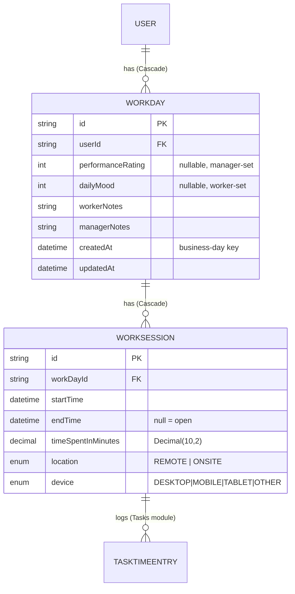
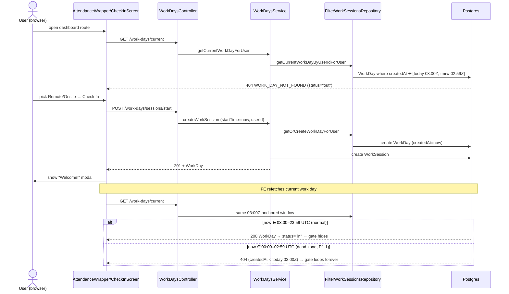
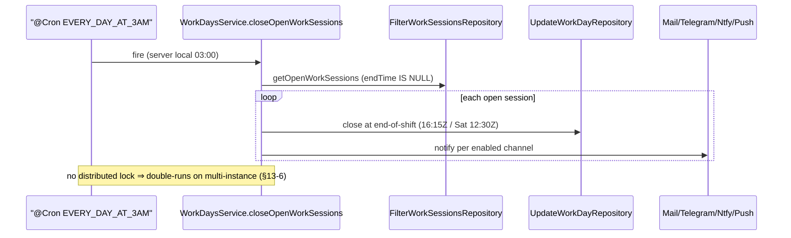

# Dossier 09 — Time & Attendance (Work Days / Work Sessions)

## 1. Identity
- **One-line purpose:** Employee attendance tracking — a daily check-in / check-out gate that records
  work sessions (start/end, remote-vs-onsite, device), computes worked time, nudges late/forgotten
  sessions across channels, and exposes per-user & per-manager attendance statistics.
- **Backend source root(s):**
  - `tdg-management-api-backend/src/work-days/**` (controller, service, 3 repositories, DTOs, module)
  - `tdg-management-api-backend/src/common/time/**` (shared `TimeService` — all UTC/business-day math)
- **Frontend source root(s):**
  - `tawer-management-frontend/src/modules/tracking/**` (check-in gate, check-out button, journey-notes
    popup, worked-days calendar, activity list, viewer-mode store)
  - Mounted at `src/app/[locale]/dashboard/(auth)/layout.tsx:44` (gate) and
    `src/components/layout/header/index.tsx:29` (check-out button)
- **Owned DB tables/models:** `WorkDay`, `WorkSession` (+ enums `WorkSessionLocation`,
  `WorkSessionDevice`). Defined in `prisma/schema/work-sessions.schema.prisma:1-38`.
  Note: the plan mentioned a `DeviceType` enum — **not verified**; the only device enum is
  `WorkSessionDevice` (`work-sessions.schema.prisma:33`). The frontend calls its equivalent type
  `UsedDevice` (`modules/tracking/types/index.ts:1`).

---

## 2. Purpose & business problem
The module enforces a **daily attendance ritual**: on entering any authenticated dashboard route the
user is blocked by a full-screen gate until they either "Check In" (choosing Remote/Onsite) or "Join as
viewer" (`modules/tracking/components/attendance/wrapper.tsx:6-14`,
`.../attendance/check-in.tsx:41-47`). Checking in opens a `WorkSession`; checking out closes the latest
open session and optionally captures a mood + journey note
(`.../attendance/check-out.tsx:30-33`, `hook/use-journey-notes-upload.ts:40-46`).

Beyond attendance it serves two workflows:
- **Compliance nudging** — late starts and un-closed sessions trigger email / Telegram / ntfy / in-app
  reminders (`work-days.service.ts:86-127`, `:432-478`).
- **Reporting** — workers see their own worked-hours calendar & mood stats; managers see the same for
  the users/teams they manage (`work-days.controller.ts:263-507`).

A "business day" is anchored at **03:00 UTC** (not local midnight): `WorkDay` rows are keyed to that
window (`common/time/service/time.service.ts:38-56`). The whole time model is hard-coded in UTC — there
is no per-user timezone. This is the root of the check-in dead-zone bug (see §7 / §13).

---

## 3. Domain model & database
Source: `prisma/schema/work-sessions.schema.prisma:1-38`.

```
WorkDay (work-sessions.schema.prisma:1-12)
  id                String   @id @default(uuid())
  userId            String                              -- FK → User, onDelete: Cascade (:10)
  performanceRating Int?                                -- set by manager
  dailyMood         Int?                                -- set by worker
  workerNotes       String?
  managerNotes      String?
  createdAt         DateTime @default(now()) @db.Timestamp(6)   -- the de-facto "work day date"
  updatedAt         DateTime @updatedAt
  workSessions      WorkSession[]                       -- 1-N

WorkSession (work-sessions.schema.prisma:14-26)
  id                 String   @id @default(uuid())
  startTime          DateTime @db.Timestamp(6)          -- server UTC at check-in
  endTime            DateTime?                          -- null ⇒ "session open"
  timeSpentInMinutes Decimal  @default(0) @db.Decimal(10,2)     -- minutes, 2-dp
  workDayId          String                             -- FK → WorkDay, onDelete: Cascade (:25)
  location           WorkSessionLocation                -- REMOTE | ONSITE
  device             WorkSessionDevice                  -- DESKTOP | MOBILE | TABLET | OTHER
  taskTimeEntries    TaskTimeEntry[]                    -- 1-N (Tasks module reuses sessions)
```

**Design decisions & rationale (verified):**
- **Two-level split (`WorkDay` 1-N `WorkSession`).** One `WorkDay` per user per business day aggregates
  the day-level attributes (mood, performance, notes) while allowing multiple sessions (morning +
  afternoon, or repeated check-in/out). The "one open session at a time" invariant is enforced in code,
  not the schema (`work-days.service.ts:52-56`) — there is **no partial unique index** on
  `(workDayId, endTime IS NULL)`, so a race could open two.
- **No unique constraint on `(userId, createdAt-day)`.** Uniqueness of "one WorkDay per day" is enforced
  only by the `getOrCreate` read-then-write in `getOrCreateWorkDayForUser` (`:390-398`) — not
  transactional, so concurrent check-ins can create duplicate WorkDays for the same day. **Not verified**
  under real concurrency, but structurally unguarded.
- **`createdAt` doubles as the business-day key.** There is no dedicated `date` column; every query that
  means "today" filters `WorkDay.createdAt` against the 03:00-UTC window
  (`filter-work-day.repository.ts:273-281`) and the stats SQL groups by `DATE(WorkDay.createdAt)`
  (`:431`). Overloading an audit timestamp as a business key is what makes the timezone boundary bug
  (§13-1) possible.
- **`timeSpentInMinutes` is `Decimal(10,2)`** — computed once at close time
  (`update-work-day.repository.ts:69-83`), never re-derived from start/end, so an edited row could drift
  from `endTime − startTime`.
- **Cascade deletes** on both FKs: deleting a `User` removes all their WorkDays; deleting a WorkDay
  removes its sessions (`:10`, `:25`).
- **`WorkSession` ↔ `TaskTimeEntry`** (`:24`): the Tasks module attaches task-level time entries to a
  work session — a cross-module coupling documented in Dossier 07 (see §10).

Enums (`work-sessions.schema.prisma:28-38`): `WorkSessionLocation { REMOTE, ONSITE }`,
`WorkSessionDevice { DESKTOP, MOBILE, TABLET, OTHER }`.

---

## 4. Backend architecture
Standard 4-layer NestJS pattern (controller → service → repository → dto), consistent with Dossier 01.
Module: `work-days/work-sessions.module.ts` — **note the file/class mismatch**: the file is
`work-sessions.module.ts` but the exported class is `WorkDaysModule` (`:36`), imported into
`app.module.ts:17,56`. Providers: `WorkDaysService` + `CreateWorkDayRepository`,
`UpdateWorkDayRepository`, `FilterWorkSessionsRepository` (`work-sessions.module.ts:19-24`). It imports
`Auths`, `Prisma`, `Ntfy`, `Tokens`, `Users`, `Telegram`, `Notifications`, `Mail` modules (`:25-34`) —
the four notification channels are injected directly into the service (heavy fan-out, see §10).

**Controller** (`work-days.controller.ts`) — 9 routes, all `@UseGuards(HasPermissionGuard)` +
`@Permissions([...])`, all wrapped in `ClassSerializerInterceptor` + `SerializeOptions` to shape output
via the response DTOs. No request `ValidationPipe` whitelist is configured (consistent with the
global-config gap noted in Dossiers 01/03).

**Service** (`work-days.service.ts`, 499 lines) — holds all business logic:
- `createWorkSession` (`:42-130`): stamps `startTime`/`userId` server-side (`:43-44`), get-or-creates the
  WorkDay, rejects if an open session exists (`:52-56`), creates the session, then runs the **late-start
  notification** block (`:86-127`) across mail/telegram/ntfy/push. Returns the WorkDay (not re-fetched —
  the new session is `push`-ed into the in-memory object at `:83`).
- `getCurrentWorkDayForUser` (`:132-144`): the check-in gate's data source; throws
  `WORK_DAY_NOT_FOUND` (404) when the window query returns nothing.
- `updateWorkDayByManager` (`:146-177`): **broken** — see §13-2.
- `updateWorkSessionByWorker` (`:179-201`): saves mood/notes; **ownership not enforced** — see §13-3.
- `closeWorkSession` (`:203-232`): finds the latest open session *scoped to the caller*
  (`getLastWorkSessionForWorkerByWorkerDayId(workDayId, userId)` — `filter-work-day.repository.ts:12-26`),
  computes `timeSpentInMinutes`, closes it. Ownership **is** enforced here (good).
- Statistics reads (`:290-388`): overview (aggregates) and details (raw-SQL calendar). Manager variants
  gate on `canUserManageUsers` / `canUserManageTeams` (`permissions.service`) — but the *details*
  manager variant then ignores the requested users (§13-4).
- `getOrCreateWorkDayForUser` (`:390-398`): non-transactional read-or-create.
- `retrievePaginationParameters` (`:401-415`): clamps `limit` to **500** and `page`/`limit` NaN→
  1/500 — note `limit > 500` is capped but there is no lower clamp, and a `limit` of e.g. `-5` passes
  through as `-5` (only NaN and `>500` are handled).
- `@Cron(EVERY_DAY_AT_3AM) closeOpenWorkSessions` (`:417-480`): auto-closes dangling sessions and
  notifies — see §13-6.

**Repositories** — thin Prisma wrappers:
- `CreateWorkDayRepository` (`create-work-day.repository.ts`): `createWorkDay` (WorkDay with only
  `userId`), `createWorkSessionForWorkDay`.
- `UpdateWorkDayRepository` (`update-work-day.repository.ts`): `updateWorkDayByWorker` (mood/notes,
  where `{id, userId}`), `updateWorkDayByManager` (perf/managerNotes, where `{id}` only),
  `closeWorkSessionByWorkDayId` (sets endTime + minutes).
- `FilterWorkSessionsRepository` (`filter-work-day.repository.ts`, 487 lines): all reads — current-day
  lookup, paginated user/manager lists, aggregates, the raw-SQL details query, and `getOpenWorkSessions`
  for the cron.

**Error handling:** Prisma `P2025` (record-not-found) is caught and re-thrown as domain
`WorkSessionNotFound`/`WorkDayNotFound` custom exceptions with `ErrorCode`s
(`:165-176`, `:189-199`, `:220-231`; codes in `swagger-documentation/error-response.ts`). Consistent
with the global `AllExceptionsFilter` (Dossier 01).

---

## 5. API surface
Base path `/work-days` (`work-days.controller.ts:56`). All routes require a Bearer JWT + the listed
permission via `HasPermissionGuard`. Permission string map: `common/constants/permissions.ts:85-101`.

| Method | Path | Auth / Permission | Request DTO | Response DTO | Validation | Business logic (1 line) | Side effects |
|---|---|---|---|---|---|---|---|
| POST | `/work-days/sessions/start` | `work.session.create` (`ctrl:60-61`) | `CreateWorkDayDto` (`device`,`location`; `userId`/`startTime` server-set) | `CreatedWorkDayDto` | `@IsEnum` device+location | Get-or-create today's WorkDay, open a session, reject if one open | mail/telegram/ntfy/push if late (`svc:86-127`) |
| GET | `/work-days/current` | `workday.current.read.own` (`ctrl:88`) | — | `WorkDayForUserDto` | — | Return today's WorkDay+sessions or 404 | none |
| PATCH | `/work-days/:id/manager` | `workday.update.by.manager` (`ctrl:110`) | `UpdateWorkDayByManagerDto` (`performanceRating`,`managerNotes`) | `UpdatedWorkDayByManagerDto` | `@Min0 @Max5 @IsNumber`,`@IsString` | Manager sets rating/notes — **broken, always 404 (§13-2)** | none |
| PATCH | `/work-days/:id/worker` | `workday.update.by.worker` (`ctrl:140`) | `UpdateWorkDayByWorkerDto` (`dailyMood`,`workerNotes`) | `UpdatedWorkDayByWorkerDto` | `@Min0 @Max5`,`@IsString` | Worker sets mood/notes on a WorkDay — **no owner scoping (§13-3)** | none |
| PATCH | `/work-days/sessions/:id/close` | `work.session.close` (`ctrl:175`) | — (empty body) | 204 No Content | — | Close caller's latest open session on that WorkDay | none |
| GET | `/work-days/manager` | `workday.read.own` (`ctrl:192`) ⚠ | `FilterWrokDaysParametersDto` | `PaginateWorkDaysForManagerDto` | ISO8601 / UUID / enum / 0-5 | Paginated list — **no management scoping (§13-5)** | none |
| GET | `/work-days/statistics/overview/manager` | `workday.statistics.overview.read.by.manager` (`ctrl:264-266`) | `FilterWorkDaysStatisticsParametersDto` | `WorkDaysStatisticsOverviewForManagerDto` | ISO8601 / UUID | Aggregates over managed users/teams | none — gated by `canUserManage*` (`svc:294-307`) |
| GET | `/work-days/statistics/details/manager` | `workday.statistics.details.read.by.manager` (`ctrl:332-334`) | `FilterWorkDaysStatisticsParametersDto` | `WorkDaysStatisticsDetailsForManagerDto[]` | ISO8601 / UUID | Per-day remote/office hours — **returns caller's own (§13-4)** | none |
| GET | `/work-days/statistics/overview` | `workday.statistics.overview.read.own` (`ctrl:401`) | `FilterWorkDaysStatisticsParametersDto` | `WorkDaysStatisticsOverviewForUserDto` | ISO8601 | Own aggregates (forces `usersIds=[self]`) | none |
| GET | `/work-days/statistics/details` | `workday.statistics.details.read.own` (`ctrl:455`) | `FilterWorkDaysStatisticsParametersDto` | `WorkDaysStatisticsDetailsForUserDto[]` | ISO8601 | Own per-day hours (forces `usersIds=[self]`) | none |
| GET | `/work-days` | `workday.read.own` (`ctrl:510`) | `FilterWrokDaysParametersDto` | `PaginateWorkDaysForUserDto` | ISO8601 / enum / 0-5 | Own paginated WorkDay list (scoped to `userId`) | none |

Notes:
- `CreateWorkDayDto` (`dto/request/post/create-work-day.dto.ts`) declares an unused optional `workDayId`
  (`:12-14`) and `@ApiHideProperty` `userId`/`startTime` that the service overwrites (`svc:43-44`).
- `WorkSessionDto` returns `timeSpentInMinutes` as a **string** (Decimal→`toFixed(2)`,
  `dto/response/fetch/work-session.dto.ts:24-32`); the FE re-parses with `Number(...)`
  (`dto/responses/activity-tracking.ts:14`).
- `FilterWorkDaysStatisticsParametersDto` defaults `from = now − 1 year`, `to = now`
  (`filter-work-days-statistics-parameters.dto.ts:38,46`).
- **DTO/query field mismatch:** the FE stats calls send `startTime`/`endTime`
  (`services/worked-days-tracking.ts:23-24`) but the details endpoints read `from`/`to`
  (`svc:361-362`), so FE date filtering there is silently ignored and the 1-year default applies.

---

## 6. Frontend
Module `src/modules/tracking`. Data layer uses TanStack Query + a small Zustand store.

**Check-in gate flow:**
- `AttendanceWrapper` (`components/attendance/wrapper.tsx`) wraps all `(auth)` dashboard content; while
  the current-work-day query loads it shows `<Loading/>`, otherwise renders `<CheckInScreen/>` over the
  children (`:9-14`).
- `CheckInScreen` (`components/attendance/check-in.tsx`) — full-screen modal; `isCheckedIn =
  workSession.status === "in"` (`:32`); returns `null` when checked-in or in viewer mode (`:41-43`).
  User picks Remote/Onsite (`:98-136`), clicks Check In → `useAttendance().checkIn(location)` (`:34-39`),
  then shows `DailyWelcomPopUP` (`welcome.tsx`).
- `CheckOutButton` (`components/attendance/check-out.tsx`) lives in the header; on click it triggers the
  journey-notes popup (mood + note), and on finish/skip calls `checkOut()`
  (`:25-33`, `hook/use-journey-notes-upload.ts`).

**Hooks:**
- `useCurrentWorkDay` (`hook/use-current-work-day.ts`) — `useQuery({ queryKey: ["work-sessions",
  "work-day"], queryFn: retreiveCurrentWorkDayFromServerSide })`; treats `data === null` as error.
- `useWorkSession` (`hook/work-sessions/use-work-session.ts`) — derives `{id,status,moodIsSubmitted}`
  from the work day: `status = "in"` when the latest session's `endTime === undefined` (`:23`);
  `moodIsSubmitted = data.dailyMood !== undefined` (`:24`).
- `useAttendance` (`hook/work-sessions/use-attendance.ts`) — orchestrates check-in/out, invalidates
  `["work-sessions"]` + `["notifications"]` query keys (`:39-46`), and on a **400** during check-in it
  interprets it as "already open" and auto-issues a check-out (`:65-66`). Viewer mode is a purely
  client-side bypass via `useViewerModeStore` (`store/viewer-mode-store.ts`) — no server call.
- `useUserActivity` (`hook/use-user-activity.ts`) — paginated activity list; `isManager = !isMyProfile`
  routes to the manager vs own endpoint.
- `useWorkedDaysTracking` / calendar under `components/work-tracking-calendar.tsx/` render the per-day
  remote/office hours from `statistics/details`.

**Services (`services/`):** all use `extractJWTokens()` for the Bearer header and a `refreshToken(...)`
retry-once-on-401 wrapper:
- `work-sessions/creation.ts` — `POST /work-days/sessions/start`; stores returned WorkDay id under
  `localStorage["workerSessionId"]` (`:27`).
- `work-sessions/closure.ts` — `PATCH /work-days/sessions/:id/close`.
- `current-work-day-extraction.ts` — `GET /work-days/current`; **swallows every error to `null`**
  (`:15-17`), which is how the "not checked in" 404 becomes the gate's empty state (see §13-7).
- `journey-notes-upload.ts` — `PATCH /work-days/:workDayId/worker` with `{dailyMood, workerNotes}`.
- `worked-days-tracking.ts` / `user-activity-tracking.ts` — stats reads.

**DTO mapping** (`dto/responses/activity-tracking.ts`) maps backend `workSessions` →
`sessions`, converting `startTime`/`endTime` strings to `Date` (null → `undefined`, `:11-16`) and
`timeSpentInMinutes` via `Number(...)`. `dailyMood: activity.dailyMood ? Number(...) : undefined`
(`:18`) — a mood of **0 is coerced to `undefined`** (falsy), a latent bug shared with
`useWorkSession`'s `moodIsSubmitted` check.

There is no dedicated Zustand store beyond `viewer-mode-store.ts`; work-session state is derived
per-render from the query cache (`use-work-session.ts`).

---

## 7. Data flow & key scenarios

### Scenario A — Check-in (happy path)
1. User lands on a dashboard route → `AttendanceWrapper` renders `CheckInScreen` because
   `GET /work-days/current` returned 404 → cache `null` → `status="out"`.
2. User picks "Remote", clicks Check In → `useAttendance.checkIn("remote")` →
   `createWorkSessionOnServerSide({workMode:"REMOTE", device:getDeviceType()})`
   (`use-attendance.ts:36-37`, `utils/devices.ts:25-37`).
3. `POST /work-days/sessions/start` → `WorkDaysService.createWorkSession`:
   stamp `startTime=now`, `userId=req.user.id` → `getOrCreateWorkDayForUser` (finds today's WorkDay in
   the 03:00-UTC window, else creates one) → guard "no open session" → `createWorkSessionForWorkDay`
   → late-start notification check → return WorkDay (201).
4. FE invalidates `["work-sessions"]`; `useCurrentWorkDay` refetches `GET /work-days/current` →
   `getCurrentWorkDayByUserIdForUser` finds the WorkDay → `status="in"` → gate returns `null`,
   `DailyWelcomPopUP` shows.

### Scenario A′ — Check-in in the 00:00–02:59 UTC dead zone (the P1-1 bug, verified)
Same as A through step 3 (`POST` returns 201, Welcome shows), **but** step 4 fails: the WorkDay's
`createdAt` (~00:40 UTC) falls *before* `getStartOfBusinessDayUTC()` = today 03:00 UTC, so
`getCurrentWorkDayByUserIdForUser` — which filters `createdAt ∈ [today 03:00, tomorrow 02:59]` — never
finds it. `GET /work-days/current` keeps returning 404, the gate re-appears on every reload, and
check-out can't locate the session. Root cause & fix in §13-1.

### Scenario B — Check-out
1. Header `CheckOutButton` → journey-notes popup collects optional mood + note.
2. On submit: `PATCH /work-days/:workDayId/worker` (saves mood/notes via `updateWorkSessionByWorker`),
   then `onFinished → checkOut()` → `PATCH /work-days/sessions/:workDayId/close`.
3. `closeWorkSession` loads the caller's latest open session on that WorkDay, sets
   `endTime=now`, `timeSpentInMinutes = now − startTime` (`svc:203-219`,
   `update-work-day.repository.ts:69-83`). 204 returned.
4. FE invalidates `["work-sessions"]` → status flips to `"out"` → gate returns.

### Scenario C — Nightly auto-close (cron)
`@Cron(EVERY_DAY_AT_3AM)` → `getOpenWorkSessions()` (all sessions with `endTime IS NULL`) → for each,
close it at `getEndTimeOfShiftFromStartTime(startTime)` (16:15 UTC, or 12:30 on Saturday) so the worker
isn't penalised for after-hours, compute minutes, and notify across enabled channels (`svc:417-480`).

---

## 8. Diagrams (Mermaid)

### 8.1 ERD slice


### 8.2 Check-in sequence (with the dead-zone failure branch)


### 8.3 Nightly auto-close cron


---

## 9. Security
- **Authentication:** every route is behind `HasPermissionGuard` (JWT + permission), consistent with
  Dossier 03. `userId` for writes is taken from `req.user.id` server-side, never trusted from the body
  (`svc:44`, `:135`, `:208`) — good for check-in/close.
- **Authorization model:** fine-grained permission strings (`permissions.ts:85-101`) distinguish
  `*.own` vs `*.by.manager`. Manager statistics endpoints additionally call
  `canUserManageUsers`/`canUserManageTeams` before querying (`svc:294-307`, `:370-383`) — correct
  defence-in-depth.
- **Injection:** all reads/writes use Prisma parameterized queries **except**
  `filterWorkDaysStatisticsDetailsBetweenDates` (`filter-work-day.repository.ts:411-444`), which builds
  SQL by **string interpolation** of `query.from`, `query.to` and each `usersIds` element into
  `$queryRawUnsafe`. Mitigation is *only* the DTO decorators (`@IsISO8601`, `@IsUUID('4')`) — there is
  **no `ValidationPipe` whitelist** app-wide (Dossiers 01/03), so the safety rests entirely on those
  decorators being enforced and on the values never reaching the query un-validated. Not currently
  exploitable given the validators, but it is an unparameterized raw query and a standing risk.
- **Access-control gaps (verified, detailed in §13):**
  - `GET /work-days/manager` performs **no** ownership/management check and is gated by the *own*
    permission `workday.read.own`, yet its repository returns **all users' work days** when `usersIds`
    is omitted (§13-5) — an information-disclosure gap.
  - `PATCH /work-days/:id/worker` does **not** scope the update to the caller (`userId` undefined in the
    `where`), letting any holder of `workday.update.by.worker` overwrite **any** WorkDay's mood/notes by
    id (§13-3).
  - `PATCH /work-days/:id/manager` is effectively dead (always 404) and its permission check runs
    against a WorkDay looked up by the *caller's user id* rather than the target (§13-2).
- **Rate limiting / abuse:** none specific to this module (inherits the app-wide "no throttling"
  finding from Dossier 03).

---

## 10. Cross-module dependencies
**Imports / depends on:**
- `TimeService` (`common/time`) — all UTC/business-day math (critical dependency; its 03:00-UTC anchor
  drives the P1-1 bug).
- `PermissionsService` (`auths`) — `canUserManageUsers` / `canUserManageTeams` for manager stats.
- `UsersService` — `getUserWithNotificationsSettingsById` to fetch channels for the late-start email.
- `NotificationsService`, `MailService`, `TelegramService`, `NtfyService` (`common/*`) — four delivery
  channels fanned out from `createWorkSession` and the cron (`svc:93-126`, `:432-478`). This is the
  heaviest coupling in the module; the same ~4-branch notification block is **duplicated** verbatim
  between the late-start path and the cron close path.
- `AuthsModule` / `TokensModule` — guard + JWT plumbing.

**Depended on by:**
- **Tasks module** — `WorkSession.taskTimeEntries` (`work-sessions.schema.prisma:24`): task time entries
  reference a work session (see Dossier 07). This module does not read `TaskTimeEntry`, so the coupling
  is one-directional at the schema level.
- **User** — cascade owner (`work-sessions.schema.prisma:10`).

Cohesion is reasonable (all attendance logic in one service) but the notification fan-out bloats
`createWorkSession`/`closeOpenWorkSessions` and duplicates channel logic that arguably belongs behind a
single `NotificationsService.notifyAllChannels(...)` façade.

---

## 11. Tests
- `work-days/services/work-days.service.spec.ts` — **skeleton only**: instantiates the service with an
  empty provider array and asserts `toBeDefined()` (`:7-17`). It does not (and could not, with no mocked
  dependencies) exercise any behaviour; it would fail DI resolution if it actually constructed the real
  service — it "passes" only because Nest's test module compiles the bare provider.
- `work-days/controllers/work-days.controller.spec.ts` — identical skeleton (`:4-17`).
- **No coverage** of: the business-day window logic, the get-or-create race, check-in/out, the cron,
  statistics math, or any of the §13 bugs. No e2e tests found for this module.
- `common/time/service/time.service.spec.ts` exists (not read in full) — **Partial**: worth verifying
  whether it covers `getStartOfBusinessDayUTC`/`getEndOfBusinessDayUTC` (the bug surface). Listed under
  Not-Verified.

**Gap:** the single highest-value missing test is a unit test pinning the business-day window across the
00:00–02:59 UTC boundary; it would have caught P1-1.

---

## 12. Code quality
- **Consistent layering & DI** (controller/service/repo) — easy to read; matches the codebase
  convention (Dossier 01). *(good — `work-days.controller.ts`, `work-days.service.ts`)*
- **Server-side stamping of `userId`/`startTime`** avoids body-tampering for check-in/close.
  *(good — `svc:43-44`, `:208`)*
- **Duplicated notification fan-out** — the ~35-line 4-channel block appears twice
  (`svc:93-126` and `:432-478`) with only wording differences; a change to one channel must be mirrored.
  *(smell — DRY violation)*
- **Overloaded `createdAt` as business key** — conflates an audit timestamp with domain state; source of
  the timezone bug. *(design smell — `filter-work-day.repository.ts:277`, stats SQL `:431`)*
- **Copy-paste divergence between "for user" and "for manager" statistics** — the manager *details*
  method was cloned from the user version and left with the user-scoping override (§13-4). *(smell —
  `svc:357-388`)*
- **Naming defects:** file `work-sessions.module.ts` exports `WorkDaysModule`; DTO class
  `FilterWrokDaysParametersDto` ("Wrok" typo); the pervasive `retreive` misspelling continues on the FE
  (`retreiveCurrentWorkDayFromServerSide`, `retreiveWorkedDays`) — matches Dossier's P2-5. *(cosmetic)*
- **Weak error semantics on FE** — `current-work-day-extraction.ts:15-17` collapses *all* errors
  (500/network/404) to `null`, indistinguishable from "not checked in". *(smell — masks real failures)*
- **`limit` clamp is one-sided** — `retrievePaginationParameters` caps `>500` but not negative/zero
  values (`svc:409-412`). *(minor)*

---

## 13. Verified technical debt

**13-1. Check-in dead zone 00:00–02:59 UTC (P1-1, CONFIRMED by reading the code).**
`getStartOfBusinessDayUTC()` = today 00:00 UTC + 3h = **today 03:00 UTC**;
`getEndOfBusinessDayUTC()` = tomorrow 02:59:59.999 UTC (`time.service.ts:38-56`).
`getCurrentWorkDayByUserIdForUser` filters `WorkDay.createdAt ∈ [that window]`
(`filter-work-day.repository.ts:273-281`) and `getOrCreateWorkDayForUser` uses the same read
(`work-days.service.ts:390-398`). When `now < 03:00 UTC`, the current instant belongs to the *previous*
business day (which started at 03:00 **yesterday**), but the window is anchored to *today's* 03:00 —
still in the future. So a WorkDay created at ~00:40 has `createdAt` **before** the window that both
`getOrCreate` and `getCurrentWorkDayForUser` search → the POST creates a row, the subsequent
`GET /work-days/current` 404s, and the gate loops. **Fix:** when `now < 03:00 UTC`, shift the window to
`[yesterday 03:00, today 02:59:59]` (subtract a day from both bounds), or better, key WorkDays by an
explicit `businessDate` column instead of `createdAt`.

**13-2. `PATCH /work-days/:id/manager` is dead — always 404 (CONFIRMED).**
`updateWorkDayByManager` calls `getWorkDayById(req?.user?.id as string)`
(`work-days.service.ts:151-153`) — it passes the **caller's user id** where the repository expects a
**WorkDay id** (`getWorkDayById(workDayId)` → `findUniqueOrThrow({where:{id: workDayId}})`,
`filter-work-day.repository.ts:321-323`). A WorkDay's uuid id can never equal a user id, so
`findUniqueOrThrow` throws `P2025`, caught and re-thrown as `WORK_SESSION_NOT_FOUND` (404). The manager
can never set `performanceRating`/`managerNotes`. Compounding it, the permission check
`canUserManageUsers(caller, [workDay?.user?.id])` (`:155-158`) runs on the wrong (never-found) record.
**Fix:** pass `workDayId` to `getWorkDayById`.

**13-3. `PATCH /work-days/:id/worker` has no owner scoping (CONFIRMED — access control).**
`updateWorkSessionByWorker` (`work-days.service.ts:179-201`) forwards the DTO to
`updateWorkDayByWorker(workDayId, {...data, endTime:undefined, timeSpentInMinutes:undefined})` but never
sets `data.userId` from `req.user.id`. The repository's `where: { id: workDayId, userId: data.userId }`
(`update-work-day.repository.ts:12-15`) therefore becomes `where: { id, userId: undefined }`, and Prisma
**ignores `undefined`** — so the update is scoped by id only. Any user holding
`workday.update.by.worker` can overwrite **another user's** WorkDay mood/notes by supplying its id (the
FE reaches this endpoint via `journey-notes-upload.ts:24`). **Fix:** set `data.userId = req.user.id`
before the update (mirrors the `deleteUserByAdmin` ownership class in Dossier 04).

**13-4. `GET /work-days/statistics/details/manager` ignores the requested users (CONFIRMED).**
`filterWorkDaysStatisticsDetailsBetweenDatesForManager` correctly authorizes `query.usersIds`/`teamIds`
via `canUserManage*` (`work-days.service.ts:370-383`), then calls the repository with
`{ ...query, usersIds: [req.user?.id], teamIds: undefined }` (`:385-387`) — overriding the requested
users with the **caller's own id**. A manager always gets *their own* per-day hours, never the
subordinate's, despite passing the permission check. Clearly cloned from the "for user" method (`:357-364`
uses the same override intentionally). **Fix:** pass `query` through unchanged (as the *overview*-manager
variant does at `:309-316`).

**13-5. `GET /work-days/manager` leaks all users' work days (CONFIRMED — access control).**
The controller gates this route with the **own** permission `workday.read.own`
(`work-days.controller.ts:191-192`), and the service `filterWorkDaysForManager`
(`work-days.service.ts:263-288`) performs **no** management check. The repository
`filterWorkDaysForManager` only applies `userId: { in: query.usersIds }` **when `usersIds` is provided**
(`filter-work-day.repository.ts:33-37`); omit it and the query returns every WorkDay in the system —
including other users' names/emails/notes (`select` at `:83-101`). `countFilteredWorkDaysForManager`
(`:177-224`) has the same unscoped shape. **Fix:** require a manager permission and filter to
`canUserManageUsers`-resolved ids.

**13-6. Nightly cron has no distributed lock (CONFIRMED).**
`closeOpenWorkSessions` (`work-days.service.ts:417-480`) is a plain `@Cron` with no use of the Postgres
`Locking` mechanism that Dossier 01 documents for safe cron execution. On a multi-instance deployment
every instance runs it, double-closing sessions and sending duplicate emails/telegram/ntfy/push. Also,
end-time is fixed to 16:15 UTC (Sat 12:30) via `getEndTimeOfShiftFromStartTime`
(`time.service.ts:11-25`) — a session that legitimately started in the afternoon and is still open at
3AM would be back-dated to 16:15 of its **start** day, which can yield a *smaller* `timeSpentInMinutes`
than reality (acknowledged in the code comment at `:428` as intentional "don't penalise after-hours").

**13-7. FE swallows every `/work-days/current` error to `null` (CONFIRMED).**
`current-work-day-extraction.ts:15-17` returns `null` on any exception, so a 500 or network failure is
indistinguishable from the normal "not checked in" 404 — the gate simply shows. This is the tracking
counterpart to the P2-1 "list services swallow errors" finding and also why the 404s show as red entries
in the network tab (referenced in the diagnostic report's "Already tracked" list).

**13-8. Late-start threshold vs. message mismatch (CONFIRMED — data/UX).**
The enforced afternoon-late threshold is **12:30 UTC** (`isAfterAfternoonMaxLateTime`,
`time.service.ts:86-98`), but the email/telegram/ntfy copy tells the user the limit is **"13:30 in the
afternoon"** (`work-days.service.ts:99`, `:110`, `:119`). Consistent only if the audience reads local
time = UTC+1; the code hard-codes UTC while the message states local — a symptom of the module's
no-timezone design. Morning (08:45) matches between code and copy, deepening the inconsistency.

**13-9. Mood value `0` lost on the FE (CONFIRMED — minor).**
`dailyMood: activity.dailyMood ? Number(...) : undefined` (`dto/responses/activity-tracking.ts:18`) and
`moodIsSubmitted = data.dailyMood !== undefined` (`use-work-session.ts:24`) both treat a mood of `0` as
"not submitted" because `0` is falsy — a worker who rated their day `0` is re-prompted.

**13-10. Non-transactional get-or-create + no open-session uniqueness (CONFIRMED — latent race).**
`getOrCreateWorkDayForUser` (`svc:390-398`) reads then creates without a transaction/upsert, and the
"one open session" rule is a code check (`svc:52-56`) with no supporting DB constraint. Two rapid
check-ins could create duplicate WorkDays or two open sessions. Not reproduced live; structurally
possible.

---

## 14. Strengths / Weaknesses / Improvements

**Strengths**
- Clean, conventional 4-layer structure — trivially navigable for a new engineer. *(low cognitive load)*
- Write paths take identity from the JWT, not the body, for check-in/close. *(prevents impersonation on
  the core flow — `svc:43-44`, `:208`)*
- Fine-grained `own` vs `by.manager` permission split, with an extra `canUserManage*` check on manager
  statistics. *(defence-in-depth where it's correctly wired — `svc:294-307`)*
- Thoughtful compliance UX: late-start nudges, forgotten-session auto-close, multi-channel delivery,
  end-of-shift back-dating so users aren't penalised for after-hours. *(real product value)*

**Weaknesses**
- **Timezone-blind time model** anchored on `createdAt` at a hard-coded 03:00-UTC boundary → the
  check-in dead zone (§13-1) and the threshold/message mismatch (§13-8). *Impact: a daily ~3h window
  where the core feature is unusable.*
- **Three distinct access-control/logic defects** on the write/manager surface (§13-2/-3/-4/-5): one dead
  endpoint, one unscoped write, one wrong-data read, one over-broad read. *Impact: broken manager
  workflow + information disclosure + a privilege-adjacent write.*
- **No meaningful tests** (skeletons only) despite date-boundary logic that is easy to get wrong. *Impact:
  regressions ship silently — P1-1 did.*
- **Duplicated notification fan-out** and copy-pasted user/manager stats methods. *Impact: change
  amplification and the exact divergence in §13-4.*
- **Cron unguarded by the distributed lock** the rest of the system uses. *Impact: duplicate side effects
  at scale.*

**Improvements (concrete)**
1. Introduce an explicit `WorkDay.businessDate DATE` column set at creation from the business-day rule,
   add `@@unique([userId, businessDate])`, and key all "today"/grouping queries on it. Fixes §13-1 and
   §13-10 together and removes the `createdAt` overload.
2. Pass `workDayId` (not `req.user.id`) in `updateWorkDayByManager` (§13-2); set
   `data.userId = req.user.id` in `updateWorkSessionByWorker` (§13-3); drop the `usersIds` override in
   the manager details method (§13-4); require a manager permission + `canUserManageUsers` scoping on
   `GET /work-days/manager` (§13-5). All are ≤2-line fixes.
3. Extract the 4-channel notification block into a single reusable helper and call it from both the
   late-start and cron paths.
4. Wrap `closeOpenWorkSessions` in the Postgres `Locking` guard (Dossier 01 pattern).
5. Add unit tests for `TimeService` business-day boundaries (esp. 00:00–02:59 UTC) and for the
   ownership scoping of the worker/manager patch endpoints.
6. On the FE, let `retreiveCurrentWorkDayFromServerSide` distinguish 404 (empty) from other errors, and
   use `!= null`/explicit `!== undefined` checks for `dailyMood` to stop dropping `0` (§13-7, §13-9).

---

## 15. Verification Checklist
| Area | Verified? | Evidence / reason |
|---|---|---|
| Domain model (WorkDay/WorkSession, enums, FKs, cascades) | Yes | `prisma/schema/work-sessions.schema.prisma:1-38` read in full |
| Backend service logic (all methods) | Yes | `work-days.service.ts:1-499` read in full |
| Repositories (create/update/filter) | Yes | all three repos read in full |
| Every endpoint (9 routes) | Yes | `work-days.controller.ts:56-574` + permission map `permissions.ts:85-101` |
| Business-day / timezone math (P1-1) | Yes | `time.service.ts:38-56` + `filter-work-day.repository.ts:273-281` traced against `svc:390-398,132-144` |
| §13-2 manager-update dead endpoint | Yes | `svc:151-164` vs `filter-work-day.repository.ts:321-323` |
| §13-3 worker-update ownership gap | Yes | `svc:179-201` + `update-work-day.repository.ts:10-37` (userId undefined) |
| §13-4 manager-details self-override | Yes | `svc:366-388` vs `:290-330` |
| §13-5 manager-list unscoped read | Yes | `ctrl:191-192` + `svc:263-288` + `repo:28-107` |
| §13-6 cron no lock | Yes (absence) | `svc:417-480` — no `Locking`/lock import in the module |
| Frontend gate/hooks/services | Yes | `wrapper/check-in/check-out`, `use-attendance`, `use-work-session`, `use-current-work-day`, all `services/*` read |
| SQL-injection surface (raw query) | Partial | `repo:411-444` is `$queryRawUnsafe` w/ interpolation; mitigated by DTO validators, not parameterized — not fuzzed live |
| Tests | Yes (as gap) | both spec files are `toBeDefined()` skeletons |
| Live DB / real-usage reproduction | No | read-only session; P1-1 relied on the earlier live audit + code trace (not re-run here) |
| `TimeService` spec coverage | No | `time.service.spec.ts` not read in full |

## 16. Not verified / Open questions
- **`DeviceType` enum** named in the session plan does not exist in the schema; only `WorkSessionDevice`
  was found. If a `DeviceType` exists elsewhere it was not located — confirm the plan's intent.
- **Live reproduction of P1-1** in the current tree — the bug is confirmed by code trace and the prior
  live audit (`docs/diagnostic-report-v2.md:31-55`), but was **not** re-executed against a running server
  in this session (would need the clock in the 00:00–02:59 UTC window or a mocked `TimeService`).
- **`$queryRawUnsafe` exploitability** — the DTO validators appear sufficient, but this was not verified
  by sending malformed `from`/`to`/`usersIds` against a live endpoint.
- **`@Cron` timezone** — `EVERY_DAY_AT_3AM` fires on the server's local time; whether the server runs in
  UTC (making 3AM align with the 03:00-UTC business boundary) was not confirmed from deploy config
  (see Dossier 16).
- **Concurrency behaviour** of `getOrCreateWorkDayForUser` / the open-session guard under simultaneous
  check-ins — reasoned as a latent race, not load-tested.
- **`time.service.spec.ts`** contents — whether existing tests touch the business-day boundary functions.
- Downstream stats/calendar components (`work-tracking-calendar.tsx/*`, rating popups) were only
  lightly reviewed; their rendering correctness against the (defaulted `from`/`to`) stats payloads is
  **not verified**.
```
