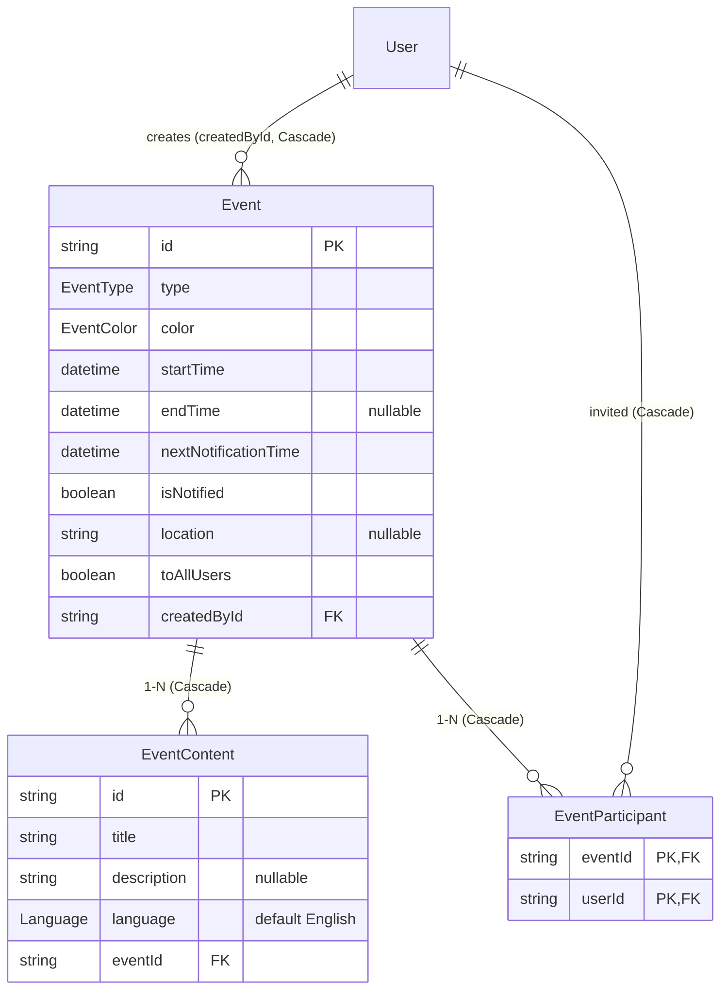
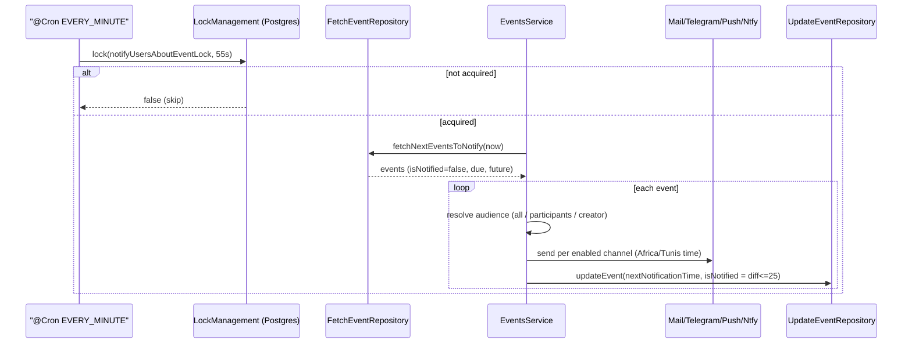

# Dossier 10 — Events & Calendar

## 1. Identity
- **One-line purpose:** Company calendar — create/read/update/delete Meetings, Events and PersonalEvents, render them in a custom month/week/day/agenda calendar, and fan out multi-channel reminders before each event starts.
- **Backend source root:** `tdg-management-api-backend/src/events/**`
- **Frontend source root:** `tawer-management-frontend/src/modules/events/**` + calendar pages `tawer-management-frontend/src/app/[locale]/dashboard/(auth)/calendar/{events,meetings,personal}/**`
- **Owned DB tables/models:** `Event`, `EventContent`, `EventParticipant` (+ enums `EventType`, `EventColor`), defined in `tdg-management-api-backend/prisma/schema/events.schema.prisma:1-54`.

## 2. Purpose & business problem
The module gives the organisation a shared calendar with three event kinds distinguished by the `EventType` enum (`events.schema.prisma:41-45`):
- **Meeting** and **Event** — organisational entries that can target the whole company (`toAllUsers=true`) or a named participant list (`EventParticipant`), surfaced at `/calendar/meetings` and `/calendar/events`.
- **PersonalEvent** — a private per-user calendar entry, surfaced at `/calendar/personal`.

Each frontend page renders the same component with a different `type` prop (`calendar/events/page.tsx:18`, `calendar/meetings/page.tsx:18`, `calendar/personal/page.tsx:18` → `type="event" | "meeting" | "personalEvent"`).

The second reason the module exists is **reminders**: a per-minute cron (`events.service.ts:194`) computes escalating notification thresholds and pushes reminders through email / Telegram / in-app push / ntfy before an event starts (`events.service.ts:273-331`).

## 3. Domain model & database
Source: `tdg-management-api-backend/prisma/schema/events.schema.prisma`.

**`Event`** (`:1-17`)
| Field | Type | Notes |
|---|---|---|
| `id` | `String @id @default(uuid())` | |
| `type` | `EventType` | Meeting / Event / PersonalEvent |
| `color` | `EventColor` | 6 fixed swatches |
| `startTime` | `DateTime` | required |
| `endTime` | `DateTime?` | optional (`:6`) |
| `nextNotificationTime` | `DateTime` | **required**, next reminder fire time (`:7`) |
| `isNotified` | `Boolean @default(false)` | true once inside the final ~25-min window (`:8`) |
| `location` | `String?` | free text (`:9`) |
| `toAllUsers` | `Boolean @default(false)` | company-wide fan-out flag (`:10`) |
| `createdById` | `String` | FK → `User` |
| `createdAt`/`updatedAt` | timestamps | |
| `createdBy` | `User @relation(... onDelete: Cascade)` | deleting the user deletes their events (`:14`) |
| `content` | `EventContent[]` | 1-N (`:15`) |
| `participants` | `EventParticipant[]` | 1-N (`:16`) |

**`EventParticipant`** (`:19-28`) — join table between `Event` and `User`. Composite PK `@@id([eventId, userId])` (`:27`) prevents duplicate invitations; both FKs `onDelete: Cascade` (`:24-25`) so removing an event or a user removes the participation row.

**`EventContent`** (`:30-39`) — the **content-table split**: title/description live in a separate 1-N table keyed by `language Language @default(English)` (`:34`). This is the same i18n-ready pattern used across the codebase (see Dossier 02). In practice only one row per event is ever written, always `Language.English` (hard-coded in `create.repository.ts:32` and `update.repository.ts:55`), so the multi-language capability is **dormant** — consistent with the project-wide finding that the `Language` enum is effectively single-value (Dossier 02).

**Enums:** `EventType { Meeting, Event, PersonalEvent }` (`:41-45`); `EventColor { Sky, Amber, Violet, Rose, Emerald, Orange }` (`:47-54`).

**Design-choice notes (WHY):**
- *Content split* → future i18n / consistency with `ProjectContent`/`TaskContent`; currently unused (debt §13).
- *`nextNotificationTime` + `isNotified` denormalised onto `Event`* → lets the reminder cron find "events due to notify" with a single indexed-ish `findMany` (`fetch.repository.ts:90-101`) instead of recomputing per event each minute.
- *No `@@index`* is declared on `Event` in this schema file — the reminder query filters on `isNotified`, `nextNotificationTime`, `startTime` with no supporting index (see §13 / §16). **Not verified** against the migration SQL whether an index was added out-of-schema.
- *No recurrence model* — there is no RRULE / recurrence field anywhere; events are one-shot (confirmed by absence in `events.schema.prisma` and DTOs).

## 4. Backend architecture
Standard 4-layer NestJS pattern (controller → service → repository → dto), wired in `events.module.ts:19-42`.

- **`EventsController`** (`controllers/events.controller.ts`) — 4 routes, each `@UseGuards(HasPermissionGuard)` + `@Permissions([...])` (`:48-147`). Create/update/read use `ClassSerializerInterceptor` + `@SerializeOptions` to shape responses.
- **`EventsService`** (`services/events.service.ts`) — business rules: authorization (ownership + executive-role checks), reminder-time computation, and the cron. Implements `OnModuleInit` to register a distributed lock (`:47-53`).
- **Repositories** — one class per concern:
  - `CreateEventRepository.createEvent` (`create.repository.ts:10-60`) — nested `create` of participants + one English `content` row.
  - `UpdateEventRepository.updateEvent` (`update.repository.ts:10-89`) — nested participant reconciliation (`deleteMany notIn` + `createMany skipDuplicates`, `:36-49`) and content `updateMany where language=English` (`:50-63`). A second method `updateEventNotificationStatus` (`:91-98`) exists but is **dead** (never called — the cron uses `updateEvent`, §13).
  - `FetchEventRepository` (`fetch.repository.ts`) — `fetchEventsByPeriod` (period + visibility filter), `getEventById` (`findUniqueOrThrow`), `fetchNextEventsToNotify` (reminder query).
  - `DeleteEventRepository.deleteEventById` (`delete.repository.ts:8-12`) — `deleteMany where { id, createdById }`.

**Authorization logic (service layer):**
- `createEvent` (`events.service.ts:55-63`) — **no ownership/role/`toAllUsers` restriction**. It stamps `createdById = req.user.id`, computes `nextNotificationTime`, and creates. Any authenticated user may create any event type, including `toAllUsers=true` (see §9).
- `updateEvent` (`:65-107`) — fetches the event, then: PersonalEvent → editor must be the creator (`:70-74`); non-personal → editor must be the creator **or** hold an executive role (`getExecutiveRoleFromRoles`, `:76-84`). `EXECUTIVE_ROLES = [CEO, CTO, CMO]` (`common/constants/permissions.ts:849-853`). If `startTime` changes it recomputes `nextNotificationTime` and resets `isNotified=false` (`:86-92`). Prisma `P2025` → `EVENT_NOT_FOUND` BadRequest (`:96-103`).
- `deleteEvent` (`:118-154`) — same ownership/executive gate as update (`:122-136`), then delegates to `deleteEventById(id, req.user.id)`.

**Reminder scheduling** (`getNextNotificationTime`, `:156-192`) — escalating thresholds by distance-to-start: ≥24h → notify 24h before; ≥2.5h → 2.5h before; ≥30min → 30min before; else → 15min before. All via `TimeService` helpers (Dossier 09 owns `common/time`).

**Layering deviation:** `updateEvent`/`deleteEvent` duplicate the identical ownership+executive check block (`:70-84` vs `:122-136`) — copy-paste, not extracted into a shared guard/helper (§12).

## 5. API surface
All routes are under `@Controller('events')`; every route is guarded by `HasPermissionGuard`. Note the guarded permissions live in `DEFAULT_PERMISSIONS_FOR_ALL_ROLES` (`permissions.ts:232-235`) → **held by every one of the 31 roles**, so the guard only asserts "is an authenticated known role", not any event-specific privilege (see §9).

| Method | Path | Auth/Perm | Request DTO | Response DTO | Validation | Business logic (1 line) | Side effects |
|---|---|---|---|---|---|---|---|
| POST | `/events` | `event.create` (all roles) | `CreateEventDto` | `CreatedEventDto` (201) | enum type/color, ISO8601 times, nested `content` `@ValidateNested` | Create event + participants + English content; compute `nextNotificationTime` | Inserts `Event`+`EventContent`(+`EventParticipant`). `controller:48-65`, `service:55-63`, `create.repository.ts:10-60` |
| PATCH | `/events/:id` | `event.update` (all roles) | `UpdateEventDto` | `UpdatedEventDto` (200) | all fields optional; enums/ISO8601 | Owner (or executive for non-personal) edits; reconcile participants/content; reset reminder if `startTime` changed | Updates rows; **overwrites `createdById` with editor** (bug §13). `controller:67-89`, `service:65-107` |
| GET | `/events` | `event.read` (all roles) | `FilterEventsParamsDto` (`from`,`to`,`eventType`) | `EventsInPeriodDto` (200) | ISO8601; `from`/`to` default to now / now+30d; enum `eventType` | List events in `[from,to]` visible to caller (own ∪ participant ∪ `toAllUsers`), optional type filter | Read-only. `controller:91-130`, `service:109-116`, `fetch.repository.ts:9-57` |
| DELETE | `/events/:id` | `event.delete` (all roles) | — (`:id` param) | 204 No Content | — | Owner (or executive for non-personal) deletes | `deleteMany where {id, createdById}` — **no-op for non-owner executives** (bug §13). `controller:132-147`, `service:118-154` |

**Swagger accuracy bug:** GET documents `@ApiQuery({ name: 'type' })` (`controller:113-119`) but the DTO field is `eventType` (`filter-events-params.dto.ts:50`). The Swagger param name is wrong; the frontend correctly sends `eventType` (`services/extraction/events.ts:20`). (§13)

## 6. Frontend
**Routing:** three thin pages under `/[locale]/dashboard/(auth)/calendar/` (`events`, `meetings`, `personal`) each render `<EventCalendarApp type=… />` (`calendar/*/page.tsx`). The `(auth)` route group applies the dashboard auth gate (Dossier 15).

**Calendar stack — custom, NOT FullCalendar.** Despite `@fullcalendar/*` being listed in `package.json:18-22`, **no source file imports `@fullcalendar`** (verified: 0 matches under `src/`). The calendar is hand-built on `date-fns` (`package.json:84`) + `@dnd-kit/core` (`package.json:14`) drag-and-drop → the FullCalendar deps are dead weight (§13).

**Component tree** (`src/modules/events/components/calendar/`):
- `event-calendar-app.tsx` — data owner: `useEvents` (fetch), `useEventsActions` (update/delete), computes `userHasViewPermissions` from the FE role map, and passes events into `EventCalendar` (`:15-44`). Wraps children in `EventWrapper` which pushes the current `type` into the Zustand store (`event-wrapper.tsx:12-20`).
- `event-calendar.tsx` — toolbar, keyboard shortcuts (m/w/d/a → view, `:88-122`), prev/next/today navigation, and view switch between `MonthView`/`WeekView`/`DayView`/`AgendaView` (`views/*.tsx`). It reports the visible date window up via `setDisplayedDateRanges` (`:81-85`) driven by `getDisplayedDaysInCalendar` (`utils/calendar-days.ts:13-53`).
- `calendar-dnd-context.tsx` — `@dnd-kit` provider; on drop it recomputes start/end (snapping to 15-min intervals) and calls `onEventUpdate` only if the start actually changed (`:212-310`).
- `event-dialog.tsx` — create/edit form (react-hook-form + Zod), colour radio, `allUsers` checkbox, participants input (hidden for personal events, `:130-135`), delete button.

**State & data fetching:**
- **React Query** — `useEvents` keyed `["events", type, from, to]`, `enabled: user !== null` (`hooks/extraction/use-events.ts:16-25`). Mutations invalidate `["events"]` (`use-event-upload.ts:55`, `event-actions/index.ts:32,62`).
- **Zustand** — `useEventStore` holds the active `eventType` so deep children (dialog, calendar) know whether they're on the meetings/events/personal calendar (`store/events.ts:9-16`).
- **Forms/Zod** — `getEventFormSchema` (`validations/event.schema.ts:12-38`): `title` required, `startTime`/`endTime` required, `color` default `sky`, and a `superRefine` rejecting `start > end` (`:27-37`). Note: schema does **not** enforce participants when `allUsers=false`.

**API layer** (`services/`): `retreiveEventsFromServerSide` (GET, `extraction/events.ts`), `uploadEventToServerSide` (POST for create / PATCH for update, `actions/event-upload.ts:14-41`), `deleteEventOnServerSide` (DELETE, `actions/event-deletion.ts`). All three manually attach `Bearer` from `extractJWTokens()` and retry once via `refreshToken(...)` on 401 — the module-local auth pattern (Dossier 15).

**DTO mapping** (`dto/requests/events.ts`, `dto/responses/events.ts`): FE `EventColor`/`EventType` are lower-case (`"sky"`,`"meeting"`) and cast to backend PascalCase (`"Sky"`,`"Meeting"`) on the way out and back.

## 7. Data flow & key scenarios

**Scenario A — Create an event (UI → DB).**
1. User clicks "+ New" (or a calendar cell) → `EventDialog` opens; on submit the form is validated by Zod (`event-dialog.tsx:99`, `event.schema.ts`).
2. `useEventUpload.onSubmit` casts form → `CalendarEventRequestType` (`castToCalendarEventRequestType`, `dto/requests/events.ts:12-31`) and calls `uploadEventToServerSide` → `POST /events` (`use-event-upload.ts:46-47`).
3. `EventsController.createEvent` (guard passes for any role) → `EventsService.createEvent` stamps `createdById`, computes `nextNotificationTime` (`service:55-63`).
4. `CreateEventRepository.createEvent` inserts `Event` + nested `EventParticipant[]` + one English `EventContent` (`create.repository.ts:10-60`).
5. Success toast + `queryClient.invalidateQueries(["events"])` refetches the calendar (`use-event-upload.ts:49-55`).

**Scenario B — Reminder fan-out (cron → channels).** Every minute (`@Cron(EVERY_MINUTE)`, `service:194`):
1. Acquire distributed lock `notifyUsersAboutEventLock` (TTL 55s) via Postgres `Locking` (`service:197-202`; lock mechanism = Dossier 01). If not acquired, return — single-instance execution.
2. `fetchNextEventsToNotify(now)` = events with `isNotified=false AND nextNotificationTime<=now AND startTime>now`, eager-loading each user's notification settings + Telegram/ntfy integrations (`fetch.repository.ts:90-162`).
3. For each event pick the audience: `toAllUsers` → all users w/ settings (loaded once, `service:210-212`); else participants; else (personal) the creator (`service:215-241`).
4. `sendNotificationsEvents` iterates users and, per enabled channel, sends email / Telegram / in-app push / ntfy, formatting the start time in `Africa/Tunis` (`service:273-331`).
5. Recompute `nextNotificationTime`; set `isNotified=true` only when within ~25 min of start, so an event notifies at each escalating threshold until the final window (`service:243-249`).

**Scenario C — Drag to reschedule.** `@dnd-kit` drop → `handleDragEnd` computes new start/end (15-min snap, preserves duration) → `onEventUpdate` → `handleEventUpdate` → PATCH `/events/:id` → invalidate (`calendar-dnd-context.tsx:212-310`, `event-actions/index.ts:24-54`).

## 8. Diagrams (Mermaid)

### 8.1 ERD slice (module tables)


### 8.2 Create-event sequence
```mermaid
sequenceDiagram
    participant U as User (EventDialog)
    participant H as useEventUpload
    participant API as EventsController
    participant S as EventsService
    participant R as CreateEventRepository
    participant DB as PostgreSQL

    U->>H: submit (Zod-validated form)
    H->>API: POST /events (Bearer)
    API->>API: HasPermissionGuard (event.create — all roles)
    API->>S: createEvent(req, dto)
    S->>S: createdById = user.id; getNextNotificationTime(startTime)
    S->>R: createEvent(dto)
    R->>DB: INSERT Event + EventContent(English) + EventParticipant[]
    DB-->>R: row
    R-->>API: CreatedEventDto
    API-->>H: 201
    H->>H: toast + invalidate ["events"]
```

### 8.3 Reminder cron sequence


## 9. Security
- **Authentication:** every route requires a Bearer JWT via `HasPermissionGuard` (`controller:50,69,93,134`). Token handling per Dossier 03.
- **Authorization — the key finding:** the four event permissions are granted to **all 31 roles** (`DEFAULT_PERMISSIONS_FOR_ALL_ROLES`, `permissions.ts:194,232-235`). The guard therefore does **not** differentiate who may manage events; the only real access control is the service-layer ownership/executive check on **update and delete** (`service:70-84`, `:122-136`). Consequences:
  - **Unrestricted create / notification-spam vector (gap).** `createEvent` (`service:55-63`) applies **no** check on `toAllUsers` or role. Any authenticated user can `POST /events` with `toAllUsers:true`, which the reminder cron then fans out by email/Telegram/push/ntfy to **every** user (`service:210-232`). There is no rate limit (project-wide, Dossier 03) and no executive gate on company-wide broadcasts.
  - **Frontend role matrix is not enforced server-side (gap).** The FE encodes a rich per-role view/add/edit/delete matrix for `eventsManagement`/`meetingsManagement` (`modules/auth/utils/users-permissions/role-permissions.tsx:13-212`) and hides buttons accordingly (`event-calendar-app.tsx:29`, `event-calendar.tsx:74`, `event-dialog.tsx:48-49`). None of this granularity exists on the backend — a "view-only" user can still call the API directly to create events and to edit/delete events they created. FE gating here is cosmetic, not a security boundary.
- **Read scoping (strength).** GET is correctly scoped at the query level regardless of the blanket read permission: `fetchEventsByPeriod` returns only events where `toAllUsers=true OR createdById=me OR participants.some(userId=me)` (`fetch.repository.ts:20-32`), so private meetings are not leaked to non-participants.
- **Input validation:** DTOs use `class-validator` (`@IsEnum`, `@IsISO8601`, `@IsString`, `@ValidateNested`) — `create-event.dto.ts`, `update-event.dto.ts`. `CreateEventDto.content` uses `@Type(() => CreateEventContentDto)` + `@ValidateNested({ each: true })` (`create-event.dto.ts:92-96`) — correctly typed (unlike the team DTO gap in Dossier 04).
- **Mass-assignment risk (project-wide gap):** no global `ValidationPipe({ whitelist: true })` (Dossier 01/03), so unknown body properties are not stripped; however the repositories write only an explicit field allowlist (`create.repository.ts:12-34`, `update.repository.ts:26-64`), which contains the blast radius for this module.
- **Injection:** all DB access is via Prisma parameterised queries — no raw SQL in this module (repositories reviewed). No injection surface.
- **Ownership hijack on edit (bug, see §13):** update rewrites `createdById` to the editor, so an executive editing another user's meeting silently takes ownership.

## 10. Cross-module dependencies
`events.module.ts:28-39` imports: `PrismaModule`, `UsersModule` (`usersService.getUsersWithNotificationsSettings`), `TokensModule`, `LoggerModule` (`BackgroundActivitiesLoggerService`), `MailModule`, `NtfyModule`, `TelegramModule`, `NotificationsModule` (`createNotificationFromSystem`), `AuthsModule` (`PermissionsService.getExecutiveRoleFromRoles`), `LockManagementModule`. It **exports** `EventsService`.
- **Depends on:** Users (Dossier 04), Auth/RBAC (03), Notifications (12), Time (09), Locking (01), and the four channel modules mail/ntfy/telegram/(push via notifications).
- **Depended on by:** `EventsService` is exported but **not imported by any other module** (verified: no importer). The event data model is otherwise self-contained (only FK is to `User`).
- **Coupling comment:** the reminder path couples `EventsService` to five delivery mechanisms directly (`service:273-331`) rather than delegating to a single notification-dispatch abstraction — high fan-out coupling; the same channel-selection block is duplicated logic that also appears in Reminders (Dossier 11). Cohesion within the module is otherwise good (one aggregate root, clear repositories).

## 11. Tests
- `controllers/events.controller.spec.ts` and `services/events.service.spec.ts` are **skeleton "should be defined" stubs only** — and both instantiate the class with **no providers** (`events.controller.spec.ts:7-13`, `events.service.spec.ts:7-13`), so they do not exercise (and given the required constructor dependencies, would not even successfully wire) any real behaviour.
- **No coverage** for: authorization branches (personal vs executive), the reminder cron / threshold computation, participant reconciliation, visibility scoping, or the drag-reschedule frontend logic.
- **No e2e** tests for the events endpoints (none found under the module).

## 12. Code quality
- **Good — clear layering & explicit selects.** Repositories return explicit `select` projections (`create.repository.ts:37-58`), keeping responses stable and avoiding over-fetch.
- **Good — defensive cron.** The cron wraps everything in try/catch and logs to the background-activities logger, and fire-and-forget updates have their own `.catch` (`service:250-259`), so one bad event can't abort the batch.
- **Bad — duplicated authorization block.** The identical ~15-line ownership+executive check is copy-pasted in `updateEvent` (`:70-84`) and `deleteEvent` (`:122-136`); it should be a shared helper/guard.
- **Bad — misleading error mapping.** In `deleteEvent`, a Prisma `P2025` maps to message `'This user is not found!'` / `USER_NOT_FOUND` (`service:147-150`) even though the missing entity is an event; the Swagger `DELETE` likewise documents `UserNotFoundApiResponse` (`controller:143`). Wrong domain in the error.
- **Bad — swallowed drag errors.** `handleDragEnd`'s `catch (error) {}` is empty (`calendar-dnd-context.tsx:298`), silently hiding reschedule failures.
- **Minor — response/DTO field mismatch.** `CreatedEventDto`/`UpdatedEventDto` expose `contents` (`created-event.dto.ts:87`) but the repository selects `content`; with no `@Expose/@Transform` the create/update responses omit title/description. Harmless (FE refetches) but inconsistent with `EventDto` which maps `content[0]` (`event.dto.ts:95-110`).

## 13. Verified technical debt
1. **Update reassigns ownership (bug).** `updateEvent` sets `data.createdById = req.user.id` (`service:67`) and the repository writes it (`update.repository.ts:31`), so **any edit overwrites the event creator with the editor**. An executive editing another user's meeting silently becomes its "creator", and thereafter the original owner loses owner-based access. `service:65-107`.
2. **Executive delete of non-owned events is a silent no-op (bug).** `deleteEvent` authorizes executives for non-personal events (`service:128-136`) but calls `deleteEventById(id, req.user.id)` whose `deleteMany` filters `createdById: req.user.id` (`delete.repository.ts:8-12`). For an executive deleting an event they don't own, `deleteMany` matches 0 rows, no error is thrown, and the controller returns **204** — the UI shows success while nothing was deleted.
3. **Swagger query-param name wrong.** GET documents `type` but the accepted param is `eventType` (`controller:113-119` vs `filter-events-params.dto.ts:50`).
4. **Dead FullCalendar dependency.** `@fullcalendar/core|daygrid|interaction|react|timegrid` are in `package.json:18-22` but imported nowhere in `src/` (0 matches) — the calendar is custom (`@dnd-kit` + `date-fns`).
5. **Dead repository method.** `UpdateEventRepository.updateEventNotificationStatus` (`update.repository.ts:91-98`) is never called.
6. **Dormant i18n content split.** `EventContent.language` is always hard-coded `English` on write (`create.repository.ts:32`, `update.repository.ts:55`); reads take `content[0]` (`event.dto.ts:96,107`, `dto/responses/events.ts`), so multi-language content cannot round-trip. Ties to the project-wide `Language`-enum / `TransformLanguagePipe` finding (Dossier 01/02).
7. **Wrong-domain error on delete** — `USER_NOT_FOUND` for a missing event (`service:147-150`).
8. **Create-toast can mislabel.** In `useEventUpload`, a brand-new event created from the "+ New" button (where `event` is `null`) hits the `else` branch and toasts *"eventUpdated"* instead of *"eventCreated"*; only cell-click creation (`event.id === ""`) toasts "eventCreated" (`use-event-upload.ts:49-50`).
9. **Hard-coded reminder timezone.** Reminder copy formats start time in `'Africa/Tunis'` in four places (`service:290-327`) regardless of the recipient's locale/timezone.
10. **Empty catch** swallows drag-reschedule errors (`calendar-dnd-context.tsx:298`).
11. **Zod does not require participants** when `allUsers=false` for meetings/events (`event.schema.ts`), despite the DTO comment "required if toAllUsers=false" — neither side enforces it, so a non-broadcast meeting can be created with no audience (it will then only remind the creator, `service:233-241`).

## 14. Strengths / Weaknesses / Improvements

**Strengths**
- Correct **read visibility scoping** at the query level (own ∪ participant ∪ company-wide) — private events don't leak. *Impact: confidentiality holds even though the read permission is blanket.* (`fetch.repository.ts:20-32`)
- **Robust, single-instance reminder cron** — Postgres distributed lock + per-event error isolation + escalating notification windows. *Impact: no duplicate reminders across instances; one bad event can't break the batch.* (`service:194-271`)
- **Clean 4-layer separation** with explicit `select` projections. *Impact: predictable payloads, easy to read.*
- Properly typed nested validation on create content (`@Type` + `@ValidateNested`).

**Weaknesses**
- **Authorization gaps:** blanket permissions, no executive gate on `toAllUsers` broadcasts (company-wide notification-spam vector), ownership-hijack on edit, and silent no-op executive deletes. *Impact: real integrity/abuse risks.*
- **FE permission matrix is decorative** — the granular role rules aren't enforced by the API. *Impact: false sense of access control.*
- **Effectively no automated tests** (stub specs only). *Impact: the above bugs are undetected.*
- **Direct multi-channel coupling** duplicated with Reminders. *Impact: change amplification.*

**Improvements (concrete)**
- In `createEvent`, gate `toAllUsers=true` behind `EXECUTIVE_ROLES` (reuse `getExecutiveRoleFromRoles`), and split event permissions out of `DEFAULT_PERMISSIONS_FOR_ALL_ROLES` so the RBAC map mirrors the FE matrix.
- Stop writing `createdById` in `updateEvent`/`UpdateEventRepository` (never reassign owner).
- Make delete honour the authorization decision: `delete where { id }` after the service check passes (or throw when `count===0`).
- Extract the ownership+executive check into one reusable helper/guard.
- Remove the `@fullcalendar/*` dependencies and the dead `updateEventNotificationStatus`.
- Add real service tests for the authorization branches and `getNextNotificationTime` thresholds.
- Fix the Swagger `type`→`eventType`, the `USER_NOT_FOUND` message, the create toast branch, and add per-user timezone to reminders.

## 15. Verification Checklist
| Area | Verified? | Evidence / reason |
|---|---|---|
| Domain model (Event/EventContent/EventParticipant, enums) | Yes | `events.schema.prisma:1-54` read in full |
| Backend logic (service auth, cron, reminder computation) | Yes | `events.service.ts:1-332` read in full |
| Repositories (create/update/delete/fetch) | Yes | all four files read in full |
| Every endpoint (4 routes) | Yes | `events.controller.ts:44-148` + DTOs read |
| DTO validation | Yes | create/update/fetch/response DTOs read |
| RBAC placement (which roles hold event perms) | Yes | `permissions.ts:194,232-235,849-853` |
| Frontend pages & calendar components | Yes | pages + `event-calendar-app/-calendar/-dialog/dnd-context` + hooks/services/store/schema read |
| FullCalendar usage claim | Yes (disproven) | `package.json:18-22` present; `@fullcalendar` import matches in `src/` = 0 |
| Read visibility scoping | Yes | `fetch.repository.ts:20-32` |
| Update ownership-reassign bug | Yes | `service:67` + `update.repository.ts:31` |
| Executive-delete no-op bug | Yes | `service:128-141` + `delete.repository.ts:8-12` (logic-verified; not run at runtime) |
| Tests | Yes (they are stubs) | both `.spec.ts` files read |
| Tech debt items | Yes | each cited above |
| Presence of a supporting DB index for the reminder query | No | not declared in `events.schema.prisma`; migration SQL not inspected |
| Runtime behaviour / actual notification delivery | No | read-only static analysis; no execution |

## 16. Not verified / Open questions
- **DB indexes on `Event`.** No `@@index` in `events.schema.prisma`; whether the per-minute reminder query (`isNotified`, `nextNotificationTime`, `startTime`) is index-backed would require reading `prisma/migrations/**` or the live DB. At scale this scans `Event` each minute.
- **Runtime confirmation of the delete no-op and ownership-reassign bugs** — verified by code reading only; not reproduced against a running instance.
- **Recurrence** — confirmed absent in schema/DTOs; not verified whether any recurrence is faked client-side (none seen in the read components).
- **`TimeService` threshold math** (e.g. `getPastDateByHoursFromDate`, `calculateTimeDifferenceInMinutes`, DST behaviour) — owned by Dossier 09; used but not re-verified here.
- **`CreatedEventDto.contents` vs `content`** — believed to drop title/description in create/update responses; not confirmed against a live serialized response.
- **Calendar view components** (`views/{month,week,day,agenda}.tsx`, `events-popup.tsx`, `event-item.tsx`) were surveyed for the data-flow but not line-audited for rendering edge cases.
```
