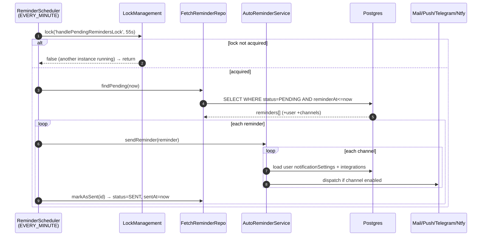
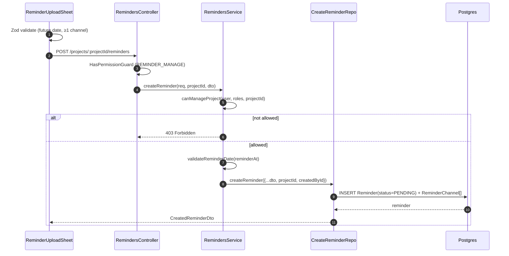
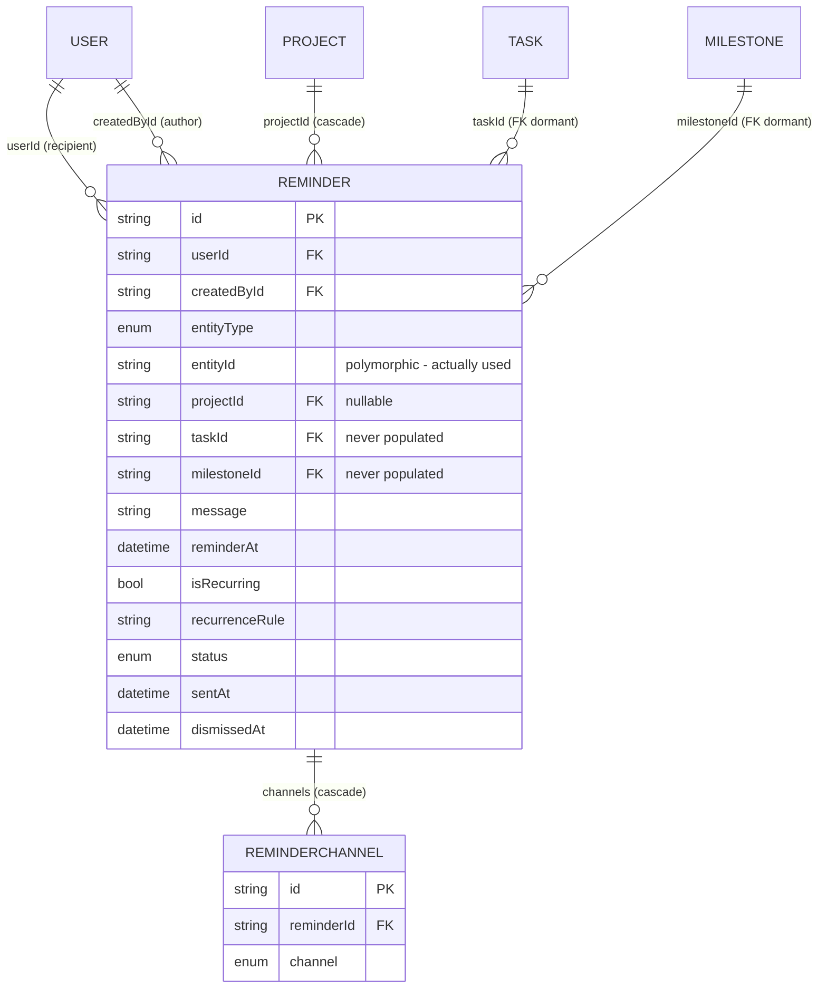

# Dossier 11 — Reminders

## 1. Identity
- **One-line purpose:** Time-triggered, multi-channel reminders (manual + auto-generated) that fire on a per-minute cron and fan out to in-app/push/email/Telegram/ntfy.
- **Backend source root(s):** `tdg-management-api-backend/src/reminders/**` (2 controllers, 3 services, 4 repositories, DTOs). Cross-module producers in `src/tasks/`, `src/sprints/`, `src/milestones/`.
- **Frontend source root(s):** `tawer-management-frontend/src/modules/reminders/**` (API/hooks/types/validation) + UI in `src/modules/projects/components/project-detail/reminders/**`.
- **Owned DB tables/models:** `Reminder`, `ReminderChannel`. Enums `ReminderEntityType`, `ReminderStatus`, `ChannelType` (`ChannelType` is shared with Notifications, dossier 12).

## 2. Purpose & business problem
Users need to be nudged before/when project work is due. The module serves two workflows:
1. **Manual reminders** — a project manager creates a reminder for a specific user, linked to a task/sprint/milestone/project or free-form (`CUSTOM`), scheduled for a future time, delivered over chosen channels (`reminders.controller.ts:90`, create flow `reminders.service.ts:198`).
2. **Automatic reminders** — the system auto-creates reminders when tasks/sprints/milestones are created (due-date nudges, `auto-reminder.service.ts:66-203`) and on crons that scan for overdue/stuck tasks (`auto-reminder.service.ts:209-310`).

A per-minute scheduler (`reminder-scheduler.service.ts:50`) is the delivery engine: it finds `PENDING` reminders whose `reminderAt` has passed and dispatches them.

## 3. Domain model & database
Source: `prisma/schema/reminders.schema.prisma`.

**`Reminder`** (`reminders.schema.prisma:2-30`)
- `id` text PK, dbgenerated uuid.
- `userId` (recipient, `User onDelete Cascade` `:24`), `createdById` (author, `User @relation("ReminderCreatedBy") onDelete Cascade` `:20`) — two distinct User FKs.
- **Polymorphic target:** `entityType ReminderEntityType` (required) + `entityId String?` (`:5-6`). This is the field the code actually uses to link a reminder to a task/sprint/milestone.
- **Dedicated FKs (dormant):** `taskId String?` → `Task onDelete Cascade` (`:23`) and `milestoneId String?` → `Milestone onDelete Cascade` (`:21`), plus `projectId String?` → `Project onDelete Cascade` (`:22`). **`taskId`/`milestoneId` are never populated by any create path** (see §13 debt) — only `entityId` and `projectId` are written (`create-reminder.repository.ts:19-34`).
- Scheduling: `reminderAt DateTime @db.Timestamp(6)` (`:11`), `isRecurring Boolean @default(false)` (`:12`), `recurrenceRule String?` (`:13`, a cron-ish string).
- Lifecycle: `status ReminderStatus @default(PENDING)` (`:15`), `sentAt`, `dismissedAt` (`:16-17`), `createdAt`, `updatedAt` (`:18-19`).
- Indexes (`:27-29`): `@@index([status, reminderAt])` (drives the scheduler scan), `@@index([userId, status])` (drives `/reminders/me`), `@@index([projectId])`.

**`ReminderChannel`** (`reminders.schema.prisma:33-40`)
- `id`, `reminderId` → `Reminder onDelete Cascade`, `channel ChannelType`.
- `@@unique([reminderId, channel])` (`:39`) — one row per channel per reminder (no duplicate channels). 1-N from Reminder.

**Enums**
- `ReminderEntityType` = `TASK | SPRINT | MILESTONE | PROJECT | CUSTOM` (`:43-49`).
- `ReminderStatus` = `PENDING | SENT | DISMISSED | FAILED | CANCELLED` (`:52-58`). **`FAILED` is never written by any code path** (verified §13); `CANCELLED` is written only by sprint lifecycle (`sprints.service.ts:402,484`).
- `ChannelType` = `EMAIL | TELEGRAM | PUSH | NTFY` (`:61-66`). Note: `IN_APP` is handled by the delivery switch (`auto-reminder.service.ts:373`) but is **not** a `ChannelType` enum member — dead branch (§13).

**WHY notes:**
- Two User FKs (`userId` vs `createdById`) separate *who is reminded* from *who scheduled it*.
- The `entityType` + `entityId` polymorphic pair lets one table target any entity kind without five nullable typed FKs on every query. The separately-declared `taskId`/`milestoneId` FKs appear to be an *intended* referential-integrity design that was never wired into the write path — so the cascade guarantees they promise do not hold (§13). This matches dossier 02's note ("Reminder SPRINT/CUSTOM has no FK/cascade → orphans"), but the gap is broader: TASK/MILESTONE reminders are equally unprotected because the FK columns stay null.

## 4. Backend architecture
Standard 4-layer pattern (controller → service → repository → dto), consistent with dossiers 05/07.

- **Controllers** (`reminders/controller/`): `RemindersController` (project-scoped CRUD, base path `projects/:projectId/reminders`, `reminders.controller.ts:54`) and `UserRemindersController` (personal, base path `reminders`, `user-reminders.controller.ts:50`). Both use `ClassSerializerInterceptor` + `@SerializeOptions({type})` for response shaping.
- **Service** (`reminders.service.ts`): all authorization + validation. Holds the RBAC helpers `isGlobalExecutive` (`:39`), `getExecutiveBusinessUnitScope` (`:47`), `hasExecutiveProjectAccess` (`:72`), `canAccessProject` (`:88`), `canManageProject` (`:109`) — the same BusinessUnit-scoped executive model used in Projects/Tasks (CEO=global, CTO=TawerDev, CMO=TawerCreative). Date guard `validateReminderDate` rejects non-future `reminderAt` (`:56-67`). Pagination/filter/sort parsing helpers (`:136-192`).
- **Repositories** (`reminders/repositories/`): `CreateReminderRepository` (`create-reminder.repository.ts`), `FetchReminderRepository` (builders `buildSelectForList`/`buildSelectForDetails`/`buildWhereClause`/`buildOrderBy` + scheduler queries `findPending`/`findRecurring`, `fetch-reminder.repository.ts`), `UpdateReminderRepository` (generic `update`, `markAsSent`, `markAsDismissed`), `DeleteReminderRepository` (hard delete). **All queries use the Prisma query builder — no raw SQL.** Explicit field-mapping in the create/update repos neutralizes the missing global ValidationPipe whitelist (same mitigation as Tasks, dossier 07).
- **Schedulers/producers:**
  - `ReminderSchedulerService` (`reminder-scheduler.service.ts`) — 4 `@Cron` jobs, each wrapped in a Postgres distributed lock (`LockManagementService`, TTL 55s, `:17`), errors routed to `BackgroundActivitiesLoggerService`.
  - `AutoReminderService` (`auto-reminder.service.ts`) — the delivery dispatcher (`sendReminder`/`sendToChannel`) **and** the auto-creation logic (default reminders for sprint/task/milestone; overdue/stuck task scans). Exported from the module (`reminders.module.ts:46`) and injected by tasks/sprints/milestones services.
- **Module** (`reminders.module.ts`) imports Prisma, Notifications, Telegram, Mail, Ntfy, Auths, Tokens, LockManagement, Logger.
- **Error handling:** service maps Prisma `P2025` → 404 `REMINDER_NOT_FOUND`, `P2002` → 409 `REMINDER_ALREADY_EXISTS` (`reminders.service.ts:222-238`, etc.). Custom exceptions + `ErrorCode` P8500–P8506 (`error.code.ts:124-130`).

## 5. API surface
7 endpoints across 2 controllers. Guard = `HasPermissionGuard` (verifies JWT + that the caller's role holds *any one* of the listed permissions — `has-permission.guard.ts:47-55`); real project scoping is done in the service.

| Method | Path | Auth/Perm | Request DTO | Response DTO | Validation | Business logic (1 line) | Side effects |
|---|---|---|---|---|---|---|---|
| POST | `/projects/:projectId/reminders` | `REMINDER_MANAGE` | `CreateReminderDto` | `CreatedReminderDto` | class-validator on DTO + future-date check | `canManageProject` then create reminder + channels | Inserts `Reminder` (+ `ReminderChannel` rows) — `reminders.controller.ts:90`, `reminders.service.ts:198` |
| GET | `/projects/:projectId/reminders` | `REMINDER_READ` | `ReminderQueryDto` (page/limit/status/entityType/reminderAtFrom/To/sortBy) | `ReminderListDto` | query DTO | `canAccessProject` then paginated list (list-select) | none — `reminders.controller.ts:173`, `service:245` |
| GET | `/projects/:projectId/reminders/:reminderId` | `REMINDER_READ` | — | `ReminderDetailDto` | UUID pipe | `canAccessProject` then `findByIdInProject` (P2025→404) | none — `controller:215`, `service:288` |
| PATCH | `/projects/:projectId/reminders/:reminderId` | `REMINDER_MANAGE` | `UpdateReminderDto` (message/reminderAt/isRecurring/recurrenceRule) | `UpdatedReminderDto` | DTO + future-date check | `canManageProject` then partial update | Updates row — `controller:259`, `service:326` |
| DELETE | `/projects/:projectId/reminders/:reminderId` | `REMINDER_MANAGE` | — | 204 | UUID pipe | `canManageProject` then hard delete (P2025→404) | Deletes `Reminder` (+ channels cascade) — `controller:305`, `service:376` |
| GET | `/reminders/me` | `REMINDER_READ` | `ReminderQueryDto` | `ReminderListDto` | query DTO | list caller's own reminders across all projects (`where.userId=self`) | none — `user-reminders.controller.ts:129`, `service:414` |
| POST | `/reminders/:reminderId/dismiss` | `REMINDER_MANAGE` **or** `REMINDER_DISMISS_OWN` | — | `UpdatedReminderDto` | UUID pipe | verify reminder belongs to caller, reject if already DISMISSED/CANCELLED, mark DISMISSED | Updates status/`dismissedAt` — `user-reminders.controller.ts:176`, `service:444` |

**Permission distribution** (`common/constants/permissions.ts`): `REMINDER_READ` + `REMINDER_DISMISS_OWN` are in `DEFAULT_PERMISSIONS_FOR_ALL_ROLES` (`:277-278`) → every authenticated role can read & dismiss. `REMINDER_MANAGE` is granted to `ProductOwner` (`:319`) and executive/manager roles (CEO `:458`, CTO, CMO, ProjectManager, etc. `:545/616/682/761`).

## 6. Frontend
The reminders module (`src/modules/reminders/`) is the data layer; the **UI lives inside the Projects module** (`src/modules/projects/components/project-detail/reminders/`).

- **Types** (`reminders/types/reminders.ts`): `ReminderType` (FE shape) + response/payload interfaces; casters in `types/cast-reminder.ts` (`castReminderSummaryToFrontend`, `castReminderToFrontend`) parse backend dates via `parseBackendDate`. Note the summary caster hard-codes `projectId/taskId/milestoneId/createdById` to null/"" because the list-select doesn't return them (`cast-reminder.ts:20-29`).
- **API** (`services/api/reminders.ts`): `retrieveReminders` (list, default `limit=100`, `:47`), `createReminder` (+ client guards: ≥1 channel, recurrenceRule required if recurring, `:81-86`), `updateReminder`, `deleteReminder`. Each wraps a 401 → `refreshToken` retry. **Only project-scoped CRUD is implemented — there is no FE client for `/reminders/me` or the dismiss endpoint** (§10/§13).
- **Hooks:** `useReminders(projectId)` — React Query key `["reminders", projectId]`, `refetchOnWindowFocus:false` (`hooks/use-reminders.ts`). `useReminderUpload` — react-hook-form + Zod, create/update/delete with toast + query invalidation (`hooks/use-reminder-upload.ts`).
- **Validation** (`validation/reminder.schema.ts`): `getCreateReminderSchema` (future `reminderAt`, ≥1 channel, `recurrenceRule` required when `isRecurring`) and `getUpdateReminderSchema` (no channel/entity fields — channels & entity are immutable after creation).
- **UI components** (Projects module):
  - `project-reminders.tsx` — list card view, FAB to add, per-row edit/delete, channel badges, entity-type badge + status badge, `ConfirmDialog` on delete.
  - `reminder-upload-sheet.tsx` — create/edit sheet. On **edit**, channels & entity fields are hidden (only message/reminderAt/recurrence editable), matching the update schema. `datetime-local` input serialized to ISO.
  - `reminder-entity-picker.tsx` — searchable combobox that loads project tasks/sprints/milestones for the `entityId` field.
  - `reminder-entity-label.tsx` — resolves an `entityId` back to a human label.

## 7. Data flow & key scenarios

**Scenario A — Create a manual reminder**
1. PM opens the reminder sheet in project detail, fills message/time/channels/entity → Zod validates future date, ≥1 channel (`reminder.schema.ts:16-58`).
2. `useReminderUpload.onSubmit` → `createReminder(projectId, payload)` → `POST /projects/:projectId/reminders` (`use-reminder-upload.ts:106`).
3. Guard checks role has `REMINDER_MANAGE`; service `canManageProject` checks executive-BU-scope or membership `isManager`/ProductOwner (`reminders.service.ts:205-213`).
4. `validateReminderDate` rejects past dates (`:214`); repository inserts `Reminder` (status `PENDING`) + nested `ReminderChannel` rows (`create-reminder.repository.ts:18-34`).
5. Response cast to FE; React Query key `["reminders", projectId]` invalidated → list refetches.

**Scenario B — Reminder fires → notification (the core cron)**
1. `@Cron(EVERY_MINUTE) handlePendingReminders` acquires the `handlePendingRemindersLock` (55s TTL) — single-instance guarantee (`reminder-scheduler.service.ts:50-58`).
2. `findPending({now})` selects `status=PENDING AND reminderAt <= now` with full detail select incl. `user{id,email}` and `channels` (`fetch-reminder.repository.ts:195-203`).
3. For each: `AutoReminderService.sendReminder` iterates channels → `sendToChannel` (`auto-reminder.service.ts:42-58`).
4. `sendToChannel` loads the recipient's `notificationSettings` + `telegramBot.chatId` + `ntfyIntegration.topic` and dispatches only to enabled channels (`:316-408`): `EMAIL`→`MailService.sendHtmlEmail`, `PUSH`→`NotificationsService.createNotificationFromSystem`, `TELEGRAM`→`TelegramService`, `NTFY`→`NtfyService`.
5. On return, `markAsSent` sets `status=SENT`, `sentAt=now` (`update-reminder.repository.ts:64-72`). Per-channel failures are caught and logged but **do not** flip status to `FAILED` (§13).

**Scenario C — Dismiss**
1. `POST /reminders/:id/dismiss` → `dismissReminder` (`reminders.service.ts:444`).
2. `findByIdAndUserId` enforces ownership (P2025 if not the caller's, `fetch-reminder.repository.ts:253`); reject if already `DISMISSED`/`CANCELLED`; else `markAsDismissed` (status `DISMISSED`, `dismissedAt`). *(No FE consumer — §10.)*

## 8. Diagrams (Mermaid)

**Sequence — pending reminder fires (Scenario B)**

**Sequence — create manual reminder (Scenario A)**

**ERD slice**

## 9. Security
- **AuthN:** every route behind `HasPermissionGuard` (JWT verify + role→permission check, `has-permission.guard.ts`).
- **AuthZ (project CRUD):** two-tier — guard asserts the *role* holds the permission; service re-checks *this project* via `canAccessProject`/`canManageProject` (executive BU-scope or `ProjectMember` membership/`isManager`). Read requires membership or BU access; manage requires `isManager` or executive or `ProductOwner`.
- **AuthZ (dismiss):** ownership enforced at the query level (`findByIdAndUserId` / `markAsDismissed where {id,userId}`) — a user cannot dismiss another user's reminder (returns 404). Good.
- **Injection:** 100% Prisma query-builder, parameterized; no `$queryRawUnsafe` anywhere in this module. DTO field-mapping in repos prevents mass-assignment despite no global whitelist.
- **Input validation:** class-validator DTOs (`@IsEnum`, `@IsDate`, `@IsUUID` via `ParseUUIDPipe` on path params) + future-date business rule.

**Gaps (evidence):**
- **G1 — Recipient not validated as project member.** `createReminder` accepts an arbitrary `dto.userId` and never checks that user belongs to the project (`reminders.service.ts:198-221`, `create-reminder.repository.ts:19`). A `REMINDER_MANAGE` holder can schedule reminders (spam across all channels) for **any** user in the system.
- **G2 — Entity not validated as belonging to the project.** `entityId`/`entityType` are stored verbatim; no check that the referenced task/sprint/milestone is in `:projectId`. Cross-project reference is possible.
- **G3 — ProductOwner manage is un-scoped.** `canManageProject` returns true for anyone with role `ProductOwner` *regardless of project membership or BU* (`reminders.service.ts:129`). A ProductOwner can create/update/delete reminders in **every** project. Inconsistent with the membership scoping applied to all other non-executive roles.
- **G4 — No global ValidationPipe whitelist** (project-wide, dossier 01/03) — mitigated here by explicit repo field-mapping, so not exploitable for mass-assignment in this module.

## 10. Cross-module dependencies
- **Depends on:** `PrismaModule`, `NotificationsModule` (`createNotificationFromSystem` for PUSH/IN_APP), `MailModule`, `TelegramModule`, `NtfyModule` (channel delivery), `LockManagementModule` (cron locks), `LoggerModule`, `AuthsModule`/`TokensModule` (guard). Reads `Project.businessUnit`, `ProjectMember`, `User.notificationSettings/telegramBot/ntfyIntegration`, and `Task` (overdue/stuck scans).
- **Depended on by:** `TasksService` (`createDefaultRemindersForTask`, `tasks.service.ts:934`), `SprintsService` (`createDefaultRemindersForSprint`, `sprints.service.ts:121`; also **cancels** sprint reminders on Stopped/Completed/delete via `reminder.updateMany` → `CANCELLED`, `sprints.service.ts:396-403,478-485`), `MilestonesService` (`createDefaultRemindersForMilestone`, `milestones.service.ts:138`). `AutoReminderService` is the shared surface (exported, `reminders.module.ts:46`).
- **Coupling note:** `AutoReminderService` mixes two responsibilities — *delivery* (`sendReminder`/`sendToChannel`) and *creation* (default/overdue/stuck) — and directly queries `prismaService.task` (`:212,263`), reaching into the Tasks domain rather than going through a Tasks repository. Moderate cohesion cost.

## 11. Tests
- **Backend:** **no spec files exist** for the reminders module (`glob src/reminders/**/*.spec.ts` → none). Zero coverage of authz, cron delivery, recurrence, or auto-creation.
- **Frontend:** two property-based (fast-check + vitest) suites in `src/modules/reminders/__tests__/`:
  - `reminder.schema.test.ts` — Properties 16 & 17: recurring requires `recurrenceRule`, channels array membership/non-empty (`reminder.schema.test.ts`).
  - `cast-reminder.test.ts` — caster round-trip (not read in full; title verified).
- **Gap:** all backend behaviour (scheduler, locking, channel fan-out, RBAC, recurrence) is untested; FE tests cover only Zod schema invariants.

## 12. Code quality
- **Good — reusable query builders:** `FetchReminderRepository.buildSelectForList/Details/WhereClause/OrderBy` keep list/detail/scheduler queries DRY (`fetch-reminder.repository.ts:18-142`).
- **Good — consistent RBAC helpers** mirror Projects/Tasks, aiding readability across the codebase (`reminders.service.ts:39-131`).
- **Good — cron safety:** every cron guarded by a distributed lock + try/catch → background logger (`reminder-scheduler.service.ts`), preventing double-fire in multi-instance deploys.
- **Mixed — SRP violation:** `AutoReminderService` is both dispatcher and creator (§10).
- **Bad — dead branches carried as if live:** `sendToChannel` handles `IN_APP` (`:373`) which is not a `ChannelType`; `dismissReminder` checks `status==='CANCELLED'` (`:463`) reachable only via sprint lifecycle; `FAILED` handled in filters but never produced.
- **Bad — swallowed delivery outcome:** `sendReminder` marks `SENT` even when every channel throws (per-channel catch, `:52-57`), so `SENT` does not mean "delivered".

## 13. Verified technical debt
1. **Recurrence is effectively non-functional.** `findRecurring` only returns `isRecurring=true AND status=PENDING` (`fetch-reminder.repository.ts:205-213`), but the every-minute `handlePendingReminders` picks up **any** `PENDING` reminder whose `reminderAt<=now` (recurring included, no `isRecurring` exclusion in `findPending`, `:195-203`) and marks it `SENT` (`reminder-scheduler.service.ts:72`). Once `SENT`, the hourly `handleRecurringReminders` never sees it again and nothing ever resets it to `PENDING`. Net effect: a recurring reminder fires **once** and never recurs. (`reminder-scheduler.service.ts:50-143`).
2. **`FAILED` status is dead.** No code path writes `ReminderStatus.FAILED` (verified: grep across `src/` finds only reads/filters). Channel failures are logged, not persisted; the reminder is still marked `SENT`.
3. **Dormant typed FKs → orphaned reminders.** `Reminder.taskId`/`milestoneId` are declared with `onDelete: Cascade` (`reminders.schema.prisma:21,23`) but **never populated** — the create repo only writes `entityId`/`projectId` (`create-reminder.repository.ts:19-33`). Deleting a Task or Milestone therefore does **not** cascade-delete its reminders; the `PENDING` reminder survives and will fire referencing a deleted entity. Only sprints have a manual cleanup (`sprints.service.ts:396,478`); tasks/milestones do not.
4. **`IN_APP` channel branch is unreachable** — handled in `sendToChannel` (`auto-reminder.service.ts:373`) but absent from the `ChannelType` enum, so no reminder can ever carry it.
5. **Auto-reminders notify the creator, not the assignee.** `createDefaultRemindersForTask/Sprint/Milestone` set `userId = user.id` (the creator) at every call site (`tasks.service.ts:937`, `sprints.service.ts:124`, `milestones.service.ts:141`; repo `:135-143` etc.). A "Task due tomorrow" reminder goes to whoever created the task, not the person doing it. (The overdue/stuck crons correctly target `assigneeId`, `auto-reminder.service.ts:241,247`.)
6. **Channel-less reminders "send" nothing.** `CreateReminderDto.channels` is `@IsOptional` (`create-reminder.dto.ts:80-83`); the repo only creates channels when provided (`create-reminder.repository.ts:29-33`). A direct API caller omitting `channels` produces a reminder that the scheduler marks `SENT` after looping over zero channels. (FE blocks this via Zod + API guard, but the backend does not.)
7. **`P2002 → REMINDER_ALREADY_EXISTS` on create is unreachable** — `Reminder` has no unique constraint; the only unique is `ReminderChannel([reminderId,channel])`, which cannot collide on a fresh insert (`reminders.service.ts:230-235`).
8. **`recurrenceRule` parsing is brittle string-prefix matching.** `calculateNextOccurrence` only understands three hard-coded cron prefixes (`'0 9 * * *'`, `'0 9 * * 1'`, `'0 9 1 * *'`) and falls back to +1 day otherwise (`reminder-scheduler.service.ts:145-173`); it is not a real cron parser.
9. **No FE surface for `/reminders/me` or dismiss.** The personal reminder list and the dismiss action exist only on the backend; `services/api/reminders.ts` implements no client for them, so the entire `UserRemindersController` is unreachable from the UI.

## 14. Strengths / Weaknesses / Improvements
**Strengths**
- Clean layered architecture reusing the codebase's established RBAC + query-builder conventions → low onboarding cost, high consistency (impact: maintainability).
- Multi-instance-safe crons via Postgres advisory-style locking → no duplicate deliveries in HA (impact: correctness in prod).
- Genuine multi-channel fan-out that respects per-user notification settings/integrations before sending (impact: no unwanted spam per channel).
- Prisma-only, DTO-field-mapped → injection-safe and mass-assignment-safe.

**Weaknesses**
- Recurrence silently broken (debt #1) — a headline feature (`isRecurring`/`recurrenceRule`, exposed in the FE) does not work. Impact: users trust a recurring reminder that fires once.
- `SENT` ≠ delivered; `FAILED` never set (debt #2) — no observability into delivery failures. Impact: silent drops.
- Orphaned task/milestone reminders (debt #3) — dead-entity reminders fire. Impact: confusing/incorrect nudges + row bloat.
- Auto-reminders target creator not assignee (debt #5) — wrong person nudged. Impact: the automation misses its purpose.
- Zero backend tests for the most timing-/concurrency-sensitive module. Impact: regressions undetectable.

**Improvements (concrete)**
- Exclude `isRecurring=true` from `findPending`, or reset recurring reminders to `PENDING` with the advanced `reminderAt` instead of `SENT`; replace `calculateNextOccurrence` with a real cron lib (`cron-parser`).
- Add `markAsFailed` and set `status=FAILED` when all channels throw in `sendReminder`.
- Populate `taskId`/`milestoneId` in `createReminder` for TASK/MILESTONE entity types so cascade delete works (or add explicit cleanup in task/milestone delete like sprints have).
- Set `userId = assigneeId` (fallback creator) in `createDefaultRemindersForTask`; fan out sprint/milestone reminders to members.
- Validate `dto.userId` is a project member and `entityId` belongs to the project (close G1/G2); scope `ProductOwner` manage by membership (close G3).
- Add backend specs for the scheduler (pending, recurrence, lock) and service RBAC.

## 15. Verification Checklist
| Area | Verified? | Evidence / reason |
|---|---|---|
| Domain model (Reminder/ReminderChannel, enums, indexes, cascades) | Yes | `reminders.schema.prisma:2-66` read in full |
| Backend layering (controllers/services/repos/module) | Yes | all files under `src/reminders/**` read |
| Every endpoint (7) | Yes | both controllers + service methods read line-by-line |
| RBAC / permission distribution | Yes | `has-permission.guard.ts`, `permissions.ts:187-190,277-278,318-320,458` |
| Scheduler / cron delivery + locking | Yes | `reminder-scheduler.service.ts`, `auto-reminder.service.ts` read in full |
| Auto-creation + cross-module producers | Yes | `tasks.service.ts:933`, `sprints.service.ts:121,396,478`, `milestones.service.ts:138` |
| Frontend pages/hooks/validation/casters | Yes | `modules/reminders/**` + `projects/.../reminders/**` read |
| Recurrence-broken bug (#1) | Yes (static) | logic of `findPending` vs `findRecurring` vs `markAsSent` traced; not run against a live DB |
| FAILED-never-written (#2) | Yes | grep across `src/` for any `FAILED` write |
| Dormant taskId/milestoneId FKs (#3) | Yes | create repo select/data compared to schema |
| Tests | Yes | backend: no spec files (glob); FE: 2 property suites read/listed |
| Security gaps G1–G4 | Partial | verified by reading code paths; not exercised at runtime / no pentest |
| Runtime behaviour (actual channel delivery, cron timing, live recurrence) | No | read-only static analysis; no DB/queue execution |

## 16. Not verified / Open questions
- **Live recurrence behaviour** — bug #1 is derived from tracing `findPending`/`markAsSent`/`findRecurring`; not confirmed against a running scheduler + DB. Would need an integration run with a recurring reminder to confirm it fires exactly once.
- **Channel delivery success** — `MailService`/`TelegramService`/`NtfyService`/`NotificationsService.createNotificationFromSystem` internals are out of scope (dossier 12); only their invocation from `sendToChannel` was verified.
- **`ReminderListDto` / `ReminderDetailDto` / `CreatedReminderDto` field shapes** — inferred from repository `select` + serialization; the DTO class files themselves were not opened line-by-line.
- **Timezone of `reminderAt`** — stored as `Timestamp(6)` (no TZ); whether cron comparison `reminderAt <= new Date()` is UTC-consistent with how the FE `datetime-local` serializes (`.toISOString()`) was not runtime-verified.
- **`cast-reminder.test.ts` assertions** — file existence/title verified; full assertions not read.
- **Which exact roles beyond CEO/ProductOwner hold `REMINDER_MANAGE`** — confirmed CEO (`:458`) and ProductOwner (`:319`); lines `:545/616/682/761` were not each mapped to their role name.
