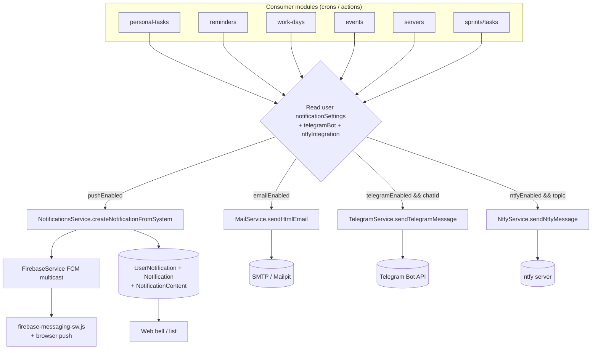
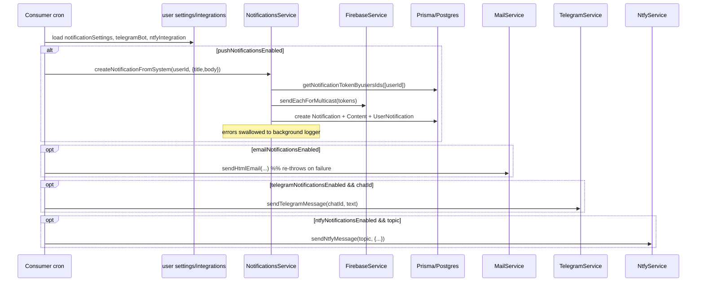

# Dossier 12 — Notifications (multi-channel)

## 1. Identity
- **One-line purpose:** Persist in-app notifications and fan a single message out across up to four delivery channels — in-app (DB), web push (Firebase FCM), email, Telegram, and ntfy — each gated by per-user settings.
- **Backend source root(s):**
  - `tdg-management-api-backend/src/notifications/**` (owns in-app + push, token registration, sender/receiver read models).
  - `tdg-management-api-backend/src/common/firebase/**` (FCM push).
  - `tdg-management-api-backend/src/common/mail/**`, `src/common/telegram/**`, `src/common/ntfy/**` (the three "side" channels — invoked by consumer modules, not by NotificationsModule).
- **Frontend source root(s):**
  - `tawer-management-frontend/src/modules/notifications/**`
  - `tawer-management-frontend/src/components/layout/header/navbar-notifications.tsx` (bell dropdown)
  - `tawer-management-frontend/src/app/[locale]/dashboard/(auth)/notifications/{view,settings}/page.tsx`
  - `tawer-management-frontend/src/lib/firebase.ts`, `tawer-management-frontend/public/firebase-messaging-sw.js`
- **Owned DB tables/models:** `Notification`, `NotificationContent`, `NotificationToken`, `UserNotification` (`notification.schema.prisma`); `UserNotificationSettings` (`notification.schema.prisma`); `UserNtfyIntegration`, `UserTelegramBot` (`user.schema.prisma`); enum `ChannelType` (`reminders.schema.prisma`), enum `DeviceType` (`notification.schema.prisma`).

---

## 2. Purpose & business problem
The platform must reach users who are not looking at the web app: managers broadcasting announcements, and (mostly) automated reminders from crons (personal tasks, reminders, work-days, events, servers, sprints, tasks). Two distinct entry points exist:

1. **Admin/user-driven broadcast** — `POST /notifications` sends a titled/bodied notification (optional image) to a list of users or to everyone, persists it in-app, and pushes it via FCM (`notifications.service.ts:61`).
2. **System-driven per-user notification** — `NotificationsService.createNotificationFromSystem()` is the shared entry other modules call to notify one user (in-app + push) (`notifications.service.ts:100`). It is imported by events, personal-tasks, reminders, servers, sprints, tasks, work-days services (verified callers below).

The three "side" channels (email/Telegram/ntfy) are **not** orchestrated by NotificationsModule. Each consumer module reads the target user's `notificationSettings` + `telegramBot` + `ntfyIntegration` and calls `MailService` / `TelegramService` / `NtfyService` directly. This is a deliberate but decentralized design — see §4 and §10.

---

## 3. Domain model & database
Schema file: `tdg-management-api-backend/prisma/schema/notification.schema.prisma`.

### Core notification tables
- **`Notification`** (`notification.schema.prisma:14`) — the notification "envelope": `id`, `image?`, `sendBy?` (FK → `User`, `onDelete: Cascade`, nullable so system notifications may lack a human sender), timestamps. Has-many `NotificationContent` and `UserNotification`.
- **`NotificationContent`** (`:38`) — the translatable payload: `title`, `body`, `url?`, `language` (enum `Language`), FK `notificationId` (`onDelete: Cascade`). This is the **content-table i18n split** used across the codebase (dossier 02). WHY: one notification can carry per-language content rows; in practice only `Language.English` is ever written (`create-notification.repository.ts:46`) and only English is read back (`fetch-notifications.repository.ts:50,87`), so the split is **dormant** (consistent with dossier 02's `Language` single-value finding).
- **`UserNotification`** (`:1`) — the per-recipient join/inbox row: `isSeen` (default false), FK `notificationId?` (`onDelete: Cascade`), FK `userId` (`onDelete: Cascade`), `@@unique([notificationId, userId])` (`:11`). WHY: fan-out to N users = N `UserNotification` rows against one `Notification`; the unique guard makes `skipDuplicates` re-sends idempotent per user.
- **`NotificationToken`** (`:25`) — a device push token: `token @unique`, `userId?` (nullable — token can be registered before login), `device` (free string), `deviceType` (enum `DeviceType`), optional `deviceHeight`/`deviceWidth` `Decimal(30,3)`, timestamps. `onDelete: Cascade` on user.

### Settings / integration tables
- **`UserNotificationSettings`** (`:50`) — `userId @unique` (1-1 with User), booleans `emailNotificationsEnabled` (default **true**), `pushNotificationsEnabled` (default **true**), `telegramNotificationsEnabled` (default **false**), `ntfyNotificationsEnabled` (default **false**). WHY defaults: email+push opt-out, telegram+ntfy opt-in (they need extra setup).
- **`UserTelegramBot`** (`user.schema.prisma:44`) — `userId @unique`, `chatId?` (the per-user Telegram chat id; the bot token itself is a shared env secret, see §4).
- **`UserNtfyIntegration`** (`user.schema.prisma:53`) — `userId @unique`, `topic?`, `token?` (ntfy topic + optional access token).

### Enums
- **`DeviceType`** (`notification.schema.prisma:62`): `Ios | Android | Computer`.
- **`ChannelType`** (`reminders.schema.prisma:61`): `EMAIL | TELEGRAM | PUSH | NTFY`. NOTE: this enum lives in the reminders schema and is used by the reminders' `ReminderChannel` model, **not** by any table in this dossier's scope — no notification table references `ChannelType`. In the notifications domain, channels are represented as booleans on `UserNotificationSettings`, not as this enum.

### Constraints / cascade summary
Every child (`NotificationContent`, `UserNotification`, `NotificationToken`, settings, telegram, ntfy) cascades on user/notification delete, so deleting a `Notification` cleans up its content + inbox rows, and deleting a `User` cleans up all their notification state. There are **no** partial indexes or extra indexes on these tables beyond the PKs/uniques listed.

---

## 4. Backend architecture

### Layering (NotificationsModule)
Standard 4-layer pattern (controller → service → repository → dto), same as the rest of the codebase (dossier 01):
- **Controller** `notifications.controller.ts:52` — 6 routes, all behind `HasPermissionGuard`.
- **Service** `notifications.service.ts:23` — orchestration, error mapping, pagination math.
- **Repositories** — split by verb: `create-notification.repository.ts`, `fetch-notifications.repository.ts`, `update-notification.repositoty.ts` (filename typo preserved), `delete-notification.repository.ts`.
- **Module** `notifications.module.ts:15` — imports only `PrismaModule`, `FirebaseModule`, `TokensModule`, `UploadModule`, `AuthsModule`, `LoggerModule`. **It does NOT import Telegram/Ntfy/Mail modules** — hard evidence that NotificationsModule handles only in-app + push; the other three channels are owned by consumers.

### Service responsibilities
- **`createOrUpdateNotificationToken`** (`notifications.service.ts:35`) — forces `data.userId = req.user?.id` (always the caller), then upserts by `token` (`create-notification.repository.ts:11`). Maps Prisma `P2025` → `USER_NOT_FOUND`.
- **`createNotification`** (`:61`) — the broadcast path:
  1. Resolve tokens: all tokens if `sendToAllUsers`, else tokens for `usersIds` (`fetch-notifications.repository.ts:32,10`).
  2. Rewrite `data.usersIds` from the fetched tokens' `userId`s, set `senderId = req.user.id`.
  3. If a file was uploaded, set `data.image` to the stored path (`upload.service`).
  4. Push via FCM (`firebaseService.sendNotificationsToUsers`, absolute image URL built from `API_ADDRESS`).
  5. Persist one `Notification` + English `NotificationContent` + N `UserNotification` rows (`create-notification.repository.ts:35`).
  On any error, the uploaded image file is deleted and the error re-thrown (`:95`).
- **`createNotificationFromSystem`** (`:100`) — single-user variant used by crons/other modules: fetch that user's tokens, FCM push, persist in-app rows. **Fully swallows errors** into `BackgroundActivitiesLoggerService` (`:122`) so a failed notification never breaks the calling business flow.
- **`updateNotificationForUser`** (`:134`) — marks the caller's `UserNotification` rows seen via `updateMany` (`update-notification.repositoty.ts:8`).
- **`filterNotificationsForSender` / `filterNotificationsForUser`** (`:158`, `:185`) — paginated reads (sender view = `Notification` + recipient count; user view = `UserNotification` inbox, `isSeen` filter).
- **`deleteNotificationById`** (`:214`) — ownership-scoped: fetch image by `id AND sendBy=caller` (`findUniqueOrThrow`), delete the image file, then delete by `id AND sendBy` (`delete-notification.repository.ts:8`). `P2025` → `NOTIFICATION_NOT_FOUND`.
- **Pagination helpers** (`:244`, `:260`) — page defaults to 1; **limit is silently clamped to 30 when > 30, but a non-numeric or negative limit also becomes 30**, and there is no lower bound of 1 (a limit of `0` passes through as `0`).

### Channel services (`src/common/**`)
- **`FirebaseService.sendNotificationsToUsers`** (`firebase/service/firebase.service.ts:12`) — `messaging().sendEachForMulticast({ tokens, notification })`; logs per-token success/failure to `ErrorLoggerService`; catches and logs top-level errors — **never throws** (best-effort push). `FIREBASE_APP` is built from env (`firebase.module.ts:15`) and returns `null` on failure to avoid boot crash.
- **`MailService.sendHtmlEmail`** (`mail/service/mail.service.ts:18`) — Nest mailer, TDG HTML header/footer template, supports cc/bcc/attachments. Logs on error **and re-throws** (`:74`) — the **only** channel that propagates failure (inconsistent with the other three, see §13).
- **`TelegramService.sendTelegramMessage`** (`telegram/service/telegram.service.ts:13`) — GET to `{TELEGRAM_API_URL}/bot{TELEGRAM_BOT_TOKEN}/sendMessage?chat_id=...&text=...`. Single **shared** bot token from env; per-user routing via `chatId`. Swallows errors to the background logger.
- **`NtfyService.sendNtfyMessage`** (`ntfy/service/ntfy.service.ts:14`) — POST to `{NTFY_URL}/{topic}` with priority/title/tags/etc. headers. **Early-returns if `topic` is falsy** (`:16`). Swallows errors.

### Guards / validation
All 6 controller routes use `HasPermissionGuard` + `@Permissions([...])` (dossier 03 RBAC). DTO validation via global `ValidationPipe` — but note the app-wide **no-whitelist** finding (dossier 01/03) applies here too. `CreateNotificationDto` uses conditional validation: `usersIds` required unless `sendToAllUsers`, and `sendToAllUsers` required unless `usersIds` is non-empty (`create-notification.dto.ts:24,40`). Multipart `content` arrives as a JSON string and is parsed+revived via a `@Transform` (`:70`).

---

## 5. API surface
All routes are under `notifications` (`notifications.controller.ts:51`). All guarded by `HasPermissionGuard`.

| Method | Path | Auth/Perm | Request DTO | Response DTO | Validation | Business logic (1 line) | Side effects |
|---|---|---|---|---|---|---|---|
| PUT | `/notifications/token` | `notification.token.create` | `CreateNotificationTokenDto` (body); `userId` forced from JWT | `CreatedNotificationTokenDto` | `token` required non-empty; `deviceType ∈ DeviceType` | Upsert push token by `token`, bind to caller | DB upsert (`controller.ts:77`) |
| POST | `/notifications` | `notification.create` | `CreateNotificationDto` + `image` file | 204 No Content | `usersIds` XOR `sendToAllUsers`; content JSON parsed | Broadcast: resolve tokens → FCM push → persist notification+inbox | FCM send, DB writes, image stored/rolled-back (`:109`) |
| PATCH | `/notifications?notificationIds=a,b` | `notification.update` | query `notificationIds` (CSV → string[]) | 204 No Content | `ParseArrayPipe(String, ',')` | Mark caller's inbox rows seen | DB `updateMany` (`:145`) |
| GET | `/notifications/sent` | `notification.read.for.sender` | query `page`,`limit` | `PaginateSentNotificationsDto` | pagination coerced | List notifications the caller sent (+recipient count) | none (`:188`) |
| GET | `/notifications/received` | `notification.read.for.receiver` | query `isSeen`,`page`,`limit` | `PaginateReceivedNotificationsDto` | pagination coerced | List caller's inbox, optional seen filter | none (`:226`) |
| DELETE | `/notifications/:id` | `notification.delete` | param `id` | 204 No Content | — | Delete own notification (scoped by `sendBy`) + its image | file delete + DB delete (`:248`) |

**RBAC note (verified):** every one of these 6 permissions is in `DEFAULT_PERMISSIONS_FOR_ALL_ROLES` (`permissions.ts:225`). Therefore **any authenticated user (any of the 31 roles) can call `POST /notifications` with `sendToAllUsers: true` and broadcast to the entire company** — there is no service-level restriction. See §9.

---

## 6. Frontend
Module root: `tawer-management-frontend/src/modules/notifications/**`.

### Push token setup
- **`useNotificationsTokenSetup`** (`hook/use-notifications-token-setup.ts:11`) — mounted once in the header (`components/layout/header/index.tsx`). On a logged-in user with no stored FCM token: guards `messaging` (null during SSR), requests browser `Notification` permission, gets an FCM token, detects device, and `PUT /notifications/token` (`services/bg-notifications/tokens-setup.ts:22`). Also wires `onMessage` to invalidate the `["notifications"]` query so foreground pushes refresh the bell.
- **`lib/firebase.ts`** — client Firebase init from `NEXT_PUBLIC_FIREBASE_*` env; `messaging` is `null` on the server.
- **`public/firebase-messaging-sw.js`** — background push service worker; `onBackgroundMessage` shows a notification; click handler navigates to `payload.data.url` or `/`. **Firebase web config is hard-coded here** (`:4-12`) — apiKey/projectId/etc. literal (consistent with dossier 00's "hard-coded Firebase config"). This is a public web config (not a secret), but it is duplicated vs. the env-driven `lib/firebase.ts`.

### Reading notifications
- **`useNotifications`** (`hook/use-notifications.ts:15`) — TanStack Query key `["notifications", user, limit, status]`, calls `GET /notifications/received` (`services/notifications-extractions.ts:15`), maps `isSeen` filter (`isSeen=true/false`). `markNotificationsAsSeen()` PATCHes unseen ids then invalidates `["notifications"]` (`notifications-update.ts:15`).
- **`navbar-notifications.tsx:22`** — bell dropdown; unseen count = client-side `filter(!isSeen)`; opening the dropdown marks all seen. Links to `/dashboard/notifications`.
- **`components/notifications.tsx` (`UserNotifications`)** — full list page (`/notifications/view`), auto-marks seen on load, paginated.
- **`components/notification-container.tsx`** — one row; renders a `<Link>` to `notification.url` when present, else a plain div.

### Settings
- **`NotificationSettings`** (`components/notifications-settings.tsx:16`) at `/notifications/settings` — toggles Email / Telegram (with a `chatId` input) / ntfy (with setup steps + a copyable **`user.id` shown as the ntfy topic**, `:144`). Push is not toggled here.
- **`useNotificationsSettingsUpload`** (`hook/use-notifications-settings-upload.ts:9`) — builds `FormData` with `emailNotificationsEnabled`, `ntfyNotificationsEnabled`, `telegramNotificationsEnabled`, and `telegramChatId` (only when telegram on), then submits via `updatePersonalInfoOnServerSide` — i.e. through the **users/update-user** endpoint, **not** a notifications endpoint. Crucially it **never sends an ntfy `topic`** (see §13 finding).
- **`usePersonalNotificationsSettings`** (`hook/use-personal-notifications-settings.ts:9`) — reads settings straight off the cached current-user object; comment admits it "can be expanded in the future" (no dedicated fetch).

### State
- **`store/notifications-tokens.ts`** — Zustand store holding the FCM token (prevents re-registration).

---

## 7. Data flow & key scenarios

### Scenario A — Admin broadcast with image (`POST /notifications`, `sendToAllUsers: true`)
1. UI submits multipart form (content JSON + image) → `FileInterceptor('image')` stores the file (`controller.ts:106`).
2. `HasPermissionGuard` checks `notification.create` (passes for every role).
3. Service resolves **all** `NotificationToken`s (`fetch-notifications.repository.ts:32`), derives `usersIds`, sets `senderId`, computes image path.
4. `FirebaseService.sendEachForMulticast` pushes to every token (best-effort; per-token errors logged).
5. `createManyNotifications` writes one `Notification`, one English `NotificationContent`, and one `UserNotification` per user (`create-notification.repository.ts:35`).
6. `204`. On failure, the stored image is deleted and the error surfaces.

### Scenario B — System reminder fan-out (the real multi-channel path)
Illustrated by the personal-task reminder cron (`personal-tasks.service.ts` — dossier 08). For each target user the consumer checks settings and fans out:
- `pushNotificationsEnabled` → `NotificationsService.createNotificationFromSystem(userId, {title,body})` → persists in-app + FCM push (`notifications.service.ts:100`).
- `emailNotificationsEnabled` → `MailService.sendHtmlEmail(...)`.
- `telegramNotificationsEnabled && telegramBot.chatId` → `TelegramService.sendTelegramMessage(chatId, msg)`.
- `ntfyNotificationsEnabled && ntfyIntegration.topic` → `NtfyService.sendNtfyMessage(topic, {...})`.

**Key coupling:** in-app persistence lives **inside** `createNotificationFromSystem`, which is only called when `pushNotificationsEnabled` is true. So a user who disables push also loses the in-app inbox record for system notifications — in-app and push are not independently controllable (see §13).

### Scenario C — Mark seen
Bell opens / list mounts → `markNotificationsAsSeen()` collects unseen ids → `PATCH /notifications?notificationIds=...` → `updateMany({ id in ids, userId }, { isSeen:true })` → query invalidation refreshes badge.

---

## 8. Diagrams (Mermaid)

### 8.1 Multi-channel delivery pipeline (component)


### 8.2 Sequence — one system notification across channels


### 8.3 ERD slice
```mermaid
erDiagram
  User ||--o{ Notification : "sends (sendBy)"
  User ||--o{ UserNotification : receives
  User ||--o{ NotificationToken : "has devices"
  User ||--|| UserNotificationSettings : has
  User ||--|| UserTelegramBot : has
  User ||--|| UserNtfyIntegration : has
  Notification ||--o{ NotificationContent : "translations (English only)"
  Notification ||--o{ UserNotification : "fan-out (unique per user)"

  Notification { string id PK; string image; string sendBy FK }
  NotificationContent { string id PK; string title; string body; string url; Language language }
  UserNotification { string id PK; boolean isSeen; string notificationId FK; string userId FK }
  NotificationToken { string id PK; string token UK; DeviceType deviceType; string userId FK }
  UserNotificationSettings { string userId UK; boolean emailNotificationsEnabled; boolean pushNotificationsEnabled; boolean telegramNotificationsEnabled; boolean ntfyNotificationsEnabled }
  UserTelegramBot { string userId UK; string chatId }
  UserNtfyIntegration { string userId UK; string topic; string token }
```

---

## 9. Security
- **Authentication:** all 6 routes require a valid JWT via `HasPermissionGuard` (`controller.ts:57,89,123,160,196,234`). The Swagger note on token registration ("in case of guest user, userId is not required", `controller.ts:64`) is **misleading** — the guard blocks unauthenticated callers, so guest token registration is not actually reachable.
- **Authorization — broadcast gap (verified):** `notification.create` sits in `DEFAULT_PERMISSIONS_FOR_ALL_ROLES` (`permissions.ts:226`) with no additional service check, so **every authenticated role can broadcast to all users** (`sendToAllUsers`). Same class as the events `toAllUsers` spam vector (dossier 10), but here it is the whole endpoint. Impact: any employee can spam the company via in-app + push.
- **Ownership scoping (good):** `PATCH` (mark seen), `GET /sent`, `GET /received`, and `DELETE` all scope by the caller's id (`userId`/`sendBy` in the `where`), so a user cannot mark, read, or delete another user's notifications. Delete is doubly scoped (fetch + delete both filter `sendBy`).
- **Injection:** all queries are Prisma query-builder calls — **no raw SQL** in this module. Parameterization is inherent.
- **DTO whitelisting:** the global `ValidationPipe` runs **without `whitelist`** (dossier 01/03), so unknown body fields are not stripped. `NotificationToken`/`Notification` creates are field-mapped in the repositories, which limits mass-assignment blast radius, but the token DTO's `userId` is anyway force-overwritten from the JWT (`notifications.service.ts:40`) — good.
- **Push token trust:** tokens are stored keyed by `token @unique` and re-bound to whichever authenticated caller last `PUT`s them. A stale token previously owned by user A, if re-registered by user B's browser, rebinds to B (upsert `update: { userId }`) — acceptable, since FCM tokens are device-scoped.
- **Telegram secret:** a single shared `TELEGRAM_BOT_TOKEN` (env) fans out to all users via per-user `chatId`; message text is placed in the URL query string (`telegram.service.ts:17`) — fine for a GET bot API but means message content appears in any URL-logging middleware/proxy.
- **Gaps summary:** broadcast-to-all open to every role; no rate limiting on `POST /notifications` (dossier 03's global no-throttle applies); no validation that `usersIds` are real/authorized recipients (invalid ids simply produce no tokens).

---

## 10. Cross-module dependencies
- **NotificationsModule imports:** `PrismaModule`, `FirebaseModule`, `TokensModule`, `UploadModule`, `AuthsModule`, `LoggerModule` (`notifications.module.ts:25`). It **exports `NotificationsService`** (`:24`).
- **Depended on by (verified callers of `createNotificationFromSystem`):** `events`, `personal-tasks`, `reminders`, `servers`, `sprints`, `tasks`, `work-days` services. This makes `NotificationsService` a widely-shared in-app/push sink.
- **The three side channels are shared commons:** `MailService`, `TelegramService`, `NtfyService` are each provided by their own `common/*` module and injected directly into consumer services. `MailService` is also used by `all-exceptions.filter.ts` (dossier 01 — error alerting) and `servers.service.ts`.
- **Coupling observation:** there is **no single "notification dispatcher"**. The channel-selection logic (read settings → gate each channel → format per-channel message) is **duplicated in every consumer** (verified in `personal-tasks.service.ts`; the reminders/work-days/events dossiers describe the same shape). High cohesion inside NotificationsModule, but the multi-channel fan-out is a cross-cutting concern that has been copy-pasted rather than centralized — the biggest architectural weakness of the notification subsystem (see §14).
- **Settings write path lives in users/auths:** defaults are created at registration (`registration.repository.ts:20-36`), and the FE settings page updates them through the users update-user repository (`update-user-repository.ts` upserts `notificationSettings`/`telegramBot`/`ntfyIntegration`). So notification *config* is owned by the user module, while notification *delivery* is owned here — a deliberate split, but it means this dossier cannot fully own the settings lifecycle.

---

## 11. Tests
- `notifications.controller.spec.ts` (18 lines) and `notifications.service.spec.ts` (19 lines) are **skeleton `toBeDefined()` specs**. The service spec instantiates `NotificationsService` with `providers: [NotificationsService]` and **no mocked dependencies** (`notifications.service.spec.ts:8`) although the constructor injects 8 providers — Nest DI cannot resolve this, so the spec **fails to compile at runtime** (verified debt, same class as other dossiers' stale specs).
- Channel specs: `firebase.service.spec.ts`, `ntfy.service.spec.ts`, `telegram.service.spec.ts` are 18-line `toBeDefined()` stubs. `mail.service.spec.ts` (113 lines) is the **only real test** — it exercises `sendHtmlEmail` behaviour.
- **Coverage gaps:** no test of broadcast fan-out, token upsert, seen-marking, ownership scoping, pagination clamping, or the multi-channel gating logic. No e2e tests.
- Frontend: no test files were found under `src/modules/notifications/**`.

---

## 12. Code quality
- **Good:** verb-split repositories keep each Prisma call small and readable; the service consistently maps `P2025` to typed domain exceptions (`notifications.service.ts:52,148,235`); the broadcast path correctly rolls back the uploaded image on failure (`:95`).
- **Good:** channel services are thin, single-responsibility, and defensively catch/log so background jobs never crash (except MailService, intentionally).
- **Inconsistent error contract:** `MailService.sendHtmlEmail` re-throws (`mail.service.ts:74`) while Telegram/Ntfy/Firebase swallow — a caller that fans out to all four without `await`/try-catch can get an unhandled rejection only from mail (`:74`).
- **Naming:** file `update-notification.repositoty.ts` is misspelled ("repositoty"); harmless but visible.
- **Dead-ish i18n:** `NotificationContent` always writes/reads `Language.English` (`create-notification.repository.ts:46`, `fetch-notifications.repository.ts:50`) — the table's multi-language capability is unused (dossier 02 root cause).
- **Pagination helper** (`notifications.service.ts:244`) folds "invalid" and "too large" into the max (30) and does not floor at 1 — surprising but low-impact.

---

## 13. Verified technical debt
1. **`updateNotificationForUser` `P2025` branch is dead** — it wraps `updateMany` (`update-notification.repositoty.ts:12`), and Prisma `updateMany` **never throws `P2025`** on zero matches (it returns `{count:0}`). So the `NOTIFICATION_NOT_FOUND` mapping (`notifications.service.ts:144-152`) can never fire; marking non-existent/other-users' ids seen silently returns `204`. (Same class as dossiers 08/09 `deleteMany`→404 findings.)
2. **ntfy delivery is effectively broken by an unset topic** — the FE settings page instructs the user to subscribe to a topic equal to their **`user.id`** (`notifications-settings.tsx:144`), but nothing ever writes `user.id` into `UserNtfyIntegration.topic`. The topic is only set from `data.ntfyTopic` at registration (`registration.repository.ts:27`) or via `update-user` `ntfyTopic` — and the FE **never sends `ntfyTopic`** (`use-notifications-settings-upload.ts:40-44` sends only the boolean toggle). Result: `topic` stays null, and `NtfyService.sendNtfyMessage` early-returns on a falsy topic (`ntfy.service.ts:16`). Enabling ntfy in the UI therefore silently delivers nothing.
3. **In-app inbox coupled to push toggle** — system notifications persist `UserNotification` rows only inside `createNotificationFromSystem`, which consumers gate on `pushNotificationsEnabled`. Turning push off also removes the in-app record; there is no independent in-app switch (`personal-tasks.service.ts:252` pattern + `notifications.service.ts:100`).
4. **Broadcast open to every role** — `notification.create` in `DEFAULT_PERMISSIONS_FOR_ALL_ROLES` with no service gate (`permissions.ts:226`); any user can `sendToAllUsers` (see §9).
5. **Decentralized fan-out duplication** — channel-selection/formatting logic is re-implemented in every consumer module (verified in personal-tasks) instead of a shared dispatcher; a new channel or a settings-semantics change must be edited in ~7 places (§10).
6. **Inconsistent channel error contract** — MailService re-throws while the other three swallow (`mail.service.ts:74` vs telegram/ntfy/firebase) (§12).
7. **Failing skeleton specs** — `notifications.service.spec.ts` cannot resolve DI (§11).
8. **Hard-coded FCM web config in the service worker** — `public/firebase-messaging-sw.js:4-12` duplicates config that `lib/firebase.ts` reads from env (public config, not a secret, but a maintenance hazard). (Dossier 00 finding, confirmed.)
9. **Filename typo** `update-notification.repositoty.ts` (§12).
10. **Pagination limit not floored at 1** and conflates invalid/oversized inputs into 30 (`notifications.service.ts:244`).

---

## 14. Strengths / Weaknesses / Improvements

**Strengths**
- Clean 4-layer separation and typed error mapping make the module easy to read (impact: low onboarding cost).
- Best-effort channel services never crash background jobs (except deliberate mail re-throw) — resilient delivery (impact: a dead FCM token never breaks a cron).
- Ownership scoping on read/update/delete is correct and consistent (impact: no cross-user notification leakage).
- Content-table + per-recipient `UserNotification` design scales fan-out cleanly with idempotent re-sends (`@@unique([notificationId,userId])`).

**Weaknesses**
- ntfy is wired end-to-end in the UI but never actually deliverable due to the missing topic (debt #2) — a feature that looks complete but is inert (impact: user enables it, silently gets nothing).
- No central dispatcher → multi-channel logic duplicated and drift-prone (debt #5) (impact: inconsistent messages/settings semantics across modules).
- Broadcast authorization gap (debt #4) (impact: company-wide spam by any user).
- In-app inbox cannot be controlled independently of push (debt #3) (impact: users lose their notification history if they disable push).
- Near-zero automated coverage (debt #7) (impact: regressions in fan-out go undetected).

**Improvements (concrete)**
- Introduce a single `NotificationDispatcherService` that takes `(userId|users, payload, channels?)`, loads settings once, and fans out — replacing the per-consumer copy-paste; keep `createNotificationFromSystem` as its in-app/push arm.
- On enabling ntfy, set `UserNtfyIntegration.topic = user.id` server-side (or have the settings upload send the topic) so the UI instruction matches storage; validate topic non-null before claiming ntfy is enabled.
- Split in-app from push (`inAppNotificationsEnabled`) or always persist the `UserNotification` regardless of push, so history survives.
- Restrict `notification.create` to executive/manager roles (move it out of `DEFAULT_PERMISSIONS_FOR_ALL_ROLES`) and add throttling.
- Swap `updateMany`→a real not-found check, or drop the dead `P2025` mapping; unify the channel error contract; fix the failing spec DI.

---

## 15. Verification Checklist
| Area | Verified? | Evidence or reason if not |
|---|---|---|
| Domain model (7 models + enums) | Yes | `notification.schema.prisma`, `user.schema.prisma:44-61`, `reminders.schema.prisma:61` |
| Backend service logic | Yes | `notifications.service.ts` read in full |
| Repositories (create/fetch/update/delete) | Yes | all four repo files read in full |
| Every endpoint (6) | Yes | `notifications.controller.ts` read in full; perms cross-checked in `permissions.ts:225-230` |
| Channel services (FCM/mail/telegram/ntfy) | Yes | all four `common/*/service/*.service.ts` read in full |
| Multi-channel fan-out (consumer pattern) | Partial | Verified via `personal-tasks.service.ts:249-298`; other consumers assumed same shape (their dossiers 08/09/10/11 corroborate) — not re-read here |
| Settings write path | Yes | Registration defaults (`registration.repository.ts:20-36`) + FE upload (`use-notifications-settings-upload.ts`) + `update-user-repository.ts:18-29` (ntfy topic written only when `data.ntfyTopic` present) all read |
| Frontend pages/components/hooks | Yes | all FE notification module files + navbar + SW read |
| Security (authz gap, ownership, injection) | Yes | perms map + service `where` clauses read |
| Tests | Yes | all spec files inspected (line counts + content) |
| Tech debt items | Yes | each cited to file:line |
| Live delivery (FCM push actually received; ntfy/telegram end-to-end) | No | runtime not exercised — read-only analysis |

## 16. Not verified / Open questions
- **Whether any out-of-band process (seed/migration/manual) sets `UserNtfyIntegration.topic`** — none found in scope. Debt #2 is otherwise fully verified: the only write paths are `registration.repository.ts:27` and `update-user-repository.ts:18-29`, both keyed on `data.ntfyTopic`, which the settings UI never sends; nothing writes `user.id` as the topic despite the UI instructing the user to use it.
- **Runtime confirmation** that FCM multicast succeeds with the configured credentials, that the service worker registers, and that Telegram/ntfy actually deliver — none exercised (read-only session).
- **`ChannelType` enum consumers** — confirmed it is used by reminders' `ReminderChannel`, not by notification tables; its full role belongs to dossier 11.
- **Load/fan-out at scale** — `getAllNotificationTokens()` fetches every token for a broadcast with no batching; behaviour with thousands of tokens vs. FCM's 500-token multicast limit not verified.
- **`notifications/page.tsx` is empty** — the `/dashboard/notifications` route target (linked from the bell "view all") renders nothing here; the actual list lives at `/notifications/view`. Whether the bell link is therefore broken was not runtime-verified.
```
