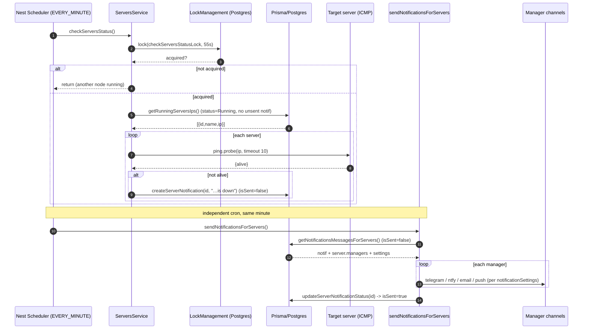
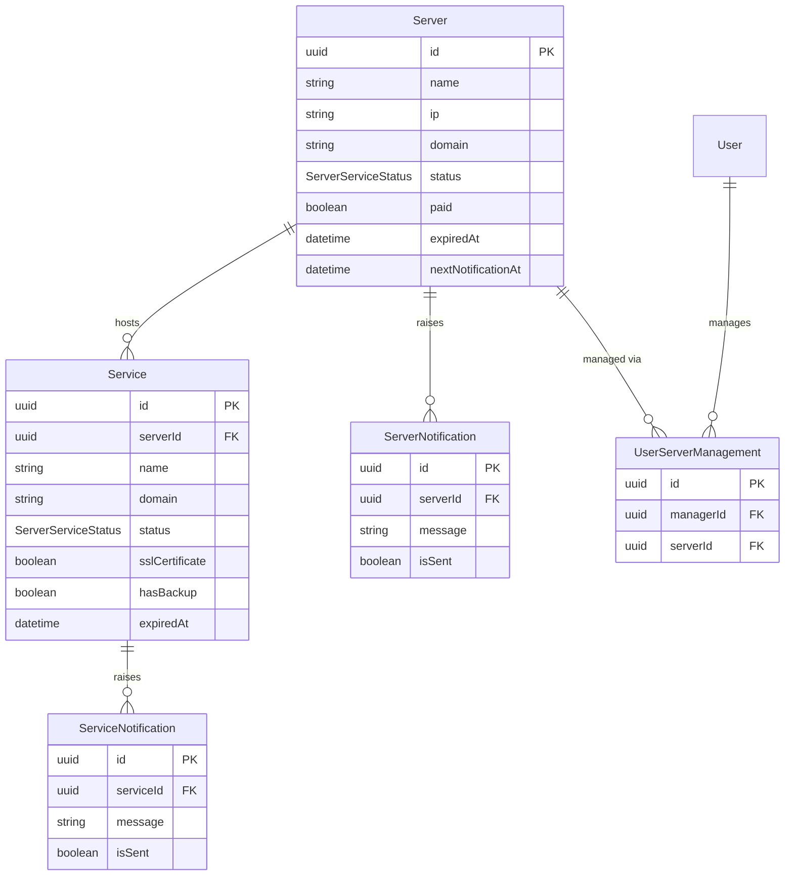
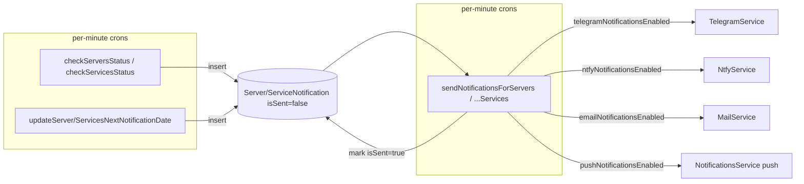

# Dossier 13 — Infrastructure Monitoring

## 1. Identity
- One-line purpose: register the company's **servers** and the **services** hosted on them, poll their reachability + expiry, and alert the assigned managers over 4 channels when something is down or a subscription is about to expire.
- Backend source root(s): `tdg-management-api-backend/src/servers/**` (controller, service, 4 repositories, DTOs) + `tdg-management-api-backend/src/health/**` (liveness endpoint).
- Frontend source root(s): `tawer-management-frontend/src/modules/infrastructure/**` + pages `tawer-management-frontend/src/app/[locale]/dashboard/(auth)/infrastructure/{servers,services}/**`.
- Owned DB tables/models: `Server`, `Service`, `ServerNotification`, `ServiceNotification`, `UserServerManagement`, enum `ServerServiceStatus` — all in `prisma/schema/servers.schema.prisma:1-87`.

## 2. Purpose & business problem
The company runs its own infrastructure (VPS/bare-metal + hosted services such as the NestJS API, PostgreSQL, Redis, MinIO — see the seed at `prisma/seed.ts:279-324`). This module is the internal CMDB + uptime/expiry monitor: it records each server's capacity (cpu/ram/storage/bandwidth/ip), each service's SSL/backup posture, and who is responsible (`managers`). Six per-minute cron jobs in `ServersService` then (a) ICMP-ping every running server, (b) HTTP-probe every running service, and (c) watch `expiredAt` to warn before a paid subscription lapses — turning findings into `ServerNotification` / `ServiceNotification` rows that a separate fan-out cron delivers to the responsible managers via Telegram / ntfy / e-mail / push (`src/servers/services/servers.service.ts:490-731`).

## 3. Domain model & database
Source: `prisma/schema/servers.schema.prisma:1-87`.

**Server** (`:1-24`) — infra host. Fields: `id` (uuid PK), `name`, `domain?`, `description?`, `ip` (required), `cpus?`, `ram?`, `storage?`, `bandwidth?` (all capacity is free-text `String`, not numeric — `:7-10`), `backupCloudProvider` bool default false, `paid` bool default false, `status ServerServiceStatus` default `Running` (`:13`), `paidAt?`, `expiredAt?`, `nextNotificationAt?` (`:14-16`), timestamps. Relations: `notifications ServerNotification[]`, `services Service[]`, `managers UserServerManagement[]`. `@@index([id])` (`:23`) — **redundant**, `id` is already the PK and auto-indexed (flagged the same way in dossier 02).

**Service** (`:36-57`) — a workload hosted on one server. Fields mirror Server for billing/status (`paid`, `status` default `Running`, `paidAt?`, `expiredAt?`, `nextNotificationAt?`) plus service-specific: `sslCertificate` bool, `sslCertificateByCloudProvider` bool, `hasBackup` bool, `backupDestination?`, `domain?`. `serverId` FK → `Server` **`onDelete: Cascade`** (`:53`) so deleting a server deletes its services. `@@index([serverId])` (`:56`).

**ServerNotification / ServiceNotification** (`:26-34`, `:59-67`) — the alert **outbox**. Each holds `message` (String), `isSent` bool default false (`:30`, `:63`), timestamps, and an FK to its parent with `onDelete: Cascade`. `isSent=false` is the "pending delivery" flag that couples the detector crons to the sender crons (see §7).

**UserServerManagement** (`:69-81`) — N-N join between `User` and `Server` ("who is responsible for this server"). `@@unique([managerId, serverId])` prevents duplicate assignment; both FKs `onDelete: Cascade`; indexed on both sides. **Note:** managers are attached to *servers only* — there is no per-service manager relation; a service's responsible people are its server's managers (relied upon by the fan-out, `fetch-server.repository.ts:352-397`).

**enum ServerServiceStatus** (`:83-87`): `Running | Stopped | Maintenance`. Shared by both Server and Service.

Design notes / WHY:
- Capacity fields are `String?` (e.g. `"8 vCPUs"`, `"32 GB"`) — chosen for display flexibility, at the cost of being un-queryable/un-aggregatable.
- `status` is **descriptive metadata set by humans**, not a live health state — the health-check crons never write `status` (verified §7); they only emit notifications. So `status=Running` means "we consider this in service", not "it is currently reachable".
- There is **no `lastHealthCheck` / uptime-history column** anywhere in the schema (grep of the schema file confirms). The health checks are stateless and leave no persisted trace beyond a down-notification. (The session brief mentioned `lastHealthCheck`; it does **not** exist.)
- `nextNotificationAt` is a single scalar per row that the expiry cron ratchets forward through escalating bands (§7) — there is no separate schedule table.

## 4. Backend architecture
Standard 4-layer pattern (controller → service → repositories → Prisma), consistent with dossiers 01/05/07.

- **`ServersController`** (`src/servers/controllers/servers.controller.ts`) — 10 routes, all `@UseGuards(HasPermissionGuard)` + `@Permissions([...])`, all wrapped in `ClassSerializerInterceptor` + `@SerializeOptions({ type: <Dto> })` so responses are shaped/whitelisted by the response DTO (this is what neutralises the app-wide missing ValidationPipe `whitelist` for *output*).
- **`ServersService`** (`src/servers/services/servers.service.ts`, 784 lines) — holds both the request-handling methods and **all 6 cron jobs**. Authorization is decided here (not in the guard) by two role helpers:
  - `isCTO(req)` (`:739-743`) — write-scope gate: only `UserType.CTO` gets global write; everyone else is manager-scoped.
  - `getCTOOrCEO(req)` (`:733-737`) — read-scope gate: `CTO` **or** `CEO` get global read; everyone else is manager-scoped.
  Manager-scoping is implemented by threading `req.user.id` as a `managedById`/`managerId` filter into the repository `where` (`:281-334`, `:143-232`).
- **Repositories** — split by verb: `CreateServerRepository`, `FetchServerRepository`, `UpdateServerRepository`, `DeleteServerRepository`. All use the Prisma query builder (no raw SQL → no injection surface here). `Fetch` also exposes the cron read-models (`getRunningServersExpiration`, `getRunningServersIps`, `getRunningServicesDomains`, `getNotificationsMessagesFor{Servers,Services}`).
- **Module wiring** (`src/servers/servers.module.ts`) imports Prisma, Auths, Tokens, Logger, Mail, Telegram, Ntfy, Users, Notifications, LockManagement — i.e. it directly depends on all 4 delivery channels + the distributed lock (§7, §10).
- **Cross-cutting** — `LockManagementService` (Postgres `Locking` row, `FOR UPDATE SKIP LOCKED`, per dossier 01) guards every cron; `BackgroundActivitiesLoggerService` swallows + logs cron errors so a failure never crashes the scheduler.
- **`HealthController`** (`src/health/controller/health.controller.ts:6-24`) — a single **unguarded** `GET /health` returning `{ status: 'ok', timestamp }`. It is *not* an infra-monitoring endpoint; it is this API's own liveness probe (registered directly in `app.module.ts:80`, there is no `HealthModule`).

Layering deviation: **business authorization lives in the service, not the guard** — the `HasPermissionGuard` only checks the coarse permission string; the own-vs-any narrowing (CTO/CEO/manager) is service code. Same convention as dossiers 03/05/07.

## 5. API surface
Controller: `src/servers/controllers/servers.controller.ts`. All routes require `Authorization: Bearer <access>` and the listed permission via `HasPermissionGuard`.

| Method | Path | Permission | Request DTO | Response DTO | Validation | Business logic (1 line) | Side effects |
|--------|------|-----------|-------------|--------------|------------|-------------------------|--------------|
| POST | `/servers` | `server.create` | `CreateServerDto` | `CreatedServerDto` | class-validator on DTO | create server; if `expiredAt` set, seed `nextNotificationAt = expiredAt−14d`; attach `managersIds` | inserts `Server` + N `UserServerManagement` (`:56-80`, svc `:96-104`) |
| POST | `/servers/services` | `service.create` | `CreateServiceDto` | `CreatedServiceDto` | DTO | CTO → create; else must manage `serverId`; maps `P2003`→SERVER_NOT_FOUND | inserts `Service` (`:82-107`, svc `:106-131`) |
| PATCH | `/servers/:id` | `server.update` | `UpdateServerDto` | `UpdatedServerDto` | DTO | CTO global / else manager-scoped; re-seeds `nextNotificationAt` if `expiredAt`; **replaces** manager set | updates `Server`, deleteMany+createMany managers (`:109-138`, svc `:133-162`, repo `:10-69`) |
| PATCH | `/servers/services/:id` | `service.update` | `UpdateServiceDto` | `UpdatedServiceDto` | DTO | CTO global / else "manager-scoped" — **crashes for non-CTO, see §13-B1** | updates `Service` (`:140-169`, svc `:164-186`) |
| DELETE | `/servers/:id` | `server.delete` | — | 204 | — | CTO global / else manager-scoped hard delete | deletes `Server` (+cascade services/notifs/managers) (`:171-188`) |
| DELETE | `/servers/services/:id` | `service.delete` | — | 204 | — | CTO global / else "manager-scoped" — **crashes for non-CTO, see §13-B1** | deletes `Service` (`:190-207`) |
| GET | `/servers` | `server.read.many` | `PaginationParametersRequestDto` (+`name`) | `PaginateServersDto` | DTO | CTO/CEO all servers / else only managed; name substring filter | none (`:209-249`, svc `:307-334`) |
| GET | `/servers/services` | `service.read.many` | `FilterServicesParamsDto` (`serversIds`, `name`) | `PaginateServicesDto` | DTO; `serversIds` CSV→array | CTO/CEO all / else scoped by `server.managers`; filter by `serversIds`/`name` | none (`:251-292`, svc `:277-305`) |
| GET | `/servers/:id` | `server.read.by.id` | — | `ServerDetailsDto` | — | CTO/CEO any / else must manage; includes `services[]` + `managers[]`; `P2025`→SERVER_NOT_FOUND | none (`:294-314`, repo `:191-244`) |
| GET | `/servers/services/:id` | `service.read.by.id` | — | `ServiceDetailsDto` | — | CTO/CEO any / else must manage parent server | none (`:316-336`) |
| GET | `/health` | **none (public)** | — | `{status,timestamp}` | — | liveness probe | none (`src/health/controller/health.controller.ts:7-23`) |

Route-ordering note: static `services` / `services/:id` routes are declared **before** the `:id` catch-alls, so `GET /servers/services` correctly resolves to `filterServices` (not `getServerById('services')`) — ordering is intentional and correct.

## 6. Frontend
Module `src/modules/infrastructure/**`, two pages under `.../dashboard/(auth)/infrastructure/`.

- **Pages** — `servers/page.tsx` + `render.tsx` and `services/page.tsx` + `render.tsx`. Each render gates on `hasPermissions(user.roles, "serversManagement"|"servicesManagement", "view")` → `<AccessDenied/>` (`servers/render.tsx:16`), and conditionally shows the "add" dialog on the `"add"` permission (`:22`).
- **List** — `components/servers/servers-list.tsx` — TanStack-Table with columns name/domain/ip/cpus/ram/storage/status/paid + row actions (view/edit/delete gated by `edit`/`delete` perms, `:179-192`). Status rendered as a coloured `Badge` (`Running→success, Stopped→destructive, Maintenance→warning`, `:136-141`). Bulk-delete via `useElementsDeletion("server")`. Services list is analogous.
- **Data fetching** — `hooks/extractions/servers.ts` `useServers` (React Query key `["infrastructure","servers", user, page, locale, search, serverStatuses,...]`, `limit` **defaults 100** but list passes `20`, `placeholderData` keep-previous, refetch-on-focus off). Service `services/extractions/servers.ts` builds the querystring and calls `GET /servers` with a 401→`refreshToken` retry.
- **Forms** — `react-hook-form` + Zod. `validations/servers.schema.ts` requires name/domain/description/ip/cpus/ram/storage/bandwidth/status **and `managers` (min 1)**; `dto/requests/servers.ts:cleanServerDataToUpload` maps form `managers`→backend `managersIds`. Service schema (`validations/services.schema.ts`) requires only name/status/serverId; domain optional.
- **Upload service** — `services/uploads/server.ts` POSTs `/servers` (create) or PATCHes `/servers/:id` (edit); maps backend `P2000`→"Server already exist" toast (`:34-36`).
- **Response mapping** — `dto/responses/servers.ts:castToServerType` reshapes the API row; the backend `ServerManagerDto` (`dto/response/fetch/server-manager.dto.ts:5-59`) already flattens `{manager:{…}}`→`{id,name,email,phone,image}` via `ClassSerializerInterceptor`, so the FE consumes a flat `ManagerType[]` and the edit form correctly pre-selects managers (`components/servers/upload/form.tsx:58`).
- **UX flow** — user opens Servers page → table lists servers they may see → "Add server" dialog (capacity + managers multiselect + paid/expiry dates) → on submit invalidates `["infrastructure"]` query. There is **no live status/uptime indicator** in the UI (status is the manually-set enum badge only); alerts are delivered out-of-band (telegram/mail/push), not surfaced on these pages.

## 7. Data flow & key scenarios

### 7.1 Server health-check cycle (the module's headline scenario)
`checkServersStatus` cron, `servers.service.ts:490-519`:
1. Every minute, try to acquire the Postgres lock `checkServersStatusLock` (TTL 55s, `:493-498`); bail if another instance holds it.
2. `getRunningServersIps()` (`fetch-server.repository.ts:281-293`) → servers where `status = Running` **AND** `notifications: { none: { isSent: false } }` — i.e. skip any server that already has an *undelivered* down-alert (dedup).
3. For each, `ping.promise.probe(ip, { timeout: 10 })` (ICMP, `:502`).
4. If `!res.alive` → `createServerNotification(server.id, "…is down.")` (`:504-507`) — inserts a `ServerNotification{isSent:false}`. **Status is never changed; nothing is written on success.**
5. A *separate* cron `sendNotificationsForServers` (`:555-642`) picks up `isSent:false` rows, fans out to each manager's enabled channels, then flips `isSent:true` (`:619`). Only then does the server become eligible for re-checking in step 2 — so a persistently-down server re-alerts roughly once per delivery cycle.

### 7.2 Service health-check cycle
`checkServicesStatus` (`:521-553`) is the HTTP analogue: `getRunningServicesDomains()` returns `Running` services with `domain != null` and no pending notification; `checkHttp(domain)` (`:773-783`) does `axios.get(url,{timeout:20000, validateStatus:()=>true})` and treats `status <= 500` as alive (so a `500` counts as *up*, but `502/503/504` count as *down*); network errors → down. Down → `createServiceNotification`.

### 7.3 Expiry escalation
`updateServerNextNotificationDate` (`:336-416`) / `updateServicesNextNotificationDate` (`:418-488`), every minute: fetch rows with `expiredAt != null` and no pending notification; compute days-to-expiry and whether `nextNotificationAt` has passed; on a band boundary create a notification with an escalating message and push `nextNotificationAt` forward. Bands: **<14&≥7d**, **<7&≥4d**, **<4&≥1d**, **<1&≥0d** (server has the final "expired" band; **services stop at <4&≥1d** — no `<1` branch, an asymmetry). The initial `nextNotificationAt` is seeded at create/update time to `expiredAt−14d` (svc `:96-104`).

## 8. Diagrams (Mermaid)

### 8.1 Health-check cycle (sequence)

### 8.2 ERD slice

### 8.3 Alert fan-out (component)

## 9. Security
- **AuthN**: every `/servers*` route carries `HasPermissionGuard`; `/health` is intentionally public.
- **AuthZ (RBAC)**: permission strings under `PERMISSIONS.INFRA` (`src/common/constants/permissions.ts:71-82`). Holders in `PERMISSIONS_FOR_ROLE`:
  - **CTO** — full CRUD on servers+services (`:478-487`).
  - **DevopsEngineer** — server CRUD + service update/delete + all reads, but **no `SERVICE_CREATE`** (`:770-779`) — an asymmetry: a devops can delete/update services but not create them.
  - **CEO** — **read-only** (server/service read-many + by-id, `:395-398`).
  - All other roles — none (infra keys absent from their blocks).
- **Object-level scoping** (service layer): reads use `getCTOOrCEO` (global for CTO/CEO, else `server.managers.some(managerId=self)`); writes use `isCTO` (global for CTO, else manager-scoped). So a DevopsEngineer can only mutate servers they are a manager of.
- **Injection**: all queries are Prisma builder — no raw SQL, parameterised by construction.
- **DTO validation**: class-validator on every body DTO, but the app has **no global `ValidationPipe({whitelist:true})`** (established in dossiers 01/03). Unknown body keys are silently ignored on write because repositories field-map explicitly (`create-server.repository.ts:10-58`), so mass-assignment is blunted for infra specifically. Output is whitelisted by the response DTOs + `ClassSerializerInterceptor`.
- **Gaps (verified):**
  1. **FE/BE RBAC divergence** — FE `role-permissions.tsx` grants `serversManagement/servicesManagement: fullAccess(ALL)` to **CEO** (`:16-17`) and `viewOnly` to **customerSupport** (`:132-133`), but the BE gives CEO read-only and customerSupport nothing. Result: those users see Add/Edit/Delete controls (or the whole page) that the API rejects with 403. Cosmetic-but-misleading, not a data leak.
  2. **`createServer` has no object-level authz at all** (`servers.service.ts:96-104`) — any role holding `server.create` (CTO, DevopsEngineer) can create a server and is *not* auto-added as a manager, so the creator may immediately lose write access to their own server unless they put themselves in `managersIds`.
  3. `deleteServer`/`deleteService` are **hard deletes** (`delete-server.repository.ts:8-24`) cascading to services + notifications + manager rows — no soft-delete, no audit trail.

## 10. Cross-module dependencies
Imports (`servers.module.ts:19-31`): `PrismaModule`, `AuthsModule`+`TokensModule` (guard/JWT), `LoggerModule` (`BackgroundActivitiesLoggerService`), `MailModule`, `TelegramModule`, `NtfyModule`, `NotificationsModule` (push via `createNotificationFromSystem`), `UsersModule`, `LockManagementModule`. This module is a **heavy consumer**: it wires all four notification channels + the distributed lock directly. It reads user notification prefs from `NotificationSettings`, `UserTelegramBot`, `UserNtfyIntegration` (the same models dossier 12 owns) through nested Prisma selects (`fetch-server.repository.ts:310-397`). Nothing depends *on* this module — it is a leaf domain (no other module imports `ServersService`). Coupling to channels is high but cohesive (all in service of alerting).

## 11. Tests
- `src/servers/services/servers.service.spec.ts` — stub only: instantiates the service with **no providers** and asserts `toBeDefined()`; it would not even compile at runtime against the real DI graph, but as written it just checks the class exists.
- `src/servers/controllers/servers.controller.spec.ts` — **broken/copy-pasted**: imports and names `UsersController` (`import { UsersController } from './servers.controller'`) while the file exports `ServersController` — the symbol does not exist, so this spec is dead. (`:2,9-12`.)
- **No tests** cover authorization scoping, the 6 crons, ping/http probing, expiry-band math, or the delivery fan-out.
- FE: no dedicated infrastructure test files found.

## 12. Code quality
- **Good**: verb-split repositories keep the service readable; consistent lock-then-work cron template; explicit field-mapping in repos (safe against mass-assignment); response DTOs (`ServerManagerDto`) cleanly flatten the join for the FE.
- **Duplication**: the four expiry bands are copy-pasted almost verbatim between the server and service crons (`servers.service.ts:361-404` vs `443-476`) and the entire fan-out body is duplicated between `sendNotificationsForServers` and `sendNotificationsForServices` (`:568-631` vs `657-720`) — one channel-dispatch helper would remove ~120 duplicated lines.
- **Misleading names**: `getRunningServersExpiration`/`getRunningServicesExpiration` do **not** filter by `status=Running` (only `expiredAt!=null` + no unsent notif, `fetch-server.repository.ts:246-279`) — the "Running" in the name is wrong.
- **Fire-and-forget**: fan-out sends are not awaited and `updateServerNotificationStatus` is called via `.catch()` without `await` (`:619-630`) — `isSent` can flip before/independently of actual delivery; a channel failure is logged but the alert is still marked sent (no retry).
- **Copy-paste artifacts**: `UpdateServiceDto.managers?: string[]` (`dto/request/update/update-service.dto.ts:88-96`) is never read by `updateService` (services have no managers) — dead field; `UpdateServerDto.ip` is `@IsOptional()` yet typed non-optional `ip: string` (`update-server.dto.ts:44-46`).

## 13. Verified technical debt

**B1 — non-CTO service update/delete throws 500 (broken code path).**
`updateService`/`deleteService` build a Prisma `where` of `{ id, managers: { some: { managerId } } }` on the **`Service`** model (`update-server.repository.ts:74-76`, `delete-server.repository.ts:20-22`), but `Service` has **no `managers` relation** (`servers.schema.prisma:36-57`; managers live on `Server`). For any non-CTO caller this yields a `PrismaClientValidationError`, which is **not** `P2025`, so it escapes the NotFound mapping and surfaces as a 500. Reachable today: **DevopsEngineer** holds `service.update`/`service.delete` (`permissions.ts:777-778`) and is not CTO, so every service edit/delete by a devops fails. Correct scope would be `{ id, server: { managers: { some: { managerId } } } }` (as the *read* paths already do, `fetch-server.repository.ts:60-72`).

**B2 — service health check almost certainly reports every service as down.**
`checkHttp` calls `axios.get(service.domain)` with a **schemeless** domain (seed stores `domain: 'api.tawer.tn'`, `prisma/seed.ts:297,318`; DTO example `api.example.com`). `axios.get('api.tawer.tn')` has no protocol → axios throws → caught → returns `false` → a down-notification is created every cycle. Needs `https://` (or `http://`) prepended before the request. *(Verified from code + seed; not executed at runtime.)*

**B3 — `SERVICE_CREATE` non-CTO branch is dead code.**
`createService` for non-CTO calls `checkManagerAccessToServer` (`servers.service.ts:110-118`), but the **only** role holding `service.create` is CTO (`permissions.ts:482`; DevopsEngineer conspicuously lacks it, `:770-779`), so the guard never lets a non-CTO reach that branch. Either grant devops `SERVICE_CREATE` (intended?) or drop the branch.

**B4 — alert spam / no acknowledgement.**
A down or expiring resource generates a fresh notification every delivery cycle (dedup only holds while `isSent=false`); there is no cooldown, no "already alerted" state, and no way to acknowledge/silence. Combined with B2 this would flood managers.

**B5 — cron message uses `Africa/Tripoli` / manual timezone assumptions** in response DTOs (`server-summary.dto.ts:104,116`) — hard-coded zone, consistent with the timezone smells flagged in dossiers 09/10.

**B6 — redundant `@@index([id])` on `Server`** (`servers.schema.prisma:23`) — PK already indexed (same finding as dossier 02's `Server @@index`).

**B7 — broken/stub specs** (see §11): the controller spec references a non-existent `UsersController`.

## 14. Strengths / Weaknesses / Improvements

**Strengths**
- Clean 4-layer separation with verb-split repositories → easy to read; matches the codebase convention (impact: maintainability).
- Distributed-lock-guarded crons → safe to run multiple API replicas without double-alerting (impact: horizontal scalability).
- Outbox pattern (`isSent` notification rows) decouples detection from delivery and gives natural dedup while an alert is pending (impact: resilience).
- Multi-channel alerting reusing per-user `NotificationSettings` → managers get alerts where they already are (impact: operator UX).

**Weaknesses**
- **B1** makes service edit/delete unusable for the very role (DevopsEngineer) meant to use it — the module's most likely operator hits a 500 (impact: feature broken in practice).
- **B2** likely makes the service uptime monitor emit constant false "down" alerts (impact: monitor untrustworthy).
- Health checks never persist state → no uptime %, no history, no dashboard signal; `status` is a manual label, not live (impact: limited observability).
- Heavy code duplication across the 4 crons (impact: change-amplification, drift risk — service band already diverges from server band).
- Zero meaningful tests on authz/cron/probe logic (impact: regressions invisible).
- FE grants infra access (CEO/customerSupport) the API denies (impact: confusing UX, phantom buttons).

**Improvements (concrete)**
1. Fix B1: scope service writes through `server.managers` (one-line `where` change) and add a spec for non-CTO update/delete.
2. Fix B2: normalise `domain` to a URL (prepend scheme if missing) in `checkHttp`; add a health-probe unit test with a stubbed axios.
3. Persist health: add `lastHealthCheckAt` + `lastHealthStatus` (or a `HealthCheck` history table) and let checks update it; surface a live badge on the FE.
4. Extract a `dispatchToManagers(managers, message)` helper and a single `escalate(row, bands)` to kill the server/service duplication and stop band drift.
5. Add an alert cooldown / acknowledgement (`lastAlertedAt`, or don't re-create until N minutes) to prevent spam.
6. Reconcile FE `role-permissions.tsx` infra entries with `PERMISSIONS_FOR_ROLE` (CEO read-only, customerSupport none, devops no service-create).
7. Auto-add the creator to `managersIds` on `createServer`, or explicitly document that servers must have managers assigned to be manageable.

## 15. Verification Checklist
| Area | Verified? | Evidence / reason |
|------|-----------|-------------------|
| Domain model (5 models + enum, relations, cascades) | Yes | `prisma/schema/servers.schema.prisma:1-87` |
| Backend service logic (authz helpers, 6 crons) | Yes | `src/servers/services/servers.service.ts` fully read |
| Repositories (Prisma queries, cron read-models) | Yes | all 4 repo files read |
| Every endpoint (10 infra + /health) | Yes | `servers.controller.ts:56-336`, `health.controller.ts:7-23` |
| RBAC (which roles hold INFRA perms) | Yes | `permissions.ts:71-82,395-398,478-487,770-779` |
| Frontend pages/components/hooks/forms | Yes | `render.tsx`, `servers-list.tsx`, `upload/form.tsx`, hooks/services/dtos read |
| Security scoping & gaps | Yes (static) | code-verified; no pentest/runtime |
| Tech debt B1/B3/B6/B7 | Yes | code + schema cross-checked |
| Tech debt B2 (schemeless HTTP probe) | Partial | code + seed confirm schemeless domain; axios failure **not executed** |
| Tests | Yes | both specs are stubs/broken; no FE tests found |
| Live DB / cron runtime / ping+http behaviour | No | read-only session; nothing executed |

## 16. Not verified / Open questions
- **Runtime of B2**: I did not run the service to confirm `axios.get('api.tawer.tn')` throws — verified only by reading axios usage + confirming domains are stored schemeless. Would need to execute `checkServicesStatus` against seed data.
- **ICMP availability**: the `ping` npm package shells out to the OS `ping`; whether it works inside the deployment container (Docker/permissions) is untested — a failing probe throws and is swallowed by the cron's logger, so servers could silently never be checked.
- **Timezone correctness** of the expiry-band day math (`TimeService.calculateTimeDifferenceInDays`) at boundaries was not independently verified (delegated to `common/time`, dossier 09 territory).
- Whether the **CEO read-only / DevopsEngineer no-service-create** split is intentional product design or an oversight — cannot be confirmed from code alone (the FE assumes CEO has full access).
- `ServiceDetailsDto` / `PaginateServicesDto` internals were only spot-checked (`service-summary.dto.ts:1-20`); full field-by-field parity with the repo `select` was not exhaustively diffed.
- No live data on **how many** notifications the crons actually produce (spam magnitude of B4) — needs a running instance.
