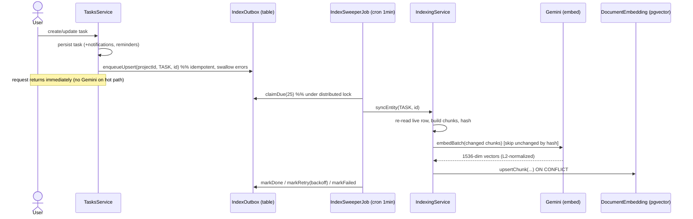
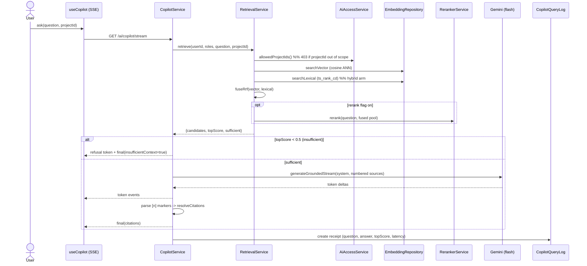
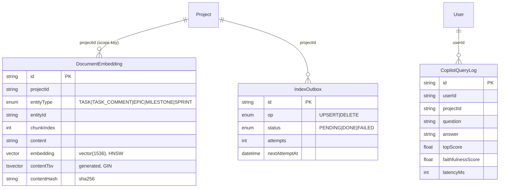

# Dossier 14 — AI Copilot & Estimation (RAG)

## 1. Identity
- **One-line purpose.** A permission-scoped Retrieval-Augmented-Generation subsystem: it embeds project
  content into pgvector, retrieves it with hybrid lexical+vector search, and uses Gemini to (a) answer
  grounded natural-language questions with citations ("copilot") and (b) estimate a draft task's effort
  from the real outcomes of similar completed tasks ("estimation").
- **Backend source root(s):** `tdg-management-api-backend/src/ai/**` (controller, 9 services, 2 repositories,
  1 cron job, eval harness) + `tdg-management-api-backend/src/common/gemini/**` (Gemini client + generation
  wrapper). Write-path producers live inside the task/epic/sprint/milestone services.
- **Frontend source root(s):** `tawer-management-frontend/src/modules/ai/**` (copilot panel + hook + SSE
  client, estimate suggestion + hook, citation chip). Mounted from
  `src/modules/projects/components/project-detail/project-detail.tsx:92` (copilot tab) and
  `.../project-task/project-task-upload.tsx:205` (estimate).
- **Owned DB tables/models:** `DocumentEmbedding`, `IndexOutbox`, `CopilotQueryLog`
  (`prisma/schema/ai.schema.prisma:2,25,45`); enums `EmbeddingEntityType`, `IndexOp`, `OutboxStatus`
  (`ai.schema.prisma:62,70,75`). Reads (never writes) `Task`, `TaskComment`, `Epic`, `Milestone`,
  `Sprint`/`SprintContent`, `Project`, `ProjectMember`, `User`.

---

## 2. Purpose & business problem
The module is the project's differentiator: it turns the management platform's own data into two assistive
features without a bespoke ML stack.

- **Copilot** answers "why did we choose X?", "what's blocking Y?" grounded **only** in retrieved project
  content, with clickable citations back to the exact task/comment — and refuses honestly when the corpus
  doesn't support an answer, rather than hallucinating (`copilot.service.ts:42-53`,
  `AiController.copilotQuery` `ai.controller.ts:58-80`).
- **Estimation** grounds an effort estimate for a *draft* task in the real `actualHours` of the most similar
  *completed* tasks (k-NN reference-class forecasting), so the suggestion is evidence-backed rather than a
  bare LLM guess (`estimation.service.ts:41-53`, `ai.controller.ts:114-138`).

Both are strictly **permission-scoped**: a user can only ever retrieve from projects they may access
(`ai-access.service.ts:5-20`). The design intent throughout is *honesty over coverage* — refuse, show the
band, cite the source (`copilot.service.ts:56-61`).

---

## 3. Domain model & database
Three tables, all in `ai.schema.prisma`, created by the raw migration
`migrations/20260705000000_add_pgvector_ai_tables/migration.sql` (Prisma cannot emit pgvector/tsvector).

**`DocumentEmbedding`** (`ai.schema.prisma:2-22`) — one embedded chunk of source content.
- `embedding Unsupported("vector(1536)")` (`:11`) — a native pgvector column. **Why 1536** and not the
  model's native 3072: Matryoshka truncation halves storage / speeds ANN with negligible quality loss
  (`embedding.service.ts:14-26`). Vectors are **L2-normalized in app code** because reduced-dim Gemini
  vectors are not pre-normalized, and cosine ANN needs unit vectors (`embedding.service.ts:120-127`).
- `contentTsv Unsupported("tsvector")?` (`:14`) — a `GENERATED ALWAYS AS (to_tsvector('english', content))
  STORED` column added in `migrations/20260707000000_add_fts_tsvector/migration.sql:16-18`. **Why generated
  + STORED:** it back-fills every existing row at migration time and self-maintains on write with no
  write-path change and no backfill.
- `contentHash` (`:15`) — sha256 of the exact embedded text, so an unchanged chunk skips the Gemini call
  (`indexing.service.ts:164-171`).
- Constraints: `@@unique([entityType, entityId, chunkIndex])` (`:20`) is the upsert key that makes
  re-indexing idempotent per chunk; `@@index([projectId, entityType])` (`:21`) supports the permission
  filter + entity-type filter.
- **Hand-built indexes** (Prisma-invisible): an **HNSW** cosine ANN index
  `USING hnsw (embedding vector_cosine_ops) WITH (m=16, ef_construction=64)`
  (`20260705000000_.../migration.sql:86-89`) and a **GIN** index on `contentTsv`
  (`20260707000000_.../migration.sql:21-23`).

**`IndexOutbox`** (`ai.schema.prisma:25-42`) — the async work queue ("(re)embed this entity").
- `@@unique([entityType, entityId])` (`:40`) collapses repeated edits into a single PENDING row — a task
  edited ten times before the sweep is embedded once (`outbox.repository.ts:27-51`).
- Backoff fields `nextAttemptAt` / `lastError` / `status`/`attempts` were added in
  `migrations/20260706000000_index_outbox_backoff/migration.sql`, which also swapped the covering index from
  `(status, createdAt)` to `(status, nextAttemptAt)` to match the claim query.

**`CopilotQueryLog`** (`ai.schema.prisma:45-60`) — one telemetry receipt per copilot call: `question`,
`answer`, `retrievedIds[]`, `topScore`, `citationsCount`, `promptTokens`, `latencyMs`, and a deferred
`faithfulnessScore` (null on the hot path, filled later by `backfill-faithfulness`). `@@index([userId,
createdAt])` (`:59`).

Enums: `EmbeddingEntityType = {TASK, TASK_COMMENT, EPIC, MILESTONE, SPRINT}` (`:62`) — the five indexed
content types; `IndexOp = {UPSERT, DELETE}` (`:70`); `OutboxStatus = {PENDING, DONE, FAILED}` (`:75`).

---

## 4. Backend architecture
Layering follows the project convention (`controller → service → repository`), with two Prisma-raw
repositories isolating the untypeable pgvector/tsvector SQL. Wiring: `AiModule` (`ai.module.ts:33-67`)
imports `PrismaModule`, `LoggerModule`, `GeminiModule`, `TokensModule`, `LockManagementModule`.

**Controller — `AiController`** (`ai.controller.ts`). 5 routes, each `@UseGuards(HasPermissionGuard)` +
`@Permissions([...])`. It is thin: it unpacks `req.user` and delegates. Notable: `copilot/stream` is an
`@Sse` GET returning `Observable<MessageEvent>` (`:91-106`); the rest are `@Post`/`@Get` with
`@HttpCode(200)`.

**Services (9):**
- `EmbeddingService` (`embedding.service.ts`) — Gemini `gemini-embedding-001` @ 1536 dims; batch (≤100),
  exponential-backoff retry on 429/5xx (`:67-118`), L2-normalize, sha256 hash. Pure provider.
- `IndexingService` (`indexing.service.ts`) — owns **chunking** (per entity type, ~2000-char chunks with
  300-char overlap, `:41-128`) and the write primitives `upsertEmbedding` (hash-skip unchanged chunks,
  delete stale trailing chunks, `:141-204`), `deleteEmbedding`, `syncEntity` (re-reads the live row so a
  stale queued edit uses fresh content, `:224-239`), `reconcile` (nightly drift/orphan repair, `:248-292`)
  and `reindexAll` (one-shot backfill, `:469-604`).
- `IndexOutboxService` (`index-outbox.service.ts`) — the write-path **seam**: `enqueueUpsert`/`enqueueDelete`
  are one-liners app write flows call; **enqueue failures are swallowed + logged** so an index enqueue can
  never break the task save that triggered it (`:42-58`).
- `RetrievalService` (`retrieval.service.ts`) — resolves permission scope, embeds the query, runs
  vector±lexical search, fuses with RRF, optionally reranks, and computes the confidence gate. Ranking mode
  is env-flagged (`HYBRID_DEFAULT` on, `RERANK_DEFAULT` off, `:94-96`).
- `RerankerService` (`reranker.service.ts`) — optional cross-encoder-style LLM reranker on
  `gemini-2.5-flash-lite`; retries the 429, falls back to the fused order on any failure (`:52-80`).
- `CopilotService` (`copilot.service.ts`) — RAG orchestration (retrieve → grounded prompt → generate →
  parse `[n]` citations → log), both JSON (`answer`, `:74-164`) and SSE (`answerStream`/`runStream`,
  `:177-330`).
- `EstimationService` (`estimation.service.ts`) — k-NN over completed tasks + similarity-weighted
  aggregation (`:76-260`).
- `AiAccessService` (`ai-access.service.ts`) — the single "which projectIds may this user retrieve from?"
  authority (`:44-72`).
- `TelemetryService` (`telemetry.service.ts`) — read-only rollup over `CopilotQueryLog` (`:35-91`).

**Repositories (2):** `EmbeddingRepository` (all raw pgvector/FTS SQL — `searchVector`, `searchLexical`,
`searchCompletedTaskNeighbors`, `upsertChunk`, `embedding.repository.ts`) and `OutboxRepository` (queue
CRUD — `enqueue`/`claimDue`/`markDone`/`markRetry`/`markFailed`, `outbox.repository.ts`).

**Cron — `IndexSweeperJob`** (`index-sweeper.job.ts`) — `@Cron(EVERY_MINUTE)` drains ≤25 due jobs;
`@Cron(EVERY_DAY_AT_3AM)` runs `reconcile`. Both take a Postgres distributed lock
(`aiIndexSweepLock`/`aiIndexReconcileLock`, `:46-51,57-62,83-88`) so only one instance sweeps — same pattern
as the reminder scheduler. Transient failures → exponential backoff (30s → ≤15min, `:132-140`); budget
exhausted (5 attempts) → FAILED.

**Gemini provider — `GeminiService`** (`common/gemini/services/gemini.service.ts`): `generateGrounded`
(temp 0.2, returns text + promptTokens, `:40-67`), `generateGroundedStream` (async generator, `:77-98`),
`generateContent` (plain, used by the faithfulness judge). The client is a `useFactory` provider keyed
`GEMINI_CLIENT` reading `GEMINI_API_KEY` (`gemini.module.ts:10-21`).

Error handling: retrieval throws `ForbiddenCustomException` on out-of-scope `projectId`
(`retrieval.service.ts:128-133`, `estimation.service.ts:97-102`); generation failure is caught and returns
an honest `UNAVAILABLE` sentinel rather than throwing (`copilot.service.ts:121-139`); telemetry writes are
wrapped so they never break the answer (`copilot.service.ts:550-573`).

---

## 5. API surface
All routes under `/ai`, all `@ApiBearerAuth` + `HasPermissionGuard`. Cited from `ai.controller.ts`.

| Method | Path | Auth/Perm | Request DTO | Response DTO | Validation | Business logic (1 line) | Side effects |
|---|---|---|---|---|---|---|---|
| POST | `/ai/copilot/query` | `TASKS.TASK_READ_MANY` (`:61`) | `CopilotQueryDto` | `CopilotAnswerDto` | `question` 3–1000, `projectId?` UUID | Grounded RAG answer w/ citations, or honest refusal | Writes `CopilotQueryLog` |
| GET (SSE) | `/ai/copilot/stream` | `TASKS.TASK_READ_MANY` (`:93`) | `CopilotStreamQueryDto` (query) | `text/event-stream` (`token`/`final`/`error`) | same shape, from query string | Streaming counterpart of `/query` | Writes `CopilotQueryLog` at stream end |
| POST | `/ai/estimate` | `TASKS.TASK_CREATE` (`:117`) | `EstimateTaskDto` | `EstimateResultDto` | `title` ≤500, `desc?` ≤10000, `storyPoints?` 1–100 | k-NN effort estimate from completed tasks | None (read-only) |
| POST | `/ai/admin/reindex` | `PROJECTS.PROJECT_CREATE` (`:148`) | — | `ReindexSummary` | — | Backfill/rebuild all embeddings (idempotent) | Many Gemini embed calls; writes `DocumentEmbedding` |
| GET | `/ai/telemetry` | `PROJECTS.PROJECT_CREATE` (`:167`) | — | `CopilotTelemetrySummary` | — | Copilot telemetry rollup for admin dashboard | None |

`projectId` semantics: **optional** on copilot (omitted = search every allowed project; supplied = narrow
to it, 403 if out of scope, `retrieval.service.ts:126-136`); **required** on estimate.

---

## 6. Frontend
Module `src/modules/ai`. React 19 / Next 16 / TanStack Query.

**Copilot** (mounted as a project-detail tab, `project-detail.tsx:91-93`):
- `CopilotPanel` (`copilot-panel.tsx`) — textarea + ask button; renders streamed answer with a blinking
  caret, then citation chips or an honest "not found" note when `insufficientContext`. Resets on project
  switch (`:38-41`). Enter submits, Shift+Enter newlines.
- `useCopilot` (`use-copilot.ts`) — drives the SSE stream via `AbortController`; `onToken` appends deltas,
  `onFinal` attaches citations, aborts stale streams on re-ask/project-switch (`:49-82`).
- `services/api/copilot.ts` — **`streamCopilot`** uses `fetch` + a manual SSE frame parser (not
  `EventSource`, so it can send `Authorization`) with one `refreshToken` retry on 401 (`:93-190`);
  `askCopilot` is the non-streaming JSON client (`:48-68`) — **present but unused by the panel** (the panel
  uses only the stream; `askCopilot` remains for parity/eval).
- `CitationChip` (`citation-chip.tsx`) — deep-links by rewriting the URL `tab`/`taskId` params; TASK /
  TASK_COMMENT open the tasks tab + task sheet, epic/milestone/sprint switch tabs; snippet on hover.

**Estimation** (inline in the create/edit task form, `project-task-upload.tsx:205`):
- `EstimateSuggestion` (`estimate-suggestion.tsx`) — renders "≈ Xh (low–high) · N pts — based on TASK-a…"
  with a one-click apply; hides until enough title text; honest empty/error states (`:51-90`).
- `useTaskEstimate` (`use-task-estimate.ts`) — TanStack Query around `POST /ai/estimate`, debounced 600ms,
  gated on `title.length ≥ 4`, 5-min `staleTime`, `retry:false` (`:31-55`).

No Zustand store; both features are local component state + React Query. The stream client reads
`process.env.BACKEND_ADDRESS` directly (`copilot.ts:103`).

---

## 7. Data flow & key scenarios

**Scenario A — index a task (write → outbox → embedding).** A task create/update calls
`indexOutboxService.enqueueUpsert(projectId, TASK, taskId)` alongside its other side effects
(`tasks.service.ts:952,1163`); delete calls `enqueueDelete` (`:1212`); a new comment enqueues
`UPSERT TASK_COMMENT` (`:1409`). The enqueue is a single idempotent upsert into `IndexOutbox`
(`outbox.repository.ts:39-50`) — no Gemini call on the request path. Every minute `IndexSweeperJob.sweep`
takes the lock, claims ≤25 due rows (`index-sweeper.job.ts:64`), and for each `syncEntity` re-reads the
live source row, rebuilds chunks, embeds only hash-changed chunks, and upserts them
(`indexing.service.ts:224-239` → `upsertEmbedding:141-204`). Success → `markDone`; transient failure →
`markRetry` with backoff; budget exhausted → `markFailed`. Nightly `reconcile` re-queues any source newer
than its embedding and enqueues DELETEs for orphaned embeddings (`indexing.service.ts:248-292`).

**Scenario B — copilot query (retrieve → rerank → ground → cite).** `CopilotService.answer`
(`copilot.service.ts:74`) → `RetrievalService.retrieve` resolves `allowedProjectIds`
(`ai-access.service.ts:44`), embeds the question as `RETRIEVAL_QUERY`, runs the vector arm
(`searchVector`, cosine `<=>`) always plus, in hybrid mode, the lexical arm (`searchLexical`,
`ts_rank_cd`), fuses them with RRF (`fuseRrf`, `retrieval.service.ts:233-248`), optionally reranks. If the
best **cosine** score < `MIN_CONFIDENCE` (0.5) → `sufficient:false` and the copilot **refuses without
calling the model** (`copilot.service.ts:95-112`). Otherwise it builds a numbered-sources prompt
(`buildPrompt:346-361`), calls `generateGrounded` (system/user split for injection safety), detects the
refusal sentinel, parses `[n]` markers back to entities and batch-resolves labels/deep-links
(`resolveCitations:379-423`, `resolveEntityLabels:433-535`), and writes a `CopilotQueryLog`. The SSE path
`runStream` (`:194-330`) is identical but streams `token` events and delivers citations in a `final` event.

**Scenario C — estimate a draft.** `EstimationService.estimate` (`:76`) enforces scope, embeds
`title\ndescription` as a query, and calls `searchCompletedTaskNeighbors` (k-NN over `status='DONE' AND
actualHours>0` tasks, `DISTINCT ON (t.id)` nearest chunk, `embedding.repository.ts:225-256`). If the
project yields `< 3` neighbors it widens to the same business unit (`:119-135`). `predictFromNeighbors`
(`:176-260`): with draft story points + pointed neighbors → **size-aware** = draft points × weighted
hours-per-point percentile (median, 10/90 band); otherwise → **size-agnostic** weighted median of
`actualHours` (25/75 IQR band) + weighted-mode story points. Neighbors are always returned as evidence.

---

## 8. Diagrams (Mermaid)

### 8.1 Index-a-task (write-path → outbox → embedding)

### 8.2 Copilot query (hybrid retrieve → rerank → ground → cite)

### 8.3 ERD slice (AI tables)

Note: `DocumentEmbedding.entityId` / `IndexOutbox.entityId` are **soft** references (a bare id column, no FK)
because they are polymorphic across five entity types; referential integrity is maintained by the write-path
producers + nightly reconciliation, not by the database.

---

## 9. Security
**Strengths (verified):**
- **Retrieval permission scoping enforced in SQL.** `AiAccessService.allowedProjectIds`
  (`ai-access.service.ts:44-72`) resolves scope (CEO→all, CTO→TawerDev, CMO→TawerCreative, others→their
  `ProjectMember` rows) and every search applies `projectId = ANY($allowedIds)` **before** ranking
  (`embedding.repository.ts:157,204,246`). There is no code path that can surface a chunk from a project the
  user cannot access; an out-of-scope explicit `projectId` 403s (`retrieval.service.ts:128-133`). Cross-role
  leak testing reported 0 out-of-scope hits in both arms (`docs/ai-hybrid-rerank-eval.md:67-70` — cited,
  independently consistent with the SQL).
- **Endpoint RBAC** via `HasPermissionGuard`: copilot=`TASK_READ_MANY`, estimate=`TASK_CREATE`,
  reindex/telemetry=`PROJECT_CREATE` (executive-only) (`ai.controller.ts:61,93,117,148,167`).
- **Prompt-injection boundary.** The system instruction and the retrieved (untrusted) sources are passed in
  separate turns, and the instruction explicitly says to treat source text as data and never follow
  instructions inside it (`copilot.service.ts:334-344`, `gemini.service.ts:32-38`, same in the reranker
  `reranker.service.ts:121-131`). Low temperature (0.2) for faithful answers.
- **DTO validation** (`class-validator`) bounds every input (question 3–1000, storyPoints 1–100, UUIDs)
  (`copilot-query.dto.ts`, `estimate-task.dto.ts`).
- **No SQL injection surface** despite raw SQL: every raw query uses parameterized `$queryRaw`/`$executeRaw`
  tagged templates or `Prisma.sql` fragments; the lexical arm parses user input with
  `websearch_to_tsquery`, which tolerates arbitrary text without throwing
  (`embedding.repository.ts:194-209`). The only string-interpolated value is the app-built vector literal
  (numbers only, `toVectorLiteral:49-51`).

**Gaps / risks (verified):**
- **Access control is project-level, not entity-level.** Any content in an allowed project is retrievable;
  there is no per-task/per-comment visibility check. Consistent with the tasks module's project-scoped
  authz, but if finer-grained task visibility is ever added, retrieval would over-share. (No evidence of
  finer visibility today.)
- **`CopilotQueryLog` stores `question` + full `answer` in plaintext** with no retention policy
  (`ai.schema.prisma:45-58`) — the answer embeds project content. A privacy/retention concern for an audit.
- **Gemini client can be `null`.** The factory returns `null` if construction throws
  (`gemini.module.ts:12-19`); a missing/invalid `GEMINI_API_KEY` would surface as a runtime NPE inside the
  services rather than a clean startup failure.
- **Confidence gate is vector-cosine-only.** `sufficient` is derived solely from the top **cosine** score
  (`retrieval.service.ts:154-155,198`), so a bare-keyword query the *lexical* arm answers perfectly but the
  *dense* arm scores < 0.5 will still be refused — the copilot answer path does not fully inherit hybrid's
  keyword win (see §13). Not a leak, but a correctness/UX gap.

---

## 10. Cross-module dependencies
- **Imports:** `PrismaModule`, `LoggerModule` (`BackgroundActivitiesLoggerService` for all background
  logging), `GeminiModule`, `TokensModule`, `LockManagementModule` (distributed lock for the crons)
  (`ai.module.ts:34-40`). Reads Prisma models owned by tasks/agile/projects/users.
- **Depended on by:** `TasksService`, `EpicsService`, `SprintsService`, `MilestonesService` inject
  `IndexOutboxService` to enqueue index jobs on write (confirmed producers in
  `tasks.service.ts:952/1163/1212/1409`, `epics.service.ts:172/341/396`, and the sprints/milestones
  services). This is the module's only inbound coupling and it is deliberately thin (fire-and-forget
  one-liners), so a failure in AI indexing cannot break a task/epic save.
- `AiModule` `exports` most services (`ai.module.ts:56-66`) but only `IndexOutboxService` is actually
  consumed elsewhere; the rest are exported speculatively.
- **Cohesion** is high (one subsystem, one concern); **coupling** to the domain is loose (write-path seam +
  read-only Prisma queries), which is the right shape.

---

## 11. Tests
- **No Jest unit/e2e specs exist for `src/ai/**`.** (The only `common/gemini` spec is
  `gemini.service.spec.ts`, outside this module's services.) Retrieval, RRF fusion, the confidence gate,
  citation parsing, weighted-percentile aggregation, and outbox state transitions are **unverified by
  automated tests**.
- Instead the module ships a substantial **offline evaluation harness** under `src/ai/eval/` (run via
  `npm run ai:eval:*`, `package.json:20-25`) — this is measurement, not regression testing, but it is the
  de-facto quality gate:
  - `run-retrieval-eval.ts` — Recall@k / Precision@k / MRR / nDCG@k over gold questions, comparing
    `baseline`(vector) / `hybrid` / `hybrid-rerank` and ablations (`wrong-task-type`, `dims-3072` via an
    in-memory re-embedding retriever, `retrievers.ts:65-111,195-297`).
  - `run-qa-eval.ts` — faithfulness (LLM-judge), citation precision/recall vs `mustCite`, and refusal
    correctness on answerable vs deliberately-unanswerable questions.
  - `run-estimation-eval.ts` — leave-one-out MAE/RMSE/within-±25% of the k-NN predictor vs baselines
    (project-mean, story-points OLS), plus IQR-band calibration.
  - `backfill-faithfulness.ts` / `telemetry-summary.ts` — deferred judge scoring + telemetry rollup.
  - Gold sets are committed JSONL: `qa.jsonl` (10 Q), `retrieval.jsonl` (12 Q), `retrieval-keyword.jsonl`
    (10 Q) with stable human-readable refs resolved by `RefResolver` (`refs.ts`).
- **Reported eval results** (`docs/ai-hybrid-rerank-eval.md`, cited — a doc, not re-run here): on the
  keyword gold set hybrid lifts MRR 0.570→1.000 and R@1 0.300→1.000 over vector-only; on the semantic set
  all three configs tie (small 73-chunk corpus, bi-encoder already saturated at MRR 0.958). The doc itself
  flags a **quota caveat**: the QA/faithfulness pass could not be re-run (Gemini free-tier daily quota
  exhausted), so those answer-quality numbers are older than the M5 retrieval numbers.

---

## 12. Code quality
- **Separation of concerns is excellent.** Embedding (provider), chunking/indexing, outbox seam, retrieval,
  reranking, generation orchestration, access control, and telemetry are each a single-responsibility class;
  raw SQL is quarantined in two repositories. This is the cleanest module in the codebase reviewed so far.
- **Docstrings are unusually thorough and honest** — they explain *why* (e.g. Matryoshka truncation,
  RRF `k=60`, the band-widening calibration `estimation.service.ts:209-215`) and cross-reference the plan
  sections.
- **Consistent error posture**: user-facing paths degrade to honest sentinels; background paths log via
  `BackgroundActivitiesLoggerService` and never throw into a user request (`index-outbox.service.ts:48-58`,
  `copilot.service.ts:550-573`).
- **Good idioms**: idempotency by content hash + upsert key; distributed lock reuse; env-flag ablation
  seams; batch DB lookups grouped by entity type in `resolveEntityLabels` (one query per type, not per
  chip).
- Minor: `AiModule` over-exports (§10); `askCopilot` FE client is dead relative to the panel (§6);
  `reindexAll`/`reconcile` load whole tables into memory (fine for the current corpus, not for scale).

---

## 13. Verified technical debt
1. **Comment edits and deletes are not enqueued on the write path.** Only comment *create* enqueues
   (`tasks.service.ts:1409`); there is no `enqueueUpsert`/`enqueueDelete` for `TASK_COMMENT` on edit/delete
   (grep of `src/tasks` finds only the one comment enqueue). Task delete explicitly defers comment cleanup
   to the nightly job (`tasks.service.ts:1210-1214`). **Impact:** an edited comment stays stale, and a
   **deleted** comment stays retrievable and citable, for up to ~24h until `reconcile` runs — the copilot
   can cite content that no longer exists, and its `resolveEntityLabels` will then fail to deep-link it
   (`copilot.service.ts:472-484`).
2. **Confidence gate ignores the lexical arm.** `sufficient` uses only the top cosine score
   (`retrieval.service.ts:154-155`), so bare-keyword queries where the dense embedder scores < 0.5 are
   refused even when the lexical arm found an exact match — the copilot *answer* path under-delivers the
   hybrid retrieval win proven in the eval.
3. **Cancelled SSE streams are not logged.** `runStream` returns on `isCancelled()` before writing the
   `CopilotQueryLog` in the success path (`copilot.service.ts:306`), so aborted streams (common: re-ask /
   project switch) leave no receipt and skew telemetry toward completed calls.
4. **Prompt truncation vs chunk size mismatch.** Sources are cut to `maxSourceChars=1200`
   (`copilot.service.ts:63,354-355`) but chunks can be ~2000 chars; a citation can point to text the model
   never fully saw. Cosmetic for grounding, but the snippet/preview can diverge from what was reasoned over.
5. **Reranker defaults omitted candidates to score 0** (`reranker.service.ts:170-180`) — if the judge forgets
   an index, that candidate is demoted rather than kept at its fused rank.
6. **`GEMINI_CLIENT` may be `null`** on missing key (§9) — no fail-fast.
7. **Unbounded in-memory scans** in `reindexAll` (`indexing.service.ts:500-596`) and `reconcile`
   (`:392-460`) — every task/comment/epic/milestone/sprint loaded at once; acceptable now, a scale ceiling.
8. **`askCopilot` FE client unused** by the panel (`services/api/copilot.ts:48`) — dead relative to the
   streaming path.
9. **No automated tests** for any AI service (§11).

---

## 14. Strengths / Weaknesses / Improvements
**Strengths**
- Security-first retrieval: permission scope enforced *in SQL* before ranking → structurally leak-proof at
  the project boundary. Impact: the headline safety property is not "checked" but "unrepresentable."
- Honest-by-design UX: confidence-gated refusal, honest `UNAVAILABLE` on provider failure, evidence-backed
  estimates with an uncertainty band. Impact: no confident hallucinations, which is the whole risk with RAG.
- Robust async freshness: outbox seam (never blocks the user request) + backoff sweeper + nightly
  self-healing reconciliation. Impact: index stays fresh without coupling AI latency to task saves.
- Genuine, reproducible evaluation harness with ablations and gold sets. Impact: retrieval-quality claims
  are measured, not asserted — rare in a PFE.
- Exceptional code hygiene and self-documentation.

**Weaknesses**
- Comment freshness gap (deleted comments citable up to 24h) — the one property that breaks the "never cite
  something that doesn't exist" promise (§13.1).
- Copilot answer path doesn't fully inherit hybrid's keyword strength because the sufficiency gate is
  cosine-only (§13.2).
- Zero unit tests around subtle maths (RRF, weighted percentile, citation parsing).
- Telemetry blind spots (cancelled streams unlogged; plaintext logs, no retention).

**Improvements (concrete, feasible)**
- Enqueue `TASK_COMMENT` UPSERT on comment edit and `DELETE` on comment/task delete (mirror the task
  producers) — closes §13.1 without waiting for reconcile.
- Make `sufficient` consider "any arm produced a hit above its own threshold" (or a floor on lexical rank),
  so keyword queries answer instead of refusing (§13.2).
- Log the `CopilotQueryLog` receipt in a `finally`/on-cancel path (§13.3).
- Add unit tests for `fuseRrf`, `weightedPercentile`, `resolveCitations`, and outbox transitions — pure
  functions, cheap to cover.
- Fail fast if `GEMINI_CLIENT` is null at boot; add a retention/redaction policy for `CopilotQueryLog`.

---

## 15. Verification Checklist
| Area | Verified? | Evidence or reason if not |
|---|---|---|
| Domain model (3 tables, enums, pgvector/tsvector) | Yes | `ai.schema.prisma:2-79`; migrations `20260705`, `20260706`, `20260707` |
| HNSW + GIN indexes | Yes | `20260705000000_.../migration.sql:86-89`; `20260707000000_.../migration.sql:21-23` |
| Backend layering & services | Yes | read all 9 services + 2 repos + cron + controller |
| Every endpoint (5) | Yes | `ai.controller.ts` each route read; perms/DTOs confirmed |
| Retrieval permission scoping | Yes | `ai-access.service.ts:44-72`; `embedding.repository.ts:157,204,246` |
| Hybrid + RRF + reranker | Yes | `retrieval.service.ts:168-248`; `reranker.service.ts:52-119` |
| Estimation aggregation | Yes | `estimation.service.ts:176-293`; `embedding.repository.ts:225-256` |
| Outbox seam + sweeper + reconcile | Yes | `index-outbox.service.ts`, `outbox.repository.ts`, `index-sweeper.job.ts`, `indexing.service.ts:224-292` |
| Write-path producers | Yes | `tasks.service.ts:952/1163/1212/1409`; `epics.service.ts:172/341/396` (sprints/milestones by grep) |
| Frontend (copilot + estimate) | Yes | all 7 `modules/ai` files read; wiring at `project-detail.tsx:92`, `project-task-upload.tsx:205` |
| Eval harness | Yes | all eval scripts + libs read; gold line counts (10/12/10) confirmed |
| Reported eval numbers | Partial | cited from `docs/ai-hybrid-rerank-eval.md`; not independently re-run (needs Gemini quota + DB) |
| Tests | Yes (as absence) | no `*.spec.ts` under `src/ai/**` |
| Tech debt items | Yes | each cited above |
| Live behaviour (real Gemini calls, HNSW recall, cron timing) | No | requires a running stack + API key + seeded DB |

## 16. Not verified / Open questions
- **Live end-to-end behaviour** — no Gemini API key / running Postgres in this session, so actual embedding
  output, ANN recall, streaming, refusal thresholds in practice, and cron cadence were read but not executed.
- **The QA/faithfulness eval numbers** — the M5 doc itself states they could not be re-run under the
  free-tier daily quota (`ai-hybrid-rerank-eval.md:78-82`); only the retrieval half is fresh. Confirming the
  copilot answer-quality figures needs a live run once quota resets.
- **Sprint/Milestone write-path producers** — confirmed via grep that `sprints.service.ts` and
  `milestones.service.ts` call `enqueueUpsert`/`enqueueDelete`, but I did not read the exact call sites (out
  of session scope; owned by dossiers 06).
- **`ai-backfill.ts` script** (`prisma/ai-backfill.ts`, referenced by `package.json:20`) — not read; assumed
  to call `IndexingService.reindexAll`, unverified.
- **HNSW `ef_search` / query-time recall tuning** — the build params (`m=16, ef_construction=64`) are set,
  but no runtime `ef_search` is configured in the query path; effect on recall not measured.
- **Whether `reconcile` at 3AM contends with other 3AM crons** (reminders, work-day auto-close use the same
  lock manager but different lock keys) — no evidence of contention, not load-tested.
