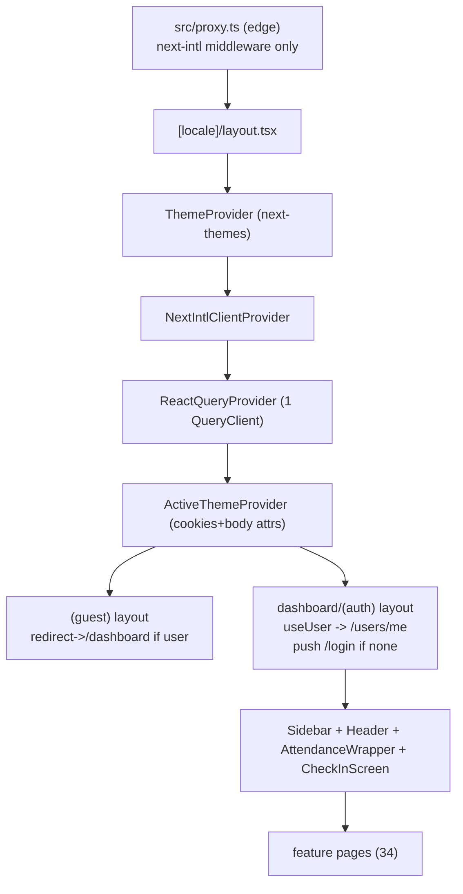
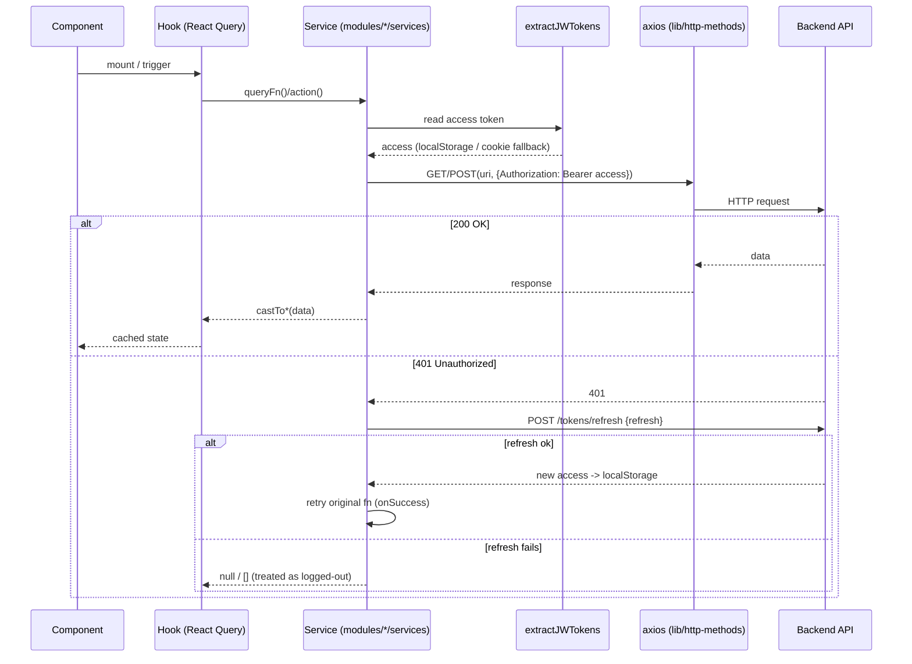

# Dossier 15 — Frontend Architecture (app-wide)

> Scope: the **shared** frontend architecture only (routing, i18n, providers, data-fetching,
> global state, API/auth layer, forms, theming, error boundaries). Per-module UI is documented in
> each domain dossier (04–14) and is not re-documented here. All paths are relative to
> `tawer-management-frontend/`.

## 1. Identity

- **One-line purpose:** The Next.js 16 App-Router SPA-over-SSR shell that hosts every domain module —
  it owns routing, localization, the React-Query/Zustand data layer, the axios+JWT API layer, theming,
  and the client-side auth gate.
- **Backend source root(s):** none (this dossier is frontend-only; the API it talks to is
  `tdg-management-api-backend`, base URL `http://localhost:3001`, `next.config.ts:9`).
- **Frontend source root(s):**
  - `src/app/**` — App Router (routing, layouts, route groups, error/loading/not-found).
  - `src/i18n/**`, `messages/{en,fr}.json` — next-intl localization.
  - `src/lib/**` — cross-cutting libs (`http-methods`, `firebase`, `parse-backend-date`, `fonts`, `ga`, `themes`, `localstorage`).
  - `src/utils/**` — providers + pure helpers (`providers/react-query-provider`, `custom-error`, `backend-locale`, date/format).
  - `src/hooks/**` — app-wide hooks (`use-backend-locale`, `use-pagination`, `use-mobile`, `use-file-upload`, …).
  - `src/proxy.ts` — the edge middleware entry (Next 16 renamed `middleware.ts` → `proxy.ts`).
  - `src/modules/**` — 10 feature modules; `modules/projects/**` is the canonical module used below to illustrate the shared per-module pattern.
  - `src/components/**` — shared shadcn/Radix UI kit + layout (sidebar/header) + error/loader components.
- **Owned DB tables/models:** none (frontend).

## 2. Purpose & business problem

The frontend is a single authenticated dashboard for the whole management platform: projects, tasks,
agile backlog, calendar, users/teams, infrastructure, notifications, AI copilot, attendance. It exists
to give ~31 role types a single localized (EN/FR) web client over the ~146-endpoint API. The
architecture's job is to make every domain module look and behave the same way, so this dossier
documents the *conventions a new engineer must know to read any module* rather than any single feature.

The whole app renders under one authenticated shell (`src/app/[locale]/dashboard/(auth)/layout.tsx:32-55`:
sidebar + header + attendance wrapper), with a small unauthenticated island (`(guest)` group) for
login/register/forgot-password.

## 3. Domain model & database

Not applicable — the frontend owns no tables. Its "model" is:
- **Server state** = React-Query caches keyed by string-arrays (e.g. `["user-data", pathname]`
  `src/modules/auth/hooks/users/use-user.ts:11`; `["projects", backendPage, serverKey]`
  `src/modules/projects/hooks/projects/use-projects.ts:89`).
- **Client/UI state** = per-module Zustand stores (dialog/tab/view flags, current user, auth refresher).
- **Persisted client state** = `localStorage` keys `access` / `refresh` (JWTs) and theme cookies.

Backend↔frontend type contracts are hand-written per module under `modules/*/types/**` and mapped via
`castTo*` functions (e.g. `castToUserType`, `src/modules/auth/services/users/user-details-extraction.ts:5,16`).

## 4. Frontend architecture (the shared layers)

### 4.1 Tech stack (from `package.json`)
| Concern | Library | Version | Evidence |
|---|---|---|---|
| Framework | `next` (App Router) | ^16.1.1 | `package.json:97` |
| UI runtime | `react` / `react-dom` | ^19.2.3 | `package.json:101,104` |
| i18n | `next-intl` | ^4.5.6 | `package.json:98` |
| Server-state | `@tanstack/react-query` | ^5.90.11 | `package.json:55` |
| Client-state | `zustand` | ^5.0.5 | `package.json:122` |
| Forms | `react-hook-form` + `@hookform/resolvers` | ^7.58.1 / ^5.1.1 | `package.json:106,24` |
| Validation | `zod` | ^3.25.67 | `package.json:121` |
| HTTP | `axios` | ^1.13.2 | `package.json:80` |
| Theming | `next-themes` | ^0.4.6 | `package.json:99` |
| Styling | `tailwindcss` v4 + `tailwind-merge` + CVA | ^4.1.10 | `package.json:139,117,81` |
| UI kit | Radix UI primitives + shadcn pattern | — | `package.json:26-53` |
| Toasts | `sonner` | ^2.0.6 | `package.json:115` |
| Push | `firebase` | ^12.7.0 | `package.json:88` |
| DnD | `@dnd-kit/*`, `@hello-pangea/dnd` | — | `package.json:14-23` |
| Rich text | `@tiptap/*` | — | `package.json:57-77` |
| Analytics | `react-ga4` | ^2.1.0 | `package.json:105` |
| Path alias | `@/* → ./src/*` | — | `tsconfig.json:22-23` |

### 4.2 App Router structure
Single dynamic locale segment wraps everything: `src/app/[locale]/**` with two route groups:
- **`(guest)`** — `login`, `register`, `forgot-password` + `layout.tsx` (`src/app/[locale]/(guest)/layout.tsx`).
- **`dashboard/(auth)`** — every authenticated feature + `layout.tsx` (the app shell). Nested layouts
  exist for `account-settings` (`.../account-settings/layout.tsx:16`) and `notifications`.

Counts: **34 `page.tsx`**, **5 `layout.tsx`** (root, guest, auth-shell, account-settings, notifications).
Root `src/app/[locale]/page.tsx:1-5` redirects `/` → `/dashboard`. `src/app/robots.ts` exists at the app root.

### 4.3 Provider tree (`src/app/[locale]/layout.tsx:34-62`)
```
<html lang="en">                         // NB: hardcoded, not the active locale (layout.tsx:35)
  <body class={fontVariables}>          // 10 next/font families, lib/fonts.ts
    ThemeProvider (next-themes, class, defaultTheme=light, enableSystem)  // :39
      NextIntlClientProvider (messages)                                  // :44
        ReactQueryProvider                                               // :45
          ActiveThemeProvider (radius/preset/scale/layout via cookies)   // :46
            {children}
            <Toaster position=top-center richColors/>   // sonner        // :48
            <NextTopLoader/>                                             // :49
            {prod ? <GoogleAnalyticsInit/> : null}                      // :55
```
`generateMetadata` pulls title/description from `metadata.root` translations (`layout.tsx:15-25`).

### 4.4 React-Query configuration
One `QueryClient` for the whole app (`src/utils/providers/react-query-provider.tsx:5-12`) with **global**
defaults: `refetchInterval: 600000` (poll every 10 min) and `refetchOnWindowFocus: true`. Individual
hooks opt out of focus/reconnect refetch where undesirable (e.g. `use-user.ts:13-14`,
`use-projects.ts:99-100`). Mutations are done imperatively inside action hooks (not `useMutation`) —
see `use-project-actions.ts` below.

### 4.5 Global state (Zustand)
Small `create<T>()` stores, one concern each, no persistence middleware:
- `modules/auth/store/user-store.ts` — `{ user, isLoading }` mirror of the `/users/me` query.
- `modules/auth/store/auth-refresher.ts` — a monotonic counter to force auth re-evaluation.
- `modules/projects/store/projects.ts:21-52` — UI flags (`activeTab`, dialogs, `viewMode`).
Pattern: **server state → React Query; ephemeral UI state → Zustand**; the two are bridged in hooks
(e.g. `use-user.ts:18-27` copies query `data` into the store via `useEffect`).

### 4.6 API layer (`src/lib/http-methods.ts`)
A single axios instance (`http-methods.ts:3-9`): `baseURL = process.env.BACKEND_ADDRESS`, `timeout 40000`,
static header `ngrok-skip-browser-warning`. Five thin wrappers `GET/POST/PUT/PATCH/DELETE`
(`http-methods.ts:11-29`) that take `(uri, headers, data?, params?)`. **There are no axios interceptors**
(verified: `grep interceptors` → none). Consequences:
- Auth header is attached **manually per call**: every service reads the token and builds
  `Authorization: Bearer ${access}` (e.g. `user-details-extraction.ts:9-12`, `project-creators.ts:12-13`).
  `extractJWTokens` is imported in **60 files**, confirming this is the universal convention.
- 401 handling is **duplicated per service** in the `catch`: on 401 call `refreshToken(retryFn)` and
  re-run (`user-details-extraction.ts:20-27`, `project-creators.ts:18-23`).

### 4.7 Auth token handling
- **Storage:** JWTs live in `localStorage` under `access` / `refresh`. `signIn` writes them
  (`src/modules/auth/services/sign-in.ts:19-20`).
- **Read/migration:** `extractJWTokens()` reads localStorage and, if empty, migrates tokens out of
  legacy cookies `x-At` / `x-Rt` then deletes them (`src/modules/auth/utils/jwt/extract-tokens.ts:1-31`).
- **Refresh:** `refreshToken(onSuccess)` POSTs `/tokens/refresh` with the refresh token, stores the new
  `access`, and re-invokes the caller (`src/modules/auth/services/refresh-token.ts:5-20`). On failure it
  silently returns `null` (caller then treats the user as logged-out).
- **Logout:** `logout()` → `removeJWTTokens()` (`src/modules/auth/utils/log-out.ts:1-5`).

### 4.8 Client-side auth gate (no SSR protection)
`src/proxy.ts` runs **only** next-intl middleware (`proxy.ts:8-15,45`); all custom auth branches
(`privateAccessMiddleware`, `externalAuthMiddlware`, cookie setup) are **commented out**
(`proxy.ts:4-6,22-32`). Gating is therefore entirely client-side in the layouts:
- `(auth)` shell: `useUser()` → `GET /users/me`; when `!isLoading && !user` it `router.push("/login")`
  (`src/app/[locale]/dashboard/(auth)/layout.tsx:19-30`); shows `<Loading/>` while resolving.
- `(guest)` shell: if a `user` resolves it `redirect("/dashboard")`
  (`src/app/[locale]/(guest)/layout.tsx:14-20`).
- `useCurrentUser` (`src/modules/auth/hooks/users/use-user.ts`) is the single source of "am I logged in":
  React-Query keyed by `["user-data", pathname]`, mirrored into `useUserStore`.

This matches dossier 03's "SSR guard disabled / FE tokens in localStorage" note — verified here from
`proxy.ts` and both layouts.

### 4.9 Client-side RBAC (nav gating only)
`nav-main.tsx` disables menu links via `hasPermissions(user.roles, module, action)`
(`src/components/layout/sidebar/nav-main.tsx:108,113,130,135,148,153`). `hasPermissions` checks a **static
frontend** role→permission map (`src/modules/auth/utils/users-permissions/index.tsx:19-25`) built from
role groups `ALL / DEV_TEAM / CREATIVE_TEAM / READ_ONLY`
(`src/modules/auth/utils/users-permissions/permissions-helpers.ts:4-58`) and `role-permissions.tsx`.
This is **cosmetic** (greys out/blocks nav items); real authorization is the backend `HasPermissionGuard`
(cross-ref dossier 03). A user editing the DOM/URL bypasses it, but the API still enforces.

### 4.10 The canonical per-module pattern (illustrated with `projects`)
Every module (`modules/<name>/`) follows the same folder shape:
`components/ · hooks/ · services/ · store/ · types/ · utils/ · validation/ · __tests__/`.
- **services/api/*.ts** — async functions = one API call each; read token → build header → call
  `http-methods` → `castTo*` the response → typed return; `catch` returns a safe fallback (often `[]`)
  and refreshes on 401. Example `retrieveProjectCreators` (`.../services/api/project-creators.ts:11-24`).
- **hooks/** — React-Query wrappers around services + Zustand + toasts. Read hook example
  `use-projects.ts` (server-driven pagination pooling, client filters). Mutation hook example
  `use-project-actions.ts:7-49`: calls the service imperatively, then `toast.success/error` (sonner) and
  `queryClient.invalidateQueries({ queryKey: ["projects"] })` / a local `refresh()`.
- **validation/*.schema.ts** — Zod schema **factories** that take the translator `t` so validation
  messages are localized, plus an inferred type. Example `getProjectSchema({t})` and
  `type ProjectFormValues = z.infer<ReturnType<typeof getProjectSchema>>`
  (`src/modules/projects/validation/project.schema.ts:7-31`).
- **store/*.ts** — Zustand UI state (`.../store/projects.ts`).
- **Forms** wire `react-hook-form` + `@hookform/resolvers/zod` to those schemas (module components).

### 4.11 Theming
Two cooperating layers: `next-themes` handles light/dark (`layout.tsx:39-43`, `attribute="class"`,
`defaultTheme="light"`, `enableSystem`), and a bespoke `ActiveThemeProvider`
(`src/components/active-theme.tsx:23-69`) persists `radius / preset / scale / contentLayout` to cookies
and mirrors them onto `body[data-theme-*]` attributes, exposing `useThemeConfig()`. Tailwind v4 + CSS
variables (`globals.css`, `themes.css`). 10 Google fonts registered as CSS variables (`src/lib/fonts.ts`).

### 4.12 Error / loading / not-found boundaries
- `src/app/[locale]/error.tsx` → renders `<Error500/>` (function is mis-named `NotFoundPage`, `error.tsx:5`).
- `src/app/[locale]/not-found.tsx` → `<Error404/>`.
- `src/app/[locale]/loading.tsx` → `<Loading/>` (page-loader).
- `src/app/[locale]/dashboard/(auth)/error.tsx` → also `<Error500/>` (same mis-named export).
Errors from services are normalized to `CustomError(message, status, code)` (`src/utils/custom-error.ts`),
thrown by e.g. `signIn` (`sign-in.ts:26`).

## 5. API surface

Not applicable in the backend-endpoint sense — the frontend consumes the API, it does not expose one.
The equivalent "surface" is the shared client library other code depends on:

| Shared export | Location | Purpose |
|---|---|---|
| `GET/POST/PUT/PATCH/DELETE` | `src/lib/http-methods.ts:11-29` | axios wrappers, all module services build on these |
| `extractJWTokens()` | `src/modules/auth/utils/jwt/extract-tokens.ts:1` | read access/refresh (localStorage→cookie fallback) |
| `refreshToken(onSuccess)` | `src/modules/auth/services/refresh-token.ts:5` | 401 recovery, per-service |
| `useCurrentUser()` | `src/modules/auth/hooks/users/use-user.ts:7` | logged-in user (query + store) |
| `hasPermissions(roles,module,action)` | `src/modules/auth/utils/users-permissions/index.tsx:19` | client nav-gating |
| `Link/redirect/usePathname/useRouter` | `src/i18n/navigation.ts:4` | locale-aware navigation |
| `parseBackendDate()` | `src/lib/parse-backend-date.ts:4` | parse ISO / "YYYY-MM-DD HH:mm:ss" |
| `ReactQueryProvider` | `src/utils/providers/react-query-provider.tsx:14` | single QueryClient |
| `useThemeConfig()` | `src/components/active-theme.tsx:71` | active theme config |

The proxy (edge middleware) matcher is `["/((?!api|_next/static|_next/image|_vercel|.*\\..*).*)"]`
(`src/proxy.ts:48-50`).

## 6. Frontend (i18n & navigation specifics)

- **Routing config** (`src/i18n/routing.ts:4-9`): `locales: ["en","fr"]`, `defaultLocale: "en"`,
  `localePrefix: "always"` (locale always in URL), `localeDetection: true`.
- **Request config** (`src/i18n/request.ts:3-12`): loads `messages/${locale}.json`, defaults to `en`.
- **Navigation** (`src/i18n/navigation.ts:4`): `createNavigation(routing)` exports locale-aware
  `Link / getPathname / redirect / usePathname / useRouter`.
- **Middleware wiring** (`src/proxy.ts`): `createMiddleware` from routing; runs on every non-asset path.
- **Messages** (`messages/en.json`, `messages/fr.json`, ~110 KB / ~122 KB): 4 top-level namespaces —
  `shared`, `modules`, `rules`, `metadata`. Components read via `useTranslations("<namespace>...")`
  (client) or `getTranslations(...)` (server, e.g. `account-settings/layout.tsx:17`).
- **Backend locale mapping** (`src/utils/backend-locale.ts:6-16` + `src/hooks/use-backend-locale.ts`):
  maps FE locale → backend `language` param — but only handles `en`/`ar`; anything else (**including the
  app's actual second locale `fr`**) defaults to `"en"` (see Tech Debt).

## 7. Data flow & key scenarios

### Scenario A — Authenticated read (list projects)
1. `(auth)` layout has already resolved `useUser()` → `/users/me`; `user` present.
2. A page mounts `useProjects()` (`use-projects.ts`). It computes a `serverKey` from filters and runs
   `useQuery(["projects", backendPage, serverKey], retrieveProjects)` (`:88-103`).
3. `retrieveProjects` (service) → `extractJWTokens()` → `GET("/projects?…", {Authorization: Bearer})`.
4. On 401 → `refreshToken(retry)` (POST `/tokens/refresh`, store new access, retry). On other error →
   returns `[]`.
5. React Query caches the page; the hook pools pages client-side and slices for display.

### Scenario B — Mutation (archive project)
1. Component calls `useProjectActions(refresh).handleArchiveProject(project)` (`use-project-actions.ts:21-35`).
2. It `await archiveProject(project.id)` (service, Bearer header) → success → `refresh()` +
   `toast.success(...)`; failure → `toast.error(...)`. Delete additionally calls
   `queryClient.invalidateQueries(["projects"])` (`:40`).

### Scenario C — Login → gated app
1. `(guest)/login` submits → `signIn(data)` (`sign-in.ts:16-22`) → stores `access`/`refresh` in localStorage.
2. Navigation to `/dashboard`; `(auth)` layout's `useUser()` fetches `/users/me` with the new token →
   `user` resolves → shell renders. If the token is missing/invalid, `/users/me` 401 → refresh fails →
   `user` null → layout `router.push("/login")` (`(auth)/layout.tsx:22-26`).

## 8. Diagrams (Mermaid)

### 8.1 Provider & app-shell composition


### 8.2 Data-fetch + 401 refresh loop (shared per-service pattern)


### 8.3 Client-side auth gate
```mermaid
flowchart TD
  R[Request any /[locale]/... path] --> P{proxy.ts}
  P -->|intl only, no auth| L[Render layout tree]
  L --> Q{useUser -> GET /users/me}
  Q -->|loading| Load[<Loading/>]
  Q -->|user| Grp{route group}
  Q -->|no user| Guard{in (auth)?}
  Guard -->|yes| Login[router.push /login]
  Guard -->|no| Cont[render guest page]
  Grp -->|(auth)| App[render app shell]
  Grp -->|(guest)| Redir[redirect /dashboard]
```

## 9. Security

- **Token storage — localStorage** (`sign-in.ts:19-20`, `extract-tokens.ts:22-23`): XSS-readable; no
  `HttpOnly` cookie. Combined with backend's long TTLs (dossier 03: access+refresh both 1200d,
  non-revocable), a stolen token is high-impact. **Gap.**
- **No SSR/edge auth** — `proxy.ts` auth is fully commented out (`proxy.ts:4-6,22-32`); protected routes
  are only guarded client-side (`(auth)/layout.tsx:22-26`). Page shells can be rendered before the
  redirect fires; actual data is still protected by the API's per-endpoint guards. **Gap (defense-in-depth).**
- **Client RBAC is cosmetic** — `hasPermissions` only disables nav links
  (`nav-main.tsx:108-153`, `users-permissions/index.tsx:19-25`); not an access control. Authority is the
  server guard (dossier 03). **Acceptable by design, but must never be relied on.**
- **Input validation** — Zod schemas per module gate form input client-side
  (`project.schema.ts`), but this is UX only; the server re-validates (though dossier 01/03 note the API
  lacks a whitelisting `ValidationPipe`, so FE-only fields like `image` can be mass-assigned — a backend gap).
- **Injection** — no raw SQL on the FE; axios sends JSON; query params are string-interpolated into URIs
  in services (e.g. `project-creators.ts:16`) but values are app-controlled enums/ids, not free text.
- **Secrets in `next.config.ts`** — Firebase web config and `BACKEND_ADDRESS` are hard-committed
  (`next.config.ts:9-22`). Firebase web keys are public by design, but committing them (plus the missing
  `NEXT_PUBLIC_FIREBASE_VAPID_KEY`, see §13) is a config-hygiene gap (cross-ref dossier 00/12).
- **CORS/`ngrok-skip-browser-warning`** header is always sent (`http-methods.ts:7`) — harmless but a
  leftover from tunnel-based dev.

## 10. Cross-module dependencies

- **Everything depends on** `lib/http-methods` (axios), `modules/auth/utils/jwt/extract-tokens`,
  `modules/auth/services/refresh-token`, `i18n/navigation`, and the shared `components/ui/**` kit.
- **`modules/auth`** is the hub: `useUser`/`user-store` power both layout gates and `nav-main` RBAC; every
  other module's services import `extractJWTokens`/`refreshToken` from it (60 files).
- **`i18n/routing`** is imported by `proxy.ts`, `navigation.ts`, and `utils/backend-locale.ts` — the
  single locale definition.
- **Coupling note:** because there is no axios interceptor, the auth-header + 401-refresh logic is
  *copy-pasted* into every service (high duplication, low central control). This is the single biggest
  cohesion weakness of the shared layer (see §13).

## 11. Tests

- **Unit (Vitest, node env)** — config `vitest.config.ts` includes `src/**/*.test.ts`
  (`vitest.config.ts:9`). Present suites are **module-local, not architecture-level**: 11 in
  `modules/projects/__tests__/**` (casting, analytics, kanban, dependencies, bulk-status, …) and 2 in
  `modules/reminders/__tests__/**` (schema + casting), several using `fast-check` property tests. **No
  tests** cover the shared layer (http-methods, extract-tokens, refresh, providers, auth gate, i18n mapping).
- **E2E (Playwright, chromium)** — `playwright.config.ts` (`testDir ./e2e`, `baseURL :3000`); specs
  `auth/navigation/projects/settings/sprints-milestones/users`. **Weak:** `e2e/auth.spec.ts:14,32` wrap
  assertions in `if (await …isVisible())`, so the tests **pass vacuously** when selectors don't match; they
  use hard-coded creds `ceo@tdg.com / password123` (`auth.spec.ts:15-16`). They assert little and prove less.
- **Verdict:** architecture-level frontend behavior (auth gating, token refresh, i18n) is effectively untested.

## 12. Code quality

- **Consistent module shape** (components/hooks/services/store/types/validation) makes any module
  readable once you know one — a real strength (`modules/projects/**`).
- **Separation of concerns** is mostly clean: services do I/O, hooks do orchestration+cache, stores hold
  UI state, schemas validate (`use-project-actions.ts`, `project.schema.ts`).
- **DRY violation:** auth header + 401-refresh duplicated across ~60 services (no interceptor). One
  `apiClient` with a request+response interceptor would delete this boilerplate
  (`http-methods.ts` + `project-creators.ts:12-23` as the repeated shape).
- **Small correctness smells:** `error.tsx` exports a function literally named `NotFoundPage` that renders
  `Error500` (`src/app/[locale]/error.tsx:5`); `<html lang="en">` is hardcoded regardless of active locale
  (`layout.tsx:35`); `lib/localstorage.ts` `getItem` never `return`s its value
  (`src/lib/localstorage.ts:5-7`).
- **Over-eager data freshness:** global `refetchInterval: 600000` on *all* queries
  (`react-query-provider.tsx:8`) + `refetchOnWindowFocus: true` means background polling for every screen.

## 13. Verified technical debt

1. **No axios interceptor → 60× duplicated auth/refresh logic.** Each service manually attaches
   `Bearer` and re-implements the 401→refresh→retry dance (`http-methods.ts` has none;
   `user-details-extraction.ts:20-27`, `project-creators.ts:18-23`). High maintenance surface.
2. **JWTs in `localStorage`** (`sign-in.ts:19-20`, `extract-tokens.ts:22-23`) — XSS-exposed; no HttpOnly
   cookie. Amplified by backend's non-revocable 1200-day tokens (dossier 03).
3. **Edge auth disabled** — all non-i18n logic in `proxy.ts` is commented out (`proxy.ts:4-6,22-32`);
   gating is client-only. **Correction to dossier 00:** `proxy.ts` is **not dead** — under Next 16 the
   middleware entry file was renamed `middleware.ts → proxy.ts` (verified: `PROXY_FILENAME='proxy'` in
   `node_modules/next/dist/lib/constants.js`), and it actively runs next-intl middleware; only its *auth
   branch* is dead.
4. **`fr` locale never maps to a backend language** — `getBackendLocale` only handles `en`/`ar` and
   defaults everything else to `en` (`utils/backend-locale.ts:6-16`), yet the app's locales are `en`/`fr`
   (`i18n/routing.ts:5`). So a French user still requests English content (also moot because the backend
   `Language` enum is single-value English — cross-ref dossier 02). Latent i18n dead-end.
5. **`lib/localstorage.ts` `getItem` returns `undefined`** (missing `return`, `:5-7`). Only `setItem` is
   used anywhere (`modules/tracking/services/work-sessions/creation.ts:5`); the helper is half-dead/buggy.
6. **`next.config.ts` hard-codes env** — `BACKEND_ADDRESS`, Firebase config, NTFY URL, country
   (`next.config.ts:7-23`). No `NEXT_PUBLIC_FIREBASE_VAPID_KEY` is defined, so `VAPID_KEY` is `undefined`
   (`lib/firebase.ts:17`) — web-push token registration cannot work (cross-ref dossier 12). `GA_KEY` is
   likewise undefined, so `GoogleAnalyticsInit` logs an error and no-ops (`lib/ga.ts:10-13`).
7. **`<html lang="en">` hardcoded** (`layout.tsx:35`) — a11y/SEO reports the wrong language for `/fr`.
8. **`error.tsx` mis-named export** `NotFoundPage` rendering `Error500` (`error.tsx:5`) — confusing, no
   runtime bug.
9. **Global 10-min polling + focus refetch** on every query (`react-query-provider.tsx:8-9`) — needless
   load; should be per-query.
10. **E2E tests pass vacuously** — conditional `if (isVisible())` guards around all assertions
    (`e2e/auth.spec.ts:14,32`); zero shared-layer unit tests.

## 14. Strengths / Weaknesses / Improvements

**Strengths**
- Uniform module architecture (components/hooks/services/store/types/validation) → low onboarding cost,
  predictable file locations (`modules/projects/**`). *Impact: maintainability.*
- Clean server/client-state split (React Query for I/O, Zustand for UI) with a clear bridge in hooks
  (`use-user.ts:18-27`). *Impact: fewer state bugs.*
- Localized, type-safe forms via Zod schema factories `getXSchema({t})` + `z.infer` types
  (`project.schema.ts:7-31`). *Impact: consistent validation + i18n.*
- Modern, current stack (Next 16 / React 19 / TanStack Query 5 / Zod / Tailwind v4).

**Weaknesses**
- Centralization gap: no axios interceptor → duplicated auth/refresh in ~60 files. *Impact: change-risk,
  inconsistency.*
- Security posture: localStorage tokens + no SSR gate + cosmetic client RBAC. *Impact: XSS blast-radius,
  no defense-in-depth.*
- i18n only half-wired for `fr` (backend-locale mapping + single-value backend enum). *Impact: FR is
  effectively EN.*
- Config baked into `next.config.ts` with missing keys (VAPID, GA). *Impact: push/analytics silently off.*
- Shared layer is untested. *Impact: regressions in auth/refresh/i18n go uncaught.*

**Improvements (concrete)**
1. Introduce request+response interceptors on the single `apiClient` (attach Bearer, centralize
   401→refresh with a request queue) and delete per-service token/refresh code.
2. Move JWTs to HttpOnly, `Secure`, `SameSite` cookies and re-enable a real edge auth check in
   `proxy.ts` (the plumbing already exists, just commented out).
3. Fix `getBackendLocale` to cover `fr` (or drop `ar`) so the mapping matches `routing.locales`.
4. Set `<html lang={locale}>`, define `NEXT_PUBLIC_FIREBASE_VAPID_KEY` + `GA_KEY`, and rename the
   `error.tsx` export.
5. Move `refetchInterval`/`refetchOnWindowFocus` out of global defaults into the few queries that need them.
6. Add unit tests for `extractJWTokens`, `refreshToken`, and the auth-gate layouts; make the Playwright
   auth spec assert unconditionally against a seeded user.

## 15. Verification Checklist

| Area | Verified? | Evidence or reason if not |
|---|---|---|
| App-router structure & route groups | Yes | `src/app/**` tree; 34 pages / 5 layouts; `(guest)` + `dashboard/(auth)` |
| Layouts (root/guest/auth/nested) | Yes | `layout.tsx` files read (`[locale]`, `(guest)`, `(auth)`, `account-settings`) |
| i18n (routing/request/nav/messages/mapping) | Yes | `i18n/*.ts`, `messages/en.json` keys, `utils/backend-locale.ts` |
| Middleware/proxy | Yes | `src/proxy.ts` read; Next-16 `PROXY_FILENAME='proxy'` confirmed in node_modules |
| Provider tree | Yes | `src/app/[locale]/layout.tsx:34-62` |
| React Query setup | Yes | `utils/providers/react-query-provider.tsx`; hook query keys |
| Zustand state | Yes | `user-store`, `auth-refresher`, `projects` stores read |
| API layer (axios wrappers) | Yes | `lib/http-methods.ts`; `grep interceptors` → none |
| Auth token handling (store/extract/refresh/logout) | Yes | `sign-in.ts`, `extract-tokens.ts`, `refresh-token.ts`, `log-out.ts` |
| Client auth gate | Yes | `(auth)`/`(guest)` layouts + `use-user.ts` |
| Client RBAC / nav gating | Yes | `nav-main.tsx`, `users-permissions/index.tsx`, `permissions-helpers.ts` |
| Canonical module pattern | Yes | `modules/projects/{services,hooks,store,validation}` samples |
| Theming | Yes | `active-theme.tsx`, `layout.tsx`, `lib/fonts.ts` |
| Error/loading/not-found | Yes | `error.tsx`, `not-found.tsx`, `loading.tsx` (locale + auth) |
| Tests (unit + e2e) | Partial | file inventory + `vitest.config.ts`, `playwright.config.ts`, `e2e/auth.spec.ts` read; suites not executed |
| Tech debt items | Yes | each cited to file:line |
| Runtime behavior (actual polling/refresh in browser) | No | static read only; app not run |

## 16. Not verified / Open questions

- **Runtime confirmation** of the auth gate, 401→refresh loop, and 10-min polling — read statically only;
  the dev server was not launched, so observed behavior (redirect timing, token-refresh races,
  double-fetch under concurrent 401s) is inferred from code, not exercised.
- **Whether the `fr` message file is actually reachable in the UI** — routing lists `fr` and
  `messages/fr.json` exists, but no French backend content path exists; not confirmed end-to-end.
- **Cookie migration path** (`x-At`/`x-Rt` in `extract-tokens.ts`) — who sets those cookies (tawer-tester?)
  is out of scope here; the private-access middleware that would is commented out (`proxy.ts`).
- **Full nav/permission matrix correctness** — verified the mechanism (`hasPermissions`) and a few links;
  did not audit every `rolePermissions` entry against backend `PERMISSIONS_FOR_ROLE` (dossier 03 owns that).
- **Component/UI kit internals** (`components/ui/**`, sidebar/header rendering) — treated as shared library;
  not individually verified beyond `nav-main.tsx`.
- **Test suites not executed** — coverage/pass-state asserted from source, not from a Vitest/Playwright run.
