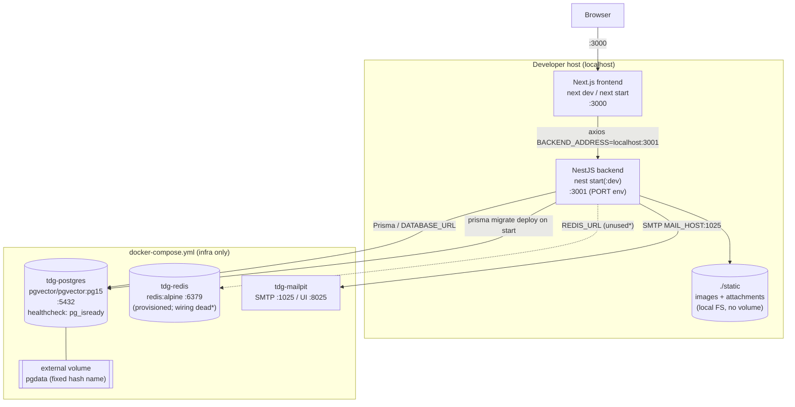
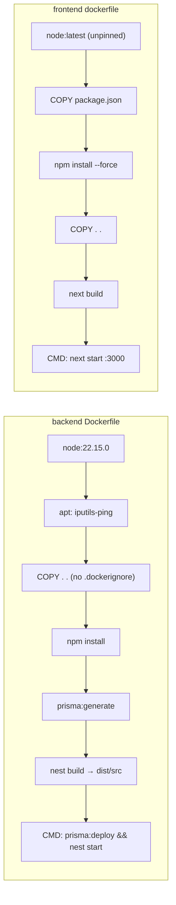

# Dossier 16 — Deployment & DevOps

## 1. Identity
- One-line purpose: how the two-app platform is built, configured, and run — dev infra via `docker-compose`, per-app `Dockerfile`s, environment/config, DB migration workflow, static-file serving, and the health endpoint.
- Backend source root(s): `tdg-management-api-backend/Dockerfile`, `tdg-management-api-backend/src/main.ts`, `tdg-management-api-backend/src/app.module.ts`, `tdg-management-api-backend/prisma.config.ts`, `tdg-management-api-backend/src/common/upload/**`, `tdg-management-api-backend/src/health/**`, `tdg-management-api-backend/.env`.
- Frontend source root(s): `tawer-management-frontend/dockerfile`, `tawer-management-frontend/next.config.ts`, `tawer-management-frontend/src/lib/http-methods.ts`.
- Repo-root: `docker-compose.yml`, `.claude/launch.json`, `.gitignore`.
- Owned DB tables/models: none (cross-cutting ops concern). Owns the **migration history** (`prisma/schema/migrations/`, 28 migrations) and the `_prisma_migrations` bookkeeping table applied by `migrate deploy`.

---

## 2. Purpose & business problem
There is no production deployment pipeline. What exists is a **local development stack**: a `docker-compose.yml` that provisions the three backing services (Postgres+pgvector, Redis, Mailpit) reusing an existing data volume, plus two standalone `Dockerfile`s that can build each app image. The apps themselves are normally run on the host via npm (`.claude/launch.json` backend `start:dev` on 3001, frontend `dev` on 3000), not in containers. The Dockerfiles exist as build recipes but are **not orchestrated** — `docker-compose.yml` never references them (`docker-compose.yml:17-49` defines only `postgres`/`redis`/`mailpit`, no `build:` service). So "deployment" today = run infra in Docker, run both apps from the terminal.

---

## 3. Domain model & database
No models. The relevant DB-ops artefacts:

**Migration workflow.** Prisma 7 multi-file schema (`prisma.config.ts:4` `schema: 'prisma/schema'`, migrations dir `prisma/schema/migrations`). 28 migrations exist, from `20251225111110_deploying_all_the_database` through `20260707000000_add_fts_tsvector` (via the reconciliation migration `20260621000000_add_missing_schema_fields`, cross-ref dossier 02). Scripts (`tdg-management-api-backend/package.json:15-19`):
- `prisma:generate` — generate client (`prisma generate --schema=./prisma/schema`).
- `prisma:migrate` — dev migration (`migrate dev`).
- `prisma:deploy` — production-safe apply (`migrate deploy`), idempotent, only runs migrations not yet in `_prisma_migrations`.
- `prisma:reset` — destructive reset.
- `prisma:seed` — `ts-node prisma/seed.ts` (**never invoked automatically** by any Dockerfile/compose; manual only).

The backend `Dockerfile:32` runs `prisma:deploy` at container start, so a fresh DB self-provisions its schema with no manual step. Seeding is separate and must be run by hand.

---

## 4. Backend architecture (build & runtime)

**Dockerfile** (`tdg-management-api-backend/Dockerfile`):
- `FROM node:22.15.0` (pinned) — `:1`.
- Installs `iputils-ping` (`:4`) — required because the infrastructure-monitoring module shells out to `ping` (cross-ref dossier 13); upgrades npm to `11.3.0` (`:5`).
- `COPY . .` (`:11`) then `RUN npm install` (`:14`) — copies the **entire build context** (no `.dockerignore` exists — verified absent), then installs. Because the context includes the host's `node_modules`, `dist/`, `static/` uploads, `.git`, and **`.env`**, all of these are baked into the image layer before install re-runs.
- `prisma:generate` (`:18`), `npm run build` = `nest build` → `dist/src/main.js` (verified on disk), `mkdir logs` (`:24`).
- `EXPOSE 3000` (`:27`).
- `CMD ["sh","-c","npm run prisma:deploy && npm run start"]` (`:32`) — applies migrations then `nest start` (the JIT dev-style start, **not** `start:prod` / `node dist/main`), so `@nestjs/cli` + TS toolchain must remain in the image at runtime.

**Runtime bootstrap** (`src/main.ts`):
- `app.enableCors()` with no options (`:9`) → fully open CORS (cross-ref dossiers 01/03 security gap).
- Global `ValidationPipe` with `transform:true` but **no `whitelist`** (`:12-25`) — recurring platform-wide finding.
- Swagger UI mounted at `/api` (`:37`).
- `app.listen(process.env.PORT ?? 3000)` (`:39`).

**Config** (`src/app.module.ts`): `ConfigModule.forRoot({ isGlobal:true, envFilePath:'.env' })` (`:38-41`) — single `.env` at the backend root, global. `ScheduleModule.forRoot()` (`:37`) enables the cron jobs (reminders, work-day auto-close, health polling, AI index sweeper) — these all run **in-process**, so every backend instance runs every cron; the Postgres `Locking` table is what prevents double-fire across instances (cross-ref dossiers 01/09/11).

---

## 5. API surface
Only one endpoint is in scope for this dossier:

| Method | Path | Auth/Perm | Request DTO | Response DTO | Validation | Business logic (1 line) | Side effects |
|--------|------|-----------|-------------|--------------|------------|-------------------------|--------------|
| GET | `/health` | **None** (no guard) | — | `{status:'ok', timestamp}` | — | Liveness probe; returns a static object + current ISO time | none |

Cited: `src/health/controller/health.controller.ts:18-23`. It is a **shallow liveness** check only — it does **not** verify Postgres, Redis, or Gemini connectivity, and it is **not** wired into any Docker `healthcheck` (only Postgres has one, `docker-compose.yml:30-34`).

Static file serving (not a controller): `ServeStaticModule.forRoot({ rootPath: join(__dirname,'..','..','static'), serveRoot:'/static', serveStaticOptions:{ fallthrough:false } })` (`app.module.ts:48-54`). At runtime `__dirname` = `<root>/dist/src` (verified `dist/src/main.js` exists), so the root resolves to `<backend-root>/static`, matching where uploads are written (§7). `fallthrough:false` makes a missing file return 404 instead of falling through.

---

## 6. Frontend (build & runtime)

**Dockerfile** (`tawer-management-frontend/dockerfile`):
- `FROM node:latest` (`:1`) — **unpinned** base image (non-reproducible builds).
- `COPY package.json ./` then `RUN npm install --force` (`:4-6`) — copies only `package.json`, **not** `package-lock.json`, and forces past peer-dep conflicts → dependency versions are not locked at build time.
- `COPY . .` (`:8`), `RUN npm run build` = `next build` (`:9`), `CMD ["npm","start"]` = `next start` (`:11`). No `EXPOSE`, no `PORT` env → Next defaults to `3000`. No `.dockerignore` (verified absent).

**Config** (`tawer-management-frontend/next.config.ts`): all runtime config is **hard-coded inline** in the `env` block (no `.env` file for the frontend; `dotenv` is a dependency but there is no committed `.env`). Includes `BACKEND_ADDRESS: "http://localhost:3001"`, `NTFY_SERVICE_URL`, `NEXT_PUBLIC_ENV: "preprod"`, and the **full Firebase web config** (`NEXT_PUBLIC_FIREBASE_API_KEY` etc.). `next.config.ts` **is committed to git** (`git ls-files` confirms), so these values — including the Firebase API key and messaging IDs — are in version control. The axios base URL reads `process.env.BACKEND_ADDRESS` (`src/lib/http-methods.ts:4`), i.e. the hard-coded `localhost:3001`. Firebase reads the `NEXT_PUBLIC_FIREBASE_*` vars (`src/lib/firebase.ts:6-12`).

Consequence for containerization: because `BACKEND_ADDRESS` is baked to `http://localhost:3001`, a containerized frontend would resolve `localhost` to **its own** container and fail to reach the backend — the current build is only correct when the browser and backend share `localhost` (i.e. host-run dev). No reverse proxy / nginx is present.

---

## 7. Data flow & key scenarios

**Scenario A — cold start of the whole stack (as intended today).**
1. `docker compose up -d` → starts `tdg-postgres` (pgvector/pgvector:pg15), `tdg-redis` (redis:alpine), `tdg-mailpit` (`docker-compose.yml:17-49`). Postgres reuses the **external** named volume (`:55-57`) so seeded data persists.
2. Backend host process: `npm run start:dev` (`.claude/launch.json`) → `ConfigModule` loads `.env` → Prisma connects via `DATABASE_URL` → app listens on `PORT=3001`.
3. Frontend host process: `npm run dev` → Next on `3000`, axios base = `localhost:3001`.
4. Browser hits `localhost:3000`; API calls go to `localhost:3001`.

**Scenario B — file upload persistence.** Multer `diskStorage` writes to `./static/attachments/<module>/` and `./static/images/<module>/` relative to process CWD (`src/common/upload/upload.storage.ts:6-8,33,69`), unique filename `Date.now()-rand.ext` (`:39-42`), 4 MB cap (`:61,98`), MIME allow-list (`:11-27,86`). The stored DB path is `/static/<...>` (`src/common/upload/service/upload.service.ts:8-9`), which is exactly what `ServeStaticModule` serves back (§5). **These uploads live on the container's local filesystem** — there is no volume mount for `static/` in any compose service and no object storage, so in a containerized/redeployed backend **all uploaded files are lost** on container replacement.

**Scenario C — schema evolution on deploy.** Backend container boots → `prisma migrate deploy` applies any migration not yet in `_prisma_migrations` (`Dockerfile:32`) → `nest start`. Idempotent and safe to re-run; no seed.

---

## 8. Diagrams (Mermaid)

Deployment / topology (as actually run today):

\* Redis is provisioned and `REDIS_URL` is set, but the backend `RedisModule`/cache wiring is dead code (cross-ref dossier 01).

Build pipeline per app:

---

## 9. Security
- **Secrets in a committed file.** `next.config.ts` (tracked in git) embeds the Firebase web config incl. `NEXT_PUBLIC_FIREBASE_API_KEY` and messaging sender/app IDs (`next.config.ts` env block; `git ls-files` confirms tracked). Firebase web API keys are low-sensitivity by design, but they are still checked into source. Cross-ref dossier 00 (hard-coded Firebase config) and 03.
- **Backend secrets baked into the image.** No `.dockerignore` (verified absent) + `COPY . .` (`Dockerfile:11`) → the backend `.env` is copied into the image. The `.env` (git-ignored, `.gitignore:5`, so **not** in git) contains live-looking secrets: `SECRET_KEY` (JWT signing), `GEMINI_API_KEY`, `OPEN_ROUTER_API_KEY` (values redacted here). Any distributed backend image leaks all three. Also copies `.git`, host `node_modules`, and existing `static/` uploads into the image (bloat + potential PII leak of uploaded files).
- **Open CORS** on the API (`main.ts:9`) and **no ValidationPipe `whitelist`** (`main.ts:12-25`) — platform-wide, cross-ref dossiers 01/03/04/07.
- **Health endpoint is unauthenticated** (`health.controller.ts`) — acceptable for a liveness probe, but it also isn't used by any orchestrator.
- **DB credentials** are weak defaults (`postgres` user `tdg` / `tdg1234`, `docker-compose.yml:23-25`, matching `DATABASE_URL`) and Postgres is published on `0.0.0.0:5432` (`:26-27`) — fine for local, unsafe if the host is exposed.
- **Token TTLs** `ACCESS_TOKEN_EXPIRATION="1200d"` / `REFRESH_TOKEN_EXPIRATION="1200d"` in `.env` — confirms the 1200-day non-revocable access-token finding from dossier 03 at the config layer.

---

## 10. Cross-module dependencies
- **Postgres+pgvector** — every module (Prisma). The pgvector image choice is driven by the AI module (`DocumentEmbedding` vector column, cross-ref dossiers 02/14); `docker-compose.yml:1-15` comments explicitly call this out.
- **Redis** — provisioned (`docker-compose.yml:36-41`), `REDIS_URL` set, `@keyv/redis`/`cache-manager`/`ioredis` in deps, but `src/common/redis/**` is not imported by `app.module.ts` → dead (cross-ref dossier 01). Container runs but is effectively unused.
- **Mailpit** — the mail transport for all notification/email flows in dev (cross-ref dossier 12); backend `MAIL_HOST/MAIL_PORT=localhost:1025`.
- **`iputils-ping`** — installed in the backend image for the servers/health-monitoring module (cross-ref dossier 13).
- **`@nestjs/schedule`** — all crons run in-process in the single backend; horizontal scaling relies on the Postgres `Locking` table, not on any external scheduler (cross-ref dossiers 01/09/11).
- **`ScheduleModule` + `ServeStaticModule` + `ConfigModule`** wired in `app.module.ts:37-54`.

---

## 11. Tests
No deployment/infrastructure tests exist. There is no CI configuration of any kind — verified: no `.github/`, `.gitlab-ci.yml`, `Jenkinsfile`, or other pipeline file in the tree (glob + `git ls-files` both empty). `docker-compose.yml` has a healthcheck only for Postgres (`:30-34`); the app containers have none. The `/health` endpoint is not exercised by any probe. Application-level test suites are covered per-module in their own dossiers; none run automatically.

---

## 12. Code quality
- **Backend Dockerfile** is functional and reasonably documented (the migrate-on-start comment `:29-31` is good), but ships a dev toolchain and runs `nest start` rather than `node dist/main` (`:32`) — larger image, slower boot, TS at runtime. Pinned base (`node:22.15.0`) is good practice.
- **Frontend Dockerfile** is low-quality: unpinned `node:latest` (`:1`), `npm install --force` without a lockfile (`:4-6`) → non-reproducible; no multi-stage build, so the full toolchain ships in the runtime image; no `EXPOSE`.
- **No `.dockerignore`** in either app — the single most impactful hygiene gap (image bloat + secret/upload leakage). One concrete example: `COPY . .` (`backend Dockerfile:11`) pulls in `.env` and `static/`.
- **Config sprawl:** backend config via `.env`; frontend config hard-coded in `next.config.ts`. Two different mechanisms, neither using a committed `.env.example` template, so a new engineer has no documented key list.
- **Compose file** is clean and well-commented (`docker-compose.yml:1-15,51-57`), but the `external` volume with a fixed hash name (`:56-57`) is non-portable.

---

## 13. Verified technical debt
1. **No `.dockerignore` (both apps)** → `.env`, `.git`, `node_modules`, and `static/` uploads baked into images (`backend Dockerfile:11`; frontend `dockerfile:8`; verified no such file exists).
2. **Uploads on ephemeral local FS** — `./static/**` (`upload.storage.ts:6-8`) has no volume mount in any compose service; files are lost on container replacement.
3. **External pgdata volume with a hard-coded hash name** (`docker-compose.yml:56-57`) — `docker compose up` fails on any machine that doesn't already have that exact volume.
4. **App Dockerfiles are not orchestrated** — `docker-compose.yml` provisions only infra; there is no app service, no networking between FE/BE containers, no reverse proxy.
5. **Frontend `BACKEND_ADDRESS` hard-coded to `localhost:3001`** in committed `next.config.ts` — breaks any non-localhost / containerized deployment.
6. **Port/EXPOSE mismatch (backend)** — `.env` sets `PORT=3001` and is copied into the image, so the app listens on 3001, while `Dockerfile:27` `EXPOSE 3000`. `main.ts:39` only falls back to 3000 if `PORT` is unset.
7. **Backend `.env` internal inconsistencies** — `API_ADDRESS` and `FRONTEND_ADDRESS` are **both** `http://localhost:3000` (API is actually 3001); `GOOGLE_TOKEN_ENDPOINT="https:/com/token"` and `GOOGLE_REDIRECT_URI="http://:3000/google-auth"` are malformed (OAuth stubs, cross-ref dossier 03).
8. **Stale branding in config** — `COMPANY_NAME="La Porta di Roma"`, `COMPANY_LOGO="./images/logos/laporta-di-roma.png"` (`.env:35-36`) and backend `package.json:2` `name:"laporta-di-roma-api"`; frontend `next.config.ts` `company_name:"Tawer MNG"`. Cross-ref dossiers 00/01 (stale `laporta-di-roma`).
9. **Dead env key** — `IMAGES_STORAGE_PATH="./images"` (`.env:39`) is referenced nowhere in code (grep clean); actual storage is `./static/images` via `UploadStorage`.
10. **Self-referential dependency** — backend `package.json:62` `"laporta-di-roma-api":"file:"` (a package depending on itself) plus stray `"install"` and `"i"` deps (`:58`, devDep `i`), and `npm` pinned as a devDependency (`:100`) — accidental installs.
11. **`/health` is shallow** (`health.controller.ts:18-23`) — no DB/Redis check and not wired to any Docker healthcheck.
12. **App containers have no healthcheck / restart policy for the apps** (only infra services set `restart: unless-stopped`, `docker-compose.yml:21,39,45`).
13. **Redis provisioned but unused** (`docker-compose.yml:36-41` + dead `src/common/redis/**`, cross-ref dossier 01).

---

## 14. Strengths / Weaknesses / Improvements

**Strengths**
- **Self-provisioning schema**: `migrate deploy` on container start (`Dockerfile:32`) means a fresh DB needs zero manual migration steps; idempotent and production-safe.
- **pgvector-by-default** infra choice (`docker-compose.yml:19`) removes the "extension vanished on recreate" failure mode the compose header documents.
- **Data preservation** via the reused named volume — dev data survives compose recreation.
- **Pinned backend base image** (`node:22.15.0`) and explicit `ping` install for the monitoring feature show intent.
- **Clean, well-commented compose file** with clear one-time-swap instructions.

**Weaknesses** (each = impact)
- No CI/CD at all → no automated build/test/lint gate; regressions ship silently.
- No `.dockerignore` → secret leakage (`.env` in image) + large images. Impact: security + slow builds.
- Uploads on local FS with no volume/object store → data loss on redeploy. Impact: user-facing file loss.
- Frontend build hard-codes `localhost:3001` and secrets → not deployable beyond a dev host without editing committed source.
- External volume with a fixed hash → not reproducible on a clean machine.
- `nest start` (not `start:prod`) in the image → heavier, slower runtime.

**Improvements** (concrete + feasible)
- Add `.dockerignore` to both apps (`node_modules`, `.git`, `dist`/`.next`, `.env`, `static`, `*.log`). Immediate security + size win.
- Backend: switch runtime `CMD` to `node dist/src/main` and use a multi-stage build (builder + slim runtime) so the TS toolchain doesn't ship. Align `EXPOSE` with the actual `PORT`.
- Frontend: pin the base image, copy `package-lock.json` and use `npm ci`, move `BACKEND_ADDRESS`/Firebase into build args or runtime `NEXT_PUBLIC_*` env, and use a multi-stage `output:'standalone'` build.
- Mount a named volume for `static/` (or move to S3-compatible object storage) so uploads persist.
- Commit `.env.example` (keys only, no values) for both apps to document required config.
- Add app services + a Docker network (and optionally an nginx reverse proxy) to `docker-compose.yml`; add app healthchecks hitting `/health`; deepen `/health` to ping Postgres.
- Add a minimal CI (lint + `nest build` / `next build` + `prisma validate` + the existing Jest/Vitest suites).

---

## 15. Verification Checklist
| Area | Verified? | Evidence or reason if not |
|------|-----------|---------------------------|
| docker-compose services & volume | Yes | `docker-compose.yml:17-57` (postgres/redis/mailpit; external pgdata) |
| Backend Dockerfile build & run | Yes | `tdg-management-api-backend/Dockerfile:1-32`; `dist/src/main.js` on disk |
| Frontend Dockerfile build & run | Yes | `tawer-management-frontend/dockerfile:1-11` |
| Absence of `.dockerignore` | Yes | glob/`ls` returned none in either app dir |
| Env/config mechanism | Yes | `app.module.ts:38-41`; `.env` (backend); `next.config.ts` env block (frontend) |
| Env key inventory | Yes | read `tdg-management-api-backend/.env` (values redacted in this dossier) |
| Migration workflow | Yes | `prisma.config.ts`; `package.json:15-19`; 28 dirs in `prisma/schema/migrations/` |
| Static/upload serving | Yes | `app.module.ts:48-54`; `upload.storage.ts:6-8`; `upload.service.ts:8-9`; `dist/src` runtime path |
| Health endpoint | Yes | `health.controller.ts:18-23` (shallow, unauthenticated) |
| Dev launch config | Yes | `.claude/launch.json` (backend 3001, frontend 3000) |
| CI/CD presence | Yes (=None) | no `.github`/`.gitlab-ci`/`Jenkinsfile` anywhere (glob + `git ls-files`) |
| Port/EXPOSE mismatch | Yes | `.env:45` PORT=3001 vs `Dockerfile:27` EXPOSE 3000 vs `main.ts:39` |
| Redis actually used | Partial | provisioned + `REDIS_URL` set; `RedisModule` not imported (cross-ref dossier 01, not re-verified here) |
| Runtime container behaviour (images actually built/run) | No | not executed; analysis is static from Dockerfiles/compose |
| Production deployment target | No | none exists to verify |

---

## 16. Not verified / Open questions
- **Images never built/run here.** All claims about image contents (e.g. `.env` baked in, `nest start` at runtime) are inferred from `COPY`/`CMD` directives, not from an actual `docker build`. Would need a build to confirm final layer contents and effective listening port inside the container.
- **Whether `.env` is present in every build context in practice.** It exists on this host and is not git-ignored out of the *Docker* context (only out of *git*), so `COPY . .` would include it — but a CI that clones from git would not have it. Needs a real build to confirm.
- **Redis wiring** — asserted dead per dossier 01; not independently re-traced in this session beyond confirming `RedisModule` is absent from `app.module.ts` imports.
- **Frontend runtime env override** — whether any deploy overrides `next.config.ts`'s hard-coded `BACKEND_ADDRESS` via build args is unknown (no such mechanism found, but not exhaustively searched).
- **Prod process manager / hosting** (PM2, systemd, k8s, a PaaS) — none found; assumed non-existent, but absence of a file is not proof there is no external ops runbook.
- **`GA_KEY` / analytics env** (`src/lib/ga.ts:8`) — read from `process.env.GA_KEY`, not defined in `next.config.ts`; source of this value at runtime unverified.
