# PFE Report — Tawer Management Platform

> **Provenance note (Session 17 — assembly).** This report is assembled *only* from the
> verified module dossiers in [`docs/dossiers/`](dossiers/) (00–16). Every technical claim traces to a
> dossier and, through it, to a `path/to/file.ts:line` citation in the source. No fact appears here
> that is not backed by a dossier. Sections that a PFE report normally contains but that **no dossier
> covers** — competitor/state-of-the-art analysis, UI screenshots, and host-organization/methodology
> framing — are left as explicit `[TO PROVIDE]` placeholders rather than invented.
>
> Language: English (matching the dossiers). Diagrams are the Mermaid blocks generated in the dossiers,
> reused verbatim.

---

# Front matter

- **Title:** Design and Implementation of *Tawer Management* — a Full-Stack Team-Management Platform with a Retrieval-Augmented AI Copilot
- **Author:** `[TO PROVIDE]`
- **Institution / Program:** `[TO PROVIDE]`
- **Academic supervisor:** `[TO PROVIDE]`
- **Company / host organization:** `[TO PROVIDE — see §1.1]`
- **Company supervisor:** `[TO PROVIDE]`
- **Academic year:** `[TO PROVIDE]`

**Remerciements / Acknowledgements** — `[TO PROVIDE]`

**Abstract.** Tawer Management is a two-application, full-stack internal operations platform for a
digital agency. A NestJS 11 REST API (`tdg-management-api-backend`, 20 controllers / 146 endpoints /
55 Prisma models over PostgreSQL + pgvector + Redis) is consumed by a Next.js 16 / React 19 web client
(`tawer-management-frontend`). The platform unifies project & agile task management, personal to-dos,
time & attendance, calendar/events, reminders, multi-channel notifications, infrastructure monitoring,
and — its differentiator — a Retrieval-Augmented-Generation (RAG) AI copilot with size-aware effort
estimation, backed by a pgvector hybrid (vector + lexical) search store and an offline evaluation
harness. This report documents the system's architecture, per-module conception, security posture,
testing reality, and verified limitations. *(Overview: dossier 00 §1–2.)*

**Keywords:** NestJS · Prisma · PostgreSQL · pgvector · RAG · Next.js · RBAC · project management.

*Table of contents, list of figures, list of tables, and acronym glossary: `[TO PROVIDE]` (generated at
final typesetting).*

---

# Chapter 1 — Introduction & Problem Statement

## 1.1 Context

`[TO PROVIDE — host-organization / internship framing: company presentation, the team, the internship
period. No dossier documents the organizational context; only the product is code-derived.]`

What the dossiers *do* establish about the business context: the system is the internal operations
platform of **Tawer**, a digital agency organized into two business units — *Tawer Dev* (AGILE software
projects) and *Tawer Creative* (FREESTYLE design/marketing projects). This split is encoded directly in
the domain model via the `BusinessUnit` enum (`TawerDev`, `TawerCreative`) and the `ProjectType` enum
(`AGILE`, `FREESTYLE`), and is visible in the seed dataset. *(Dossier 02 §2;
`prisma/schema/projects.schema.prisma:104-112`, `prisma/seed.ts:4-13`.)*

## 1.2 Problem statement

A growing agency runs its work across many disconnected tools: one app for projects, another for the
agile backlog, spreadsheets for attendance, a separate calendar, ad-hoc channels for reminders and
notifications, and no single place to ask questions about project state. The platform's purpose is to
**consolidate these workflows into one authenticated, localized web application** serving ~31 distinct
role types over a single API, and to add an intelligent layer — an AI copilot that answers questions
*grounded in the organization's own project content* and estimates task effort from historical data.
*(Dossier 00 §2; dossier 15 §2 — "~31 role types over the ~146-endpoint API".)*

## 1.3 Objectives

1. A single web client unifying: projects & membership, an agile backlog (epics → sprints → tasks,
   milestones), personal to-dos, time & attendance (check-in/out), events/calendar, reminders,
   multi-channel notifications, and infrastructure monitoring. *(Dossier 00 §2.)*
2. A role-based access-control model expressive enough for ~31 role types and two business units.
   *(Dossier 03; dossier 00 §5.)*
3. A production-grade RAG subsystem: outbox-based indexing, embedding generation, hybrid
   vector + lexical retrieval, an LLM reranker, grounded answering with citations, and size-aware
   estimation — with an offline evaluation harness. *(Dossier 14; dossier 02 §14.)*
4. A uniform, maintainable engineering structure so any of the ~20 backend modules and ~10 frontend
   modules reads the same way. *(Dossier 01 §4; dossier 15 §4.)*

## 1.4 Report structure

Chapter 2 surveys the technology choices (state of the art). Chapter 3 covers methodology and the work
environment. Chapter 4 presents the global architecture. Chapter 5 is the detailed conception, module
by module, from the database up. Chapter 6 consolidates security. Chapter 7 (réalisation) walks the
user-facing flows. Chapter 8 reports testing reality; Chapter 9 the delivered results and the AI
evaluation numbers. Chapter 10 lists verified limitations and future work; Chapter 11 concludes.

---

# Chapter 2 — Technology Study (State of the Art)

## 2.1 Market / competitor analysis

`[TO PROVIDE — comparison with existing platforms (Jira, Asana, ClickUp, Linear, …). No dossier
contains a competitor analysis; this section requires external research and cannot be sourced from the
verified dossiers.]`

## 2.2 Technology stack and rationale (dossier-sourced)

The following stack is verified from the two `package.json` files, the Prisma schema, and the compose
file. Versions are cited, not estimated. *(Dossier 00 §1,§3,§6; dossier 15 §4.1.)*

**Backend — `tdg-management-api-backend`**

| Concern | Technology | Evidence |
|---|---|---|
| Framework | NestJS 11 (layered, per-feature modules) | dossier 00 §4; `README.md:59-136` |
| ORM / DB access | Prisma 7 with the `@prisma/adapter-pg` driver adapter | dossier 02 §1; `package.json:48` |
| Database | PostgreSQL + **pgvector** extension | dossier 02 §1; `main.schema.prisma:5-7`, `docker-compose.yml:19` |
| Auth | JWT (`@nestjs/jwt`) + bcrypt password hashing | dossier 00 §9; `package.json:42,51` |
| Scheduling | `@nestjs/schedule` (cron jobs) | dossier 01 §4.7; `app.module.ts:37` |
| AI | Google Gemini (`@google/genai`) for embeddings + generation | dossier 14; dossier 00 §8 |
| API docs | Swagger at `/api` | dossier 00 §2; `main.ts:28-37` |
| Cache/lock backing | Redis provisioned (but wiring dead — see §10.x) | dossier 01 §13; dossier 16 §10 |

**Frontend — `tawer-management-frontend`** *(dossier 15 §4.1)*

| Concern | Library | Version | Evidence |
|---|---|---|---|
| Framework | `next` (App Router) | ^16.1.1 | `package.json:97` |
| UI runtime | `react` / `react-dom` | ^19.2.3 | `package.json:101,104` |
| i18n | `next-intl` (en/fr) | ^4.5.6 | `package.json:98` |
| Server-state | `@tanstack/react-query` | ^5.90.11 | `package.json:55` |
| Client-state | `zustand` | ^5.0.5 | `package.json:122` |
| Forms + validation | `react-hook-form` + `zod` | ^7.58.1 / ^3.25.67 | `package.json:106,121` |
| HTTP | `axios` | ^1.13.2 | `package.json:80` |
| Styling | Tailwind CSS v4 + Radix UI (shadcn pattern) | ^4.1.10 | `package.json:139,26-53` |
| Push | `firebase` (web push) | ^12.7.0 | `package.json:88` |

**Why this stack (verified rationale):** a stateless JSON API (NestJS) usable by any client, cleanly
separated from a Next.js UI (no shared code, HTTP/JSON only); Prisma + Zod + `class-validator` give
type safety end-to-end; PostgreSQL with pgvector lets the same datastore back both the transactional
domain and the RAG vector store, avoiding a separate vector database. *(Dossier 00 §2,§12,§14; dossier
02 §14.)*

---

# Chapter 3 — Methodology & Work Environment

## 3.1 Development methodology

`[TO PROVIDE — the software-development methodology actually practiced during the internship (Scrum,
sprints, ceremonies, tooling). No dossier documents the *team's* process; the dossiers describe the
product, which itself *implements* an agile backlog (see Chapter 5.4), but that is the built feature,
not the development methodology used to build it.]`

## 3.2 Work environment and tooling

- **Repository layout.** One git repo, two independent Node projects: `tdg-management-api-backend/`
  (NestJS) and `tawer-management-frontend/` (Next.js). No workspace linking; the two apps share no
  code and communicate only over HTTP/JSON. *(Dossier 00 §1,§10.)*
- **Local infrastructure** is provisioned by `docker-compose.yml`: PostgreSQL (`pgvector/pgvector:pg15`,
  :5432), Redis (`redis:alpine`, :6379), and Mailpit (SMTP :1025 / UI :8025). Postgres reuses an
  external named data volume so seeded data survives recreation. *(Dossier 16 §2,§7;
  `docker-compose.yml:17-57`.)*
- **How the apps run in dev.** The apps run on the *host* (not in Docker) via `.claude/launch.json`:
  backend `start:dev` on port **3001**, frontend `dev` on port **3000**. The two Dockerfiles exist as
  build recipes but are **not orchestrated** by compose. *(Dossier 16 §2,§4,§6.)*
- **Database migration workflow.** Prisma 7 multi-file schema (13 schema files under `prisma/schema/`);
  28 migrations applied by `prisma migrate deploy` (idempotent, production-safe). Seeding is a separate
  manual script (`prisma/seed.ts`), never invoked automatically. *(Dossier 16 §3; dossier 02 §1.)*
- **API documentation** is auto-generated via Swagger, served at `/api`. *(Dossier 00 §2.)*
- **Environment configuration.** Backend config via a single global `.env` (`ConfigModule.forRoot({
  isGlobal:true })`); frontend config hard-coded inline in `next.config.ts`. *(Dossier 16 §4,§6.)*

## 3.3 Engineering conventions a contributor must know

The backend follows a strict **four-layer, per-feature** convention — every module has
`controller/ → services/ → repositories/ → dto/` — so any of the ~20 modules is readable once the
pattern is learned. Controllers are pure delegation; only repositories touch Prisma; services hold
business rules and translate Prisma errors to a central typed `ErrorCode` contract. *(Dossier 01 §4.1;
detailed in Chapter 4.)* The frontend mirrors this with a uniform per-module shape
(`components/ hooks/ services/ store/ types/ validation/`). *(Dossier 15 §4.10.)*

---

# Chapter 4 — Global Architecture

## 4.1 Two-application architecture

Tawer Management is a two-app monorepo: a **stateless NestJS REST API** and a separate **Next.js web
client** that calls it *directly from the browser* over axios with a `Bearer` JWT. There are no Next.js
`app/api` route handlers and no backend-for-frontend proxy; the frontend's `proxy.ts` middleware runs
only next-intl locale handling. *(Dossier 00 §6,§7; dossier 15 §4.8.)*

**Verified system totals** (produced by grepping the source, not estimated): 146 route handlers across
20 controllers; 55 Prisma models and 25 enums across 13 schema files. *(Dossier 00 §5,§3; dossier 02
§3.1–3.2.)*

### System component / deployment diagram *(dossier 00 §8.1)*

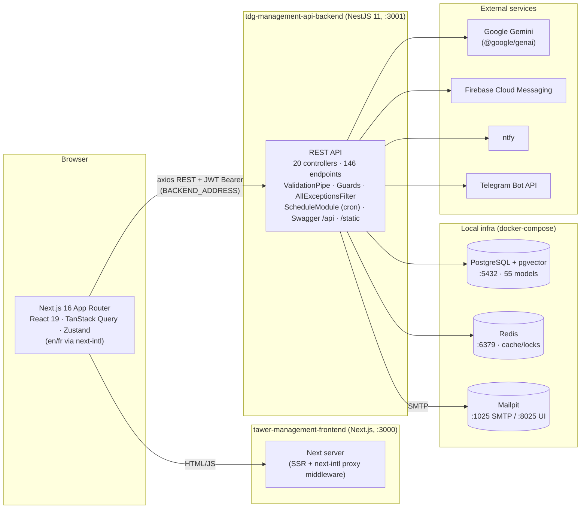
```mermaid
flowchart LR
  subgraph Client["Browser"]
    UI["Next.js 16 App Router\nReact 19 · TanStack Query · Zustand\n(en/fr via next-intl)"]
  end

  subgraph FE["tawer-management-frontend (Next.js, :3000)"]
    NEXT["Next server\n(SSR + next-intl proxy middleware)"]
  end

  subgraph BE["tdg-management-api-backend (NestJS 11, :3001)"]
    API["REST API\n20 controllers · 146 endpoints\nValidationPipe · Guards · AllExceptionsFilter\nScheduleModule (cron) · Swagger /api · /static"]
  end

  subgraph Data["Local infra (docker-compose)"]
    PG[("PostgreSQL + pgvector\n:5432 · 55 models")]
    REDIS[("Redis\n:6379 · cache/locks")]
    MAIL[("Mailpit\n:1025 SMTP / :8025 UI")]
  end

  subgraph Ext["External services"]
    GEMINI["Google Gemini\n(@google/genai)"]
    FCM["Firebase Cloud Messaging"]
    NTFY["ntfy"]
    TG["Telegram Bot API"]
  end

  UI -->|"HTML/JS"| NEXT
  UI -->|"axios REST + JWT Bearer\n(BACKEND_ADDRESS)"| API
  API --> PG
  API --> REDIS
  API -->|SMTP| MAIL
  API --> GEMINI
  API --> FCM
  API --> NTFY
  API --> TG
```

## 4.2 Backend layered architecture

Every domain module follows the same four-layer split, verified against `projects` and `tasks`:

- **Controller** — HTTP surface only (routing, guards, Swagger, serialization); one-line delegation to
  the service, no business logic. *(Dossier 01 §4.1; `projects.controller.ts:89`.)*
- **Service** — business rules, authorization decisions beyond the guard, orchestration of repositories,
  and Prisma-error translation (e.g. `P2002` → `ConflictCustomException`). *(`projects.service.ts:68-108`.)*
- **Repository** — the only layer that talks to `PrismaService`; one class per operation family, with
  explicit `select`s to limit over-fetching. *(`create-project.repository.ts:11,54`.)*
- **DTO** — request/response shapes with `class-validator` + Swagger decorators. *(`create-project.dto.ts:24`.)*

Cross-cutting concerns wired at the composition root (`app.module.ts`): a global `ValidationPipe`
(`transform:true`, emitting `INVALID_DATA`), a global `AllExceptionsFilter`, `ScheduleModule` for
crons, a global `ConfigModule`, and `ServeStaticModule` serving `static/` at `/static`. *(Dossier 01
§4.2–4.3; `main.ts:12-25`, `app.module.ts:37-79`.)*

### Layered-architecture diagram *(dossier 01 §8.1)*

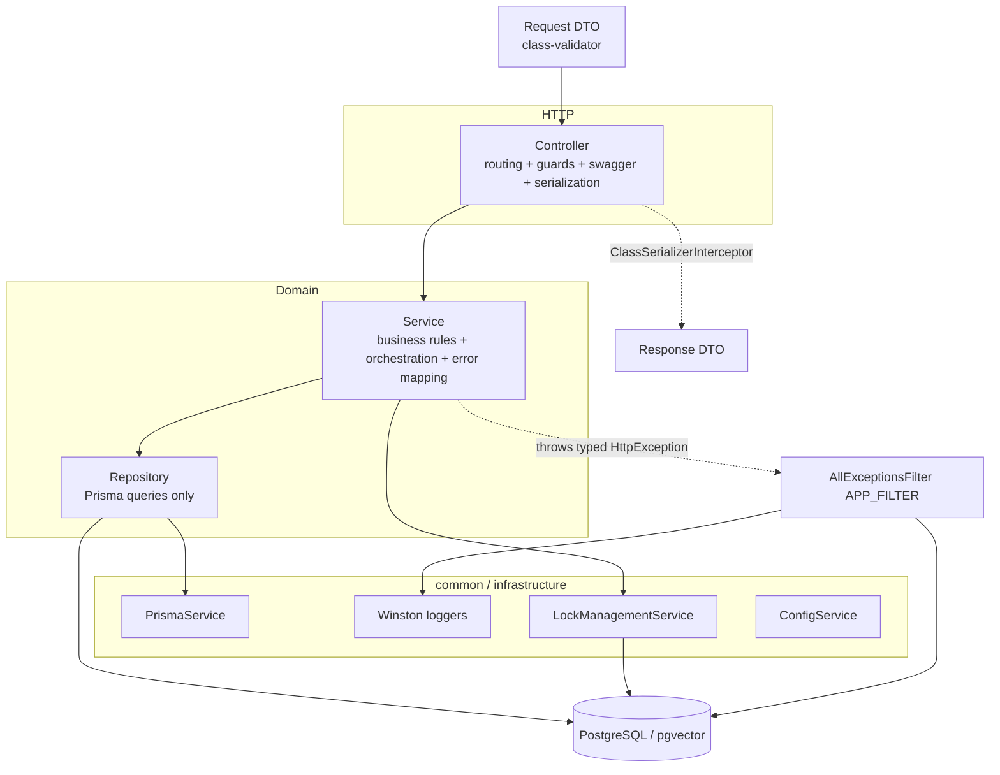
```mermaid
flowchart TB
  subgraph HTTP
    C[Controller<br/>routing + guards + swagger + serialization]
  end
  subgraph Domain
    S[Service<br/>business rules + orchestration + error mapping]
    R[Repository<br/>Prisma queries only]
  end
  subgraph Shared[common / infrastructure]
    P[PrismaService]
    L[Winston loggers]
    LK[LockManagementService]
    CFG[ConfigService]
  end
  DTOreq[Request DTO<br/>class-validator] --> C
  C --> S --> R --> P
  S -. throws typed HttpException .-> F[AllExceptionsFilter APP_FILTER]
  R --> DB[(PostgreSQL / pgvector)]
  S --> LK
  LK --> DB
  F --> L
  F --> DB
  C -. ClassSerializerInterceptor .-> DTOres[Response DTO]
```

### Cross-cutting infrastructure

- **Global exception filter.** `AllExceptionsFilter` (`@Catch()`) normalizes every error to a typed
  `{message, code}` body; for 500s only, it writes to a Winston error log and fires a *fire-and-forget*
  Telegram alert enriched by a Gemini-generated resolution message, deduplicated via a bcrypt-hashed
  fingerprint stored once in `ErrorLog`. *(Dossier 01 §4.4.)*
- **Typed error contract.** Domain code throws typed `HttpException` subclasses; a central `ErrorCode`
  enum (namespaced `P1xxx`…`P4xxx`) gives the frontend a stable, language-independent error contract.
  *(Dossier 01 §4.5; `error.code.ts:1`.)*
- **Logging.** Three daily-rotated JSON Winston loggers (app / errors / background-activities). *Note:*
  the per-request `LoggerMiddleware` is written but **never registered**, so access logging is inert
  (verified tech debt). *(Dossier 01 §4.6, §13.1.)*
- **Distributed locking.** A Postgres `Locking` table (`SELECT … FOR UPDATE SKIP LOCKED`) is the
  mutex that stops in-process cron jobs from double-firing across instances — chosen over Redis, which
  is provisioned but dead. *(Dossier 01 §4.7, §13.2.)*

## 4.3 Request lifecycle (end-to-end)

A typical authenticated read (e.g. loading a project's tasks): a React component calls a TanStack Query
hook → a module service attaches the JWT from `localStorage` and issues an axios request to the API at
`BACKEND_ADDRESS` (:3001) → NestJS runs the global `ValidationPipe`, then the route's guards, reaches
the controller → service → repository → `PrismaService` → parameterized SQL to Postgres (Redis cache
and Gemini/pgvector on the AI path) → `AllExceptionsFilter` normalizes any error → JSON flows back,
TanStack Query caches it, React re-renders. On a 401 the service transparently refreshes the token and
retries once. *(Dossier 00 §7.)*

### Request-lifecycle sequence *(dossier 00 §8.2)*

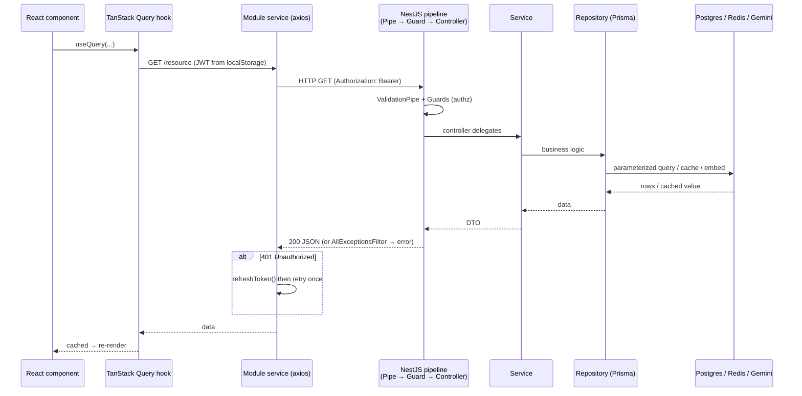
```mermaid
sequenceDiagram
  participant C as React component
  participant Q as TanStack Query hook
  participant S as Module service (axios)
  participant N as NestJS pipeline<br/>(Pipe → Guard → Controller)
  participant Svc as Service
  participant R as Repository (Prisma)
  participant DB as Postgres / Redis / Gemini

  C->>Q: useQuery(...)
  Q->>S: GET /resource (JWT from localStorage)
  S->>N: HTTP GET (Authorization: Bearer)
  N->>N: ValidationPipe + Guards (authz)
  N->>Svc: controller delegates
  Svc->>R: business logic
  R->>DB: parameterized query / cache / embed
  DB-->>R: rows / cached value
  R-->>Svc: data
  Svc-->>N: DTO
  N-->>S: 200 JSON (or AllExceptionsFilter → error)
  alt 401 Unauthorized
    S->>S: refreshToken() then retry once
  end
  S-->>Q: data
  Q-->>C: cached → re-render
```

## 4.4 Frontend architecture

The Next.js 16 App Router wraps everything in a single dynamic `[locale]` segment with two route groups:
`(guest)` (login/register/forgot-password) and `dashboard/(auth)` (every authenticated feature under one
shell — sidebar + header + attendance wrapper). 34 pages, 5 layouts. The provider tree is
`ThemeProvider → NextIntlClientProvider → ReactQueryProvider → ActiveThemeProvider`. Server state lives
in a single TanStack Query client (global 10-minute `refetchInterval` + focus refetch); ephemeral UI
state lives in small per-module Zustand stores; the two are bridged in hooks. *(Dossier 15 §4.2–4.5.)*

The API layer is a thin axios wrapper (`lib/http-methods.ts`) with **no interceptor**, so the
`Authorization: Bearer` header and the 401→`/tokens/refresh`→retry dance are duplicated across ~60
service files (verified: `extractJWTokens` imported in 60 files). JWTs are stored in `localStorage`.
Auth gating is **client-only** — the `(auth)` layout calls `/users/me` and pushes `/login` if no user
resolves; there is no SSR/edge auth guard. Client-side RBAC (`hasPermissions`) is cosmetic nav-gating;
real authorization is the backend guard. *(Dossier 15 §4.6–4.9, §13.1–13.3.)*

### Client-side auth gate *(dossier 15 §8.3)*

```mermaid
flowchart TD
  R[Request any /[locale]/... path] --> P{proxy.ts}
  P -->|intl only, no auth| L[Render layout tree]
  L --> Q{useUser -> GET /users/me}
  Q -->|loading| Load[<Loading/>]
  Q -->|user| Grp{route group}
  Q -->|no user| Guard{in (auth)?}
  Guard -->|yes| Login[router.push /login]
  Guard -->|no| Cont[render guest page]
  Grp -->|(auth)| App[render app shell]
  Grp -->|(guest)| Redir[redirect /dashboard]
```

## 4.5 Deployment topology (as run today)

There is **no production pipeline and no CI/CD** (no `.github/`, `.gitlab-ci.yml`, or `Jenkinsfile`).
"Deployment" today means: run the three infra services in Docker, run both apps from the terminal on the
host. The backend container (if built) self-provisions its schema via `migrate deploy` on start.
Uploaded files are written to the local `./static/` filesystem with no volume, so they are lost on
container replacement. *(Dossier 16 §2,§11,§13.)*

### Deployment / topology diagram *(dossier 16 §8)*

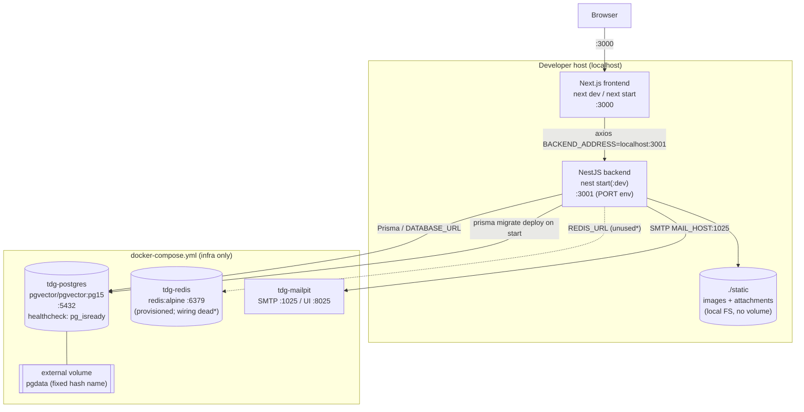
```mermaid
graph TB
  subgraph Host["Developer host (localhost)"]
    FE["Next.js frontend<br/>next dev / next start<br/>:3000"]
    BE["NestJS backend<br/>nest start(:dev)<br/>:3001 (PORT env)"]
    ST[("./static<br/>images + attachments<br/>(local FS, no volume)")]
  end
  subgraph Compose["docker-compose.yml (infra only)"]
    PG[("tdg-postgres<br/>pgvector/pgvector:pg15<br/>:5432<br/>healthcheck: pg_isready")]
    RD[("tdg-redis<br/>redis:alpine :6379<br/>(provisioned; wiring dead*)")]
    MP["tdg-mailpit<br/>SMTP :1025 / UI :8025"]
    VOL[["external volume<br/>pgdata (fixed hash name)"]]
  end
  Browser["Browser"] -->|":3000"| FE
  FE -->|"axios BACKEND_ADDRESS=localhost:3001"| BE
  BE -->|"Prisma / DATABASE_URL"| PG
  BE -.->|"REDIS_URL (unused*)"| RD
  BE -->|"SMTP MAIL_HOST:1025"| MP
  BE -->|"prisma migrate deploy on start"| PG
  BE --> ST
  PG --- VOL
```

\* Redis is provisioned and `REDIS_URL` is set, but the backend cache/lock wiring is dead code.
*(Dossier 16 §8; dossier 01 §13.2.)*

---

# Chapter 5 — Detailed Conception

This chapter presents the system domain by domain. It opens with the persistence layer (the single
source of truth for all 55 models), then documents each functional module: its purpose, domain model,
API surface, key scenarios, and the design decisions behind it — reusing the verified diagrams from the
dossiers. Each subsection cites the dossier it derives from.

## 5.0 Database architecture

The persistence layer is a single PostgreSQL instance holding **55 Prisma models and 25 enums across 13
schema files**, plus the pgvector RAG store. Every model carries `createdAt`/`updatedAt`; that is the
only truly universal convention. *(Dossier 02 §3.1–3.2, §4.)*

**Model inventory by domain** *(dossier 02 §3.1)*

| Domain / schema file | Models |
|---|---|
| Identity & Auth (`user`, `auth`) | User, Role, Team, UserTeam, UserManager, RefreshToken, ResetPasswordCode (7) |
| Projects & Membership (`projects`) | Project, ProjectContent, ProjectMember, ProjectInvitation (4) |
| Agile & Tasks (`agile`) | Sprint, SprintContent, SprintAttachment, Epic, Milestone, Task, TaskContent, TaskComment, TaskCommentLike, TaskCommentMention, TaskAttachment, TaskTimeEntry, TaskLabel, TaskLabelAssignment, TaskDependency, ProjectTaskStatus (16) |
| Personal Tasks (`user-tasks`) | UserTask, UserTaskContent, UserTaskComment, UserTaskAttachment (4) |
| Time & Attendance (`work-sessions`) | WorkDay, WorkSession (2) |
| Events & Calendar (`events`) | Event, EventContent, EventParticipant (3) |
| Reminders (`reminders`) | Reminder, ReminderChannel (2) |
| Notifications (`notification` + 2 in `user`) | Notification, NotificationContent, UserNotification, NotificationToken, UserNotificationSettings, UserTelegramBot, UserNtfyIntegration (7) |
| Infrastructure Monitoring (`servers`) | Server, Service, ServerNotification, ServiceNotification, UserServerManagement (5) |
| AI / RAG (`ai`) | DocumentEmbedding, IndexOutbox, CopilotQueryLog (3) |
| Cross-cutting infra (`locking`, `errors`) | Locking, ErrorLog (2) |

**Key design decisions** *(dossier 02 §3.4)*

- **Content-table (i18n) split.** Six entities separate translatable text into a child `*Content` table
  keyed by `language` (`ProjectContent`, `SprintContent`, `TaskContent`, `UserTaskContent`,
  `EventContent`, `NotificationContent`). The intent is per-language rows, but the `Language` enum has a
  **single value (`English`)**, so the split is structurally dormant today. *(Dossier 02 §3.4-1;
  `language.schema.prisma:1-3`.)*
- **`User` is the central hub** (~30 back-relations); **`Project` is the second hub** for the whole
  agile/task/reminder subtree. Deleting a project tears down its entire subtree in one DB-driven cascade.
  *(Dossier 02 §7 Scenario 1, §10.)*
- **Protective vs aggressive cascades on `Task`:** deleting a user cascades to tasks they *reported* but
  only *nulls* tasks they were *assigned*; a task survives its sprint/epic/milestone being deleted.
  *(Dossier 02 §3.4-4; `agile.schema.prisma:82-89`.)*
- **`Task.status` migrated from enum → free TEXT** to support per-project custom statuses, with
  `ProjectTaskStatus.allowedTransitions String[]` encoding the per-project state machine. *(Dossier 02
  §3.4-6.)*
- **Production-grade RAG store:** `DocumentEmbedding.embedding vector(1536)` with a hand-built HNSW
  cosine index, plus a generated `tsvector` + GIN index for hybrid lexical search, plus a transactional
  `IndexOutbox` with exponential-backoff columns. AI tables are deliberately decoupled from the
  transactional graph (string `projectId`, no FK). *(Dossier 02 §3.4-7,8, §10.)*
- **Distributed locking via a `Locking` table**, not Redis (`FOR UPDATE SKIP LOCKED`). *(Dossier 02
  §3.4-9.)*

**Domain-cluster overview** *(dossier 02 §8.1)*

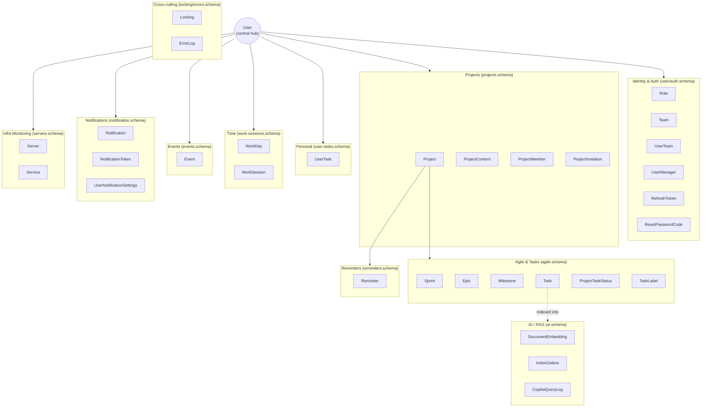
```mermaid
flowchart TB
  User(("User\n(central hub)"))
  subgraph Identity["Identity & Auth (user/auth.schema)"]
    Role; Team; UserTeam; UserManager; RefreshToken; ResetPasswordCode
  end
  subgraph Proj["Projects (projects.schema)"]
    Project; ProjectContent; ProjectMember; ProjectInvitation
  end
  subgraph Agile["Agile & Tasks (agile.schema)"]
    Sprint; Epic; Milestone; Task; ProjectTaskStatus; TaskLabel
  end
  subgraph Personal["Personal (user-tasks.schema)"]
    UserTask
  end
  subgraph Time["Time (work-sessions.schema)"]
    WorkDay; WorkSession
  end
  subgraph Events["Events (events.schema)"]
    Event
  end
  subgraph Notif["Notifications (notification.schema)"]
    Notification; NotificationToken; UserNotificationSettings
  end
  subgraph Rem["Reminders (reminders.schema)"]
    Reminder
  end
  subgraph Infra["Infra Monitoring (servers.schema)"]
    Server; Service
  end
  subgraph AI["AI / RAG (ai.schema)"]
    DocumentEmbedding; IndexOutbox; CopilotQueryLog
  end
  subgraph Ops["Cross-cutting (locking/errors.schema)"]
    Locking; ErrorLog
  end

  User --> Identity
  User --> Proj
  User --> Personal
  User --> Time
  User --> Events
  User --> Notif
  Project --> Agile
  Project --> Rem
  User --> Infra
  Task -. "indexed into" .-> AI
```

**ERD — Projects, Agile & Tasks (core)** *(dossier 02 §8.3)*

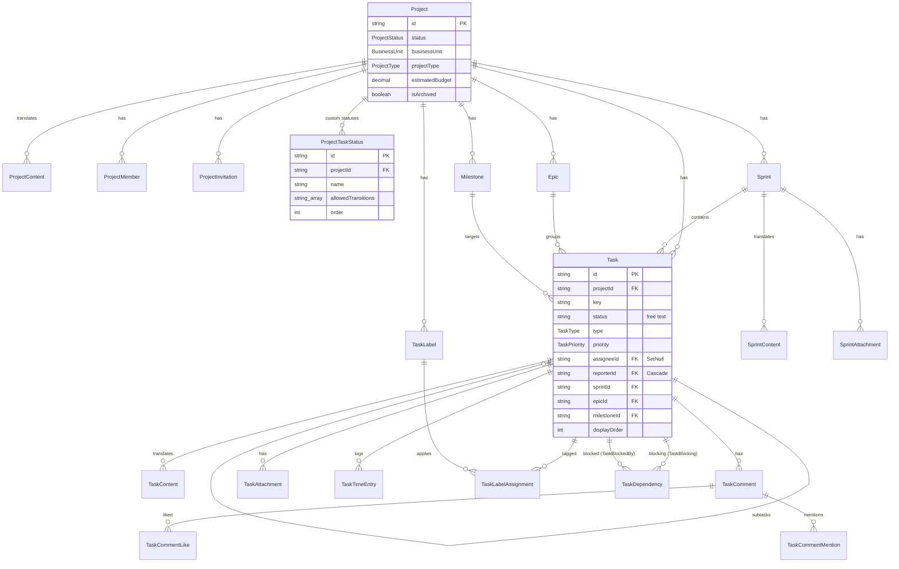
```mermaid
erDiagram
  Project ||--o{ ProjectContent : translates
  Project ||--o{ ProjectMember : has
  Project ||--o{ ProjectInvitation : has
  Project ||--o{ ProjectTaskStatus : "custom statuses"
  Project ||--o{ TaskLabel : has
  Project ||--o{ Epic : has
  Project ||--o{ Milestone : has
  Project ||--o{ Sprint : has
  Project ||--o{ Task : has
  Sprint ||--o{ SprintContent : translates
  Sprint ||--o{ SprintAttachment : has
  Sprint ||--o{ Task : contains
  Epic ||--o{ Task : groups
  Milestone ||--o{ Task : targets
  Task ||--o{ Task : subtasks
  Task ||--o{ TaskContent : translates
  Task ||--o{ TaskComment : has
  TaskComment ||--o{ TaskCommentLike : liked
  TaskComment ||--o{ TaskCommentMention : mentions
  Task ||--o{ TaskAttachment : has
  Task ||--o{ TaskTimeEntry : logs
  Task ||--o{ TaskLabelAssignment : tagged
  TaskLabel ||--o{ TaskLabelAssignment : applies
  Task ||--o{ TaskDependency : "blocking (TaskBlocking)"
  Task ||--o{ TaskDependency : "blocked (TaskBlockedBy)"

  Project {
    string id PK
    ProjectStatus status
    BusinessUnit businessUnit
    ProjectType projectType
    decimal estimatedBudget
    boolean isArchived
  }
  Task {
    string id PK
    string projectId FK
    string key
    string status "free text"
    TaskType type
    TaskPriority priority
    string assigneeId FK "SetNull"
    string reporterId FK "Cascade"
    string sprintId FK
    string epicId FK
    string milestoneId FK
    int displayOrder
  }
  ProjectTaskStatus {
    string id PK
    string projectId FK
    string name
    string_array allowedTransitions
    int order
  }
```

The remaining per-domain ERDs (Identity, Personal/Events/Time, Notifications/Reminders, Infra/AI) are in
dossier 02 §8.2, §8.4–8.6 and are reused in the corresponding module subsections below.

## 5.1 Users & Teams

**Purpose.** Administrative user lifecycle (create/read/update/soft-delete, profile self-service,
password change, bulk email) plus team grouping. There is no public self-registration — users are
provisioned by privileged roles via `POST /users/register`. *(Dossier 04 §1–2.)*

**Domain model.** `User` (two unique business keys `email`/`phone`; `unaccentedName` denormalized for
accent-insensitive search; `isActive` soft-delete flag), `Role` (roles modeled as **rows**, not an
array — `@@unique([type,userId])` lets a user hold N roles), `Team` + `UserTeam` join (`isManager` is
the only manager signal actually used at runtime), and a **dormant** `UserManager` self-relation that no
code reads. *(Dossier 04 §3, §13.)*

**API surface.** 14 endpoints across `/users` (10) and `/teams` (4). Authorization is **two-tiered**: a
coarse `HasPermissionGuard` gates each route, and a fine-grained *data-scoped* check
(`canRolesManageRoles`, `canUserManageUsers`, `canUserManageTeams`) runs inside the service. *(Dossier
04 §4, §5.)*

**ERD slice** *(dossier 04 §8.1)*

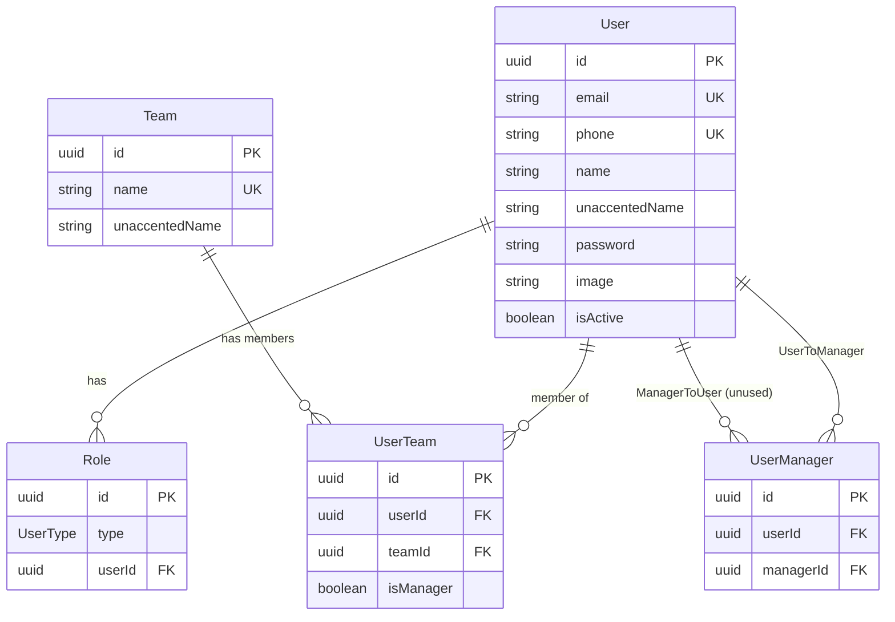
```mermaid
erDiagram
    User ||--o{ Role : "has"
    User ||--o{ UserTeam : "member of"
    Team ||--o{ UserTeam : "has members"
    User ||--o{ UserManager : "UserToManager"
    User ||--o{ UserManager : "ManagerToUser (unused)"

    User {
        uuid id PK
        string email UK
        string phone UK
        string name
        string unaccentedName
        string password
        string image
        boolean isActive
    }
    Role { uuid id PK  UserType type  uuid userId FK }
    Team { uuid id PK  string name UK  string unaccentedName }
    UserTeam { uuid id PK  uuid userId FK  uuid teamId FK  boolean isManager }
    UserManager { uuid id PK  uuid userId FK  uuid managerId FK }
```

**Create-user-by-admin sequence** *(dossier 04 §8.2)*

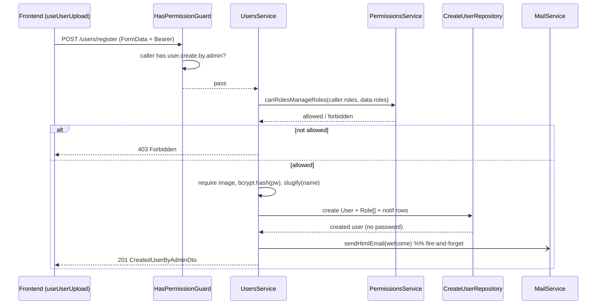
```mermaid
sequenceDiagram
    participant FE as Frontend (useUserUpload)
    participant G as HasPermissionGuard
    participant S as UsersService
    participant P as PermissionsService
    participant R as CreateUserRepository
    participant M as MailService
    FE->>G: POST /users/register (FormData + Bearer)
    G->>G: caller has user.create.by.admin?
    G-->>S: pass
    S->>P: canRolesManageRoles(caller.roles, data.roles)
    P-->>S: allowed / forbidden
    alt not allowed
        S-->>FE: 403 Forbidden
    else allowed
        S->>S: require image, bcrypt.hash(pw), slugify(name)
        S->>R: create User + Role[] + notif rows
        R-->>S: created user (no password)
        S-)M: sendHtmlEmail(welcome)  %% fire-and-forget
        S-->>FE: 201 CreatedUserByAdminDto
    end
```

**Notable findings (verified).** A **privilege-escalation bug** in `deleteUserByAdmin`: it authorizes the
caller against the caller's own roles, never the target's, so any holder of `user.delete` (e.g.
`HRManager`) can soft-disable a higher-privileged account (e.g. `CEO`). The user-listing query uses
`$queryRawUnsafe` with interpolated values, mitigated only by a DTO keyword-blacklist regex + quote
escaping (not parameterized). Aggregation uses `SUM/AVG(DISTINCT …)` (undercounts), and the role filter
`OR type IS NULL` leaks role-less users. *(Dossier 04 §9, §13.)* These are consolidated in Chapters 6
and 10.

## 5.2 Projects & Membership

**Purpose.** Project lifecycle (create/read/update/archive/delete), per-project team membership
(managers + members), and an email/token-based invitation flow. This is the largest domain module.
*(Dossier 05 §1–2.)*

**Domain model.** `Project` (owned by a `BusinessUnit` — `TawerDev`/`TawerCreative`; `projectType`
AGILE/FREESTYLE; soft-archive flags; `kanbanSettings Json`), `ProjectContent` (i18n split, whose
`@@unique([language,name])` over the single-value enum degenerates into **global** project-name
uniqueness), `ProjectMember` (`@@unique([projectId,userId])`, exactly one `isManager`), and
`ProjectInvitation` (email-bound single-use tokens, `InvitationStatus` lifecycle). *(Dossier 05 §3.)*
*Note:* this dossier corrects dossier 04 — the `BusinessUnit` enum **does** exist
(`projects.schema.prisma:104-107`).

**API surface & authorization.** 17 endpoints. Read permissions are granted to *all* roles, so isolation
is enforced not by the guard but **inside the Prisma `where`**: non-executives are pinned to projects
they belong to (`members.some({userId})`); unit executives (CTO/CMO) are pinned to their `businessUnit`;
CEO is global. Mutations additionally require `isManager` or executive. All queries use the Prisma
builder — **no raw SQL**, so no injection surface. *(Dossier 05 §4, §5, §9.)*

**ERD slice** *(dossier 05 §8.1)*

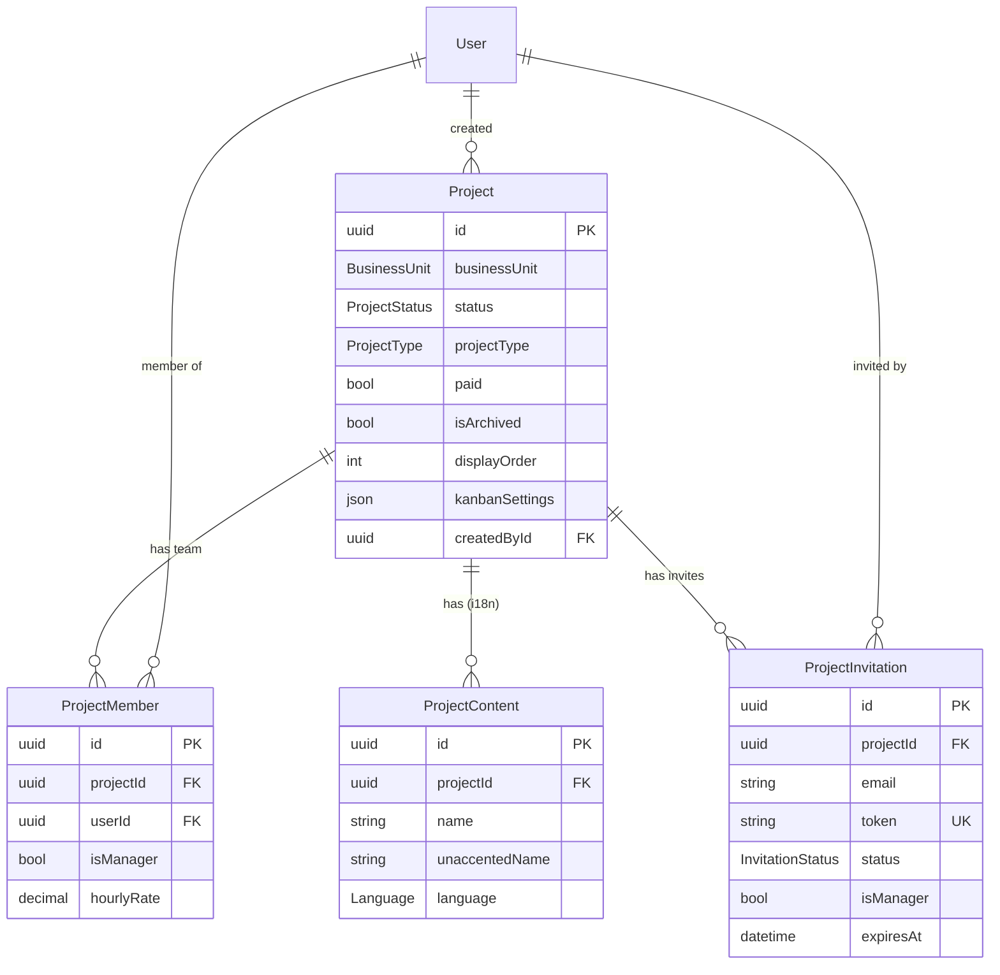
```mermaid
erDiagram
    Project ||--o{ ProjectContent : "has (i18n)"
    Project ||--o{ ProjectMember : "has team"
    Project ||--o{ ProjectInvitation : "has invites"
    User ||--o{ ProjectMember : "member of"
    User ||--o{ Project : "created"
    User ||--o{ ProjectInvitation : "invited by"

    Project {
        uuid id PK
        BusinessUnit businessUnit
        ProjectStatus status
        ProjectType projectType
        bool paid
        bool isArchived
        int displayOrder
        json kanbanSettings
        uuid createdById FK
    }
    ProjectContent { uuid id PK  uuid projectId FK  string name  string unaccentedName  Language language }
    ProjectMember { uuid id PK  uuid projectId FK  uuid userId FK  bool isManager  decimal hourlyRate }
    ProjectInvitation { uuid id PK  uuid projectId FK  string email  string token UK  InvitationStatus status  bool isManager  datetime expiresAt }
```

**Smart add-member / invite sequence** *(dossier 05 §8.3)*

```mermaid
sequenceDiagram
    participant FE as AddMemberDialog
    participant S as ProjectsService.addMemberSmart
    participant F as FetchProjectRepository
    participant I as CreateInvitationRepository
    participant M as MailService
    participant N as NotificationsService
    FE->>S: POST /:projectId/members {userId|email,isManager}
    S->>S: ensureProjectExists; isExecutive / isProjectManager
    alt userId provided (executives only)
        S->>F: findMember(projectId,userId)
        F-->>S: existing?
        alt already member
            S-->>FE: 409 member exists
        else
            S->>F: addMember -> ProjectMember
            S-->>FE: 201 CreatedProjectMemberDto
        end
    else email provided (exec or manager)
        S->>S: ensureInvitationEligibility
        S->>I: upsert invitation (token,expiry)
        S->>M: sendHtmlEmail(join link)
        S-)N: createNotification (if invitee has account)
        S-->>FE: 201 CreatedInvitationDto
    end
```

**Notable findings (verified).** The list query never filters `isArchived` (archiving is only enforced
client-side); per-member capacity is mathematically circular (identical utilization% for every member);
the invitation flow is backend-complete but has **no acceptance UI** (emails link to a nonexistent
`/projects/join` route); and member-update PATCH is destructive (`deleteMany`+`createMany`, dropping
`hourlyRate`). This module — unusually — has real behavioural unit tests (`projects.service.spec.ts`,
854 lines). *(Dossier 05 §11, §13.)*

## 5.3 Agile backlog — Epics, Sprints, Milestones

**Purpose.** The agile planning layer of a project: **Epics** (large features), **Sprints** (time-boxed
iterations with a lifecycle), and **Milestones** (target dates), plus derived analytics (burndown,
velocity, Gantt). Epics and Sprints are hard-gated to `AGILE` projects by `AgileOnlyGuard`; Milestones
deliberately are not (they serve FREESTYLE projects too). *(Dossier 06 §1–2.)*

**Domain model & rules.** Three sub-modules (`epics/`, `sprints/`, `milestones/`), 19 endpoints, each
following the four-layer pattern. The **Sprint state machine** (`Pending → Running → Stopped/Completed`,
with a single-running-sprint-per-project rule) is a genuine shared contract: the backend validator and
the frontend card actions agree exactly. Every write path enqueues an AI embedding-index job. *(Dossier
06 §3–4, §8.1.)*

**Sprint status state machine** *(dossier 06 §8.1)*

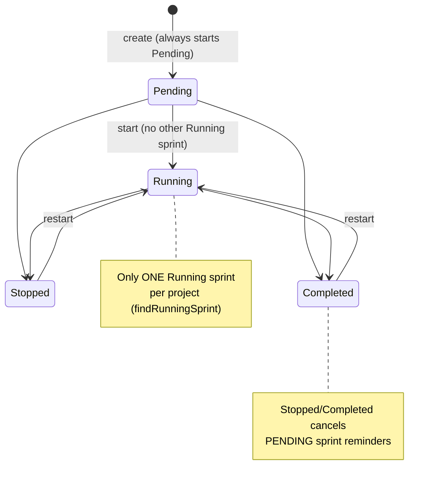
```mermaid
stateDiagram-v2
    [*] --> Pending: create (always starts Pending)
    Pending --> Running: start (no other Running sprint)
    Pending --> Stopped
    Pending --> Completed
    Running --> Stopped
    Running --> Completed
    Stopped --> Running: restart
    Completed --> Running: restart
    note right of Running
      Only ONE Running sprint
      per project (findRunningSprint)
    end note
    note right of Completed
      Stopped/Completed cancels
      PENDING sprint reminders
    end note
```

**Create-sprint sequence** *(dossier 06 §8.3)*

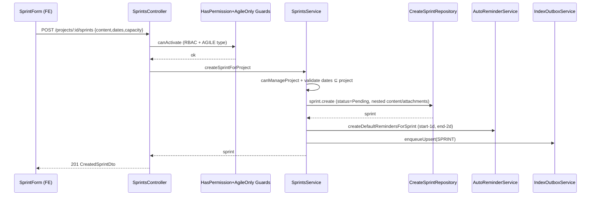
```mermaid
sequenceDiagram
    participant UI as SprintForm (FE)
    participant API as SprintsController
    participant G as HasPermission+AgileOnly Guards
    participant S as SprintsService
    participant R as CreateSprintRepository
    participant AR as AutoReminderService
    participant OB as IndexOutboxService
    UI->>API: POST /projects/:id/sprints {content,dates,capacity}
    API->>G: canActivate (RBAC + AGILE type)
    G-->>API: ok
    API->>S: createSprintForProject
    S->>S: canManageProject + validate dates ⊆ project
    S->>R: sprint.create (status=Pending, nested content/attachments)
    R-->>S: sprint
    S->>AR: createDefaultRemindersForSprint (start-1d, end-2d)
    S->>OB: enqueueUpsert(SPRINT)
    S-->>API: sprint
    API-->>UI: 201 CreatedSprintDto
```

**Notable findings (verified).** `SprintContent @@unique([language,name])` is **global, not
project-scoped** — two projects can't share a sprint name (same class of bug as `ProjectContent`).
Multi-step writes are non-atomic (partial failures orphan attachment rows/files). The executive-RBAC
helper block is triplicated across the three services and has already drifted (sprints fall back to
`ScrumMaster`, epics/milestones to `ProductOwner`). Gantt sprint rows lack a name (SprintContent never
joined). *(Dossier 06 §12, §13.)*

## 5.4 Tasks (core)

**Purpose.** The project work-item system and the richest module in the codebase: task CRUD, a
per-project customizable Kanban with status transitions and WIP limits, backlog & sprint assignment,
dependencies, time logging, labels, and threaded comments with mentions/likes. 35 endpoints across two
controllers, over 11 models. `TasksService` is a single 2735-line class. *(Dossier 07 §1–2.)*

**Data-driven Kanban.** A project's board is defined by `ProjectTaskStatus` rows (columns + colors +
`allowedTransitions` string-array state machine), seeded lazily on first read (6 AGILE / 3 FREESTYLE
system columns). `Task.status` is a **free TEXT** field holding either a system-enum name or a custom
status name; referential integrity with `ProjectTaskStatus` is application-enforced. Moves are gated by
transition validation, dependency-blocking (a task cannot leave a column while blocked by an unfinished
task, via circular-dependency DFS), and per-column WIP limits. All data access uses the Prisma builder —
**no raw SQL**. *(Dossier 07 §3, §4.1, §9.)*

**Two-tier, project-scoped authorization.** Every route carries a coarse `@Permissions` gate; inside the
service a second, project-scoped check runs against `ProjectMember.isManager` and the caller's roles,
with executives resolved by business-unit scoping (CEO=all, CTO=TawerDev, CMO=TawerCreative). Graduated
capability helpers (`canAccessProject`, `canCreateTaskForProject`, `canManageBacklog`,
`canAdvanceTaskWorkflow`, …) tune who may do what. *(Dossier 07 §4.2.)*

**ERD slice** *(dossier 07 §8.1)*

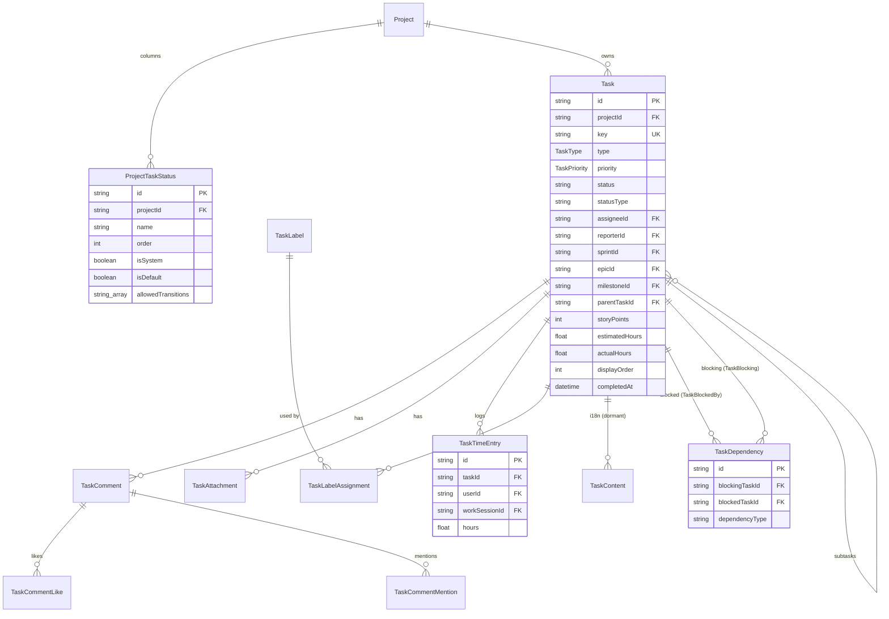
```mermaid
erDiagram
    Task ||--o{ TaskComment : "has"
    Task ||--o{ TaskAttachment : "has"
    Task ||--o{ TaskTimeEntry : "logs"
    Task ||--o{ TaskLabelAssignment : "tagged"
    TaskLabel ||--o{ TaskLabelAssignment : "used by"
    Task ||--o{ TaskContent : "i18n (dormant)"
    Task ||--o{ TaskDependency : "blocked (TaskBlockedBy)"
    Task ||--o{ TaskDependency : "blocking (TaskBlocking)"
    Task ||--o{ Task : "subtasks"
    TaskComment ||--o{ TaskCommentLike : "likes"
    TaskComment ||--o{ TaskCommentMention : "mentions"
    Project ||--o{ ProjectTaskStatus : "columns"
    Project ||--o{ Task : "owns"

    Task {
        string id PK
        string projectId FK
        string key UK
        TaskType type
        TaskPriority priority
        string status
        string statusType
        string assigneeId FK
        string reporterId FK
        string sprintId FK
        string epicId FK
        string milestoneId FK
        string parentTaskId FK
        int storyPoints
        float estimatedHours
        float actualHours
        int displayOrder
        datetime completedAt
    }
    ProjectTaskStatus {
        string id PK
        string projectId FK
        string name
        int order
        boolean isSystem
        boolean isDefault
        string_array allowedTransitions
    }
    TaskDependency { string id PK  string blockingTaskId FK  string blockedTaskId FK  string dependencyType }
    TaskTimeEntry { string id PK  string taskId FK  string userId FK  string workSessionId FK  float hours }
```

**Move-task-in-Kanban sequence** *(dossier 07 §8.3)*

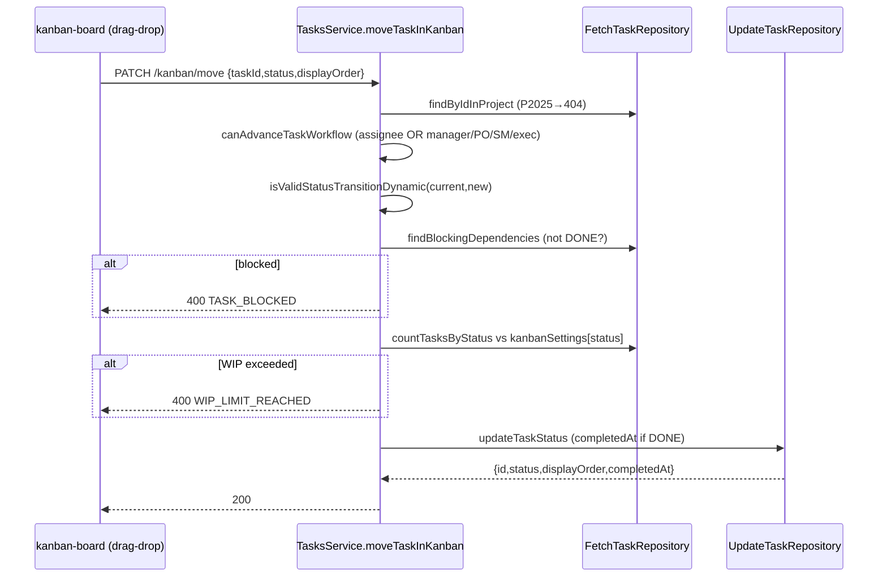
```mermaid
sequenceDiagram
    participant FE as kanban-board (drag-drop)
    participant S as TasksService.moveTaskInKanban
    participant F as FetchTaskRepository
    participant U as UpdateTaskRepository
    FE->>S: PATCH /kanban/move {taskId,status,displayOrder}
    S->>F: findByIdInProject (P2025→404)
    S->>S: canAdvanceTaskWorkflow (assignee OR manager/PO/SM/exec)
    S->>S: isValidStatusTransitionDynamic(current,new)
    S->>F: findBlockingDependencies (not DONE?)
    alt blocked
        S-->>FE: 400 TASK_BLOCKED
    end
    S->>F: countTasksByStatus vs kanbanSettings[status]
    alt WIP exceeded
        S-->>FE: 400 WIP_LIMIT_REACHED
    end
    S->>U: updateTaskStatus (completedAt if DONE)
    U-->>S: {id,status,displayOrder,completedAt}
    S-->>FE: 200
```

**Notable findings (verified).** `generateTaskKey` = `TASK-<count+1>` is racy and reuses keys after
deletes; `TaskContent`/`Task.statusType`/`TaskStatusType` enum are dormant; `completedAt` only tracks the
literal `'DONE'` and is never cleared on reopen; attachment files are orphaned on disk; `bulkUpdateStatus`
skips WIP/blocked checks with weaker auth; `moveToSprint` force-resets status to TODO. The frontend
hard-caps the task list/kanban at 100 items and swallows fetch errors to `[]`. **Zero backend tests**;
11 frontend property tests cover client-side transforms only. *(Dossier 07 §11, §13.)*

## 5.5 Personal Tasks / To-do

**Purpose.** A private per-user to-do list (sub-tasks, attachments, comments, priorities, statuses,
due/reminder dates, manual ordering), fully separate from project tasks — different tables
(`UserTask`/`UserTaskContent`/`UserTaskComment`/`UserTaskAttachment`) and different enums. Every query is
scoped by `userId`, so one user's list is never visible to another. 7 `*.own` endpoints. *(Dossier 08
§1–3, §5.)*

**Reminder engine.** An `EVERY_MINUTE` cron, guarded by the Postgres distributed lock, scans due-but-
unnotified tasks and fans out to the user's enabled channels (push/mail/telegram/ntfy), then marks
`notified=true`. *(Dossier 08 §4, §8.3.)*

**Reminder cron fan-out sequence** *(dossier 08 §8.3)*

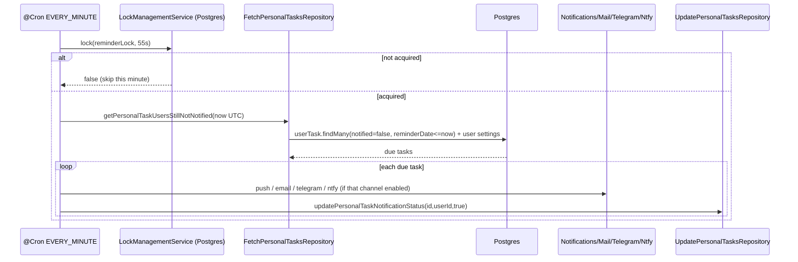
```mermaid
sequenceDiagram
    participant Cron as @Cron EVERY_MINUTE
    participant Lock as LockManagementService (Postgres)
    participant R as FetchPersonalTasksRepository
    participant DB as Postgres
    participant N as Notifications/Mail/Telegram/Ntfy
    participant UR as UpdatePersonalTasksRepository

    Cron->>Lock: lock(reminderLock, 55s)
    alt not acquired
        Lock-->>Cron: false (skip this minute)
    else acquired
        Cron->>R: getPersonalTaskUsersStillNotNotified(now UTC)
        R->>DB: userTask.findMany(notified=false, reminderDate<=now) + user settings
        DB-->>R: due tasks
        loop each due task
            Cron->>N: push / email / telegram / ntfy (if that channel enabled)
            Cron->>UR: updatePersonalTaskNotificationStatus(id,userId,true)
        end
    end
```

**Notable findings (verified).** A **comment-create IDOR (write)**: `createPersonalTaskComment` sets the
author to the caller but never checks the target task belongs to them, so a user who knows another user's
task UUID can post comments onto that private task. Delete uses `deleteMany`, so the `P2025→404` branch is
dead (returns 204 for missing/not-owned). Sub-task attachment files are orphaned on cascade delete. The
frontend `search` param is silently ignored (no DTO field). *(Dossier 08 §9, §13.)*

## 5.6 Time & Attendance (Work Days / Work Sessions)

**Purpose.** Employee attendance: a daily check-in/check-out gate that opens/closes `WorkSession`s
(remote/onsite, device), computes worked time, nudges late/forgotten sessions across four channels, and
exposes per-user & per-manager statistics. A `WorkDay` (one per user per business day, holding
mood/performance/notes) aggregates 1..N `WorkSession`s. The business day is anchored at **03:00 UTC**;
the whole time model is UTC-only with no per-user timezone. 9 endpoints. *(Dossier 09 §1–4.)*

**ERD slice** *(dossier 09 §8.1)*

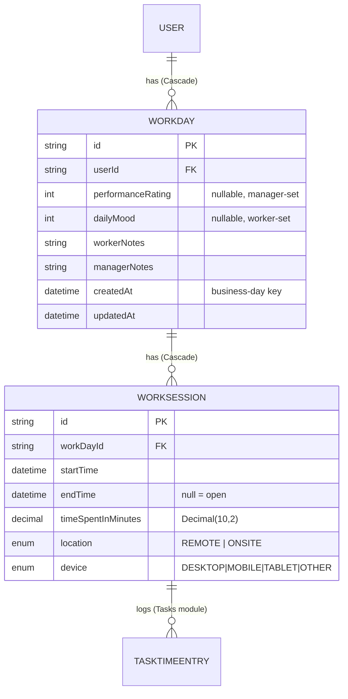
```mermaid
erDiagram
    USER ||--o{ WORKDAY : "has (Cascade)"
    WORKDAY ||--o{ WORKSESSION : "has (Cascade)"
    WORKSESSION ||--o{ TASKTIMEENTRY : "logs (Tasks module)"

    WORKDAY {
        string id PK
        string userId FK
        int performanceRating "nullable, manager-set"
        int dailyMood "nullable, worker-set"
        string workerNotes
        string managerNotes
        datetime createdAt "business-day key"
        datetime updatedAt
    }
    WORKSESSION {
        string id PK
        string workDayId FK
        datetime startTime
        datetime endTime "null = open"
        decimal timeSpentInMinutes "Decimal(10,2)"
        enum location "REMOTE | ONSITE"
        enum device "DESKTOP|MOBILE|TABLET|OTHER"
    }
```

**Check-in sequence (with the dead-zone failure branch)** *(dossier 09 §8.2)*

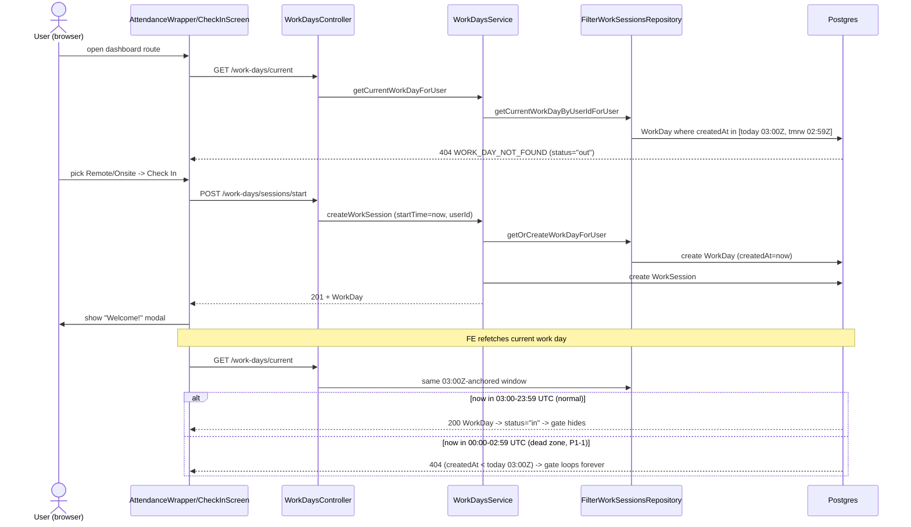
```mermaid
sequenceDiagram
    actor U as User (browser)
    participant GATE as AttendanceWrapper/CheckInScreen
    participant API as WorkDaysController
    participant SVC as WorkDaysService
    participant REPO as FilterWorkSessionsRepository
    participant DB as Postgres

    U->>GATE: open dashboard route
    GATE->>API: GET /work-days/current
    API->>SVC: getCurrentWorkDayForUser
    SVC->>REPO: getCurrentWorkDayByUserIdForUser
    REPO->>DB: WorkDay where createdAt in [today 03:00Z, tmrw 02:59Z]
    DB-->>GATE: 404 WORK_DAY_NOT_FOUND (status="out")

    U->>GATE: pick Remote/Onsite -> Check In
    GATE->>API: POST /work-days/sessions/start
    API->>SVC: createWorkSession (startTime=now, userId)
    SVC->>REPO: getOrCreateWorkDayForUser
    REPO->>DB: create WorkDay (createdAt=now)
    SVC->>DB: create WorkSession
    SVC-->>GATE: 201 + WorkDay
    GATE->>U: show "Welcome!" modal

    Note over GATE,DB: FE refetches current work day
    GATE->>API: GET /work-days/current
    API->>REPO: same 03:00Z-anchored window
    alt now in 03:00-23:59 UTC (normal)
        DB-->>GATE: 200 WorkDay -> status="in" -> gate hides
    else now in 00:00-02:59 UTC (dead zone, P1-1)
        DB-->>GATE: 404 (createdAt < today 03:00Z) -> gate loops forever
    end
```

**Notable findings (verified).** The **P1-1 check-in dead zone** (00:00–02:59 UTC): a WorkDay created in
that window has `createdAt` before today's 03:00 anchor, so `/current` 404-loops and check-out can't find
the session. Plus several access-control defects: `PATCH :id/manager` passes the caller's id as the
workDayId → always 404 (dead endpoint); `PATCH :id/worker` never sets `userId` → any worker can patch
**any** WorkDay's mood/notes by id (IDOR write); `GET /work-days/manager` uses the `.own` permission with
no scoping → leaks **all** users' work days; the manager details endpoint overrides the requested users
with the caller's own id. The nightly auto-close cron has **no distributed lock** (double-runs). Tests
are `toBeDefined()` skeletons only. *(Dossier 09 §9, §13.)*

## 5.7 Events & Calendar

**Purpose.** A company calendar with three event kinds (`Meeting`, `Event`, `PersonalEvent`), rendered in
a **custom** month/week/day/agenda calendar built on `date-fns` + `@dnd-kit` (the `@fullcalendar/*`
dependencies in `package.json` are dead — imported nowhere). A per-minute reminder cron fans out
multi-channel reminders before each event, with escalating notification thresholds. 4 endpoints.
*(Dossier 10 §1–2, §13.4.)*

**Authorization model.** All four event permissions sit in `DEFAULT_PERMISSIONS_FOR_ALL_ROLES`, so the
guard only asserts "authenticated"; the real control is a service-level owner/executive check on update
and delete only. Read is correctly scoped at the query level (own ∪ participant ∪ `toAllUsers`).
*(Dossier 10 §9.)*

**ERD slice** *(dossier 10 §8.1)*

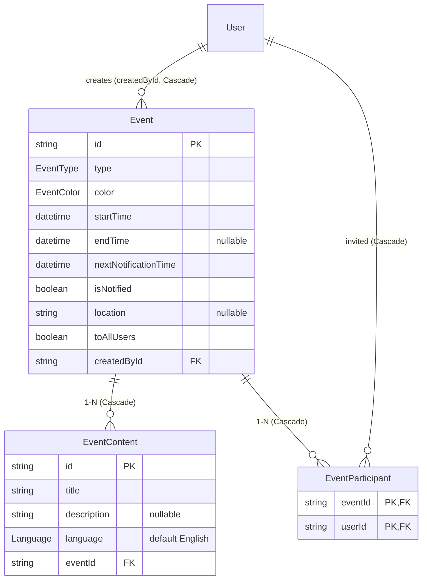
```mermaid
erDiagram
    User ||--o{ Event : "creates (createdById, Cascade)"
    Event ||--o{ EventContent : "1-N (Cascade)"
    Event ||--o{ EventParticipant : "1-N (Cascade)"
    User ||--o{ EventParticipant : "invited (Cascade)"

    Event {
        string id PK
        EventType type
        EventColor color
        datetime startTime
        datetime endTime "nullable"
        datetime nextNotificationTime
        boolean isNotified
        string location "nullable"
        boolean toAllUsers
        string createdById FK
    }
    EventContent { string id PK  string title  string description "nullable"  Language language "default English"  string eventId FK }
    EventParticipant { string eventId PK,FK  string userId PK,FK }
```

**Reminder cron sequence** *(dossier 10 §8.3)*

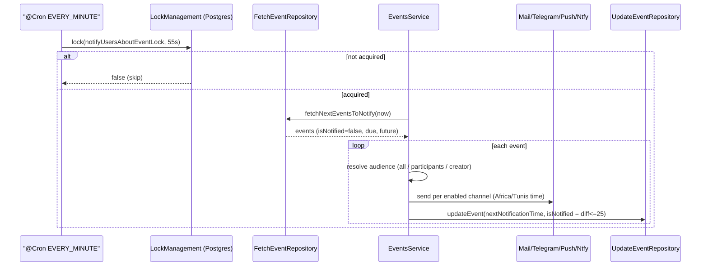
```mermaid
sequenceDiagram
    participant Cron as "@Cron EVERY_MINUTE"
    participant Lock as LockManagement (Postgres)
    participant F as FetchEventRepository
    participant S as EventsService
    participant Ch as Mail/Telegram/Push/Ntfy
    participant U as UpdateEventRepository

    Cron->>Lock: lock(notifyUsersAboutEventLock, 55s)
    alt not acquired
        Lock-->>Cron: false (skip)
    else acquired
        S->>F: fetchNextEventsToNotify(now)
        F-->>S: events (isNotified=false, due, future)
        loop each event
            S->>S: resolve audience (all / participants / creator)
            S->>Ch: send per enabled channel (Africa/Tunis time)
            S->>U: updateEvent(nextNotificationTime, isNotified = diff<=25)
        end
    end
```

**Notable findings (verified).** `updateEvent` overwrites `createdById` with the editor (ownership
hijack); an executive deleting a non-owned event is a silent 204 no-op (`deleteMany` filters
`createdById`); `createEvent` has **no gate on `toAllUsers`**, so any user can broadcast company-wide
reminders (spam vector); and the frontend role matrix is not enforced server-side. No recurrence. Tests
are stubs only. *(Dossier 10 §9, §13.)*

## 5.8 Reminders

**Purpose.** A reminder system: project-scoped CRUD plus a personal `/reminders/me` + dismiss surface,
delivering across four channels (mail/push/telegram/ntfy) at a scheduled time. `Reminder` is a hybrid
polymorphic model (a discriminator `entityType` + untyped `entityId`, plus concrete nullable FKs to
project/task/milestone). 7 endpoints across two controllers. Four locked crons handle pending
(EVERY_MINUTE), recurring (EVERY_HOUR), overdue (EVERY_HOUR), and stuck (/6h) reminders, respecting each
user's notification settings. *(Dossier 11 §1–4.)*

**ERD slice** *(dossier 11 §8)*

```mermaid
erDiagram
    USER ||--o{ REMINDER : "userId (recipient)"
    USER ||--o{ REMINDER : "createdById (author)"
    PROJECT ||--o{ REMINDER : "projectId (cascade)"
    TASK ||--o{ REMINDER : "taskId (FK dormant)"
    MILESTONE ||--o{ REMINDER : "milestoneId (FK dormant)"
    REMINDER ||--o{ REMINDERCHANNEL : "channels (cascade)"

    REMINDER {
        string id PK
        string userId FK
        string createdById FK
        enum   entityType
        string entityId "polymorphic - actually used"
        string projectId FK "nullable"
        string taskId FK "never populated"
        string milestoneId FK "never populated"
        string message
        datetime reminderAt
        bool   isRecurring
        string recurrenceRule
        enum   status
        datetime sentAt
        datetime dismissedAt
    }
    REMINDERCHANNEL { string id PK  string reminderId FK  enum channel }
```

**Pending-reminder-fires sequence** *(dossier 11 §8)*

```mermaid
sequenceDiagram
    autonumber
    participant Cron as ReminderScheduler<br/>(EVERY_MINUTE)
    participant Lock as LockManagement
    participant Repo as FetchReminderRepo
    participant Auto as AutoReminderService
    participant DB as Postgres
    participant Ch as Mail/Push/Telegram/Ntfy

    Cron->>Lock: lock('handlePendingRemindersLock', 55s)
    alt lock not acquired
        Lock-->>Cron: false (another instance running) → return
    else acquired
        Cron->>Repo: findPending(now)
        Repo->>DB: SELECT WHERE status=PENDING AND reminderAt<=now
        DB-->>Repo: reminders[] (+user +channels)
        loop each reminder
            Cron->>Auto: sendReminder(reminder)
            loop each channel
                Auto->>DB: load user notificationSettings + integrations
                Auto->>Ch: dispatch if channel enabled
            end
            Cron->>Repo: markAsSent(id) → status=SENT, sentAt=now
        end
    end
```

**Notable findings (verified).** Recurrence is effectively **dead** — the every-minute pending cron marks
recurring reminders SENT before the hourly recurring cron can re-fire them, and they are never reset to
PENDING. `FAILED` status is never written. The `taskId`/`milestoneId` cascade FKs are **never populated**,
so deleting a task/milestone orphans its pending reminders. Auto-reminders target the *creator*, not the
assignee. The `recurrenceRule` is a brittle 3-prefix string match, not a real cron parser. Zero backend
specs. *(Dossier 11 §13.)*

## 5.9 Notifications (multi-channel)

**Purpose.** The multi-channel delivery backbone — in-app inbox + FCM push, email, Telegram, and ntfy.
Seven models plus `DeviceType`/`ChannelType` enums. The `NotificationsModule` itself owns **only** in-app
+ FCM push; the four-channel fan-out is **decentralized and duplicated in every consumer module** (there
is no central dispatcher), each gating a channel on `UserNotificationSettings` booleans.
`createNotificationFromSystem` is the shared in-app/push sink for seven modules. 6 endpoints. *(Dossier
12 §1–4.)*

**Multi-channel delivery pipeline** *(dossier 12 §8.1)*

```mermaid
flowchart TD
  subgraph Consumers["Consumer modules (crons / actions)"]
    PT[personal-tasks]:::c
    RM[reminders]:::c
    WD[work-days]:::c
    EV[events]:::c
    SV[servers]:::c
    SP[sprints/tasks]:::c
  end

  PT & RM & WD & EV & SV & SP --> DECIDE{Read user notificationSettings\n+ telegramBot + ntfyIntegration}

  DECIDE -->|pushEnabled| CNFS[NotificationsService.createNotificationFromSystem]
  DECIDE -->|emailEnabled| MAIL[MailService.sendHtmlEmail]
  DECIDE -->|telegramEnabled && chatId| TG[TelegramService.sendTelegramMessage]
  DECIDE -->|ntfyEnabled && topic| NT[NtfyService.sendNtfyMessage]

  CNFS --> FCM[FirebaseService FCM multicast]
  CNFS --> DB[(UserNotification + Notification\n+ NotificationContent)]
  FCM --> SW[firebase-messaging-sw.js\n+ browser push]
  DB --> BELL[Web bell / list]

  MAIL --> SMTP[(SMTP / Mailpit)]
  TG --> TAPI[(Telegram Bot API)]
  NT --> NTFY[(ntfy server)]

  classDef c fill:#eef,stroke:#557;
```

**ERD slice** *(dossier 12 §8.3)*

```mermaid
erDiagram
  User ||--o{ Notification : "sends (sendBy)"
  User ||--o{ UserNotification : receives
  User ||--o{ NotificationToken : "has devices"
  User ||--|| UserNotificationSettings : has
  User ||--|| UserTelegramBot : has
  User ||--|| UserNtfyIntegration : has
  Notification ||--o{ NotificationContent : "translations (English only)"
  Notification ||--o{ UserNotification : "fan-out (unique per user)"

  Notification { string id PK; string image; string sendBy FK }
  NotificationContent { string id PK; string title; string body; string url; Language language }
  UserNotification { string id PK; boolean isSeen; string notificationId FK; string userId FK }
  NotificationToken { string id PK; string token UK; DeviceType deviceType; string userId FK }
  UserNotificationSettings { string userId UK; boolean emailNotificationsEnabled; boolean pushNotificationsEnabled; boolean telegramNotificationsEnabled; boolean ntfyNotificationsEnabled }
  UserTelegramBot { string userId UK; string chatId }
  UserNtfyIntegration { string userId UK; string topic; string token }
```

**Notable findings (verified).** ntfy is effectively **dead** — the UI tells the user to use their `user.id`
as the topic but nothing ever writes the topic, so `sendNtfyMessage` early-returns on a null topic. The
in-app inbox is coupled to `pushNotificationsEnabled` (disabling push loses notification history).
`notification.create` is in `DEFAULT_PERMISSIONS_FOR_ALL_ROLES`, so **any** role can `sendToAllUsers`
(company-wide spam). `MailService` re-throws while the other channels swallow errors (inconsistent
contract). Tests are skeleton stubs and the service spec fails DI. *(Dossier 12 §13.)*

## 5.10 Infrastructure Monitoring

**Purpose.** Server/service registration and health monitoring: five models
(`Server`/`Service`/`ServerNotification`/`ServiceNotification`/`UserServerManagement`) plus a public
`GET /health`. Six lock-guarded `EVERY_MINUTE` crons ICMP-ping servers and HTTP-probe services, writing
outbox `*Notification{isSent}` rows that a fan-out cron delivers across four channels (reusing the
notification settings). Two-tier authorization: CTO=global write, DevopsEngineer=manager-scoped,
CEO=read-only. 10 endpoints. *(Dossier 13 §1–4.)*

**Health-check cycle sequence** *(dossier 13 §8.1)*

```mermaid
sequenceDiagram
    autonumber
    participant Sch as Nest Scheduler (EVERY_MINUTE)
    participant Svc as ServersService
    participant Lock as LockManagement (Postgres)
    participant DB as Prisma/Postgres
    participant Net as Target server (ICMP)
    participant Snd as sendNotificationsForServers
    participant Mgr as Manager channels

    Sch->>Svc: checkServersStatus()
    Svc->>Lock: lock(checkServersStatusLock, 55s)
    Lock-->>Svc: acquired?
    alt not acquired
        Svc-->>Sch: return (another node running)
    else acquired
        Svc->>DB: getRunningServersIps() (status=Running, no unsent notif)
        DB-->>Svc: [{id,name,ip}]
        loop each server
            Svc->>Net: ping.probe(ip, timeout 10)
            Net-->>Svc: {alive}
            alt not alive
                Svc->>DB: createServerNotification(id, "…is down") (isSent=false)
            end
        end
    end
    Note over Sch,Snd: independent cron, same minute
    Sch->>Snd: sendNotificationsForServers()
    Snd->>DB: getNotificationsMessagesForServers() (isSent=false)
    DB-->>Snd: notif + server.managers + settings
    loop each manager
        Snd->>Mgr: telegram / ntfy / email / push (per notificationSettings)
    end
    Snd->>DB: updateServerNotificationStatus(id) -> isSent=true
```

**Notable findings (verified).** Non-CTO service update/delete builds a `managers.some` filter on `Service`
(no such relation) → **500** for DevopsEngineer; `checkHttp` calls `axios.get` on a schemeless `domain`
(seed = `api.tawer.tn`) → throws → every service reported down; the non-CTO createService branch is dead
(only CTO holds `SERVICE_CREATE`); alert spam has no ack/cooldown; and the frontend grants
CEO/customerSupport infra access the API denies (403). Status is a manual label, not live health — no
`lastHealthCheck`/uptime persisted. *(Dossier 13 §13.)*

## 5.11 AI Copilot & Estimation (RAG) — the differentiator

**Purpose.** A permission-scoped Retrieval-Augmented-Generation subsystem: it embeds project content into
pgvector, retrieves it with hybrid lexical + vector search, and uses Google Gemini to (a) answer grounded
natural-language questions with clickable citations — refusing honestly when the corpus doesn't support an
answer — and (b) estimate a draft task's effort from the real `actualHours` of similar completed tasks
(k-NN reference-class forecasting). The design intent throughout is *honesty over coverage*. *(Dossier 14
§1–2.)*

**Architecture.** Three tables (`DocumentEmbedding` with `vector(1536)` + hand-built HNSW cosine index and
a generated `tsvector` + GIN index; `IndexOutbox` transactional work queue with backoff; `CopilotQueryLog`
telemetry), 5 endpoints, 9 single-responsibility services, and 2 raw-SQL repositories that quarantine the
untypeable pgvector/tsvector queries. The pipeline: Gemini embeddings (Matryoshka 1536, L2-normalized,
sha256 hash-skip) → an **outbox write-path seam** (fire-and-forget, so a failed index enqueue can never
break a task save) → a 1-minute sweeper cron (Postgres-locked) that drains the queue → **hybrid
vector + lexical retrieval fused by Reciprocal Rank Fusion (k=60)** + an optional flash-lite reranker → a
grounded `gemini-2.5-flash` answer with system/user split for injection safety, `[n]` citations, and a
cosine confidence gate (0.5) driving honest refusal. Estimation is k-NN over `DONE` tasks, similarity-
weighted median with a size-aware hours-per-point band. *(Dossier 14 §3–4, §7.)*

**Index-a-task sequence (write-path → outbox → embedding)** *(dossier 14 §8.1)*

```mermaid
sequenceDiagram
    actor U as User
    participant TS as TasksService
    participant OB as IndexOutbox (table)
    participant SW as IndexSweeperJob (cron 1min)
    participant IX as IndexingService
    participant GE as Gemini (embed)
    participant DE as DocumentEmbedding (pgvector)

    U->>TS: create/update task
    TS->>TS: persist task (+notifications, reminders)
    TS->>OB: enqueueUpsert(projectId, TASK, id)  %% idempotent, swallow errors
    Note over TS,U: request returns immediately (no Gemini on hot path)
    SW->>OB: claimDue(25)  %% under distributed lock
    SW->>IX: syncEntity(TASK, id)
    IX->>IX: re-read live row, build chunks, hash
    IX->>GE: embedBatch(changed chunks) [skip unchanged by hash]
    GE-->>IX: 1536-dim vectors (L2-normalized)
    IX->>DE: upsertChunk(...) ON CONFLICT
    SW->>OB: markDone / markRetry(backoff) / markFailed
```

**Copilot query sequence (hybrid retrieve → rerank → ground → cite)** *(dossier 14 §8.2)*

```mermaid
sequenceDiagram
    actor U as User
    participant FE as useCopilot (SSE)
    participant CO as CopilotService
    participant RE as RetrievalService
    participant AA as AiAccessService
    participant ER as EmbeddingRepository
    participant RR as RerankerService
    participant GE as Gemini (flash)
    participant LOG as CopilotQueryLog

    U->>FE: ask(question, projectId)
    FE->>CO: GET /ai/copilot/stream
    CO->>RE: retrieve(userId, roles, question, projectId)
    RE->>AA: allowedProjectIds()  %% 403 if projectId out of scope
    RE->>ER: searchVector (cosine ANN)
    RE->>ER: searchLexical (ts_rank_cd)  %% hybrid arm
    RE->>RE: fuseRrf(vector, lexical)
    opt rerank flag on
        RE->>RR: rerank(question, fused pool)
    end
    RE-->>CO: {candidates, topScore, sufficient}
    alt topScore < 0.5 (insufficient)
        CO-->>FE: refusal token + final(insufficientContext=true)
    else sufficient
        CO->>GE: generateGroundedStream(system, numbered sources)
        GE-->>CO: token deltas
        CO-->>FE: token events
        CO->>CO: parse [n] markers -> resolveCitations
        CO-->>FE: final(citations)
    end
    CO->>LOG: create receipt (question, answer, topScore, latency)
```

**ERD slice** *(dossier 14 §8.3)*

```mermaid
erDiagram
    Project ||--o{ DocumentEmbedding : "projectId (scope key)"
    Project ||--o{ IndexOutbox : "projectId"
    DocumentEmbedding {
        string id PK
        string projectId
        enum   entityType "TASK|TASK_COMMENT|EPIC|MILESTONE|SPRINT"
        string entityId
        int    chunkIndex
        string content
        vector embedding "vector(1536), HNSW"
        tsvector contentTsv "generated, GIN"
        string contentHash "sha256"
    }
    IndexOutbox { string id PK  enum op "UPSERT|DELETE"  enum status "PENDING|DONE|FAILED"  int attempts  datetime nextAttemptAt }
    CopilotQueryLog { string id PK  string userId  string projectId  string question  string answer  float topScore  float faithfulnessScore  int latencyMs }
    User ||--o{ CopilotQueryLog : "userId"
```

**Security (a strength here).** Retrieval permission scoping is enforced **in SQL** — every search applies
`projectId = ANY($allowedIds)` *before* ranking, so there is structurally no code path that can surface a
chunk from a project the user cannot access. The prompt-injection boundary passes the system instruction
and untrusted sources in separate turns; all raw SQL is parameterized. *(Dossier 14 §9.)*

**Evaluation.** Rather than unit tests, the module ships a substantial **offline eval harness**
(`src/ai/eval/`, run via `npm run ai:eval:*`): Recall@k / Precision@k / MRR / nDCG over committed gold
sets (retrieval 12 Q, keyword 10 Q, QA 10 Q), an LLM faithfulness judge, citation precision/recall, refusal
correctness, and leave-one-out MAE/RMSE for estimation, with ablations. Reported M5 numbers (cited from
`docs/ai-hybrid-rerank-eval.md`, not re-run): on the keyword gold set, hybrid lifts **MRR 0.57→1.00** and
**R@1 0.30→1.00** over vector-only; the semantic set is saturated (all configs tie). *(Dossier 14 §11.)*

**Notable findings (verified).** Comment edits/deletes are **not** enqueued on the write path, so a deleted
comment stays retrievable and citable for up to ~24h until the nightly reconcile (breaks "never cite what
doesn't exist"). The confidence gate is cosine-only, so bare-keyword queries the lexical arm nails can
still be refused. Cancelled SSE streams are unlogged (telemetry skew). `CopilotQueryLog` stores plaintext
question + answer with no retention policy. **Zero AI unit tests.** *(Dossier 14 §13.)*

---

# Chapter 6 — Security

Security is a cross-cutting concern verified in dossier 03 and in the security section of every domain
dossier. This chapter consolidates the model and the verified gaps. It is deliberately honest: the
authorization *design* is strong and consistently applied, but several concrete defects were verified in
the code and are carried through to Chapter 10.

## 6.1 Authentication

Password login by email **or** phone, with bcrypt hashing (cost 10). The server issues a stateless JWT
**access** token and a DB-stored **refresh** token (`RefreshToken`, keyed by the token string itself,
enabling real logout/revocation of refresh sessions). A three-step password reset (request → verify →
reset) uses a `ResetPasswordCode`. New accounts self-register into `PendingApproval` with almost no
permissions until an executive assigns a real role. *(Dossier 03 §2–4, §9.)*

**Login sequence** *(dossier 03 §8)*

```mermaid
sequenceDiagram
    participant UI as Frontend
    participant C as AuthsController
    participant S as LoginService
    participant R as LoginRepository
    participant T as TokensService
    participant DB as Postgres
    UI->>C: POST /auths/login {email|phone, password}
    C->>S: loginUser(dto)
    S->>R: retrieveDataForLogin (isActive:true)
    R->>DB: SELECT user + roles + teams
    DB-->>S: user (or null)
    alt user missing
        S-->>UI: 404 USER_NOT_FOUND
    else
        S->>S: bcrypt.compare(pwd, hash)
        alt wrong password
            S-->>UI: 401 UNAUTHORIZED
        else ok
            S->>T: generateAccessAndRefresh(id, roles, teamIds)
            T-->>S: {access, refresh}
            S->>R: saveRefreshToken(userId, refresh)
            R->>DB: INSERT RefreshToken
            S-->>UI: 200 {access, refresh}
        end
    end
```

## 6.2 Authorization (RBAC)

Authorization is a **static, compile-time** role→permission map (`PERMISSIONS_FOR_ROLE`) covering 31
`UserType` roles and ~120 fine-grained permissions, enforced by `HasPermissionGuard` on **139 routes
across 18 controllers**. Guard semantics are **OR** across the route's required permissions and OR across
the user's roles. Fine-grained `*.own` vs `*.any` distinctions and per-project/business-unit scoping are
resolved **in the services** (e.g. tasks/projects push authorization into the Prisma `where`). An
`AgileOnlyGuard` additionally gates sprint/epic/task routes to `AGILE` projects. *(Dossier 03 §5, §9.)*

**Protected-request sequence** *(dossier 03 §8)*

```mermaid
sequenceDiagram
    participant UI as Frontend
    participant G as HasPermissionGuard
    participant T as TokensService
    participant Ctl as Controller
    participant Svc as Service
    UI->>G: request + Authorization: Bearer <access>
    G->>G: read @Permissions metadata
    alt no auth header & perms required
        G-->>UI: 401 UNAUTHORIZED
    else
        G->>T: verifyAuthenticationTokenAndReturnPayload(token)
        T-->>G: payload {id, roles, teamsIds}
        G->>G: any(perm in PERMISSIONS_FOR_ROLE[role])?
        alt no matching permission
            G-->>UI: 403 FORBIDDEN
        else
            G->>Ctl: next() (req.user set)
            Ctl->>Svc: handler (ownership checks here)
            Svc-->>UI: 2xx
        end
    end
```

## 6.3 Input validation & injection protection

A global `ValidationPipe({ transform: true })` with per-DTO `class-validator` decorators validates every
request body. Almost all data access is through Prisma's parameterized query builder, so SQL injection is
structurally prevented across most modules. The exceptions are two raw `$queryRawUnsafe` interpolated
queries — the user-listing/stats query in Users & Teams (dossier 04) and the work-day statistics-details
query (dossier 09) — mitigated only by DTO validators and quote-escaping, not parameterization. *(Dossier
03 §9; dossier 04 §9; dossier 09 §9.)*

## 6.4 Verified security gaps

The following are **verified in code** (evidence in the cited dossiers) and are the security-relevant
subset of Chapter 10's limitations:

| # | Gap | Source |
|---|---|---|
| S1 | **Access + refresh token TTL both `1200d`** (~3.3 years); access tokens are non-revocable (logout only deletes the refresh row) | D03 §9.1, D16 §9 |
| S2 | **`type` claim never validated** — a refresh token is accepted as an access token on every protected route | D03 §9.2 |
| S3 | **No rate limiting / lockout** (login, reset-code verify are brute-forceable); no security headers (helmet absent); **no global guard** (a handler that forgets `@UseGuards` is fully public) | D03 §9.3, §9.8 |
| S4 | **Weak reset code** — 5-digit `Math.random`, 15-min window | D03 §9.4 |
| S5 | **User enumeration** on login and reset flows | D03 §9.5 |
| S6 | **`ValidationPipe` has no `whitelist`** → mass-assignment surface (e.g. a user can set their own `image`) | D01 §13.5, D03 §9, D04 §9 |
| S7 | **Open CORS** (`enableCors()` with no allowlist) | D01 §13.6, D03 §9.6 |
| S8 | **Privilege escalation** — `deleteUserByAdmin` authorizes the caller against themselves, not the target (e.g. HRManager can disable a CEO) | D04 §9, §13 |
| S9 | **IDOR write** — personal-task comment create has no task-ownership check; work-day `PATCH :id/worker` has no owner scoping | D08 §9, D09 §13-3 |
| S10 | **Information disclosure** — `GET /work-days/manager` uses the `.own` permission with no management scoping → leaks all users' work days | D09 §13-5 |
| S11 | **Notification/event spam vectors** — any role can `sendToAllUsers` (notifications) or create a `toAllUsers` event (no executive gate) | D10 §9, D12 §13 |
| S12 | **Frontend tokens in `localStorage`** (XSS-exposed) + **SSR/edge auth guard disabled** (`proxy.ts` auth branch commented out); client RBAC is cosmetic | D03 §9, D15 §9 |
| S13 | **Secrets baked into the backend image** (no `.dockerignore` + `COPY . .` → `.env` with `SECRET_KEY`/`GEMINI_API_KEY`/`OPEN_ROUTER_API_KEY`) | D16 §9, §13 |

**Structural strengths (verified):** centralized, declarative, auditable RBAC on 139 routes; refresh
tokens as revocable server-side state; SQL-injection-safe by construction in most modules; least-privilege
default (`PendingApproval`); and — in the AI module — retrieval permission scoping enforced *in SQL* so
cross-project leakage is unrepresentable. *(Dossier 03 §14; dossier 14 §9.)*

---

# Chapter 7 — Réalisation (Implementation Walkthrough)

This chapter describes the user-facing flows as actually implemented. The dossiers document these flows
textually (frontend sections of dossiers 04–15); they do **not** contain UI screenshots.

> **`[TO PROVIDE — UI screenshots]`** Insert annotated screenshots for each flow below (login, projects
> board, kanban, calendar, to-do, attendance check-in, AI copilot panel, AI estimate suggestion). No
> dossier holds images; these must be captured from the running app.

## 7.1 Shared frontend shell

The whole app renders under one authenticated shell (`dashboard/(auth)` route group: sidebar + header +
attendance wrapper), with a small `(guest)` island for login/register/forgot-password. Server state is
TanStack Query; UI state is per-module Zustand; forms are react-hook-form + localized Zod schema
factories. The canonical module shape (`components/ hooks/ services/ store/ types/ validation/`) repeats
across all 10 frontend modules. *(Dossier 15 §4.)*

## 7.2 Key user flows (verified from the frontend code)

- **Login → gated app.** `signIn` stores both JWTs in `localStorage`; the `(auth)` layout resolves
  `/users/me` and pushes `/login` if no user resolves. On any 401, each service refreshes the token once
  and retries. *(Dossier 15 §7 Scenario C, §4.6–4.8.)*
- **Projects.** Status-tabbed list with search/filter and drag-reorder; create opens a sheet; a project
  detail page hosts tabbed sections (members, tasks/kanban/backlog, sprints, epics, milestones, reminders,
  AI copilot). *(Dossier 05 §6; dossier 07 §6.)*
- **Kanban.** Drag-drop board where a card move issues a `PATCH /kanban/move`, gated server-side by
  transition validation, dependency-blocking, and WIP limits. *(Dossier 07 §6–7.)*
- **Calendar.** A custom month/week/day/agenda calendar (date-fns + dnd-kit) across meetings/events/
  personal tabs, with drag-to-reschedule. *(Dossier 10 §6.)*
- **To-do list.** Personal vs Project tabs; personal tasks support sub-tasks, attachments, comments,
  drag-order, and reminders. *(Dossier 08 §6.)*
- **Attendance.** A full-screen check-in gate (Remote/Onsite) blocks the dashboard until the user checks
  in; a header check-out button captures an optional mood + journey note. *(Dossier 09 §6.)*
- **AI Copilot.** A project-detail tab with a streaming answer (SSE, blinking caret) and citation chips
  that deep-link to the cited task/comment; an inline task-estimate suggestion ("≈ Xh (low–high) · N pts")
  with one-click apply. *(Dossier 14 §6.)*

---

# Chapter 8 — Tests & Quality

## 8.1 Testing reality (honest assessment)

Testing is the weakest area of the platform, verified per module:

| Module | Backend tests | Notes |
|---|---|---|
| Projects (D05) | **Real** unit tests | `projects.service.spec.ts`, 854 lines — the strongest coverage in the codebase |
| Security/RBAC (D03) | Partial | unit specs are empty `toBeDefined()` scaffolds; an e2e RBAC suite exists but omits `id`/`teamsIds` from test tokens, so ownership paths are untested |
| Users/Teams, Time, Events, Notifications, Infra, Personal | Scaffold only | `toBeDefined()` stubs; several are broken/stale (e.g. reference `TeamsController`) |
| Tasks (D07), Reminders (D11), AI (D14) | **Zero** | no backend specs at all |
| Agile (D06) | One stale controller spec | signature no longer matches the controller |

Frontend testing: Vitest + `fast-check` property tests exist but are **module-local** (11 in
`modules/projects/__tests__`, 2 in reminders) covering client-side transforms only; the shared layer
(auth gate, token refresh, i18n) is untested. Playwright e2e specs exist but **assert vacuously**
(`if (isVisible())` guards) and use hard-coded credentials. *(Dossiers 03–15 §11.)*

## 8.2 The AI evaluation harness

The one rigorous quality gate is the AI module's offline **evaluation harness** (`src/ai/eval/`, run via
`npm run ai:eval:*`): retrieval metrics (Recall@k, Precision@k, MRR, nDCG), an LLM faithfulness judge,
citation precision/recall, refusal correctness, and leave-one-out estimation error (MAE/RMSE), all over
committed gold sets with ablations. This is measurement rather than regression testing, but it is a
genuine, reproducible evaluation — rare at PFE scale. *(Dossier 14 §11.)*

## 8.3 Code quality

**Strengths:** a uniform four-layer backend convention applied across ~20 modules; a uniform per-module
frontend shape; a centralized typed error contract (`ErrorCode`); explicit Prisma `select`s that limit
over-fetching and neutralize the missing `whitelist`; and exceptional self-documentation in the AI module.
*(Dossiers 00 §12, 01 §12, 14 §12.)*

**Recurring smells:** a 2735-line `TasksService` "god service"; triplicated executive-RBAC helper blocks
(agile) that have already drifted; dead try/catch blocks (both branches rethrow) in users and tasks;
duplicated notification fan-out logic across consumers (no central dispatcher); and several dormant
subsystems (single-value `Language` enum + i18n content tables, unused `UserManager`, dead
`RedisModule`/`CommonModule`/`LoggerMiddleware`). *(Dossiers 01, 02, 04, 06, 07, 12.)*

---

# Chapter 9 — Results & Evaluation

## 9.1 Delivered scope

The platform is a complete, coherent two-app system. Verified totals (grepped from source, not estimated):

- **Backend:** 146 route handlers across 20 controllers; 55 Prisma models and 25 enums across 13 schema
  files; a pgvector RAG store with hand-built HNSW + GIN indexes; 28 applied migrations. *(Dossier 00 §5,
  §3; dossier 02 §3.)*
- **Frontend:** Next.js 16 App Router, 34 pages / 5 layouts, 10 feature modules, en/fr i18n scaffolding.
  *(Dossier 15 §4.2.)*
- **Feature breadth:** projects & agile backlog, tasks with a data-driven kanban, personal to-dos, time &
  attendance, calendar, reminders, four-channel notifications, infrastructure monitoring, and a RAG AI
  copilot with estimation. *(Dossier 00 §2.)*

## 9.2 AI evaluation results

The AI subsystem is the only feature with quantitative results. Reported M5 numbers (cited from
`docs/ai-hybrid-rerank-eval.md` via dossier 14, not independently re-run):

- **Keyword gold set:** hybrid retrieval lifts **MRR 0.57 → 1.00** and **Recall@1 0.30 → 1.00** over
  vector-only — the hybrid lexical+vector design is what closes the keyword-query gap.
- **Semantic gold set:** all three configurations (vector / hybrid / hybrid+rerank) tie; the bi-encoder is
  already saturated (MRR 0.958) on the small 73-chunk corpus.
- **Cross-role leakage:** 0 out-of-scope hits in both retrieval arms, consistent with the in-SQL
  permission scoping.

*Caveat (from the source doc): the QA/faithfulness numbers could not be re-run under the Gemini free-tier
daily quota, so those answer-quality figures are older than the retrieval numbers.* *(Dossier 14 §11.)*

---

# Chapter 10 — Limitations & Future Work

This chapter consolidates the **verified** technical debt across all dossiers. Every item is code-verified
with a file:line citation in its source dossier. They are grouped by theme; the security subset is also in
Chapter 6.4.

## 10.1 Correctness bugs (verified)

- **Time & attendance P1-1:** the 00:00–02:59 UTC check-in dead zone — `/current` 404-loops because a
  WorkDay created in that window predates today's 03:00 business-day anchor. Plus a dead
  `PATCH :id/manager` endpoint (always 404) and the manager-details self-override. *(D09 §13.)*
- **Projects:** archived projects are not filtered server-side; per-member capacity is mathematically
  circular; invitation acceptance links to a nonexistent `/projects/join` route (no accept UI); member
  PATCH is destructive (drops `hourlyRate`). *(D05 §13.)*
- **Tasks:** `generateTaskKey` (`TASK-count+1`) is racy and reuses keys after deletes; `completedAt` is
  only tracked for the literal `'DONE'` and never cleared; attachment files orphaned on disk;
  `moveToSprint` force-resets status. *(D07 §13.)*
- **Reminders:** recurrence is effectively dead (every-minute cron marks recurring reminders SENT before
  the hourly cron re-fires them); `taskId`/`milestoneId` FKs never populated (orphans on delete). *(D11
  §13.)*
- **Notifications:** ntfy is effectively dead (topic never written); the in-app inbox is coupled to
  `pushNotificationsEnabled`. *(D12 §13.)*
- **Infrastructure:** non-CTO service update/delete 500s (`managers.some` on a non-existent relation);
  `checkHttp` on a schemeless domain throws → every service reported down. *(D13 §13.)*
- **Events:** ownership hijack on edit; executive delete of a non-owned event is a silent no-op. *(D10
  §13.)*
- **AI:** deleted comments stay citable for up to ~24h (comment delete not enqueued); cosine-only
  confidence gate refuses keyword queries the lexical arm answered. *(D14 §13.)*

## 10.2 Security hardening (verified)

See Chapter 6.4 (S1–S13): token TTLs, `type`-claim confusion, no throttling/global guard, mass-assignment
via missing `whitelist`, open CORS, the `deleteUserByAdmin` privilege escalation, IDOR writes, work-day
information disclosure, spam vectors, `localStorage` tokens + disabled SSR guard, and secrets baked into
the Docker image.

## 10.3 Dormant / dead subsystems (verified)

- Single-value `Language` enum makes all six i18n content-table splits pure overhead today; `fr` locale
  never maps to a backend language. *(D02 §13-1, D15 §13-4.)*
- Dead `RedisModule`, `CommonModule` barrel, `LoggerMiddleware`; dormant `UserManager`, `TaskContent`,
  `Task.statusType`/`TaskStatusType` enum; dead `RolesGuard`/`@Roles`. *(D01 §13, D04 §13, D07 §13, D03
  §13.)*
- Stale project identity: `laporta-di-roma-api` package name + self-dependency; "La Porta di Roma"
  branding in `.env`/README. *(D00 §13, D16 §13.)*

## 10.4 DevOps & deployment (verified)

No CI/CD; app Dockerfiles not orchestrated by compose; uploads on ephemeral local FS (lost on redeploy);
frontend `BACKEND_ADDRESS` hard-coded to `localhost:3001` (not deployable off-localhost); external pgdata
volume with a hard-coded hash name (non-portable); no `.dockerignore`. *(D16 §13.)*

## 10.5 Testing (verified)

Backend behavioural coverage is near-zero outside the projects module; several specs are broken/stale;
frontend e2e tests assert vacuously. The highest-value missing tests are pinned by the bugs above (e.g. a
`TimeService` business-day boundary test would have caught P1-1). *(Dossiers 03–15 §11.)*

## 10.6 Suggested future work (priority order)

1. **Security:** shorten token TTLs and enforce the `type` claim; add `@nestjs/throttler` + a global guard;
   enable `ValidationPipe({ whitelist: true })`; restrict CORS; move FE tokens to HttpOnly cookies and
   re-enable edge auth; add `.dockerignore`. Fix the `deleteUserByAdmin` target authorization and the two
   IDOR writes.
2. **Correctness:** fix P1-1 by keying WorkDays on an explicit `businessDate` column; replace
   `generateTaskKey` with a monotonic per-project counter; enqueue comment edit/delete into the AI outbox;
   scope `ProjectContent`/`SprintContent` uniqueness by project.
3. **Quality:** extract a shared `ProjectAccessService` (agile); split `TasksService`; add a central
   notification dispatcher; introduce an axios interceptor to delete the ~60× duplicated FE auth/refresh.
4. **DevOps:** add CI (lint + build + `prisma validate` + existing suites), a multi-stage Dockerfile,
   persistent upload storage, and runtime-configurable `BACKEND_ADDRESS`.
5. **i18n:** either populate the `Language` enum and wire the content tables, or remove the dormant split.

---

# Chapter 11 — Conclusion

Tawer Management is an ambitious, feature-complete internal operations platform built on a modern,
type-safe stack (NestJS 11 / Prisma 7 / PostgreSQL+pgvector / Next.js 16 / React 19). Its clearest
engineering strengths are a **uniformly applied layered architecture** that makes ~20 backend and ~10
frontend modules read the same way, a **centralized, auditable RBAC** model spanning 31 roles and ~120
permissions, and — the genuine differentiator — a **production-grade RAG subsystem** whose retrieval is
permission-scoped in SQL, whose freshness is maintained by a transactional outbox and self-healing
reconciliation, and whose quality is measured by a real offline evaluation harness.

Assessed honestly (the whole purpose of the evidence-cited dossiers this report is built from), the
platform also carries verified debt: a set of concrete correctness and access-control bugs, a security
posture that needs hardening before any non-local deployment, several dormant subsystems that mislead
readers, near-absent automated testing outside two modules, and no CI/CD. None of these undermine the
architecture; they are the finishing work that separates a strong prototype from a production system, and
Chapter 10 lays out a prioritized path through them.

The project succeeds in its core objective: consolidating fragmented team-management workflows into one
coherent, localized application and adding an intelligent, evidence-grounded assistive layer on top of the
organization's own data.

---

*Report assembled in Session 17 from the verified dossiers `docs/dossiers/00-16`. Every technical claim
traces to a dossier and, through it, to a `file:line` citation. Placeholders marked `[TO PROVIDE]` denote
content that no dossier covers (host-organization context, competitor/state-of-the-art analysis, UI
screenshots, and the development methodology).*
