# Design and Implementation of *Tawer Management* — a Full-Stack Team-Management Platform with a Retrieval-Augmented AI Copilot

> **Assembly note.** This report is written sprint-by-sprint (Scrum narrative) and is assembled **only**
> from the verified module dossiers in [`docs/dossiers/`](dossiers/) (00–16) and the reference synthesis
> [`docs/pfe-report-reference.md`](pfe-report-reference.md). Every technical claim carries a dossier trace
> (e.g. `(D02 §2)`). Facts that no dossier establishes — host-organization framing, competitor analysis,
> UI screenshots, exact dates — are left as explicit placeholders and collected in the Register below,
> never invented. Front matter (title page, TOC, lists, glossary) is added at final assembly (`task_09`).

---

## Placeholder Register

A live checklist of everything the report defers to the author. Every `[TO PROVIDE]`, `[SCREENSHOT]`, and
`[CONFIRM]` marker in the body is mirrored here. Each task appends its own rows; `task_09` consolidates and
verifies this list.

| # | Type | Location | What is needed | Status |
|---|---|---|---|---|
| P-01 | TO PROVIDE | §1.1 | Host-organization presentation: company profile, activity, size, org chart | ☐ |
| P-02 | TO PROVIDE | §1.1 | Internship framing: period/dates, department, supervisors, the role you played | ☐ |
| P-03 | TO PROVIDE | §1.4 | Étude de l'existant: competitor comparison (Jira / Asana / ClickUp / Linear) — external research | ☐ |
| P-04 | CONFIRM | §1.1–1.2 | Company name **RESOLVED 2026-07-07**: host org = **Tawer Digital Group (TDG)**; "Tawer" in the body is its short form (title page + glossary updated). Introduce the full name on first mention in §1.1/§1.2 (Session A add-on). **Still a soft CONFIRM:** that the two divisions Tawer Dev / Tawer Creative are the real internal structure/naming. | ☐ |
| P-05 | CONFIRM | §2.1 | ~~Scrum team size and role~~ **RESOLVED 2026-07-07** — three-person Scrum team: author = Development Team / main developer; **Ahmed Awedi** (Co-Founder & CEO, TDG) = Product Owner + frontend supervisor; **Mohamed Awedi** (Co-Founder & CTO, TDG) = backend supervisor. Write into §2.1 during B-14 (wording in plan D-1). | ☑ |
| P-06 | CONFIRM | §2.2 | Story-point values — reconstructed relative estimates from module complexity, not recorded planning-poker results | ☐ |
| P-07 | SCREENSHOT | §3.1.4 | Login page (email/phone + password form) | ☐ |
| P-08 | SCREENSHOT | §3.1.4 | Registration page (self-service sign-up landing in PendingApproval) | ☐ |
| P-09 | SCREENSHOT | §3.1.4 | Users list with search + role filter + pagination | ☐ |
| P-10 | SCREENSHOT | §3.1.4 | Create / edit user dialog (roles, teams, image upload) | ☐ |
| P-11 | SCREENSHOT | §3.1.4 | Teams view (team list + member/manager management) | ☐ |
| P-12 | SCREENSHOT | §3.2.2 | Projects list (status-tabbed grid/list with search, filter panel, drag-reorder) | ☐ |
| P-13 | SCREENSHOT | §3.2.2 | Create-project sheet (business unit, type, dates, manager selection) | ☐ |
| P-14 | SCREENSHOT | §3.2.2 | Members tab (member list + pending invitations with role-toggle/remove) | ☐ |
| P-15 | SCREENSHOT | §3.2.2 | Invite-by-email dialog (add-member dialog in email mode) | ☐ |
| P-16 | SCREENSHOT | §3.3.3 | Backlog view (groomed, reorderable list with favourite/archived filters) | ☐ |
| P-17 | SCREENSHOT | §3.3.3 | Kanban board (data-driven columns, WIP limits, drag-drop cards) | ☐ |
| P-18 | SCREENSHOT | §3.3.3 | Task detail sheet (fields, status stepper, comments/@mentions/likes, dependencies, labels, time entries, attachments) | ☐ |
| P-19 | SCREENSHOT | §3.3.3 | Sprint board (sprint list with Start/Stop/Complete/Restart status-action cards) | ☐ |
| P-20 | SCREENSHOT | §3.3.3 | Burndown chart (ideal-vs-actual remaining points for a selected sprint) | ☐ |
| P-21 | SCREENSHOT | §3.3.3 | Velocity chart (completed story points per sprint with running average) | ☐ |
| P-22 | SCREENSHOT | §3.3.3 | Gantt chart (milestones, epics and sprints on a project timeline) | ☐ |
| P-23 | SCREENSHOT | §3.4.5 | To-do list (personal checklist with filters, view toggle, drag-reorder) + task-detail sheet (sub-tasks, comments, attachments) | ☐ |
| P-24 | SCREENSHOT | §3.4.5 | Check-in gate (full-screen Remote/Onsite check-in) + header check-out button with journey-notes/mood popup | ☐ |
| P-25 | SCREENSHOT | §3.4.5 | Calendar month view (custom month calendar with meetings/events) + create/edit event dialog | ☐ |
| P-26 | SCREENSHOT | §3.4.5 | Reminders UI (project-detail reminders list with channel/status badges) + create/edit sheet | ☐ |
| P-27 | SCREENSHOT | §3.5.3 | Notification bell/list (header bell dropdown with unseen count + full notifications list page) | ☐ |
| P-28 | SCREENSHOT | §3.5.3 | Notification settings/channels (email/Telegram/ntfy toggles, Telegram chatId input, ntfy setup steps) | ☐ |
| P-29 | SCREENSHOT | §3.5.3 | Infrastructure servers dashboard (servers list table + add/edit server dialog with capacity, managers, expiry) | ☐ |
| P-30 | SCREENSHOT | §3.5.3 | Services view (services list table with status badges + add/edit service dialog) | ☐ |
| P-31 | SCREENSHOT | §4.7 | Copilot panel mid-stream (partially-rendered grounded answer with blinking caret + citation chips) | ☐ |
| P-32 | SCREENSHOT | §4.7 | Citation chip deep-link (clicking a chip opens the referenced task sheet / switches tab with the cited item highlighted) | ☐ |
| P-33 | SCREENSHOT | §4.7 | Task estimate suggestion in the create-task form (≈ Xh (low–high) · N pts — based on TASK-… line with apply button) | ☐ |
| P-34 | CONFIRM | §4.8 | ~~Re-run `npm run ai:eval:qa -- --retrieval=hybrid` once Gemini daily quota resets~~ **RESOLVED 2026-07-07** — re-ran on hybrid: faithfulness **1.000** (n=6), citation precision **0.786** (↑ from 0.714), citation recall **1.000**, refusal accuracy **1.000**, correct refusals **1.000** (3/3 unanswerable), false-refusal rate **0.000**. QA figures are now as fresh as the retrieval numbers → the §4.8 "could not be re-run / older than retrieval" quota caveat is obsolete and should be replaced with these figures (fold into §4.8 during B-13). | ☑ |
| P-35 | TO PROVIDE | Title page | ~~Title-page fields~~ **RESOLVED 2026-07-07** — Author: Aymen BenHsan · Institution: International Institute of Technology of Sfax (IIT) · Academic supervisor: Ahmed Ben Arab · Company supervisors: Ahmed Awedi (CEO) & Mohamed Awedi (CTO), TDG · Academic year 2025–2026. Filled into the title page. | ☑ |
| P-36 | TO PROVIDE | Remerciements | Acknowledgements text (people/institutions the author wishes to thank) | ☐ |

*(Later tasks append their rows below this line.)*

---

# Front Matter

> The two blocks above (the assembly note and the Placeholder Register) are build scaffolding for the
> authoring process and are dropped at the Word/PDF export. The document proper opens here: title page,
> acknowledgements, abstracts, contents, lists of figures and tables, and the glossary — followed by the
> four chapters and the conclusion.
>
> **Final-assembly checklist (`task_09`):**
> - [ ] Strip this assembly note and the Placeholder Register from the exported PDF/Word — the document
>   proper begins at "Front Matter" below.
> - [ ] Confirm the List of Tables includes the Annex A table (theme / item / dossier trace / remediation /
>   priority) and the AGILE/FREESTYLE feature-mapping table (§1.2).
> - [ ] Re-verify the List of Figures still runs 1.1–4.6 (54 figures, unchanged).
> - [ ] Confirm the FR Résumé and EN Abstract close on the same numbers (MRR, Recall@1, cross-role leakage,
>   sprint count) after any edits to either.

## Title page

<div align="center">

**Design and Implementation of *Tawer Management***
*A Full-Stack Team-Management Platform with a Retrieval-Augmented AI Copilot*

Projet de Fin d'Études (PFE)

*Author:* Aymen BenHsan
*Institution:* International Institute of Technology of Sfax (IIT)
*Academic supervisor:* Ahmed Ben Arab
*Company supervisors:* Ahmed Awedi (Co-Founder & CEO, TDG) · Mohamed Awedi (Co-Founder & CTO, TDG)
*Host organization:* Tawer Digital Group (TDG) — see §1.1 `[TO PROVIDE]`
*Academic year:* 2025–2026

</div>

## Remerciements (Acknowledgements)

`[TO PROVIDE: acknowledgements — the people and institutions the author wishes to thank (academic and
company supervisors, the host team, family). No dossier covers this; it is the author's to write.]`

## Résumé

Tawer Management est une plateforme interne d'exploitation pour une agence digitale, conçue pour
consolider en une seule application web authentifiée et bilingue (en/fr) des flux de travail aujourd'hui
dispersés sur de multiples outils : gestion de projets et de leurs membres, backlog agile (epics →
sprints → tâches, jalons), tâches avec un kanban piloté par les données, to-dos personnels, pointage
(check-in/out), calendrier d'événements, rappels, notifications multi-canaux et supervision
d'infrastructure. Le système repose sur une architecture deux-applications : une API REST NestJS 11 sans
état (20 contrôleurs, 146 endpoints) et un client Next.js 16 / React 19, adossés à PostgreSQL (avec
l'extension pgvector) et Redis. Un contrôle d'accès à base de rôles (RBAC) centralisé gouverne environ 31
types de rôles répartis sur deux unités d'affaires. L'élément différenciant est un **copilote IA à
génération augmentée par la récupération (RAG)** : indexation par *outbox* transactionnel, embeddings
Gemini, récupération hybride (vectorielle + lexicale) fusionnée par RRF, reranker LLM, réponses citées et
estimation d'effort par k plus proches voisins — le tout validé par un harnais d'évaluation hors ligne
(la récupération hybride porte le MRR de 0,57 à 1,00 et le Recall@1 de 0,30 à 1,00 sur le jeu de tests par
identifiant, avec une fuite inter-rôles nulle à la récupération). Le développement est mené en six sprints
selon une méthodologie Scrum, livrant une plateforme fonctionnelle dont la large couverture fonctionnelle
s'appuie sur une architecture uniforme et sur une IA validée par la mesure : récupération citée, scopée par
les permissions, à fuite inter-rôles nulle, et gains de récupération vérifiés sur des jeux de référence.

**Mots-clés :** gestion d'équipe, Scrum, NestJS, Next.js, Prisma, PostgreSQL, pgvector, RBAC, RAG,
récupération hybride, embeddings, estimation d'effort.

## Abstract

Tawer Management is an internal operations platform for a digital agency, built to consolidate — in one
authenticated, bilingual (en/fr) web application — workflows that today are scattered across many separate
tools: project and membership management, an agile backlog (epics → sprints → tasks, milestones), tasks on
a data-driven kanban, personal to-dos, attendance (check-in/out), a calendar of events, reminders,
multi-channel notifications, and infrastructure monitoring. The system follows a two-application
architecture: a stateless NestJS 11 REST API (20 controllers, 146 endpoints) and a Next.js 16 / React 19
web client, backed by PostgreSQL (with the pgvector extension) and Redis. A centralized role-based access
control (RBAC) model governs roughly 31 role types across two business units. The differentiator is a
**Retrieval-Augmented Generation (RAG) AI copilot**: transactional-outbox indexing, Gemini embeddings,
hybrid vector + lexical retrieval fused with RRF, an LLM reranker, cited grounded answers, and k-NN effort
estimation — all validated by an offline evaluation harness (hybrid retrieval lifts MRR from 0.57 to 1.00
and Recall@1 from 0.30 to 1.00 on the identifier gold set, with zero cross-role retrieval leakage). The
build is delivered across six sprints under a Scrum methodology, yielding a functional platform whose broad
feature coverage rests on a uniform architecture and on AI validated by measurement: cited,
permission-scoped retrieval with zero cross-role leakage and verified retrieval gains on committed gold sets.

**Keywords:** team management, Scrum, NestJS, Next.js, Prisma, PostgreSQL, pgvector, RBAC, RAG, hybrid
retrieval, embeddings, effort estimation.

## Table of Contents

- **Front Matter** — Title page · Remerciements · Résumé · Abstract · Table of Contents · List of Figures · List of Tables · Glossary & Acronyms
- **Chapter 1 — Context & Problem Statement**
  - 1.1 Host organization & internship context
  - 1.2 Business context
  - 1.3 Problem statement (problématique)
  - 1.4 Étude de l'existant (state of existing solutions)
  - 1.5 Proposed solution & objectives
  - 1.6 Expected outcomes
- **Chapter 2 — Methodology, Backlog & Architecture**
  - 2.1 Development methodology (Scrum)
  - 2.2 Product backlog
  - 2.3 Sprint plan overview
  - 2.4 Global software architecture
  - 2.5 Technology stack & tools
  - 2.6 Development environment & conventions
- **Chapter 3 — Development Sprints**
  - 3.1 Sprint 1 — Foundations & Authentication *(Module A — Auth & RBAC · Module B — Users & Teams · Realization · Tests · Review · Cumulative class diagram)*
  - 3.2 Sprint 2 — Projects & Membership *(Conception · Realization · Tests · Review · Cumulative class diagram)*
  - 3.3 Sprint 3 — Agile Backlog & Tasks *(Module A — Agile Backlog · Module B — Tasks & Kanban · Realization · Tests · Review · Cumulative class diagram)*
  - 3.4 Sprint 4 — Productivity Suite *(Modules A–D: Personal To-Dos · Time & Attendance · Events & Calendar · Reminders · Realization · Tests · Review · Cumulative class diagram)*
  - 3.5 Sprint 5 — Communication & Operations *(Module A — Notifications · Module B — Infrastructure Monitoring · Realization · Tests · Review · Cumulative class diagram)*
- **Chapter 4 — Sprint 6: AI Copilot & Estimation (RAG)**
  - 4.1 Sprint goal & why AI/RAG
  - 4.2 Sprint 6 backlog
  - 4.3 Use-case diagram
  - 4.4 Methodology note — a CRISP-DM sub-process
  - 4.5 RAG architecture
  - 4.6 Security posture
  - 4.7 Realization
  - 4.8 Evaluation & metrics
  - 4.9 Challenges & decisions
  - 4.10 Sprint review
  - 4.11 Final cumulative class diagram
- **Conclusion & Perspectives**
  - Synthesis of value · Limitations & Perspectives · Prioritized future work · Closing
- **Annex A — Hardening & Future-Work Backlog**

## List of Figures

| Figure | Title |
|---|---|
| 1.1 | System context: users, the two-application platform, and its external services |
| 2.1 | Global use-case: the six actor archetypes against the platform's headline capabilities |
| 2.2 | Project roadmap: six sprints as nominal timeboxes with their planned story-point load |
| 2.3 | System component / deployment view of the two-application platform |
| 2.4 | Backend layered architecture (controller → service → repository → Prisma) |
| 2.5 | End-to-end request lifecycle for an authenticated read |
| 2.6 | Client-side authentication gate |
| 2.7 | Deployment topology as run today |
| 3.1 | Sprint 1 use-case: identity and administration features |
| 3.2 | Login sequence: credential check, token issuance, refresh-token persistence |
| 3.3 | Protected-request / RBAC sequence |
| 3.4 | Auth & RBAC class slice: the identity core |
| 3.5 | Create-user-by-admin sequence |
| 3.6 | Users & Teams class slice |
| 3.7 | Cumulative class diagram after Sprint 1 — identity & access core |
| 3.8 | Sprint 2 use-case: project lifecycle, membership, invite/accept flow |
| 3.9 | Create-project sequence |
| 3.10 | Smart add-member / invite sequence |
| 3.11 | Projects & Membership class slice |
| 3.12 | Cumulative class diagram after Sprint 2 |
| 3.13 | Sprint 3 use-case: agile planning and the task engine |
| 3.14 | Create-sprint sequence |
| 3.15 | Sprint burndown sequence |
| 3.16 | Sprint lifecycle state machine |
| 3.17 | Agile Backlog class slice |
| 3.18 | Create-task sequence |
| 3.19 | Move-task-in-kanban sequence |
| 3.20 | Task status transitions (FREESTYLE and AGILE boards) |
| 3.21 | Tasks & Kanban class slice |
| 3.22 | Cumulative class diagram after Sprint 3 |
| 3.23 | Sprint 4 use-case: the four personal-productivity clusters |
| 3.24 | Personal-task reminder cron |
| 3.25 | Personal To-Dos class slice |
| 3.26 | Check-in sequence with the 00:00–02:59 UTC dead-zone branch |
| 3.27 | Time & Attendance class slice |
| 3.28 | Event reminder cron |
| 3.29 | Events & Calendar class slice |
| 3.30 | Pending-reminder delivery sequence |
| 3.31 | Reminders class slice |
| 3.32 | Cumulative class diagram after Sprint 4 |
| 3.33 | Sprint 5 use-case: notification substrate and monitoring loop |
| 3.34 | Multi-channel delivery pipeline |
| 3.35 | One system notification across channels |
| 3.36 | Notifications class slice |
| 3.37 | Server health-check cycle |
| 3.38 | Alert fan-out |
| 3.39 | Infrastructure monitoring class slice |
| 3.40 | Cumulative class diagram after Sprint 5 |
| 4.1 | Sprint 6 use-case: copilot, estimation, admin, and scheduler |
| 4.2 | RAG pipeline (asynchronous write path, synchronous read path) |
| 4.3 | Index-a-task sequence |
| 4.4 | Copilot query sequence with the confidence gate |
| 4.5 | AI class slice (DocumentEmbedding / IndexOutbox / CopilotQueryLog) |
| 4.6 | Final cumulative class diagram (whole system, six sprints) |

## List of Tables

Body tables are referenced by their section; the substantive ones are listed here for navigation.

| Location | Table |
|---|---|
| §Placeholder Register | Consolidated deferred-content checklist (P-01 … P-36) |
| §1.2 | Planning features enabled per `ProjectType` (AGILE vs FREESTYLE) |
| §2.2 | Product backlog — Sprint 1 user stories (US-S1-01 … US-S1-10) |
| §2.2 | Product backlog — Sprint 2 user stories (US-S2-01 … US-S2-07) |
| §2.2 | Product backlog — Sprint 3 user stories (US-S3-01 … US-S3-12) |
| §2.2 | Product backlog — Sprint 4 user stories (US-S4-01 … US-S4-09) |
| §2.2 | Product backlog — Sprint 5 user stories (US-S5-01 … US-S5-08) |
| §2.2 | Product backlog — Sprint 6 user stories (US-S6-01 … US-S6-07) |
| §2.3 | Sprint plan overview (six sprints: goal, modules, story-point load) |
| §2.5 | Backend / infrastructure technology choices |
| §2.5 | Key libraries and versions |
| §3.1.4 | Sprint 1 acceptance scenarios (Given / When / Then) |
| §3.2.3 | Sprint 2 acceptance scenarios |
| §3.3.4 | Sprint 3 acceptance scenarios |
| §3.4.6 | Sprint 4 acceptance scenarios |
| §3.5.4 | Sprint 5 acceptance scenarios |
| §4.8 | Keyword gold-set retrieval metrics (vector vs hybrid vs hybrid+rerank) |
| §4.8 | Retrieval evaluation summary (keyword / semantic / cross-role leakage) |
| §4.8 | QA / answer-quality metrics (faithfulness, citation precision/recall, refusal) |
| §Annex A | Hardening & Future-Work Backlog (theme / item / dossier trace / remediation / priority) |

## Glossary & Acronyms

| Term | Meaning |
|---|---|
| **AGILE / FREESTYLE** | The two `ProjectType` workflows: agile backlog (Tawer Dev) vs. free-form (Tawer Creative) |
| **ANN** | Approximate Nearest Neighbour (vector search) |
| **API** | Application Programming Interface (here, the REST API) |
| **CI/CD** | Continuous Integration / Continuous Delivery |
| **CORS** | Cross-Origin Resource Sharing |
| **CRISP-DM** | Cross-Industry Standard Process for Data Mining (framing of the AI sub-process, §4.4) |
| **DTO** | Data Transfer Object (request/response validation layer) |
| **ERD** | Entity-Relationship Diagram |
| **FCM** | Firebase Cloud Messaging (push notifications) |
| **GIN** | Generalized Inverted Index (Postgres full-text index) |
| **HNSW** | Hierarchical Navigable Small World (pgvector ANN index) |
| **i18n** | Internationalization (en/fr localization) |
| **IDOR** | Insecure Direct Object Reference (an access-control flaw) |
| **JWT** | JSON Web Token |
| **JTI** | JWT ID (unique token identifier) |
| **k-NN** | k-Nearest Neighbours (used for effort estimation) |
| **LLM** | Large Language Model |
| **MAE / RMSE** | Mean Absolute Error / Root Mean Square Error (estimation metrics) |
| **Matryoshka** | Truncatable embeddings — the first 1536 of 3072 dimensions remain usable |
| **MRR** | Mean Reciprocal Rank (retrieval metric) |
| **nDCG@k** | Normalized Discounted Cumulative Gain at rank k (retrieval metric) |
| **ntfy** | A pub/sub HTTP notification service (a delivery channel) |
| **ORM** | Object-Relational Mapper (here, Prisma) |
| **PFE** | Projet de Fin d'Études (final-year project) |
| **pgvector** | PostgreSQL extension providing the `vector` type and ANN indexes |
| **PM / PO / SM** | Project Manager / Product Owner / Scrum Master (Scrum roles) |
| **PWA** | Progressive Web App |
| **R@k** | Recall at rank k (retrieval metric) |
| **RAG** | Retrieval-Augmented Generation |
| **RBAC** | Role-Based Access Control |
| **RRF** | Reciprocal Rank Fusion (fuses the vector and lexical ranked lists, k = 60) |
| **SP / US** | Story Points / User Story (backlog units) |
| **SMTP** | Simple Mail Transfer Protocol (email channel) |
| **SSE** | Server-Sent Events (streams the copilot answer) |
| **SSR** | Server-Side Rendering |
| **TDG** | Tawer Digital Group — the host organization (the digital agency the platform is built for) |
| **TTL** | Time To Live (token lifetime) |
| **tsvector** | Postgres full-text search type (generated, stored) |
| **UML** | Unified Modeling Language |
| **WIP** | Work In Progress (kanban column limit) |

---

# Chapter 1 — Context & Problem Statement

This chapter sets up the work. It covers the organization and internship the project was carried out in,
the product's business context, the problem it addresses, the existing solutions, the proposed solution
and its objectives, and the outcomes expected of it. The later chapters tell the build story sprint by
sprint (Chapters 2 and 3), and Chapter 4 covers the AI sprint.

## 1.1 Host organization & internship context

The host organization is **Tawer Digital Group (TDG)**, a digital agency; its full presentation is left to
the author to supply.

`[TO PROVIDE: company presentation/org chart — host-organization framing: company profile, main activity,
size, and organization chart. No dossier documents the organizational context; only the product itself is
code-derived, so this section requires information from the author.]`

`[TO PROVIDE: internship framing/dates — the internship period, the hosting department/team, the academic
and company supervisors, and the specific role the author played during the project.]`

What the dossiers *do* establish is the business context of the product, developed below.

## 1.2 Business context

The system is the **internal operations platform of Tawer Digital Group (TDG)**, a digital agency. Its
scope and vocabulary are read directly from the domain model rather than assumed. Tawer is organized
into **two business units**, and this split is encoded in the schema itself rather than left to convention
(D02 §2):

- **Tawer Dev**: software projects run the **AGILE** way (epics, sprints, tasks, milestones).
- **Tawer Creative**: design/marketing projects run **FREESTYLE**.

Concretely, the model carries a `BusinessUnit` enum (`TawerDev`, `TawerCreative`) and a `ProjectType` enum
(`AGILE`, `FREESTYLE`), and the same split is visible in the seed dataset (D02 §2;
`prisma/schema/projects.schema.prisma:104-112`, `prisma/seed.ts:4-13`). Because the distinction is a
first-class part of the data model, it flows through the whole platform: a project belongs to a business
unit, and its type selects which workflow (agile backlog vs. free-form) the project follows.

`[CONFIRM: the two-business-unit model (Tawer Dev / Tawer Creative) faithfully reflects the real company
structure and naming.]`

The `ProjectType` is not a cosmetic label: it gates which planning artefacts a project exposes. AGILE
projects get the full Scrum apparatus (epics, sprints, and the analytics they drive); FREESTYLE projects
get a lighter, deadline-oriented workflow. The one artefact deliberately shared by both is milestones. The
mapping below is read from the guards and workflow seeds themselves, not asserted:

| Feature cluster | AGILE (Tawer Dev) | FREESTYLE (Tawer Creative) |
|---|---|---|
| Epics & sprint backlog (planning, sprint lifecycle) | ✅ `AgileOnlyGuard`-gated | — |
| Burndown / velocity / Gantt analytics | ✅ (driven by sprints) | — |
| Milestones (target dates) | ✅ | ✅ (not gated to AGILE) |
| Kanban board & tasks | ✅ 6-column workflow | ✅ 3-column workflow |
| Project members & email invitations | ✅ | ✅ |

*Table — Planning features enabled per `ProjectType`. Epics and sprints are hard-gated to AGILE by
`AgileOnlyGuard`; milestones are the one artefact wired for both types; the kanban/task board adapts its
column set to the type (D05 §2–3; D06 §2; D07 §2).*

The platform unifies, in a single application, every operational workflow the agency runs (D00 §2):
managing client **projects** and their **agile backlog** (epics → sprints → tasks, milestones), tracking
**personal to-dos**, recording **work sessions** (check-in/out attendance), scheduling **events/meetings**
on a calendar, sending **reminders** and **notifications** across channels (in-app, push, ntfy, Telegram,
email), and **monitoring servers and services**. Its distinguishing feature is an **AI copilot** that
answers questions grounded in the organization's own project content and **estimates task effort** from
historical data.

## 1.3 Problem statement (problématique)

A growing agency typically runs its work across many disconnected tools: one app for projects, another for
the agile backlog, spreadsheets for attendance, a separate calendar, ad-hoc channels for reminders and
notifications, isolated dashboards for infrastructure health, and **no single place to ask questions about
project state**. This fragmentation costs context-switching, produces inconsistent data, and makes
organization-wide questions ("what is blocking this sprint?", "how long will this task take?") effectively
unanswerable without manual digging.

The platform's purpose is therefore to **consolidate these workflows into one authenticated, localized
(en/fr) web application** (serving roughly **31 distinct role types over a single REST API of ~146
endpoints**) and to add an intelligent layer on top: an AI copilot that answers questions *grounded in the
organization's own content* and estimates task effort from past work (D00 §2; D15 §2, "~31 role types over
the ~146-endpoint API"). Two design tensions frame the whole project:

1. **Breadth vs. consistency.** Covering ten domains in one product risks a sprawling, inconsistent
   codebase. The answer is a strict, uniform engineering structure so every module reads the same way
   (addressed in objective 4).
2. **Intelligence vs. trust.** An AI assistant is only useful if its answers are *grounded and citable*,
   not hallucinated. The answer is Retrieval-Augmented Generation over the platform's own data, with
   citations and an offline evaluation harness (addressed in objective 3, detailed in Chapter 4).

## 1.4 Étude de l'existant (state of existing solutions)

`[TO PROVIDE: competitor/état-de-l'art analysis — a comparison with existing platforms (Jira, Asana,
ClickUp, Linear, …) along dimensions such as project/agile management, time & attendance, infrastructure
monitoring, multi-channel notifications, localization, and AI assistance. No dossier contains a competitor
analysis; this section requires external research and cannot be sourced from the verified dossiers.]`

The positioning argument the product itself supports (to be substantiated against the tools above) is that
mainstream tools each cover a *slice*: Jira/Linear for agile backlogs, Asana/ClickUp for general task and
project management. None of them bundle, for a single agency, agile *and* free-form projects, attendance,
calendar, infrastructure monitoring, multi-channel notifications, and a **data-grounded AI copilot** in one
localized, role-rich system. That integration, rather than any single feature, is what the platform argues for.

## 1.5 Proposed solution & objectives

The proposed solution is **Tawer Management**: a two-application, full-stack platform (a stateless NestJS
REST API consumed by a Next.js web client) that consolidates the agency's operational workflows and layers
a Retrieval-Augmented AI copilot on top. The high-level context is shown in Figure 1.1.

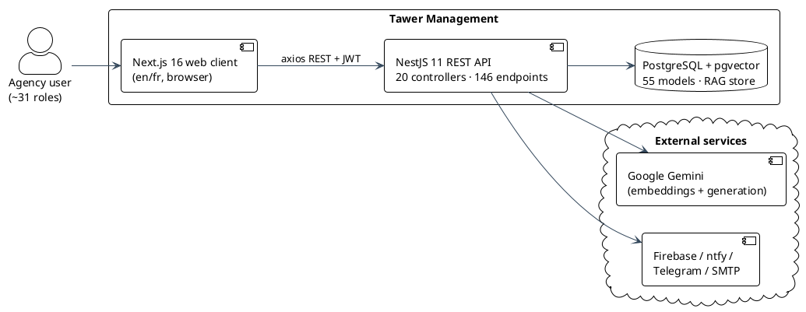
*Figure 1.1 — System context: users, the two-application platform, and its external services (converted from D00 §8.1).*

The solution pursues **four objectives** (D00 §2; reference report Ch.1 §1.3):

1. **A single unifying web client** for: projects & membership, an agile backlog (epics → sprints → tasks,
   milestones), personal to-dos, time & attendance (check-in/out), events/calendar, reminders,
   multi-channel notifications, and infrastructure monitoring. *(D00 §2.)*
2. **A role-based access-control (RBAC) model** expressive enough for ~31 role types across the two
   business units. *(D03; D00 §5.)*
3. **A production-grade RAG subsystem:** outbox-based indexing, embedding generation, hybrid
   vector + lexical retrieval, an LLM reranker, grounded answering with citations, and size-aware effort
   estimation, all validated by an offline evaluation harness. *(D14; D02 §14.)*
4. **A uniform, maintainable engineering structure** so any of the ~20 backend modules and ~10 frontend
   modules reads the same way. *(D01 §4; D15 §4.)*

Objectives 1 and 2 establish breadth and access control; objective 4 keeps that breadth maintainable;
objective 3 is the distinguishing feature and the technical focus of Chapter 4.

## 1.6 Expected outcomes

Delivering on the objectives is expected to produce:

- **A consolidated single source of truth.** One authenticated, bilingual (en/fr) application replacing a
  patchwork of disconnected tools across the agency's ten operational domains (objective 1).
- **Governed, fine-grained access.** An RBAC model that lets ~31 role types share one API safely across
  the Tawer Dev / Tawer Creative business units (objective 2).
- **Trustworthy AI assistance.** A copilot whose answers are *grounded in and cited to* the organization's
  own project content, plus effort estimates derived from historical data, with quality claims backed by an
  offline evaluation harness rather than asserted (objective 3, Chapter 4).
- **A maintainable, extensible codebase.** A strict four-layer, per-feature convention (controller →
  service → repository → DTO) that makes any of the ~20 backend and ~10 frontend modules readable once the
  pattern is learned, lowering onboarding cost and the cost of adding the eleventh domain (objective 4).

These outcomes are measured against the verified system totals used throughout this report (146 endpoints
across 20 controllers, 55 Prisma models and 25 enums across the schema), established by grepping the source
rather than estimated (D00 §3, §5).

---

# Chapter 2 — Methodology, Backlog & Architecture

Chapter 1 said *what* the platform is and *why* it exists. This chapter sets up *how* it was built and how
the report tells that story. We first fix the process (Scrum) and the artifact that anchors every later
chapter — the product backlog. We then lay out the six-sprint plan, the global software architecture the
sprints all plug into, the technology stack behind it, and the development environment and conventions that
kept ten domains reading the same way. The five development sprints are narrated in Chapter 3, and the AI
sprint — the technical climax — in Chapter 4.

## 2.1 Development methodology (Scrum)

We ran the project as **Scrum**, an iterative-incremental framework. The choice follows from the shape of
the work rather than fashion: the platform spans ten operational domains (§1.2), and the requirements for the
later ones (notifications, monitoring, and above all the AI copilot) were only ever going to sharpen as the
earlier ones landed and were used. A single up-front waterfall specification would have frozen decisions we
were not yet qualified to make. Scrum let us deliver breadth in shippable slices — a working authentication
core first, then projects on top of it, then the agile backlog on top of projects — so that each increment
was demonstrable and the next was planned against something real.

**Roles.** The work was organized as a three-person Scrum team: the author (Aymen BenHsan) as the
Development Team and main developer, with two TDG co-founders as supervisors — Ahmed Awedi (CEO) acting as
Product Owner and frontend supervisor, and Mohamed Awedi (CTO) as backend supervisor — owning priorities,
backlog, and unblocking.

**Ceremonies.** Each sprint opened with **sprint planning** (pull a slice of the product backlog into the
sprint backlog and agree a sprint goal), ran on short **daily stand-ups**, and closed with a **sprint
review** (demo the increment) and a **retrospective** (improve the process). **Backlog refinement** ran
continuously as later domains came into focus.

**Artifacts.** The **product backlog** (§2.2) is the ordered master list of user stories for the whole
product; each sprint draws a **sprint backlog** from it toward a sprint goal; the output of a sprint is a
potentially shippable **increment**. In this report every development chapter opens with its sprint's slice
of that master backlog, so the backlog in §2.2 is the single spine the entire narrative hangs on.

**Methodological note.** The sprint decomposition in this chapter is reverse-engineered from the delivered
system's module dependency order — the layers had to be built in this sequence (authentication before
projects, projects before the agile backlog, content before the copilot that indexes it), so the plan is a
real ordering rather than an invented tracker history. Story points are relative complexity estimates
presented as a plan (points, not dates).

**CRISP-DM as a sub-process.** Scrum governs the platform as a whole. The one place we layer a second,
data-mining methodology is **inside Sprint 6**, where the RAG copilot is built: there we follow a
**CRISP-DM**-style loop — *data understanding* (the project-content corpus), *modelling* (embeddings,
hybrid retrieval, reranking, estimation), and *evaluation* (an offline harness) — because an ML component
needs an evidence loop that ordinary CRUD features do not. This is detailed in Chapter 4 (§4.4); we flag it
here only to place it in the overall process.

## 2.2 Product backlog

The backlog re-expresses each delivered module's endpoints and features, as documented in the dossiers, as
user stories in the canonical *"As a &lt;role&gt;, I want &lt;goal&gt;, so that &lt;value&gt;"* form. Story identifiers are stable and sprint-scoped
(`US-S<sprint>-<n>`) so that every sprint chapter can cite its own rows without renumbering. Priority uses
MoSCoW (**Must / Should / Could**). Story points use a Fibonacci scale (1, 2, 3, 5, 8) as a relative
size/complexity estimate. `[CONFIRM: story-point values — the point figures below are a plausible relative
estimate reconstructed from module complexity, not recorded planning-poker results.]`

### Sprint 1 — Foundations & Authentication *(modules: architecture/DB foundation · auth/JWT/RBAC · users · teams — D00–D04)*

| US-ID | Story | Story pts | Priority |
|---|---|---|---|
| US-S1-01 | As a developer, I want a layered NestJS backend with a Prisma multi-file schema and migrations, so that every module shares one structure. | 8 | Must |
| US-S1-02 | As a user, I want to log in with email + password and receive a JWT, so that I can access the platform. | 3 | Must |
| US-S1-03 | As a user, I want my session refreshed automatically on expiry, so that I stay logged in without re-authenticating. | 3 | Must |
| US-S1-04 | As a user, I want to reset a forgotten password via an emailed code, so that I can regain access. | 3 | Should |
| US-S1-05 | As the platform, I want every protected endpoint gated by a role-permission guard, so that a user only reaches what their role allows. | 8 | Must |
| US-S1-06 | As an admin/HR, I want to provision user accounts with one or more roles, so that staff are onboarded (there is no public self-registration). | 5 | Must |
| US-S1-07 | As an admin, I want to list, search (accent-insensitive), and filter users, so that I can manage the directory. | 3 | Should |
| US-S1-08 | As an admin, I want to edit and soft-delete (deactivate) a user, so that I manage the account lifecycle. | 3 | Must |
| US-S1-09 | As a user, I want to update my own profile and change my password, so that I manage my account. | 2 | Should |
| US-S1-10 | As an admin, I want to create teams and assign members and a manager, so that staff are grouped. | 3 | Should |
| | **Sprint 1 subtotal** | **41** | |

### Sprint 2 — Projects & Membership *(module: projects/membership/invitations — D05)*

| US-ID | Story | Story pts | Priority |
|---|---|---|---|
| US-S2-01 | As a manager/executive, I want to create a project under a business unit with a type (AGILE/FREESTYLE), so that work is organized by unit and workflow. | 5 | Must |
| US-S2-02 | As a manager, I want to edit, archive, and delete a project, so that I manage its lifecycle. | 3 | Must |
| US-S2-03 | As a manager, I want to add existing users as project members and mark a manager, so that the team is defined. | 3 | Must |
| US-S2-04 | As a manager, I want to invite people by email with a single-use token, so that non-members can be brought in. | 5 | Should |
| US-S2-05 | As an invitee, I want to accept an emailed invitation, so that I become a member. | 3 | Should |
| US-S2-06 | As a manager, I want to configure the project's kanban settings (WIP limits), so that the board fits our process. | 2 | Could |
| US-S2-07 | As a member, I want to see only the projects I belong to (executives scoped to their business unit), so that access is isolated. | 5 | Must |
| | **Sprint 2 subtotal** | **26** | |

### Sprint 3 — Agile Backlog & Tasks *(modules: epics/sprints/milestones · tasks/kanban — D06, D07) — LARGE*

| US-ID | Story | Story pts | Priority |
|---|---|---|---|
| US-S3-01 | As a PM/PO, I want to create epics to group large features, so that the backlog is structured. | 3 | Should |
| US-S3-02 | As a Scrum Master, I want to create sprints with dates and a capacity, so that work is time-boxed. | 5 | Must |
| US-S3-03 | As a Scrum Master, I want to run the sprint lifecycle (start/stop/complete, one running at a time), so that iterations are governed. | 8 | Must |
| US-S3-04 | As a PM, I want milestones with target dates (also for FREESTYLE projects), so that deadlines are tracked. | 3 | Should |
| US-S3-05 | As a PM, I want burndown, velocity, and Gantt analytics, so that I can monitor progress. | 8 | Should |
| US-S3-06 | As a member, I want to create tasks with type, priority, assignee, and estimates, so that work is captured. | 5 | Must |
| US-S3-07 | As a manager, I want a per-project, data-driven kanban with custom columns and WIP limits, so that the board mirrors our workflow. | 8 | Must |
| US-S3-08 | As an assignee, I want to move a task across columns with transition, dependency, and WIP validation, so that status stays valid. | 8 | Must |
| US-S3-09 | As a member, I want to declare task dependencies (blocking / blocked-by), so that ordering is explicit. | 5 | Should |
| US-S3-10 | As a member, I want to log time against a task, so that effort is recorded. | 3 | Should |
| US-S3-11 | As a member, I want threaded comments with @mentions and likes on a task, so that we collaborate in context. | 5 | Should |
| US-S3-12 | As a member, I want labels and to assign a task to a sprint/epic/milestone, so that work is categorized. | 3 | Should |
| | **Sprint 3 subtotal** | **64** | |

### Sprint 4 — Productivity Suite *(modules: personal tasks · time & attendance · events/calendar · reminders — D08–D11) — LARGE*

| US-ID | Story | Story pts | Priority |
|---|---|---|---|
| US-S4-01 | As a user, I want a private to-do list with sub-tasks, priorities, and statuses, so that I track my own work separately from project tasks. | 5 | Should |
| US-S4-02 | As a user, I want due/reminder dates on my to-dos that notify me across my channels, so that nothing slips. | 5 | Should |
| US-S4-03 | As an employee, I want to check in and out (remote/onsite) to open and close work sessions, so that attendance is recorded. | 8 | Must |
| US-S4-04 | As an employee, I want my worked time computed per business day, so that I can see my hours. | 3 | Should |
| US-S4-05 | As a manager, I want per-user and per-team attendance statistics, so that I can review presence. | 5 | Should |
| US-S4-06 | As a user, I want to create calendar events and meetings with participants, so that schedules are shared. | 8 | Should |
| US-S4-07 | As a user, I want multi-channel reminders before each event, so that I attend on time. | 3 | Should |
| US-S4-08 | As a user, I want to schedule project and personal reminders delivered on my channels, so that I am nudged at the right moment. | 5 | Should |
| US-S4-09 | As a user, I want to see and dismiss my pending reminders, so that I can manage them. | 2 | Could |
| | **Sprint 4 subtotal** | **44** | |

### Sprint 5 — Communication & Operations *(modules: notifications · infrastructure monitoring — D12, D13)*

| US-ID | Story | Story pts | Priority |
|---|---|---|---|
| US-S5-01 | As a user, I want an in-app notification inbox (bell + list), so that I see system events in one place. | 5 | Must |
| US-S5-02 | As a user, I want push notifications (FCM) on my devices, so that I am alerted while away from the page. | 5 | Should |
| US-S5-03 | As a user, I want to configure my delivery channels (email, push, Telegram, ntfy), so that I control how I am reached. | 3 | Should |
| US-S5-04 | As a user, I want to link my Telegram account, so that I can receive alerts there. | 3 | Could |
| US-S5-05 | As a DevOps engineer, I want to register servers and services, so that infrastructure is inventoried. | 5 | Should |
| US-S5-06 | As the platform, I want to health-check servers (ICMP) and services (HTTP) every minute, so that outages are detected automatically. | 8 | Must |
| US-S5-07 | As a manager, I want multi-channel alerts when a server or service goes down, so that I can react quickly. | 5 | Must |
| US-S5-08 | As an operator, I want a public `/health` endpoint, so that the API's liveness is externally checkable. | 1 | Could |
| | **Sprint 5 subtotal** | **35** | |

### Sprint 6 — AI Copilot & Estimation (RAG) *(module: AI copilot + estimation — D14) — the differentiator*

| US-ID | Story | Story pts | Priority |
|---|---|---|---|
| US-S6-01 | As a user, I want to ask the copilot a natural-language question about project content, so that I get answers without manual digging. | 5 | Must |
| US-S6-02 | As a user, I want the answer streamed with clickable citations to the source items, so that I can trust and verify it. | 8 | Must |
| US-S6-03 | As a user, I want the copilot to refuse honestly when the corpus cannot support an answer, so that I am never misled by a hallucination. | 5 | Must |
| US-S6-04 | As a member, I want the system to estimate a draft task's effort from similar completed tasks, so that planning is data-driven. | 8 | Should |
| US-S6-05 | As the platform, I want project content indexed automatically via a write-path outbox, so that the copilot stays current without slowing saves. | 8 | Must |
| US-S6-06 | As an admin, I want to trigger a reindex and view copilot telemetry, so that I can operate the AI subsystem. | 3 | Should |
| US-S6-07 | As the platform, I want retrieval scoped by permissions in SQL, so that no user can surface content from a project they cannot access. | 5 | Must |
| | **Sprint 6 subtotal** | **42** | |

**Backlog totals & project burndown.** The six sprints total **252 story points**. Because the backlog is a
reconstruction, the burndown below is the *planned (ideal)* remaining-work line — points retired per sprint
against the committed plan, not a measured velocity. Sprints 3 and 4 carry the heaviest load (the depth
sprint and the four-module productivity sprint), which is why they are flagged LARGE in the plan.

| After sprint | Points retired | Remaining (of 252) |
|---|---|---|
| — (start) | — | 252 |
| Sprint 1 | 41 | 211 |
| Sprint 2 | 26 | 185 |
| Sprint 3 | 64 | 121 |
| Sprint 4 | 44 | 77 |
| Sprint 5 | 35 | 42 |
| Sprint 6 | 42 | 0 |

## 2.3 Sprint plan overview

The plan sequences the backlog into six sprints along a strict dependency order: nothing can be built before
the authentication and RBAC foundation, projects are the container everything agile hangs off, and the AI
copilot is deliberately last because it indexes and answers over content the earlier sprints produce. The
mapping from sprints to modules and to the source dossiers is the backbone of Chapters 3 and 4.

| Sprint | Chapter | Goal | Modules | Dossiers | SP |
|---|---|---|---|---|---|
| S1 — Foundations & Auth | 3 | Stand up the layered backend, the DB foundation, and the authentication + RBAC core; user and team administration. | architecture/DB · auth/JWT/RBAC · users · teams | D00–D04 | 41 |
| S2 — Projects & Membership | 3 | The project container: lifecycle, business-unit scoping, membership, email invitations. | projects · members · invitations | D05 | 26 |
| S3 — Agile Backlog & Tasks | 3 | The agile core: epics/sprints/milestones and a data-driven kanban with dependencies, time, and comments. | epics/sprints/milestones · tasks/kanban | D06, D07 | 64 |
| S4 — Productivity Suite | 3 | Individual productivity: personal to-dos, time & attendance, calendar, reminders. | personal tasks · time & attendance · events · reminders | D08–D11 | 44 |
| S5 — Communication & Ops | 3 | The delivery backbone and operations: multi-channel notifications and infrastructure monitoring. | notifications · infra monitoring | D12, D13 | 35 |
| S6 — AI Copilot & Estimation | 4 | The differentiator: a permission-scoped RAG copilot with grounded, cited answers and task-effort estimation. | AI copilot + estimation | D14 | 42 |

Figure 2.1 collapses the platform's ~31 role types (§1.3) into the six actor archetypes that recur across the
sprints and maps them onto the headline capabilities — the scope of the whole system at a glance. Figure 2.2
is the release roadmap: the six sprints as a sequence of timeboxes carrying their planned story-point load.

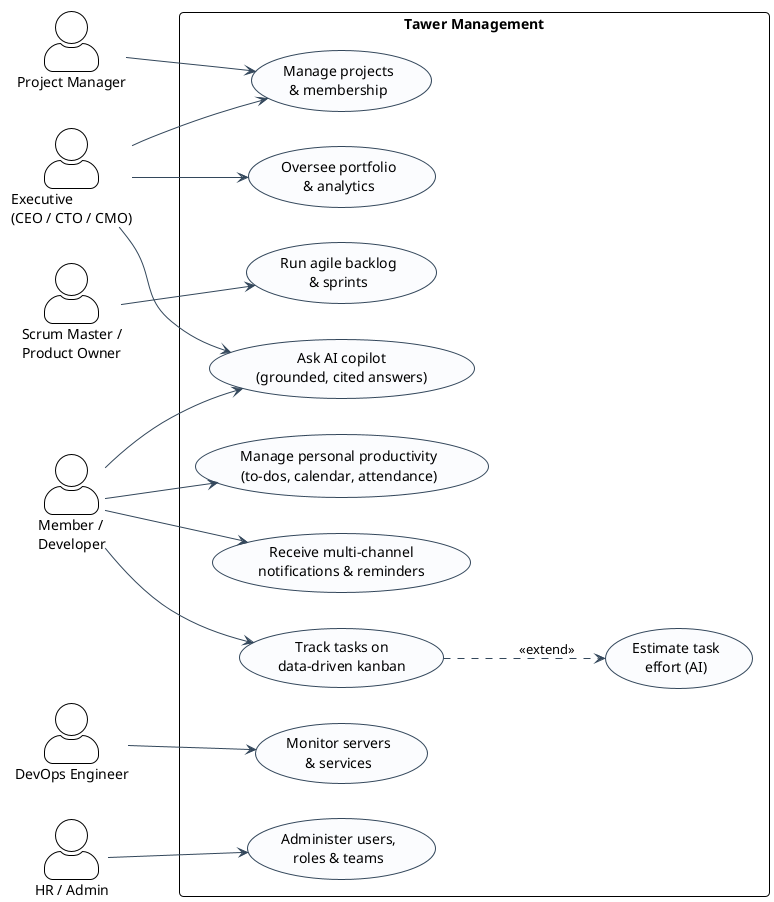
*Figure 2.1 — Global use-case: the six actor archetypes (the ~31 roles collapsed) against the platform's headline capabilities.*


*Figure 2.2 — Project roadmap: six sprints as nominal two-week timeboxes carrying their planned story-point load. The calendar anchor is illustrative (real dates deferred, P-02).*

## 2.4 Global software architecture

Tawer Management is a **two-application** system: a stateless **NestJS REST API** and a separate **Next.js
web client** that calls it *directly from the browser* over axios with a `Bearer` JWT. There is no
backend-for-frontend proxy and there are no Next.js `app/api` route handlers — the frontend's middleware
runs only next-intl locale handling — so the two apps share no code and communicate only over HTTP/JSON
(D00 §6–7; D15 §4.8). This clean separation means the API could serve any client (mobile, CLI, a second
web app) unchanged. The verified system totals framing the architecture — 146 route handlers across 20
controllers, 55 Prisma models and 25 enums across 13 schema files — were produced by grepping the source,
not estimated (D00 §5, §3; D02 §3). The component and deployment view is Figure 2.3.

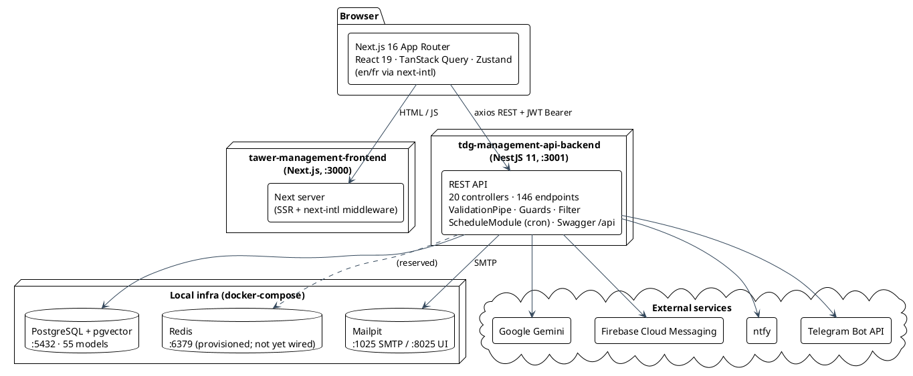
*Figure 2.3 — System component / deployment view of the two-application platform and its dependencies (converted from D00 §8.1).*

**Layered backend.** Every domain module follows the same **four-layer, per-feature** split — verified
against `projects` and `tasks` (D01 §4.1). A **controller** is the HTTP surface only (routing, guards,
Swagger, serialization) and delegates in one line to a **service**; the service holds business rules,
authorization decisions beyond the guard, orchestration, and Prisma-error translation (e.g. `P2002` →
`ConflictCustomException`); a **repository** is the *only* layer that touches Prisma, with explicit `select`s
that limit over-fetching; a **DTO** carries request/response shapes with `class-validator` + Swagger
decorators (D01 §4.1; ref §4.2). Cross-cutting concerns are wired once at the composition root
(`app.module.ts`): a global `ValidationPipe` (`transform:true`), a global `AllExceptionsFilter`,
`ScheduleModule` for crons, a global `ConfigModule`, and static file serving (D01 §4.2–4.3). Figure 2.4
shows the layering.

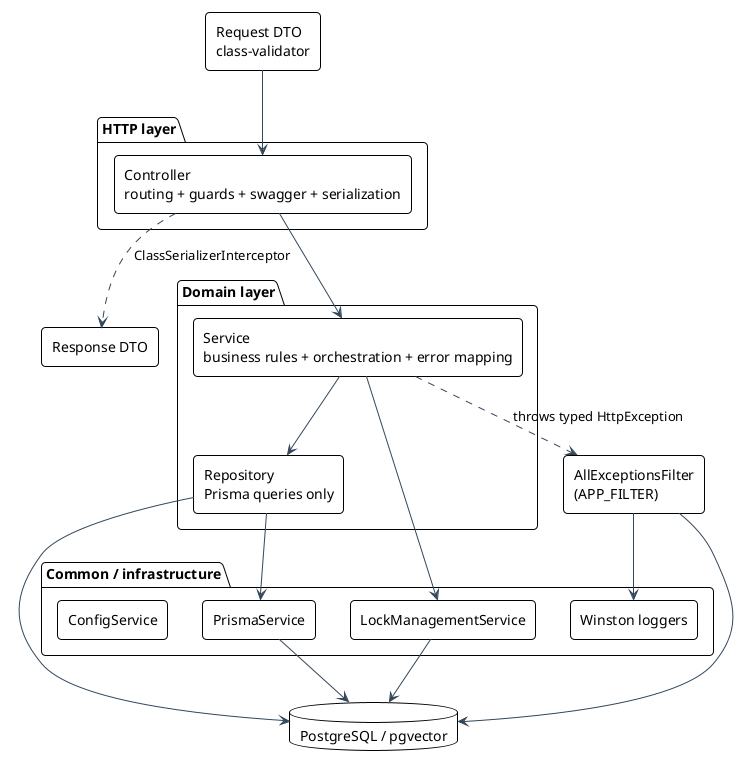
*Figure 2.4 — Backend layered architecture: controller → service → repository → Prisma, with cross-cutting infrastructure (converted from D01 §8.1).*

**Cross-cutting infrastructure.** Three pieces recur everywhere and are worth naming once. A global
`AllExceptionsFilter` normalizes every error to a typed `{message, code}` body; for 500s it additionally
writes a Winston error log and fires a fire-and-forget Telegram alert, deduplicated by a hashed fingerprint
in `ErrorLog` (D01 §4.4). A central `ErrorCode` enum (namespaced `P1xxx`…`P4xxx`) gives the frontend a
stable, language-independent error contract (D01 §4.5). And distributed locking is done with a Postgres
`Locking` table (`SELECT … FOR UPDATE SKIP LOCKED`) rather than Redis — a deliberate fewer-moving-parts
decision that keeps the mutex which stops the platform's many cron jobs from double-firing inside the one
datastore the platform already runs, with no second service to operate (D01 §4.7). Redis is provisioned in
compose but not yet wired to its cache/lock path — a hook reserved for when caching earns the extra moving
part (D01 §13.2; D16 §8).

**Request lifecycle.** A typical authenticated read threads all these layers. A React component calls a
TanStack Query hook, a module service attaches the JWT from `localStorage` and issues an axios request to the
API, NestJS runs the global `ValidationPipe` then the route guards, reaches the controller → service →
repository → `PrismaService` → parameterized SQL, the filter normalizes any error, and JSON flows back to be
cached by TanStack Query. On a 401 the service transparently refreshes the token and retries once (D00 §7).
Figure 2.5 is the sequence.

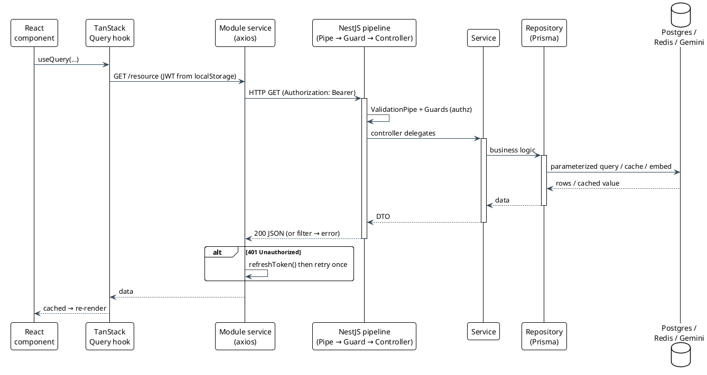
*Figure 2.5 — End-to-end request lifecycle for an authenticated read (converted from D00 §8.2).*

**Frontend architecture.** The Next.js 16 App Router wraps everything in a single dynamic `[locale]` segment
with two route groups: `(guest)` (login/register/forgot-password) and `dashboard/(auth)` (every
authenticated feature under one shell). Server state lives in a single TanStack Query client; ephemeral UI
state lives in small per-module Zustand stores; the two are bridged in hooks — a read hook mirrors the query
`data` into the store via `useEffect`, so components read one source of truth while I/O and UI concerns stay
cleanly separated (D15 §4.2–4.5). That separation is enforced by convention: every feature folder follows the
same six-part shape as its backend counterpart — `components/ hooks/ services/ store/ types/ validation/` — so
the frontend reads as predictably as the four-layer backend, and opening one module tells you where anything
in the next one lives (D15 §4.10). The API layer is a single axios instance with **no interceptors**: each
service attaches the `Authorization: Bearer` header by hand and, on a 401, calls `refreshToken()` and retries
once — a convention `extractJWTokens` propagates across 60 files (D15 §4.6–4.7). Form validation is built from
**Zod schema factories** — `getXSchema({ t })` functions that take the next-intl translator so every
validation message is localized, and that export an inferred `z.infer<…>` type binding the form values, the
`react-hook-form` resolver, and the request shape to one definition (D15 §4.10, §14). Authentication
gating is **client-only**: the `(auth)` layout calls `/users/me` and redirects to `/login` if no user
resolves — there is no SSR or edge auth guard, and client-side RBAC (`hasPermissions`) is cosmetic nav-gating
only; the real authorization boundary is always the backend guard (D15 §4.6–4.9). Figure 2.6 shows the gate.

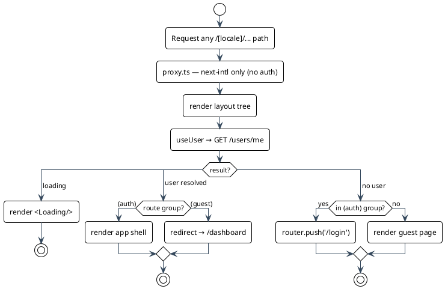
*Figure 2.6 — Client-side authentication gate: real gating is a `/users/me` check, not an edge guard (converted from D15 §8.3).*

**Deployment topology.** What runs today is a self-provisioning local stack. `docker-compose` brings up the
three backing services — PostgreSQL+pgvector, Redis, and Mailpit — with Postgres reusing an external named
volume so seeded data survives recreation and carrying a `pg_isready` healthcheck (D16 §2, §7). On container
start the backend runs `prisma migrate deploy`, which is idempotent and production-safe: it applies only the
migrations not yet recorded in `_prisma_migrations`, so a fresh database self-provisions its schema with no
manual step (D16 §3). A `/health` liveness endpoint answers unauthenticated (D16 §5), and each app ships a
`Dockerfile` that serves as a reproducible build recipe (D16 §4, §6). In development both apps run on the
host — the backend on :3001, the frontend on :3000 — so the two Dockerfiles are build recipes rather than
compose-orchestrated services (D16 §2). Uploaded files are written to the local `./static/` filesystem with
no volume, so they are lost on container replacement — a known limitation carried to Chapter 4's future-work
discussion (D16 §11, §13). A CI/CD pipeline and full container orchestration — app services on a shared
network behind a reverse proxy — are the first item on the deployment roadmap, built on the groundwork already
in place: a healthchecked infra stack, migrate-on-start, a health probe, and per-app build recipes
(D16 §11, §14). Figure 2.7 is the topology as run.

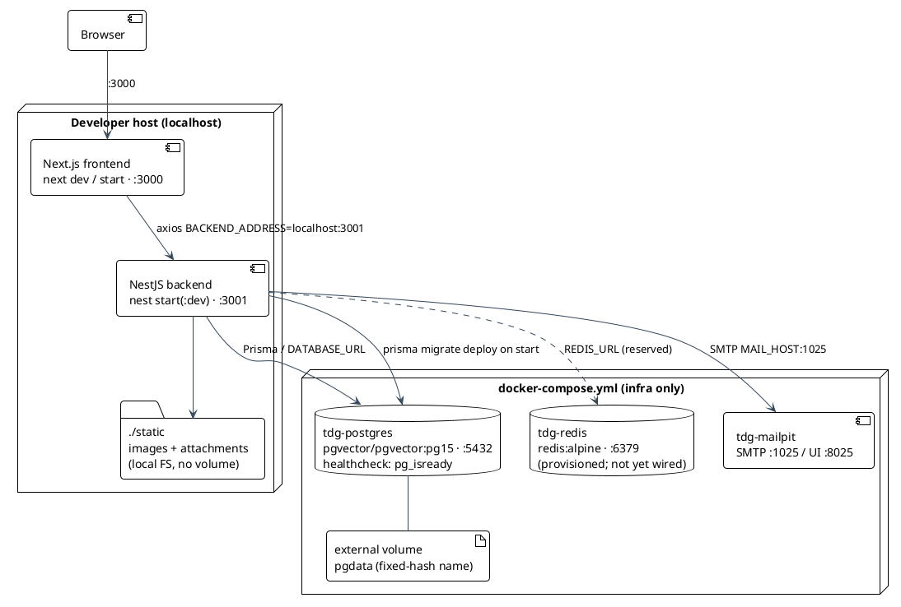
*Figure 2.7 — Deployment topology as run today: infra in docker-compose, both apps on the host, no CI/CD (converted from D16 §8).*

## 2.5 Technology stack & tools

The stack is verified from the two `package.json` files, the Prisma schema, and the compose file — versions
are cited, not estimated (D00 §1, §3, §6; D15 §4.1). The backend is a NestJS 11 layered API; the frontend is
a Next.js 16 App Router client.

**Backend — `tdg-management-api-backend`**

| Concern | Technology | Evidence |
|---|---|---|
| Framework | NestJS 11 (layered, per-feature modules) | D00 §4 |
| ORM / DB access | Prisma 7 with the `@prisma/adapter-pg` driver adapter | D02 §1 |
| Database | PostgreSQL + **pgvector** extension | D02 §1 |
| Auth | JWT (`@nestjs/jwt`) + bcrypt password hashing | D00 §9 |
| Scheduling | `@nestjs/schedule` (cron jobs) | D01 §4.7 |
| AI | Google Gemini (`@google/genai`) — embeddings + generation | D14; D00 §8 |
| API docs | Swagger at `/api` | D00 §2 |
| Cache / lock backing | Redis provisioned (not yet wired — reserved for future caching) | D01 §13; D16 §10 |

**Frontend — `tawer-management-frontend`**

| Concern | Library | Version | Evidence |
|---|---|---|---|
| Framework | `next` (App Router) | ^16.1.1 | D15 §4.1 |
| UI runtime | `react` / `react-dom` | ^19.2.3 | D15 §4.1 |
| i18n | `next-intl` (en/fr) | ^4.5.6 | D15 §4.1 |
| Server-state | `@tanstack/react-query` | ^5.90.11 | D15 §4.3 |
| Client-state | `zustand` | ^5.0.5 | D15 §4.4 |
| Forms + validation | `react-hook-form` + `zod` | ^7.58.1 / ^3.25.67 | D15 §4.1 |
| HTTP | `axios` | ^1.13.2 | D15 §4.6 |
| Styling | Tailwind CSS v4 + Radix UI (shadcn pattern) | ^4.1.10 | D15 §4.1 |
| Push | `firebase` (web push) | ^12.7.0 | D12 §8.1 |

**Why this stack.** Three choices carry most of the weight. First, a **stateless JSON API** (NestJS) cleanly
separated from a Next.js UI keeps the server usable by any client and lets the two apps evolve independently
(D00 §2). Second, **Prisma + Zod + `class-validator`** give type safety end-to-end — the same shapes are
enforced at the DB boundary, the API boundary, and the form — which matters when ten domains must stay
consistent (D00 §12; D02 §14). Third, **PostgreSQL with pgvector** lets one datastore back both the
transactional domain and the RAG vector store, so there is no separate vector database to operate, sync, or
secure (D02 §14; D00 §14).

That last choice is what makes the AI copilot practical to run. At a high level, **Retrieval-Augmented
Generation (RAG)** answers a question by first *retrieving* the most relevant project content from the
vector store and only then asking the language model to *generate* an answer grounded in — and cited to —
that retrieved content, rather than from the model's parametric memory. Keeping the embeddings in the same
Postgres as the domain data means retrieval can be permission-scoped in plain SQL. The full pipeline
(embeddings, the outbox indexing seam, hybrid retrieval, reranking, the confidence gate, and estimation) is
the subject of Chapter 4; here it is enough to know the stack was chosen so that this subsystem needs no
infrastructure the platform does not already run.

## 2.6 Development environment & conventions

**Repository & runtime.** One git repository holds two independent Node projects,
`tdg-management-api-backend/` (NestJS) and `tawer-management-frontend/` (Next.js), with no workspace linking
(D00 §1, §10). Local infrastructure is provisioned by `docker-compose.yml`: PostgreSQL
(`pgvector/pgvector:pg15`, :5432), Redis (`redis:alpine`, :6379), and Mailpit (SMTP :1025 / UI :8025), with
Postgres reusing an external named volume so seeded data survives container recreation (D16 §2, §7). The
apps themselves run on the *host* in development — backend `start:dev` on :3001, frontend `dev` on :3000 —
so the two Dockerfiles exist as build recipes but are not orchestrated by compose (D16 §2, §4, §6).

**Database workflow.** The schema is a Prisma 7 multi-file schema (13 files under `prisma/schema/`); 28
migrations are applied with `prisma migrate deploy` (idempotent, production-safe), and seeding is a separate
manual script (`prisma/seed.ts`) that is never invoked automatically (D16 §3; D02 §1). API documentation is
auto-generated by Swagger at `/api` (D00 §2). Backend configuration is a single global `.env` via
`ConfigModule.forRoot({ isGlobal: true })` (D16 §4, §6).

**Conventions a contributor must learn once.** The backend's **four-layer, per-feature** rule —
`controller/ → services/ → repositories/ → dto/`, with pure delegation in controllers, Prisma access
confined to repositories, and business rules plus typed-error mapping in services — is what lets any of the
~20 modules be read the same way (D01 §4.1). The frontend mirrors it with a uniform per-module shape
(`components/ hooks/ services/ store/ types/ validation/`) (D15 §4.10). These conventions are the direct
answer to objective 4 (§1.5): breadth stays maintainable only because every module is structurally
predictable. That breadth carries a maintainability cost — most visibly a large `TasksService`, a few
duplicated cross-module helper blocks, and several dormant subsystems left over from earlier design choices
— tracked with its remediation under the maintainability theme of **Annex A** (ref §8.3; D01, D02).

---

# Chapter 3 — Development Sprints

This chapter narrates the five development sprints that built the platform itself, in the dependency order
fixed by the plan in §2.3. Each sprint opens with its goal and its slice of the product backlog (§2.2),
shows the features it delivered as a use-case diagram, works through the conception of each module (textual
description plus the sequence and — where relevant — state diagrams that scenarios need, and a UML class
slice), then reports its realization (the screens and endpoints delivered), its acceptance tests, and a
short review. Every sprint closes with a **cumulative class diagram** of the system built so far, so the
domain model grows in front of the reader one sprint at a time. The AI sprint, being the technical climax,
is told separately in Chapter 4.

## 3.1 Sprint 1 — Foundations & Authentication

**Sprint goal.** Stand up everything the rest of the platform stands on: a layered NestJS backend with a
Prisma multi-file schema, and the identity core — authentication (login, refresh, password reset),
role-based access control, and administration of users and teams. Nothing in later sprints can be built or
even reached until a caller can be identified and authorized, which is why this work comes first (D03 §2;
D00 §5). The sprint spans four modules: the architecture/DB foundation, authentication with JWT and RBAC,
users, and teams (D00–D04).

**Sprint 1 backlog.** The stories pulled from the product backlog (§2.2) for this sprint, repeated here so
the sprint reads on its own:

| US-ID | Story | Story pts | Priority |
|---|---|---|---|
| US-S1-01 | As a developer, I want a layered NestJS backend with a Prisma multi-file schema and migrations, so that every module shares one structure. | 8 | Must |
| US-S1-02 | As a user, I want to log in with email + password and receive a JWT, so that I can access the platform. | 3 | Must |
| US-S1-03 | As a user, I want my session refreshed on expiry, so that I stay logged in without re-authenticating. | 3 | Must |
| US-S1-04 | As a user, I want to reset a forgotten password via an emailed code, so that I can regain access. | 3 | Should |
| US-S1-05 | As the platform, I want every protected endpoint gated by a role-permission guard, so that a user only reaches what their role allows. | 8 | Must |
| US-S1-06 | As an admin/HR, I want to provision user accounts with one or more roles, so that staff are onboarded. | 5 | Must |
| US-S1-07 | As an admin, I want to list, search (accent-insensitive), and filter users, so that I can manage the directory. | 3 | Should |
| US-S1-08 | As an admin, I want to edit and soft-delete (deactivate) a user, so that I manage the account lifecycle. | 3 | Must |
| US-S1-09 | As a user, I want to update my own profile and change my password, so that I manage my account. | 2 | Should |
| US-S1-10 | As an admin, I want to create teams and assign members and a manager, so that staff are grouped. | 3 | Should |
| | **Sprint 1 subtotal** | **41** | |

The features these stories deliver, and the actors who exercise them, are collected in the sprint use-case
diagram (Figure 3.1). A **Visitor** (unauthenticated) can only self-register — which creates an account
with no operational rights — or reset a password; a **User** (any authenticated employee) manages their own
profile and credentials; an **Admin / HR** provisions and administers accounts, roles, and teams. The
registration and administration paths are deliberately separate: self-registration lands in `PendingApproval`
with almost no permissions (a least-privilege default), and only a privileged role can promote an account by
assigning real roles (D03 §2; D04 §2).

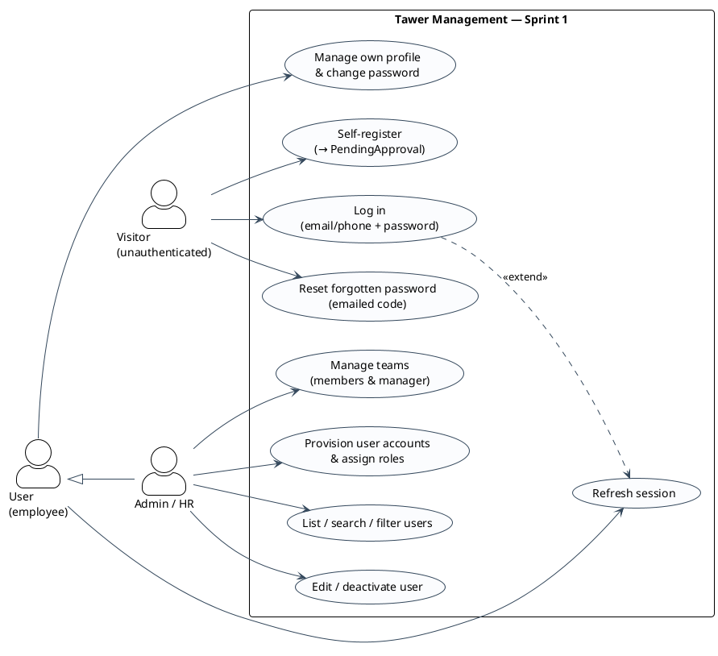
*Figure 3.1 — Sprint 1 use-case: the identity and administration features, with self-registration and admin provisioning kept as separate paths.*

### 3.1.1 Module A — Authentication & RBAC

**What the module does.** This is the cross-cutting security layer every other module depends on. It proves
*who* is calling (identity) and decides *what* they may do (authorization). Users authenticate with email
**or** phone plus a password; on success the server returns a JWT **access/refresh** pair. Refresh tokens
are the only server-side authentication state — the token string itself is the primary key of the
`RefreshToken` table — which is what lets logout revoke a session and lets the refresh endpoint reject a
token that was never issued. Access tokens are stateless and therefore not individually revocable (D03 §3,
§4). A three-step password-reset flow (request a 5-digit code → verify it → set a new password) uses a
single live `ResetPasswordCode` per user (D03 §5).

Authorization is a **static, compile-time role→permission map**. A catalogue of roughly 120 fine-grained
permissions is mapped to the 31 `UserType` roles in a shared constant (`PERMISSIONS_FOR_ROLE`), and a single
`HasPermissionGuard` — applied on 139 routes across 18 controllers — checks that at least one of the caller's
roles carries at least one of the permissions the route requires (D03 §5, §9). We chose a table-driven guard
over ad-hoc checks precisely because breadth was the risk: one declarative catalogue and one guard give a
single auditable authorization surface instead of authorization logic scattered through twenty modules. The
guard's semantics are **OR across the route's required permissions and OR across the user's roles**; the
finer `*.own` vs `*.any` ownership distinctions (may I edit *my* task, or *any* task?) are deliberately
resolved later, inside each service, where the data needed to make that call actually lives (D03 §9). Because
a user can hold several roles at once, roles are modeled as **rows** in a `Role` table (`@@unique([type,
userId])`) rather than a single enum column, and login flattens them into the JWT payload (D03 §3).

The login path is shown in Figure 3.2. The service fetches the user by email or phone (matching only
`isActive: true` accounts), compares the password with bcrypt, and — only on success — mints the token pair
and persists the refresh row. A missing user returns `404 USER_NOT_FOUND` and a wrong password `401`; those
are two distinguishable responses, which is convenient for the client but is also a verified user-enumeration
weakness we carry to the sprint review (D03 §7, §9).

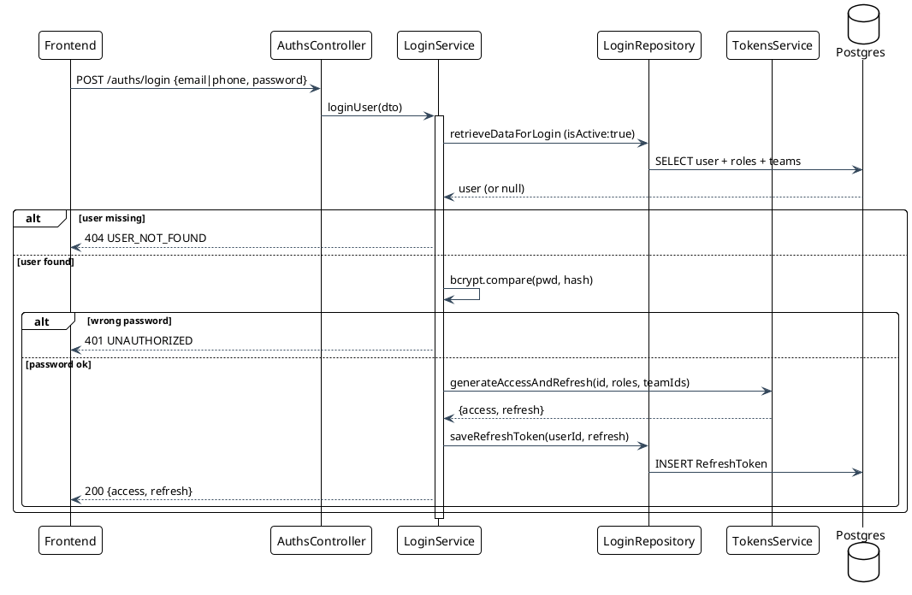
*Figure 3.2 — Login sequence: credential check, token issuance, and refresh-token persistence (converted from D03 §8).*

Every subsequent request rides on that access token. Figure 3.3 shows the protected-request path: the guard
reads the route's `@Permissions` metadata, verifies the JWT signature and expiry through the single shared
`TokensService`, and attaches the decoded payload (`{id, roles, teamsIds}`) to the request. If no required
permission intersects the caller's effective permission set the guard answers `403`; otherwise control passes
to the controller and then the service, where ownership and project-membership checks run against real data
(D03 §7, §8).

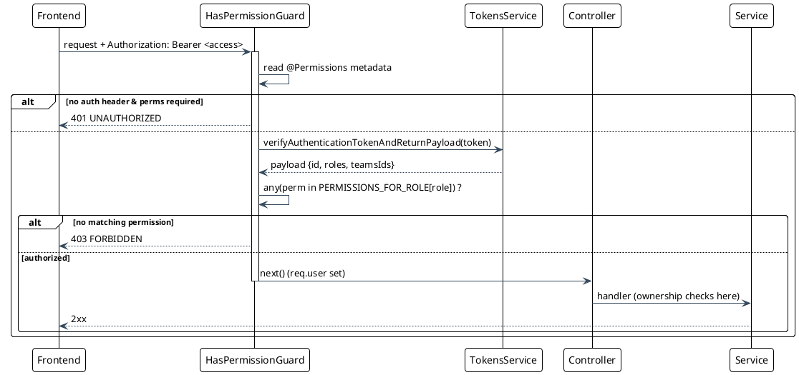
*Figure 3.3 — Protected-request / RBAC sequence: the guard authorizes coarsely, the service refines ownership (converted from D03 §8).*

The class slice for this module (Figure 3.4) is the identity core: `User` holds the credentials and the
active flag; `Role` attaches one or more `UserType` values to a user; `RefreshToken` records the live
sessions; and `ResetPasswordCode` holds the single outstanding reset code. As this is the first sprint, all
of these classes are new to the model and highlighted accordingly.

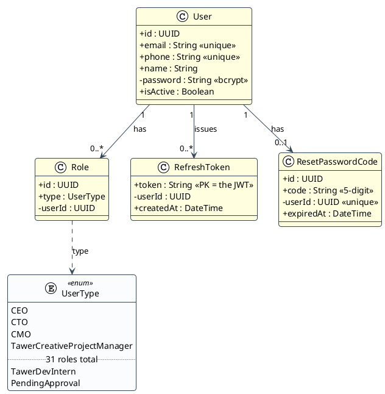
*Figure 3.4 — Auth & RBAC class slice: the identity core (converted from D02 §8.2 / D03 §3). New classes in yellow.*

### 3.1.2 Module B — Users & Teams

**What the module does.** On top of the identity core, this module runs the administrative user lifecycle —
create, read, update, soft-delete, profile self-service, password change, bulk email — and groups users into
teams. It is an internal tool, so account provisioning is a privileged action: an admin/HR user calls
`POST /users/register` (the method is literally named `createUserAccountByAdmin`), which sets `isActive: true`
immediately and attaches the requested roles (D04 §2, §3). This is the counterpart to the public
self-registration path in Module A — self-registration produces an inert `PendingApproval` account, whereas
admin provisioning produces a working, role-bearing one.

Authorization here is **two-tiered**, and it is worth naming because it is the pattern the whole platform
reuses. The coarse `HasPermissionGuard` gates the route (does the caller hold `user.create.by.admin` at
all?), and then a fine-grained, *data-scoped* check runs inside the service: `PermissionsService.canRolesManageRoles`
verifies the caller is actually allowed to grant the specific roles requested, so an HR manager cannot mint a
CEO (D04 §4, §7). Teams carry the same two-tier check via `canUserManageTeams`, scoped by the roles of the
team's members. `UserTeam.isManager` is the single manager signal the platform reads at runtime — it encodes
who manages whom for later authorization decisions (D04 §2, §3).

Two design choices in this module recur across the schema. Names are stored twice — the original `name` and a
denormalized, accent-stripped `unaccentedName` — so that search can be accent-insensitive: writes slugify the
name, reads filter on the stripped copy (D04 §3). And "deletion" of a user is a **soft delete**: the account's
`isActive` flag is flipped to `false` rather than the row removed, preserving history and foreign-key
integrity (D04 §7). The create-user flow is shown in Figure 3.5.

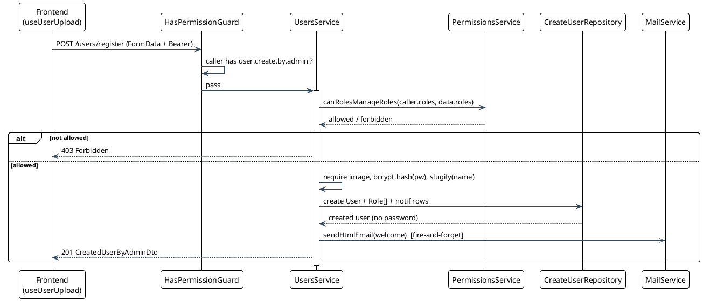
*Figure 3.5 — Create-user-by-admin sequence: guard, role-grant authorization, then user + roles + notification sub-records (converted from D04 §8.2).*

The class slice (Figure 3.6) extends `User` with the administrative and search fields and adds the team
graph. `Team` groups users through the `UserTeam` join, whose `isManager` flag carries management semantics.
`UserManager` is present in the schema as a self-relation on `User` but is drawn here as **dormant**: no code
reads or writes it — the actual manager check goes through `UserTeam.isManager` — and we keep it in the model
only to reflect the schema faithfully and flag it as unfinished design (D04 §3, §13).

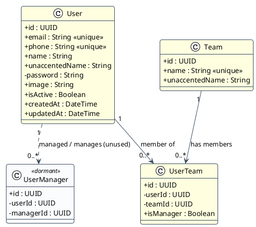
*Figure 3.6 — Users & Teams class slice: `User` extended, `Team`, `UserTeam`, and the dormant `UserManager` (converted from D04 §8.1). New classes in yellow.*

### 3.1.3 Realization

The sprint delivered two backend modules and the guest/administration screens that consume them. The
authentication surface is eight public-or-self endpoints — `POST /auths/register`, `/auths/login`,
`/auths/logout`, the three-step reset (`/auths/request-reset-code`, `/verify-reset-code`,
`/reset-password`), and the token endpoints `/tokens/verify` and `/tokens/refresh` (D03 §5). The
administration surface is fourteen guarded endpoints across `/users` and `/teams`: user provisioning,
`GET /users/me`, the role-scoped user list and its CSV export, self password change, self and admin profile
updates, soft delete, bulk email; and team create/list/update/delete (D04 §5). On the client, the guest
route group carries the login, registration, and reset-password wizard, and the authenticated `users`
section carries the directory table (search by name/email/phone, role filter, sort, pagination), the
create/edit user dialog, and the teams view — each screen itself permission-gated in the UI, with the
backend guard as the real boundary (D04 §6; D15 §4.6).

The screens are supplied by the author:

- `[SCREENSHOT: login page — the email/phone + password sign-in form.]`
- `[SCREENSHOT: register page — the self-service sign-up form that lands the account in PendingApproval.]`
- `[SCREENSHOT: users list — the directory table with search, role filter, and pagination.]`
- `[SCREENSHOT: create/edit user dialog — role assignment, team assignment, and image upload.]`
- `[SCREENSHOT: teams view — the team list with member and manager management.]`

### 3.1.4 Tests de validation

"Tests de validation" here means **acceptance scenarios** — the Given/When/Then conditions each user story
had to satisfy to be accepted, verified against the delivered behavior in the dossiers. They are not a claim
of automated coverage. The automated evidence that does exist for this sprint is real: an end-to-end RBAC
suite (`test/agile-permissions.e2e-spec.ts`) that drives the full permission matrix over supertest for the
CEO/PM/PO/SM/engineer roles (D03 §11). We scope it honestly — the suite's hand-minted tokens omit `id` and
`teamsIds`, so service-layer ownership paths run under it effectively untested, and the auth and users/teams
unit specs are empty NestJS scaffolds that assert only `toBeDefined()` and supply no providers (D03 §11;
D04 §11).

| US-ID | Acceptance scenario (Given / When / Then) | Result |
|---|---|---|
| US-S1-01 | Given the backend, When any module is inspected, Then it follows the controller → service → repository → DTO layering over a Prisma multi-file schema with applied migrations. | ✅ Verified (D01 §4.1; D02 §1) |
| US-S1-02 | Given a valid, active account, When it posts correct email/phone + password, Then a JWT access/refresh pair is returned; wrong password → 401, unknown user → 404. | ✅ Verified (D03 §7–8) |
| US-S1-03 | Given a stored refresh token, When `/tokens/refresh` is called with it, Then a new access token is minted; a never-issued/revoked token → `INVALID_JWT`. | ✅ Verified (D03 §7) |
| US-S1-04 | Given a registered email, When the 3-step reset is followed with the emailed 5-digit code inside 15 min, Then the password is changed. | ✅ Verified (D03 §5) — ⚠ weak code / no lockout (see Annex A) |
| US-S1-05 | Given a protected route with `@Permissions`, When a caller lacking a matching permission calls it, Then the guard returns 403; a matching role → pass. | ✅ Verified (D03 §8–9; e2e RBAC suite) |
| US-S1-06 | Given an admin holding `user.create.by.admin`, When they create a user with roles they may grant, Then the account is created active; granting an unmanageable role → 403. | ✅ Verified (D04 §7) |
| US-S1-07 | Given users exist, When an admin lists with a name/role filter, Then results are accent-insensitively matched and role-scoped to the caller's manageable roles, paginated. | ✅ Verified (D04 §7) — ⚠ role-less-user leak (see Annex A) |
| US-S1-08 | Given a target user, When an admin edits or "deletes" it, Then edits persist and delete flips `isActive:false` (soft delete). | ⚠ Partial — delete authorizes the caller against themselves, not the target (verified bug, see Annex A) (D04 §13) |
| US-S1-09 | Given a logged-in user, When they update their profile or change their password (old password re-verified), Then the changes persist. | ✅ Verified (D04 §5, §9) |
| US-S1-10 | Given an admin, When they create a team with members and mark a manager, Then the team and its `UserTeam` rows (with `isManager`) are created. | ✅ Verified (D04 §5, §7) |

### 3.1.5 Sprint review

The sprint met its goal: the platform has a working layered backend, a stateless-JWT authentication core
with server-side refresh state, and full user/team administration governed by a single declarative RBAC
catalogue applied uniformly across 139 routes on 18 controllers (D03 §5, §9). The two-tier authorization
pattern introduced here — a coarse permission guard plus a data-scoped service check — becomes the
platform-wide template every later module follows, and the identity classes established now are the hub the
entire domain model hangs off.

Security-hardening items identified during this sprint — token lifetimes, request throttling, and one
authorization check — are consolidated with their remediations in the *Limitations & Perspectives*
discussion and the hardening backlog (Annex A). The priority among them is the token-TTL and revocation
item: both access and refresh TTLs are configured at ~3.3 years and access tokens are non-revocable, so
short-lived tokens are the first change (D03 §9.1, §13). The remaining items were logged and prioritized
against the sprint's breadth goals rather than fixed within this report's timeline — a sequencing decision,
not an oversight, with each carried into Annex A alongside its designed remediation.

### 3.1.6 Cumulative class diagram

Figure 3.7 is the first cumulative view of the domain model — after Sprint 1 it is exactly this sprint's
identity core, so every class is new. Later sprints extend this same diagram, highlighting only their
additions, so the reader can watch the model grow.

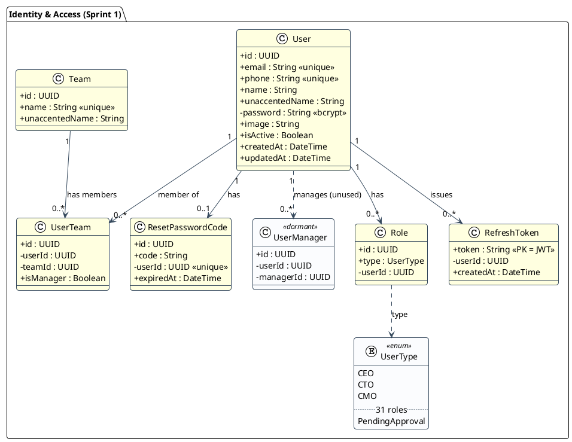
*Figure 3.7 — Cumulative class diagram after Sprint 1: the identity & access core. All classes new (yellow); `UserManager` present but dormant.*

## 3.2 Sprint 2 — Projects & Membership

**Sprint goal.** With identity and access in place, Sprint 2 introduces the unit of work everything else in
the platform hangs off: the **project**. The goal was the full project lifecycle (create, read, update,
archive, hard-delete), per-project team membership with a single project manager, and an email/token
invitation flow for bringing people who are not yet members onto a project (D05 §1–2). This is the largest
domain module and the aggregate root of the whole agile domain — epics, sprints, tasks, milestones,
labels and reminders all foreign-key back to a `Project` — so it had to land before any of the planning or
execution work in the sprints that follow (D05 §10).

**Sprint 2 backlog.** The stories pulled from the product backlog (§2.2) for this sprint:

| US-ID | Story | Story pts | Priority |
|---|---|---|---|
| US-S2-01 | As a manager/executive, I want to create a project under a business unit with a type (AGILE/FREESTYLE), so that work is organized by unit and workflow. | 5 | Must |
| US-S2-02 | As a manager, I want to edit, archive, and delete a project, so that I manage its lifecycle. | 3 | Must |
| US-S2-03 | As a manager, I want to add existing users as project members and mark a manager, so that the team is defined. | 3 | Must |
| US-S2-04 | As a manager, I want to invite people by email with a single-use token, so that non-members can be brought in. | 5 | Should |
| US-S2-05 | As an invitee, I want to accept an emailed invitation, so that I become a member. | 3 | Should |
| US-S2-06 | As a manager, I want to configure the project's kanban settings (WIP limits), so that the board fits our process. | 2 | Could |
| US-S2-07 | As a member, I want to see only the projects I belong to (executives scoped to their business unit), so that access is isolated. | 5 | Must |
| | **Sprint 2 subtotal** | **26** | |

The actors and features are collected in the sprint use-case diagram (Figure 3.8). The **Executive** archetype
covers the three C-level roles, which differ only in reach: a `CEO` sees and manages every project, whereas a
`CTO` and `CMO` are pinned to their own business unit (`TawerDev` and `TawerCreative` respectively). A
**Project Manager** is not a global role but a per-project one — the single `ProjectMember` marked `isManager`
— and can manage its team, invite by email, and configure its board, but only for projects they manage. A
**Member** reads the projects they belong to. Creating a project is executive-only; a manager's authority is
scoped to the projects they already run (D05 §2, §9).

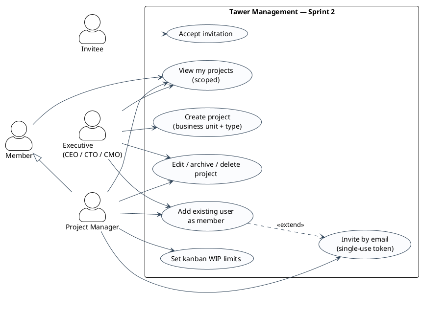
*Figure 3.8 — Sprint 2 use-case: project lifecycle, membership, and the invite/accept flow; executives create and scope by business unit, managers run the team of the projects they own.*

### 3.2.1 Conception — Projects, Membership & Invitations

**What the module does.** A project is created by an executive, belongs to exactly one **business unit** —
`TawerDev` (software) or `TawerCreative` (creative) — and carries a `projectType` of `AGILE` or `FREESTYLE`
that decides which planning features apply later (D05 §2–3). It gathers a team through `ProjectMember` rows,
of which **exactly one** is flagged `isManager`; that single-manager invariant is enforced on create and
protected on every mutation, so demoting or removing the last manager is rejected (D05 §5). Translatable
fields (`name`, `description`, `details`) live in a child `ProjectContent` table keyed by language, mirroring
the app-wide i18n content pattern — though because the `Language` enum currently has one value, the
`@@unique([language, name])` constraint degenerates into **global** project-name uniqueness, a latent
consequence worth noting for the hardening backlog (D05 §3). WIP limits per kanban column are stored as a JSON map on the
project itself (`kanbanSettings`), validated against the project's actual status names (D05 §3, §5).

Authorization reuses the two-tier pattern established in Sprint 1, but the interesting part is *where* the
fine-grained check lives. The read permissions (`project.read.*`) are granted to **every** role, so the
`HasPermissionGuard` is not what isolates data — the isolation is pushed into the Prisma `where` clause and
runs atomically with the fetch. A non-executive caller is pinned to projects they belong to
(`members.some({ userId })`); a unit executive is pinned to their `businessUnit`; the CEO is global; and any
management operation additionally requires `isManager: true` or executive status (D05 §4, §9). Because the
permission predicate and the query are one statement, a caller who lacks access simply gets zero rows or a
Prisma `P2025` that the service maps to a `403` — there is no window where a check passes but the data escapes
its scope. This module also uses the Prisma query-builder exclusively, with no raw SQL anywhere, so unlike the
user-listing path in Sprint 1 it has no string-interpolation injection surface (D05 §4, §9).

Two onboarding paths exist, and the split reflects who is trusted with what. Executives can attach an
**existing** user to a project directly. Managers — who cannot mint accounts — instead **invite by email**: a
tokenized `ProjectInvitation` is created and mailed, and the recipient accepts it to become a member (D05 §2,
§7). The create-project path is shown in Figure 3.9. The service re-checks executive status and business-unit
access even though the guard already ran (defense in depth), normalizes the input and defaults the manager to
the creator when none is given, validates the single-manager invariant, then writes the project with its
nested members and contents in one repository call; a duplicate name surfaces as a Prisma `P2002` that becomes
a `409` (D05 §7-A).

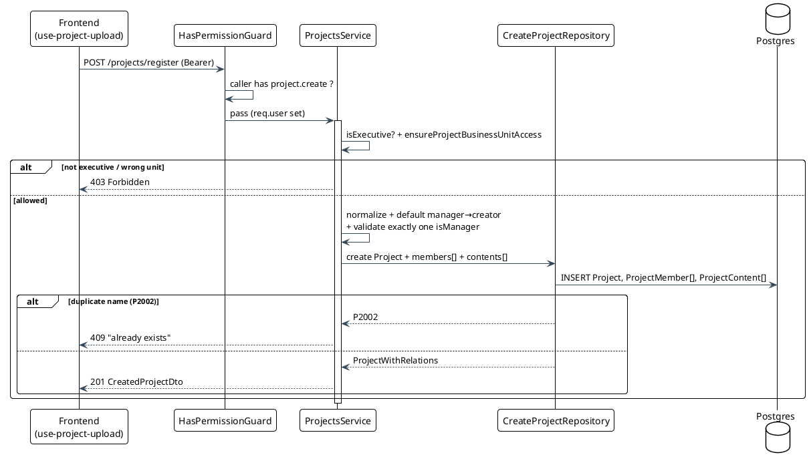
*Figure 3.9 — Create-project sequence: guard, executive + business-unit re-check, single-manager validation, then a nested Project + members + contents insert (converted from D05 §8.2).*

The membership entry point is a single "smart" endpoint (`POST /:projectId/members`) that branches on whether
the caller supplied a `userId` or an `email` (Figure 3.10). The `userId` branch is executive-only and adds the
member directly after checking they are not already on the team. The `email` branch is open to executives *and*
the project's manager: it verifies invitation eligibility (not already a member or invited), upserts a
`ProjectInvitation` carrying a `randomUUID` token and a default seven-day expiry, sends a branded email with a
join link, and — if the invited address already belongs to a user — raises an in-app notification (D05 §7-B).
Acceptance is a separate, authenticated endpoint that validates the token is `PENDING` and unexpired, and
crucially re-verifies that the accepting user's own email equals the invited email, so one authenticated user
cannot claim another's invitation (D05 §7-C, §9).

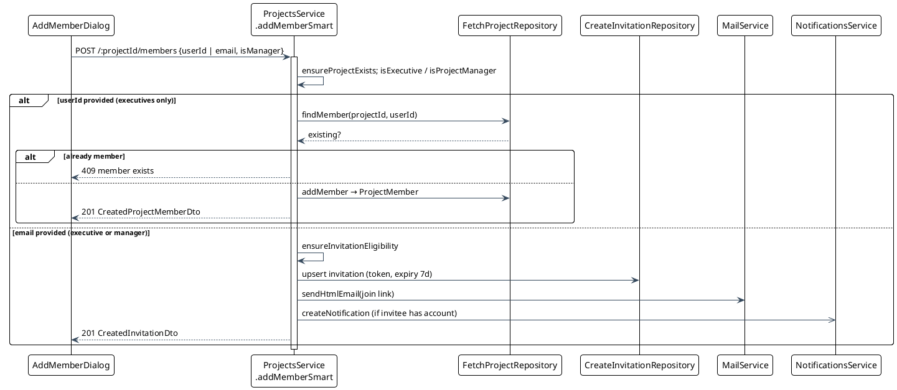
*Figure 3.10 — Smart add-member / invite sequence: one endpoint, two paths — direct add for executives, email-token invite for managers (converted from D05 §8.3).*

The class slice (Figure 3.11) adds the project family to the model. `Project` is the aggregate root; its
translatable fields are split into `ProjectContent`; `ProjectMember` is the join to `User` that also carries
the `isManager` flag and a (currently dormant) per-member `hourlyRate`; and `ProjectInvitation` holds the
email-bound token lifecycle. `User` is shown again — not new — because it now gains three roles against the
project family: creator, member, and inviter.

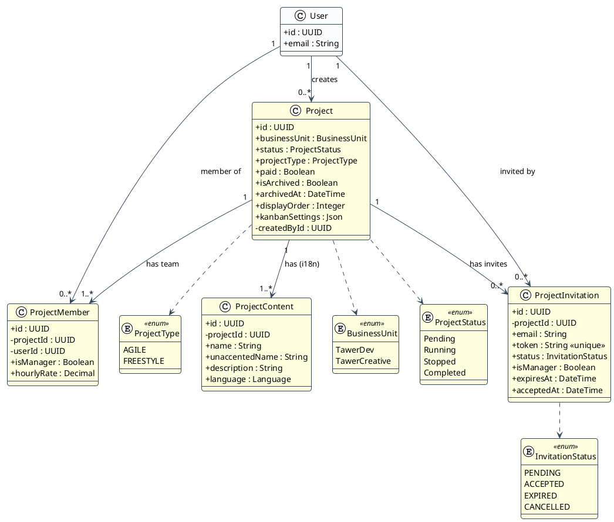
*Figure 3.11 — Projects & Membership class slice: the project aggregate with its i18n content, team join, and invitation lifecycle (converted from D05 §8.1). New classes and enums in yellow; `User` carried over.*

### 3.2.2 Realization

The module ships seventeen endpoints on `ProjectsController` covering the lifecycle (register, list, get, get
capacity, update, delete, archive, restore), membership (smart add-member, update-member, remove-member), the
invitation flow (create, revoke, resend, accept), and the kanban settings (get, patch) (D05 §5). On the client
the projects section is a status-tabbed list with search, a filter panel, and drag-reorder; "Add" opens a
project sheet, and opening a project reveals a tabbed detail whose **Members** tab lists members and pending
invitations with direct-add, invite-by-email, role-toggle, remove, and resend/revoke actions (D05 §6). One
limitation of the client is worth noting up front: the create form only ever submits the single
manager as a member, and the update path never sends members at all, so all team editing happens through the
dedicated `/members` endpoints rather than the project write — the backend's multi-member create and
member-replacement paths exist but are not exercised by the UI (D05 §6).

The screens are supplied by the author:

- `[SCREENSHOT: projects list — the status-tabbed grid/list with search, filter panel, and drag-reorder.]`
- `[SCREENSHOT: create-project sheet — business unit, type, dates, and manager selection.]`
- `[SCREENSHOT: members tab — the project's member list and pending invitations with role-toggle/remove.]`
- `[SCREENSHOT: invite-by-email dialog — the discriminated add-member dialog in its email mode.]`

### 3.2.3 Tests de validation

The acceptance scenarios below record the Given/When/Then each story had to satisfy, checked against the
delivered behavior in the dossier. Unlike Sprint 1, this sprint has **genuine automated coverage to point to**:
`projects.service.spec.ts` is an 854-line behavioural unit-test suite (with mocked repositories) that exercises
create (forbidden / success / duplicate-name `P2002`), the executive-vs-non-executive list scoping, get-by-id
(member / executive / not-found), capacity, update (business-unit-immutable, success, conflict), delete
(including the CTO business-unit filter), archive/restore, and add/update/remove-member — backed by a
215-line `projects.controller.spec.ts`, this is the strongest coverage in the codebase (D05 §11). We are equally explicit about its edges: there are **no** tests for the
four invitation methods (`createInvitation`, `acceptInvitation`, `deleteInvitation`, `resendInvitation`), for
the single-manager validators, or for kanban-settings validation, and no e2e tests, so the invitation flow —
though verified by reading — is not automatically guarded (D05 §11).

| US-ID | Acceptance scenario (Given / When / Then) | Result |
|---|---|---|
| US-S2-01 | Given an executive, When they POST a project with a business unit and type, Then a Project with nested contents and one manager member is created; a non-executive or wrong-unit caller → 403; a duplicate name → 409. | ✅ Verified (D05 §7-A, §11) |
| US-S2-02 | Given a manager/executive, When they PATCH, archive, or DELETE a project, Then fields update in a transaction, archive flips `isArchived`, and delete cascades the whole project. | ✅ Verified (D05 §5, §11) — ⚠ archive is not server-filtered on list (see Annex A) |
| US-S2-03 | Given an executive, When they add an existing user by `userId`, Then a `ProjectMember` is created unless the user is already a member (409). | ✅ Verified (D05 §7-B, §11) |
| US-S2-04 | Given an executive or the project manager, When they invite an email, Then a single-use tokenized invitation (7-day expiry) is upserted, emailed, and notified if the invitee has an account. | ✅ Verified (D05 §7-B) — ⚠ no automated tests for the invite methods |
| US-S2-05 | Given a valid, unexpired invitation, When the authenticated invitee (email matching) accepts, Then a membership is created and the invite marked ACCEPTED; a mismatched email or expired token is rejected. | ⚠ Partial — backend is complete and correct, but there is **no acceptance UI**; the emailed `/projects/join` route does not exist (verified gap, D05 §13) |
| US-S2-06 | Given a manager, When they PATCH kanban settings, Then WIP-limit keys are validated against the project's status names and stored as JSON. | ✅ Verified (D05 §5) |
| US-S2-07 | Given a non-executive, When they list projects, Then only projects they are a member of are returned; a CTO/CMO sees only their business unit; a CEO sees all. | ✅ Verified (D05 §9, §11) |

### 3.2.4 Sprint review

The sprint delivered the aggregate root of the domain and a membership/invitation design that is careful where
it matters: the single-manager invariant with last-manager guards, business-unit scoping enforced inside the
query rather than bolted on after it, and email-bound single-use tokens whose acceptance re-verifies identity.
It is also the first module in the build with real behavioural tests — an 854-line `projects.service.spec.ts`
exercising the create/list/update/delete/membership paths (D05 §11) — which raised confidence in exactly
those paths.

The one item that shapes what a user can do today is the invitation-acceptance UI: the invitation backend is
complete — email-bound, single-use tokens whose acceptance re-verifies identity — but the browser client does
not yet reach the accept endpoint, so US-S2-05 is marked partial above. That UI was deprioritized to reach the
depth sprint that follows; it is a scoping decision on a finished backend, not a broken feature. It and the
sprint's other hardening notes — server-side archived filtering, non-destructive member upserts, a
project-scoped name constraint, and an independent per-member capacity input — are consolidated with their
remediations in the *Limitations & Perspectives* discussion and the hardening backlog (Annex A) (D05 §3, §9, §13).

### 3.2.5 Cumulative class diagram

Figure 3.12 extends the model with the project family. The Sprint 1 identity core is now shown in plain style;
only this sprint's additions — `Project`, `ProjectContent`, `ProjectMember`, `ProjectInvitation` and their
enums — are highlighted. The link back to `User` (creator, member, inviter) is the seam that ties the new
project aggregate to the identity core established previously.

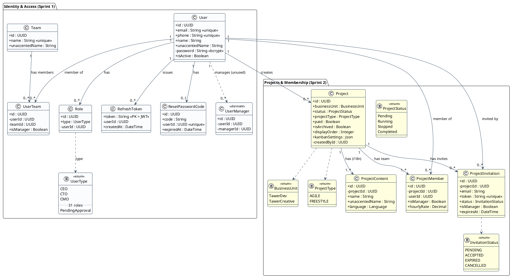
*Figure 3.12 — Cumulative class diagram after Sprint 2: the identity core (plain) plus the project aggregate — Project, ProjectContent, ProjectMember, ProjectInvitation and their enums (yellow, new). `User` is the seam joining the two packages.*

## 3.3 Sprint 3 — Agile Backlog & Tasks

**Sprint goal.** Sprints 1 and 2 gave us people, access, and projects; they did not yet give a project any
*work*. Sprint 3 is where the platform earns the name "management" — it delivers the agile planning layer
(epics, sprints, milestones and their burndown/velocity/Gantt analytics) and, on top of it, the task engine:
a per-project data-driven Kanban with custom columns, WIP limits, dependency-blocking, story points, time
logging, labels and threaded comments (D06 §1–2, D07 §1–2). This is the depth sprint. Two large modules land
together because they are inseparable — a sprint is only meaningful once tasks can be assigned to it, and the
burndown chart reads directly from each task's `storyPoints` and `completedAt`. It is also the heaviest load
in the plan at **64 story points**, and the richest domain code in the codebase: `tasks.service.ts` alone is
2 735 lines (D07 §1, §12).

**Sprint 3 backlog.** The stories pulled from the product backlog (§2.2) for this sprint:

| US-ID | Story | Story pts | Priority |
|---|---|---|---|
| US-S3-01 | As a PM/PO, I want to create epics to group large features, so that the backlog is structured. | 3 | Should |
| US-S3-02 | As a Scrum Master, I want to create sprints with dates and a capacity, so that work is time-boxed. | 5 | Must |
| US-S3-03 | As a Scrum Master, I want to run the sprint lifecycle (start/stop/complete, one running at a time), so that iterations are governed. | 8 | Must |
| US-S3-04 | As a PM, I want milestones with target dates (also for FREESTYLE projects), so that deadlines are tracked. | 3 | Should |
| US-S3-05 | As a PM, I want burndown, velocity, and Gantt analytics, so that I can monitor progress. | 8 | Should |
| US-S3-06 | As a member, I want to create tasks with type, priority, assignee, and estimates, so that work is captured. | 5 | Must |
| US-S3-07 | As a manager, I want a per-project, data-driven kanban with custom columns and WIP limits, so that the board mirrors our workflow. | 8 | Must |
| US-S3-08 | As an assignee, I want to move a task across columns with transition, dependency, and WIP validation, so that status stays valid. | 8 | Must |
| US-S3-09 | As a member, I want to declare task dependencies (blocking / blocked-by), so that ordering is explicit. | 5 | Should |
| US-S3-10 | As a member, I want to log time against a task, so that effort is recorded. | 3 | Should |
| US-S3-11 | As a member, I want threaded comments with @mentions and likes on a task, so that we collaborate in context. | 5 | Should |
| US-S3-12 | As a member, I want labels and to assign a task to a sprint/epic/milestone, so that work is categorized. | 3 | Should |
| | **Sprint 3 subtotal** | **64** | |

The sprint use-case diagram (Figure 3.13) collects the actors and features. Four Scrum-shaped roles appear,
and the platform's authorization is refreshingly literal about who does what: the **Project Manager** and
**Product Owner** shape structure (epics, milestones, task creation, dependencies, labels, board columns); the
**Scrum Master** governs the sprint lifecycle and, with the PM/PO, grooms the backlog and assigns items to
sprints; and any **Assignee/Developer** who is a project member does the day-to-day — moving their own cards,
logging time, and commenting. These groupings are not decorative: they are the capability helpers the service
enforces (`canManageTaskStructure`, `canManageBacklog`, `canManageSprintAssignment`, `canAdvanceTaskWorkflow`),
each granting a different slice of roles on top of executive business-unit scoping (D07 §4.2). One asymmetry is
worth flagging even here: sprint management falls to the Scrum Master while epic and milestone management fall
to the Product Owner, an inconsistency in the agile module's write-role fallbacks that we treat as accidental
rather than designed (D06 §4.2).

```plantuml
@startuml
!theme plain
skinparam backgroundColor transparent
skinparam shadowing false
skinparam roundcorner 8
skinparam defaultFontName "Helvetica"
skinparam classAttributeIconSize 0
skinparam ArrowColor #33475b
skinparam actorStyle awesome
skinparam usecase {
  BackgroundColor #FBFCFE
  BorderColor #33475b
}
left to right direction

actor "Project Manager" as PM
actor "Product Owner" as PO
actor "Scrum Master" as SM
actor "Assignee /\nDeveloper" as Dev

rectangle "Tawer Management — Sprint 3" {
  usecase "Manage epics" as UC_Epic
  usecase "Manage milestones" as UC_Miles
  usecase "Plan sprint\n(dates + capacity)" as UC_Plan
  usecase "Run sprint lifecycle\n(start / stop / complete)" as UC_Life
  usecase "Groom & reorder\nbacklog" as UC_Backlog
  usecase "Assign task to sprint" as UC_ToSprint
  usecase "View analytics\n(burndown / velocity / Gantt)" as UC_Analytics
  usecase "Create task\n(type, priority, estimate)" as UC_Task
  usecase "Configure kanban\n(columns + WIP)" as UC_Kanban
  usecase "Move task in kanban" as UC_Move
  usecase "Declare dependencies" as UC_Deps
  usecase "Log time" as UC_Time
  usecase "Comment / @mention / like" as UC_Comment
}

PM --> UC_Epic
PM --> UC_Miles
PM --> UC_Task
PM --> UC_Kanban
PM --> UC_Backlog
PM --> UC_Analytics
PO --> UC_Epic
PO --> UC_Miles
PO --> UC_Task
PO --> UC_Backlog
PO --> UC_Deps
SM --> UC_Plan
SM --> UC_Life
SM --> UC_Backlog
SM --> UC_ToSprint
Dev --> UC_Move
Dev --> UC_Time
Dev --> UC_Comment

UC_ToSprint ..> UC_Backlog : <<extend>>
UC_Move ..> UC_Deps : <<include>>
UC_Life ..> UC_Plan : <<extend>>
@enduml
```
*Figure 3.13 — Sprint 3 use-case: agile planning (epics, sprints, milestones, analytics) and the task engine (create, kanban move, dependencies, time, comments), grouped by the capability each Scrum role holds.*

### 3.3.1 Module A — Agile Backlog (Epics, Sprints & Milestones)

**What the module does.** The agile layer adds three planning artefacts, each scoped to a project. An **epic**
is a large feature that groups tasks under a named, colour-coded, optionally date-bounded umbrella so progress
can be rolled up. A **sprint** is a time-boxed iteration with planned and estimated date windows, a story-point
`capacity`, multilingual content, file attachments, and a genuine lifecycle. A **milestone** is a target date
for a set of tasks (D06 §2). The one deliberate design decision here is gating: epics and sprints only make
sense for structured delivery, so both are hard-gated to `AGILE` projects by an `AgileOnlyGuard`, while
milestones carry no such guard because a deadline is useful to a `FREESTYLE` project too (D06 §2, §5). All
three follow the project-wide four-layer pattern (controller → service → repository → DTO) with four thin
repositories apiece, and all three enqueue an AI embedding job on every write, so agile artefacts are
first-class documents for the copilot built in Sprint 6 (D06 §4, §10).

Authorization repeats the two-tier model from earlier sprints — a coarse `HasPermissionGuard` at the route,
then a project-scoped check inside the service — though one maintainability risk is worth naming here: the
roughly seventy-line executive-scope helper set (`isExecutive`, business-unit scoping, `canAccessProject`,
`canManageProject`) is copy-pasted near-verbatim across all three services, and the three copies have already
drifted in their manage-role fallback (Scrum Master for sprints, Product Owner for epics and milestones). It is
a tightening layer, so it is not a security hole, but it is the module's biggest maintainability risk (D06 §4.2,
§12). None of the multi-step writes is wrapped in a transaction, which is the root of one verified defect
consolidated in Annex A (D06 §4.4, §13-3).

**Creating a sprint.** The create path (Figure 3.14) is the module's most involved write because it fans out to
three other subsystems. After the RBAC and AGILE guards pass, the service runs its own `canManageProject` check,
requires at least one content entry, stamps an accent-stripped `unaccentedName` for search, and validates every
date window — end after start, estimated-end after estimated-start, and the whole sprint window sitting inside
the project's own window. Only then does it persist the sprint in the `Pending` state with its nested content
and attachment rows, create up to two default reminders (one day before start, two days before end), and
enqueue the embedding upsert (D06 §4.3, §7.1). Because these steps are not atomic, a failure after the sprint
row is written but before reminders succeed can leave an orphaned sprint — a gap consolidated in Annex A.

```plantuml
@startuml
!theme plain
skinparam backgroundColor transparent
skinparam shadowing false
skinparam roundcorner 8
skinparam defaultFontName "Helvetica"
skinparam ArrowColor #33475b

participant "Frontend\n(sprint form)" as FE
participant "SprintsController" as API
participant "HasPermission +\nAgileOnly Guards" as G
participant "SprintsService" as S
participant "CreateSprintRepository" as R
participant "AutoReminderService" as AR
participant "IndexOutboxService" as OB

FE -> API : POST /projects/:id/sprints {content, dates, capacity}
API -> G : canActivate (RBAC + AGILE type)
G --> API : ok
API -> S : createSprintForProject
activate S
S -> S : canManageProject + require ≥1 content
S -> S : validate date windows ⊆ project window
S -> R : create (status=Pending, nested content + attachments)
R --> S : sprint
S -> AR : createDefaultRemindersForSprint (start-1d, end-2d)
S -> OB : enqueueUpsert(SPRINT)
S --> API : sprint
deactivate S
API --> FE : 201 CreatedSprintDto
@enduml
```
*Figure 3.14 — Create-sprint sequence: guard, project-scoped manage check, full date-window validation, then a nested insert plus default reminders and an AI index job (converted from D06 §8.3).*

**Sprint analytics.** The planning artefacts pay off as analytics, computed server-side from real task data
rather than stubbed (D06 §14). Burndown (Figure 3.15) is the clearest example: for a chosen sprint the service
loads every task's `storyPoints`, `status`, `completedAt` and `createdAt`, sums the committed points, then walks
day-by-day across the sprint window computing an *ideal* line (total minus an even daily burn) against the
*actual* remaining (total minus the points of tasks marked `DONE` on or before that day). Velocity aggregates
completed-sprint points across the project, and the Gantt view fans four parallel queries — milestones, epics,
sprints, tasks — into one timeline payload (D06 §4.3, §7.3).

```plantuml
@startuml
!theme plain
skinparam backgroundColor transparent
skinparam shadowing false
skinparam roundcorner 8
skinparam defaultFontName "Helvetica"
skinparam ArrowColor #33475b

participant "BurndownChart (FE)" as FE
participant "SprintsController" as API
participant "SprintsService" as S
participant "FetchSprintRepository" as R

FE -> API : GET /sprints/:id/burndown
API -> S : getSprintBurndown
activate S
S -> R : findById (project scope)
S -> S : canAccessProject
S -> R : findSprintWithTasksForBurndown\n(storyPoints / status / completedAt)
R --> S : sprint + tasks
S -> S : per-day ideal vs actual remaining
S --> API : SprintBurndownDto (chartData[])
deactivate S
API --> FE : 200 → FE keeps actualRemaining
@enduml
```
*Figure 3.15 — Sprint burndown sequence: access check, then a per-day ideal-vs-actual computation over the sprint's task points (converted from D06 §8.4).*

**The sprint lifecycle.** The single richest piece of business logic in this module is the sprint state machine
(Figure 3.16). A sprint is always created `Pending`. Starting it (`→ Running`) is guarded by the rule that no
other sprint in the same project may already be running, so a team can only have one active iteration at a time.
From `Running` a sprint may be stopped or completed, and both `Stopped` and `Completed` can be restarted back to
`Running`. Two side effects hang off the transitions: moving to `Running` or `Completed` fans out a notification
to every other project member, and moving to `Stopped` or `Completed` cancels the sprint's still-pending
reminders (D06 §4.3, §8.1). What makes this machine trustworthy is that it is a *shared contract* — the backend
validator and the frontend sprint card's action buttons (Start / Stop / Complete / Restart) mirror each other
exactly, which is the strongest evidence in the module that invalid transitions cannot be reached from the UI
(D06 §6.4, §14).

```plantuml
@startuml
!theme plain
skinparam backgroundColor transparent
skinparam shadowing false
skinparam roundcorner 8
skinparam defaultFontName "Helvetica"
skinparam ArrowColor #33475b
skinparam state {
  BackgroundColor #FBFCFE
  BorderColor #33475b
}

[*] --> Pending : create (always Pending)
Pending --> Running : start
Pending --> Stopped
Pending --> Completed
Running --> Stopped
Running --> Completed
Stopped --> Running : restart
Completed --> Running : restart

note right of Running
  Only ONE Running sprint
  per project
  (findRunningSprint)
end note
note right of Completed
  Stop / Complete cancels
  PENDING sprint reminders
  + notifies members
end note
@enduml
```
*Figure 3.16 — Sprint lifecycle state machine: a single running sprint per project, with reminder-cancellation and member notifications as transition side effects (converted from D06 §8.1).*

The agile class slice (Figure 3.17) introduces the five planning entities and the `SprintStatus` enum. `Sprint`
splits its translatable name and description into a child `SprintContent` (the same i18n content-table pattern
used for projects and tasks) and owns a `SprintAttachment` collection for files. `Epic` and `Milestone` sit
directly under the project. All three carry the optional foreign keys that `Task` (defined in Module B) will
point back through — `epicId`, `sprintId`, `milestoneId` — which is why the slice shows the relations to `Task`
even though the class itself belongs to the next block.

```plantuml
@startuml
!theme plain
skinparam backgroundColor transparent
skinparam shadowing false
skinparam roundcorner 8
skinparam defaultFontName "Helvetica"
skinparam classAttributeIconSize 0
skinparam ArrowColor #33475b
skinparam class {
  BackgroundColor #FBFCFE
  BorderColor #33475b
  ArrowColor #33475b
}

enum SprintStatus <<enum>> #LightYellow {
  Pending
  Running
  Stopped
  Completed
}

class Project {
  +id : UUID
}

class Epic #LightYellow {
  +id : UUID
  -projectId : UUID
  +name : String
  +color : String
  +startDate : DateTime
  +endDate : DateTime
}

class Sprint #LightYellow {
  +id : UUID
  -projectId : UUID
  -createdById : UUID
  +status : SprintStatus
  +capacity : Integer
  +startDate : DateTime
  +endDate : DateTime
  +estimatedStartDate : DateTime
  +estimatedEndDate : DateTime
}

class SprintContent #LightYellow {
  +id : UUID
  -sprintId : UUID
  +name : String
  +unaccentedName : String
  +language : Language
}

class SprintAttachment #LightYellow {
  +id : UUID
  -sprintId : UUID
  +attachment : String
}

class Milestone #LightYellow {
  +id : UUID
  -projectId : UUID
  +name : String
  +dueDate : DateTime
  +completedAt : DateTime
}

class Task {
  +id : UUID
  +storyPoints : Integer
  +status : String
}

Project "1" --> "0..*" Epic : has
Project "1" --> "0..*" Sprint : has
Project "1" --> "0..*" Milestone : has
Sprint "1" --> "1..*" SprintContent : "has (i18n)"
Sprint "1" --> "0..*" SprintAttachment : files
Epic "1" --> "0..*" Task : "epicId?"
Sprint "1" --> "0..*" Task : "sprintId?"
Milestone "1" --> "0..*" Task : "milestoneId?"
Sprint ..> SprintStatus
@enduml
```
*Figure 3.17 — Agile Backlog class slice: Epic, Sprint (+ SprintContent, SprintAttachment) and Milestone under the project, with the optional links that Task will fill in Module B (converted from D06 §8.2). New classes and the enum in yellow; Project and Task carried.*

### 3.3.2 Module B — Tasks & Data-Driven Kanban

**What the module does.** The task engine is the core unit of work and the richest domain module in the codebase
(D07 §1). A task carries the expected fields — type, priority, assignee, reporter, story points, estimated and
actual hours, due date — plus the machinery for a real board: a free-string `status`, a `displayOrder` for manual
ordering, one level of subtasks, dependencies, labels, time entries, and threaded comments with likes and
mentions (D07 §3). The design adapts to the project type: an `AGILE` project gets the full six-column workflow
(BACKLOG → TODO → IN PROGRESS → IN REVIEW → TESTING → DONE) with sprints, epics and story points, while a
`FREESTYLE` project gets a lean three-column board (TODO / IN PROGRESS / DONE) and a progress percentage instead;
the service enforces which fields are even allowed per type (D07 §2).

The board itself is **data-driven**, which is the module's most interesting decision. Rather than hard-code
columns, each project owns a set of `ProjectTaskStatus` rows — the source of truth for its columns, their order,
colours, and the legal transitions out of each. A task's `status` is a plain string that holds either a system
enum name or a custom column name, which lets a team invent columns without a schema change; the price is that
the link between `Task.status` and `ProjectTaskStatus.name` is application-enforced, since a free string cannot
carry a foreign key (D07 §3, §4.1). Statuses are seeded lazily on first read of the board rather than at project
creation, and transition validation prefers the DB rows, falling back to hard-coded maps only when a project has
no statuses yet (D07 §4.1). Authorization is the same two-tier, project-scoped model, but here it is graduated
into seven capability helpers — from `canAccessProject` (any member may read, comment, and log time) up through
`canCreateTaskForProject`, `canManageTaskStructure`, `canManageBacklog`, and `canAdvanceTaskWorkflow`, the last
of which notably lets the **assignee** move their own card even without a management role (D07 §4.2).

**Creating a task.** The create path (Figure 3.18) validates on three axes before it writes: the caller's
capability, the project-type field rules (rejecting a sprint, epic, or story-point value on a FREESTYLE task),
and referential integrity (any sprint, epic, or milestone named must belong to this project). The repository
then generates a `TASK-<n>` key and inserts the task with its attachments. Afterwards the service optionally
spawns due-date reminders, fires a fire-and-forget assignment notification if the assignee is not the author,
and — this one it awaits — enqueues the AI index upsert (D07 §4.5, §7-A).

```plantuml
@startuml
!theme plain
skinparam backgroundColor transparent
skinparam shadowing false
skinparam roundcorner 8
skinparam defaultFontName "Helvetica"
skinparam ArrowColor #33475b

participant "Frontend\n(task-upload)" as FE
participant "HasPermissionGuard" as G
participant "TasksService\n.createTask" as S
participant "CreateTaskRepository" as R
participant "AutoReminderService" as AR
participant "NotificationsService" as N
participant "IndexOutboxService" as OB

FE -> G : POST /tasks (multipart + Bearer)
G -> S : task.create OK
activate S
S -> S : canCreateTaskForProject (member+role / exec BU)
S -> S : validateWorkflowSpecificFields(projectType)
S -> S : ensure sprint / epic / milestone in project
S -> R : createTask (key = TASK-count+1)
R --> S : task
opt dueDate set
  S -> AR : createDefaultRemindersForTask
end
opt assignee != author
  S ->> N : createNotificationFromSystem (fire-and-forget)
end
S -> OB : await enqueueUpsert(TASK, id)
S --> FE : 201 CreatedTaskDto
deactivate S
@enduml
```
*Figure 3.18 — Create-task sequence: capability check, project-type field validation, FK checks, key generation, then reminders, assignment notification, and an awaited AI index job (converted from D07 §8.2).*

**Moving a task on the board.** The Kanban move (Figure 3.19) is where the workflow engine shows its teeth. A
drag-drop issues a single PATCH; the service loads the task, checks `canAdvanceTaskWorkflow` (assignee or a
manager/PO/Scrum-Master/executive), then runs three gates in order: the transition must be legal for the
project's status rows, the task must not be blocked by any dependency that is not yet `DONE`, and the target
column must be under its WIP limit. Only if all three pass does it update the status — stamping `completedAt`
when the task lands on `DONE` — and fire the assignee notification (D07 §4.2, §7-B). Each gate maps to a
distinct, honest error (`TASK_BLOCKED`, `WIP_LIMIT_REACHED`) rather than a generic failure.

```plantuml
@startuml
!theme plain
skinparam backgroundColor transparent
skinparam shadowing false
skinparam roundcorner 8
skinparam defaultFontName "Helvetica"
skinparam ArrowColor #33475b

participant "Frontend\n(kanban drag-drop)" as FE
participant "TasksService\n.moveTaskInKanban" as S
participant "FetchTaskRepository" as F
participant "UpdateTaskRepository" as U

FE -> S : PATCH /kanban/move {taskId, status, displayOrder}
activate S
S -> F : findByIdInProject (P2025 → 404)
S -> S : canAdvanceTaskWorkflow (assignee OR manager/PO/SM/exec)
S -> S : isValidStatusTransitionDynamic(current, new)
S -> F : findBlockingDependencies (any not DONE?)
alt blocked
  S --> FE : 400 TASK_BLOCKED
end
S -> F : countTasksByStatus vs kanbanSettings[status]
alt WIP exceeded
  S --> FE : 400 WIP_LIMIT_REACHED
end
S -> U : updateTaskStatus (completedAt if DONE)
U --> S : {id, status, displayOrder, completedAt}
S --> FE : 200
deactivate S
@enduml
```
*Figure 3.19 — Move-task-in-kanban sequence: capability check, then transition, dependency-blocked, and WIP-limit gates before the status update (converted from D07 §8.3).*

The status transitions themselves are shown in Figure 3.20 for the two seeded system boards. FREESTYLE keeps a
simple three-column loop; AGILE runs the full six-column pipeline where each column allows moving forward or one
step back (a card in TESTING can drop to IN REVIEW or advance to DONE, and DONE can reopen to TESTING). These are
the *default* transitions seeded per project; a team can edit its `ProjectTaskStatus` rows to add custom columns,
and a move into a custom status is permitted from anywhere, which keeps the board flexible while still guarding
moves between the known system columns (D07 §4.1, §8.4).

```plantuml
@startuml
!theme plain
skinparam backgroundColor transparent
skinparam shadowing false
skinparam roundcorner 8
skinparam defaultFontName "Helvetica"
skinparam ArrowColor #33475b
skinparam state {
  BackgroundColor #FBFCFE
  BorderColor #33475b
}

state "FREESTYLE board (3 columns)" as Free {
  [*] --> TODO_f
  TODO_f --> IN_PROGRESS_f
  IN_PROGRESS_f --> TODO_f
  IN_PROGRESS_f --> DONE_f
  DONE_f --> IN_PROGRESS_f
}

state "AGILE board (6 columns)" as Agile {
  [*] --> BACKLOG
  BACKLOG --> TODO
  TODO --> BACKLOG
  TODO --> IN_PROGRESS
  IN_PROGRESS --> TODO
  IN_PROGRESS --> IN_REVIEW
  IN_REVIEW --> IN_PROGRESS
  IN_REVIEW --> TESTING
  TESTING --> IN_REVIEW
  TESTING --> DONE
  DONE --> TESTING
}

note bottom of Agile
  Seeded system defaults.
  A move into a CUSTOM status
  is allowed from any column.
end note
@enduml
```
*Figure 3.20 — Task status transitions for the seeded FREESTYLE (3-column) and AGILE (6-column) system boards; custom columns relax the rules (converted from D07 §8.4).*

The tasks class slice (Figure 3.21) is the largest single-module slice in the report. `Task` is the hub;
`ProjectTaskStatus` holds the board columns and their `allowedTransitions`; `TaskComment` carries `TaskCommentLike`
and `TaskCommentMention` children; `TaskLabel` reaches `Task` through the `TaskLabelAssignment` junction;
`TaskDependency` is the self-referential blocking relation (a task both blocks and is blocked by others); and
`TaskTimeEntry` records logged hours, optionally linked to a work session (introduced in Sprint 4). Two enums,
`TaskType` and `TaskPriority`, constrain the classification fields; the `status` field is deliberately left as a
free string because the board is data-driven. Two dormant pieces are shown for completeness — `TaskContent` (an i18n
split table the task code never reads or writes) and the unused `statusType` discriminator — because they exist
in the schema and a reader will meet them (D07 §3, §13).

```plantuml
@startuml
!theme plain
skinparam backgroundColor transparent
skinparam shadowing false
skinparam roundcorner 8
skinparam defaultFontName "Helvetica"
skinparam classAttributeIconSize 0
skinparam ArrowColor #33475b
skinparam class {
  BackgroundColor #FBFCFE
  BorderColor #33475b
  ArrowColor #33475b
}

enum TaskType <<enum>> #LightYellow {
  TASK
  BUG
  STORY
  ..
}
enum TaskPriority <<enum>> #LightYellow {
  LOW
  MEDIUM
  HIGH
  URGENT
}

class Task #LightYellow {
  +id : UUID
  -projectId : UUID
  +key : String <<unique per project>>
  +type : TaskType
  +priority : TaskPriority
  +status : String
  +statusType : String <<dormant>>
  -assigneeId : UUID
  -reporterId : UUID
  -sprintId : UUID
  -epicId : UUID
  -milestoneId : UUID
  -parentTaskId : UUID
  +storyPoints : Integer
  +estimatedHours : Float
  +actualHours : Float
  +displayOrder : Integer
  +progressPercent : Integer
  +completedAt : DateTime
}

class ProjectTaskStatus #LightYellow {
  +id : UUID
  -projectId : UUID
  +name : String
  +color : String
  +order : Integer
  +isSystem : Boolean
  +isDefault : Boolean
  +allowedTransitions : String[]
}

class TaskComment #LightYellow {
  +id : UUID
  -taskId : UUID
  -authorId : UUID
  +content : String
}
class TaskCommentLike #LightYellow {
  +id : UUID
  -commentId : UUID
  -userId : UUID
}
class TaskCommentMention #LightYellow {
  +id : UUID
  -commentId : UUID
  -userId : UUID
}
class TaskLabel #LightYellow {
  +id : UUID
  -projectId : UUID
  +name : String
  +color : String
}
class TaskLabelAssignment #LightYellow {
  +id : UUID
  -taskId : UUID
  -labelId : UUID
}
class TaskDependency #LightYellow {
  +id : UUID
  -blockingTaskId : UUID
  -blockedTaskId : UUID
  +dependencyType : String
}
class TaskTimeEntry #LightYellow {
  +id : UUID
  -taskId : UUID
  -userId : UUID
  -workSessionId : UUID
  +hours : Float
}
class TaskAttachment #LightYellow {
  +id : UUID
  -taskId : UUID
  +file : String
}
class TaskContent <<dormant>> #LightYellow {
  +id : UUID
  -taskId : UUID
  +title : String
  +language : Language
}

Task "1" --> "0..*" TaskComment : has
TaskComment "1" --> "0..*" TaskCommentLike : likes
TaskComment "1" --> "0..*" TaskCommentMention : mentions
Task "1" --> "0..*" TaskLabelAssignment : tagged
TaskLabel "1" --> "0..*" TaskLabelAssignment : "used by"
Task "1" --> "0..*" TaskTimeEntry : logs
Task "1" --> "0..*" TaskAttachment : has
Task "1" --> "0..*" TaskContent : "i18n (dormant)"
Task "1" --> "0..*" Task : subtasks
Task "1" --> "0..*" TaskDependency : "blocking"
Task "1" --> "0..*" TaskDependency : "blocked by"
Task ..> TaskType
Task ..> TaskPriority
@enduml
```
*Figure 3.21 — Tasks & Kanban class slice: the Task hub with data-driven statuses, comments (+ likes, mentions), labels, dependencies, time entries and attachments; dormant TaskContent/statusType shown for completeness (converted from D07 §8.1). All classes and enums new (yellow).*

### 3.3.3 Realization

Between the two modules the sprint delivers a large API surface — nineteen agile endpoints across the epics,
sprints and milestones controllers (including the burndown, velocity and Gantt analytics routes), and roughly
thirty-five task endpoints covering task CRUD, the dynamic status board, Kanban move, backlog reorder and
move-to-sprint, dependencies, time entries, comments, and labels (D06 §5, D07 §5). On the client all of this
lives inside the **project-detail** page rather than in standalone routes: the project opens onto Tasks, Kanban,
Backlog, Sprints and Milestones tabs, a card click opens a detail sheet composed of comment, attachment,
dependency, label, subtask and time-entry sections, and the analytics tab renders the burndown and velocity
charts and the Gantt (D06 §6, D07 §6). Two client limitations are worth stating plainly: the task list and
Kanban are hard-capped at 100 items with no pagination control, so a large board silently truncates, and there
is no working frontend path for uploading sprint attachments even though the backend fully supports them (D06
§6.5, D07 §13).

The screens are supplied by the author:

- `[SCREENSHOT: backlog view — the groomed, reorderable backlog list with favourite/archived filters.]`
- `[SCREENSHOT: kanban board — the data-driven columns with WIP limits and drag-drop cards.]`
- `[SCREENSHOT: task detail sheet — fields, status stepper, comments/@mentions/likes, dependencies, labels, time entries, attachments.]`
- `[SCREENSHOT: sprint board — the sprint list with status-action cards (Start / Stop / Complete / Restart).]`
- `[SCREENSHOT: burndown chart — ideal-vs-actual remaining points for a selected sprint.]`
- `[SCREENSHOT: velocity chart — completed story points per sprint with the running average.]`
- `[SCREENSHOT: Gantt chart — milestones, epics and sprints on a project timeline.]`

### 3.3.4 Tests de validation

The acceptance scenarios record the Given/When/Then each story had to satisfy, checked against the delivered
behaviour in the dossiers. The automated evidence this sprint is concentrated on the **frontend**, where 11
property-based test suites (`fast-check` + `vitest`) pin client-side invariants — Kanban no-task-loss and
swimlane membership, backlog casting, bulk-status transforms, time-entry and dependency normalization, and
comment/status casting (D07 §11). Property-based testing generates hundreds of random inputs per run and
asserts an invariant holds across all of them, which is a stronger guarantee than a handful of example cases —
it is the frontend's primary validation approach across the platform's parsing and transform layers. We scope
the backend honestly: the tasks module has **zero** backend tests — no service, repository, or e2e specs
anywhere under `src/tasks/**` — so none of the transition validation, capability matrix, circular-dependency
guard, WIP/blocked gating, or key generation is covered by a backend test, and the agile module's only test
file is a shallow, stale controller spec that calls the burndown handler with a signature that no longer
matches the controller (D06 §11; D07 §11). The property suites validate frontend transforms, not backend
behaviour, and we mark the table accordingly.

| US-ID | Acceptance scenario (Given / When / Then) | Result |
|---|---|---|
| US-S3-01 | Given a PM/PO on an AGILE project, When they create an epic, Then it is stored under the project (unique name per project) and its progress rolls up from DONE task counts; a linked-task epic cannot be deleted. | ✅ Verified by reading (D06 §4.3, §5) — no automated test |
| US-S3-02 | Given a Scrum Master, When they create a sprint with all four dates and a capacity, Then a `Pending` sprint is stored only if every window sits inside the project window; default reminders are created. | ✅ Verified by reading (D06 §4.3, §7.1) — no automated test |
| US-S3-03 | Given a `Pending`/`Running` sprint, When the SM starts/stops/completes it, Then only legal transitions apply, at most one sprint runs per project, members are notified, and pending reminders cancel on stop/complete. | ✅ Verified by reading; FE card mirrors the FSM (D06 §8.1, §6.4) — no backend test |
| US-S3-04 | Given a project (AGILE or FREESTYLE), When a PM creates a milestone with a due date, Then it is stored and can be completed by stamping `completedAt`. | ⚠ Verified by reading — milestone create skips the project-window date check that epics enforce, and complete is not idempotent (D06 §13-6, §13-7) |
| US-S3-05 | Given a sprint/project with task points, When a PM opens analytics, Then burndown shows ideal-vs-actual, velocity sums completed-sprint points, and the Gantt fans in milestones/epics/sprints/tasks. | ⚠ Verified by reading — Gantt sprint rows return no name, so sprints are unlabelled in that view (D06 §13-2) |
| US-S3-06 | Given a member with create rights, When they POST a task with type/priority/assignee/estimate, Then it is created with a generated key after project-type field and FK validation; assignee is notified; the task is indexed. | ✅ Verified by reading (D07 §7-A) — no backend test; ⚠ `TASK-<count+1>` key is collision-prone (D07 §13) |
| US-S3-07 | Given a manager, When they define board columns and WIP limits, Then `ProjectTaskStatus` rows drive the board and WIP keys are validated against status names. | ✅ Verified by reading (D07 §4.1) — FE property test covers no-task-loss/swimlanes only |
| US-S3-08 | Given an assignee, When they drag a card to a new column, Then the move is rejected unless the transition is legal, no blocking dependency is unfinished, and the column is under its WIP limit; `completedAt` stamps on DONE. | ✅ Verified by reading (D07 §7-B) — FE `project-kanban` property test guards no-task-loss; ⚠ `bulk-status` uses weaker auth and skips WIP/blocked checks (D07 §9, §13) |
| US-S3-09 | Given a member, When they add a dependency, Then a circular-dependency DFS guard rejects cycles; a task cannot leave its column while blocked. | ✅ Verified by reading (D07 §5, §7-B) — FE dependency property test covers casting only |
| US-S3-10 | Given a member, When they log time on a task, Then a `TaskTimeEntry` is created and `actualHours` is re-aggregated from the sum. | ✅ Verified by reading (D07 §7-C) — FE time-entry property test covers transforms only |
| US-S3-11 | Given a member, When they comment with @mentions, Then the comment and its mentions are created in a transaction, mentioned users and the assignee are notified, and the comment is indexed; likes toggle one-per-user. | ✅ Verified by reading (D07 §5) — FE comment property test covers casting only |
| US-S3-12 | Given a member, When they create/assign labels or move a task to a sprint/epic/milestone, Then project-scoped labels attach via the junction and the FK is set. | ⚠ Verified by reading — `moveToSprint` unconditionally resets `status` to `TODO`, bypassing transition validation (D07 §9, §13) |

### 3.3.5 Sprint review

This sprint delivered the substance of the platform: a governed sprint lifecycle whose state machine is a
shared FE/BE contract, server-side burndown/velocity/Gantt analytics computed from real task points, and a
data-driven Kanban that is a genuine, non-trivial workflow engine — custom columns, per-column WIP limits,
dependency-blocking, and a circular-dependency guard, all applied under a graduated, project-scoped capability
model that even lets an assignee advance their own card (D06 §14, D07 §14). Every mutation feeds the AI index
outbox, so the whole agile and task corpus is already searchable ahead of Sprint 6.

Because the sprint prioritized building this workflow engine breadth-first, it also carries the deepest set
of hardening notes forward: the tasks module's backend service tests, a transactional monotonic task-key
generator (replacing the racy `TASK-<count+1>`), transaction-wrapped agile writes, a project-scoped
sprint-name constraint, a shared `ProjectAccessService` to retire the copy-pasted executive-RBAC helpers,
and a set of consistency rules (aligning `bulkUpdateStatus`/`moveToSprint`, milestone date-validation and
idempotency, and surfacing rather than swallowing the frontend's 100-item cap) are the headline items. Each
is consolidated with its remediation in the *Limitations & Perspectives* discussion and the hardening
backlog (Annex A) (D06 §11, §12, §13-1, §13-2, §13-3, §13-6, §13-7, §13-8; D07 §9, §11, §13).

### 3.3.6 Cumulative class diagram

Figure 3.22 is the largest model so far. To keep it legible it is organized into four packages: the Sprint 1
identity core and the Sprint 2 project family are shown in plain style and compacted to their identifying
fields, while this sprint's two new families — Agile Planning and Tasks & Kanban — are highlighted in yellow with
fuller attributes. The seams are the interesting part: every agile artefact hangs off `Project`, and `Task`
carries optional foreign keys into `Sprint`, `Epic` and `Milestone` while pointing back to `User` as assignee and
reporter — so the whole sprint plugs into the aggregate root established in Sprint 2 through exactly those two
carried-over classes.

```plantuml
@startuml
!theme plain
skinparam backgroundColor transparent
skinparam shadowing false
skinparam roundcorner 8
skinparam defaultFontName "Helvetica"
skinparam classAttributeIconSize 0
skinparam ArrowColor #33475b
skinparam class {
  BackgroundColor #FBFCFE
  BorderColor #33475b
  ArrowColor #33475b
}

package "Identity & Access (Sprint 1)" {
  class User {
    +id : UUID
    +email : String <<unique>>
    +name : String
  }
  class Role {
    +id : UUID
    +type : UserType
  }
  class RefreshToken {
    +token : String <<PK>>
  }
  class ResetPasswordCode {
    +id : UUID
    +code : String
  }
  class Team {
    +id : UUID
    +name : String <<unique>>
  }
  class UserTeam {
    +id : UUID
    +isManager : Boolean
  }
}

package "Projects & Membership (Sprint 2)" {
  class Project {
    +id : UUID
    +businessUnit : BusinessUnit
    +projectType : ProjectType
    +status : ProjectStatus
    +kanbanSettings : Json
  }
  class ProjectContent {
    +id : UUID
    +name : String
    +language : Language
  }
  class ProjectMember {
    +id : UUID
    +isManager : Boolean
  }
  class ProjectInvitation {
    +id : UUID
    +token : String <<unique>>
    +status : InvitationStatus
  }
}

package "Agile Planning (Sprint 3)" {
  enum SprintStatus <<enum>> #LightYellow {
    Pending
    Running
    Stopped
    Completed
  }
  class Epic #LightYellow {
    +id : UUID
    +name : String
    +color : String
    +startDate : DateTime
    +endDate : DateTime
  }
  class Sprint #LightYellow {
    +id : UUID
    +status : SprintStatus
    +capacity : Integer
    +startDate : DateTime
    +endDate : DateTime
  }
  class SprintContent #LightYellow {
    +id : UUID
    +name : String
    +language : Language
  }
  class SprintAttachment #LightYellow {
    +id : UUID
    +attachment : String
  }
  class Milestone #LightYellow {
    +id : UUID
    +name : String
    +dueDate : DateTime
    +completedAt : DateTime
  }
}

package "Tasks & Kanban (Sprint 3)" {
  enum TaskType <<enum>> #LightYellow {
    TASK
    BUG
    STORY
  }
  enum TaskPriority <<enum>> #LightYellow {
    LOW
    MEDIUM
    HIGH
    URGENT
  }
  class Task #LightYellow {
    +id : UUID
    +key : String <<unique/project>>
    +type : TaskType
    +priority : TaskPriority
    +status : String
    +storyPoints : Integer
    +estimatedHours : Float
    +actualHours : Float
    +displayOrder : Integer
    +completedAt : DateTime
  }
  class ProjectTaskStatus #LightYellow {
    +id : UUID
    +name : String
    +order : Integer
    +isSystem : Boolean
    +allowedTransitions : String[]
  }
  class TaskComment #LightYellow {
    +id : UUID
    +content : String
  }
  class TaskCommentLike #LightYellow {
    +id : UUID
  }
  class TaskCommentMention #LightYellow {
    +id : UUID
  }
  class TaskLabel #LightYellow {
    +id : UUID
    +name : String
    +color : String
  }
  class TaskLabelAssignment #LightYellow {
    +id : UUID
  }
  class TaskDependency #LightYellow {
    +id : UUID
    +dependencyType : String
  }
  class TaskTimeEntry #LightYellow {
    +id : UUID
    +hours : Float
  }
  class TaskAttachment #LightYellow {
    +id : UUID
    +file : String
  }
}

' Sprint 1 relations
User "1" --> "0..*" Role : has
User "1" --> "0..*" RefreshToken : issues
User "1" --> "0..1" ResetPasswordCode : has
User "1" --> "0..*" UserTeam : "member of"
Team "1" --> "0..*" UserTeam : "has members"

' Sprint 2 relations
User "1" --> "0..*" Project : creates
Project "1" --> "1..*" ProjectContent : "has (i18n)"
Project "1" --> "1..*" ProjectMember : "has team"
Project "1" --> "0..*" ProjectInvitation : "has invites"
User "1" --> "0..*" ProjectMember : "member of"

' Sprint 3 — Agile relations
Project "1" --> "0..*" Epic : has
Project "1" --> "0..*" Sprint : has
Project "1" --> "0..*" Milestone : has
User "1" --> "0..*" Sprint : creates
Sprint "1" --> "1..*" SprintContent : "has (i18n)"
Sprint "1" --> "0..*" SprintAttachment : files

' Sprint 3 — Task relations
Project "1" --> "0..*" Task : owns
Project "1" --> "0..*" ProjectTaskStatus : columns
Epic "1" --> "0..*" Task : "epicId?"
Sprint "1" --> "0..*" Task : "sprintId?"
Milestone "1" --> "0..*" Task : "milestoneId?"
User "1" --> "0..*" Task : "assignee / reporter"
Task "1" --> "0..*" Task : subtasks
Task "1" --> "0..*" TaskComment : has
TaskComment "1" --> "0..*" TaskCommentLike : likes
TaskComment "1" --> "0..*" TaskCommentMention : mentions
Task "1" --> "0..*" TaskLabelAssignment : tagged
TaskLabel "1" --> "0..*" TaskLabelAssignment : "used by"
Task "1" --> "0..*" TaskDependency : "blocks / blocked by"
Task "1" --> "0..*" TaskTimeEntry : logs
Task "1" --> "0..*" TaskAttachment : has
@enduml
```
*Figure 3.22 — Cumulative class diagram after Sprint 3: the identity core (Sprint 1) and project family (Sprint 2) in plain style, plus the two new families — Agile Planning and Tasks & Kanban (yellow). Task's optional FKs into Sprint/Epic/Milestone and its assignee/reporter links to User are the seams into the earlier packages.*

## 3.4 Sprint 4 — Productivity Suite

**Sprint goal.** The first three sprints built the shared backbone — identity, projects, and the agile/task
engine that most of the organization works *inside*. Sprint 4 turns to the surface each person touches *every
day, on their own*: a private to-do list, the check-in/out attendance ritual, the shared calendar, and the
reminders that tie it all together. Four modules land in one sprint because they share one thing that makes
them a natural unit — a **cron-driven, multi-channel notification backbone**. Each of the four runs a scheduled
job (per-minute for to-do, event and reminder nudges; nightly for session auto-close) that fans the same four
delivery channels out to a user's enabled endpoints: in-app push, email, Telegram and ntfy (D08 §4, D09 §4,
D10 §4, D11 §4). Where Sprint 3's authorization was project-scoped and role-graduated, most of this sprint is
personal: the to-do, calendar and attendance data is `.own`-scoped and enforced in the data layer, so a user
sees their own rows and no one else's. That difference is why the sprint groups cleanly around two actors only —
the individual **User**, and a **Manager** who additionally reviews their team's attendance (D08 §9, D09 §5).
At **44 story points** it is a broad rather than deep sprint: four self-contained aggregates, each modest on
its own, unified by the reminder engine.

**Sprint 4 backlog.** The stories drawn from the product backlog (§2.2) for this sprint:

| US-ID | Story | Story pts | Priority |
|---|---|---|---|
| US-S4-01 | As a user, I want a private to-do list with sub-tasks, priorities, and statuses, so that I track my own work separately from project tasks. | 5 | Should |
| US-S4-02 | As a user, I want due/reminder dates on my to-dos that notify me across my channels, so that nothing slips. | 5 | Should |
| US-S4-03 | As an employee, I want to check in and out (remote/onsite) to open and close work sessions, so that attendance is recorded. | 8 | Must |
| US-S4-04 | As an employee, I want my worked time computed per business day, so that I can see my hours. | 3 | Should |
| US-S4-05 | As a manager, I want per-user and per-team attendance statistics, so that I can review presence. | 5 | Should |
| US-S4-06 | As a user, I want to create calendar events and meetings with participants, so that schedules are shared. | 8 | Should |
| US-S4-07 | As a user, I want multi-channel reminders before each event, so that I attend on time. | 3 | Should |
| US-S4-08 | As a user, I want to schedule project and personal reminders delivered on my channels, so that I am nudged at the right moment. | 5 | Should |
| US-S4-09 | As a user, I want to see and dismiss my pending reminders, so that I can manage them. | 2 | Could |
| | **Sprint 4 subtotal** | **44** | |

The sprint use-case diagram (Figure 3.23) collects the two actors and the four feature clusters. The shared
"notify across channels" use case is drawn explicitly because it is the seam that binds the sprint: three of
the four modules `<<include>>` it from their reminder paths, and it is exactly the channel-selection logic that
is duplicated four times across the module services — a maintainability point consolidated in Annex A (D09
§10, D10 §10, D11 §12).

```plantuml
@startuml
!theme plain
skinparam backgroundColor transparent
skinparam shadowing false
skinparam roundcorner 8
skinparam defaultFontName "Helvetica"
skinparam classAttributeIconSize 0
skinparam ArrowColor #33475b
skinparam actorStyle awesome
skinparam usecase {
  BackgroundColor #FBFCFE
  BorderColor #33475b
}
left to right direction

actor "User" as U
actor "Manager" as M

rectangle "Tawer Management — Sprint 4" {
  usecase "Manage personal to-dos\n(sub-tasks, priorities, reorder)" as UC_Todo
  usecase "Comment / attach\non a to-do" as UC_TodoC
  usecase "Check in / out\n(remote / onsite)" as UC_Check
  usecase "View own attendance\n& mood stats" as UC_Stats
  usecase "Review team\nattendance stats" as UC_TeamStats
  usecase "Create events / meetings\n(participants)" as UC_Event
  usecase "Schedule project /\npersonal reminders" as UC_Rem
  usecase "See & dismiss\npending reminders" as UC_Dismiss
  usecase "Notify across channels\n(email / telegram / ntfy / push)" as UC_Notify
}

U --> UC_Todo
U --> UC_TodoC
U --> UC_Check
U --> UC_Stats
U --> UC_Event
U --> UC_Rem
U --> UC_Dismiss
M --> UC_TeamStats
M --> UC_Rem

UC_TodoC ..> UC_Todo : <<extend>>
UC_Todo ..> UC_Notify : <<include>>
UC_Event ..> UC_Notify : <<include>>
UC_Rem ..> UC_Notify : <<include>>
UC_Check ..> UC_Notify : <<include>>
@enduml
```
*Figure 3.23 — Sprint 4 use-case: the four personal-productivity clusters (to-dos, attendance, calendar, reminders) with the shared multi-channel notification path they all include. Manager is a User who additionally reviews team attendance.*

### 3.4.1 Module A — Personal To-Dos

**What the module does.** This is a private per-user checklist, kept deliberately separate from the project
`Task` engine of Sprint 3 — its own tables, and even its own status and priority enums (`Pending`/`InProgress`/
`Completed`, `Low`/`Medium`/`High`), so personal and project tasks can evolve independently (D08 §3). A to-do
can carry sub-tasks through a self-relation (cascade-deleted with the parent), plus favourites, an archive
flag, a due date, an optional reminder date, manual drag-ordering, attachments and comments. The reason it can
be this feature-rich without new infrastructure is reuse: it leans on the existing upload, locking and
notification modules rather than adding its own (D08 §10). Every read and write is scoped by `userId` in the
repository layer — the `.own` permissions are enforced in the data query, not by the guard — so read isolation
is genuinely solid: a user cannot fetch another user's list (`findUniqueOrThrow({ id, userId })` returns 404,
D08 §9).

**The reminder cron.** The one background behaviour worth a diagram is the due-date engine (Figure 3.24). A
per-minute `@Cron` acquires a Postgres-backed lock (55-second TTL) so only one instance runs it, fetches
to-dos whose `reminderDate` has passed and are still un-notified, fans each one out to the owner's enabled
channels, and marks `notified = true` so it fires once (D08 §4, §7 Scenario C). It is the same lock-then-scan
shape all four Sprint-4 crons use.

```plantuml
@startuml
!theme plain
skinparam backgroundColor transparent
skinparam shadowing false
skinparam roundcorner 8
skinparam defaultFontName "Helvetica"
skinparam ArrowColor #33475b

participant "@Cron\nEVERY_MINUTE" as Cron
participant "LockManagement\n(Postgres)" as Lock
participant "FetchPersonalTasks\nRepository" as R
participant "Postgres" as DB
participant "Mail / Telegram /\nNtfy / Push" as N
participant "UpdatePersonalTasks\nRepository" as UR

Cron -> Lock : lock(reminderLock, 55s)
alt not acquired
  Lock --> Cron : false (skip this minute)
else acquired
  Cron -> R : getUsersStillNotNotified(now UTC)
  R -> DB : findMany(notified=false, reminderDate<=now)\n+ user channel settings
  DB --> R : due tasks
  loop each due task
    Cron -> N : send on each enabled channel
    Cron -> UR : mark notified=true (id, userId)
  end
end
@enduml
```
*Figure 3.24 — Personal-task reminder cron: a locked, per-minute scan of due-but-unnotified to-dos that fans out to the owner's channels and marks each notified (converted from D08 §8.3).*

The module's class slice (Figure 3.25) is a small, cohesive aggregate: a `UserTask` root with the content-table
split for i18n (dormant, always `English`, as everywhere in the platform), comments carrying their own author
`userId`, and attachments stored as disk paths (D08 §3).

```plantuml
@startuml
!theme plain
skinparam backgroundColor transparent
skinparam shadowing false
skinparam roundcorner 8
skinparam defaultFontName "Helvetica"
skinparam classAttributeIconSize 0
skinparam ArrowColor #33475b
skinparam class {
  BackgroundColor #FBFCFE
  BorderColor #33475b
  ArrowColor #33475b
}

class User {
  +id : UUID
  +email : String
}

enum UserTaskStatus <<enum>> #LightYellow {
  Pending
  InProgress
  Completed
}
enum UserTaskPriority <<enum>> #LightYellow {
  Low
  Medium
  High
}

class UserTask #LightYellow {
  +id : UUID
  -userId : UUID
  -parentTaskId : UUID
  +status : UserTaskStatus
  +priority : UserTaskPriority
  +dueDate : DateTime
  +reminderDate : DateTime
  +notified : Boolean
  +isFavorite : Boolean
  +archived : Boolean
  +displayOrder : Integer
}
class UserTaskContent #LightYellow {
  +id : UUID
  +title : String
  +description : String
  +language : Language
}
class UserTaskComment #LightYellow {
  +id : UUID
  +comment : String
  -userId : UUID
}
class UserTaskAttachment #LightYellow {
  +id : UUID
  +file : String
}

User "1" --> "0..*" UserTask : owns
UserTask "1" --> "0..*" UserTask : "sub-tasks (cascade)"
UserTask "1" --> "1..*" UserTaskContent : "content (i18n)"
UserTask "1" --> "0..*" UserTaskComment : comments
UserTask "1" --> "0..*" UserTaskAttachment : attachments
User "1" --> "0..*" UserTaskComment : authored
@enduml
```
*Figure 3.25 — Personal To-Dos class slice: the `UserTask` root with self-referential sub-tasks, i18n content, comments and disk attachments (converted from D08 §8.1). New classes and enums in yellow; `User` carried.*

**Honest state.** Read isolation is strong, but the module carries several verified defects we do not paper
over. Comment *creation* has no task-ownership check — it stamps the author from the token but inserts on any
`taskId` the caller supplies, so a user who knows another user's task UUID can post comments onto that person's
private task; it is a bounded but real broken-access-control write (D08 §9, §13-2). Both delete endpoints use
`deleteMany`, which never throws, so deleting a missing or not-owned id returns **204** instead of 404 — wrong
REST semantics with dead error-handling behind it (D08 §13-1). Deleting a task with sub-tasks cascades the
child *rows* but leaves their attachment *files* on disk, a storage leak (D08 §13-3). And two frontend/backend
contract gaps: the list UI's search box sends `?search=` to a DTO that has no such field, so search silently
does nothing, and a reorder issues one PATCH per moved card with no revert on failure (D08 §13-4, §13-5, §13-6).

### 3.4.2 Module B — Time & Attendance

**What the module does.** Attendance is enforced as a daily ritual. On entering any authenticated dashboard
route the user hits a full-screen gate that blocks the app until they either check in — choosing Remote or
Onsite — or explicitly "join as viewer" (D09 §2, §6). Checking in opens a `WorkSession`; checking out closes
the latest open session, computes worked minutes, and optionally captures a mood and a journey note. Sessions
roll up under one `WorkDay` per user per business day, which also holds day-level attributes (mood, a
manager's performance rating, notes). Beyond recording presence the module nudges for compliance — late starts
and forgotten (un-closed) sessions trigger notifications — and reports per-user and per-manager attendance
statistics (D09 §2). The manager statistics endpoints are the one place the personal `.own` scoping opens up,
and they correctly add a `canUserManageUsers`/`canUserManageTeams` check before querying (D09 §9).

**A design choice with consequences: the business day is anchored at 03:00 UTC.** There is no dedicated date
column and no per-user timezone; instead every "today" query filters a `WorkDay`'s `createdAt` against a
window that runs from 03:00 UTC to 02:59 UTC the next day (D09 §3). The intent is reasonable — a work day that
straddles midnight should count as one day — but overloading an audit timestamp as a domain key, with a
hard-coded offset, is the root of the sprint's headline bug (below). The check-in sequence (Figure 3.26) is
drawn *with* that failure branch, because that is the version of this flow that shows where it
breaks.

```plantuml
@startuml
!theme plain
skinparam backgroundColor transparent
skinparam shadowing false
skinparam roundcorner 8
skinparam defaultFontName "Helvetica"
skinparam ArrowColor #33475b

actor "User (browser)" as U
participant "AttendanceWrapper /\nCheckInScreen" as GATE
participant "WorkDaysController" as API
participant "WorkDaysService" as SVC
participant "FilterWorkSessions\nRepository" as REPO
participant "Postgres" as DB

U -> GATE : open dashboard route
GATE -> API : GET /work-days/current
API -> SVC : getCurrentWorkDayForUser
SVC -> REPO : query window [today 03:00Z, tmrw 02:59Z]
REPO -> DB : WorkDay where createdAt in window
DB --> GATE : 404 (status = out)

U -> GATE : pick Remote/Onsite -> Check In
GATE -> API : POST /work-days/sessions/start
API -> SVC : createWorkSession (startTime=now, userId)
SVC -> DB : get-or-create WorkDay + open WorkSession
SVC --> GATE : 201 + WorkDay ("Welcome!")

GATE -> API : GET /work-days/current (refetch)
alt now in 03:00-23:59 UTC (normal)
  DB --> GATE : 200 WorkDay -> status = in -> gate hides
else now in 00:00-02:59 UTC (dead zone, P1-1)
  DB --> GATE : 404 (createdAt < today 03:00Z) -> gate loops forever
end
@enduml
```
*Figure 3.26 — Check-in sequence with the 00:00–02:59 UTC dead-zone branch: the POST succeeds and creates the WorkDay, but the refetch's 03:00-anchored window never finds it, so the gate re-appears on every reload (converted from D09 §8.2).*

The class slice (Figure 3.27) is the two-level `WorkDay` → `WorkSession` split. Note the single documented
seam into Sprint 3: a `WorkSession` owns the `TaskTimeEntry` rows the Tasks module attaches to it, so logged
task time is anchored to an attendance session (D09 §3, §10).

```plantuml
@startuml
!theme plain
skinparam backgroundColor transparent
skinparam shadowing false
skinparam roundcorner 8
skinparam defaultFontName "Helvetica"
skinparam classAttributeIconSize 0
skinparam ArrowColor #33475b
skinparam class {
  BackgroundColor #FBFCFE
  BorderColor #33475b
  ArrowColor #33475b
}

class User {
  +id : UUID
  +email : String
}
class TaskTimeEntry {
  +id : UUID
  +hours : Float
}

enum WorkSessionLocation <<enum>> #LightYellow {
  REMOTE
  ONSITE
}
enum WorkSessionDevice <<enum>> #LightYellow {
  DESKTOP
  MOBILE
  TABLET
  OTHER
}

class WorkDay #LightYellow {
  +id : UUID
  -userId : UUID
  +dailyMood : Integer
  +performanceRating : Integer
  +workerNotes : String
  +managerNotes : String
  +createdAt : DateTime «business-day key»
}
class WorkSession #LightYellow {
  +id : UUID
  +startTime : DateTime
  +endTime : DateTime «null = open»
  +timeSpentInMinutes : Decimal
  +location : WorkSessionLocation
  +device : WorkSessionDevice
}

User "1" --> "0..*" WorkDay : "has (cascade)"
WorkDay "1" --> "0..*" WorkSession : "has (cascade)"
WorkSession "1" --> "0..*" TaskTimeEntry : "logs (Sprint 3)"
@enduml
```
*Figure 3.27 — Time & Attendance class slice: `WorkDay` aggregating `WorkSession`s, with `createdAt` doubling as the business-day key and the carried-over `TaskTimeEntry` seam into the Tasks module (converted from D09 §8.1). New classes and enums in yellow.*

**Honest state.** This is the least sound module of the sprint, and the report says so. The 03:00-UTC anchoring
produces a **check-in dead zone**: between 00:00 and 02:59 UTC the POST creates a WorkDay whose `createdAt`
falls before today's window, so the follow-up `GET /work-days/current` keeps returning 404 and the gate loops
forever — a daily ~3-hour window in which the core feature is unusable (D09 §13-1). Three access-control/logic
defects sit on the manager and write surface: `PATCH /work-days/:id/manager` is effectively dead because it
passes the *caller's* id where a WorkDay id is expected, so it always 404s (D09 §13-2); `PATCH
/work-days/:id/worker` never sets `userId` in its `where`, so any holder of that permission can overwrite
another user's mood/notes by id (D09 §13-3); and `GET /work-days/manager`, gated only by the *own* permission
and doing no management check, returns **every** user's work days when the `usersIds` filter is omitted — an
information-disclosure gap (D09 §13-5). The nightly auto-close cron, unlike the reminder crons, runs without a
distributed lock, so a multi-instance deployment would double-close and double-notify (D09 §13-6). Finally, one
statistics read (`$queryRawUnsafe` with string-interpolated dates and ids) is the module's only unparameterized
query; it is not currently exploitable because the DTO validators constrain the inputs, but it is a standing
risk given there is no global validation whitelist (D09 §9).

### 3.4.3 Module C — Events & Calendar

**What the module does.** This is the shared company calendar. Three kinds of entry are distinguished by an
`EventType` enum — `Meeting` and `Event` (organizational, targetable at named participants or the whole company
via `toAllUsers`) and `PersonalEvent` (a private per-user entry) — each surfaced on its own calendar page (D10
§2). The calendar itself is a custom, hand-built month/week/day/agenda view on `date-fns` and `@dnd-kit`
drag-and-drop; despite `@fullcalendar/*` sitting in the dependency manifest, nothing under `src/` imports it,
so those packages are dead weight (D10 §6, §13-4). The second reason the module exists is reminders: a
per-minute cron computes *escalating* notification thresholds — 24 hours out, then 2.5 hours, then 30 minutes,
then a final 15-minute window — and fans each one out to the resolved audience (D10 §4, §7 Scenario B). The
create-event flow reuses the same `<<include>> notify` backbone; the reminder cron itself is drawn in
Figure 3.28.

```plantuml
@startuml
!theme plain
skinparam backgroundColor transparent
skinparam shadowing false
skinparam roundcorner 8
skinparam defaultFontName "Helvetica"
skinparam ArrowColor #33475b

participant "@Cron\nEVERY_MINUTE" as Cron
participant "LockManagement\n(Postgres)" as Lock
participant "FetchEvent\nRepository" as F
participant "EventsService" as S
participant "Mail / Telegram /\nPush / Ntfy" as Ch
participant "UpdateEvent\nRepository" as U

Cron -> Lock : lock(notifyUsersAboutEventLock, 55s)
alt not acquired
  Lock --> Cron : false (skip)
else acquired
  S -> F : fetchNextEventsToNotify(now)
  F --> S : events (isNotified=false, due, future)
  loop each event
    S -> S : resolve audience\n(all users / participants / creator)
    S -> Ch : send per enabled channel (Africa/Tunis time)
    S -> U : recompute nextNotificationTime;\nisNotified = within ~25 min
  end
end
@enduml
```
*Figure 3.28 — Event reminder cron: a locked per-minute scan that resolves each due event's audience and fans out at each escalating threshold until the final window (converted from D10 §8.3).*

The class slice (Figure 3.29) is a clean three-table aggregate — `Event`, its i18n `EventContent`, and the
`EventParticipant` join whose composite primary key prevents duplicate invitations (D10 §3). The denormalized
`nextNotificationTime`/`isNotified` fields on `Event` are what let the cron find "events due to notify" with a
single scan instead of recomputing per event each minute.

```plantuml
@startuml
!theme plain
skinparam backgroundColor transparent
skinparam shadowing false
skinparam roundcorner 8
skinparam defaultFontName "Helvetica"
skinparam classAttributeIconSize 0
skinparam ArrowColor #33475b
skinparam class {
  BackgroundColor #FBFCFE
  BorderColor #33475b
  ArrowColor #33475b
}

class User {
  +id : UUID
  +email : String
}

enum EventType <<enum>> #LightYellow {
  Meeting
  Event
  PersonalEvent
}
enum EventColor <<enum>> #LightYellow {
  Sky
  Amber
  Violet
  Rose
  Emerald
  Orange
}

class Event #LightYellow {
  +id : UUID
  +type : EventType
  +color : EventColor
  +startTime : DateTime
  +endTime : DateTime
  +nextNotificationTime : DateTime
  +isNotified : Boolean
  +location : String
  +toAllUsers : Boolean
  -createdById : UUID
}
class EventContent #LightYellow {
  +id : UUID
  +title : String
  +description : String
  +language : Language
}
class EventParticipant #LightYellow {
  +eventId : UUID <<PK>>
  +userId : UUID <<PK>>
}

User "1" --> "0..*" Event : "creates (cascade)"
Event "1" --> "1..*" EventContent : "content (i18n)"
Event "1" --> "0..*" EventParticipant : participants
User "1" --> "0..*" EventParticipant : invited
@enduml
```
*Figure 3.29 — Events & Calendar class slice: the `Event` aggregate with i18n content and a composite-key `EventParticipant` join (converted from D10 §8.1). New classes and enums in yellow; `User` carried.*

**Honest state.** Read visibility is a genuine strength — the list query returns only events where
`toAllUsers` is true, the caller created it, or the caller is a participant, so private meetings do not leak
(D10 §9). The write side is weaker. All four event permissions are granted to **all 31 roles**, so the guard
only asserts "authenticated known role", not any event-specific privilege; the frontend encodes a rich
per-role view/add/edit/delete matrix, but none of it is enforced server-side, so that matrix is cosmetic (D10
§9). Concretely, `createEvent` puts no gate on `toAllUsers`, so any authenticated user can post a company-wide
event that the cron then broadcasts to everyone by email/Telegram/push/ntfy — a notification-spam vector with
no rate limit behind it (D10 §9, §13). Two edit-path bugs compound it: an update rewrites `createdById` to the
editor, silently transferring ownership, and an executive deleting a non-owned event hits a `deleteMany` scoped
to their own id, matching zero rows and returning a misleading **204** while nothing is deleted (D10 §13-1,
§13-2). There is no recurrence model at all — events are one-shot (D10 §3).

### 3.4.4 Module D — Reminders

**What the module does.** Reminders is the sprint's connective tissue: a time-triggered, multi-channel
reminder table that other modules also write into. It serves two workflows. **Manual** reminders let a project
manager schedule a nudge for a specific user, linked to a task, sprint, milestone, project, or free-form
`CUSTOM` target, delivered over chosen channels at a future time. **Automatic** reminders are created by the
Tasks, Sprints and Milestones services when those artefacts are created (the due-date nudges seen in Sprint 3),
plus crons that scan for overdue and stuck tasks (D11 §2). A per-minute scheduler is the delivery engine: it
finds `PENDING` reminders whose `reminderAt` has passed and dispatches them; all four of its crons run under
the same Postgres distributed lock the other modules use (D11 §4). Authorization mirrors Projects exactly — the
same BusinessUnit-scoped executive model (CEO global, CTO TawerDev, CMO TawerCreative) plus project membership
— which keeps the codebase consistent (D11 §9). The core delivery path is Figure 3.30.

```plantuml
@startuml
!theme plain
skinparam backgroundColor transparent
skinparam shadowing false
skinparam roundcorner 8
skinparam defaultFontName "Helvetica"
skinparam ArrowColor #33475b

participant "ReminderScheduler\n@Cron EVERY_MINUTE" as Cron
participant "LockManagement" as Lock
participant "FetchReminder\nRepository" as Repo
participant "AutoReminderService" as Auto
participant "Postgres" as DB
participant "Mail / Push /\nTelegram / Ntfy" as Ch

Cron -> Lock : lock(handlePendingRemindersLock, 55s)
alt not acquired
  Lock --> Cron : false (another instance) -> return
else acquired
  Cron -> Repo : findPending(now)
  Repo -> DB : SELECT status=PENDING AND reminderAt<=now\n(+ user, + channels)
  DB --> Repo : reminders[]
  loop each reminder
    Cron -> Auto : sendReminder(reminder)
    loop each channel
      Auto -> DB : load user settings + integrations
      Auto -> Ch : dispatch if channel enabled
    end
    Cron -> Repo : markAsSent(id) -> status=SENT, sentAt=now
  end
end
@enduml
```
*Figure 3.30 — Pending-reminder delivery: the locked per-minute scan selects due `PENDING` reminders, dispatches each over its enabled channels, and marks it `SENT` (converted from D11 §8).*

The class slice (Figure 3.31) shows the two design decisions worth noting. Two distinct `User` foreign keys
separate *who is reminded* (`userId`) from *who scheduled it* (`createdById`). And the target is *polymorphic*:
`entityType` + `entityId` is what the code actually uses to link a reminder to any entity kind, while the
separately-declared typed FKs (`taskId`, `milestoneId`) sit dormant — a point that matters for the debt below
(D11 §3).

```plantuml
@startuml
!theme plain
skinparam backgroundColor transparent
skinparam shadowing false
skinparam roundcorner 8
skinparam defaultFontName "Helvetica"
skinparam classAttributeIconSize 0
skinparam ArrowColor #33475b
skinparam class {
  BackgroundColor #FBFCFE
  BorderColor #33475b
  ArrowColor #33475b
}

class User {
  +id : UUID
}
class Project {
  +id : UUID
}
class Task {
  +id : UUID
}
class Milestone {
  +id : UUID
}

enum ReminderEntityType <<enum>> #LightYellow {
  TASK
  SPRINT
  MILESTONE
  PROJECT
  CUSTOM
}
enum ReminderStatus <<enum>> #LightYellow {
  PENDING
  SENT
  DISMISSED
  FAILED
  CANCELLED
}
enum ChannelType <<enum>> #LightYellow {
  EMAIL
  TELEGRAM
  PUSH
  NTFY
}

class Reminder #LightYellow {
  +id : UUID
  -userId : UUID «recipient»
  -createdById : UUID «author»
  +entityType : ReminderEntityType
  +entityId : UUID «polymorphic»
  +message : String
  +reminderAt : DateTime
  +isRecurring : Boolean
  +recurrenceRule : String
  +status : ReminderStatus
  +sentAt : DateTime
  +dismissedAt : DateTime
}
class ReminderChannel #LightYellow {
  +id : UUID
  +channel : ChannelType
}

User "1" --> "0..*" Reminder : "recipient / author"
Reminder "1" --> "1..*" ReminderChannel : "channels (cascade)"
Project "0..1" --> "0..*" Reminder : "projectId?"
Task "0..1" ..> "0..*" Reminder : "entityId (dormant FK)"
Milestone "0..1" ..> "0..*" Reminder : "entityId (dormant FK)"
@enduml
```
*Figure 3.31 — Reminders class slice: the `Reminder` with its two User FKs, polymorphic target, and per-channel rows; the typed `taskId`/`milestoneId` FKs are shown dashed because they are declared but never populated (converted from D11 §8). New classes and enums in yellow; `User`, `Project`, `Task`, `Milestone` carried.*

**Honest state.** The module is injection-safe and mass-assignment-safe (Prisma-only, explicit field mapping),
and its crons are multi-instance-safe by lock — but its headline feature is broken. **Recurrence is
effectively non-functional**: the every-minute pending scan picks up recurring reminders too and marks them
`SENT`, after which the hourly recurring job never sees them again and nothing resets them to `PENDING`, so a
"recurring" reminder fires exactly once (D11 §13-1). Related delivery-integrity gaps: the `FAILED` status is
never written by any code path, and `sendReminder` marks a reminder `SENT` even when every channel throws, so
`SENT` does not mean "delivered" (D11 §13-2). The dormant typed FKs bite here — because `taskId`/`milestoneId`
are never populated, deleting a task or milestone does **not** cascade-delete its reminders, which survive and
fire referencing a deleted entity (D11 §13-3). Auto-reminders set the recipient to the *creator* rather than
the assignee, so "task due tomorrow" nudges the wrong person (D11 §13-5). On access control, `createReminder`
accepts an arbitrary `userId` without checking that user is a project member, so a manager can schedule
cross-channel reminders for anyone (D11 §9 G1). And there is a whole controller with no UI: `/reminders/me` and
the dismiss action are implemented and ownership-enforced on the backend but have no frontend client, so
US-S4-09 is only half-delivered (D11 §13-9).

### 3.4.5 Realization

Across the four modules this sprint delivers a wide client surface, but almost all of it is composed rather
than routed: the to-do list lives under a two-tab "To-do list" page (Personal / Project), attendance is not a
page at all but a full-screen gate wrapping the whole dashboard plus a header check-out button, the calendar is
three thin pages sharing one custom calendar component, and the reminders UI is embedded inside the
project-detail view rather than standing alone (D08 §6, D09 §6, D10 §6, D11 §6). Two client realities are worth
stating plainly: the calendar is a bespoke build (the FullCalendar dependency is unused), and the reminders
module ships no client for the personal-reminder list or the dismiss action even though both exist server-side
(D10 §13-4, D11 §13-9).

The screens are supplied by the author:

- `[SCREENSHOT: to-do list — the personal checklist with priority/sort filters, view toggle, and drag-reorder; a task-detail sheet with sub-tasks, comments and attachments.]`
- `[SCREENSHOT: check-in gate — the full-screen Remote/Onsite check-in screen (and the header check-out button with the journey-notes/mood popup).]`
- `[SCREENSHOT: calendar month view — the custom month calendar showing meetings/events, with the create/edit event dialog.]`
- `[SCREENSHOT: reminders UI — the project-detail reminders list with channel and status badges and the create/edit sheet.]`

### 3.4.6 Tests de validation

The acceptance scenarios record the Given/When/Then behind each story, checked against the delivered behaviour
in the dossiers. The automated evidence this sprint is again on the frontend: two property-based suites
(`fast-check` + `vitest`) pin the reminder Zod schema invariants and the caster round-trip (D11 §11). We scope
the backend honestly — coverage there is almost none: the reminders module has **no backend spec files at
all**; personal-tasks ships only Nest scaffold specs, one of them broken (it references a `TeamsController`
copy-pasted in by mistake, D08 §11); and time-and-attendance and events ship skeleton "should be defined"
specs that wire no dependencies and exercise no behaviour (D09 §11, D10 §11). None of the timing-sensitive
logic — the business-day window, the escalating event thresholds, the recurrence engine, the notification
fan-out, or the access-control gaps — is covered by an automated test, so the table below is verified by code
reading, and we mark each qualification where the delivered behaviour diverges from the story's intent.

| US-ID | Acceptance scenario (Given / When / Then) | Result |
|---|---|---|
| US-S4-01 | Given a user, When they create a to-do with sub-tasks/priority/status, Then it is stored under their `userId`, isolated from other users and from project tasks, with sub-tasks cascade-linked. | ✅ Verified by reading (D08 §3, §9) — no backend test; ⚠ comment-create has no task-ownership check (write IDOR, D08 §13-2) |
| US-S4-02 | Given a to-do with a `reminderDate`, When the time passes, Then a locked per-minute cron notifies the owner across enabled channels and marks it notified once. | ✅ Verified by reading (D08 §7 C, §8.3) — no test |
| US-S4-03 | Given an employee, When they check in (remote/onsite) and later check out, Then a `WorkSession` opens and closes with worked minutes computed; only one session is open at a time. | ⚠ Verified by reading (D09 §7) — the 00:00–02:59 UTC window bug loops the gate and blocks check-out in that band (D09 §13-1); the open-session rule is a code check, not a DB constraint |
| US-S4-04 | Given a closed session, When the day is viewed, Then worked time is computed per business day. | ✅ Verified by reading (D09 §3) — computed once at close, not re-derived from start/end |
| US-S4-05 | Given a manager, When they open attendance statistics for their users/teams, Then aggregates and per-day hours are returned for the managed users. | ⚠ Verified by reading — overview-manager is correct, but details-manager returns the caller's own hours, and the manager list can return all users' work days (D09 §13-4, §13-5) |
| US-S4-06 | Given a user, When they create an event/meeting with participants, Then it is stored with content and participants and appears on the shared calendar with correct read visibility. | ✅ Verified by reading (D10 §7 A, §9) — ⚠ any role can create `toAllUsers` broadcasts; Zod does not require participants for a non-broadcast meeting (D10 §9, §13-11) |
| US-S4-07 | Given an upcoming event, When each threshold is reached, Then a reminder fans out over enabled channels at 24h/2.5h/30min/15min. | ✅ Verified by reading (D10 §7 B) — no test; reminder copy hard-codes `Africa/Tunis` time (D10 §13-9) |
| US-S4-08 | Given a manager, When they schedule a project or personal reminder for a user with channels and a future time, Then it is stored `PENDING` and delivered by the scheduler. | ✅ Verified by reading (D11 §7 A/B) — ⚠ recipient is not checked as a project member (D11 §9 G1); auto-created reminders target the creator, not the assignee (D11 §13-5) |
| US-S4-09 | Given a user with pending reminders, When they open their list and dismiss one, Then it is marked dismissed (ownership-enforced). | ⚠ Partial — backend `/reminders/me` + dismiss exist and are ownership-scoped, but no frontend client calls them, so the feature is unreachable from the UI (D11 §13-9) |

### 3.4.7 Sprint review

This sprint delivered the platform's everyday surface: a private task manager, an enforced attendance ritual
with compliance nudges and reporting, a custom shared calendar, and a reminder engine that other modules write
into — all sitting on one shared, lock-guarded, multi-channel notification backbone (D08 §14, D09 §14, D10 §14,
D11 §14). That backbone is the sprint's real architectural contribution: three of the four modules already feed
the same four delivery channels, which is exactly what Sprint 5 will consolidate.

The one defect worth naming in the narrative is the check-in dead zone (**P1-1**), the report's flagship
root-cause analysis: anchoring the business day on `createdAt` at a hard-coded 03:00 UTC boundary leaves a
daily ~3-hour window (00:00–02:59 UTC) in which check-in "succeeds" but the gate loops forever because the
current-day query can never find the just-created WorkDay. It was found by the author's own testing,
root-caused to the line, and has a precise fix already designed — an explicit `businessDate` column keyed
`@@unique([userId, businessDate])`, which also closes the get-or-create race (D09 §13-1). Naming it this
precisely is a diagnostic result, not an entry in a shame list.

The sprint's remaining hardening notes — correcting the recurrence scan and swapping in a real cron parser,
closing the worker-update/manager-list/broadcast/recipient-membership access checks, the wrong-target and
dead-endpoint fixes, a `markAsFailed` delivery-integrity path with populated reminder FKs, a single
`notifyAllChannels` façade for the duplicated fan-out, and backend tests for the business-day boundary and
the RBAC scoping — are consolidated with their remediations in the *Limitations & Perspectives* discussion
and the hardening backlog (Annex A) (D08 §11; D09 §10, §11, §13-2, §13-3, §13-5; D10 §9, §10, §11, §13-1,
§13-2; D11 §9, §11, §12, §13-1, §13-2, §13-3, §13-5, §13-8).

### 3.4.8 Cumulative class diagram

Figure 3.32 is the system after four sprints. It is now large enough that legibility, not completeness of
attributes, is the priority: the three earlier packages — identity (Sprint 1), the project family (Sprint 2),
and the agile/task engine (Sprint 3) — are shown in plain style and compacted to their identifying fields,
while this sprint's four new aggregates are grouped into one **Productivity Suite** package in yellow with
fuller attributes. The seams are what make the picture cohere: every new aggregate hangs off `User`; a
`WorkSession` owns the `TaskTimeEntry` rows from the Tasks package (attendance anchors logged task time); and a
`Reminder` reaches back into `Project`, `Task` and `Milestone` through its `projectId` and its polymorphic
`entityId`, tying the new personal layer to the project engine built in Sprints 2 and 3.

```plantuml
@startuml
!theme plain
skinparam backgroundColor transparent
skinparam shadowing false
skinparam roundcorner 8
skinparam defaultFontName "Helvetica"
skinparam classAttributeIconSize 0
skinparam ArrowColor #33475b
skinparam class {
  BackgroundColor #FBFCFE
  BorderColor #33475b
  ArrowColor #33475b
}

package "Identity & Access (Sprint 1)" {
  class User {
    +id : UUID
    +email : String <<unique>>
  }
  class Role {
    +type : UserType
  }
  class Team {
    +name : String <<unique>>
  }
  class UserTeam {
    +isManager : Boolean
  }
}

package "Projects & Membership (Sprint 2)" {
  class Project {
    +id : UUID
    +businessUnit : BusinessUnit
    +projectType : ProjectType
  }
  class ProjectMember {
    +isManager : Boolean
  }
  class ProjectInvitation {
    +status : InvitationStatus
  }
}

package "Agile Planning (Sprint 3)" {
  class Epic {
    +id : UUID
    +name : String
  }
  class Sprint {
    +id : UUID
    +status : SprintStatus
  }
  class Milestone {
    +id : UUID
    +dueDate : DateTime
  }
}

package "Tasks & Kanban (Sprint 3)" {
  class Task {
    +id : UUID
    +key : String
    +status : String
    +storyPoints : Integer
  }
  class ProjectTaskStatus {
    +name : String
    +allowedTransitions : String[]
  }
  class TaskTimeEntry {
    +id : UUID
    +hours : Float
  }
}

package "Productivity Suite (Sprint 4)" {
  ' --- Personal to-dos ---
  class UserTask #LightYellow {
    +id : UUID
    +status : UserTaskStatus
    +priority : UserTaskPriority
    +dueDate : DateTime
    +reminderDate : DateTime
    +notified : Boolean
    +displayOrder : Integer
  }
  class UserTaskContent #LightYellow {
    +title : String
    +language : Language
  }
  class UserTaskComment #LightYellow {
    +comment : String
  }
  class UserTaskAttachment #LightYellow {
    +file : String
  }
  ' --- Attendance ---
  class WorkDay #LightYellow {
    +id : UUID
    +dailyMood : Integer
    +createdAt : DateTime «business-day key»
  }
  class WorkSession #LightYellow {
    +startTime : DateTime
    +endTime : DateTime
    +timeSpentInMinutes : Decimal
    +location : WorkSessionLocation
    +device : WorkSessionDevice
  }
  ' --- Calendar ---
  class Event #LightYellow {
    +id : UUID
    +type : EventType
    +startTime : DateTime
    +nextNotificationTime : DateTime
    +isNotified : Boolean
    +toAllUsers : Boolean
  }
  class EventContent #LightYellow {
    +title : String
    +language : Language
  }
  class EventParticipant #LightYellow {
    +eventId : UUID <<PK>>
    +userId : UUID <<PK>>
  }
  ' --- Reminders ---
  class Reminder #LightYellow {
    +id : UUID
    +entityType : ReminderEntityType
    +entityId : UUID
    +reminderAt : DateTime
    +status : ReminderStatus
    +isRecurring : Boolean
  }
  class ReminderChannel #LightYellow {
    +channel : ChannelType
  }
}

' Prior-sprint relations (compacted)
User "1" --> "0..*" Role : has
User "1" --> "0..*" UserTeam : "member of"
Team "1" --> "0..*" UserTeam : has
User "1" --> "0..*" Project : creates
Project "1" --> "0..*" ProjectMember : team
Project "1" --> "0..*" ProjectInvitation : invites
Project "1" --> "0..*" Epic : has
Project "1" --> "0..*" Sprint : has
Project "1" --> "0..*" Milestone : has
Project "1" --> "0..*" Task : owns
Project "1" --> "0..*" ProjectTaskStatus : columns
Task "1" --> "0..*" TaskTimeEntry : logs

' Sprint 4 — Personal to-dos
User "1" --> "0..*" UserTask : owns
UserTask "1" --> "0..*" UserTask : sub-tasks
UserTask "1" --> "1..*" UserTaskContent : content
UserTask "1" --> "0..*" UserTaskComment : comments
UserTask "1" --> "0..*" UserTaskAttachment : attachments

' Sprint 4 — Attendance
User "1" --> "0..*" WorkDay : has
WorkDay "1" --> "0..*" WorkSession : has
WorkSession "1" --> "0..*" TaskTimeEntry : "anchors (Sprint 3)"

' Sprint 4 — Calendar
User "1" --> "0..*" Event : creates
Event "1" --> "1..*" EventContent : content
Event "1" --> "0..*" EventParticipant : participants
User "1" --> "0..*" EventParticipant : invited

' Sprint 4 — Reminders
User "1" --> "0..*" Reminder : "recipient / author"
Reminder "1" --> "1..*" ReminderChannel : channels
Project "1" --> "0..*" Reminder : "projectId?"
Task "0..1" ..> "0..*" Reminder : "entityId?"
Milestone "0..1" ..> "0..*" Reminder : "entityId?"
@enduml
```
*Figure 3.32 — Cumulative class diagram after Sprint 4: the identity, project, agile and task packages (Sprints 1–3) compacted in plain style, plus the new Productivity Suite package (yellow) grouping personal to-dos, attendance, calendar and reminders. The seams are `User` (owner of every new aggregate), `WorkSession → TaskTimeEntry` (attendance anchors logged task time), and `Reminder → Project/Task/Milestone` (the reminder engine reaching back into the project layer).*

## 3.5 Sprint 5 — Communication & Operations

**Sprint goal.** Sprint 4 left every module writing to the same four delivery channels through copy-pasted
fan-out code. Sprint 5 makes that backbone a first-class subject in its own right and adds the one consumer
that exists only to feed it. Two modules land together because they are the two halves of one concern —
*reaching people*. The **notifications** module owns the delivery substrate: the in-app inbox, FCM push, the
per-user channel settings, and the Telegram/ntfy account links that every other module reads before it sends.
The **infrastructure monitoring** module is the platform watching itself: it registers the company's servers
and the services running on them, health-checks them every minute, and turns any outage or looming
subscription-expiry into an alert routed to the responsible managers over those same four channels (D12 §2,
D13 §2). Putting them in one sprint is deliberate — monitoring is the clearest end-to-end demonstration of the
notification backbone, because an alert travels from a cron detecting a dead ping all the way to a Telegram
message, reusing the exact settings the notifications module defines. At **35 story points** it is a focused
sprint: one module that is broad but shallow (many channels, thin logic each) and one that is operationally
deep (six crons, an outbox, escalating expiry bands).

**Sprint 5 backlog.** The stories drawn from the product backlog (§2.2) for this sprint:

| US-ID | Story | Story pts | Priority |
|---|---|---|---|
| US-S5-01 | As a user, I want an in-app notification inbox (bell + list), so that I see system events in one place. | 5 | Must |
| US-S5-02 | As a user, I want push notifications (FCM) on my devices, so that I am alerted while away from the page. | 5 | Should |
| US-S5-03 | As a user, I want to configure my delivery channels (email, push, Telegram, ntfy), so that I control how I am reached. | 3 | Should |
| US-S5-04 | As a user, I want to link my Telegram account, so that I can receive alerts there. | 3 | Could |
| US-S5-05 | As a DevOps engineer, I want to register servers and services, so that infrastructure is inventoried. | 5 | Should |
| US-S5-06 | As the platform, I want to health-check servers (ICMP) and services (HTTP) every minute, so that outages are detected automatically. | 8 | Must |
| US-S5-07 | As a manager, I want multi-channel alerts when a server or service goes down, so that I can react quickly. | 5 | Must |
| US-S5-08 | As an operator, I want a public `/health` endpoint, so that the API's liveness is externally checkable. | 1 | Could |
| | **Sprint 5 subtotal** | **35** | |

The sprint use-case diagram (Figure 3.33) shows the actor split. A plain **User** manages their own inbox and
channel preferences; a **DevOps engineer** and the **CTO** register and manage the infrastructure, with the CTO
holding global write and the DevOps engineer scoped to servers they manage (D13 §9). A separate **Scheduler**
actor stands for the automated detectors — no human triggers a health check — and its alert path
`<<include>>`s the same multi-channel notification the human-facing features use, which is the point of pairing
the two modules.

```plantuml
@startuml
!theme plain
skinparam backgroundColor transparent
skinparam shadowing false
skinparam roundcorner 8
skinparam defaultFontName "Helvetica"
skinparam classAttributeIconSize 0
skinparam ArrowColor #33475b
skinparam actorStyle awesome
skinparam usecase {
  BackgroundColor #FBFCFE
  BorderColor #33475b
}
left to right direction

actor "User" as U
actor "DevOps\nEngineer" as D
actor "CTO" as C
actor "Scheduler\n(system)" as S

rectangle "Tawer Management — Sprint 5" {
  usecase "View notification\ninbox (bell / list)" as UC_Inbox
  usecase "Register push\ndevice (FCM)" as UC_Token
  usecase "Configure delivery\nchannels" as UC_Channels
  usecase "Link Telegram /\nntfy account" as UC_Link
  usecase "Broadcast a\nnotification" as UC_Broadcast
  usecase "Register servers\n& services" as UC_Register
  usecase "Health-check servers\n(ICMP) & services (HTTP)" as UC_Health
  usecase "Watch subscription\nexpiry" as UC_Expiry
  usecase "Alert responsible\nmanagers" as UC_Alert
  usecase "Notify across channels\n(email / telegram / ntfy / push)" as UC_Notify
  usecase "Public liveness\nprobe (/health)" as UC_Live
}

U --> UC_Inbox
U --> UC_Token
U --> UC_Channels
U --> UC_Link
U --> UC_Broadcast
D --> UC_Register
C --> UC_Register
S --> UC_Health
S --> UC_Expiry

UC_Link ..> UC_Channels : <<extend>>
UC_Health ..> UC_Alert : <<include>>
UC_Expiry ..> UC_Alert : <<include>>
UC_Alert ..> UC_Notify : <<include>>
UC_Broadcast ..> UC_Notify : <<include>>
@enduml
```
*Figure 3.33 — Sprint 5 use-case: the notification substrate (inbox, device tokens, channel settings, account links, broadcast) that a User controls, and the monitoring loop (register, health-check, expiry watch, alert) that the Scheduler drives and the DevOps engineer / CTO configure. Every alert path includes the shared multi-channel notification use case. The `/health` probe is public and actor-less.*

### 3.5.1 Module A — Notifications

**What the module does.** This is the delivery substrate the whole platform sits on, and its most important
design fact is a negative one: there is **no central dispatcher**. The `NotificationsModule` owns only two of
the four channels — the in-app inbox (persisted rows) and FCM web push — and it exposes one shared method,
`createNotificationFromSystem(userId, payload)`, that seven other modules call to reach a single user in-app and
by push (D12 §2, §10). The remaining three channels — email, Telegram, ntfy — are *not* orchestrated here.
Each consumer module reads the target user's `UserNotificationSettings`, `UserTelegramBot` and
`UserNtfyIntegration`, then calls `MailService`, `TelegramService` or `NtfyService` directly, gating each
channel on the matching boolean flag (D12 §4). The consequence is that the four-channel selection logic is
copy-pasted across roughly seven consumers rather than living in one place — high cohesion inside the module,
but a cross-cutting fan-out that has been duplicated rather than centralized, which we flag as the subsystem's
main architectural weakness (D12 §10, §13-5).

Two entry points exist. A human-driven **broadcast** — `POST /notifications` — lets an authenticated user send
a titled, optionally imaged notification to a list of users or to everyone, persisting it in-app and pushing it
by FCM (D12 §2). And the **system-driven** per-user path already described, which crons and services use for
the reminders and nudges of Sprints 3 and 4. All six controller routes sit behind `HasPermissionGuard`, and
reads/updates/deletes are correctly scoped to the caller (a user cannot read, mark, or delete another user's
notifications), which is a genuine strength (D12 §9). The channel defaults encode the intended UX: email and
push are opt-out (default on), Telegram and ntfy are opt-in (default off), because the latter two need extra
per-user setup (D12 §3). The component view of the fan-out is Figure 3.34; a single system notification
crossing the channels is Figure 3.35.

```plantuml
@startuml
!theme plain
skinparam backgroundColor transparent
skinparam shadowing false
skinparam roundcorner 8
skinparam defaultFontName "Helvetica"
skinparam ArrowColor #33475b
skinparam componentStyle rectangle
left to right direction

package "Consumer modules (crons / actions)" #FBFCFE {
  component "personal-tasks" as PT
  component "reminders" as RM
  component "work-days" as WD
  component "events" as EV
  component "servers" as SV
  component "sprints / tasks" as SP
}

component "Channel selection\n(read settings + telegramBot + ntfyIntegration)\n— duplicated per consumer" as DECIDE #LightYellow

PT --> DECIDE
RM --> DECIDE
WD --> DECIDE
EV --> DECIDE
SV --> DECIDE
SP --> DECIDE

component "createNotificationFromSystem\n(in-app + push)" as CNFS
component "MailService" as MAIL
component "TelegramService" as TG
component "NtfyService" as NT

DECIDE --> CNFS : pushEnabled
DECIDE --> MAIL : emailEnabled
DECIDE --> TG : telegramEnabled && chatId
DECIDE --> NT : ntfyEnabled && topic

component "FirebaseService\n(FCM multicast)" as FCM
database "Notification + Content\n+ UserNotification" as DB
CNFS --> FCM
CNFS --> DB
FCM --> [service worker /\nbrowser push]
DB --> [web bell / list]

queue "SMTP / Mailpit" as SMTP
queue "Telegram Bot API" as TAPI
queue "ntfy server" as NTFY
MAIL --> SMTP
TG --> TAPI
NT --> NTFY
@enduml
```
*Figure 3.34 — Multi-channel delivery pipeline (converted from D12 §8.1): seven consumer modules each run the same channel-selection block (yellow — the duplicated seam) that reads the user's settings and integrations, then fans out. Only in-app + FCM push live inside `NotificationsService`; email, Telegram and ntfy are invoked directly from the consumers.*

```plantuml
@startuml
!theme plain
skinparam backgroundColor transparent
skinparam shadowing false
skinparam roundcorner 8
skinparam defaultFontName "Helvetica"
skinparam ArrowColor #33475b

participant "Consumer cron" as Cron
participant "user settings /\nintegrations" as Set
participant "NotificationsService" as NS
participant "FirebaseService" as FCM
participant "Prisma / Postgres" as DB
participant "MailService" as Mail
participant "TelegramService" as TG
participant "NtfyService" as NT

Cron -> Set : load notificationSettings,\ntelegramBot, ntfyIntegration
alt pushNotificationsEnabled
  Cron -> NS : createNotificationFromSystem(userId, {title, body})
  activate NS
  NS -> DB : getNotificationTokensBy([userId])
  NS -> FCM : sendEachForMulticast(tokens)
  NS -> DB : create Notification + Content + UserNotification
  note over NS : errors swallowed to background logger
  deactivate NS
end
opt emailNotificationsEnabled
  Cron -> Mail : sendHtmlEmail(...)
  note right of Mail : re-throws on failure —\nonly channel that propagates
end
opt telegramNotificationsEnabled && chatId
  Cron -> TG : sendTelegramMessage(chatId, text)
end
opt ntfyNotificationsEnabled && topic
  Cron -> NT : sendNtfyMessage(topic, {...})
end
@enduml
```
*Figure 3.35 — One system notification across channels (converted from D12 §8.2): in-app persistence and FCM push happen together inside `createNotificationFromSystem` (so disabling push also loses the in-app record), while email, Telegram and ntfy are independent opt paths. Note the error contract asymmetry — mail re-throws, the other three swallow.*

The class slice (Figure 3.36) is the module's seven tables. The shape worth reading is the split between the
notification *envelope* (`Notification`), its translatable *content* (`NotificationContent`, in practice
English-only — the multi-language capability is dormant, consistent with the codebase-wide i18n finding), and
the per-recipient *inbox row* (`UserNotification`), whose `@@unique([notificationId, userId])` makes fan-out
re-sends idempotent per user (D12 §3). The three settings/integration tables hang one-to-one off `User` and are
the configuration every consumer reads before it sends.

```plantuml
@startuml
!theme plain
skinparam backgroundColor transparent
skinparam shadowing false
skinparam roundcorner 8
skinparam defaultFontName "Helvetica"
skinparam classAttributeIconSize 0
skinparam ArrowColor #33475b
skinparam class {
  BackgroundColor #FBFCFE
  BorderColor #33475b
  ArrowColor #33475b
}

class User {
  +id : UUID
}

enum DeviceType <<enum>> #LightYellow {
  Ios
  Android
  Computer
}

class Notification #LightYellow {
  +id : UUID
  +image : String
  -sendBy : UUID «nullable»
}
class NotificationContent #LightYellow {
  +id : UUID
  +title : String
  +body : String
  +url : String
  +language : Language «English only»
}
class UserNotification #LightYellow {
  +id : UUID
  +isSeen : Boolean
  ' @@unique(notificationId, userId)
}
class NotificationToken #LightYellow {
  +id : UUID
  +token : String <<unique>>
  +device : String
  +deviceType : DeviceType
}
class UserNotificationSettings #LightYellow {
  +userId : UUID <<unique>>
  +emailNotificationsEnabled : Boolean = true
  +pushNotificationsEnabled : Boolean = true
  +telegramNotificationsEnabled : Boolean = false
  +ntfyNotificationsEnabled : Boolean = false
}
class UserTelegramBot #LightYellow {
  +userId : UUID <<unique>>
  +chatId : String
}
class UserNtfyIntegration #LightYellow {
  +userId : UUID <<unique>>
  +topic : String
  +token : String
}

User "1" --> "0..*" Notification : "sends (sendBy?)"
User "1" --> "0..*" UserNotification : receives
User "1" --> "0..*" NotificationToken : devices
User "1" --> "1" UserNotificationSettings : has
User "1" --> "1" UserTelegramBot : has
User "1" --> "1" UserNtfyIntegration : has
Notification "1" --> "1..*" NotificationContent : "content (English only)"
Notification "1" --> "0..*" UserNotification : "fan-out (unique per user)"
@enduml
```
*Figure 3.36 — Notifications class slice (converted from D12 §8.3): the envelope/content/inbox split, device tokens, and the three one-to-one channel-configuration tables. All classes and the `DeviceType` enum are new this sprint (yellow); `User` and the `Language` enum are carried.*

**Honest state.** The module reads cleanly and is injection-safe (Prisma-only) and ownership-correct on
read/update/delete, but four verified issues qualify how "done" it is. **ntfy is effectively dead:** the
settings UI instructs the user to subscribe to a topic equal to their `user.id`, but no code path ever writes
that value into `UserNtfyIntegration.topic`, and `NtfyService` early-returns on a falsy topic — so enabling
ntfy in the UI silently delivers nothing (D12 §13-2). **The in-app inbox is coupled to the push toggle:**
because the `UserNotification` rows are persisted inside `createNotificationFromSystem`, which consumers gate on
`pushNotificationsEnabled`, a user who turns push off also loses their in-app history for system notifications —
the two are not independently controllable (D12 §13-3). **Broadcast is open to every role:** `notification.create`
sits in the default permission set granted to all 31 roles with no service-level restriction, so any
authenticated user can `sendToAllUsers` and spam the whole company in-app and by push, with no rate limit
behind it (D12 §9, §13-4). And the **channel error contract is inconsistent** — `MailService` re-throws on
failure while Firebase, Telegram and ntfy swallow, so a consumer that fans out to all four can get an unhandled
rejection only from mail (D12 §12, §13-6). Testing is skeletal: the two notification specs are `toBeDefined()`
stubs and the service spec cannot even resolve its DI graph; only `mail.service.spec.ts` is a real test
(D12 §11).

### 3.5.2 Module B — Infrastructure Monitoring

**What the module does.** This is the platform monitoring the company's own infrastructure — an internal CMDB
plus an uptime/expiry watcher. It registers each **server** (a VPS or bare-metal host, with free-text capacity
fields for cpu/ram/storage/bandwidth and an `ip`) and each **service** hosted on a server (the API, PostgreSQL,
Redis, MinIO, with SSL/backup posture and a `domain`), records who is responsible via a `UserServerManagement`
join, and runs six per-minute cron jobs that do the actual monitoring (D13 §2, §3). Three detector crons ICMP-ping
every running server, HTTP-probe every running service, and watch each row's `expiredAt` to warn before a paid
subscription lapses; three more are the delivery side. The design that ties detection to delivery is an
**outbox**: a detector never sends anything itself — on a failed ping it inserts a `ServerNotification{isSent:false}`
row, and a *separate* sender cron picks up the unsent rows, fans them out to each responsible manager's enabled
channels (reusing the exact `UserNotificationSettings` from Module A), and flips `isSent:true` (D13 §7.1). That
`isSent=false` flag doubles as natural dedup: the detector query skips any server that already has an undelivered
alert, so a persistently-down host re-alerts roughly once per delivery cycle rather than every minute. Every cron
runs under the same Postgres distributed lock the rest of the platform uses, so multiple API replicas can run
without double-alerting (D13 §4). The health-check cycle is Figure 3.37; the outbox-to-channels fan-out is
Figure 3.38.

Two facts about the module are worth stating plainly because they bound what it actually delivers. First,
`status` (Running/Stopped/Maintenance) is a **human-set label, not a live health state** — the health checks
never write it; there is no `lastHealthCheck` column and no uptime history anywhere in the schema, so a check
leaves no persisted trace beyond a down-notification (D13 §3). Second, authorization is decided in the service,
not the guard: two role helpers gate every path — the CTO gets global write and the CTO or CEO get global read,
while everyone else (in practice the DevOps engineer) is scoped by `server.managers` to the servers they manage
(D13 §4, §9).

```plantuml
@startuml
!theme plain
skinparam backgroundColor transparent
skinparam shadowing false
skinparam roundcorner 8
skinparam defaultFontName "Helvetica"
skinparam ArrowColor #33475b

participant "Nest Scheduler\n@Cron EVERY_MINUTE" as Sch
participant "ServersService" as Svc
participant "LockManagement\n(Postgres)" as Lock
participant "Prisma / Postgres" as DB
participant "Target server\n(ICMP)" as Net
participant "sendNotificationsForServers" as Snd
participant "Manager channels" as Mgr

Sch -> Svc : checkServersStatus()
Svc -> Lock : lock(checkServersStatusLock, 55s)
alt not acquired
  Lock --> Svc : false → return (another node)
else acquired
  Svc -> DB : getRunningServersIps()\n(status=Running, no unsent notif)
  DB --> Svc : [{id, name, ip}]
  loop each server
    Svc -> Net : ping.probe(ip, timeout 10)
    Net --> Svc : {alive}
    alt not alive
      Svc -> DB : createServerNotification(id, "…is down")\n(isSent=false)
    end
  end
end
== independent cron, same minute ==
Sch -> Snd : sendNotificationsForServers()
Snd -> DB : getNotificationsMessagesForServers()\n(isSent=false)
DB --> Snd : notif + server.managers + settings
loop each manager
  Snd -> Mgr : telegram / ntfy / email / push\n(per notificationSettings)
end
Snd -> DB : updateServerNotificationStatus(id) → isSent=true
@enduml
```
*Figure 3.37 — Server health-check cycle (converted from D13 §8.1): a locked per-minute detector pings only running servers with no pending alert, inserting an unsent notification on failure; an independent sender cron delivers unsent alerts to each manager's channels and marks them sent. Success writes nothing — there is no persisted health state.*

```plantuml
@startuml
!theme plain
skinparam backgroundColor transparent
skinparam shadowing false
skinparam roundcorner 8
skinparam defaultFontName "Helvetica"
skinparam ArrowColor #33475b
skinparam componentStyle rectangle
left to right direction

package "Per-minute detector crons" #FBFCFE {
  component "checkServersStatus /\ncheckServicesStatus" as A
  component "updateServer/Services\nNextNotificationDate" as B
}
database "Server/ServiceNotification\n(isSent = false)" as N
A --> N : insert (down)
B --> N : insert (expiry band)

package "Per-minute sender crons" #FBFCFE {
  component "sendNotificationsForServers /\n...Services" as S
}
N --> S : poll isSent = false

component "TelegramService" as TG
component "NtfyService" as NT
component "MailService" as ML
component "NotificationsService\n(in-app + push)" as PS

S --> TG : telegramEnabled
S --> NT : ntfyEnabled
S --> ML : emailEnabled
S --> PS : pushEnabled
S --> N : mark isSent = true
@enduml
```
*Figure 3.38 — Alert fan-out (converted from D13 §8.3): detector crons (health probes and expiry escalation) write outbox rows; sender crons poll the unsent rows and dispatch to each manager's enabled channels — the same four the notifications module defines — then mark the row sent. The `isSent` flip is fire-and-forget, so it can happen before delivery is confirmed.*

The class slice (Figure 3.39) is the module's five tables plus the shared status enum. `Server` and `Service`
mirror each other on billing/status/expiry fields; a `Service` cascade-deletes with its `Server`. The two
`*Notification` tables are the outbox rows. `UserServerManagement` is the responsibility join, and its scope is
worth noting: managers attach to **servers only** — a service has no managers of its own, and its responsible
people are inherited from its parent server, a fact the fan-out relies on (D13 §3).

```plantuml
@startuml
!theme plain
skinparam backgroundColor transparent
skinparam shadowing false
skinparam roundcorner 8
skinparam defaultFontName "Helvetica"
skinparam classAttributeIconSize 0
skinparam ArrowColor #33475b
skinparam class {
  BackgroundColor #FBFCFE
  BorderColor #33475b
  ArrowColor #33475b
}

class User {
  +id : UUID
}

enum ServerServiceStatus <<enum>> #LightYellow {
  Running
  Stopped
  Maintenance
}

class Server #LightYellow {
  +id : UUID
  +name : String
  +ip : String
  +domain : String
  +cpus : String «free-text»
  +ram : String «free-text»
  +storage : String «free-text»
  +paid : Boolean
  +status : ServerServiceStatus «manual label»
  +expiredAt : DateTime
  +nextNotificationAt : DateTime
}
class Service #LightYellow {
  +id : UUID
  +name : String
  +domain : String
  +status : ServerServiceStatus
  +sslCertificate : Boolean
  +hasBackup : Boolean
  +paid : Boolean
  +expiredAt : DateTime
  +nextNotificationAt : DateTime
}
class ServerNotification #LightYellow {
  +id : UUID
  +message : String
  +isSent : Boolean «outbox»
}
class ServiceNotification #LightYellow {
  +id : UUID
  +message : String
  +isSent : Boolean «outbox»
}
class UserServerManagement #LightYellow {
  +id : UUID
  ' @@unique(managerId, serverId)
}

Server "1" --> "0..*" Service : "hosts (cascade)"
Server "1" --> "0..*" ServerNotification : raises
Service "1" --> "0..*" ServiceNotification : raises
Server "1" --> "0..*" UserServerManagement : "managed via"
User "1" --> "0..*" UserServerManagement : manages
@enduml
```
*Figure 3.39 — Infrastructure monitoring class slice (converted from D13 §8.2): the `Server`/`Service` inventory with mirrored billing/expiry fields, their outbox `*Notification` tables, and the server-scoped `UserServerManagement` join. All classes and the `ServerServiceStatus` enum are new this sprint (yellow); `User` is carried.*

**Honest state.** The outbox pattern, lock-guarded crons and multi-channel reuse make this a well-structured
module, but two verified bugs undercut its core promise. **Service edit and delete are broken for the very role
meant to use them:** the non-CTO scoping builds a Prisma `where` of `{ id, managers: { some: … } }` against the
`Service` model, which has no `managers` relation, so the query throws a validation error that escapes the
NotFound mapping and surfaces as a 500 — and the DevOps engineer, who holds `service.update`/`service.delete`
and is not the CTO, hits it on every attempt (D13 §13-B1). **The service health check almost certainly reports
every service as down:** `checkHttp` calls `axios.get` on a *schemeless* domain (the seed stores
`api.tawer.tn`, not `https://api.tawer.tn`), which throws for lack of a protocol, is caught, and is treated as
a down result — so a down-notification is created every cycle for healthy services (D13 §13-B2). Around those,
the module has no alert cooldown or acknowledgement (a persistently-down or expiring resource re-alerts each
cycle), the `isSent` flip is fire-and-forget so a row is marked sent even if delivery failed, the four crons
carry ~120 lines of copy-pasted band and fan-out logic that have already drifted (services lack the server's
final expiry band), and the specs are stubs — one controller spec even imports a non-existent `UsersController`
(D13 §13-B4, §12, §11). There is also a frontend/backend RBAC divergence: the FE grants CEO and customer-support
infra controls the API rejects, so those users see phantom buttons (D13 §9).

### 3.5.3 Realization

The two modules present very differently in the UI. Notifications is woven through the whole shell rather than
sitting on a page: a bell dropdown in the header shows the unseen count and marks everything seen on open, a
full list page renders the inbox, and a dedicated settings page toggles email/Telegram/ntfy (push is registered
silently on first load, not toggled here) with the Telegram `chatId` input and the ntfy setup steps (D12 §6).
Push registration is automatic — a header hook requests browser permission, obtains an FCM token, and registers
the device once per session. Infrastructure monitoring is two conventional list pages under an
`/infrastructure` route — servers and services — each a permission-gated table with an add/edit dialog and a
status badge; notably, there is **no live status or uptime indicator** in the UI, because the module persists no
health state (the badge shows the manual `status` label, and alerts arrive out-of-band over the channels, not on
the page) (D13 §6).

The screens are supplied by the author:

- `[SCREENSHOT: notification bell/list — the header bell dropdown with unseen count, and the full notifications list page.]`
- `[SCREENSHOT: notification settings/channels — the settings page toggling email/Telegram/ntfy with the Telegram chatId input and ntfy setup steps.]`
- `[SCREENSHOT: infrastructure servers dashboard — the servers list table (name/domain/ip/capacity/status/paid) with the add/edit server dialog (capacity fields, managers multiselect, paid/expiry dates).]`
- `[SCREENSHOT: services view — the services list table with status badges and the add/edit service dialog.]`

### 3.5.4 Tests de validation

The acceptance scenarios record the Given/When/Then behind each story, checked against the delivered behaviour
in the dossiers. The genuine automated evidence in scope is `mail.service.spec.ts`, a unit test that exercises
the email channel (D12 §11). We scope the rest honestly — coverage is otherwise near-zero on the backend: both
the notifications and the servers specs are `toBeDefined()` stubs (and the servers controller spec is outright
broken, importing a symbol that does not exist), so nothing tests the broadcast fan-out, the ownership scoping,
the six crons, the ping/HTTP probing, or the expiry-band math (D12 §11, D13 §11). The table below is therefore
verified by code reading, and we mark each qualification where the delivered behaviour diverges from the
story's intent — two of the qualifications (ntfy dead, service checks false-positive) are the sprint's headline
bugs.

| US-ID | Acceptance scenario (Given / When / Then) | Result |
|---|---|---|
| US-S5-01 | Given a system event for a user, When it is created, Then a `UserNotification` row appears in that user's inbox, the bell shows an unseen count, and opening the list marks it seen (ownership-scoped). | ⚠ Verified by reading (D12 §7 B/C, §9) — inbox persistence is coupled to `pushNotificationsEnabled`, so disabling push also loses in-app history (D12 §13-3) |
| US-S5-02 | Given a user with a registered device, When a notification is sent, Then FCM pushes it to their tokens best-effort, surviving dead tokens. | ✅ Verified by reading (D12 §4, §7) — FCM multicast never throws; no test |
| US-S5-03 | Given a user, When they toggle email/push/Telegram/ntfy, Then subsequent system notifications respect those channel flags. | ⚠ Verified by reading (D12 §3, §6) — email/push/Telegram honoured; **ntfy silently delivers nothing** because the topic is never written (D12 §13-2) |
| US-S5-04 | Given a user, When they enter their Telegram `chatId`, Then alerts route to that chat via the shared bot token. | ✅ Verified by reading (D12 §4, §6) — per-user `chatId`, single shared bot secret; no test |
| US-S5-05 | Given a DevOps engineer or CTO, When they register a server (with managers) or a service, Then it is inventoried, manager-scoped for later access. | ⚠ Verified by reading (D13 §5, §9) — create has no object-level authz and does not auto-add the creator as a manager, so the creator can lose write access to their own server (D13 §9-2) |
| US-S5-06 | Given running servers/services, When the per-minute crons run, Then unreachable ones (ICMP/HTTP) produce a down-notification, guarded by a distributed lock. | ⚠ Verified by reading (D13 §7.1, §7.2) — server ping path correct; **service HTTP probe uses a schemeless domain and reports every service down every cycle** (D13 §13-B2) |
| US-S5-07 | Given a down or expiring resource, When the sender cron runs, Then each responsible manager is alerted over their enabled channels and the outbox row is marked sent. | ⚠ Verified by reading (D13 §7.1, §8.3) — delivery works, but the `isSent` flip is fire-and-forget (marked sent even on channel failure) and there is no cooldown/acknowledgement, so alerts can spam (D13 §12, §13-B4) |
| US-S5-08 | Given the API is running, When `GET /health` is called without auth, Then it returns `{status:'ok', timestamp}`. | ✅ Verified by reading (D13 §4, §5) — single public liveness route, no guard |

### 3.5.5 Sprint review

This sprint made the platform's communication layer explicit and gave it its most demanding consumer. The
notifications module is now the documented substrate — an in-app inbox, FCM push, per-user channel settings, and
Telegram/ntfy links — that every other module reaches through one shared method for in-app/push and direct
channel calls for the rest. Infrastructure monitoring is the payoff: a self-observing loop where a cron detecting
a dead ping produces an alert that travels the whole backbone to a manager's Telegram, all reusing the same
settings. The outbox pattern, the distributed lock on every cron, and the correct ownership scoping on the
notification read/write surface are the sprint's real strengths (D12 §14, D13 §14).

Two of the sprint's features are provisioned but not yet wired end-to-end, and are prioritized first for the
hardening phase: ntfy delivery (the settings UI walks a user through subscribing to a topic that no code path
stores, so `NtfyService` early-returns and delivers nothing) and the service health-check (a schemeless-`domain`
probe that throws for the missing protocol and reads healthy services as "down", which without a cooldown would
flood managers) (D12 §13-2; D13 §13-B2, §13-B4). Those, together with the sprint's other notes — restricting the
broadcast grant to executive/manager roles with throttling, correcting the non-CTO service scope through
`server.managers`, a single `NotificationDispatcherService` to replace the duplicated fan-out, decoupling the
in-app inbox from the push flag, a persisted `lastHealthCheckAt`, a unified channel error contract, and backend
tests for fan-out and RBAC scoping — are consolidated with their remediations in the *Limitations & Perspectives*
discussion and the hardening backlog (Annex A) (D12 §9, §11, §13-3, §13-4, §13-5, §13-6; D13 §3, §11, §12,
§13-B1, §14).

### 3.5.6 Cumulative class diagram

Figure 3.40 is the system after five sprints. Legibility now clearly outranks completeness: the five earlier
packages — identity (Sprint 1), the project family (Sprint 2), the agile and task engines (Sprint 3), and the
Productivity Suite (Sprint 4) — are shown plain and compacted to one or two identifying classes each, while
this sprint's two modules form a new **Communication & Operations** package in yellow, split into its
notifications and monitoring halves. The seam that makes the picture cohere is the channel configuration:
`UserNotificationSettings` (with `UserTelegramBot` and `UserNtfyIntegration`) is the single place every
consumer reads before sending, so both the Sprint 4 reminder engine and this sprint's infrastructure alerts
depend on it. `UserServerManagement` joins `User` to `Server`, and the two outbox `*Notification` tables are
what the monitoring crons write and the fan-out reads.

```plantuml
@startuml
!theme plain
skinparam backgroundColor transparent
skinparam shadowing false
skinparam roundcorner 8
skinparam defaultFontName "Helvetica"
skinparam classAttributeIconSize 0
skinparam ArrowColor #33475b
skinparam class {
  BackgroundColor #FBFCFE
  BorderColor #33475b
  ArrowColor #33475b
}

package "Identity & Access (Sprint 1)" {
  class User {
    +id : UUID
    +email : String <<unique>>
  }
  class Role {
    +type : UserType
  }
  class Team {
    +name : String <<unique>>
  }
}

package "Projects & Membership (Sprint 2)" {
  class Project {
    +id : UUID
    +businessUnit : BusinessUnit
  }
  class ProjectMember {
    +isManager : Boolean
  }
}

package "Agile Planning (Sprint 3)" {
  class Epic {
    +id : UUID
  }
  class Sprint {
    +status : SprintStatus
  }
  class Milestone {
    +dueDate : DateTime
  }
}

package "Tasks & Kanban (Sprint 3)" {
  class Task {
    +key : String
    +status : String
  }
  class TaskTimeEntry {
    +hours : Float
  }
}

package "Productivity Suite (Sprint 4)" {
  class UserTask {
    +status : UserTaskStatus
  }
  class WorkDay {
    +createdAt : DateTime «business-day key»
  }
  class WorkSession {
    +timeSpentInMinutes : Decimal
  }
  class Event {
    +type : EventType
  }
  class Reminder {
    +entityType : ReminderEntityType
    +status : ReminderStatus
  }
  class ReminderChannel {
    +channel : ChannelType
  }
}

package "Communication & Operations (Sprint 5)" {
  ' --- Notifications ---
  class Notification #LightYellow {
    +id : UUID
    +image : String
    -sendBy : UUID «nullable»
  }
  class NotificationContent #LightYellow {
    +title : String
    +body : String
  }
  class UserNotification #LightYellow {
    +isSeen : Boolean
  }
  class NotificationToken #LightYellow {
    +token : String <<unique>>
    +deviceType : DeviceType
  }
  class UserNotificationSettings #LightYellow {
    +emailNotificationsEnabled : Boolean
    +pushNotificationsEnabled : Boolean
    +telegramNotificationsEnabled : Boolean
    +ntfyNotificationsEnabled : Boolean
  }
  class UserTelegramBot #LightYellow {
    +chatId : String
  }
  class UserNtfyIntegration #LightYellow {
    +topic : String
  }
  ' --- Infra monitoring ---
  class Server #LightYellow {
    +id : UUID
    +ip : String
    +status : ServerServiceStatus
    +expiredAt : DateTime
  }
  class Service #LightYellow {
    +domain : String
    +status : ServerServiceStatus
    +expiredAt : DateTime
  }
  class ServerNotification #LightYellow {
    +message : String
    +isSent : Boolean
  }
  class ServiceNotification #LightYellow {
    +message : String
    +isSent : Boolean
  }
  class UserServerManagement #LightYellow {
    +id : UUID
  }
}

' Prior-sprint relations (compacted)
User "1" --> "0..*" Role : has
User "1" --> "0..*" Team : "member of"
User "1" --> "0..*" Project : creates
Project "1" --> "0..*" ProjectMember : team
Project "1" --> "0..*" Epic : has
Project "1" --> "0..*" Sprint : has
Project "1" --> "0..*" Milestone : has
Project "1" --> "0..*" Task : owns
Task "1" --> "0..*" TaskTimeEntry : logs
User "1" --> "0..*" UserTask : owns
User "1" --> "0..*" WorkDay : has
WorkDay "1" --> "0..*" WorkSession : has
User "1" --> "0..*" Event : creates
User "1" --> "0..*" Reminder : "recipient / author"
Reminder "1" --> "1..*" ReminderChannel : channels

' Sprint 5 — Notifications
User "1" --> "0..*" Notification : "sends (sendBy?)"
User "1" --> "0..*" UserNotification : receives
User "1" --> "0..*" NotificationToken : devices
User "1" --> "1" UserNotificationSettings : has
User "1" --> "1" UserTelegramBot : has
User "1" --> "1" UserNtfyIntegration : has
Notification "1" --> "1..*" NotificationContent : content
Notification "1" --> "0..*" UserNotification : fan-out

' Sprint 5 — Infra monitoring
Server "1" --> "0..*" Service : "hosts (cascade)"
Server "1" --> "0..*" ServerNotification : raises
Service "1" --> "0..*" ServiceNotification : raises
Server "1" --> "0..*" UserServerManagement : "managed via"
User "1" --> "0..*" UserServerManagement : manages

' Cross-package seam: channel config feeds both reminders and infra alerts
ReminderChannel ..> UserNotificationSettings : "reads (fan-out)"
ServerNotification ..> UserNotificationSettings : "reads (fan-out)"
@enduml
```
*Figure 3.40 — Cumulative class diagram after Sprint 5: Sprints 1–4 compacted in plain style, plus the new Communication & Operations package (yellow) with its notifications and infrastructure-monitoring halves. The binding seam is `UserNotificationSettings` (with `UserTelegramBot`/`UserNtfyIntegration`) — the channel configuration that both the Sprint 4 reminder engine and this sprint's alert fan-out read before dispatching; `UserServerManagement` joins `User` to the monitored `Server`.*

---

# Chapter 4 — Sprint 6: AI Copilot & Estimation (RAG)

Five sprints built the platform: identity, projects, the agile and task engines, the productivity suite, and
the communication and monitoring backbone. Everything since Sprint 1 has been accumulating one thing the last
sprint finally puts to work — *project data*. Tasks, comments, epics, sprints, and milestones are, between
them, a written record of how the team actually works: what was decided, what is blocking whom, how long a
piece of work really took. Sprint 6 turns that record into two assistive features without standing up a
separate machine-learning stack: a copilot that answers natural-language questions grounded strictly in the
team's own content, and an estimator that grounds a draft task's effort in the measured outcomes of similar
completed work. It is the report's technical climax, and unlike the earlier sprints it comes with quantitative
evidence that it works. This chapter goes deep, because this is the differentiator (D14 §1–2).

## 4.1 Sprint goal & why AI/RAG

**Sprint goal.** Give the platform two features that read its own data back to the user: (a) a **copilot**
that answers questions like "why did we choose X?" or "what is blocking Y?" grounded only in retrieved project
content, with clickable citations back to the exact task or comment, and that refuses honestly when the corpus
cannot support an answer; and (b) an **estimation** feature that predicts a draft task's effort from the real
`actualHours` of the most similar completed tasks. Both are strictly permission-scoped: a user can only ever
retrieve from projects they may access. The single design principle running through the whole subsystem is
*honesty over coverage* — refuse rather than guess, show the uncertainty band rather than a false point
estimate, cite the source rather than assert (D14 §1–2, §2).

**Why RAG, and why not a bare LLM.** The obvious naive design — send the question straight to a large language
model — fails for exactly the reason this platform exists: the model knows nothing about *this* company's
projects, and asked about them it will confabulate a plausible answer. Retrieval-Augmented Generation fixes
that by inverting the flow. We first *retrieve* the handful of real project chunks most relevant to the
question, then hand only those to the model as its sources, with an instruction to answer from them and cite
them by number. The model becomes a summarizer of retrieved evidence rather than an oracle, which means an
answer can always be traced back to a source the user can open, and — critically — when nothing relevant is
retrieved, the system can *decline* instead of inventing. We enforce that decline with a confidence gate: if
the best retrieved chunk is not similar enough to the question, the copilot refuses without ever calling the
model (D14 §2, §7-B).

The same reference-class logic drives estimation. Rather than ask an LLM to guess "how many hours will this
take?" — a question it has no grounded basis to answer — we treat estimation as **reference-class
forecasting**: find the completed tasks most similar to the draft, and base the estimate on how long *they*
actually took. The suggestion is evidence-backed and comes with the neighbours attached, so the user sees the
tasks the number is derived from and can judge it (D14 §2, §7-C). In both features the value is not that AI is
present, but that its output is grounded, scoped, and honest about what it does not know.

## 4.2 Sprint 6 backlog

The stories drawn from the product backlog (§2.2) for this sprint. At **42 story points** it is a substantial
sprint despite touching only one module, because that module is deep: an asynchronous indexing pipeline, a
hybrid retrieval engine, a grounded-generation orchestrator, an estimator, and an evaluation harness.

| US-ID | Story | Story pts | Priority |
|---|---|---|---|
| US-S6-01 | As a user, I want to ask the copilot a natural-language question about project content, so that I get answers without manual digging. | 5 | Must |
| US-S6-02 | As a user, I want the answer streamed with clickable citations to the source items, so that I can trust and verify it. | 8 | Must |
| US-S6-03 | As a user, I want the copilot to refuse honestly when the corpus cannot support an answer, so that I am never misled by a hallucination. | 5 | Must |
| US-S6-04 | As a member, I want the system to estimate a draft task's effort from similar completed tasks, so that planning is data-driven. | 8 | Should |
| US-S6-05 | As the platform, I want project content indexed automatically via a write-path outbox, so that the copilot stays current without slowing saves. | 8 | Must |
| US-S6-06 | As an admin, I want to trigger a reindex and view copilot telemetry, so that I can operate the AI subsystem. | 3 | Should |
| US-S6-07 | As the platform, I want retrieval scoped by permissions in SQL, so that no user can surface content from a project they cannot access. | 5 | Must |
| | **Sprint 6 subtotal** | **42** | |

## 4.3 Use-case diagram

Figure 4.1 shows the actor split. A plain **User** (holding `TASKS.TASK_READ_MANY`) asks the copilot; a **task
author** (holding `TASKS.TASK_CREATE`) triggers an estimate while drafting a task; an **admin / executive**
(holding `PROJECTS.PROJECT_CREATE`) operates the subsystem by reindexing and reading telemetry. A **Scheduler**
actor stands for the automated indexer — no human triggers embedding; content flows into the index by itself
after a write. The two user-facing features both `<<include>>` a permission-scoped *retrieve* use case, and
the copilot's streamed answer `<<extend>>`s into either citations or an honest refusal depending on what
retrieval found (D14 §5, §9).

```plantuml
@startuml
!theme plain
skinparam backgroundColor transparent
skinparam shadowing false
skinparam roundcorner 8
skinparam defaultFontName "Helvetica"
skinparam classAttributeIconSize 0
skinparam ArrowColor #33475b
skinparam actorStyle awesome
skinparam usecase {
  BackgroundColor #FBFCFE
  BorderColor #33475b
}
left to right direction

actor "User\n(TASK_READ_MANY)" as U
actor "Task author\n(TASK_CREATE)" as A
actor "Admin / Executive\n(PROJECT_CREATE)" as ADM
actor "Scheduler\n(system)" as S

rectangle "Tawer Management — Sprint 6 (AI)" {
  usecase "Ask copilot\n(natural language)" as UC_Ask
  usecase "Stream grounded\nanswer" as UC_Stream
  usecase "View citations\n(deep-link to source)" as UC_Cite
  usecase "Honest refusal\n(insufficient context)" as UC_Refuse
  usecase "Estimate draft-task\neffort (k-NN)" as UC_Est
  usecase "Retrieve permission-\nscoped content" as UC_Retrieve
  usecase "Reindex all\nembeddings" as UC_Reindex
  usecase "View copilot\ntelemetry" as UC_Telem
  usecase "Index content\n(outbox sweep)" as UC_Index
}

U --> UC_Ask
A --> UC_Est
ADM --> UC_Reindex
ADM --> UC_Telem
S --> UC_Index

UC_Ask ..> UC_Retrieve : <<include>>
UC_Ask ..> UC_Stream : <<include>>
UC_Est ..> UC_Retrieve : <<include>>
UC_Stream ..> UC_Cite : <<extend>>
UC_Stream ..> UC_Refuse : <<extend>>
UC_Retrieve ..> UC_Index : "reads the index"
@enduml
```
*Figure 4.1 — Sprint 6 use-case: the two user-facing features (ask copilot, estimate task) both include a permission-scoped retrieve; the streamed answer extends into citations or an honest refusal; the admin operates the subsystem (reindex, telemetry); and the Scheduler keeps the index current. Actors are labelled with the RBAC permission each use case requires.*

## 4.4 Methodology note — a CRISP-DM sub-process

Scrum organizes the project as a whole, but the AI work inside this sprint is a data-mining task, and we
framed it with the vocabulary of **CRISP-DM** (Cross-Industry Standard Process for Data Mining) as a
sub-process nested inside Sprint 6. The mapping is direct and it explains why the subsystem is shaped the way
it is:

- **Business understanding.** The goal is assistive, not autonomous: help a user find and estimate, never
  decide for them. That framing is what makes *honesty over coverage* the governing constraint.
- **Data understanding.** The corpus is the platform's own content — five entity types (tasks, task comments,
  epics, milestones, sprints) — small, clean, permission-partitioned, and already relational. There is no
  external dataset to wrangle; the data understanding step is really *scope* understanding (who may see what).
- **Data preparation.** Chunking (~2000-character windows with 300-character overlap, per entity type), sha256
  hashing to skip unchanged content, and embedding into 1536-dimensional vectors. This is the indexing
  pipeline of §4.5.
- **Modeling.** Not a trained model but a *retrieval* model: hybrid vector + lexical search fused by Reciprocal
  Rank Fusion, an optional LLM reranker, and a k-NN estimator over completed-task outcomes.
- **Evaluation.** An offline harness with committed gold sets measuring Recall@k, MRR, nDCG, faithfulness,
  citation precision/recall, refusal correctness, and estimation error — the subject of §4.8.

We did not build a *deployment* step in the CRISP-DM sense of shipping a model artefact, because there is no
model to ship: the "model" is Google Gemini behind an API, and our contribution is the retrieval,
grounding, and scoping around it. Naming these phases is honest scaffolding — it makes explicit that the
evaluation harness is the quality gate that stands in for a trained model's validation curve (D14 §11).

## 4.5 RAG architecture

The subsystem follows the project's layering convention (controller → service → repository), with two
Prisma-raw repositories quarantining the pgvector and tsvector SQL that Prisma cannot type. It is three
tables, five endpoints, nine single-responsibility services, and one cron job (D14 §3–4). Figure 4.2 is the
whole pipeline at a glance; the two sequences and the class slice that follow zoom into the write path, the
read path, and the data model.

```plantuml
@startuml
!theme plain
skinparam backgroundColor transparent
skinparam shadowing false
skinparam roundcorner 8
skinparam defaultFontName "Helvetica"
skinparam ArrowColor #33475b
skinparam component {
  BackgroundColor #FBFCFE
  BorderColor #33475b
}
skinparam database {
  BackgroundColor #FBFCFE
  BorderColor #33475b
}
skinparam cloud {
  BackgroundColor #FBFCFE
  BorderColor #33475b
}

package "Write path — indexing (async)" {
  [Task / Epic / Sprint /\nMilestone services] as PROD
  [IndexOutbox seam\n(fire-and-forget)] as SEAM
  [IndexSweeperJob\n(cron 1 min · locked)] as SWEEP
  [IndexingService\n(chunk · hash · upsert)] as IDX
}

package "Read path — query (sync)" {
  [CopilotService\n(ground + cite)] as COP
  [EstimationService\n(k-NN)] as EST
  [RetrievalService\n(hybrid + RRF + gate)] as RET
  [AiAccessService\n(scope resolved in SQL)] as ACC
  [RerankerService\n(flash-lite · optional)] as RER
}

cloud "Google Gemini" {
  [gemini-embedding-001\n(1536-dim)] as EMB
  [gemini-2.5-flash\n(grounded answer)] as GEN
}

database "PostgreSQL + pgvector" {
  [IndexOutbox\n(work queue)] as OBT
  [DocumentEmbedding\nHNSW (vector) + GIN (tsvector)] as DE
  [CopilotQueryLog\n(telemetry)] as LOG
}

PROD --> SEAM : enqueue on write
SEAM --> OBT : idempotent upsert
SWEEP --> OBT : claimDue(25)
SWEEP --> IDX
IDX --> EMB : embedBatch(changed chunks)
IDX --> DE : upsertChunk ON CONFLICT

COP --> RET
EST --> RET
RET --> ACC : allowedProjectIds()
RET --> DE : vector + lexical search\n(projectId = ANY(allowed))
RET --> RER
COP --> GEN : generateGrounded(sources)
COP --> LOG : write receipt
EST --> DE : k-NN over DONE tasks
@enduml
```
*Figure 4.2 — RAG pipeline. The write path is asynchronous: services enqueue into `IndexOutbox` fire-and-forget, a locked 1-minute sweeper drains it, and only then does Gemini embed the changed chunks into pgvector. The read path is synchronous: retrieval resolves scope, searches both the vector (HNSW) and lexical (GIN) arms under the same permission filter, fuses and optionally reranks, then either grounds an answer through Gemini or returns k-NN neighbours for estimation.*

**The indexing pipeline (write path).** The central design choice is that **no Gemini call ever happens on a
user's request**. When a task is created, updated, or deleted, the task service calls a one-line
`enqueueUpsert` / `enqueueDelete` into an **outbox** table alongside its other side effects, and returns
immediately. The enqueue is deliberately fire-and-forget — its failures are caught and logged, never
propagated — so a problem in the AI subsystem can never break a task save (D14 §4, §7-A). A separate
`IndexSweeperJob` cron runs every minute under a Postgres distributed lock (so only one instance sweeps, the
same pattern as the reminder scheduler), claims up to 25 due rows, and for each one re-reads the *live* source
row, rebuilds its chunks, embeds only the chunks whose sha256 hash changed, and upserts them. Success marks
the row done; a transient failure schedules a retry with exponential backoff (30 s up to ~15 min); an
exhausted budget marks it failed. A nightly reconcile re-queues any source newer than its embedding and
enqueues deletes for orphaned embeddings, so the index self-heals from any missed write (D14 §4, §7-A).
Two properties make this safe under repeated edits: the outbox has a `@@unique(entityType, entityId)`
constraint, so a task edited ten times before the next sweep collapses to a single pending row and is embedded
once; and re-reading the live row at sweep time means a stale queued edit always embeds the *current* content.
Figure 4.3 traces one task through this path.

```plantuml
@startuml
!theme plain
skinparam backgroundColor transparent
skinparam shadowing false
skinparam roundcorner 8
skinparam defaultFontName "Helvetica"
skinparam ArrowColor #33475b
skinparam actorStyle awesome
skinparam sequence {
  LifeLineBorderColor #33475b
  ParticipantBorderColor #33475b
  ParticipantBackgroundColor #FBFCFE
  ActorBorderColor #33475b
}

actor "User" as U
participant "TasksService" as TS
participant "IndexOutbox\n(table)" as OB
participant "IndexSweeperJob\n(cron · 1 min)" as SW
participant "IndexingService" as IX
participant "Gemini\n(embed)" as GE
database "DocumentEmbedding\n(pgvector)" as DE

U -> TS : create / update task
activate TS
TS -> TS : persist task\n(+ notifications, reminders)
TS -> OB : enqueueUpsert(projectId, TASK, id)
note right of OB : idempotent upsert;\nenqueue errors swallowed
TS --> U : request returns\n(no Gemini on hot path)
deactivate TS

== every minute, under distributed lock ==
SW -> OB : claimDue(25)
activate SW
SW -> IX : syncEntity(TASK, id)
activate IX
IX -> IX : re-read live row,\nbuild chunks, sha256 hash
IX -> GE : embedBatch(changed chunks)\n[skip unchanged by hash]
GE --> IX : 1536-dim vectors\n(L2-normalized)
IX -> DE : upsertChunk(...) ON CONFLICT
deactivate IX
SW -> OB : markDone / markRetry(backoff) / markFailed
deactivate SW
@enduml
```
*Figure 4.3 — Index-a-task sequence (converted from D14 §8.1). The task save returns before any embedding happens; the sweeper picks the work up asynchronously, re-reads the live row, embeds only hash-changed chunks, and records the outcome for retry or failure.*

**The retrieval and answer pipeline (read path).** A copilot question runs through `RetrievalService`, which
first resolves the user's `allowedProjectIds` (an executive CEO sees all projects; a CTO sees the Tawer Dev
unit, a CMO Tawer Creative; everyone else sees only projects they are a member of), then embeds the question
as a retrieval query and runs two searches under the identical permission filter. The **vector arm**
(`searchVector`) does a cosine approximate-nearest-neighbour scan over the HNSW index; the **lexical arm**
(`searchLexical`) does a Postgres full-text `ts_rank_cd` scan over the GIN index. Their two ranked lists are
fused by **Reciprocal Rank Fusion** — each candidate scores `Σ 1/(60 + rank)` across the arms, which rewards
items ranked highly by either signal without needing the two scores to be on the same scale. An optional LLM
reranker can re-order the fused pool, and falls back safely to the fused order if the model is unavailable
(D14 §4, §7-B).

Then the **confidence gate**: if the best cosine score is below 0.5, retrieval reports `sufficient: false` and
the copilot refuses *without ever calling the generation model* — the cheapest possible way to be honest.
Otherwise the service builds a numbered-sources prompt, passing the system instruction and the retrieved
(untrusted) sources in **separate turns** so injected instructions inside project text are treated as data,
and streams a grounded answer at low temperature (0.2). It parses the `[n]` citation markers the model emits
back to their source entities, batch-resolves their human-readable labels and deep-links, and writes a
telemetry receipt. Figure 4.4 traces the streaming path.

```plantuml
@startuml
!theme plain
skinparam backgroundColor transparent
skinparam shadowing false
skinparam roundcorner 8
skinparam defaultFontName "Helvetica"
skinparam ArrowColor #33475b
skinparam actorStyle awesome
skinparam sequence {
  LifeLineBorderColor #33475b
  ParticipantBorderColor #33475b
  ParticipantBackgroundColor #FBFCFE
  ActorBorderColor #33475b
}

actor "User" as U
participant "useCopilot\n(SSE)" as FE
participant "CopilotService" as CO
participant "RetrievalService" as RE
participant "AiAccessService" as AA
participant "EmbeddingRepository" as ER
participant "RerankerService" as RR
participant "Gemini\n(flash)" as GE
database "CopilotQueryLog" as LOG

U -> FE : ask(question, projectId?)
FE -> CO : GET /ai/copilot/stream
activate CO
CO -> RE : retrieve(userId, roles, question, projectId?)
activate RE
RE -> AA : allowedProjectIds()
note right of AA : 403 if explicit projectId out of scope
RE -> ER : searchVector (cosine ANN)
RE -> ER : searchLexical (ts_rank_cd)
RE -> RE : fuseRrf(vector, lexical)  ' k = 60
opt rerank flag on
  RE -> RR : rerank(question, fused pool)
end
RE --> CO : {candidates, topScore, sufficient}
deactivate RE
alt topScore < 0.5 (insufficient)
  CO --> FE : refusal token + final(insufficientContext = true)
else sufficient
  CO -> GE : generateGroundedStream(system, numbered sources)
  GE --> CO : token deltas
  CO --> FE : token events
  CO -> CO : parse [n] markers -> resolveCitations
  CO --> FE : final(citations)
end
CO -> LOG : write receipt (question, answer, topScore, latency)
deactivate CO
@enduml
```
*Figure 4.4 — Copilot query sequence (converted from D14 §8.2). Scope is resolved before ranking; both arms search under the same filter; the confidence gate can refuse before any generation call; on a sufficient result the answer streams token-by-token and citations arrive in a final event.*

**Estimation (read path, no generation).** Estimation reuses the same scoped retrieval but never calls the
generation model. It embeds the draft's `title` + `description`, runs a k-NN search restricted to `status =
'DONE' AND actualHours > 0` tasks (taking each task's single nearest chunk), and if the project yields fewer
than three neighbours widens the search to the same business unit. From the neighbours it predicts two ways:
with draft story points present and pointed neighbours, it computes a **size-aware** estimate — draft points ×
a similarity-weighted hours-per-point percentile, reported as a median with a 10/90 band; otherwise it falls
back to a **size-agnostic** similarity-weighted median of `actualHours` with a 25/75 IQR band. Either way the
neighbours are returned as evidence, so the suggestion is never a bare number (D14 §7-C).

**The data model.** Three tables carry the subsystem, all in a dedicated `ai` schema and created by a raw
migration because Prisma cannot emit pgvector or tsvector columns. Figure 4.5 is the class slice.
`DocumentEmbedding` holds one embedded chunk — a `vector(1536)` column indexed by HNSW for cosine ANN, a
*generated, stored* `tsvector` column indexed by GIN for full-text search (generated-and-stored means it
back-fills every existing row at migration time and self-maintains on write, with no write-path change), and a
`contentHash` so an unchanged chunk skips the Gemini call. `IndexOutbox` is the async work queue with its
collapse-to-one `@@unique(entityType, entityId)` key and its backoff fields. `CopilotQueryLog` is one
telemetry receipt per copilot call. One structural note: `entityId` on the first two tables is a **soft
reference** — a bare id column with no foreign key — because it is polymorphic across the five entity types;
referential integrity is maintained by the write-path producers and the nightly reconcile rather than by the
database (D14 §3, §8.3).

```plantuml
@startuml
!theme plain
skinparam backgroundColor transparent
skinparam shadowing false
skinparam roundcorner 8
skinparam defaultFontName "Helvetica"
skinparam classAttributeIconSize 0
skinparam ArrowColor #33475b
skinparam class {
  BackgroundColor #FBFCFE
  BorderColor #33475b
  ArrowColor #33475b
}

enum EmbeddingEntityType {
  TASK
  TASK_COMMENT
  EPIC
  MILESTONE
  SPRINT
}
enum IndexOp {
  UPSERT
  DELETE
}
enum OutboxStatus {
  PENDING
  DONE
  FAILED
}

class DocumentEmbedding #LightYellow {
  +id : UUID
  +projectId : UUID «scope key»
  +entityType : EmbeddingEntityType
  +entityId : UUID «soft ref»
  +chunkIndex : Int
  +content : String
  +embedding : vector(1536) «HNSW · cosine»
  +contentTsv : tsvector «generated · GIN»
  +contentHash : String «sha256»
  --
  @@unique(entityType, entityId, chunkIndex)
}
class IndexOutbox #LightYellow {
  +id : UUID
  +projectId : UUID
  +entityType : EmbeddingEntityType
  +entityId : UUID «soft ref»
  +op : IndexOp
  +status : OutboxStatus
  +attempts : Int
  +nextAttemptAt : DateTime
  -lastError : String?
  --
  @@unique(entityType, entityId)
}
class CopilotQueryLog #LightYellow {
  +id : UUID
  +userId : UUID
  +projectId : UUID?
  +question : String
  +answer : String
  +retrievedIds : UUID[]
  +topScore : Float
  +citationsCount : Int
  +promptTokens : Int
  +latencyMs : Int
  -faithfulnessScore : Float? «deferred»
}

class Project {
  +id : UUID
}
class User {
  +id : UUID
}

Project "1" --> "0..*" DocumentEmbedding : "projectId (scope)"
Project "1" --> "0..*" IndexOutbox : projectId
User "1" --> "0..*" CopilotQueryLog : userId
DocumentEmbedding ..> EmbeddingEntityType
IndexOutbox ..> EmbeddingEntityType
IndexOutbox ..> IndexOp
IndexOutbox ..> OutboxStatus
@enduml
```
*Figure 4.5 — AI class slice (converted from D14 §8.3). `DocumentEmbedding` carries both the vector and the generated tsvector columns with their hand-built HNSW and GIN indexes; `IndexOutbox` is the collapse-to-one work queue with backoff; `CopilotQueryLog` is the telemetry receipt. `entityId` is a polymorphic soft reference — no FK — deliberately, since it spans five entity types.*

## 4.6 Security posture

Security is a genuine strength of this module, and the reason is structural rather than procedural.
**Retrieval permission scoping is enforced in SQL, before ranking.** `AiAccessService.allowedProjectIds`
resolves the caller's scope, and every search — vector and lexical alike — applies `projectId =
ANY($allowedIds)` inside the query itself. There is no code path that can surface a chunk from a project the
user cannot access, because the out-of-scope rows are never returned to rank in the first place; the headline
safety property is not "checked" but "unrepresentable". An explicit out-of-scope `projectId` returns 403 (D14
§9). This is the property the evaluation independently confirmed with zero cross-role leaks (§4.8).

Four further controls back it up (D14 §9):

- **Endpoint RBAC** on every route via `HasPermissionGuard`: copilot requires `TASK_READ_MANY`, estimate
  `TASK_CREATE`, and reindex/telemetry `PROJECT_CREATE` (executive-only).
- **A prompt-injection boundary.** The system instruction and the untrusted retrieved sources are passed in
  separate turns, and the instruction explicitly tells the model to treat source text as data and never obey
  instructions embedded in it — the same discipline in the reranker. Temperature is held at 0.2 for faithful,
  low-variance answers.
- **DTO validation** bounds every input (question 3–1000 chars, story points 1–100, UUIDs).
- **No SQL-injection surface despite raw SQL.** Every raw query is a parameterized tagged template; the
  lexical arm parses user input with `websearch_to_tsquery`, which tolerates arbitrary text without throwing;
  the only interpolated value is the app-built numeric vector literal.

One counter-note worth stating is that access control is **project-level, not entity-level**: any content in an
allowed project is retrievable, with no per-task or per-comment visibility check. That matches the tasks
module's own project-scoped authorization today, but if finer-grained task visibility were ever added,
retrieval would over-share until it was taught the same rule (D14 §9). This and the telemetry-privacy point
are carried into the sprint review (§4.10).

## 4.7 Realization

On the frontend the copilot is a project-detail tab: a textarea and an ask button, the answer rendered
token-by-token behind a blinking caret as the SSE stream arrives, and then a row of citation chips — or an
honest "not found in this project's content" note when retrieval was insufficient. The stream client is a
manual `fetch` + SSE-frame parser rather than the browser `EventSource`, specifically so it can send the
`Authorization` header, with one silent token-refresh retry on a 401. This is a deliberate engineering
choice, not an accident of convenience: `EventSource` cannot set request headers, so a permission-scoped
streaming endpoint behind JWT auth would otherwise have to smuggle the token through the query string; the
module instead reads the response body as a stream and splits SSE frames itself, so the bearer token rides in
the header and a mid-stream 401 transparently refreshes and replays the request without the user seeing a
dropped answer (D14 §6). Each **citation chip** deep-links by
rewriting the URL's tab and task parameters: a task or comment citation opens the tasks tab and the task
sheet, while an epic, milestone, or sprint citation switches to the relevant tab, with the source snippet on
hover. Estimation appears inline in the create/edit task form as a single suggestion line — "≈ Xh (low–high) ·
N pts — based on TASK-a…" — with a one-click apply, debounced and gated on the title reaching a few
characters, with honest empty and error states (D14 §6).

- [SCREENSHOT: copilot panel mid-stream — a partially-rendered grounded answer with the blinking caret and, below it, the row of citation chips]
- [SCREENSHOT: a citation chip deep-link in action — clicking a chip opening the referenced task sheet (or switching to the epic/sprint tab) with the cited item highlighted]
- [SCREENSHOT: the task estimate suggestion inside the create-task form — the "≈ Xh (low–high) · N pts — based on TASK-…" line with its apply button]

## 4.8 Evaluation & metrics

Unlike every other module, the AI subsystem ships with quantitative evidence. Rather than unit tests it
carries a substantial **offline evaluation harness** (`src/ai/eval/`, run via `npm run ai:eval:*`) with
committed gold sets and stable human-readable references, measuring three things: **retrieval** quality
(Recall@k, Precision@k, MRR, nDCG@k over 12 semantic and 10 keyword gold questions, comparing vector-only vs
hybrid vs hybrid+rerank, plus ablations); **answer** quality (an LLM faithfulness judge, citation
precision/recall against a `mustCite` set, and refusal correctness on answerable vs deliberately-unanswerable
questions); and **estimation** (leave-one-out MAE/RMSE and within-±25% of the k-NN predictor against
project-mean and story-points baselines). This is measurement rather than regression testing, but it is the
de-facto quality gate that stands in for the trained-model validation a CRISP-DM process would expect
(D14 §11). The three retrieval arms are themselves the ablation: **vector-only** (baseline),
**vector + lexical fused by RRF** (hybrid), and **hybrid followed by the LLM reranker** — each flag-gated
(`AI_RETRIEVAL_HYBRID`, `AI_RETRIEVAL_RERANK`), so any arm can be switched off and re-measured in isolation
(D14 §11; `docs/ai-hybrid-rerank-eval.md`).

The headline result is on retrieval. On the **keyword / identifier** gold set (re-run 2026-07-07) — bare
ticket-key lookups like `NDF-24`, the worst case for a dense embedder because an opaque token carries almost
no semantic signal — adding the lexical arm transforms the numbers:

| Config | MRR | R@1 | nDCG@1 | R@3 | nDCG@3 | R@5 |
|---|---|---|---|---|---|---|
| baseline (vector-only) | 0.570 | 0.300 | 0.300 | 0.900 | 0.639 | 1.000 |
| **hybrid** | **1.000** | **1.000** | **1.000** | **1.000** | **1.000** | **1.000** |
| hybrid + rerank | 1.000 | 1.000 | 1.000 | 1.000 | 1.000 | 1.000 |

That is **MRR 0.57 → 1.00 and Recall@1 0.30 → 1.00** at no extra LLM cost — vector-only put the exact task
first only 30% of the time, while the lexical arm matches the identifier every time and RRF fuses it to a
perfect ranking. On the **semantic** gold set the story is the opposite and equally informative: the
bi-encoder is already saturated on this small 73-chunk corpus (MRR 0.958, the first relevant hit at rank 1
almost every time), so **hybrid ties the saturated baseline (0.958, no regression); the LLM reranker matches
or slightly edges it (1.000 this run)**. Because the reranker is an LLM scoring pass, its number varies
slightly run-to-run, while the deterministic vector and hybrid arms do not — so the honest reading is that
rerank never regresses the semantic set and sometimes tops it. Hybrid earns its place as the default by
dominating the keyword regime and matching the semantic one (D14 §11; `docs/ai-hybrid-rerank-eval.md`).

| Gold set | Metric | Result | Reading |
|---|---|---|---|
| Keyword (10 Q) | MRR / R@1 | 0.57 → **1.00** / 0.30 → **1.00** (hybrid vs vector) | hybrid closes the keyword gap |
| Semantic (12 Q) | MRR / R@1 / nDCG@1 | 0.958 / 0.583 / 0.917 (baseline = hybrid); rerank **1.000** / — / **1.000** | embedder saturated; hybrid no regression, rerank edges it |
| Cross-role leakage | out-of-scope hits | **0** in both arms | confirms the in-SQL scoping of §4.6 |

The cross-role leakage check ran the same query as a CEO (6 projects in scope) and as an intern (1 project)
and confirmed each actor's candidates came only from their allowed projects — zero out-of-scope hits in either
arm, exactly as the shared `projectId = ANY($allowedIds)` filter predicts.

**What a retrieval miss looks like.** The vector-only failures on the keyword set are not random — they have a
single, explainable cause. A bare identifier like `NDF-24` carries almost no distributional meaning, so the
dense embedder places it among many unrelated chunks and ranks the true task low (hence R@1 0.30). The lexical
arm has no such trouble: `websearch_to_tsquery` matches the token exactly and returns the one chunk that
contains it. RRF then fuses the two ranked lists and promotes that exact-match hit to rank 1. The failure and
its fix are therefore structural, not tuned — the lexical arm exists precisely to cover the class of queries
the embedder cannot.

**Answer quality.** Answer quality was measured with the same hybrid retrieval, re-run on 2026-07-07. Over the
10-question QA gold set (7 answerable, 3 deliberately unanswerable), the copilot was fully grounded on every
judged answer (mean faithfulness 1.000), reached citation precision 0.786 and recall 1.000, and handled
refusal perfectly: all three unanswerable questions were correctly refused (correct-refusal rate 1.000) with a
zero false-refusal rate (D14 §11; actor CEO, 6 projects in scope).

| Metric | Result |
|---|---|
| Mean faithfulness (grounded answers) | 1.000 |
| Citation precision / recall | 0.786 / 1.000 |
| Refusal accuracy (all 10) | 1.000 |
| Correct refusals (3 unanswerable) | 1.000 |
| False-refusal rate | 0.000 |

The faithfulness mean is over n = 6: the LLM judge returned no verdict on one otherwise correctly-cited
answer, which we report rather than silently drop (D14 §11; `docs/ai-hybrid-rerank-eval.md`).

## 4.9 Challenges & decisions

Several non-obvious choices shaped the subsystem, and each has a reason worth stating:

- **1536-dimensional embeddings, not the model's native 3072.** Gemini's embedding model supports Matryoshka
  truncation — the first 1536 dimensions of a 3072-vector are themselves a usable embedding. Halving the
  dimension halves storage and speeds the ANN scan for negligible quality loss on this corpus. Because reduced
  Gemini vectors are not pre-normalized and cosine ANN needs unit vectors, we L2-normalize them in application
  code before storing (D14 §3, §4).
- **RRF with k = 60 to fuse the arms.** Reciprocal Rank Fusion combines the two ranked lists by rank position
  (`Σ 1/(60 + rank)`) rather than by raw score, which sidesteps the problem that cosine similarity and
  `ts_rank_cd` are on incomparable scales. The constant 60 is the standard damping value that keeps a single
  arm's top rank from dominating (D14 §4, §7-B).
- **A cosine-only confidence gate at 0.5.** Refusing before generation is the cheapest way to avoid a
  hallucination, and 0.5 is the threshold below which retrieved content is too dissimilar to trust. This gate
  is honest but has a known limitation — it ignores the lexical arm — which we carry into the review (§4.10).
- **Why Gemini.** Using a managed provider for both embeddings and generation avoided standing up and
  operating an inference stack for a single sprint, and Gemini's `flash-lite` gave us a cheap, fast reranking
  model on its own quota bucket, separate from the main generation quota. The trade-off is a dependency on an
  external API and its rate limits — visible in the evaluation caveat above.
- **A generated, stored `tsvector` instead of a maintained column.** Declaring the full-text column
  `GENERATED ALWAYS AS (...) STORED` means Postgres back-fills every existing row when the migration runs and
  keeps it current on every write, with no application code on the write path and no backfill script (D14 §3).
- **The outbox seam, fire-and-forget.** Making index enqueues swallow their own errors is a deliberate
  coupling decision: the AI subsystem depends on the domain (it reads tasks, epics, sprints) but the domain
  must not depend on it, so a failure in indexing can never surface as a failed task save (D14 §4, §10).

## 4.10 Sprint review

The subsystem is the cleanest module in the codebase — each concern (embedding, chunking, the outbox seam,
retrieval, reranking, generation, access control, telemetry) is a single-responsibility class, the raw SQL is
quarantined in two repositories, and the docstrings explain *why* as well as *what*. It delivers all seven
stories, and it is the only feature backed by measured results. The same review also documents its
verified gaps (D14 §13):

- **Comment edits and deletes are not enqueued on the write path.** Only comment *create* enqueues an index
  job; edits and deletes rely on the nightly reconcile. The consequence is the one property that dents the
  "never cite what does not exist" promise: a **deleted comment stays retrievable and citable for up to ~24 h**
  until reconcile runs, and the copilot can then cite content that is gone. This is the module's most
  significant debt and the first thing to fix — mirror the task producers and enqueue `TASK_COMMENT` upsert on
  edit and delete on removal.
- **The confidence gate is cosine-only.** Because `sufficient` is derived solely from the top cosine score, a
  bare-keyword query that the *lexical* arm answers perfectly but the *dense* arm scores below 0.5 is still
  refused — so the copilot's answer path does not fully inherit the hybrid keyword win proven in §4.8. Making
  the gate consider "any arm produced a hit above its own threshold" would close it.

That these two gaps were found by the module's own review is the point: the same evaluation discipline that
measured the retrieval also surfaced where the answer path lags it. The remaining, smaller gaps from the same
review — cancelled SSE streams that skip their telemetry receipt, the plaintext `CopilotQueryLog`, source-text
truncation shorter than the chunk, the reranker's scoring of omitted candidates, in-memory reindex/reconcile,
a missing fail-fast on the Gemini key, and the absence of unit tests around the pure functions (RRF fusion,
weighted percentiles, citation parsing) — are consolidated with their remediations in Annex A. Prioritized, the
two items above lead: enqueue comment edits and deletes so the copilot never cites content that is gone
(correctness), then make the confidence gate arm-aware so the answer path inherits the proven keyword win (UX).

## 4.11 Final cumulative class diagram

Figure 4.6 completes the picture: the whole system after six sprints, with the five earlier packages
compacted to their identifying classes and the new **AI / RAG** package in yellow. The way the AI package
attaches to the rest is the interesting part and it is deliberately loose. `DocumentEmbedding` and
`IndexOutbox` hang off `Project` by their `projectId` scope key, and `CopilotQueryLog` off `User`; but the
link to the *content* — tasks, comments, epics, sprints, milestones — is drawn as a dashed **soft reference**,
because those `entityId` columns carry no foreign key (they are polymorphic across the five types). The only
inbound coupling is the write-path seam: the task, epic, sprint, and milestone services enqueue into
`IndexOutbox`, shown as dependencies, and that is the entire surface the AI subsystem exposes to the domain —
fire-and-forget one-liners that the domain can ignore. High cohesion inside, loose coupling out (D14 §8.3,
§10).

```plantuml
@startuml
!theme plain
skinparam backgroundColor transparent
skinparam shadowing false
skinparam roundcorner 8
skinparam defaultFontName "Helvetica"
skinparam classAttributeIconSize 0
skinparam ArrowColor #33475b
skinparam class {
  BackgroundColor #FBFCFE
  BorderColor #33475b
  ArrowColor #33475b
}

package "Identity & Access (Sprint 1)" {
  class User {
    +id : UUID
    +email : String <<unique>>
  }
  class Team {
    +name : String <<unique>>
  }
}

package "Projects & Membership (Sprint 2)" {
  class Project {
    +id : UUID
    +businessUnit : BusinessUnit
  }
  class ProjectMember {
    +isManager : Boolean
  }
}

package "Agile Planning (Sprint 3)" {
  class Epic {
    +id : UUID
  }
  class Sprint {
    +status : SprintStatus
  }
  class Milestone {
    +dueDate : DateTime
  }
}

package "Tasks & Kanban (Sprint 3)" {
  class Task {
    +key : String
    +status : String
  }
  class TaskComment {
    +body : String
  }
}

package "Productivity Suite (Sprint 4)" {
  class UserTask {
    +status : UserTaskStatus
  }
  class Event {
    +type : EventType
  }
  class Reminder {
    +status : ReminderStatus
  }
}

package "Communication & Operations (Sprint 5)" {
  class Notification {
    +id : UUID
  }
  class UserNotificationSettings {
    +emailNotificationsEnabled : Boolean
  }
  class Server {
    +ip : String
  }
}

package "AI / RAG (Sprint 6)" {
  class DocumentEmbedding #LightYellow {
    +id : UUID
    +projectId : UUID «scope»
    +entityType : EmbeddingEntityType
    +entityId : UUID «soft ref»
    +embedding : vector(1536) «HNSW»
    +contentTsv : tsvector «GIN»
    +contentHash : String «sha256»
  }
  class IndexOutbox #LightYellow {
    +op : IndexOp
    +status : OutboxStatus
    +attempts : Int
    +nextAttemptAt : DateTime
  }
  class CopilotQueryLog #LightYellow {
    +question : String
    +answer : String
    +topScore : Float
    +latencyMs : Int
    -faithfulnessScore : Float?
  }
}

' Prior-sprint relations (compacted)
User "1" --> "0..*" Team : "member of"
User "1" --> "0..*" Project : creates
Project "1" --> "0..*" ProjectMember : team
Project "1" --> "0..*" Epic : has
Project "1" --> "0..*" Sprint : has
Project "1" --> "0..*" Milestone : has
Project "1" --> "0..*" Task : owns
Task "1" --> "0..*" TaskComment : has
User "1" --> "0..*" UserTask : owns
User "1" --> "0..*" Event : creates
User "1" --> "0..*" Reminder : "recipient / author"
User "1" --> "0..*" Notification : "sends / receives"
User "1" --> "1" UserNotificationSettings : has
Project "1" --> "0..*" Server : "(via management)"

' Sprint 6 — AI package attachment
Project "1" --> "0..*" DocumentEmbedding : "projectId (scope)"
Project "1" --> "0..*" IndexOutbox : projectId
User "1" --> "0..*" CopilotQueryLog : userId

' Write-path seam: domain services enqueue index jobs (fire-and-forget)
Task ..> IndexOutbox : "enqueue on write"
TaskComment ..> IndexOutbox : "enqueue on create"
Epic ..> IndexOutbox : "enqueue on write"
Sprint ..> IndexOutbox : "enqueue on write"
Milestone ..> IndexOutbox : "enqueue on write"

' Soft (FK-less) polymorphic reference from embeddings to content
DocumentEmbedding ..> Task : "soft ref (entityId)"
DocumentEmbedding ..> TaskComment : "soft ref (entityId)"
@enduml
```
*Figure 4.6 — Final cumulative class diagram (whole system, six sprints). Sprints 1–5 are compacted to their identifying classes in plain style; the new AI / RAG package is yellow. The AI subsystem scopes on `Project` and logs against `User`, but references the indexed content (`Task`, `TaskComment`, `Epic`, `Sprint`, `Milestone`) only through FK-less soft references — polymorphic across five entity types. The single inbound coupling is the write-path seam: the domain services enqueue fire-and-forget jobs into `IndexOutbox`, so the platform can save its data whether or not the AI subsystem is healthy.*

---

# Conclusion & Perspectives

## What was built, and what it demonstrates

Over six sprints this project delivered **Tawer Management**, a two-application platform that consolidates
an agency's operational work into one authenticated, bilingual system: a stateless NestJS 11 REST API of
146 endpoints across 20 controllers, and a Next.js 16 / React 19 client, backed by PostgreSQL + pgvector
and Redis (D00 §3, §5). The four objectives set out in §1.5 were met. The breadth objective is visible in
the ten operational domains that Chapters 3 and 4 walk through sprint by sprint — projects and membership,
the agile backlog, a data-driven kanban, personal to-dos, attendance, calendar, reminders, multi-channel
notifications, infrastructure monitoring, and the AI copilot. The access-control objective is met by a
single centralized RBAC model that lets roughly 31 role types share one API across the two business units,
refined per-resource in the services rather than only at the guard (Chapter 3, §3.1). The maintainability
objective shows in the uniform four-layer, per-feature convention (controller → service → repository →
DTO) that made every module in this report readable the same way once the pattern was learned (§2.6). And
the differentiator — the RAG subsystem of Chapter 4 — is the objective the project most fully realizes.

Three things make the AI sprint the technical climax rather than a bolt-on. Its retrieval is
**permission-scoped in SQL**, so the same `projectId = ANY($allowedIds)` filter that governs the rest of
the platform also governs what the copilot can see — a CEO and an intern asking the identical question
retrieve from disjoint candidate sets, and the evaluation measured **zero cross-role leakage** (§4.6,
§4.8). Its freshness is maintained by a **transactional-outbox seam** drained by a locked sweeper, with a
self-healing nightly reconcile, so the domain never depends on the AI subsystem to save its data (§4.5,
§4.11). And its quality is **measured, not asserted**: an offline evaluation harness with committed gold
sets showed hybrid retrieval lifting MRR from 0.57 to 1.00 and Recall@1 from 0.30 to 1.00 on the
identifier gold set, while tying the already-saturated semantic set — evidence that the hybrid
lexical+vector design earns its place (§4.8). In a report built entirely from evidence-cited dossiers,
this is the one feature that stands on numbers.

Beyond the product, the process is itself a result. The whole report is assembled from verified module
dossiers that cite the source at `file:line`, so every design decision and every hardening item traces to
the same evidence. That discipline — describe the architecture, then state its current limits in the same
breath — is the engineering posture the next section carries forward.

## Limitations & Perspectives

The platform is a functional system delivered under a strict six-sprint timeline: breadth was the priority,
and the hardening path is precise, prioritized, and short. The report flagged each gap at the sprint where
it arose rather than saving it for the end, and **Annex A** now gathers every item into one ordered backlog
— each root-caused to a dossier trace and paired with a designed remediation. Consolidated, the verified
debt falls into the same five themes as the annex:

- **Security.** Before any non-local deployment the posture needs the auth hardening named in Sprint 1 and
  the access-control gates from Sprints 4–5: shorter token TTLs with an enforced `type` claim, request
  throttling and a global guard, `ValidationPipe({ whitelist: true })` against mass-assignment, tighter
  CORS, moving frontend tokens off `localStorage` to HttpOnly cookies with edge auth re-enabled, and the
  `deleteUserByAdmin`/IDOR fixes (Annex A; §3.1.5).
- **Correctness.** A handful of concrete, code-verified defects — the P1-1 check-in dead zone, server-side
  archived filtering, the racy `generateTaskKey`, reminder recurrence, `checkHttp` on a schemeless domain,
  event ownership on edit, and the AI comment-delete freshness gap — each root-caused and paired with a fix
  (Annex A).
- **Maintainability.** The duplicated executive-RBAC helpers and the copy-pasted notification fan-out
  consolidate behind a shared `ProjectAccessService` and a single notification dispatcher; a set of dormant
  structures (the single-value `Language` enum, the dead `RedisModule`/`RolesGuard`/`UserManager`/
  `Task.statusType`, stale branding) should be wired or removed rather than left misleading (Annex A;
  reference Ch.10.3).
- **Testing.** Backend behavioural coverage is near-zero outside the projects module (the 854-line
  `projects.service.spec.ts`, cited as genuine coverage in §3.2.3) and the frontend property-based suites;
  the highest-value missing tests are the ones the bugs above name — a business-day-boundary test would
  have caught P1-1 (Annex A).
- **DevOps.** No CI/CD, app Dockerfiles not yet orchestrated by compose, uploads on an ephemeral local
  filesystem, and a frontend `BACKEND_ADDRESS` hard-coded to `localhost` — the platform runs, but is not
  yet portably deployable (D16 §13; §2.6).

None of these undermine the architecture. They are the finishing work that separates a functional platform
from a production system, and naming them precisely — with remediations gathered in Annex A — is what makes
the prioritized path below actionable.

## Perspectives — prioritized future work

The roadmap follows the order in which the debt actually hurts (reference Ch.10.6):

1. **Security first.** Shorten token TTLs and enforce the `type` claim, add `@nestjs/throttler` plus a
   global auth guard, enable `whitelist` validation, restrict CORS, move the frontend to HttpOnly cookies
   with edge auth re-enabled, and fix `deleteUserByAdmin` and the two IDOR writes. These are the changes
   that gate any real deployment.
2. **Correctness.** Key WorkDays on an explicit `businessDate` column to kill the P1-1 dead zone; replace
   `generateTaskKey` with a monotonic per-project counter; enqueue comment edits and deletes into the AI
   outbox so the copilot never cites content that is gone; and scope `ProjectContent`/`SprintContent`
   uniqueness by project.
3. **Quality & maintainability.** Extract a shared `ProjectAccessService`, split the large `TasksService`,
   introduce a central notification dispatcher to replace the duplicated four-channel fan-out, and add an
   axios interceptor to remove the ~60× duplicated frontend auth/refresh logic. Add the cheap unit tests
   around the AI subsystem's pure functions (RRF fusion, weighted percentiles, citation parsing).
4. **DevOps.** Add CI (lint + build + `prisma validate` + the existing suites), a multi-stage Dockerfile,
   persistent upload storage, and a runtime-configurable `BACKEND_ADDRESS`.
5. **AI depth.** Make the confidence gate hybrid-aware so the answer path inherits the proven keyword win,
   add a retention/redaction policy for the plaintext `CopilotQueryLog`, and re-run the QA/faithfulness
   evaluation once the Gemini quota resets to refresh the answer-quality figures (P-34).
6. **i18n.** Either populate the `Language` enum and wire the content tables end to end, or remove the
   dormant split — the current half-state is the misleading option.

## Closing

Tawer Management set out to consolidate fragmented team-management workflows into one coherent, localized
application and to add an intelligent, evidence-grounded layer on top of the organization's own data. It
succeeds at that core goal: ten operational domains behind one RBAC-governed API, and a RAG copilot whose
answers are scoped, cited, and measured. The engineering strengths — a uniformly layered architecture, a
centralized access model, and a genuinely production-shaped RAG pipeline — are real, and the hardening path
ahead is precise, prioritized, and gathered in Annex A. What this project puts forward, and what it is built
to grow from, is capability with a direction: ten integrated operational domains under one access model, and
a permission-scoped RAG copilot whose retrieval was measured — MRR lifted from 0.57 to 1.00 and Recall@1 from
0.30 to 1.00 on the identifier gold set, with zero cross-role leakage — as the evidence that the platform's
most ambitious layer already works.

---

# Annex A — Hardening & Future-Work Backlog

This annex consolidates, in one place, the hardening items surfaced across the six sprint reviews and the
Chapter 4 review. Nothing here is new: each row relocates a defect already identified and dossier-traced in
the narrative, pairing it with the remediation designed for it and a relative priority. The point of gathering
them is to make the path to production a single, ordered backlog rather than six scattered lists — every item
was found by the author's own review of the code, root-caused to a dossier trace, and has a designed fix. The
five themes (**security · correctness · maintainability · testing · devops**) mirror the Limitations &
Perspectives summary above; priority follows the order in which the debt actually hurts.

| Theme | Item | Dossier trace | Planned remediation | Priority |
|---|---|---|---|---|
| security | Token lifetimes & revocation — access/refresh TTLs configured at ~3.3 years; access tokens non-revocable (logout only deletes the refresh row) | D03 §9.1, §13 | Short-lived access tokens + refresh-token rotation/revocation | High |
| security | Type-claim confusion — access & refresh tokens share one secret/payload and differ only by a `type` claim the guards never check | D03 §9.2 | Enforce the `type` claim in the guards | High |
| security | No throttling / weak reset code — no rate-limit or lockout; 5-digit reset code from non-crypto `Math.random`, brute-forceable in the 15-min window | D03 §9.3–9.4 | Add `@nestjs/throttler` + a cryptographic reset code | High |
| security | Delete authorizes the wrong subject — `deleteUserByAdmin` checks the caller's own roles, not the target's (verified privilege-escalation; US-S1-08 partial) | D04 §9, §13 | Authorize delete against the target user | High |
| security | User enumeration — login/reset distinguish "unknown user" from "wrong credentials", aiding reconnaissance | D03 §9.5 | Uniform authentication responses | Medium |
| security | Fragile raw-SQL user listing — `$queryRawUnsafe` guarded only by DTO escaping + a blacklist regex, not parameterized | D04 §9 | Parameterize the user list/count queries | Medium |
| security | Access-control gaps on the write/manager surface — worker-update not owner-scoped; manager work-day list leaks all users under an *own* permission; any role can broadcast a company-wide event; a reminder can target a non-member | D09 §13-3, §13-5; D10 §9; D11 §9 | Owner-scope the writes, fix the manager-list scope, gate broadcast, and verify recipient membership | High |
| security | Broadcast open to everyone — `notification.create` granted to all roles with no service gate | D12 §9, §13-4 | Restrict broadcast to executive/manager roles with throttling | High |
| security | Telemetry stores plaintext — `CopilotQueryLog` keeps the question + full answer (embedding project content) in plaintext with no retention policy | D14 §13 | Retention/redaction policy for the query log | Medium |
| security | High-blast-radius delete grant — a project-manager role can hard-delete a whole project, cascading its epics/sprints/tasks (intentional, flagged for reach) | D05 §9 | Confirm intent / add a guarded confirmation step | Low |
| correctness | Check-in dead zone (P1-1) — business day anchored on `createdAt` at a hard-coded 03:00 UTC boundary; the 00:00–02:59 UTC window loops forever | D09 §13-1 | Explicit `businessDate` column keyed `@@unique([userId, businessDate])` | High |
| correctness | No acceptance UI for invitations — backend complete, but the browser client never reaches the accept endpoint (`/projects/join` route absent); US-S2-05 partial | D05 §13 | Build the `/projects/join` acceptance page + its service | High |
| correctness | Collision-prone task keys — `TASK-<count+1>` derives the key from a live count outside the insert transaction; concurrent creates collide and deletes cause reuse | D07 §13 | Transactional monotonic per-project key counter | High |
| correctness | Recurrence silently broken — the pending scan marks recurring reminders `SENT` (fire once); the `recurrenceRule` parser recognizes only three hard-coded cron strings | D11 §13-1, §13-8 | Correct the recurrence scan + swap in a real cron parser | High |
| correctness | Service monitoring cries wolf — `checkHttp` probes a schemeless `domain`; the missing-protocol throw is read as "down", alerting every minute with no cooldown | D13 §13-B2, §13-B4 | Normalize `domain` to a URL before probing + add an alert cooldown/acknowledgement | High |
| correctness | Service edit/delete 500s for DevOps — the non-CTO scope filters a `managers` relation the `Service` model lacks | D13 §13-B1 | Scope the non-CTO service path through `server.managers` | High |
| correctness | Comment edits/deletes not enqueued — only comment *create* enqueues an index job, so a deleted comment stays retrievable and citable for up to ~24 h until nightly reconcile | D14 §13 | Enqueue `TASK_COMMENT` upsert on edit and delete on removal | High |
| correctness | Confidence gate is cosine-only — a keyword query the lexical arm answers but the dense arm scores below 0.5 is still refused, so the answer path does not inherit the hybrid keyword win | D14 §13 | Make the gate arm-aware ("any arm above its own threshold") | High |
| correctness | Archiving is only cosmetic — the list query adds no `isArchived` predicate; archived rows still consume page slots and skew pager counts | D05 §13 | Server-side archived filtering | Medium |
| correctness | Destructive member update — the update transaction `deleteMany`+`createMany` discards each member's `hourlyRate` and resets `createdAt` (latent; UI never sends members on update) | D05 §13 | Non-destructive member upserts | Medium |
| correctness | Non-atomic agile writes — sprint create/update touch DB, disk, reminders and the index outside a transaction; a partial failure strands rows/attachments | D06 §13-3 | Wrap the multi-step agile writes in a transaction | Medium |
| correctness | Inconsistent status-change rules — `moveToSprint` resets status to TODO regardless of column; `bulkUpdateStatus` uses a weaker check and skips the WIP/blocked gates | D07 §9, §13 | Align `bulkUpdateStatus`/`moveToSprint` with the per-move rules | Medium |
| correctness | Frontend truncation — the task list/Kanban silently cap at 100 items and swallow fetch errors to an empty list | D07 §13 | Paginate and surface fetch errors | Medium |
| correctness | Wrong-target & dead-endpoint bugs — auto-reminders nudge the creator not the assignee; the manager work-day update always 404s; an executive's delete of a non-owned event is a silent no-op; an event update transfers ownership to the editor | D09 §13-2; D10 §13-1, §13-2; D11 §13-5 | Fix targeting, the 404 endpoint, delete authorization, and ownership retention | Medium |
| correctness | Delivery integrity — `SENT` does not mean "delivered" and `FAILED` is never written; deleting a task/milestone orphans its reminders (typed FKs never populated) | D11 §13-2, §13-3 | Add a `markAsFailed` path + populate the reminder FKs (or explicit cleanup) | Medium |
| correctness | ntfy is inert — the settings UI subscribes the user to a topic no code path stores, so `NtfyService` early-returns and delivers nothing | D12 §13-2 | Write the ntfy topic server-side (or send it from the settings form) | Medium |
| correctness | "Delete invitation" is a soft cancel — revoke sets `status = CANCELLED` rather than deleting the row; name and behaviour disagree | D05 §13 | Reconcile the revoke naming/behaviour | Low |
| correctness | Circular capacity analytics — per-member utilization algebraically collapses to the project-wide ratio, conveying no independent signal | D05 §13 | Redesign capacity from an independent per-member input | Low |
| correctness | Global project-name uniqueness — `@@unique([language, name])` over a single-value `Language` enum blocks any two projects sharing a name | D05 §3, §13 | Scope name uniqueness by project (or populate the i18n split) | Low |
| correctness | Global sprint-name unique key — `SprintContent` uniqueness is `(language, name)` rather than project-scoped (multi-tenant collision) | D06 §13-1 | Project-scoped sprint-name constraint | Low |
| correctness | Milestone gaps — create skips the project-window date validation epics enforce; `completeMilestone` is not idempotent; the Gantt view returns sprint rows with no name | D06 §13-2, §13-6, §13-7 | Add date validation + idempotency; name Gantt sprint rows | Low |
| correctness | AI smaller items — source text truncated to 1200 chars while chunks reach ~2000 (a citation can point to text the model did not fully see); the reranker scores an omitted candidate as 0 rather than keeping its fused rank | D14 §13 | Raise truncation to chunk size; preserve fused rank for omitted candidates | Low |
| maintainability | Duplicated executive-RBAC helpers — the ~70-line access helper set is copy-pasted across the three agile services and has already drifted in its manage-role fallback | D06 §12, §13-8 | Extract a shared `ProjectAccessService` | High |
| maintainability | Decentralized, duplicated fan-out (Sprint 5) — the channel-selection block is copy-pasted across ~seven consumers, and four monitoring crons duplicate ~120 already-drifted lines | D12 §13-5; D13 §12 | Introduce a single `NotificationDispatcherService` | High |
| maintainability | Duplicated notification fan-out (Sprint 4) — the ~four-channel selection block is copy-pasted across the to-do, attendance, events and reminders services | D09 §10; D10 §10; D11 §12 | Extract a single `notifyAllChannels` façade | Medium |
| maintainability | Coupled & inconsistent delivery — the in-app inbox cannot be controlled independently of push; the channel services disagree on error handling; the alert `isSent` flag is set fire-and-forget | D12 §13-3, §13-6; D13 §12 | Decouple the inbox from the push flag + unify the channel error contract | Medium |
| maintainability | `reindexAll`/`reconcile` load whole tables into memory — fine for the current corpus, a ceiling at scale | D14 §13 | Batch/stream the reindex and reconcile | Low |
| testing | Sprint 3 backend tests near-zero — the tasks module has no backend specs; the agile module's one spec is stale and non-passing (transition validators, capability checks, WIP/blocked gating, burndown maths unguarded) | D06 §11; D07 §11 | Add backend service tests for the tasks/agile logic | High |
| testing | Sprint 4 backend tests near-zero over timing/concurrency logic (scaffolds only, one broken; no reminders backend spec) | D08 §11; D09 §11; D10 §11; D11 §11 | Add tests for the business-day boundary and the RBAC scoping | High |
| testing | Sprint 5 stub/broken tests across both modules — only the mail-service spec exercises real behaviour | D12 §11; D13 §11 | Add backend tests for fan-out and RBAC scoping | Medium |
| testing | AI subsystem has no unit tests — RRF fusion, weighted percentiles, citation parsing and outbox transitions are unguarded (the harness measures quality, not regression) | D14 §13 | Unit-test the pure functions | Medium |
| devops | No persisted health state — health checks write nothing on success; no uptime history, live status, or dashboard signal (`status` is a manual label) | D13 §3, §14 | Persist `lastHealthCheckAt` and a health history | Medium |
| devops | Cancelled SSE streams not logged — the streaming path returns on cancellation before writing its telemetry receipt, skewing telemetry toward completed calls | D14 §13 | Write the telemetry receipt before returning on cancel | Low |
| devops | Gemini client can be `null` on a missing key with no fail-fast | D14 §13 | Fail-fast on the missing Gemini key at startup | Low |

---

*Report assembled sprint-by-sprint from the verified module dossiers `docs/dossiers/00–16` and the
reference synthesis `docs/pfe-report-reference.md`. Every technical claim traces to a dossier and, through
it, to a `file:line` citation in the source. Markers `[TO PROVIDE]` / `[SCREENSHOT]` / `[CONFIRM]` denote
content no dossier covers (host-organization context, competitor analysis, UI screenshots, and business
assumptions) and are consolidated in the Placeholder Register at the top of this document.*
